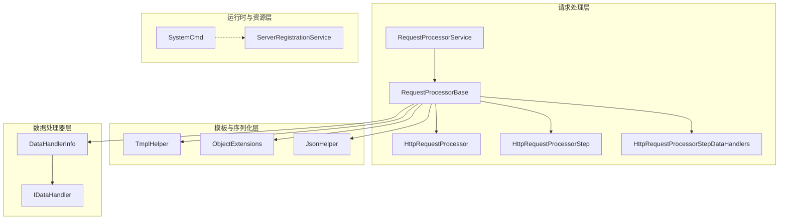
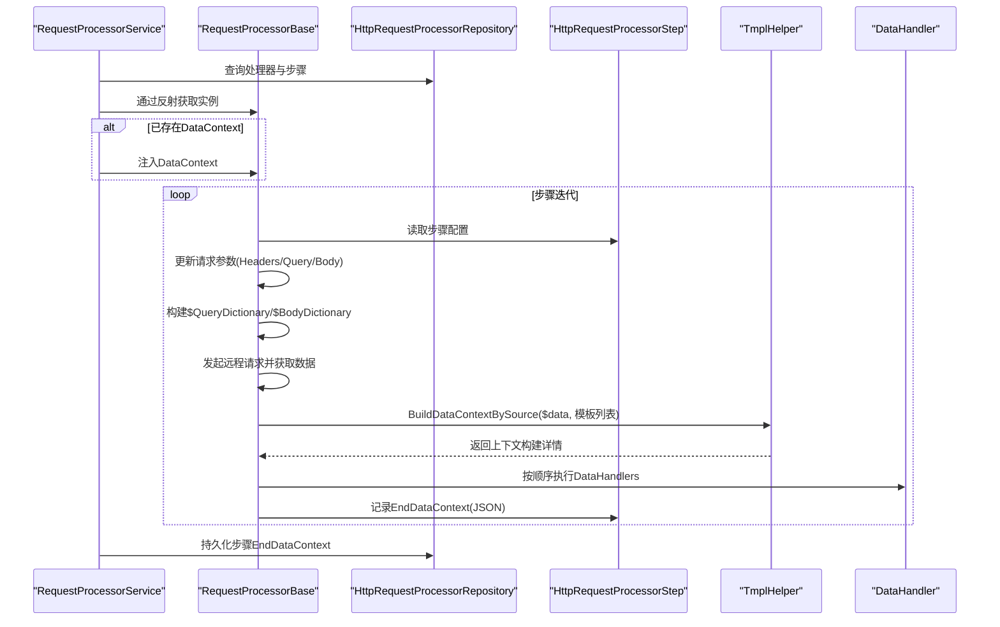
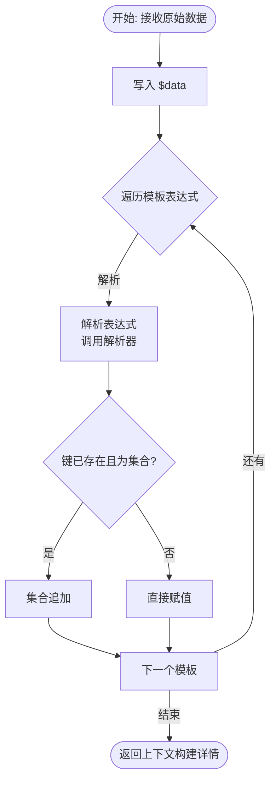
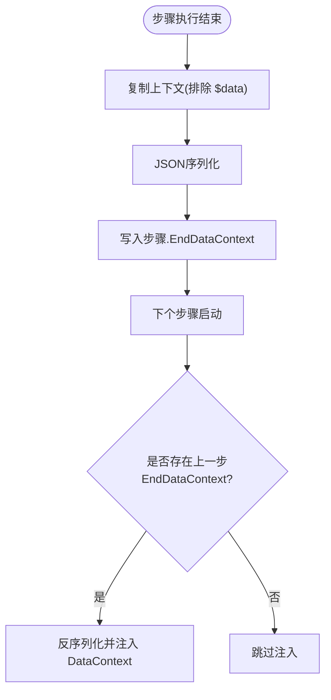
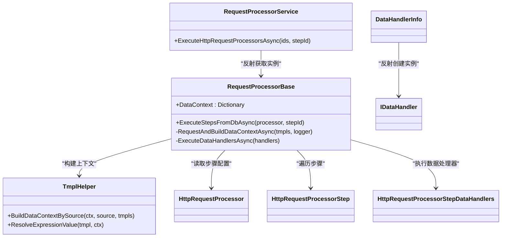

# 数据上下文管理

<cite>
**本文引用的文件**
- [HttpRequestProcessor.cs](file://Sylas.RemoteTasks.App/RequestProcessor/Models/HttpRequestProcessor.cs)
- [HttpRequestProcessorStep.cs](file://Sylas.RemoteTasks.App/RequestProcessor/Models/HttpRequestProcessorStep.cs)
- [RequestProcessorService.cs](file://Sylas.RemoteTasks.App/RequestProcessor/RequestProcessorService.cs)
- [RequestProcessorBase.cs](file://Sylas.RemoteTasks.App/RequestProcessor/RequestProcessorBase.cs)
- [HttpRequestProcessorExtensions.cs](file://Sylas.RemoteTasks.App/RequestProcessor/Models/HttpRequestProcessorExtensions.cs)
- [HttpRequestProcessorStepDataHandlers.cs](file://Sylas.RemoteTasks.App/RequestProcessor/Models/HttpRequestProcessorStepDataHandlers.cs)
- [TmplHelper.cs](file://Sylas.RemoteTasks.Utils/Template/TmplHelper.cs)
- [ObjectExtensions.cs](file://Sylas.RemoteTasks.Common/Extensions/ObjectExtensions.cs)
- [JsonHelper.cs](file://Sylas.RemoteTasks.Common/JsonHelper.cs)
- [DataHandler.cs](file://Sylas.RemoteTasks.App/DataHandlers/DataHandler.cs)
- [IDataHandler.cs](file://Sylas.RemoteTasks.App/DataHandlers/IDataHandler.cs)
- [SystemCmd.cs](file://Sylas.RemoteTasks.Utils/CommandExecutor/SystemCmd.cs)
- [ServerRegistrationService.cs](file://Sylas.RemoteTasks.App/BackgroundServices/ServerRegistrationService.cs)
</cite>

## 目录
1. [简介](#简介)
2. [项目结构](#项目结构)
3. [核心组件](#核心组件)
4. [架构总览](#架构总览)
5. [组件详解](#组件详解)
6. [依赖关系分析](#依赖关系分析)
7. [性能考量](#性能考量)
8. [故障排查指南](#故障排查指南)
9. [结论](#结论)
10. [附录：使用示例与配置](#附录使用示例与配置)

## 简介
本文件围绕“数据上下文管理”主题，系统阐述 DataContext 属性的设计理念、数据传递机制、状态持久化策略；详细说明上下文数据的序列化与反序列化流程、内存管理优化、数据安全保护；解释跨步骤的数据共享与数据隔离策略、并发访问控制；记录上下文数据的生命周期管理与清理机制、异常处理；并总结数据结构设计最佳实践、性能优化建议与调试技巧。同时提供可落地的使用示例与配置方法，帮助读者快速掌握该能力。

## 项目结构
本项目采用分层与功能域结合的组织方式：
- RequestProcessor 层：负责请求编排、步骤执行、上下文构建与持久化
- Utils.Template 层：提供模板解析与上下文变量构建能力
- Common 层：提供通用扩展与序列化辅助
- DataHandlers 层：提供数据处理器接口与信息模型
- BackgroundServices 层：提供后台任务调度与资源释放策略

图表来源
- [RequestProcessorService.cs](file://Sylas.RemoteTasks.App/RequestProcessor/RequestProcessorService.cs#L1-L72)
- [RequestProcessorBase.cs](file://Sylas.RemoteTasks.App/RequestProcessor/RequestProcessorBase.cs#L1-L279)
- [HttpRequestProcessor.cs](file://Sylas.RemoteTasks.App/RequestProcessor/Models/HttpRequestProcessor.cs#L1-L22)
- [HttpRequestProcessorStep.cs](file://Sylas.RemoteTasks.App/RequestProcessor/Models/HttpRequestProcessorStep.cs#L1-L19)
- [HttpRequestProcessorStepDataHandlers.cs](file://Sylas.RemoteTasks.App/RequestProcessor/Models/HttpRequestProcessorStepDataHandlers.cs#L1-L15)
- [TmplHelper.cs](file://Sylas.RemoteTasks.Utils/Template/TmplHelper.cs#L1-L740)
- [ObjectExtensions.cs](file://Sylas.RemoteTasks.Common/Extensions/ObjectExtensions.cs#L1-L191)
- [JsonHelper.cs](file://Sylas.RemoteTasks.Common/JsonHelper.cs#L105-L118)
- [DataHandler.cs](file://Sylas.RemoteTasks.App/DataHandlers/DataHandler.cs#L1-L16)
- [IDataHandler.cs](file://Sylas.RemoteTasks.App/DataHandlers/IDataHandler.cs#L1-L8)
- [SystemCmd.cs](file://Sylas.RemoteTasks.Utils/CommandExecutor/SystemCmd.cs#L580-L605)
- [ServerRegistrationService.cs](file://Sylas.RemoteTasks.App/BackgroundServices/ServerRegistrationService.cs#L163-L210)

章节来源
- [RequestProcessorService.cs](file://Sylas.RemoteTasks.App/RequestProcessor/RequestProcessorService.cs#L1-L72)
- [RequestProcessorBase.cs](file://Sylas.RemoteTasks.App/RequestProcessor/RequestProcessorBase.cs#L1-L279)
- [TmplHelper.cs](file://Sylas.RemoteTasks.Utils/Template/TmplHelper.cs#L1-L740)

## 核心组件
- DataContext 字典：贯穿请求处理的全局上下文，键以“$”开头，承载请求参数、响应数据、派生变量与临时状态
- RequestProcessorBase：请求编排与上下文管理的核心基类，负责初始化、步骤迭代、上下文构建、持久化与数据处理器调用
- TmplHelper：模板解析与上下文变量构建引擎，支持多种解析器（属性解析、集合拼接、正则截取、类型转换等）
- RequestProcessorService：服务入口，负责按配置加载处理器、设置 DataContext、执行步骤并持久化上下文
- DataHandler 体系：通过接口与信息模型解耦具体数据处理逻辑，按顺序执行

章节来源
- [RequestProcessorBase.cs](file://Sylas.RemoteTasks.App/RequestProcessor/RequestProcessorBase.cs#L18-L43)
- [TmplHelper.cs](file://Sylas.RemoteTasks.Utils/Template/TmplHelper.cs#L195-L271)
- [RequestProcessorService.cs](file://Sylas.RemoteTasks.App/RequestProcessor/RequestProcessorService.cs#L11-L69)
- [IDataHandler.cs](file://Sylas.RemoteTasks.App/DataHandlers/IDataHandler.cs#L1-L8)

## 架构总览
下图展示从服务入口到步骤执行、上下文构建与持久化的整体流程：

图表来源
- [RequestProcessorService.cs](file://Sylas.RemoteTasks.App/RequestProcessor/RequestProcessorService.cs#L11-L69)
- [RequestProcessorBase.cs](file://Sylas.RemoteTasks.App/RequestProcessor/RequestProcessorBase.cs#L83-L211)
- [HttpRequestProcessorStep.cs](file://Sylas.RemoteTasks.App/RequestProcessor/Models/HttpRequestProcessorStep.cs#L9-L14)
- [TmplHelper.cs](file://Sylas.RemoteTasks.Utils/Template/TmplHelper.cs#L213-L271)

## 组件详解

### DataContext 设计理念与数据传递机制
- 设计目标
  - 以字典为中心的轻量上下文，键统一以“$”开头，避免命名冲突
  - 将请求参数与响应数据统一纳入上下文，便于模板表达式与数据处理器直接消费
- 关键字段
  - $data：当前步骤的原始响应数据，作为模板解析的主数据源
  - $QueryDictionary/$BodyDictionary：请求参数快照，便于后续步骤复用
  - 自定义变量：通过模板表达式从 $data 或其他上下文变量派生而来
- 数据传递路径
  - 服务入口将上一阶段的 EndDataContext 反序列化并注入当前处理器实例
  - 每步执行时，先构建 $QueryDictionary/$BodyDictionary，再发起请求，随后调用模板引擎从 $data 中提取所需字段，写入上下文

章节来源
- [RequestProcessorBase.cs](file://Sylas.RemoteTasks.App/RequestProcessor/RequestProcessorBase.cs#L18-L43)
- [RequestProcessorBase.cs](file://Sylas.RemoteTasks.App/RequestProcessor/RequestProcessorBase.cs#L115-L123)
- [RequestProcessorBase.cs](file://Sylas.RemoteTasks.App/RequestProcessor/RequestProcessorBase.cs#L242-L244)

### 上下文构建与模板解析
- 模板语法与解析器
  - 支持多种解析器：属性解析、集合拼接、集合选择、正则截取、类型转换等
  - 表达式可嵌套，支持多值展开与字符串替换
- 构建流程
  - 将原始数据写入 $data
  - 逐条解析模板表达式，将结果写入上下文
  - 若键已存在且非集合，则进行集合合并（如 JArray 追加）
- 自引用解析
  - 支持上下文内变量互相引用，按顺序逐步解析

图表来源
- [TmplHelper.cs](file://Sylas.RemoteTasks.Utils/Template/TmplHelper.cs#L213-L271)
- [TmplHelper.cs](file://Sylas.RemoteTasks.Utils/Template/TmplHelper.cs#L461-L634)

章节来源
- [TmplHelper.cs](file://Sylas.RemoteTasks.Utils/Template/TmplHelper.cs#L195-L271)
- [TmplHelper.cs](file://Sylas.RemoteTasks.Utils/Template/TmplHelper.cs#L314-L328)

### 状态持久化策略
- 持久化时机
  - 每步执行结束后，仅持久化除 $data 外的上下文键值，避免将海量响应数据写回数据库
- 持久化内容
  - 将当前上下文字典序列化为 JSON，并写入步骤的 EndDataContext 字段
- 继承策略
  - 下一步骤启动时，若存在上一步 EndDataContext，则反序列化并注入当前处理器实例的 DataContext

图表来源
- [RequestProcessorBase.cs](file://Sylas.RemoteTasks.App/RequestProcessor/RequestProcessorBase.cs#L197-L206)
- [RequestProcessorBase.cs](file://Sylas.RemoteTasks.App/RequestProcessor/RequestProcessorBase.cs#L115-L119)
- [RequestProcessorService.cs](file://Sylas.RemoteTasks.App/RequestProcessor/RequestProcessorService.cs#L57-L61)

章节来源
- [RequestProcessorBase.cs](file://Sylas.RemoteTasks.App/RequestProcessor/RequestProcessorBase.cs#L197-L206)
- [RequestProcessorBase.cs](file://Sylas.RemoteTasks.App/RequestProcessor/RequestProcessorBase.cs#L115-L119)
- [RequestProcessorService.cs](file://Sylas.RemoteTasks.App/RequestProcessor/RequestProcessorService.cs#L57-L61)

### 序列化与反序列化过程
- 序列化
  - 上下文持久化：使用 JSON 序列化，键为字符串，值为对象或基础类型
- 反序列化
  - 从数据库读取 JSON，反序列化为字典，注入处理器实例
- 类型兼容
  - 支持 JObject/JToken/JsonElement 等类型，内部通过通用扩展与 JSON 辅助类进行转换

章节来源
- [RequestProcessorBase.cs](file://Sylas.RemoteTasks.App/RequestProcessor/RequestProcessorBase.cs#L117-L118)
- [RequestProcessorBase.cs](file://Sylas.RemoteTasks.App/RequestProcessor/RequestProcessorBase.cs#L205-L206)
- [ObjectExtensions.cs](file://Sylas.RemoteTasks.Common/Extensions/ObjectExtensions.cs#L23-L39)
- [JsonHelper.cs](file://Sylas.RemoteTasks.Common/JsonHelper.cs#L105-L118)

### 内存管理优化
- 避免保存 $data
  - 每步结束仅持久化除 $data 外的上下文，降低数据库写入与内存占用
- 作用域与资源释放
  - 后台服务每次循环创建独立作用域，完成后释放，避免大对象长期持有导致内存泄漏
- 大数据处理
  - 模板解析与序列化均基于流式与增量处理，减少中间对象数量

章节来源
- [RequestProcessorBase.cs](file://Sylas.RemoteTasks.App/RequestProcessor/RequestProcessorBase.cs#L197-L206)
- [ServerRegistrationService.cs](file://Sylas.RemoteTasks.App/BackgroundServices/ServerRegistrationService.cs#L196-L202)
- [SystemCmd.cs](file://Sylas.RemoteTasks.Utils/CommandExecutor/SystemCmd.cs#L580-L605)

### 数据安全保护
- 敏感信息处理
  - 通过数据处理器接口抽象，可在数据处理器中实现敏感字段脱敏、加密等策略
- 认证头注入
  - 支持从请求头中提取令牌并注入到请求配置，便于后续步骤使用
- 日志与审计
  - 模板解析过程可记录关键上下文片段，便于审计与问题定位

章节来源
- [RequestProcessorBase.cs](file://Sylas.RemoteTasks.App/RequestProcessor/RequestProcessorBase.cs#L85-L102)
- [IDataHandler.cs](file://Sylas.RemoteTasks.App/DataHandlers/IDataHandler.cs#L1-L8)

### 跨步骤的数据共享与隔离
- 共享机制
  - 通过 EndDataContext 的反序列化注入，实现步骤间变量共享
- 隔离策略
  - 每步执行前清空或重置无关变量，避免污染
  - $data 仅在当前步骤有效，不跨步持久化
- 并发控制
  - 通过服务端作用域与任务取消令牌，确保同一任务的并发安全

章节来源
- [RequestProcessorBase.cs](file://Sylas.RemoteTasks.App/RequestProcessor/RequestProcessorBase.cs#L115-L119)
- [RequestProcessorBase.cs](file://Sylas.RemoteTasks.App/RequestProcessor/RequestProcessorBase.cs#L197-L206)
- [ServerRegistrationService.cs](file://Sylas.RemoteTasks.App/BackgroundServices/ServerRegistrationService.cs#L182-L210)

### 生命周期管理与清理机制
- 初始化
  - 构造函数初始化默认请求配置与空上下文字典
- 执行
  - 每步执行前构建请求参数，执行后持久化上下文
- 清理
  - 作用域结束自动释放资源；后台服务循环内每次迭代均创建新作用域
- 异常处理
  - 请求失败抛出异常；模板解析失败抛出异常；服务层捕获并返回操作结果

章节来源
- [RequestProcessorBase.cs](file://Sylas.RemoteTasks.App/RequestProcessor/RequestProcessorBase.cs#L18-L43)
- [RequestProcessorBase.cs](file://Sylas.RemoteTasks.App/RequestProcessor/RequestProcessorBase.cs#L240-L249)
- [ServerRegistrationService.cs](file://Sylas.RemoteTasks.App/BackgroundServices/ServerRegistrationService.cs#L196-L202)

### 数据结构设计最佳实践
- 键命名规范
  - 统一使用“$”前缀，区分内置变量与业务变量
- 值类型选择
  - 优先使用可序列化类型；复杂结构通过 JSON 序列化存储
- 模板表达式
  - 优先使用解析器组合，避免在业务代码中硬编码复杂逻辑
- 变量覆盖与合并
  - 明确覆盖与合并规则，避免无意的数据丢失

章节来源
- [TmplHelper.cs](file://Sylas.RemoteTasks.Utils/Template/TmplHelper.cs#L240-L268)
- [HttpRequestProcessorStep.cs](file://Sylas.RemoteTasks.App/RequestProcessor/Models/HttpRequestProcessorStep.cs#L9-L14)

## 依赖关系分析

图表来源
- [RequestProcessorService.cs](file://Sylas.RemoteTasks.App/RequestProcessor/RequestProcessorService.cs#L11-L69)
- [RequestProcessorBase.cs](file://Sylas.RemoteTasks.App/RequestProcessor/RequestProcessorBase.cs#L83-L276)
- [TmplHelper.cs](file://Sylas.RemoteTasks.Utils/Template/TmplHelper.cs#L213-L271)
- [HttpRequestProcessor.cs](file://Sylas.RemoteTasks.App/RequestProcessor/Models/HttpRequestProcessor.cs#L1-L22)
- [HttpRequestProcessorStep.cs](file://Sylas.RemoteTasks.App/RequestProcessor/Models/HttpRequestProcessorStep.cs#L1-L19)
- [HttpRequestProcessorStepDataHandlers.cs](file://Sylas.RemoteTasks.App/RequestProcessor/Models/HttpRequestProcessorStepDataHandlers.cs#L1-L15)
- [DataHandler.cs](file://Sylas.RemoteTasks.App/DataHandlers/DataHandler.cs#L1-L16)
- [IDataHandler.cs](file://Sylas.RemoteTasks.App/DataHandlers/IDataHandler.cs#L1-L8)

## 性能考量
- 序列化成本
  - 仅持久化必要上下文，避免 $data 带来的序列化与 IO 开销
- 模板解析
  - 解析器缓存（解析器实例映射），减少反射与实例化开销
- 并发与资源
  - 后台服务循环内创建作用域，避免长生命周期持有大对象
- 大数据处理
  - 优先使用流式与增量处理，减少中间集合与深拷贝

章节来源
- [TmplHelper.cs](file://Sylas.RemoteTasks.Utils/Template/TmplHelper.cs#L451-L452)
- [ServerRegistrationService.cs](file://Sylas.RemoteTasks.App/BackgroundServices/ServerRegistrationService.cs#L196-L202)

## 故障排查指南
- 常见问题
  - 未找到 DataContext 属性：检查处理器类是否包含 DataContext 属性
  - 模板解析失败：确认模板表达式语法与解析器名称正确
  - EndDataContext 反序列化失败：检查 JSON 结构与键名一致性
  - 数据处理器未找到 StartAsync 方法：确认实现类与方法签名一致
- 调试技巧
  - 启用模板解析日志，观察上下文构建详情
  - 分步执行，逐步缩小问题范围
  - 使用作用域隔离，避免资源泄漏影响诊断

章节来源
- [RequestProcessorService.cs](file://Sylas.RemoteTasks.App/RequestProcessor/RequestProcessorService.cs#L29-L34)
- [RequestProcessorBase.cs](file://Sylas.RemoteTasks.App/RequestProcessor/RequestProcessorBase.cs#L240-L249)
- [TmplHelper.cs](file://Sylas.RemoteTasks.Utils/Template/TmplHelper.cs#L273-L307)

## 结论
DataContext 作为请求处理的中枢，通过模板引擎与数据处理器实现了高内聚、低耦合的数据流转与加工能力。其设计强调：
- 轻量与可序列化：避免保存 $data，仅持久化必要上下文
- 可扩展与可维护：解析器与数据处理器通过接口与反射解耦
- 安全与可观测：支持认证头注入、日志记录与异常传播
配合作用域与资源释放策略，整体具备良好的性能与稳定性表现。

## 附录：使用示例与配置
- 示例场景
  - 构建上下文：将响应数据中的某字段提取为变量，供后续步骤使用
  - 循环与条件：通过模板表达式与解析器组合实现集合处理与条件筛选
  - 数据处理器：在步骤末尾执行数据清洗、脱敏或入库
- 配置要点
  - 步骤配置：设置 DataContextBuilder、PresetDataContext、EndDataContext
  - 数据处理器：配置处理器类名与参数输入，按 OrderNo 排序
  - 服务入口：调用服务方法执行指定处理器与步骤

章节来源
- [HttpRequestProcessorStep.cs](file://Sylas.RemoteTasks.App/RequestProcessor/Models/HttpRequestProcessorStep.cs#L9-L14)
- [HttpRequestProcessorStepDataHandlers.cs](file://Sylas.RemoteTasks.App/RequestProcessor/Models/HttpRequestProcessorStepDataHandlers.cs#L7-L12)
- [RequestProcessorService.cs](file://Sylas.RemoteTasks.App/RequestProcessor/RequestProcessorService.cs#L11-L69)