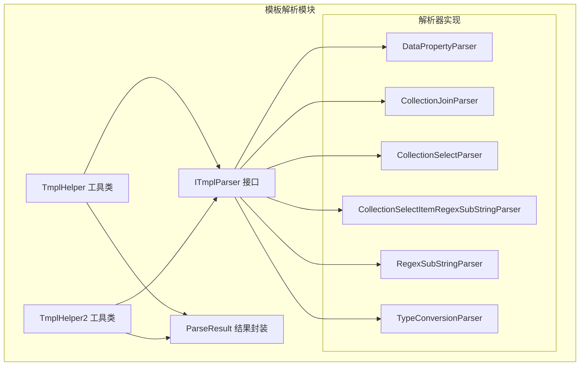
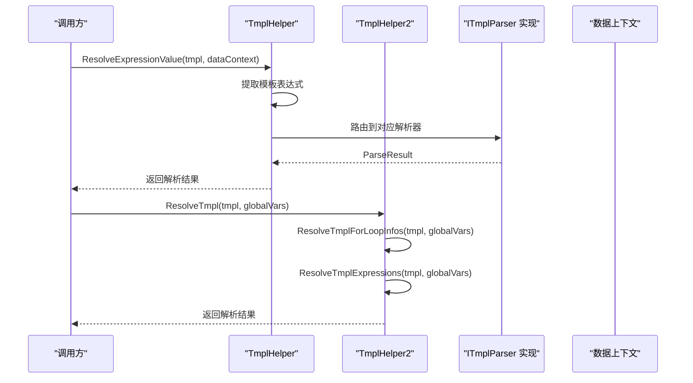
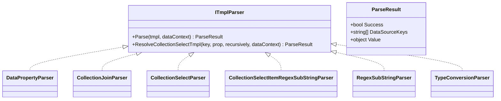
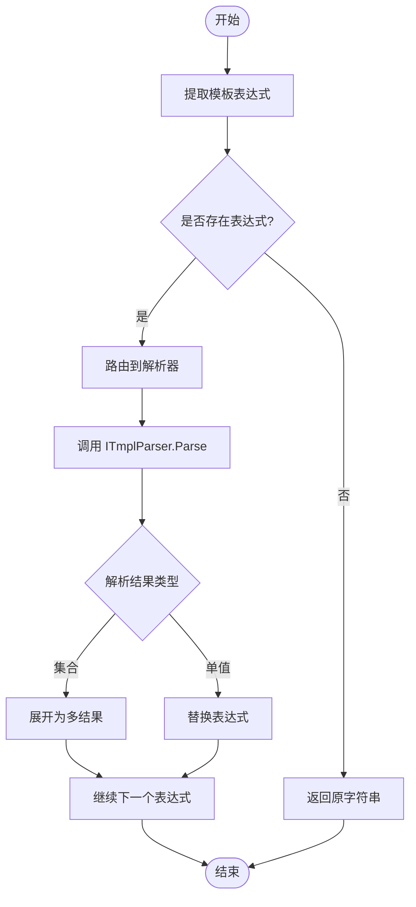
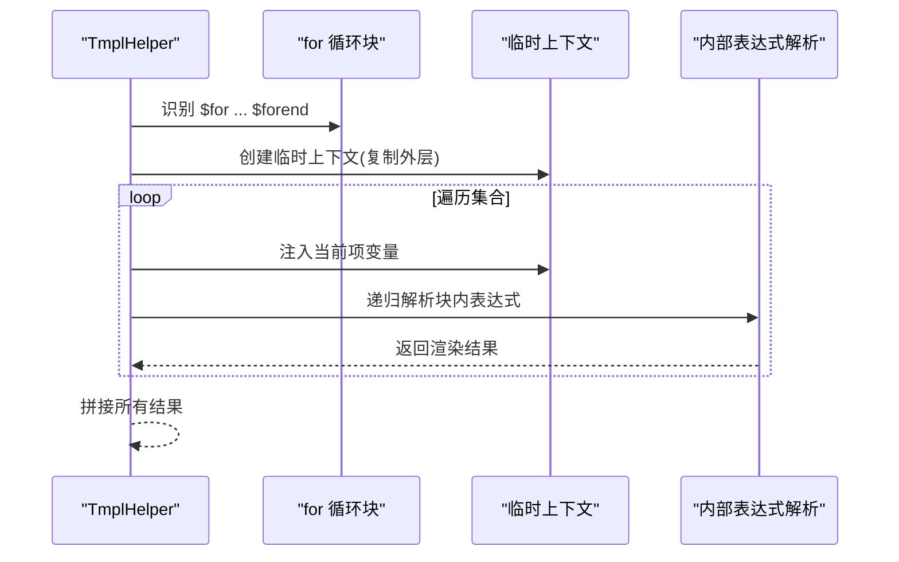
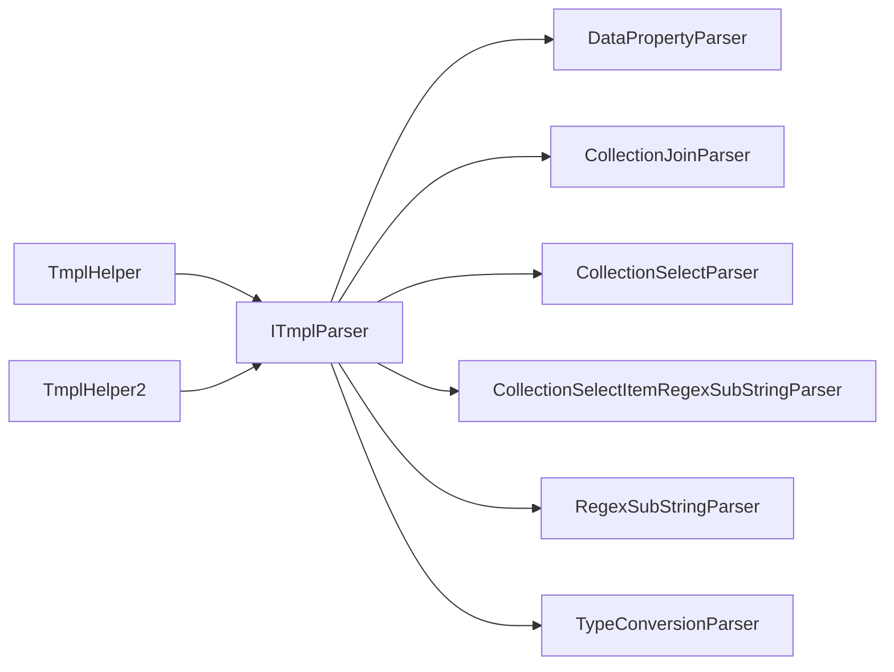

# 模板解析机制

<cite>
**本文档引用的文件**
- [ITmplParser.cs](file://Sylas.RemoteTasks.Utils/Template/Parser/ITmplParser.cs)
- [ParseResult.cs](file://Sylas.RemoteTasks.Utils/Template/Parser/ParseResult.cs)
- [DataPropertyParser.cs](file://Sylas.RemoteTasks.Utils/Template/Parser/DataPropertyParser.cs)
- [CollectionJoinParser.cs](file://Sylas.RemoteTasks.Utils/Template/Parser/CollectionJoinParser.cs)
- [CollectionSelectParser.cs](file://Sylas.RemoteTasks.Utils/Template/Parser/CollectionSelectParser.cs)
- [CollectionSelectItemRegexSubStringParser.cs](file://Sylas.RemoteTasks.Utils/Template/Parser/CollectionSelectItemRegexSubStringParser.cs)
- [RegexSubStringParser.cs](file://Sylas.RemoteTasks.Utils/Template/Parser/RegexSubStringParser.cs)
- [TypeConversionParser.cs](file://Sylas.RemoteTasks.Utils/Template/Parser/TypeConversionParser.cs)
- [TmplHelper.cs](file://Sylas.RemoteTasks.Utils/Template/TmplHelper.cs)
- [TmplHelper2.cs](file://Sylas.RemoteTasks.Utils/Template/TmplHelper2.cs)
- [ResolveTmplDto.cs](file://Sylas.RemoteTasks.Utils/Template/Dtos/ResolveTmplDto.cs)
</cite>

## 目录
1. [简介](#简介)
2. [项目结构](#项目结构)
3. [核心组件](#核心组件)
4. [架构总览](#架构总览)
5. [详细组件分析](#详细组件分析)
6. [依赖关系分析](#依赖关系分析)
7. [性能考虑](#性能考虑)
8. [故障排除指南](#故障排除指南)
9. [结论](#结论)
10. [附录](#附录)

## 简介
本文件系统性阐述模板解析机制的设计与实现，覆盖以下主题：
- 解析器接口与实现模式：ITmplParser 的职责边界、解析结果封装、解析器链组合策略
- 解析流程与数据绑定：从模板表达式到数据上下文的映射、表达式提取与替换、数组/集合处理
- 条件渲染与循环处理：基于块的 for 循环解析、嵌套循环上下文隔离
- 函数/管道式调用：表达式链式解析、正则提取、集合选择与类型转换
- 缓存机制：解析器实例缓存、日志与调试支持
- 性能优化与错误处理：正则匹配优化、集合展开策略、异常传播与容错
- 语法规范与内置函数：模板语法、解析器语法、内置解析器能力清单
- 自定义解析器开发指南：接口契约、返回约定、最佳实践
- 示例与最佳实践：典型场景、常见陷阱与规避建议

## 项目结构
模板解析相关代码集中在 Sylas.RemoteTasks.Utils 模块的 Template 与 Template/Parser 目录下，采用“接口 + 多实现 + 工具类”的分层设计：
- 接口层：ITmplParser 定义统一解析协议
- 结果封装：ParseResult 统一承载解析状态与数据
- 解析器实现：针对不同任务（属性访问、集合连接、集合选择、正则截取、类型转换）的专用解析器
- 工具类：TmplHelper 与 TmplHelper2 提供模板解析入口、表达式解析、循环处理、日志与调试

图表来源
- [ITmplParser.cs](file://Sylas.RemoteTasks.Utils/Template/Parser/ITmplParser.cs#L20-L29)
- [ParseResult.cs](file://Sylas.RemoteTasks.Utils/Template/Parser/ParseResult.cs#L6-L39)
- [DataPropertyParser.cs](file://Sylas.RemoteTasks.Utils/Template/Parser/DataPropertyParser.cs#L16-L25)
- [CollectionJoinParser.cs](file://Sylas.RemoteTasks.Utils/Template/Parser/CollectionJoinParser.cs#L13-L22)
- [CollectionSelectParser.cs](file://Sylas.RemoteTasks.Utils/Template/Parser/CollectionSelectParser.cs#L9-L17)
- [CollectionSelectItemRegexSubStringParser.cs](file://Sylas.RemoteTasks.Utils/Template/Parser/CollectionSelectItemRegexSubStringParser.cs#L13-L22)
- [RegexSubStringParser.cs](file://Sylas.RemoteTasks.Utils/Template/Parser/RegexSubStringParser.cs#L11-L20)
- [TypeConversionParser.cs](file://Sylas.RemoteTasks.Utils/Template/Parser/TypeConversionParser.cs#L15-L25)
- [TmplHelper.cs](file://Sylas.RemoteTasks.Utils/Template/TmplHelper.cs#L461-L634)
- [TmplHelper2.cs](file://Sylas.RemoteTasks.Utils/Template/TmplHelper2.cs#L27-L31)

章节来源
- [ITmplParser.cs](file://Sylas.RemoteTasks.Utils/Template/Parser/ITmplParser.cs#L1-L105)
- [ParseResult.cs](file://Sylas.RemoteTasks.Utils/Template/Parser/ParseResult.cs#L1-L42)
- [TmplHelper.cs](file://Sylas.RemoteTasks.Utils/Template/TmplHelper.cs#L1-L740)
- [TmplHelper2.cs](file://Sylas.RemoteTasks.Utils/Template/TmplHelper2.cs#L1-L416)

## 核心组件
- ITmplParser 接口：定义 Parse 方法，负责将模板表达式解析为具体值，并返回 ParseResult；提供静态工具方法用于集合选择
- ParseResult 结果封装：包含 Success、DataSourceKeys、Value 三个关键字段，统一解析结果的返回形态
- 解析器实现：
  - DataPropertyParser：解析对象属性、数组索引、多级路径
  - CollectionJoinParser：将集合按分隔符拼接为字符串
  - CollectionSelectParser：从集合中抽取指定属性，支持递归
  - CollectionSelectItemRegexSubStringParser：对集合属性值做正则截取
  - RegexSubStringParser：对字符串按正则分组截取
  - TypeConversionParser：将字符串转换为对象或列表
- 工具类：
  - TmplHelper：面向表达式与块的解析，支持 for 循环块、上下文构建、自引用解析、日志记录
  - TmplHelper2：面向表达式的解析与管道式提取，支持 for 循环语法、数组/集合选择、正则提取

章节来源
- [ITmplParser.cs](file://Sylas.RemoteTasks.Utils/Template/Parser/ITmplParser.cs#L20-L103)
- [ParseResult.cs](file://Sylas.RemoteTasks.Utils/Template/Parser/ParseResult.cs#L6-L39)
- [DataPropertyParser.cs](file://Sylas.RemoteTasks.Utils/Template/Parser/DataPropertyParser.cs#L25-L142)
- [CollectionJoinParser.cs](file://Sylas.RemoteTasks.Utils/Template/Parser/CollectionJoinParser.cs#L22-L69)
- [CollectionSelectParser.cs](file://Sylas.RemoteTasks.Utils/Template/Parser/CollectionSelectParser.cs#L17-L30)
- [CollectionSelectItemRegexSubStringParser.cs](file://Sylas.RemoteTasks.Utils/Template/Parser/CollectionSelectItemRegexSubStringParser.cs#L22-L61)
- [RegexSubStringParser.cs](file://Sylas.RemoteTasks.Utils/Template/Parser/RegexSubStringParser.cs#L20-L36)
- [TypeConversionParser.cs](file://Sylas.RemoteTasks.Utils/Template/Parser/TypeConversionParser.cs#L25-L99)
- [TmplHelper.cs](file://Sylas.RemoteTasks.Utils/Template/TmplHelper.cs#L461-L719)
- [TmplHelper2.cs](file://Sylas.RemoteTasks.Utils/Template/TmplHelper2.cs#L27-L396)

## 架构总览
模板解析采用“表达式解析器 + 块处理器”的双通道架构：
- 表达式通道：TmplHelper.ResolveExpressionValue 与 TmplHelper2.ResolveTmplExpressions 负责从模板中提取表达式，按解析器语法路由到具体 ITmplParser 实现
- 块通道：TmplHelper.RenderTemplateWithForLoopBlocks 与 TmplHelper2.ResolveTmplForLoopInfos 负责识别 for 循环块/语法，生成上下文并递归解析块内表达式
- 上下文管理：数据上下文统一为 Dictionary<string, object>，支持自引用解析、集合追加、临时上下文隔离

图表来源
- [TmplHelper.cs](file://Sylas.RemoteTasks.Utils/Template/TmplHelper.cs#L461-L634)
- [TmplHelper2.cs](file://Sylas.RemoteTasks.Utils/Template/TmplHelper2.cs#L27-L81)
- [ITmplParser.cs](file://Sylas.RemoteTasks.Utils/Template/Parser/ITmplParser.cs#L29-L29)

## 详细组件分析

### ITmplParser 接口与解析器链
- 接口职责：Parse(tmpl, dataContext) → ParseResult
- 静态工具：ResolveCollectionSelectTmpl 支持集合选择与递归
- 解析器链组合策略：
  - 表达式解析：优先匹配解析器语法（如 Parser[...]），否则回退默认 DataPropertyParser
  - 多表达式串联：逐个解析并替换，支持数组展开为多结果
  - 块内解析：for 循环块内独立上下文，避免污染外层

图表来源
- [ITmplParser.cs](file://Sylas.RemoteTasks.Utils/Template/Parser/ITmplParser.cs#L20-L103)
- [ParseResult.cs](file://Sylas.RemoteTasks.Utils/Template/Parser/ParseResult.cs#L6-L39)
- [DataPropertyParser.cs](file://Sylas.RemoteTasks.Utils/Template/Parser/DataPropertyParser.cs#L16-L25)
- [CollectionJoinParser.cs](file://Sylas.RemoteTasks.Utils/Template/Parser/CollectionJoinParser.cs#L13-L22)
- [CollectionSelectParser.cs](file://Sylas.RemoteTasks.Utils/Template/Parser/CollectionSelectParser.cs#L9-L17)
- [CollectionSelectItemRegexSubStringParser.cs](file://Sylas.RemoteTasks.Utils/Template/Parser/CollectionSelectItemRegexSubStringParser.cs#L13-L22)
- [RegexSubStringParser.cs](file://Sylas.RemoteTasks.Utils/Template/Parser/RegexSubStringParser.cs#L11-L20)
- [TypeConversionParser.cs](file://Sylas.RemoteTasks.Utils/Template/Parser/TypeConversionParser.cs#L15-L25)

章节来源
- [ITmplParser.cs](file://Sylas.RemoteTasks.Utils/Template/Parser/ITmplParser.cs#L20-L103)
- [ParseResult.cs](file://Sylas.RemoteTasks.Utils/Template/Parser/ParseResult.cs#L6-L39)

### 表达式解析与数据绑定
- 表达式提取：使用正则匹配 $var、${...}、{{...}} 形式
- 上下文绑定：Dictionary<string, object> 作为数据源，键名可带 $ 前缀
- 解析流程：
  - 识别解析器语法：Parser[expr] → 实例化解析器并调用 Parse
  - 默认属性解析：DataPropertyParser 支持 key、key[index]、key.prop、key[n].prop...
  - 数组展开：当解析值为集合时，生成多条结果（每项替换一次）
  - 自引用解析：支持字符串内再次解析已解析的表达式

图表来源
- [TmplHelper.cs](file://Sylas.RemoteTasks.Utils/Template/TmplHelper.cs#L482-L586)
- [DataPropertyParser.cs](file://Sylas.RemoteTasks.Utils/Template/Parser/DataPropertyParser.cs#L25-L142)
- [CollectionJoinParser.cs](file://Sylas.RemoteTasks.Utils/Template/Parser/CollectionJoinParser.cs#L22-L69)

章节来源
- [TmplHelper.cs](file://Sylas.RemoteTasks.Utils/Template/TmplHelper.cs#L461-L586)

### 条件渲染与循环处理
- for 循环块：TmplHelper 支持 $for ... $forend 块，块内可嵌套，每项生成独立上下文
- for 语法：TmplHelper2 支持 for (item in $collection) { ... } 语法，块内表达式可忽略不存在的变量
- 上下文隔离：每次进入 for 循环创建新字典，复制外层上下文并注入当前项，避免变量覆盖

图表来源
- [TmplHelper.cs](file://Sylas.RemoteTasks.Utils/Template/TmplHelper.cs#L641-L719)
- [TmplHelper2.cs](file://Sylas.RemoteTasks.Utils/Template/TmplHelper2.cs#L369-L396)

章节来源
- [TmplHelper.cs](file://Sylas.RemoteTasks.Utils/Template/TmplHelper.cs#L339-L449)
- [TmplHelper2.cs](file://Sylas.RemoteTasks.Utils/Template/TmplHelper2.cs#L27-L396)

### 函数/管道式调用
- 管道链：TmplHelper2 支持表达式链式调用，如 key | func(args) | func2(args)
- 内置函数/特性：
  - select(prop)：抽取集合属性
  - selectr(prop, regex...)：抽取属性后正则过滤
  - r(str, regex...)：对字符串进行正则提取
  - as type：类型转换（List/Object）

章节来源
- [TmplHelper2.cs](file://Sylas.RemoteTasks.Utils/Template/TmplHelper2.cs#L185-L362)

### 缓存机制
- 解析器实例缓存：TmplHelper 内部维护 _parserObjectMap，按解析器类型名缓存实例，避免重复反射创建
- 日志与调试：TmplHelper 提供日志记录方法，便于追踪解析过程与中间结果

章节来源
- [TmplHelper.cs](file://Sylas.RemoteTasks.Utils/Template/TmplHelper.cs#L451-L451)
- [TmplHelper.cs](file://Sylas.RemoteTasks.Utils/Template/TmplHelper.cs#L273-L307)

## 依赖关系分析
- 组件耦合：
  - TmplHelper 依赖 ITmplParser 及其所有实现
  - TmplHelper2 独立实现表达式解析与管道提取，减少对 ITmplParser 的直接依赖
- 外部依赖：
  - JSON 序列化/反序列化（Newtonsoft.Json、System.Text.Json）
  - 正则表达式（System.Text.RegularExpressions）
  - 日志（LoggerHelper）

图表来源
- [TmplHelper.cs](file://Sylas.RemoteTasks.Utils/Template/TmplHelper.cs#L608-L620)
- [ITmplParser.cs](file://Sylas.RemoteTasks.Utils/Template/Parser/ITmplParser.cs#L20-L29)

章节来源
- [TmplHelper.cs](file://Sylas.RemoteTasks.Utils/Template/TmplHelper.cs#L608-L620)
- [TmplHelper2.cs](file://Sylas.RemoteTasks.Utils/Template/TmplHelper2.cs#L185-L362)

## 性能考虑
- 正则匹配优化：表达式提取与解析器语法匹配尽量复用，避免重复编译
- 集合展开策略：仅在必要时展开为多结果，减少内存占用
- 解析器实例缓存：避免频繁反射创建解析器实例
- 早期失败：对不可迭代集合、数组越界、属性缺失等立即抛出异常，避免无效计算

## 故障排除指南
- 常见错误与定位：
  - 表达式语法错误：检查 $var、${...}、{{...}} 格式是否正确
  - 解析器未找到：确认解析器名称与实现类一致，确保程序集可被反射发现
  - 数组越界：核对索引与集合长度
  - 属性不存在：核对大小写与嵌套路径
- 调试建议：
  - 使用 TmplHelper 的日志记录功能查看中间状态
  - 对复杂表达式拆分为多个简单表达式逐步验证
  - 在 TmplHelper2 中启用 ignoreNotExistExpressions 进行容错测试

章节来源
- [TmplHelper.cs](file://Sylas.RemoteTasks.Utils/Template/TmplHelper.cs#L273-L307)
- [TmplHelper2.cs](file://Sylas.RemoteTasks.Utils/Template/TmplHelper2.cs#L58-L68)

## 结论
该模板解析机制通过“接口 + 多实现 + 工具类”的架构实现了高扩展性与强表达力：
- ITmplParser 明确了解析契约，ParseResult 统一结果形态
- 解析器链组合策略支持复杂表达式与管道式调用
- 块处理器与上下文隔离保障了循环与条件渲染的正确性
- 缓存与日志提升了性能与可观测性
- 建议在生产环境中结合容错策略与单元测试，确保解析稳定性

## 附录

### 模板语法规范
- 表达式形式
  - $var：引用数据上下文变量
  - ${...}、{{...}}：花括号包裹的表达式
- 解析器语法
  - Parser[expr]：显式指定解析器与表达式
  - 默认：DataPropertyParser 支持 key、key[index]、key.prop、key[n].prop...
- for 循环
  - TmplHelper：$for item in $list ... $forend
  - TmplHelper2：for (item in $list) { ... }

章节来源
- [TmplHelper.cs](file://Sylas.RemoteTasks.Utils/Template/TmplHelper.cs#L384-L411)
- [TmplHelper2.cs](file://Sylas.RemoteTasks.Utils/Template/TmplHelper2.cs#L369-L396)

### 内置解析器能力清单
- DataPropertyParser：对象属性、数组索引、多级路径访问
- CollectionJoinParser：集合连接为字符串
- CollectionSelectParser：集合属性抽取，支持递归
- CollectionSelectItemRegexSubStringParser：集合属性正则截取
- RegexSubStringParser：字符串正则分组截取
- TypeConversionParser：字符串到对象/列表转换

章节来源
- [DataPropertyParser.cs](file://Sylas.RemoteTasks.Utils/Template/Parser/DataPropertyParser.cs#L25-L142)
- [CollectionJoinParser.cs](file://Sylas.RemoteTasks.Utils/Template/Parser/CollectionJoinParser.cs#L22-L69)
- [CollectionSelectParser.cs](file://Sylas.RemoteTasks.Utils/Template/Parser/CollectionSelectParser.cs#L17-L30)
- [CollectionSelectItemRegexSubStringParser.cs](file://Sylas.RemoteTasks.Utils/Template/Parser/CollectionSelectItemRegexSubStringParser.cs#L22-L61)
- [RegexSubStringParser.cs](file://Sylas.RemoteTasks.Utils/Template/Parser/RegexSubStringParser.cs#L20-L36)
- [TypeConversionParser.cs](file://Sylas.RemoteTasks.Utils/Template/Parser/TypeConversionParser.cs#L25-L99)

### 自定义解析器开发指南
- 实现 ITmplParser 接口，提供 Parse(tmpl, dataContext) 方法
- 返回 ParseResult：Success、DataSourceKeys、Value
- 语法约定：
  - 支持 Parser[expr] 语法，其中 Parser 为解析器类名（不含命名空间）
  - expr 为解析器内部语法，建议清晰、可读
- 最佳实践：
  - 明确 DataSourceKeys，便于缓存与调试
  - 对集合展开与类型转换提供明确的错误提示
  - 避免在 Parse 中引入外部副作用，保持幂等性

章节来源
- [ITmplParser.cs](file://Sylas.RemoteTasks.Utils/Template/Parser/ITmplParser.cs#L20-L29)
- [ParseResult.cs](file://Sylas.RemoteTasks.Utils/Template/Parser/ParseResult.cs#L6-L39)

### 示例与最佳实践
- 示例场景
  - 构建数据上下文：使用 BuildDataContextBySource 与解析器语法组合
  - 表达式解析：使用 ResolveExpressionValue 或 ResolveTmpl
  - 循环渲染：使用 for 块或 for 语法，注意上下文隔离
- 最佳实践
  - 将复杂表达式拆分为多个简单表达式，便于调试
  - 对集合操作使用 CollectionSelectParser 与 CollectionJoinParser
  - 使用正则提取时，先用 CollectionSelectItemRegexSubStringParser 抽取再截取
  - 在生产中启用日志记录，记录关键中间结果

章节来源
- [TmplHelper.cs](file://Sylas.RemoteTasks.Utils/Template/TmplHelper.cs#L213-L271)
- [TmplHelper2.cs](file://Sylas.RemoteTasks.Utils/Template/TmplHelper2.cs#L27-L81)