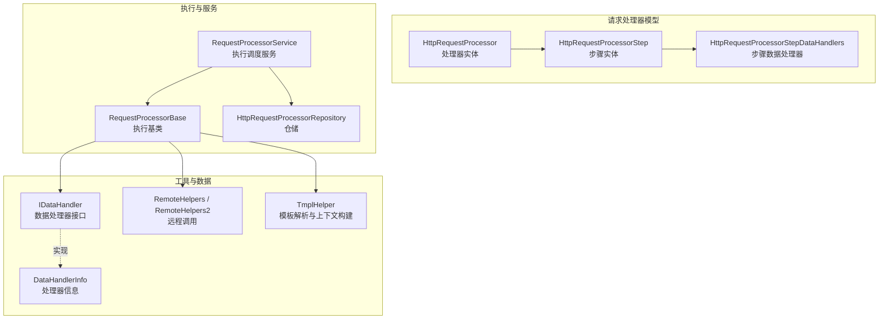
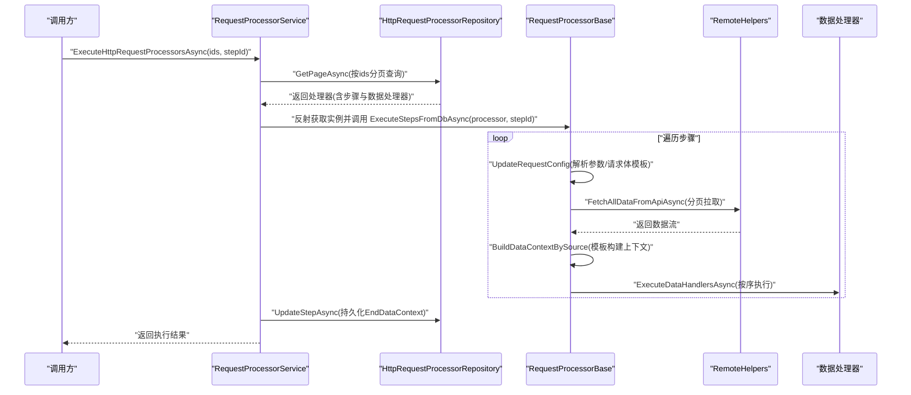
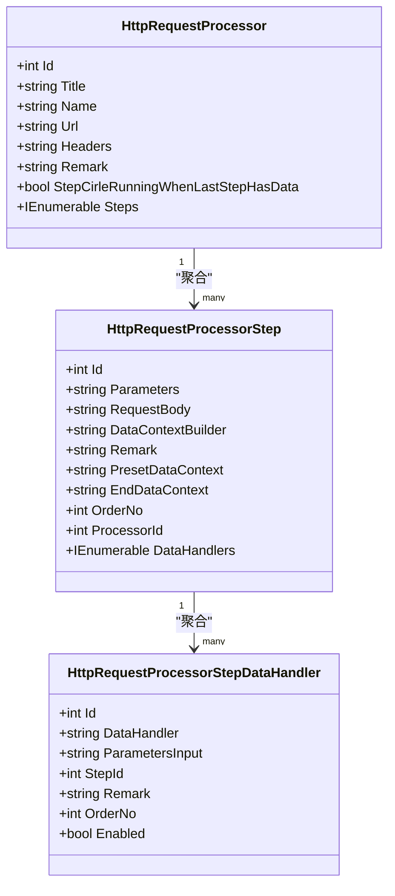
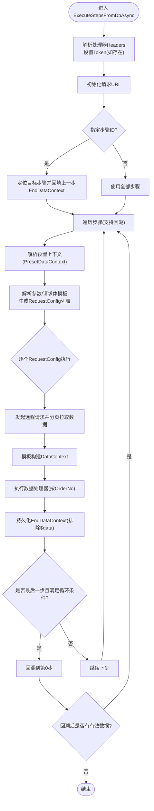
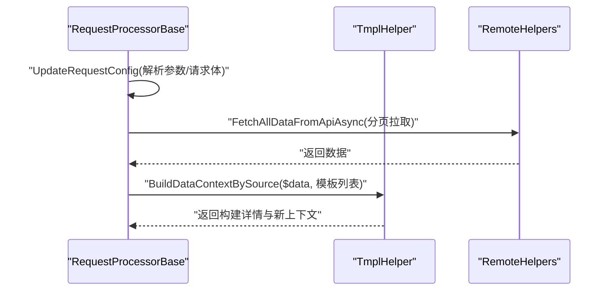
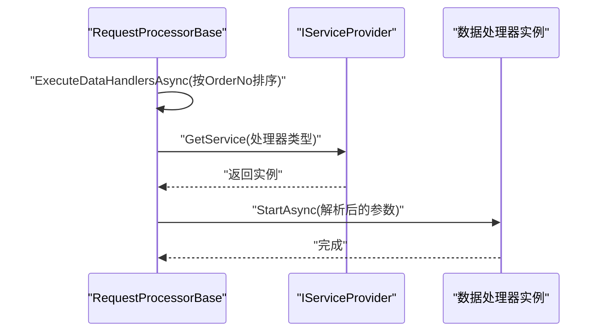
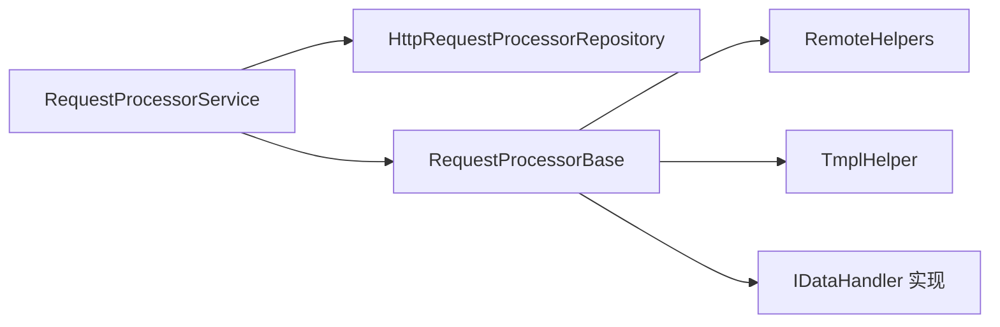
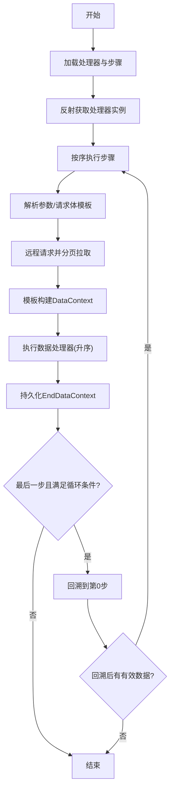

# 步骤执行流程

<cite>
**本文引用的文件**
- [HttpRequestProcessor.cs](file://Sylas.RemoteTasks.App/RequestProcessor/Models/HttpRequestProcessor.cs)
- [HttpRequestProcessorStep.cs](file://Sylas.RemoteTasks.App/RequestProcessor/Models/HttpRequestProcessorStep.cs)
- [HttpRequestProcessorEntity.cs](file://Sylas.RemoteTasks.App/RequestProcessor/Models/HttpRequestProcessorEntity.cs)
- [HttpRequestProcessorStepEntity.cs](file://Sylas.RemoteTasks.App/RequestProcessor/Models/HttpRequestProcessorStepEntity.cs)
- [HttpRequestProcessorStepDataHandlers.cs](file://Sylas.RemoteTasks.App/RequestProcessor/Models/HttpRequestProcessorStepDataHandlers.cs)
- [HttpRequestProcessorInDto.cs](file://Sylas.RemoteTasks.App/RequestProcessor/Models/Dtos/HttpRequestProcessorInDto.cs)
- [RequestProcessorBase.cs](file://Sylas.RemoteTasks.App/RequestProcessor/RequestProcessorBase.cs)
- [RequestProcessorService.cs](file://Sylas.RemoteTasks.App/RequestProcessor/RequestProcessorService.cs)
- [HttpRequestProcessorRepository.cs](file://Sylas.RemoteTasks.App/RequestProcessor/HttpRequestProcessorRepository.cs)
- [IDataHandler.cs](file://Sylas.RemoteTasks.App/DataHandlers/IDataHandler.cs)
- [DataHandler.cs](file://Sylas.RemoteTasks.App/DataHandlers/DataHandler.cs)
- [RemoteHelpers.cs](file://Sylas.RemoteTasks.Utils/RemoteHelpers.cs)
- [RemoteHelpers2.cs](file://Sylas.RemoteTasks.Utils/RemoteHelpers2.cs)
- [TmplHelper.cs](file://Sylas.RemoteTasks.Utils/Template/TmplHelper.cs)
- [MultiThreadsHttpRequestDto.cs](file://Sylas.RemoteTasks.Utils/CommandExecutor/MultiThreadsHttpRequestDto.cs)
</cite>

## 目录
1. [引言](#引言)
2. [项目结构](#项目结构)
3. [核心组件](#核心组件)
4. [架构总览](#架构总览)
5. [详细组件分析](#详细组件分析)
6. [依赖关系分析](#依赖关系分析)
7. [性能考量](#性能考量)
8. [故障排查指南](#故障排查指南)
9. [结论](#结论)
10. [附录](#附录)

## 引言
本文件围绕“步骤执行流程”展开，系统性阐述 HttpRequestProcessor 与 HttpRequestProcessorStep 的设计模式、执行顺序、生命周期管理、状态跟踪、错误恢复策略、步骤间依赖与条件判断、并行执行支持、上下文传递与数据流控制、异常传播机制，并给出配置最佳实践、性能优化技巧与调试方法。文中所有技术细节均基于仓库中的实际代码实现。

## 项目结构
与步骤执行流程直接相关的模块主要位于以下位置：
- RequestProcessor 模型与服务：定义处理器、步骤、数据处理器实体及执行服务
- 数据处理器接口与信息载体：定义数据处理器契约与参数信息
- 工具与远程调用：封装远程 API 分页拉取、模板解析与数据上下文构建
- 仓储层：负责处理器、步骤、数据处理器的持久化与关联加载

图表来源
- [HttpRequestProcessor.cs](file://Sylas.RemoteTasks.App/RequestProcessor/Models/HttpRequestProcessor.cs#L9-L20)
- [HttpRequestProcessorStep.cs](file://Sylas.RemoteTasks.App/RequestProcessor/Models/HttpRequestProcessorStep.cs#L3-L17)
- [HttpRequestProcessorStepDataHandlers.cs](file://Sylas.RemoteTasks.App/RequestProcessor/Models/HttpRequestProcessorStepDataHandlers.cs#L3-L13)
- [RequestProcessorBase.cs](file://Sylas.RemoteTasks.App/RequestProcessor/RequestProcessorBase.cs#L12-L43)
- [RequestProcessorService.cs](file://Sylas.RemoteTasks.App/RequestProcessor/RequestProcessorService.cs#L7-L71)
- [HttpRequestProcessorRepository.cs](file://Sylas.RemoteTasks.App/RequestProcessor/HttpRequestProcessorRepository.cs#L11-L411)
- [IDataHandler.cs](file://Sylas.RemoteTasks.App/DataHandlers/IDataHandler.cs#L3-L6)
- [DataHandler.cs](file://Sylas.RemoteTasks.App/DataHandlers/DataHandler.cs#L3-L14)
- [RemoteHelpers.cs](file://Sylas.RemoteTasks.Utils/RemoteHelpers.cs#L147-L470)
- [RemoteHelpers2.cs](file://Sylas.RemoteTasks.Utils/RemoteHelpers2.cs#L48-L364)
- [TmplHelper.cs](file://Sylas.RemoteTasks.Utils/Template/TmplHelper.cs#L213-L238)

章节来源
- [HttpRequestProcessor.cs](file://Sylas.RemoteTasks.App/RequestProcessor/Models/HttpRequestProcessor.cs#L9-L20)
- [RequestProcessorService.cs](file://Sylas.RemoteTasks.App/RequestProcessor/RequestProcessorService.cs#L11-L69)

## 核心组件
- HttpRequestProcessor：顶层处理器，包含标题、名称、URL、请求头、备注、是否在最后一步有数据时循环执行等字段；聚合多个步骤。
- HttpRequestProcessorStep：单个执行步骤，包含参数模板、请求体模板、上下文构建模板、预置上下文、结束上下文、排序号、所属处理器ID、数据处理器集合。
- RequestProcessorBase：执行基类，负责：
  - 解析请求参数与请求体（模板解析）
  - 发起远程请求并分页拉取数据
  - 构建数据上下文（模板解析）
  - 执行步骤内的数据处理器
  - 维护 DataContext 上下文并在步骤间传递
  - 支持“最后一步有数据时循环执行”的回溯逻辑
- RequestProcessorService：执行调度服务，负责：
  - 通过仓储加载处理器及其步骤与数据处理器
  - 通过反射获取处理器实例并调用 ExecuteStepsFromDbAsync
  - 将上一步的 DataContext 传递给下一个处理器实例
  - 持久化每步结束后的 EndDataContext
- HttpRequestProcessorRepository：仓储层，负责：
  - 分页查询处理器、步骤、数据处理器
  - 关联装载步骤与数据处理器
  - 提供增删改查与克隆能力
- IDataHandler/DataHandlerInfo：数据处理器接口与处理器信息载体，用于在步骤内按序执行具体的数据处理任务。

章节来源
- [HttpRequestProcessor.cs](file://Sylas.RemoteTasks.App/RequestProcessor/Models/HttpRequestProcessor.cs#L9-L20)
- [HttpRequestProcessorStep.cs](file://Sylas.RemoteTasks.App/RequestProcessor/Models/HttpRequestProcessorStep.cs#L3-L17)
- [RequestProcessorBase.cs](file://Sylas.RemoteTasks.App/RequestProcessor/RequestProcessorBase.cs#L83-L211)
- [RequestProcessorService.cs](file://Sylas.RemoteTasks.App/RequestProcessor/RequestProcessorService.cs#L11-L69)
- [HttpRequestProcessorRepository.cs](file://Sylas.RemoteTasks.App/RequestProcessor/HttpRequestProcessorRepository.cs#L23-L47)
- [IDataHandler.cs](file://Sylas.RemoteTasks.App/DataHandlers/IDataHandler.cs#L3-L6)
- [DataHandler.cs](file://Sylas.RemoteTasks.App/DataHandlers/DataHandler.cs#L3-L14)

## 架构总览
整体执行链路如下：
- RequestProcessorService 加载处理器与步骤
- 通过反射获取处理器实例并调用 ExecuteStepsFromDbAsync
- 在 ExecuteStepsFromDbAsync 中逐步骤执行：
  - 解析参数与请求体模板
  - 发起远程请求并分页拉取数据
  - 使用模板构建 DataContext
  - 执行步骤内的数据处理器（按 OrderNo 排序）
  - 循环执行到最后一步且满足条件时回溯到第一步
  - 持久化 EndDataContext

图表来源
- [RequestProcessorService.cs](file://Sylas.RemoteTasks.App/RequestProcessor/RequestProcessorService.cs#L11-L69)
- [HttpRequestProcessorRepository.cs](file://Sylas.RemoteTasks.App/RequestProcessor/HttpRequestProcessorRepository.cs#L23-L47)
- [RequestProcessorBase.cs](file://Sylas.RemoteTasks.App/RequestProcessor/RequestProcessorBase.cs#L83-L211)
- [RemoteHelpers.cs](file://Sylas.RemoteTasks.Utils/RemoteHelpers.cs#L147-L470)
- [TmplHelper.cs](file://Sylas.RemoteTasks.Utils/Template/TmplHelper.cs#L213-L238)

## 详细组件分析

### HttpRequestProcessor 与 HttpRequestProcessorStep 设计模式
- 设计模式：组合聚合模式 + 配置驱动
  - 处理器聚合多个步骤，步骤再聚合多个数据处理器
  - 参数、请求体、上下文构建、预置上下文、结束上下文均以字符串模板形式存储，运行时解析
- 生命周期：
  - 创建：通过 DTO 映射为实体并入库
  - 运行：按步骤顺序执行，支持指定步骤或全量执行
  - 结束：持久化 EndDataContext，便于后续步骤复用
- 状态跟踪：
  - 通过 EndDataContext 记录每步结束时的上下文快照
  - 支持“最后一步有数据时循环执行”，通过回溯索引实现

图表来源
- [HttpRequestProcessor.cs](file://Sylas.RemoteTasks.App/RequestProcessor/Models/HttpRequestProcessor.cs#L9-L20)
- [HttpRequestProcessorStep.cs](file://Sylas.RemoteTasks.App/RequestProcessor/Models/HttpRequestProcessorStep.cs#L3-L17)
- [HttpRequestProcessorStepDataHandlers.cs](file://Sylas.RemoteTasks.App/RequestProcessor/Models/HttpRequestProcessorStepDataHandlers.cs#L3-L13)

章节来源
- [HttpRequestProcessor.cs](file://Sylas.RemoteTasks.App/RequestProcessor/Models/HttpRequestProcessor.cs#L9-L20)
- [HttpRequestProcessorStep.cs](file://Sylas.RemoteTasks.App/RequestProcessor/Models/HttpRequestProcessorStep.cs#L3-L17)
- [HttpRequestProcessorStepDataHandlers.cs](file://Sylas.RemoteTasks.App/RequestProcessor/Models/HttpRequestProcessorStepDataHandlers.cs#L3-L13)

### RequestProcessorBase 执行顺序与生命周期
- 执行入口：ExecuteStepsFromDbAsync(processor, stepId)
- 步骤选择：
  - stepId > 0：仅执行目标步骤
  - stepId = 0：按顺序执行全部步骤
- 步骤内流程：
  - 解析参数与请求体模板，生成 RequestConfig 列表
  - 对每个 RequestConfig 发起请求并分页拉取数据
  - 使用模板构建 DataContext，并记录构建详情
  - 执行步骤内数据处理器（按 OrderNo 升序）
  - 持久化 EndDataContext（排除 $data）
- 回溯逻辑：
  - 当到达最后一步且满足“最后一步有数据时循环执行”条件时，回溯到第0步
  - 若回溯后任一构建项非空，则继续循环；否则终止回溯

图表来源
- [RequestProcessorBase.cs](file://Sylas.RemoteTasks.App/RequestProcessor/RequestProcessorBase.cs#L83-L211)

章节来源
- [RequestProcessorBase.cs](file://Sylas.RemoteTasks.App/RequestProcessor/RequestProcessorBase.cs#L83-L211)

### 数据上下文传递与模板解析
- 上下文构建：
  - 将原始数据注入 $data
  - 通过模板表达式将 $data 中的字段映射到新的上下文键
  - 记录构建详情，便于调试与追踪
- 参数与请求体解析：
  - 使用模板引擎解析 Parameters 与 RequestBody
  - 支持 POST 请求体解析
- 上下文传递：
  - 上一步 EndDataContext 作为下一步 PresetDataContext 的一部分
  - 支持通过反射将 DataContext 注入到下一个处理器实例

图表来源
- [RequestProcessorBase.cs](file://Sylas.RemoteTasks.App/RequestProcessor/RequestProcessorBase.cs#L59-L74)
- [RequestProcessorBase.cs](file://Sylas.RemoteTasks.App/RequestProcessor/RequestProcessorBase.cs#L236-L255)
- [TmplHelper.cs](file://Sylas.RemoteTasks.Utils/Template/TmplHelper.cs#L213-L238)
- [RemoteHelpers.cs](file://Sylas.RemoteTasks.Utils/RemoteHelpers.cs#L147-L470)

章节来源
- [RequestProcessorBase.cs](file://Sylas.RemoteTasks.App/RequestProcessor/RequestProcessorBase.cs#L59-L74)
- [RequestProcessorBase.cs](file://Sylas.RemoteTasks.App/RequestProcessor/RequestProcessorBase.cs#L236-L255)
- [TmplHelper.cs](file://Sylas.RemoteTasks.Utils/Template/TmplHelper.cs#L213-L238)

### 数据处理器执行与并行支持
- 执行顺序：
  - 步骤内数据处理器按 OrderNo 升序执行
  - 通过反射获取处理器类型并调用 StartAsync
- 并行支持：
  - 代码中未见显式并行执行逻辑
  - 若需并行，可在数据处理器内部自行实现并行（注意线程安全与幂等性）

图表来源
- [RequestProcessorBase.cs](file://Sylas.RemoteTasks.App/RequestProcessor/RequestProcessorBase.cs#L256-L276)
- [IDataHandler.cs](file://Sylas.RemoteTasks.App/DataHandlers/IDataHandler.cs#L3-L6)

章节来源
- [RequestProcessorBase.cs](file://Sylas.RemoteTasks.App/RequestProcessor/RequestProcessorBase.cs#L256-L276)
- [IDataHandler.cs](file://Sylas.RemoteTasks.App/DataHandlers/IDataHandler.cs#L3-L6)

### 错误恢复策略与异常传播
- 异常传播：
  - 远程请求异常直接抛出
  - 模板解析或数据构建异常直接抛出
  - 数据处理器异常直接抛出
- 恢复策略：
  - 通过持久化 EndDataContext，使后续步骤可从上一步状态继续
  - 回溯逻辑在最后一步无有效数据时自动终止，避免无限循环
  - 建议在数据处理器内部增加重试与降级策略（由实现方决定）

章节来源
- [RequestProcessorBase.cs](file://Sylas.RemoteTasks.App/RequestProcessor/RequestProcessorBase.cs#L240-L249)
- [RequestProcessorBase.cs](file://Sylas.RemoteTasks.App/RequestProcessor/RequestProcessorBase.cs#L173-L192)

### 条件判断与依赖关系处理
- 条件判断：
  - “最后一步有数据时循环执行”：通过布尔标志控制
  - 回溯后若任一构建项非空则继续循环
- 依赖关系：
  - 步骤间依赖通过 EndDataContext 与 PresetDataContext 传递
  - 数据处理器之间无隐式依赖，需在模板或处理器中显式声明

章节来源
- [RequestProcessorBase.cs](file://Sylas.RemoteTasks.App/RequestProcessor/RequestProcessorBase.cs#L144-L150)
- [RequestProcessorBase.cs](file://Sylas.RemoteTasks.App/RequestProcessor/RequestProcessorBase.cs#L173-L192)

## 依赖关系分析
- 组件耦合：
  - RequestProcessorService 依赖仓储与反射机制
  - RequestProcessorBase 依赖远程调用与模板解析
  - 数据处理器通过接口解耦，按序执行
- 外部依赖：
  - HTTP 客户端（远程调用）
  - JSON 解析与模板引擎
  - 数据库提供者（仓储）

图表来源
- [RequestProcessorService.cs](file://Sylas.RemoteTasks.App/RequestProcessor/RequestProcessorService.cs#L7-L71)
- [RequestProcessorBase.cs](file://Sylas.RemoteTasks.App/RequestProcessor/RequestProcessorBase.cs#L12-L43)
- [RemoteHelpers.cs](file://Sylas.RemoteTasks.Utils/RemoteHelpers.cs#L147-L470)
- [TmplHelper.cs](file://Sylas.RemoteTasks.Utils/Template/TmplHelper.cs#L213-L238)
- [IDataHandler.cs](file://Sylas.RemoteTasks.App/DataHandlers/IDataHandler.cs#L3-L6)

章节来源
- [RequestProcessorService.cs](file://Sylas.RemoteTasks.App/RequestProcessor/RequestProcessorService.cs#L7-L71)
- [RequestProcessorBase.cs](file://Sylas.RemoteTasks.App/RequestProcessor/RequestProcessorBase.cs#L12-L43)

## 性能考量
- 分页拉取与数据上下文构建：
  - 使用异步流式拉取，避免一次性加载大量数据
  - 构建 DataContext 时排除 $data，减少持久化体积
- 模板解析：
  - 模板表达式解析在运行时进行，建议简化表达式，避免复杂嵌套
- 数据处理器：
  - 若需并行，可在处理器内部实现（注意线程安全）
- 远程调用：
  - 合理设置超时与重试策略，避免阻塞整个执行链

章节来源
- [RemoteHelpers.cs](file://Sylas.RemoteTasks.Utils/RemoteHelpers.cs#L147-L470)
- [RequestProcessorBase.cs](file://Sylas.RemoteTasks.App/RequestProcessor/RequestProcessorBase.cs#L197-L206)

## 故障排查指南
- 常见问题与定位：
  - 处理器或步骤缺失：检查仓储加载与过滤条件
  - 反射获取实例失败：确认处理器类型名称与注册
  - 模板解析异常：检查 Parameters、RequestBody、DataContextBuilder 的语法
  - 远程请求失败：检查 URL、Headers、分页参数与响应校验字段
- 调试建议：
  - 启用日志，关注请求参数、响应数据与上下文构建详情
  - 使用最小化步骤与数据处理器验证流程
  - 逐步缩小范围，优先验证首步与末步

章节来源
- [RequestProcessorService.cs](file://Sylas.RemoteTasks.App/RequestProcessor/RequestProcessorService.cs#L23-L28)
- [RequestProcessorBase.cs](file://Sylas.RemoteTasks.App/RequestProcessor/RequestProcessorBase.cs#L85-L102)
- [RequestProcessorBase.cs](file://Sylas.RemoteTasks.App/RequestProcessor/RequestProcessorBase.cs#L236-L255)

## 结论
HttpRequestProcessor 与 HttpRequestProcessorStep 通过“配置驱动 + 模板解析 + 有序执行”的方式，实现了灵活、可扩展的步骤执行框架。RequestProcessorBase 提供了完善的上下文管理、远程调用与数据处理器执行能力；RequestProcessorService 负责装配与调度；仓储层保证了配置与状态的持久化。结合回溯与 EndDataContext 持久化，系统具备良好的状态恢复与可维护性。

## 附录

### 配置最佳实践
- 处理器配置
  - 名称：确保与已注册的处理器类型一致
  - URL：指向稳定的远程接口
  - Headers：Authorization 使用 Bearer Token
  - 循环执行：仅在最后一步确有数据时启用
- 步骤配置
  - Parameters/RequestBody：使用模板表达式，避免硬编码
  - DataContextBuilder：明确映射规则，避免冗余字段
  - PresetDataContext：仅放入必要字段，减少上下文体积
  - DataHandlers：按依赖顺序设置 OrderNo
- 数据处理器
  - StartAsync 参数使用模板表达式，便于动态传参
  - 内部实现幂等与可重入，必要时加入重试与降级

章节来源
- [HttpRequestProcessorInDto.cs](file://Sylas.RemoteTasks.App/RequestProcessor/Models/Dtos/HttpRequestProcessorInDto.cs#L3-L11)
- [HttpRequestProcessor.cs](file://Sylas.RemoteTasks.App/RequestProcessor/Models/HttpRequestProcessor.cs#L18-L19)
- [RequestProcessorBase.cs](file://Sylas.RemoteTasks.App/RequestProcessor/RequestProcessorBase.cs#L59-L74)
- [RequestProcessorBase.cs](file://Sylas.RemoteTasks.App/RequestProcessor/RequestProcessorBase.cs#L138-L141)
- [RequestProcessorBase.cs](file://Sylas.RemoteTasks.App/RequestProcessor/RequestProcessorBase.cs#L152-L161)
- [RequestProcessorBase.cs](file://Sylas.RemoteTasks.App/RequestProcessor/RequestProcessorBase.cs#L256-L276)

### 执行流程图（概念示意）

[此图为概念示意，不直接映射具体源文件，故不提供图表来源]

### 并行执行支持说明
- 当前步骤内数据处理器按序执行，未见显式并行逻辑
- 若需并行，可在数据处理器内部实现（注意线程安全与幂等性），并评估对共享资源的影响

章节来源
- [RequestProcessorBase.cs](file://Sylas.RemoteTasks.App/RequestProcessor/RequestProcessorBase.cs#L256-L276)
- [MultiThreadsHttpRequestDto.cs](file://Sylas.RemoteTasks.Utils/CommandExecutor/MultiThreadsHttpRequestDto.cs#L8-L18)