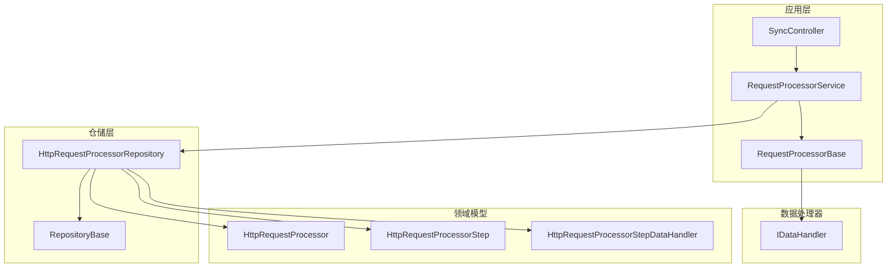
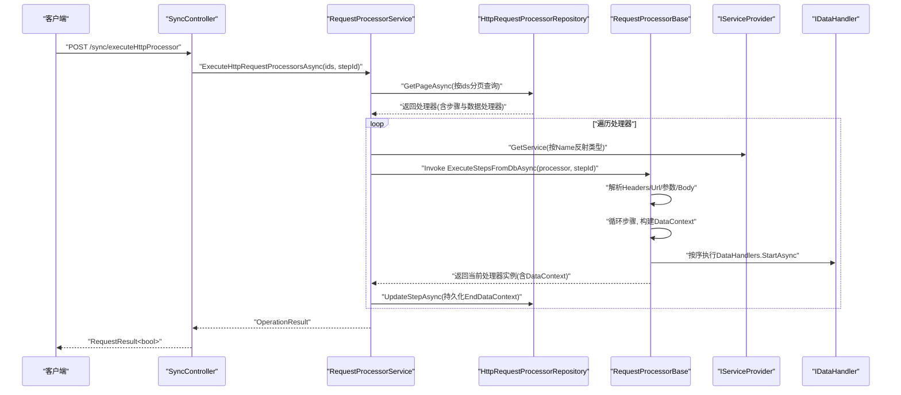
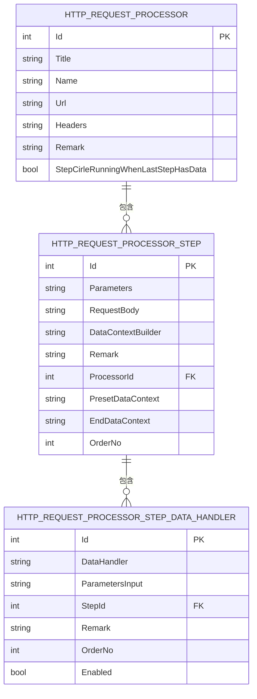
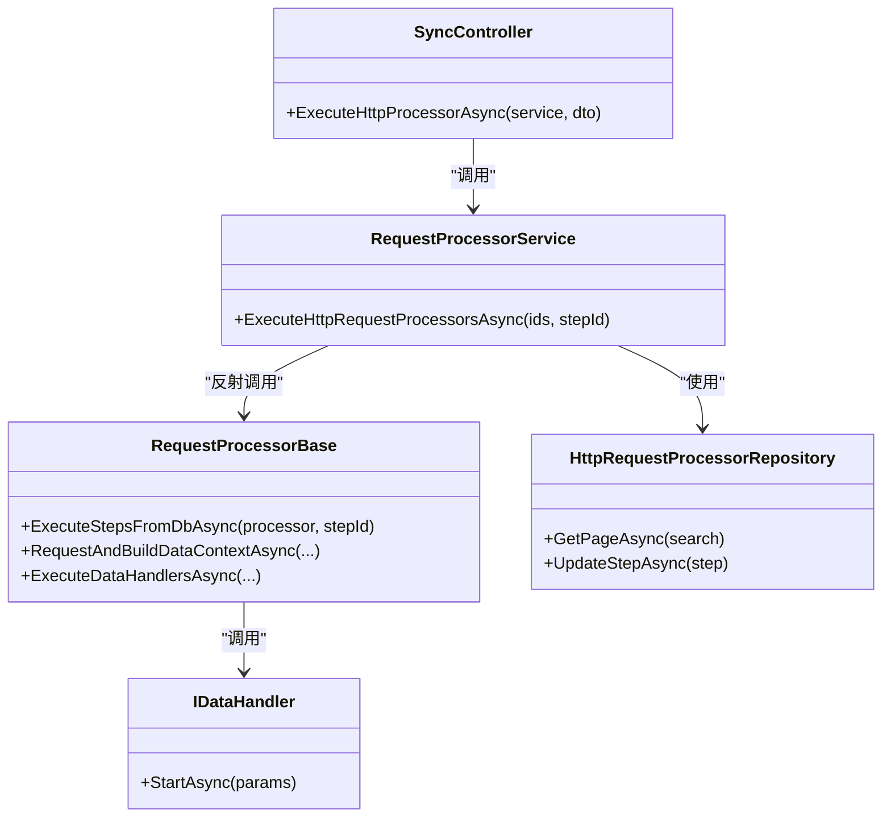

# 请求处理器系统

<cite>
**本文档引用的文件**
- [RequestProcessorService.cs](file://Sylas.RemoteTasks.App/RequestProcessor/RequestProcessorService.cs)
- [RequestProcessorBase.cs](file://Sylas.RemoteTasks.App/RequestProcessor/RequestProcessorBase.cs)
- [HttpRequestProcessorRepository.cs](file://Sylas.RemoteTasks.App/RequestProcessor/HttpRequestProcessorRepository.cs)
- [HttpRequestProcessor.cs](file://Sylas.RemoteTasks.App/RequestProcessor/Models/HttpRequestProcessor.cs)
- [HttpRequestProcessorEntity.cs](file://Sylas.RemoteTasks.App/RequestProcessor/Models/HttpRequestProcessorEntity.cs)
- [HttpRequestProcessorStep.cs](file://Sylas.RemoteTasks.App/RequestProcessor/Models/HttpRequestProcessorStep.cs)
- [HttpRequestProcessorStepEntity.cs](file://Sylas.RemoteTasks.App/RequestProcessor/Models/HttpRequestProcessorStepEntity.cs)
- [HttpRequestProcessorStepDataHandlers.cs](file://Sylas.RemoteTasks.App/RequestProcessor/Models/HttpRequestProcessorStepDataHandlers.cs)
- [HttpRequestProcessorExtensions.cs](file://Sylas.RemoteTasks.App/RequestProcessor/Models/HttpRequestProcessorExtensions.cs)
- [HttpRequestProcessorInDto.cs](file://Sylas.RemoteTasks.App/RequestProcessor/Models/Dtos/HttpRequestProcessorInDto.cs)
- [IDataHandler.cs](file://Sylas.RemoteTasks.App/DataHandlers/IDataHandler.cs)
- [RepositoryBase.cs](file://Sylas.RemoteTasks.App/Infrastructure/RepositoryBase.cs)
- [SyncController.cs](file://Sylas.RemoteTasks.App/Controllers/SyncController.cs)
- [Program.cs](file://Sylas.RemoteTasks.App/Program.cs)
</cite>

## 目录
1. [简介](#简介)
2. [项目结构](#项目结构)
3. [核心组件](#核心组件)
4. [架构总览](#架构总览)
5. [详细组件分析](#详细组件分析)
6. [依赖关系分析](#依赖关系分析)
7. [性能考量](#性能考量)
8. [故障排查指南](#故障排查指南)
9. [结论](#结论)
10. [附录](#附录)

## 简介
本文件围绕请求处理器系统（RequestProcessor）进行深入说明，重点覆盖 RequestProcessorService 的实现细节、调用关系、接口契约、领域模型与使用模式。系统通过“处理器-步骤-数据处理器”的三层结构，将一次或多次 HTTP 请求与数据处理流程解耦，支持按步骤执行、上下文传递、条件回溯与持久化，适用于复杂的数据采集与同步场景。

## 项目结构
请求处理器系统位于应用层的 RequestProcessor 子目录，配合仓储层与数据处理器模块协同工作。关键文件组织如下：
- 服务层：RequestProcessorService（调度执行）、RequestProcessorBase（执行基类）
- 仓储层：HttpRequestProcessorRepository（统一管理处理器、步骤、数据处理器）
- 领域模型：HttpRequestProcessor、HttpRequestProcessorStep、HttpRequestProcessorStepDataHandler 及其实体映射
- 数据处理器接口：IDataHandler（约定 StartAsync 执行入口）
- 控制器：SyncController（对外暴露执行入口）
- 启动注册：Program.cs（DI 注册）

图表来源
- [RequestProcessorService.cs](file://Sylas.RemoteTasks.App/RequestProcessor/RequestProcessorService.cs#L1-L72)
- [RequestProcessorBase.cs](file://Sylas.RemoteTasks.App/RequestProcessor/RequestProcessorBase.cs#L1-L279)
- [HttpRequestProcessorRepository.cs](file://Sylas.RemoteTasks.App/RequestProcessor/HttpRequestProcessorRepository.cs#L1-L412)
- [RepositoryBase.cs](file://Sylas.RemoteTasks.App/Infrastructure/RepositoryBase.cs#L1-L233)
- [SyncController.cs](file://Sylas.RemoteTasks.App/Controllers/SyncController.cs#L29-L37)

章节来源
- [RequestProcessorService.cs](file://Sylas.RemoteTasks.App/RequestProcessor/RequestProcessorService.cs#L1-L72)
- [RequestProcessorBase.cs](file://Sylas.RemoteTasks.App/RequestProcessor/RequestProcessorBase.cs#L1-L279)
- [HttpRequestProcessorRepository.cs](file://Sylas.RemoteTasks.App/RequestProcessor/HttpRequestProcessorRepository.cs#L1-L412)
- [RepositoryBase.cs](file://Sylas.RemoteTasks.App/Infrastructure/RepositoryBase.cs#L1-L233)
- [SyncController.cs](file://Sylas.RemoteTasks.App/Controllers/SyncController.cs#L29-L37)

## 核心组件
- RequestProcessorService：负责批量调度处理器执行，动态反射获取处理器实例，按步骤顺序执行，并在每步结束后持久化上下文。
- RequestProcessorBase：封装 HTTP 请求、上下文构建、步骤循环与回溯、数据处理器执行等通用逻辑。
- HttpRequestProcessorRepository：统一管理处理器、步骤、数据处理器的增删改查与级联克隆。
- 领域模型：处理器、步骤、数据处理器三者构成可配置的流水线；扩展类提供 DTO 映射。
- IDataHandler：数据处理器接口，约定 StartAsync 作为执行入口。
- SyncController：对外提供执行入口，接收 ProcessorExecuteDto 并调用服务层。

章节来源
- [RequestProcessorService.cs](file://Sylas.RemoteTasks.App/RequestProcessor/RequestProcessorService.cs#L11-L69)
- [RequestProcessorBase.cs](file://Sylas.RemoteTasks.App/RequestProcessor/RequestProcessorBase.cs#L83-L211)
- [HttpRequestProcessorRepository.cs](file://Sylas.RemoteTasks.App/RequestProcessor/HttpRequestProcessorRepository.cs#L23-L48)
- [IDataHandler.cs](file://Sylas.RemoteTasks.App/DataHandlers/IDataHandler.cs#L1-L8)
- [SyncController.cs](file://Sylas.RemoteTasks.App/Controllers/SyncController.cs#L29-L37)

## 架构总览
请求处理器系统采用“配置驱动 + 反射 + 仓储”的架构模式：
- 配置驱动：处理器、步骤、数据处理器均以 JSON 字符串形式存储参数与模板，便于可视化编辑与动态扩展。
- 反射执行：服务层通过类型名反射获取处理器实例，调用 ExecuteStepsFromDbAsync 执行步骤。
- 仓储聚合：一次性加载处理器、步骤与数据处理器，避免 N+1 查询，提升执行效率。
- 上下文传递：每步执行后的 DataContext 仅持久化必要字段，避免大对象写入数据库。

图表来源
- [SyncController.cs](file://Sylas.RemoteTasks.App/Controllers/SyncController.cs#L29-L37)
- [RequestProcessorService.cs](file://Sylas.RemoteTasks.App/RequestProcessor/RequestProcessorService.cs#L11-L69)
- [RequestProcessorBase.cs](file://Sylas.RemoteTasks.App/RequestProcessor/RequestProcessorBase.cs#L83-L211)
- [HttpRequestProcessorRepository.cs](file://Sylas.RemoteTasks.App/RequestProcessor/HttpRequestProcessorRepository.cs#L23-L48)
- [IDataHandler.cs](file://Sylas.RemoteTasks.App/DataHandlers/IDataHandler.cs#L1-L8)

## 详细组件分析

### RequestProcessorService
职责与行为
- 接收处理器 ID 数组与可选的 stepId，批量拉取处理器及其步骤、数据处理器。
- 逐个处理器执行：反射获取类型、注入 DataContext、调用 ExecuteStepsFromDbAsync。
- 将每步执行后的 DataContext 持久化至 EndDataContext，支持断点续跑与回溯。
- 支持 stepId 指定步骤执行，或全量执行。

关键实现要点
- 使用反射与 IServiceProvider 获取处理器实例，确保运行时可插拔。
- 通过 Repository 的聚合查询减少数据库往返。
- 对返回值进行 Task/Task<T> 类型判断，保证异步执行一致性。
- 在 stepId>0 时提前退出，实现“单步执行”。

章节来源
- [RequestProcessorService.cs](file://Sylas.RemoteTasks.App/RequestProcessor/RequestProcessorService.cs#L11-L69)

### RequestProcessorBase
职责与行为
- 统一请求配置（URL、Headers、Query/Body、分页字段、Token 等）。
- 解析步骤参数与请求体，支持模板表达式解析。
- 执行步骤循环：支持 stepId 指定、步骤回溯（当最后一步有数据时循环回到首步）。
- 构建 DataContext 并持久化 EndDataContext，避免持久化大对象。
- 调用 IDataHandler.StartAsync 执行数据处理器。

关键实现要点
- UpdateRequestConfig 支持 Query/Body 参数模板解析与合并。
- ExecuteStepsFromDbAsync 内部处理 Headers 中 Authorization 的 Bearer 提取。
- RequestAndBuildDataContextAsync 调用远程接口并构建 DataContext。
- ExecuteDataHandlersAsync 按 OrderNo 排序执行数据处理器。

章节来源
- [RequestProcessorBase.cs](file://Sylas.RemoteTasks.App/RequestProcessor/RequestProcessorBase.cs#L19-L43)
- [RequestProcessorBase.cs](file://Sylas.RemoteTasks.App/RequestProcessor/RequestProcessorBase.cs#L59-L74)
- [RequestProcessorBase.cs](file://Sylas.RemoteTasks.App/RequestProcessor/RequestProcessorBase.cs#L83-L211)
- [RequestProcessorBase.cs](file://Sylas.RemoteTasks.App/RequestProcessor/RequestProcessorBase.cs#L236-L255)
- [RequestProcessorBase.cs](file://Sylas.RemoteTasks.App/RequestProcessor/RequestProcessorBase.cs#L256-L276)

### HttpRequestProcessorRepository
职责与行为
- 提供处理器、步骤、数据处理器的分页查询、新增、更新、删除与克隆。
- 聚合查询：一次性加载处理器、步骤与数据处理器，建立父子关系。
- 支持级联删除与克隆，保证数据一致性。

关键实现要点
- GetPageAsync 通过多表过滤与 Join，一次性返回完整处理器树。
- UpdateStepAsync 支持 EndDataContext 等字段的增量更新。
- CloneAsync/CloneStepAsync 递归克隆处理器与步骤及数据处理器。

章节来源
- [HttpRequestProcessorRepository.cs](file://Sylas.RemoteTasks.App/RequestProcessor/HttpRequestProcessorRepository.cs#L23-L48)
- [HttpRequestProcessorRepository.cs](file://Sylas.RemoteTasks.App/RequestProcessor/HttpRequestProcessorRepository.cs#L253-L295)
- [HttpRequestProcessorRepository.cs](file://Sylas.RemoteTasks.App/RequestProcessor/HttpRequestProcessorRepository.cs#L163-L182)

### 领域模型与 DTO
- HttpRequestProcessor/Entity：处理器基本信息、标题、名称、URL、Headers、备注、是否在最后一步有数据时循环运行。
- HttpRequestProcessorStep/Entity：步骤参数、请求体、预设 DataContext、步骤结束时的 DataContext、排序号、所属处理器。
- HttpRequestProcessorStepDataHandler：数据处理器类名、输入参数、启用状态、排序号、所属步骤。
- 扩展类 HttpRequestProcessorExtensions：提供从实体到 DTO 的映射。
- DTO HttpRequestProcessorInDto：用于创建处理器的输入 DTO。

图表来源
- [HttpRequestProcessor.cs](file://Sylas.RemoteTasks.App/RequestProcessor/Models/HttpRequestProcessor.cs#L9-L20)
- [HttpRequestProcessorEntity.cs](file://Sylas.RemoteTasks.App/RequestProcessor/Models/HttpRequestProcessorEntity.cs#L10-L19)
- [HttpRequestProcessorStep.cs](file://Sylas.RemoteTasks.App/RequestProcessor/Models/HttpRequestProcessorStep.cs#L3-L17)
- [HttpRequestProcessorStepEntity.cs](file://Sylas.RemoteTasks.App/RequestProcessor/Models/HttpRequestProcessorStepEntity.cs#L7-L19)
- [HttpRequestProcessorStepDataHandlers.cs](file://Sylas.RemoteTasks.App/RequestProcessor/Models/HttpRequestProcessorStepDataHandlers.cs#L3-L13)

章节来源
- [HttpRequestProcessor.cs](file://Sylas.RemoteTasks.App/RequestProcessor/Models/HttpRequestProcessor.cs#L9-L20)
- [HttpRequestProcessorStep.cs](file://Sylas.RemoteTasks.App/RequestProcessor/Models/HttpRequestProcessorStep.cs#L3-L17)
- [HttpRequestProcessorStepDataHandlers.cs](file://Sylas.RemoteTasks.App/RequestProcessor/Models/HttpRequestProcessorStepDataHandlers.cs#L3-L13)
- [HttpRequestProcessorExtensions.cs](file://Sylas.RemoteTasks.App/RequestProcessor/Models/HttpRequestProcessorExtensions.cs#L9-L46)
- [HttpRequestProcessorInDto.cs](file://Sylas.RemoteTasks.App/RequestProcessor/Models/Dtos/HttpRequestProcessorInDto.cs#L3-L12)

### 数据处理器接口与执行
- IDataHandler：约定 StartAsync(params object[]) 作为执行入口。
- RequestProcessorBase 在每步执行后，按 OrderNo 排序调用各数据处理器的 StartAsync。
- Program.cs 中注册了若干具体数据处理器（如 DataHandlerSyncDataToDb、DataHandlerCreateTable、DataHandlerAnonymization）。

章节来源
- [IDataHandler.cs](file://Sylas.RemoteTasks.App/DataHandlers/IDataHandler.cs#L1-L8)
- [RequestProcessorBase.cs](file://Sylas.RemoteTasks.App/RequestProcessor/RequestProcessorBase.cs#L256-L276)
- [Program.cs](file://Sylas.RemoteTasks.App/Program.cs#L50-L54)

### 控制器与外部调用
- SyncController 提供 /sync/executeHttpProcessor 接口，接收 ProcessorExecuteDto，内部调用 RequestProcessorService 执行。
- 控制器对空参数进行校验并返回标准结果。

章节来源
- [SyncController.cs](file://Sylas.RemoteTasks.App/Controllers/SyncController.cs#L29-L37)

## 依赖关系分析
- RequestProcessorService 依赖 HttpRequestProcessorRepository、IServiceProvider、ILogger。
- RequestProcessorBase 依赖 IConfiguration、ILogger、IServiceProvider、IDataHandler。
- HttpRequestProcessorRepository 依赖 IDatabaseProvider、RepositoryBase<T>。
- Program.cs 注册服务与数据处理器，形成 DI 容器依赖图。

图表来源
- [RequestProcessorService.cs](file://Sylas.RemoteTasks.App/RequestProcessor/RequestProcessorService.cs#L7-L10)
- [RequestProcessorBase.cs](file://Sylas.RemoteTasks.App/RequestProcessor/RequestProcessorBase.cs#L12-L18)
- [HttpRequestProcessorRepository.cs](file://Sylas.RemoteTasks.App/RequestProcessor/HttpRequestProcessorRepository.cs#L11-L13)
- [IDataHandler.cs](file://Sylas.RemoteTasks.App/DataHandlers/IDataHandler.cs#L1-L8)
- [SyncController.cs](file://Sylas.RemoteTasks.App/Controllers/SyncController.cs#L29-L37)

章节来源
- [RequestProcessorService.cs](file://Sylas.RemoteTasks.App/RequestProcessor/RequestProcessorService.cs#L7-L10)
- [RequestProcessorBase.cs](file://Sylas.RemoteTasks.App/RequestProcessor/RequestProcessorBase.cs#L12-L18)
- [HttpRequestProcessorRepository.cs](file://Sylas.RemoteTasks.App/RequestProcessor/HttpRequestProcessorRepository.cs#L11-L13)
- [IDataHandler.cs](file://Sylas.RemoteTasks.App/DataHandlers/IDataHandler.cs#L1-L8)
- [SyncController.cs](file://Sylas.RemoteTasks.App/Controllers/SyncController.cs#L29-L37)

## 性能考量
- 聚合查询：Repository 一次性加载处理器、步骤与数据处理器，避免 N+1 查询，降低数据库往返。
- 上下文持久化优化：仅持久化 DataContext 中非 $data 的键值，避免大对象写库。
- 异步执行：服务层与处理器层均采用 Task/Task<T>，充分利用异步 I/O。
- 反射调用：按需反射，结合 DI 容器获取实例，减少重复创建成本。
- 步骤回溯：当最后一步有数据时自动循环，减少人工干预，但需注意数据量增长导致的内存与 IO 压力。

章节来源
- [HttpRequestProcessorRepository.cs](file://Sylas.RemoteTasks.App/RequestProcessor/HttpRequestProcessorRepository.cs#L23-L48)
- [RequestProcessorBase.cs](file://Sylas.RemoteTasks.App/RequestProcessor/RequestProcessorBase.cs#L198-L207)
- [RequestProcessorService.cs](file://Sylas.RemoteTasks.App/RequestProcessor/RequestProcessorService.cs#L47-L51)

## 故障排查指南
常见问题与定位建议
- “未找到处理器”：检查 ProcessorIds 是否存在，确认 Repository 的过滤条件与数据。
- “处理器实例获取失败”：确认处理器类名（Name）与 DI 注册一致，反射类型是否存在。
- “步骤为空”：确认步骤是否已创建且 OrderNo 正确。
- “Headers 格式错误”：Headers 必须为合法 JSON，Authorization 头需遵循 Bearer 规范。
- “数据处理器未执行”：确认 DataHandler 类名与参数输入正确，StartAsync 方法签名匹配。
- “上下文未持久化”：检查 UpdateStepAsync 的调用时机与 EndDataContext 序列化逻辑。

章节来源
- [RequestProcessorService.cs](file://Sylas.RemoteTasks.App/RequestProcessor/RequestProcessorService.cs#L16-L19)
- [RequestProcessorService.cs](file://Sylas.RemoteTasks.App/RequestProcessor/RequestProcessorService.cs#L28-L28)
- [RequestProcessorService.cs](file://Sylas.RemoteTasks.App/RequestProcessor/RequestProcessorService.cs#L39-L42)
- [RequestProcessorBase.cs](file://Sylas.RemoteTasks.App/RequestProcessor/RequestProcessorBase.cs#L85-L102)
- [RequestProcessorBase.cs](file://Sylas.RemoteTasks.App/RequestProcessor/RequestProcessorBase.cs#L256-L276)
- [HttpRequestProcessorRepository.cs](file://Sylas.RemoteTasks.App/RequestProcessor/HttpRequestProcessorRepository.cs#L253-L295)

## 结论
请求处理器系统通过“处理器-步骤-数据处理器”的可配置流水线，实现了灵活、可扩展的 HTTP 数据采集与处理能力。服务层负责编排与持久化，基础处理器封装了请求与上下文构建，仓储层提供高效聚合查询。配合 DI 注册与控制器入口，系统既适合初学者快速上手，也为高级用户提供了足够的扩展空间。

## 附录

### API 定义与参数
- 接口：POST /sync/executeHttpProcessor
- 入参：ProcessorExecuteDto（包含 ProcessorIds 数组、可选 StepId）
- 返回：RequestResult<bool>（成功/失败与消息）

章节来源
- [SyncController.cs](file://Sylas.RemoteTasks.App/Controllers/SyncController.cs#L29-L37)

### 配置选项与字段说明
- 处理器（HttpRequestProcessor）
  - Title：处理器标题
  - Name：处理器类名（用于反射）
  - Url：目标接口 URL
  - Headers：请求头（JSON），支持 Authorization: Bearer Token
  - StepCirleRunningWhenLastStepHasData：最后一步有数据时是否循环
- 步骤（HttpRequestProcessorStep）
  - Parameters/RequestBody：步骤参数与请求体（支持模板）
  - DataContextBuilder：上下文构建模板列表
  - PresetDataContext：预设上下文键值对
  - EndDataContext：步骤结束时持久化的上下文快照
  - OrderNo：步骤顺序
- 数据处理器（HttpRequestProcessorStepDataHandler）
  - DataHandler：处理器类名
  - ParametersInput：参数输入（模板）
  - Enabled/OrderNo/Remark：启用状态、顺序与备注

章节来源
- [HttpRequestProcessor.cs](file://Sylas.RemoteTasks.App/RequestProcessor/Models/HttpRequestProcessor.cs#L9-L20)
- [HttpRequestProcessorStep.cs](file://Sylas.RemoteTasks.App/RequestProcessor/Models/HttpRequestProcessorStep.cs#L3-L17)
- [HttpRequestProcessorStepDataHandlers.cs](file://Sylas.RemoteTasks.App/RequestProcessor/Models/HttpRequestProcessorStepDataHandlers.cs#L3-L13)
- [HttpRequestProcessorInDto.cs](file://Sylas.RemoteTasks.App/RequestProcessor/Models/Dtos/HttpRequestProcessorInDto.cs#L3-L12)

### 使用模式与最佳实践
- 设计步骤：将复杂流程拆分为多个步骤，每步聚焦单一职责。
- 上下文设计：仅在 DataContext 中保留必要字段，避免持久化大对象。
- 参数模板：利用模板表达式在步骤间传递与转换数据。
- 断点续跑：通过 stepId 指定执行，结合 EndDataContext 实现断点恢复。
- 数据处理器：按 OrderNo 有序执行，确保数据处理链路清晰。

章节来源
- [RequestProcessorBase.cs](file://Sylas.RemoteTasks.App/RequestProcessor/RequestProcessorBase.cs#L138-L161)
- [RequestProcessorBase.cs](file://Sylas.RemoteTasks.App/RequestProcessor/RequestProcessorBase.cs#L198-L207)
- [RequestProcessorBase.cs](file://Sylas.RemoteTasks.App/RequestProcessor/RequestProcessorBase.cs#L256-L276)