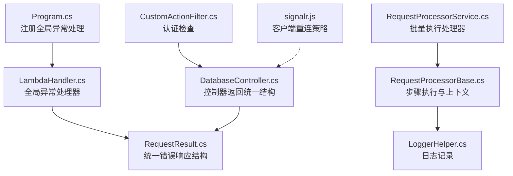
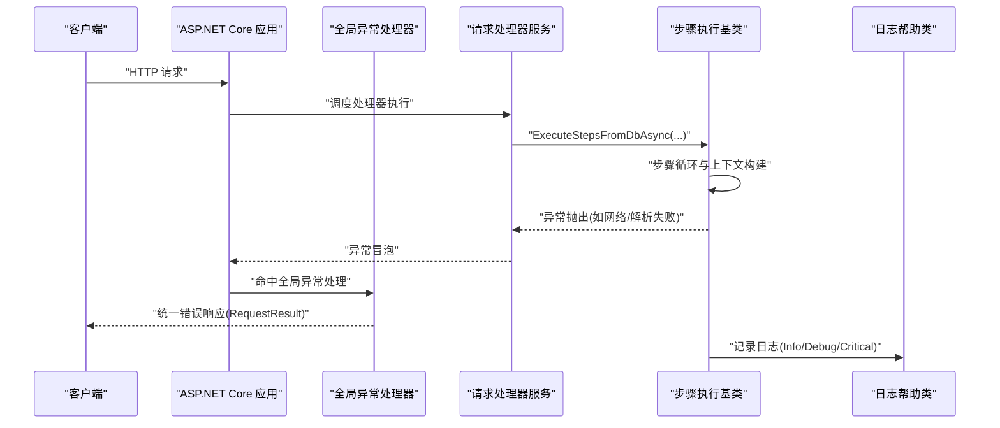
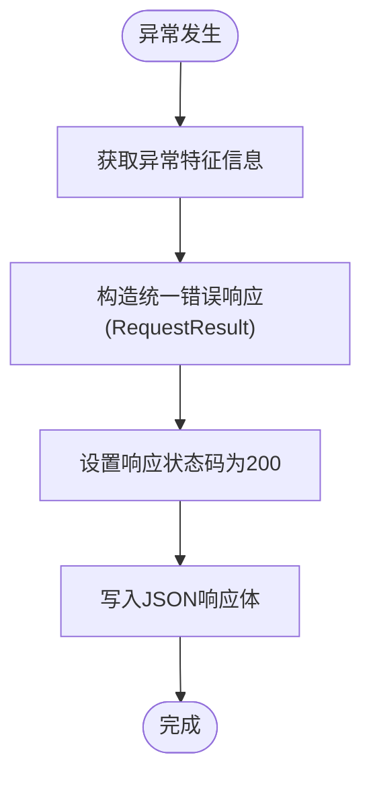
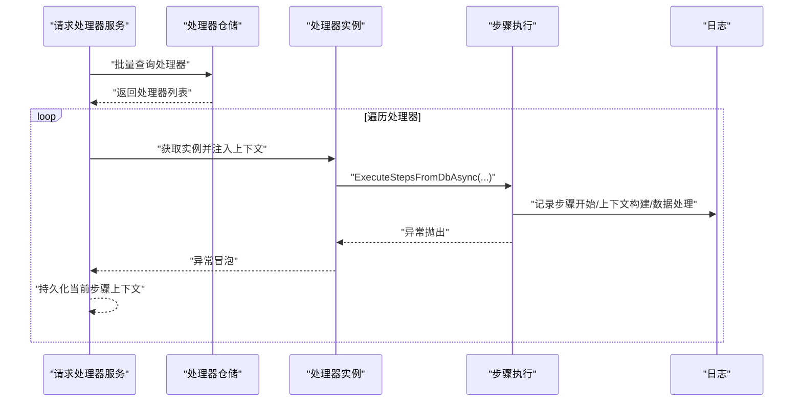
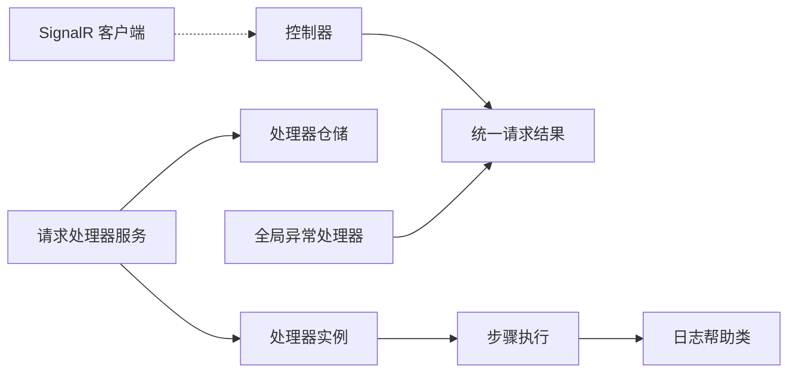

# 错误处理策略

<cite>
**本文引用的文件**
- [Program.cs](file://Sylas.RemoteTasks.App/Program.cs)
- [LambdaHandler.cs](file://Sylas.RemoteTasks.App/ExceptionHandlers/LambdaHandler.cs)
- [RequestProcessorService.cs](file://Sylas.RemoteTasks.App/RequestProcessor/RequestProcessorService.cs)
- [RequestProcessorBase.cs](file://Sylas.RemoteTasks.App/RequestProcessor/RequestProcessorBase.cs)
- [OperationResult.cs](file://Sylas.RemoteTasks.Common/Dtos/OperationResult.cs)
- [RequestResult.cs](file://Sylas.RemoteTasks.Common/Dtos/RequestResult.cs)
- [LoggerHelper.cs](file://Sylas.RemoteTasks.Common/LoggerHelper.cs)
- [DatabaseController.cs](file://Sylas.RemoteTasks.App/Controllers/DatabaseController.cs)
- [CustomActionFilter.cs](file://Sylas.RemoteTasks.App/Infrastructure/CustomActionFilter.cs)
- [signalr.js](file://Sylas.RemoteTasks.App/wwwroot/lib/signalr/dist/browser/signalr.js)
</cite>

## 目录
1. [引言](#引言)
2. [项目结构](#项目结构)
3. [核心组件](#核心组件)
4. [架构总览](#架构总览)
5. [详细组件分析](#详细组件分析)
6. [依赖分析](#依赖分析)
7. [性能考量](#性能考量)
8. [故障排查指南](#故障排查指南)
9. [结论](#结论)
10. [附录](#附录)

## 引言
本文件系统性阐述本项目的错误处理策略，聚焦请求处理器的异常处理架构、错误分类与恢复机制、步骤级错误捕获、全局异常处理与重试机制设计，并覆盖错误信息采集与记录、日志级别控制、告警机制、最佳实践与降级策略、用户体验优化、常见错误诊断与调试工具使用、性能影响分析及配置示例与故障排除指南。

## 项目结构
围绕错误处理的关键模块包括：
- 全局异常处理：在应用启动阶段注册异常处理器，统一输出标准化错误响应。
- 请求处理器：基于步骤的流水线执行，支持步骤间上下文传递与回溯控制，内置日志记录与异常传播。
- 控制器层：面向接口的统一响应包装，便于前端消费一致的错误结构。
- 日志与辅助：内置日志帮助类与结构化日志输出，支撑可观测性与排障。
- SignalR 客户端：具备内置重连与退避策略，提升实时通信的鲁棒性。

图表来源
- [Program.cs](file://Sylas.RemoteTasks.App/Program.cs#L99-L99)
- [LambdaHandler.cs](file://Sylas.RemoteTasks.App/ExceptionHandlers/LambdaHandler.cs#L9-L25)
- [RequestResult.cs](file://Sylas.RemoteTasks.Common/Dtos/RequestResult.cs#L44-L44)
- [RequestProcessorService.cs](file://Sylas.RemoteTasks.App/RequestProcessor/RequestProcessorService.cs#L11-L69)
- [RequestProcessorBase.cs](file://Sylas.RemoteTasks.App/RequestProcessor/RequestProcessorBase.cs#L83-L211)
- [LoggerHelper.cs](file://Sylas.RemoteTasks.Common/LoggerHelper.cs#L16-L39)
- [DatabaseController.cs](file://Sylas.RemoteTasks.App/Controllers/DatabaseController.cs#L40-L43)
- [CustomActionFilter.cs](file://Sylas.RemoteTasks.App/Infrastructure/CustomActionFilter.cs#L14-L20)
- [signalr.js](file://Sylas.RemoteTasks.App/wwwroot/lib/signalr/dist/browser/signalr.js#L1918-L1930)

章节来源
- [Program.cs](file://Sylas.RemoteTasks.App/Program.cs#L99-L99)
- [LambdaHandler.cs](file://Sylas.RemoteTasks.App/ExceptionHandlers/LambdaHandler.cs#L9-L25)
- [RequestProcessorService.cs](file://Sylas.RemoteTasks.App/RequestProcessor/RequestProcessorService.cs#L11-L69)
- [RequestProcessorBase.cs](file://Sylas.RemoteTasks.App/RequestProcessor/RequestProcessorBase.cs#L83-L211)
- [RequestResult.cs](file://Sylas.RemoteTasks.Common/Dtos/RequestResult.cs#L44-L44)
- [LoggerHelper.cs](file://Sylas.RemoteTasks.Common/LoggerHelper.cs#L16-L39)
- [DatabaseController.cs](file://Sylas.RemoteTasks.App/Controllers/DatabaseController.cs#L40-L43)
- [CustomActionFilter.cs](file://Sylas.RemoteTasks.App/Infrastructure/CustomActionFilter.cs#L14-L20)
- [signalr.js](file://Sylas.RemoteTasks.App/wwwroot/lib/signalr/dist/browser/signalr.js#L1918-L1930)

## 核心组件
- 全局异常处理器：在非开发环境下启用，捕获未处理异常并以统一的请求结果结构返回，避免泄露内部异常细节。
- 请求处理器服务：负责批量调度处理器实例，执行步骤并持久化上下文；异常在步骤执行链路中向上抛出，由上层捕获或交由全局处理器处理。
- 步骤执行基类：封装请求构建、数据上下文构建、数据处理器执行与回溯逻辑，提供丰富的日志记录点。
- 统一响应结构：提供成功与错误两种结构，便于前端统一处理。
- 控制器层：面向接口的响应包装，确保错误信息以统一结构返回。
- 日志帮助类：提供控制台与文件日志记录能力，支持不同严重级别输出。
- SignalR 客户端：内置重连与退避策略，提升实时通信稳定性。

章节来源
- [Program.cs](file://Sylas.RemoteTasks.App/Program.cs#L99-L99)
- [LambdaHandler.cs](file://Sylas.RemoteTasks.App/ExceptionHandlers/LambdaHandler.cs#L9-L25)
- [RequestProcessorService.cs](file://Sylas.RemoteTasks.App/RequestProcessor/RequestProcessorService.cs#L11-L69)
- [RequestProcessorBase.cs](file://Sylas.RemoteTasks.App/RequestProcessor/RequestProcessorBase.cs#L83-L211)
- [RequestResult.cs](file://Sylas.RemoteTasks.Common/Dtos/RequestResult.cs#L44-L44)
- [OperationResult.cs](file://Sylas.RemoteTasks.Common/Dtos/OperationResult.cs#L8-L50)
- [LoggerHelper.cs](file://Sylas.RemoteTasks.Common/LoggerHelper.cs#L16-L39)
- [DatabaseController.cs](file://Sylas.RemoteTasks.App/Controllers/DatabaseController.cs#L40-L43)
- [signalr.js](file://Sylas.RemoteTasks.App/wwwroot/lib/signalr/dist/browser/signalr.js#L1918-L1930)

## 架构总览
全局异常处理与请求处理器的协作流程如下：

图表来源
- [Program.cs](file://Sylas.RemoteTasks.App/Program.cs#L99-L99)
- [LambdaHandler.cs](file://Sylas.RemoteTasks.App/ExceptionHandlers/LambdaHandler.cs#L9-L25)
- [RequestProcessorService.cs](file://Sylas.RemoteTasks.App/RequestProcessor/RequestProcessorService.cs#L11-L69)
- [RequestProcessorBase.cs](file://Sylas.RemoteTasks.App/RequestProcessor/RequestProcessorBase.cs#L83-L211)
- [LoggerHelper.cs](file://Sylas.RemoteTasks.Common/LoggerHelper.cs#L16-L39)

## 详细组件分析

### 全局异常处理与统一响应
- 注册位置：在应用启动时启用全局异常中间件，将异常转换为统一的请求结果结构，状态码固定为200但业务字段指示错误。
- 输出结构：使用统一的错误响应结构，便于前端统一处理。
- 适用范围：对所有未捕获异常生效，确保对外输出一致且安全。

图表来源
- [Program.cs](file://Sylas.RemoteTasks.App/Program.cs#L99-L99)
- [LambdaHandler.cs](file://Sylas.RemoteTasks.App/ExceptionHandlers/LambdaHandler.cs#L9-L25)
- [RequestResult.cs](file://Sylas.RemoteTasks.Common/Dtos/RequestResult.cs#L44-L44)

章节来源
- [Program.cs](file://Sylas.RemoteTasks.App/Program.cs#L99-L99)
- [LambdaHandler.cs](file://Sylas.RemoteTasks.App/ExceptionHandlers/LambdaHandler.cs#L9-L25)
- [RequestResult.cs](file://Sylas.RemoteTasks.Common/Dtos/RequestResult.cs#L44-L44)

### 请求处理器异常处理与步骤级捕获
- 批量执行：根据ID集合批量获取处理器并依次执行，异常在步骤执行过程中抛出，由上层捕获或交由全局异常处理器处理。
- 步骤执行：支持指定步骤执行与全量执行，步骤间通过上下文传递，支持回溯逻辑。
- 上下文持久化：每步执行结束将必要的上下文序列化并持久化，便于后续步骤复用。
- 日志记录：在关键节点记录日志，便于定位问题。

图表来源
- [RequestProcessorService.cs](file://Sylas.RemoteTasks.App/RequestProcessor/RequestProcessorService.cs#L11-L69)
- [RequestProcessorBase.cs](file://Sylas.RemoteTasks.App/RequestProcessor/RequestProcessorBase.cs#L83-L211)
- [LoggerHelper.cs](file://Sylas.RemoteTasks.Common/LoggerHelper.cs#L16-L39)

章节来源
- [RequestProcessorService.cs](file://Sylas.RemoteTasks.App/RequestProcessor/RequestProcessorService.cs#L11-L69)
- [RequestProcessorBase.cs](file://Sylas.RemoteTasks.App/RequestProcessor/RequestProcessorBase.cs#L83-L211)
- [LoggerHelper.cs](file://Sylas.RemoteTasks.Common/LoggerHelper.cs#L16-L39)

### 控制器层错误包装与用户反馈
- 统一响应：控制器返回统一的请求结果结构，便于前端识别成功与错误。
- 安全性：错误消息统一包装，避免直接暴露内部异常细节。
- 一致性：保证接口层错误风格一致，降低前端适配成本。

章节来源
- [DatabaseController.cs](file://Sylas.RemoteTasks.App/Controllers/DatabaseController.cs#L40-L43)
- [RequestResult.cs](file://Sylas.RemoteTasks.Common/Dtos/RequestResult.cs#L44-L44)

### 日志级别与记录策略
- 控制台日志：提供信息、错误、关键级别输出，便于快速定位问题。
- 文件日志：支持异步追加日志至指定目录，默认按日期分文件，异常时记录降级提示。
- 结构化记录：结合处理器日志记录点，形成完整的执行轨迹。

章节来源
- [LoggerHelper.cs](file://Sylas.RemoteTasks.Common/LoggerHelper.cs#L16-L39)
- [LoggerHelper.cs](file://Sylas.RemoteTasks.Common/LoggerHelper.cs#L48-L76)
- [LoggerHelper.cs](file://Sylas.RemoteTasks.Common/LoggerHelper.cs#L84-L112)
- [RequestProcessorBase.cs](file://Sylas.RemoteTasks.App/RequestProcessor/RequestProcessorBase.cs#L42-L42)

### SignalR 客户端重连与退避策略
- 内置重连：客户端具备指数/阶梯式退避策略，逐步延长重连间隔，避免雪崩效应。
- 策略扩展：可通过自定义重连策略接口调整延迟序列，满足不同场景需求。
- 错误上报：在重连耗尽后记录日志并关闭连接，防止无限尝试。

章节来源
- [signalr.js](file://Sylas.RemoteTasks.App/wwwroot/lib/signalr/dist/browser/signalr.js#L1918-L1930)
- [signalr.js](file://Sylas.RemoteTasks.App/wwwroot/lib/signalr/dist/browser/signalr.js#L2104-L2117)

## 依赖分析
- 组件耦合
  - 全局异常处理器依赖统一响应结构，确保输出一致。
  - 请求处理器服务依赖仓储与反射机制，动态调度处理器实例。
  - 步骤执行基类依赖远程请求与模板解析，日志贯穿执行全过程。
  - 控制器层依赖统一响应结构，保障接口一致性。
- 外部依赖
  - SignalR 客户端提供稳定的重连与退避策略，增强实时通信可靠性。

图表来源
- [Program.cs](file://Sylas.RemoteTasks.App/Program.cs#L99-L99)
- [LambdaHandler.cs](file://Sylas.RemoteTasks.App/ExceptionHandlers/LambdaHandler.cs#L9-L25)
- [RequestProcessorService.cs](file://Sylas.RemoteTasks.App/RequestProcessor/RequestProcessorService.cs#L11-L69)
- [RequestProcessorBase.cs](file://Sylas.RemoteTasks.App/RequestProcessor/RequestProcessorBase.cs#L83-L211)
- [LoggerHelper.cs](file://Sylas.RemoteTasks.Common/LoggerHelper.cs#L16-L39)
- [DatabaseController.cs](file://Sylas.RemoteTasks.App/Controllers/DatabaseController.cs#L40-L43)
- [signalr.js](file://Sylas.RemoteTasks.App/wwwroot/lib/signalr/dist/browser/signalr.js#L1918-L1930)

## 性能考量
- 全局异常处理
  - 优点：统一错误输出，减少重复逻辑；对未捕获异常兜底。
  - 注意：避免在异常路径中执行昂贵操作，保持响应快速。
- 请求处理器
  - 步骤回溯：在最后一步有数据时自动回溯，需评估数据量与序列化开销。
  - 上下文持久化：仅持久化必要键值，避免将大对象写入存储。
- 日志
  - 控制台输出：高频日志可能影响I/O吞吐，建议在生产环境适度降低日志级别。
  - 文件日志：异步追加以降低阻塞，注意磁盘空间与轮转策略。
- SignalR
  - 退避策略：合理设置重连间隔，避免频繁重试导致资源紧张。

## 故障排查指南
- 常见错误类型与诊断
  - 网络请求失败：检查远程接口可达性、超时与重试策略；查看步骤执行日志与上下文构建记录。
  - 配置缺失：处理器名称、URL、步骤参数缺失会导致异常，需核对数据库配置与模板表达式。
  - 权限不足：认证过滤器未通过时重定向登录，确认凭据与作用域声明。
- 调试工具与技巧
  - 浏览器开发者工具：观察网络请求与响应结构，确认统一错误响应格式。
  - 控制台日志：结合处理器日志定位具体步骤与上下文。
  - 文件日志：在统一日志目录下按日期检索，定位异常发生时间点。
- 性能影响分析
  - 高频异常：优先优化上游依赖（网络/数据库），减少异常频率。
  - 大上下文：避免在上下文中传递大对象，必要时仅传递标识符。
- 降级策略与用户体验
  - 信号降级：在网络不稳定时采用退避重连，避免阻塞UI。
  - 接口降级：在下游不可用时返回明确的错误码与提示，引导用户稍后重试。
  - 缓存与离线：对可缓存数据提供短期缓存，提升弱网体验。

章节来源
- [CustomActionFilter.cs](file://Sylas.RemoteTasks.App/Infrastructure/CustomActionFilter.cs#L14-L20)
- [LoggerHelper.cs](file://Sylas.RemoteTasks.Common/LoggerHelper.cs#L48-L76)
- [RequestProcessorBase.cs](file://Sylas.RemoteTasks.App/RequestProcessor/RequestProcessorBase.cs#L173-L192)
- [signalr.js](file://Sylas.RemoteTasks.App/wwwroot/lib/signalr/dist/browser/signalr.js#L1918-L1930)

## 结论
本项目通过“全局异常处理 + 请求处理器步骤级执行 + 统一响应结构 + 日志与SignalR重连”的组合，构建了清晰、可维护且具备韧性的一体化错误处理体系。建议在生产环境中进一步完善：
- 明确错误分类与分级策略，区分可恢复与不可恢复错误；
- 引入指标监控与告警通道，结合日志与统一响应结构实现闭环；
- 优化高频异常场景的上游依赖与缓存策略，降低异常率；
- 规范化错误码与文案，提升用户与运维的可读性与可操作性。

## 附录
- 配置示例（概念性说明）
  - 全局异常处理：在应用启动时启用异常中间件，确保所有未捕获异常走统一出口。
  - 日志级别：开发环境开启更细粒度日志，生产环境以Info及以上为主。
  - SignalR 重连：根据业务特性调整默认退避序列，避免过短间隔导致抖动。
- 故障排除清单
  - 确认异常是否被全局处理器捕获并返回统一结构；
  - 检查步骤执行日志与上下文持久化是否正常；
  - 核对控制器返回结构是否符合前端约定；
  - 验证认证过滤器是否正确拦截未授权访问。