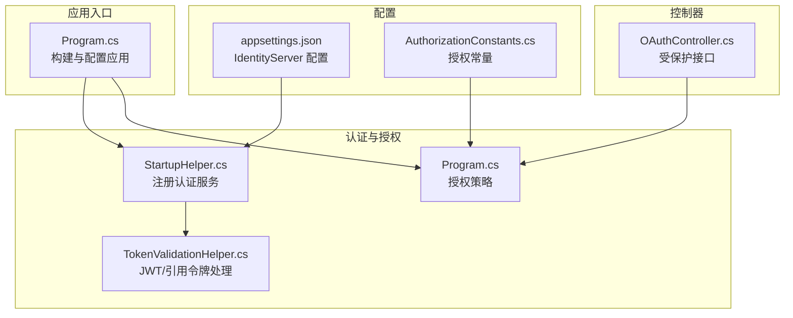
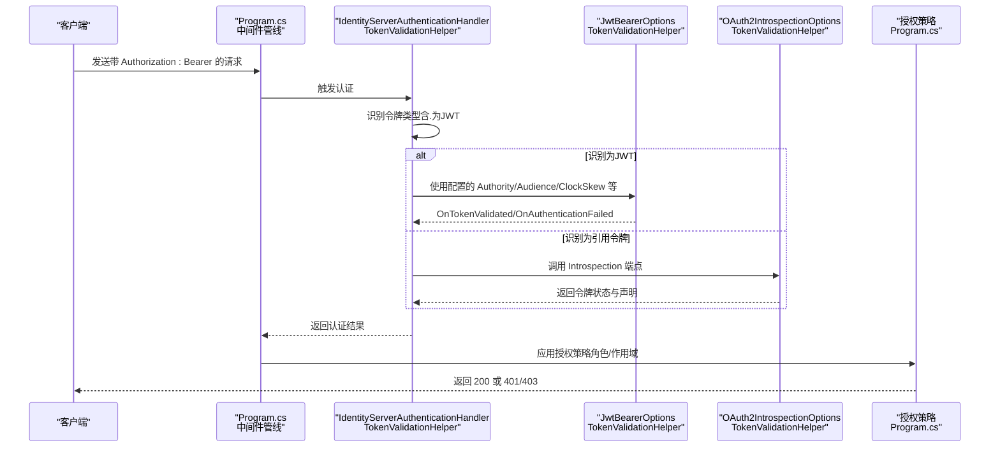
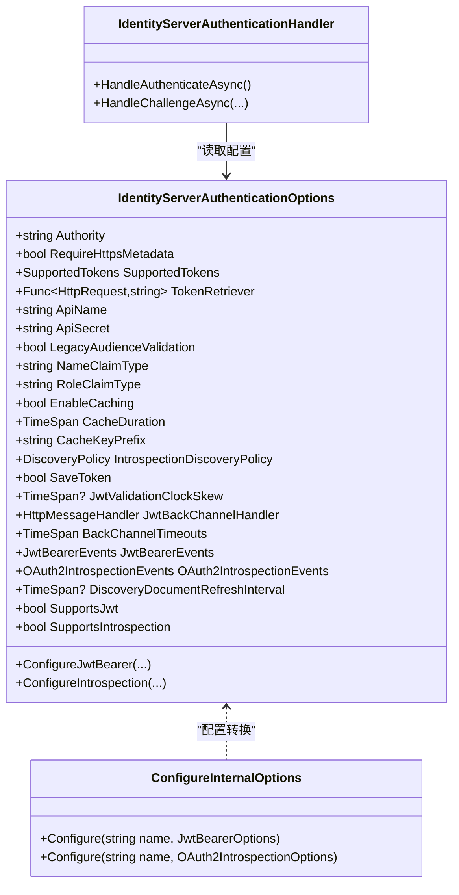
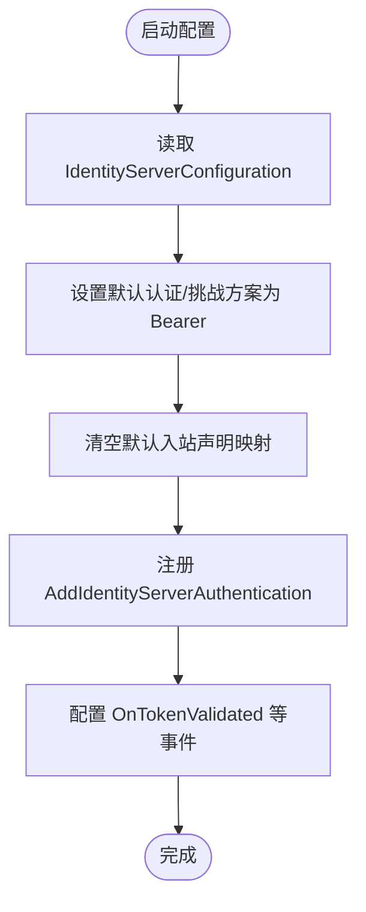
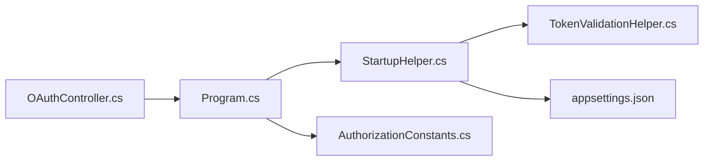

# JWT 令牌处理

<cite>
**本文引用的文件列表**
- [TokenValidationHelper.cs](file://Sylas.RemoteTasks.App/Helpers/TokenValidationHelper.cs)
- [StartupHelper.cs](file://Sylas.RemoteTasks.App/Helpers/StartupHelper.cs)
- [Program.cs](file://Sylas.RemoteTasks.App/Program.cs)
- [OAuthController.cs](file://Sylas.RemoteTasks.App/Controllers/OAuthController.cs)
- [appsettings.json](file://Sylas.RemoteTasks.App/appsettings.json)
- [AuthorizationConstants.cs](file://Sylas.RemoteTasks.Utils/Constants/AuthorizationConstants.cs)
- [AuthorizeAttributeTest.cs](file://Sylas.RemoteTasks.Test/Auth/AuthorizeAttributeTest.cs)
</cite>

## 目录
1. [简介](#简介)
2. [项目结构](#项目结构)
3. [核心组件](#核心组件)
4. [架构总览](#架构总览)
5. [详细组件分析](#详细组件分析)
6. [依赖关系分析](#依赖关系分析)
7. [性能考量](#性能考量)
8. [故障排查指南](#故障排查指南)
9. [结论](#结论)
10. [附录](#附录)

## 简介
本文件围绕项目中的 JWT 令牌处理能力展开，系统性说明以下主题：
- JWT 令牌验证、签名验证、声明提取、令牌过期处理、时钟偏差处理
- 配置选项与验证规则
- 与 TokenValidationHelper 类的集成方式
- 不同类型 JWT 令牌（JWT 与引用令牌）的处理流程
- 常见问题与解决方案
- 初学者友好、同时具备足够技术深度的说明

## 项目结构
该项目采用 ASP.NET Core 标准分层结构，JWT 认证相关的核心逻辑集中在 Helpers 目录下的 TokenValidationHelper 与 StartupHelper，以及 Program.cs 的启动配置中；控制器层通过 [Authorize] 特性触发认证与授权。

图表来源
- [Program.cs](file://Sylas.RemoteTasks.App/Program.cs#L74-L87)
- [StartupHelper.cs](file://Sylas.RemoteTasks.App/Helpers/StartupHelper.cs#L124-L271)
- [TokenValidationHelper.cs](file://Sylas.RemoteTasks.App/Helpers/TokenValidationHelper.cs#L15-L575)
- [OAuthController.cs](file://Sylas.RemoteTasks.App/Controllers/OAuthController.cs#L31-L46)
- [appsettings.json](file://Sylas.RemoteTasks.App/appsettings.json#L109-L121)
- [AuthorizationConstants.cs](file://Sylas.RemoteTasks.Utils/Constants/AuthorizationConstants.cs#L6-L12)

章节来源
- [Program.cs](file://Sylas.RemoteTasks.App/Program.cs#L74-L87)
- [StartupHelper.cs](file://Sylas.RemoteTasks.App/Helpers/StartupHelper.cs#L124-L271)
- [TokenValidationHelper.cs](file://Sylas.RemoteTasks.App/Helpers/TokenValidationHelper.cs#L15-L575)
- [OAuthController.cs](file://Sylas.RemoteTasks.App/Controllers/OAuthController.cs#L31-L46)
- [appsettings.json](file://Sylas.RemoteTasks.App/appsettings.json#L109-L121)
- [AuthorizationConstants.cs](file://Sylas.RemoteTasks.Utils/Constants/AuthorizationConstants.cs#L6-L12)

## 核心组件
- TokenValidationHelper：提供 JWT 与 OAuth2 引用令牌的统一认证处理，包括：
  - 令牌类型识别（JWT vs 引用令牌）
  - 事件钩子（消息接收、令牌验证成功、认证失败、挑战）
  - 时钟偏差、受众校验、声明映射、发现文档刷新等配置
- StartupHelper：集中注册认证服务，绑定 IdentityServer 配置，设置默认认证方案与事件回调
- Program：注册认证中间件、授权策略，并启用 UseAuthentication/UseAuthorization
- OAuthController：受保护接口示例，演示如何从请求头提取 Bearer 令牌并调用用户信息端点

章节来源
- [TokenValidationHelper.cs](file://Sylas.RemoteTasks.App/Helpers/TokenValidationHelper.cs#L15-L575)
- [StartupHelper.cs](file://Sylas.RemoteTasks.App/Helpers/StartupHelper.cs#L124-L271)
- [Program.cs](file://Sylas.RemoteTasks.App/Program.cs#L74-L87)
- [OAuthController.cs](file://Sylas.RemoteTasks.App/Controllers/OAuthController.cs#L31-L46)

## 架构总览
下图展示了从请求进入应用到完成 JWT/引用令牌验证的整体流程，以及与授权策略的衔接。

图表来源
- [TokenValidationHelper.cs](file://Sylas.RemoteTasks.App/Helpers/TokenValidationHelper.cs#L225-L315)
- [TokenValidationHelper.cs](file://Sylas.RemoteTasks.App/Helpers/TokenValidationHelper.cs#L445-L522)
- [TokenValidationHelper.cs](file://Sylas.RemoteTasks.App/Helpers/TokenValidationHelper.cs#L524-L556)
- [Program.cs](file://Sylas.RemoteTasks.App/Program.cs#L74-L87)

## 详细组件分析

### 1) TokenValidationHelper：统一令牌处理与配置
- 令牌类型识别
  - 通过检查令牌是否包含“.”来区分 JWT 与引用令牌
  - 支持仅 JWT、仅引用令牌或两者皆支持
- 事件钩子
  - OnMessageReceived：从上下文提取令牌
  - OnTokenValidated：令牌验证成功后可扩展（如重命名 claim）
  - OnAuthenticationFailed：认证失败时的处理
  - OnChallenge：挑战响应转发
- 配置项与验证规则
  - Authority：令牌签发者地址
  - RequireHttpsMetadata：是否要求 HTTPS
  - SupportedTokens：支持的令牌类型
  - ApiName/ApiSecret：用于 Introspection 的客户端凭据
  - Audience 校验：若配置 ApiName 且未启用 LegacyAudienceValidation，则严格校验 Audience
  - NameClaimType/RoleClaimType：声明类型映射
  - JwtValidationClockSkew：时钟偏差容差
  - DiscoveryDocumentRefreshInterval：发现文档刷新间隔
  - TokenHandlers：自定义 JwtSecurityTokenHandler（关闭入站声明映射）
- 与 IdentityServerAuthenticationHandler 的协作
  - 通过内部 ConfigureInternalOptions 将 IdentityServerAuthenticationOptions 转换为具体 JwtBearer/OAuth2Introspection 配置
  - 在 HandleAuthenticateAsync 中根据令牌类型选择相应方案并转发挑战

图表来源
- [TokenValidationHelper.cs](file://Sylas.RemoteTasks.App/Helpers/TokenValidationHelper.cs#L318-L556)
- [TokenValidationHelper.cs](file://Sylas.RemoteTasks.App/Helpers/TokenValidationHelper.cs#L55-L92)
- [TokenValidationHelper.cs](file://Sylas.RemoteTasks.App/Helpers/TokenValidationHelper.cs#L207-L315)

章节来源
- [TokenValidationHelper.cs](file://Sylas.RemoteTasks.App/Helpers/TokenValidationHelper.cs#L225-L315)
- [TokenValidationHelper.cs](file://Sylas.RemoteTasks.App/Helpers/TokenValidationHelper.cs#L445-L522)
- [TokenValidationHelper.cs](file://Sylas.RemoteTasks.App/Helpers/TokenValidationHelper.cs#L524-L556)

### 2) StartupHelper：认证服务注册与默认方案
- 设置默认认证方案为“Bearer”，默认挑战方案也为“Bearer”
- 从 appsettings.json 读取 IdentityServerConfiguration，包括 Authority、RequireHttpsMetadata、ApiName、ApiSecret、ClientId、ClientSecret、OidcResponseType、Scopes、缓存配置等
- 关闭默认入站声明映射（DefaultInboundClaimTypeMap.Clear），避免框架自动映射导致的声明冲突
- 注册 AddIdentityServerAuthentication，并在 OnTokenValidated 中进行声明规范化（如将 NameIdentifier 改为 sub，复制 Role 声明）

图表来源
- [StartupHelper.cs](file://Sylas.RemoteTasks.App/Helpers/StartupHelper.cs#L147-L271)
- [StartupHelper.cs](file://Sylas.RemoteTasks.App/Helpers/StartupHelper.cs#L157-L157)
- [StartupHelper.cs](file://Sylas.RemoteTasks.App/Helpers/StartupHelper.cs#L242-L265)

章节来源
- [StartupHelper.cs](file://Sylas.RemoteTasks.App/Helpers/StartupHelper.cs#L147-L271)
- [StartupHelper.cs](file://Sylas.RemoteTasks.App/Helpers/StartupHelper.cs#L157-L157)
- [StartupHelper.cs](file://Sylas.RemoteTasks.App/Helpers/StartupHelper.cs#L242-L265)

### 3) Program：中间件与授权策略
- 注册认证服务（StartupHelper.AddAuthenticationService）
- 定义授权策略（AuthorizationConstants.AdministrationPolicy），结合角色与作用域进行综合判定
- 启用 UseAuthentication 与 UseAuthorization 中间件

章节来源
- [Program.cs](file://Sylas.RemoteTasks.App/Program.cs#L74-L87)
- [AuthorizationConstants.cs](file://Sylas.RemoteTasks.Utils/Constants/AuthorizationConstants.cs#L6-L12)

### 4) OAuthController：受保护接口示例
- 通过 [Authorize] 触发认证
- 从 Authorization 头部提取 Bearer 令牌
- 使用 IHttpClientFactory 创建客户端，设置 Bearer 令牌并访问 /connect/userinfo 获取用户信息

章节来源
- [OAuthController.cs](file://Sylas.RemoteTasks.App/Controllers/OAuthController.cs#L31-L46)

## 依赖关系分析
- TokenValidationHelper 依赖：
  - Microsoft.AspNetCore.Authentication.JwtBearer、OAuth2Introspection
  - IdentityModel.AspNetCore.OAuth2Introspection、IdentityModel.Client
  - Microsoft.IdentityModel.Protocols、OpenIdConnect
  - System.IdentityModel.Tokens.Jwt
- StartupHelper 依赖：
  - IdentityModel、System.IdentityModel.Tokens.Jwt
  - 通过 appsettings.json 提供配置
- Program 依赖：
  - StartupHelper 注册认证服务
  - AuthorizationConstants 定义策略名称

图表来源
- [Program.cs](file://Sylas.RemoteTasks.App/Program.cs#L74-L87)
- [StartupHelper.cs](file://Sylas.RemoteTasks.App/Helpers/StartupHelper.cs#L124-L271)
- [TokenValidationHelper.cs](file://Sylas.RemoteTasks.App/Helpers/TokenValidationHelper.cs#L1-L11)
- [OAuthController.cs](file://Sylas.RemoteTasks.App/Controllers/OAuthController.cs#L1-L49)
- [appsettings.json](file://Sylas.RemoteTasks.App/appsettings.json#L109-L121)
- [AuthorizationConstants.cs](file://Sylas.RemoteTasks.Utils/Constants/AuthorizationConstants.cs#L6-L12)

章节来源
- [Program.cs](file://Sylas.RemoteTasks.App/Program.cs#L74-L87)
- [StartupHelper.cs](file://Sylas.RemoteTasks.App/Helpers/StartupHelper.cs#L124-L271)
- [TokenValidationHelper.cs](file://Sylas.RemoteTasks.App/Helpers/TokenValidationHelper.cs#L1-L11)
- [OAuthController.cs](file://Sylas.RemoteTasks.App/Controllers/OAuthController.cs#L1-L49)
- [appsettings.json](file://Sylas.RemoteTasks.App/appsettings.json#L109-L121)
- [AuthorizationConstants.cs](file://Sylas.RemoteTasks.Utils/Constants/AuthorizationConstants.cs#L6-L12)

## 性能考量
- 发现文档缓存与刷新
  - 可通过 DiscoveryDocumentRefreshInterval 控制发现文档的自动刷新周期，减少频繁拉取元数据带来的开销
- 引用令牌缓存
  - 当启用 EnableCaching 时，Introspection 结果会被缓存，缓存时长由 CacheDuration 指定，缓存键前缀由 CacheKeyPrefix 指定
- 后通道超时
  - BackChannelTimeouts 控制与 IdentityServer 的通信超时，避免阻塞请求
- 声明映射优化
  - 关闭入站声明映射（MapInboundClaims=false）可减少不必要的声明转换成本

章节来源
- [TokenValidationHelper.cs](file://Sylas.RemoteTasks.App/Helpers/TokenValidationHelper.cs#L433-L433)
- [TokenValidationHelper.cs](file://Sylas.RemoteTasks.App/Helpers/TokenValidationHelper.cs#L376-L386)
- [TokenValidationHelper.cs](file://Sylas.RemoteTasks.App/Helpers/TokenValidationHelper.cs#L415-L415)
- [TokenValidationHelper.cs](file://Sylas.RemoteTasks.App/Helpers/TokenValidationHelper.cs#L511-L520)

## 故障排查指南
- 令牌为空或格式不正确
  - 确认请求头中包含 Authorization: Bearer <token>
  - 若使用自定义 TokenRetriever，请确保返回非空字符串
- 时钟偏差导致验证失败
  - 通过 JwtValidationClockSkew 设置合理的容差时间
- Audience 校验失败
  - 若配置了 ApiName 且未启用 LegacyAudienceValidation，则必须严格匹配 Audience
  - 如需宽松校验，可关闭受众校验或启用 LegacyAudienceValidation
- 引用令牌校验异常
  - 确保 ApiName 与 ApiSecret 已正确配置，且 Introspection 端点可达
  - 检查 RequireHttpsMetadata 与 IntrospectionDiscoveryPolicy 的配置
- 声明映射问题
  - 已关闭默认入站声明映射，必要时在 OnTokenValidated 中手动规范化声明
- 授权策略不生效
  - 确认已启用 UseAuthentication 与 UseAuthorization
  - 检查授权策略中角色与作用域的组合条件

章节来源
- [TokenValidationHelper.cs](file://Sylas.RemoteTasks.App/Helpers/TokenValidationHelper.cs#L345-L345)
- [TokenValidationHelper.cs](file://Sylas.RemoteTasks.App/Helpers/TokenValidationHelper.cs#L404-L404)
- [TokenValidationHelper.cs](file://Sylas.RemoteTasks.App/Helpers/TokenValidationHelper.cs#L493-L501)
- [TokenValidationHelper.cs](file://Sylas.RemoteTasks.App/Helpers/TokenValidationHelper.cs#L524-L556)
- [StartupHelper.cs](file://Sylas.RemoteTasks.App/Helpers/StartupHelper.cs#L157-L157)
- [Program.cs](file://Sylas.RemoteTasks.App/Program.cs#L114-L115)

## 结论
本项目通过 TokenValidationHelper 与 StartupHelper 实现了对 JWT 与 OAuth2 引用令牌的统一处理，结合 Program 的中间件与授权策略，提供了完整的认证与授权链路。其配置项覆盖了签名验证、声明提取、受众校验、时钟偏差、发现文档刷新、缓存与超时等关键方面，既满足初学者快速上手，也便于有经验的开发者进行深度定制与优化。

## 附录

### A. 关键配置项速览
- 基础
  - Authority：签发者地址
  - RequireHttpsMetadata：是否要求 HTTPS
  - SupportedTokens：支持的令牌类型（Both/Jwt/Reference）
- 令牌提取与事件
  - TokenRetriever：自定义令牌提取逻辑
  - JwtBearerEvents/OAuth2IntrospectionEvents：认证生命周期事件
- Audience 与声明
  - ApiName/ApiSecret：用于 Introspection 的客户端凭据
  - Audience 校验：严格或关闭
  - NameClaimType/RoleClaimType：声明类型映射
- 时间与缓存
  - JwtValidationClockSkew：时钟偏差容差
  - DiscoveryDocumentRefreshInterval：发现文档刷新间隔
  - EnableCaching/CacheDuration/CacheKeyPrefix：引用令牌缓存
  - BackChannelTimeouts：后通道超时
- 处理器
  - TokenHandlers：自定义 JwtSecurityTokenHandler（关闭入站映射）

章节来源
- [TokenValidationHelper.cs](file://Sylas.RemoteTasks.App/Helpers/TokenValidationHelper.cs#L330-L426)
- [TokenValidationHelper.cs](file://Sylas.RemoteTasks.App/Helpers/TokenValidationHelper.cs#L433-L433)
- [TokenValidationHelper.cs](file://Sylas.RemoteTasks.App/Helpers/TokenValidationHelper.cs#L376-L386)
- [TokenValidationHelper.cs](file://Sylas.RemoteTasks.App/Helpers/TokenValidationHelper.cs#L415-L415)
- [TokenValidationHelper.cs](file://Sylas.RemoteTasks.App/Helpers/TokenValidationHelper.cs#L511-L520)

### B. 与 TokenValidationHelper 的集成要点
- 在 StartupHelper 中注册 AddIdentityServerAuthentication，并传入 IdentityServerConfiguration
- 在 Program 中启用 UseAuthentication 与 UseAuthorization
- 在控制器方法上使用 [Authorize] 触发认证
- 如需自定义令牌提取或事件处理，可在 IdentityServerAuthenticationOptions 中配置

章节来源
- [StartupHelper.cs](file://Sylas.RemoteTasks.App/Helpers/StartupHelper.cs#L124-L271)
- [Program.cs](file://Sylas.RemoteTasks.App/Program.cs#L74-L87)
- [OAuthController.cs](file://Sylas.RemoteTasks.App/Controllers/OAuthController.cs#L31-L46)