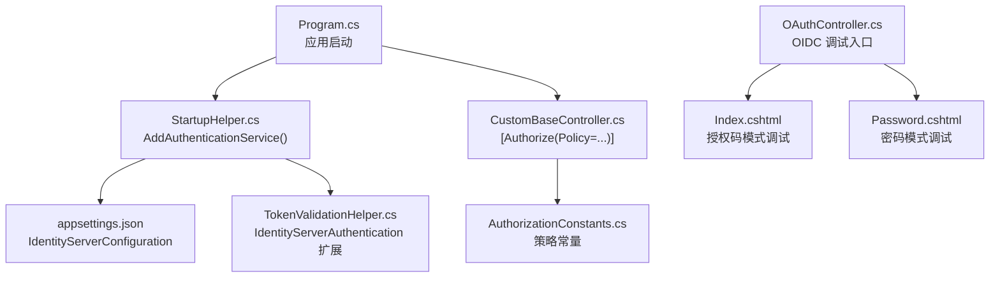
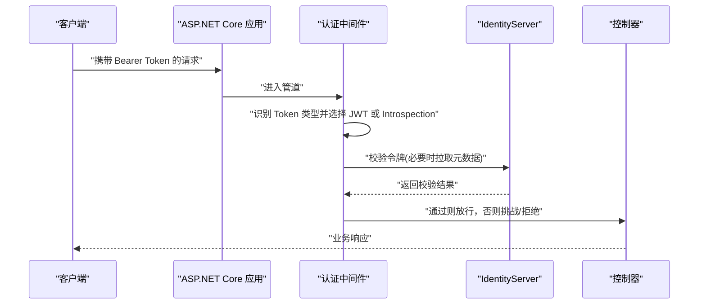
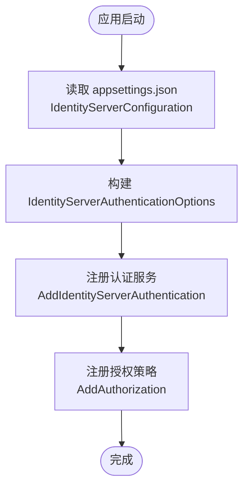
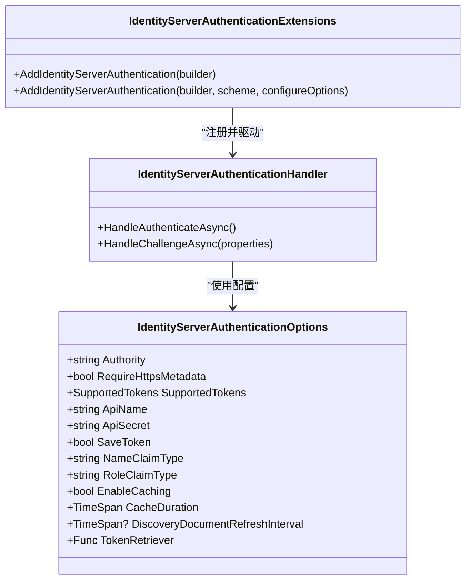
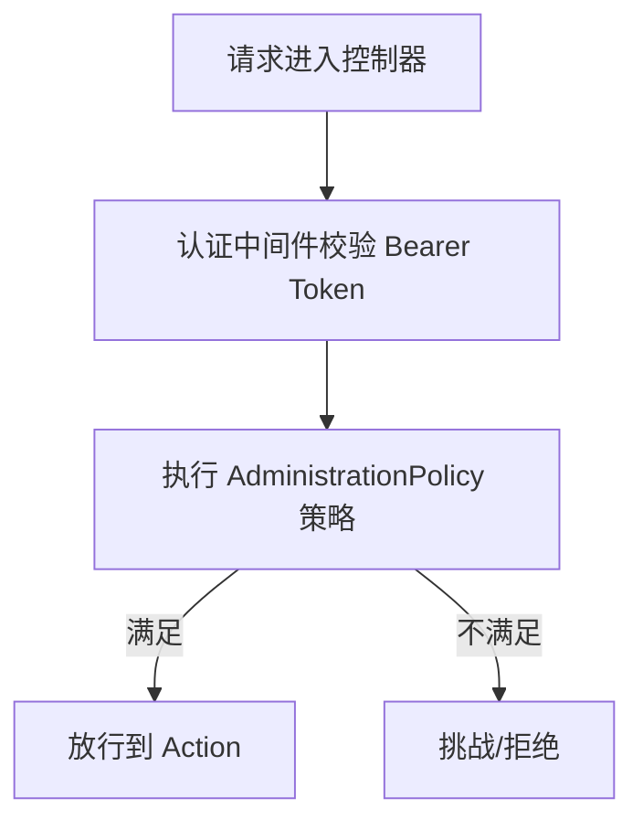
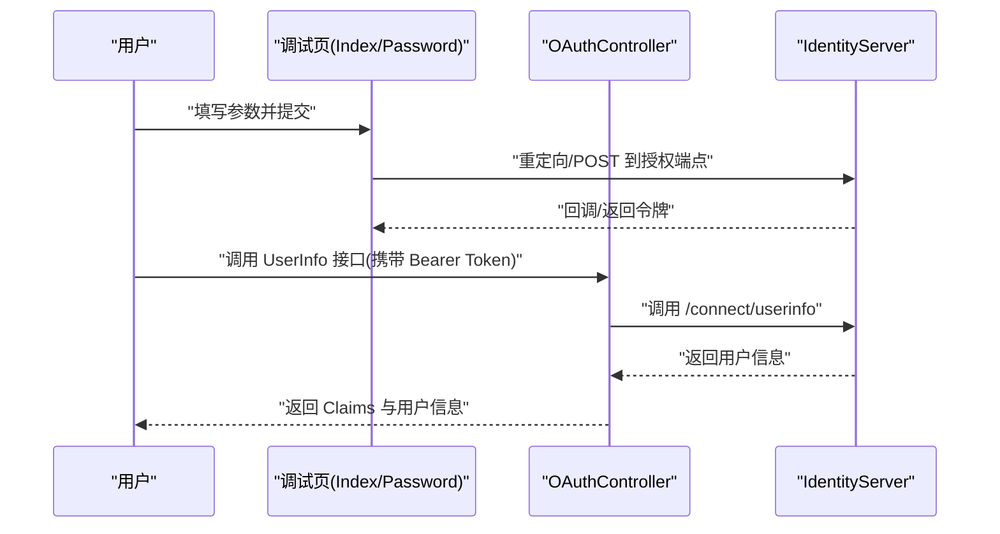
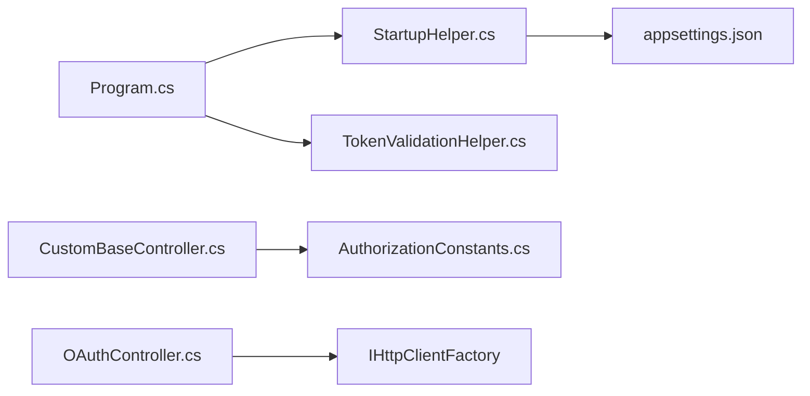

# OIDC/OpenID Connect 集成

<cite>
**本文引用的文件**
- [OAuthController.cs](file://Sylas.RemoteTasks.App/Controllers/OAuthController.cs)
- [Index.cshtml](file://Sylas.RemoteTasks.App/Views/OAuth/Index.cshtml)
- [Password.cshtml](file://Sylas.RemoteTasks.App/Views/OAuth/Password.cshtml)
- [appsettings.json](file://Sylas.RemoteTasks.App/appsettings.json)
- [Program.cs](file://Sylas.RemoteTasks.App/Program.cs)
- [StartupHelper.cs](file://Sylas.RemoteTasks.App/Helpers/StartupHelper.cs)
- [TokenValidationHelper.cs](file://Sylas.RemoteTasks.App/Helpers/TokenValidationHelper.cs)
- [AuthorizationConstants.cs](file://Sylas.RemoteTasks.Utils/Constants/AuthorizationConstants.cs)
- [CustomBaseController.cs](file://Sylas.RemoteTasks.App/Controllers/CustomBaseController.cs)
</cite>

## 目录
1. [简介](#简介)
2. [项目结构](#项目结构)
3. [核心组件](#核心组件)
4. [架构总览](#架构总览)
5. [组件详解](#组件详解)
6. [依赖关系分析](#依赖关系分析)
7. [性能考量](#性能考量)
8. [故障排查指南](#故障排查指南)
9. [结论](#结论)
10. [附录](#附录)

## 简介
本文件围绕 OIDC/OpenID Connect 在本项目的集成实践展开，重点说明以下方面：
- 如何配置 IdentityServer 作为 OIDC 提供方
- 如何在 ASP.NET Core 中启用 Bearer Token 的 JWT/JTI 校验
- 如何通过内置工具页发起授权码/密码模式授权并获取用户信息
- 如何在控制器中使用策略授权与声明映射
- 常见配置项、参数与返回值说明
- 常见问题与解决方案

本项目已内建 OIDC 配置与验证逻辑，并提供前端调试页用于快速联调。

## 项目结构
与 OIDC 集成直接相关的模块包括：
- 配置：appsettings.json 中的 IdentityServerConfiguration
- 启动与注册：Program.cs 中的认证/授权注册
- 认证扩展：StartupHelper.cs 中的 AddAuthenticationService
- 身份验证处理器：TokenValidationHelper.cs 中的 IdentityServerAuthentication 扩展与处理器
- 控制器与策略：CustomBaseController.cs 与 AuthorizationConstants.cs
- OIDC 调试页：OAuthController.cs 以及对应的视图 Index.cshtml、Password.cshtml

图表来源
- [Program.cs](file://Sylas.RemoteTasks.App/Program.cs#L74-L87)
- [StartupHelper.cs](file://Sylas.RemoteTasks.App/Helpers/StartupHelper.cs#L124-L271)
- [TokenValidationHelper.cs](file://Sylas.RemoteTasks.App/Helpers/TokenValidationHelper.cs#L117-L200)
- [appsettings.json](file://Sylas.RemoteTasks.App/appsettings.json#L109-L121)
- [CustomBaseController.cs](file://Sylas.RemoteTasks.App/Controllers/CustomBaseController.cs#L10-L12)
- [AuthorizationConstants.cs](file://Sylas.RemoteTasks.Utils/Constants/AuthorizationConstants.cs#L6-L12)
- [OAuthController.cs](file://Sylas.RemoteTasks.App/Controllers/OAuthController.cs#L13-L46)
- [Index.cshtml](file://Sylas.RemoteTasks.App/Views/OAuth/Index.cshtml#L6-L76)
- [Password.cshtml](file://Sylas.RemoteTasks.App/Views/OAuth/Password.cshtml#L7-L59)

章节来源
- [Program.cs](file://Sylas.RemoteTasks.App/Program.cs#L74-L87)
- [StartupHelper.cs](file://Sylas.RemoteTasks.App/Helpers/StartupHelper.cs#L124-L271)
- [TokenValidationHelper.cs](file://Sylas.RemoteTasks.App/Helpers/TokenValidationHelper.cs#L117-L200)
- [appsettings.json](file://Sylas.RemoteTasks.App/appsettings.json#L109-L121)
- [CustomBaseController.cs](file://Sylas.RemoteTasks.App/Controllers/CustomBaseController.cs#L10-L12)
- [AuthorizationConstants.cs](file://Sylas.RemoteTasks.Utils/Constants/AuthorizationConstants.cs#L6-L12)
- [OAuthController.cs](file://Sylas.RemoteTasks.App/Controllers/OAuthController.cs#L13-L46)
- [Index.cshtml](file://Sylas.RemoteTasks.App/Views/OAuth/Index.cshtml#L6-L76)
- [Password.cshtml](file://Sylas.RemoteTasks.App/Views/OAuth/Password.cshtml#L7-L59)

## 核心组件
- IdentityServer 配置源：appsettings.json 中的 IdentityServerConfiguration 节点，定义 Authority、ClientId、ClientSecret、ApiName、ApiSecret、Scopes、RequireHttpsMetadata、OidcResponseType、EnableCaching、CacheDuration 等。
- 认证注册：StartupHelper.AddAuthenticationService 从配置读取上述键值，构建 IdentityServerAuthentication 选项并注册。
- 身份验证处理器：TokenValidationHelper 提供 AddIdentityServerAuthentication 扩展、IdentityServerAuthenticationHandler、IdentityServerAuthenticationOptions 等，负责 Bearer Token 的 JWT/JTI 校验与策略转发。
- 策略授权：Program.cs 中注册 AdministrationPolicy，结合 AuthorizationConstants 常量，要求用户具备特定角色与 scope。
- 控制器策略：CustomBaseController 使用 [Authorize(Policy=AdministrationPolicy)] 对控制器进行统一保护。
- OIDC 调试页：OAuthController 提供 Index 与 Password 视图，分别用于授权码模式与密码模式的联调；控制器中的 UserInfo 接口可基于访问令牌调用用户信息端点。

章节来源
- [appsettings.json](file://Sylas.RemoteTasks.App/appsettings.json#L109-L121)
- [StartupHelper.cs](file://Sylas.RemoteTasks.App/Helpers/StartupHelper.cs#L147-L271)
- [TokenValidationHelper.cs](file://Sylas.RemoteTasks.App/Helpers/TokenValidationHelper.cs#L117-L575)
- [Program.cs](file://Sylas.RemoteTasks.App/Program.cs#L77-L87)
- [CustomBaseController.cs](file://Sylas.RemoteTasks.App/Controllers/CustomBaseController.cs#L10-L12)
- [OAuthController.cs](file://Sylas.RemoteTasks.App/Controllers/OAuthController.cs#L13-L46)

## 架构总览
下图展示了从请求进入、令牌解析、策略判定到控制器执行的整体流程。

图表来源
- [TokenValidationHelper.cs](file://Sylas.RemoteTasks.App/Helpers/TokenValidationHelper.cs#L207-L315)
- [TokenValidationHelper.cs](file://Sylas.RemoteTasks.App/Helpers/TokenValidationHelper.cs#L318-L557)
- [Program.cs](file://Sylas.RemoteTasks.App/Program.cs#L114-L115)
- [CustomBaseController.cs](file://Sylas.RemoteTasks.App/Controllers/CustomBaseController.cs#L10-L12)

## 组件详解

### 配置与启动集成
- 配置项来源：IdentityServerConfiguration
  - Authority：IdentityServer 基础地址
  - RequireHttpsMetadata：是否要求 HTTPS 元数据发现
  - EnableCaching/CacheDuration：是否启用缓存及缓存时长
  - AdministrationRole：策略所需的角色
  - ApiName/ApiSecret：用于 Bearer Token 的资源名与密钥
  - ClientId/ClientSecret/OidcResponseType/Scopes：用于 OIDC 客户端配置（注：当前项目主要启用 Bearer Token 的 JWT/JTI 校验）
- 启动注册：StartupHelper.AddAuthenticationService 读取配置并注册 IdentityServerAuthentication；Program.cs 中 AddAuthenticationService 与 AddAuthorization 完成注册与策略绑定。

图表来源
- [StartupHelper.cs](file://Sylas.RemoteTasks.App/Helpers/StartupHelper.cs#L147-L271)
- [Program.cs](file://Sylas.RemoteTasks.App/Program.cs#L74-L87)
- [appsettings.json](file://Sylas.RemoteTasks.App/appsettings.json#L109-L121)

章节来源
- [StartupHelper.cs](file://Sylas.RemoteTasks.App/Helpers/StartupHelper.cs#L147-L271)
- [Program.cs](file://Sylas.RemoteTasks.App/Program.cs#L74-L87)
- [appsettings.json](file://Sylas.RemoteTasks.App/appsettings.json#L109-L121)

### 身份验证处理器与选项
- IdentityServerAuthenticationExtensions：提供 AddIdentityServerAuthentication 扩展，内部注册 JwtBearer 与 OAuth2 Introspection 两种方案，并通过 ConfigureInternalOptions 将 IdentityServerAuthenticationOptions 映射到具体方案。
- IdentityServerAuthenticationHandler：根据请求中的 Token 类型自动选择 JWT 或 Introspection 方案；若存在 Token 则将有效方案写入上下文项，以便后续挑战处理。
- IdentityServerAuthenticationOptions：承载 Authority、RequireHttpsMetadata、SupportedTokens、ApiName、ApiSecret、SaveToken、NameClaimType、RoleClaimType、EnableCaching、CacheDuration、DiscoveryDocumentRefreshInterval 等配置项。

图表来源
- [TokenValidationHelper.cs](file://Sylas.RemoteTasks.App/Helpers/TokenValidationHelper.cs#L117-L200)
- [TokenValidationHelper.cs](file://Sylas.RemoteTasks.App/Helpers/TokenValidationHelper.cs#L207-L315)
- [TokenValidationHelper.cs](file://Sylas.RemoteTasks.App/Helpers/TokenValidationHelper.cs#L318-L557)

章节来源
- [TokenValidationHelper.cs](file://Sylas.RemoteTasks.App/Helpers/TokenValidationHelper.cs#L117-L575)

### 策略授权与控制器保护
- 策略定义：Program.cs 中 AddAuthorization 注册 AdministrationPolicy，要求用户具备 AdministrationRole（来自配置）或客户端角色，且拥有 ApiName 对应的 scope。
- 控制器保护：CustomBaseController 使用 [Authorize(Policy=AdministrationPolicy)] 对控制器进行统一保护；AuthorizationConstants 提供策略名称常量。

图表来源
- [Program.cs](file://Sylas.RemoteTasks.App/Program.cs#L77-L87)
- [CustomBaseController.cs](file://Sylas.RemoteTasks.App/Controllers/CustomBaseController.cs#L10-L12)
- [AuthorizationConstants.cs](file://Sylas.RemoteTasks.Utils/Constants/AuthorizationConstants.cs#L6-L12)

章节来源
- [Program.cs](file://Sylas.RemoteTasks.App/Program.cs#L77-L87)
- [CustomBaseController.cs](file://Sylas.RemoteTasks.App/Controllers/CustomBaseController.cs#L10-L12)
- [AuthorizationConstants.cs](file://Sylas.RemoteTasks.Utils/Constants/AuthorizationConstants.cs#L6-L12)

### OIDC 调试与用户信息获取
- 授权码模式调试页：Index.cshtml 提供授权端点、client_id、client_secret、redirect_uri、response_type、scope、state、code_challenge、code_challenge_method、acr_values、response_mode 等输入项；提交后重定向到授权端点。
- 密码模式调试页：Password.cshtml 提供授权端点、client_id、client_secret、scope、grant_type、username、password 等输入项；提交后直接向授权端点发起 POST 获取令牌，并随后调用 UserInfo 接口获取用户信息。
- UserInfo 接口：OAuthController.UserInfoAsync 从请求头提取 Bearer Token，构造 HttpClient 调用 IdentityServer 的用户信息端点，返回 Claims 与用户信息 JSON。

图表来源
- [Index.cshtml](file://Sylas.RemoteTasks.App/Views/OAuth/Index.cshtml#L6-L76)
- [Password.cshtml](file://Sylas.RemoteTasks.App/Views/OAuth/Password.cshtml#L7-L59)
- [OAuthController.cs](file://Sylas.RemoteTasks.App/Controllers/OAuthController.cs#L31-L46)

章节来源
- [Index.cshtml](file://Sylas.RemoteTasks.App/Views/OAuth/Index.cshtml#L6-L76)
- [Password.cshtml](file://Sylas.RemoteTasks.App/Views/OAuth/Password.cshtml#L7-L59)
- [OAuthController.cs](file://Sylas.RemoteTasks.App/Controllers/OAuthController.cs#L31-L46)

## 依赖关系分析
- Program.cs 依赖 StartupHelper 与 TokenValidationHelper 完成认证与授权注册。
- StartupHelper 依赖 appsettings.json 的 IdentityServerConfiguration。
- CustomBaseController 依赖 AuthorizationConstants 与策略配置。
- OAuthController 依赖 IHttpClientFactory 与用户信息端点。

图表来源
- [Program.cs](file://Sylas.RemoteTasks.App/Program.cs#L74-L87)
- [StartupHelper.cs](file://Sylas.RemoteTasks.App/Helpers/StartupHelper.cs#L124-L271)
- [TokenValidationHelper.cs](file://Sylas.RemoteTasks.App/Helpers/TokenValidationHelper.cs#L117-L200)
- [appsettings.json](file://Sylas.RemoteTasks.App/appsettings.json#L109-L121)
- [CustomBaseController.cs](file://Sylas.RemoteTasks.App/Controllers/CustomBaseController.cs#L10-L12)
- [AuthorizationConstants.cs](file://Sylas.RemoteTasks.Utils/Constants/AuthorizationConstants.cs#L6-L12)
- [OAuthController.cs](file://Sylas.RemoteTasks.App/Controllers/OAuthController.cs#L31-L46)

章节来源
- [Program.cs](file://Sylas.RemoteTasks.App/Program.cs#L74-L87)
- [StartupHelper.cs](file://Sylas.RemoteTasks.App/Helpers/StartupHelper.cs#L124-L271)
- [TokenValidationHelper.cs](file://Sylas.RemoteTasks.App/Helpers/TokenValidationHelper.cs#L117-L200)
- [appsettings.json](file://Sylas.RemoteTasks.App/appsettings.json#L109-L121)
- [CustomBaseController.cs](file://Sylas.RemoteTasks.App/Controllers/CustomBaseController.cs#L10-L12)
- [AuthorizationConstants.cs](file://Sylas.RemoteTasks.Utils/Constants/AuthorizationConstants.cs#L6-L12)
- [OAuthController.cs](file://Sylas.RemoteTasks.App/Controllers/OAuthController.cs#L31-L46)

## 性能考量
- 元数据刷新：可通过 DiscoveryDocumentRefreshInterval 控制发现文档刷新频率，避免频繁拉取导致延迟。
- 缓存：EnableCaching 与 CacheDuration 可降低 Introspection 校验开销，建议在分布式缓存场景下开启。
- Token 处理：关闭 MapInboundClaims 可减少不必要的声明映射成本；合理设置 ClockSkew 以平衡时钟偏差容忍度。
- 并发与超时：BackChannelTimeouts 与 HttpClientHandler 的超时设置影响令牌校验的并发表现。

章节来源
- [TokenValidationHelper.cs](file://Sylas.RemoteTasks.App/Helpers/TokenValidationHelper.cs#L466-L490)
- [TokenValidationHelper.cs](file://Sylas.RemoteTasks.App/Helpers/TokenValidationHelper.cs#L376-L381)
- [TokenValidationHelper.cs](file://Sylas.RemoteTasks.App/Helpers/TokenValidationHelper.cs#L404-L410)

## 故障排查指南
- 缺少必要配置
  - 现象：启动时报错“Authority/ClientId/ClientSecret/ApiName/ApiSecret/Scopes 不能为空”
  - 处理：检查 appsettings.json 中 IdentityServerConfiguration 节点各键值是否完整
  - 参考
    - [StartupHelper.cs](file://Sylas.RemoteTasks.App/Helpers/StartupHelper.cs#L147-L155)
    - [appsettings.json](file://Sylas.RemoteTasks.App/appsettings.json#L109-L121)
- HTTPS 元数据发现失败
  - 现象：令牌校验因 RequireHttpsMetadata 导致失败
  - 处理：确保 Authority 使用 HTTPS；或按需调整 RequireHttpsMetadata
  - 参考
    - [StartupHelper.cs](file://Sylas.RemoteTasks.App/Helpers/StartupHelper.cs#L153-L155)
    - [TokenValidationHelper.cs](file://Sylas.RemoteTasks.App/Helpers/TokenValidationHelper.cs#L335-L345)
- 策略不满足
  - 现象：返回 403/挑战
  - 处理：确认用户声明中包含 AdministrationRole 与 ApiName 对应的 scope；或调整策略配置
  - 参考
    - [Program.cs](file://Sylas.RemoteTasks.App/Program.cs#L77-L87)
    - [AuthorizationConstants.cs](file://Sylas.RemoteTasks.Utils/Constants/AuthorizationConstants.cs#L6-L12)
- 访问令牌为空
  - 现象：UserInfo 接口抛出“access_token不能为空”
  - 处理：确保前端请求头携带有效的 Bearer Token
  - 参考
    - [OAuthController.cs](file://Sylas.RemoteTasks.App/Controllers/OAuthController.cs#L36-L40)
- 声明映射与角色判定
  - 现象：策略基于角色判定失败
  - 处理：确认 Token 中存在 JwtClaimTypes.Role 声明；必要时在 OnTokenValidated 中进行声明转换
  - 参考
    - [StartupHelper.cs](file://Sylas.RemoteTasks.App/Helpers/StartupHelper.cs#L242-L265)
    - [TokenValidationHelper.cs](file://Sylas.RemoteTasks.App/Helpers/TokenValidationHelper.cs#L366-L371)

章节来源
- [StartupHelper.cs](file://Sylas.RemoteTasks.App/Helpers/StartupHelper.cs#L147-L155)
- [appsettings.json](file://Sylas.RemoteTasks.App/appsettings.json#L109-L121)
- [Program.cs](file://Sylas.RemoteTasks.App/Program.cs#L77-L87)
- [AuthorizationConstants.cs](file://Sylas.RemoteTasks.Utils/Constants/AuthorizationConstants.cs#L6-L12)
- [OAuthController.cs](file://Sylas.RemoteTasks.App/Controllers/OAuthController.cs#L36-L40)
- [StartupHelper.cs](file://Sylas.RemoteTasks.App/Helpers/StartupHelper.cs#L242-L265)
- [TokenValidationHelper.cs](file://Sylas.RemoteTasks.App/Helpers/TokenValidationHelper.cs#L366-L371)

## 结论
本项目通过 StartupHelper 与 TokenValidationHelper 将 IdentityServer 的 Bearer Token 校验无缝集成到 ASP.NET Core 管道中，并以策略授权实现细粒度的权限控制。配合内置的 OIDC 调试页，开发者可快速完成授权码/密码模式的联调与用户信息获取。建议在生产环境中合理配置 HTTPS、缓存与元数据刷新策略，以获得更佳的安全性与性能表现。

## 附录

### 配置项与参数说明
- IdentityServerConfiguration
  - Authority：IdentityServer 基础地址
  - RequireHttpsMetadata：是否要求 HTTPS 元数据发现
  - EnableCaching/CacheDuration：是否启用缓存及缓存时长
  - AdministrationRole：策略所需的角色
  - ApiName/ApiSecret：用于 Bearer Token 的资源名与密钥
  - ClientId/ClientSecret/OidcResponseType/Scopes：OIDC 客户端配置（当前项目主要启用 Bearer Token 校验）

章节来源
- [appsettings.json](file://Sylas.RemoteTasks.App/appsettings.json#L109-L121)

### 关键接口与返回值
- OAuthController.UserInfoAsync
  - 输入：请求头 Authorization 中的 Bearer Token、参数 authority
  - 返回：包含 Claims 与用户信息 JSON 的结构体
  - 参考
    - [OAuthController.cs](file://Sylas.RemoteTasks.App/Controllers/OAuthController.cs#L31-L46)