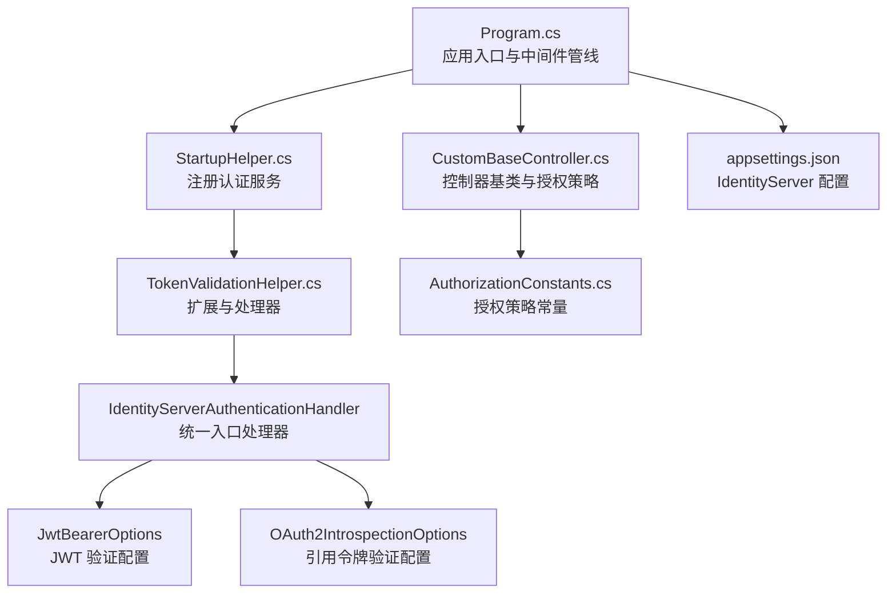
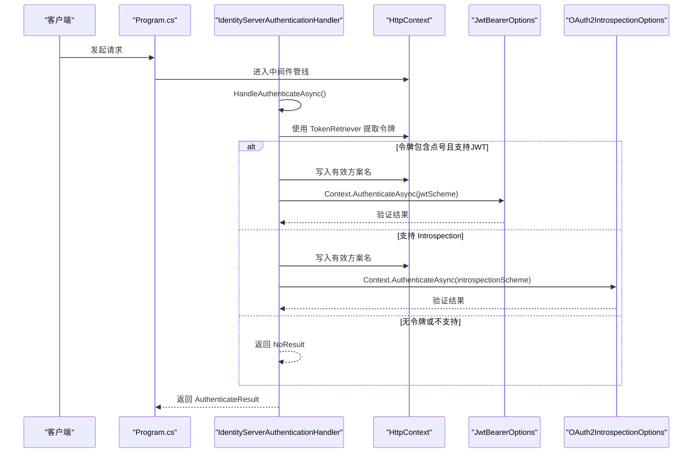
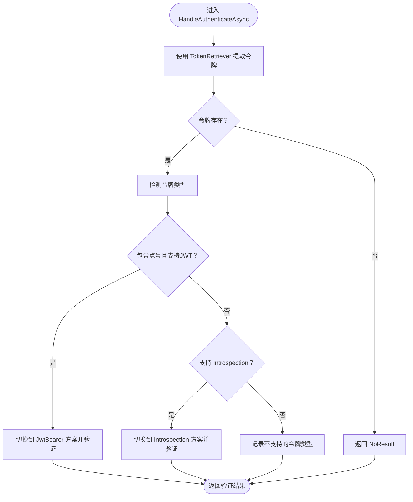
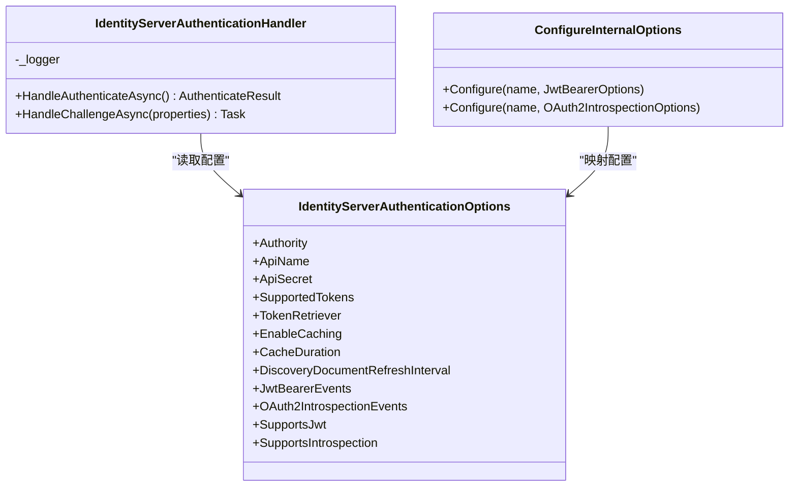
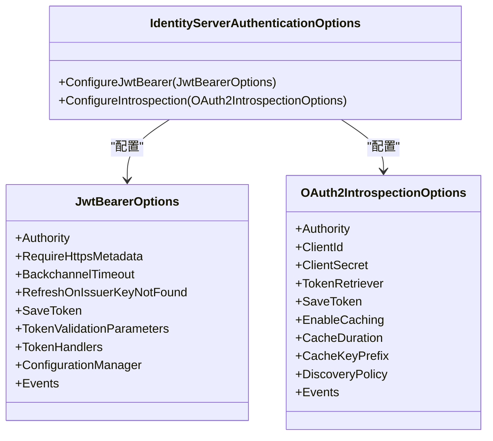
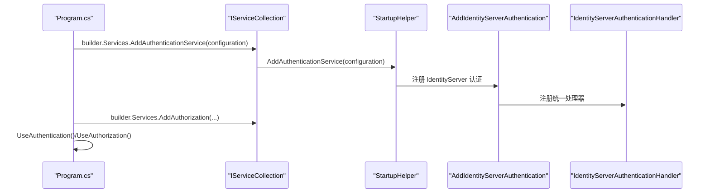
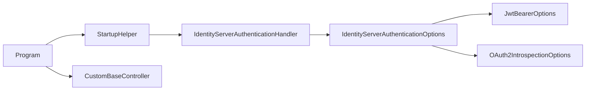

# Token 验证机制

<cite>
**本文档引用的文件**
- [TokenValidationHelper.cs](file://Sylas.RemoteTasks.App/Helpers/TokenValidationHelper.cs)
- [StartupHelper.cs](file://Sylas.RemoteTasks.App/Helpers/StartupHelper.cs)
- [Program.cs](file://Sylas.RemoteTasks.App/Program.cs)
- [CustomBaseController.cs](file://Sylas.RemoteTasks.App/Controllers/CustomBaseController.cs)
- [AuthorizationConstants.cs](file://Sylas.RemoteTasks.Utils/Constants/AuthorizationConstants.cs)
- [appsettings.json](file://Sylas.RemoteTasks.App/appsettings.json)
</cite>

## 目录
1. [简介](#简介)
2. [项目结构](#项目结构)
3. [核心组件](#核心组件)
4. [架构总览](#架构总览)
5. [详细组件分析](#详细组件分析)
6. [依赖关系分析](#依赖关系分析)
7. [性能考量](#性能考量)
8. [故障排查指南](#故障排查指南)
9. [结论](#结论)
10. [附录](#附录)

## 简介
本文件系统性阐述本项目的 Token 验证机制，重点覆盖以下方面：
- 令牌类型检测：如何区分 JWT 与引用令牌（Reference Token）
- 令牌检索策略：从请求头或自定义上下文提取令牌
- 验证流程控制：统一入口处理器如何分派到 JWT 或 Introspection 验证
- 配置项与行为：Authority、ApiName/ApiSecret、SupportedTokens、缓存与发现文档刷新等
- 错误处理与挑战响应：异常捕获、挑战转发与日志追踪
- IdentityServerAuthenticationHandler 工作机制详解
- 实战建议：如何实现智能令牌验证、处理不同验证方案、优化性能与排错

本项目采用 IdentityModel.AspNetCore 提供的扩展，结合自定义的统一验证处理器，实现“既支持 JWT 直接验证，也支持引用令牌经 Introspection 端点验证”的双通道能力，并通过可配置的令牌检索策略与事件钩子，满足生产环境的灵活性与可观测性需求。

## 项目结构
围绕 Token 验证的关键文件与职责如下：
- Helpers/TokenValidationHelper.cs：统一的 IdentityServer 认证扩展、选项、处理器与内部配置适配器
- Helpers/StartupHelper.cs：在启动阶段注册认证服务，绑定 IdentityServer 配置与事件回调
- Program.cs：应用入口，注册认证中间件与授权策略
- Controllers/CustomBaseController.cs：控制器基类，使用授权策略进行访问控制
- Utils/Constants/AuthorizationConstants.cs：授权策略常量
- appsettings.json：IdentityServer 相关配置（Authority、ApiName、ApiSecret、Scopes 等）

图表来源
- [Program.cs](file://Sylas.RemoteTasks.App/Program.cs#L74-L87)
- [StartupHelper.cs](file://Sylas.RemoteTasks.App/Helpers/StartupHelper.cs#L124-L271)
- [TokenValidationHelper.cs](file://Sylas.RemoteTasks.App/Helpers/TokenValidationHelper.cs#L117-L200)
- [CustomBaseController.cs](file://Sylas.RemoteTasks.App/Controllers/CustomBaseController.cs#L10-L11)
- [AuthorizationConstants.cs](file://Sylas.RemoteTasks.Utils/Constants/AuthorizationConstants.cs#L6-L11)
- [appsettings.json](file://Sylas.RemoteTasks.App/appsettings.json#L109-L121)

章节来源
- [Program.cs](file://Sylas.RemoteTasks.App/Program.cs#L74-L87)
- [StartupHelper.cs](file://Sylas.RemoteTasks.App/Helpers/StartupHelper.cs#L124-L271)
- [TokenValidationHelper.cs](file://Sylas.RemoteTasks.App/Helpers/TokenValidationHelper.cs#L117-L200)
- [CustomBaseController.cs](file://Sylas.RemoteTasks.App/Controllers/CustomBaseController.cs#L10-L11)
- [AuthorizationConstants.cs](file://Sylas.RemoteTasks.Utils/Constants/AuthorizationConstants.cs#L6-L11)
- [appsettings.json](file://Sylas.RemoteTasks.App/appsettings.json#L109-L121)

## 核心组件
- IdentityServerAuthenticationExtensions：扩展方法，注册统一的 IdentityServer 认证方案，并按需注册 JwtBearer 与 OAuth2 Introspection 子方案
- IdentityServerAuthenticationOptions：统一的认证选项，包含 Authority、ApiName/ApiSecret、SupportedTokens、TokenRetriever、缓存与发现文档刷新、事件钩子等
- IdentityServerAuthenticationHandler：统一入口处理器，负责令牌类型检测、选择验证通道、上下文传递与挑战转发
- ConfigureInternalOptions：内部适配器，将统一选项映射到具体 JwtBearer 与 Introspection 选项
- StartupHelper.AddAuthenticationService：在启动阶段完成认证服务注册与 IdentityServer 配置绑定
- Program：注册认证中间件与授权策略

章节来源
- [TokenValidationHelper.cs](file://Sylas.RemoteTasks.App/Helpers/TokenValidationHelper.cs#L117-L200)
- [TokenValidationHelper.cs](file://Sylas.RemoteTasks.App/Helpers/TokenValidationHelper.cs#L318-L557)
- [TokenValidationHelper.cs](file://Sylas.RemoteTasks.App/Helpers/TokenValidationHelper.cs#L207-L316)
- [StartupHelper.cs](file://Sylas.RemoteTasks.App/Helpers/StartupHelper.cs#L124-L271)
- [Program.cs](file://Sylas.RemoteTasks.App/Program.cs#L74-L87)

## 架构总览
统一入口处理器在每次请求进入时，先通过 TokenRetriever 从请求中提取令牌；随后根据令牌内容特征与 SupportedTokens 配置，决定走 JWT 验证还是 Introspection 验证；验证成功后，将有效方案名写入上下文，以便后续挑战响应时能正确转发到对应子方案。

图表来源
- [TokenValidationHelper.cs](file://Sylas.RemoteTasks.App/Helpers/TokenValidationHelper.cs#L225-L289)
- [TokenValidationHelper.cs](file://Sylas.RemoteTasks.App/Helpers/TokenValidationHelper.cs#L156-L199)

章节来源
- [TokenValidationHelper.cs](file://Sylas.RemoteTasks.App/Helpers/TokenValidationHelper.cs#L225-L289)
- [TokenValidationHelper.cs](file://Sylas.RemoteTasks.App/Helpers/TokenValidationHelper.cs#L156-L199)

## 详细组件分析

### 组件一：令牌类型检测与检索策略
- 令牌检索策略
  - 默认从 Authorization 头部提取 Bearer 令牌
  - 支持自定义 TokenRetriever 回调，便于从请求体、查询参数或自定义上下文中提取
- 令牌类型检测
  - 若令牌包含点号（.），且支持 JWT，则判定为 JWT
  - 否则若支持 Introspection，则走引用令牌验证
  - 该策略允许同一入口同时兼容两种令牌形态，提升系统灵活性

图表来源
- [TokenValidationHelper.cs](file://Sylas.RemoteTasks.App/Helpers/TokenValidationHelper.cs#L225-L289)
- [TokenValidationHelper.cs](file://Sylas.RemoteTasks.App/Helpers/TokenValidationHelper.cs#L345-L345)

章节来源
- [TokenValidationHelper.cs](file://Sylas.RemoteTasks.App/Helpers/TokenValidationHelper.cs#L225-L289)
- [TokenValidationHelper.cs](file://Sylas.RemoteTasks.App/Helpers/TokenValidationHelper.cs#L345-L345)

### 组件二：IdentityServerAuthenticationHandler 工作机制
- 身份验证入口
  - 从 Options.TokenRetriever 获取令牌
  - 将令牌写入 HttpContext.Items，供子方案共享
  - 根据 SupportedTokens 与令牌特征选择 JwtBearer 或 OAuth2 Introspection
- 挑战响应转发
  - 在 HandleChallengeAsync 中，依据上下文中记录的有效方案，将挑战转发到对应子方案
- 异常处理
  - 捕获异常并返回 Fail，同时记录错误日志
  - 最终清理上下文中的令牌项，避免泄漏

图表来源
- [TokenValidationHelper.cs](file://Sylas.RemoteTasks.App/Helpers/TokenValidationHelper.cs#L207-L316)
- [TokenValidationHelper.cs](file://Sylas.RemoteTasks.App/Helpers/TokenValidationHelper.cs#L318-L557)
- [TokenValidationHelper.cs](file://Sylas.RemoteTasks.App/Helpers/TokenValidationHelper.cs#L55-L92)

章节来源
- [TokenValidationHelper.cs](file://Sylas.RemoteTasks.App/Helpers/TokenValidationHelper.cs#L207-L316)
- [TokenValidationHelper.cs](file://Sylas.RemoteTasks.App/Helpers/TokenValidationHelper.cs#L55-L92)

### 组件三：JwtBearer 与 Introspection 配置适配
- JwtBearer 配置要点
  - Authority、RequireHttpsMetadata、BackchannelTimeout
  - Audience 验证策略：当 ApiName 非空且非 Legacy 模式时启用严格 Audience 校验；否则关闭 Audience 校验，仅依赖 Scope
  - NameClaimType/RoleClaimType、ClockSkew、TokenHandlers
  - DiscoveryDocumentRefreshInterval：可选的发现文档刷新间隔
  - 事件钩子：OnMessageReceived、OnTokenValidated、OnAuthenticationFailed、OnChallenge
- Introspection 配置要点
  - Authority、ClientId(ApiName)、ClientSecret(ApiSecret)
  - TokenRetriever 使用内部共享令牌
  - EnableCaching、CacheDuration、CacheKeyPrefix
  - DiscoveryPolicy.RequireHttps
  - 事件钩子：OnAuthenticationFailed、OnTokenValidated

图表来源
- [TokenValidationHelper.cs](file://Sylas.RemoteTasks.App/Helpers/TokenValidationHelper.cs#L445-L522)
- [TokenValidationHelper.cs](file://Sylas.RemoteTasks.App/Helpers/TokenValidationHelper.cs#L524-L556)

章节来源
- [TokenValidationHelper.cs](file://Sylas.RemoteTasks.App/Helpers/TokenValidationHelper.cs#L445-L522)
- [TokenValidationHelper.cs](file://Sylas.RemoteTasks.App/Helpers/TokenValidationHelper.cs#L524-L556)

### 组件四：启动阶段认证注册与授权策略
- 启动阶段注册
  - 设置默认认证方案为 Bearer
  - 通过 AddIdentityServerAuthentication 绑定 IdentityServer 配置
  - 注册 JwtBearer 事件回调，如 OnTokenValidated 中进行 Claims 转换
- 授权策略
  - 使用 AuthorizationConstants.AdministrationPolicy 定义管理员策略
  - 控制器基类通过 [Authorize(Policy = ...)] 应用策略

图表来源
- [Program.cs](file://Sylas.RemoteTasks.App/Program.cs#L74-L87)
- [StartupHelper.cs](file://Sylas.RemoteTasks.App/Helpers/StartupHelper.cs#L124-L271)
- [CustomBaseController.cs](file://Sylas.RemoteTasks.App/Controllers/CustomBaseController.cs#L10-L11)
- [AuthorizationConstants.cs](file://Sylas.RemoteTasks.Utils/Constants/AuthorizationConstants.cs#L6-L11)

章节来源
- [Program.cs](file://Sylas.RemoteTasks.App/Program.cs#L74-L87)
- [StartupHelper.cs](file://Sylas.RemoteTasks.App/Helpers/StartupHelper.cs#L124-L271)
- [CustomBaseController.cs](file://Sylas.RemoteTasks.App/Controllers/CustomBaseController.cs#L10-L11)
- [AuthorizationConstants.cs](file://Sylas.RemoteTasks.Utils/Constants/AuthorizationConstants.cs#L6-L11)

## 依赖关系分析
- 组件内聚与耦合
  - IdentityServerAuthenticationHandler 与 IdentityServerAuthenticationOptions 高内聚，通过 ConfigureInternalOptions 解耦到具体子方案
  - StartupHelper 将 IdentityServer 配置与事件回调集中管理，降低控制器与配置的耦合
- 外部依赖
  - IdentityModel.AspNetCore.OAuth2Introspection：提供 OAuth2 Introspection 验证能力
  - Microsoft.AspNetCore.Authentication.JwtBearer：提供 JWT 验证能力
  - Microsoft.IdentityModel.Protocols.OpenIdConnect：提供发现文档与密钥轮换支持

图表来源
- [TokenValidationHelper.cs](file://Sylas.RemoteTasks.App/Helpers/TokenValidationHelper.cs#L207-L316)
- [TokenValidationHelper.cs](file://Sylas.RemoteTasks.App/Helpers/TokenValidationHelper.cs#L318-L557)
- [StartupHelper.cs](file://Sylas.RemoteTasks.App/Helpers/StartupHelper.cs#L124-L271)
- [Program.cs](file://Sylas.RemoteTasks.App/Program.cs#L74-L87)

章节来源
- [TokenValidationHelper.cs](file://Sylas.RemoteTasks.App/Helpers/TokenValidationHelper.cs#L207-L316)
- [TokenValidationHelper.cs](file://Sylas.RemoteTasks.App/Helpers/TokenValidationHelper.cs#L318-L557)
- [StartupHelper.cs](file://Sylas.RemoteTasks.App/Helpers/StartupHelper.cs#L124-L271)
- [Program.cs](file://Sylas.RemoteTasks.App/Program.cs#L74-L87)

## 性能考量
- 缓存与发现文档刷新
  - EnableCaching 与 CacheDuration：开启 Introspection 结果缓存，减少对授权中心的调用压力
  - DiscoveryDocumentRefreshInterval：可配置 JWT 发现文档刷新周期，平衡一致性与性能
- 背通道超时与 HTTP 处理器
  - BackChannelTimeouts：控制发现文档与密钥轮换的背通道请求超时
  - JwtBackChannelHandler：可注入自定义 HttpClientHandler，便于复用连接池与代理设置
- 令牌处理器优化
  - 清空默认 TokenHandlers 并显式添加 JwtSecurityTokenHandler，避免不必要的验证器开销
- 日志与追踪
  - 使用 Trace 级别日志记录令牌类型检测与验证过程，便于定位性能瓶颈与异常

章节来源
- [TokenValidationHelper.cs](file://Sylas.RemoteTasks.App/Helpers/TokenValidationHelper.cs#L376-L410)
- [TokenValidationHelper.cs](file://Sylas.RemoteTasks.App/Helpers/TokenValidationHelper.cs#L433-L433)
- [TokenValidationHelper.cs](file://Sylas.RemoteTasks.App/Helpers/TokenValidationHelper.cs#L415-L415)
- [TokenValidationHelper.cs](file://Sylas.RemoteTasks.App/Helpers/TokenValidationHelper.cs#L519-L520)

## 故障排查指南
- 常见问题与解决方案
  - 令牌为空或格式不正确
    - 检查 TokenRetriever 是否正确从 Authorization 头提取 Bearer 令牌
    - 确认请求头格式为 “Bearer {token}”
  - 不支持的令牌类型
    - 若令牌不含点号但启用了 Introspection，将走引用令牌验证；若未启用 Introspection，将返回 NoResult
    - 确认 SupportedTokens 配置与实际令牌形态一致
  - Introspection 配置缺失
    - 当 ApiSecret 非空时，必须配置 ApiName；否则抛出参数异常
  - Audience 验证失败
    - 当 ApiName 非空且非 Legacy 模式时启用严格 Audience 校验；否则关闭 Audience 校验
    - 如需基于 Scope 的授权，请确保 ScopePolicy 正确配置
  - 事件回调未生效
    - 确认 JwtBearerEvents 与 OAuth2IntrospectionEvents 已正确赋值
- 日志与调试
  - 使用 Trace 级别日志查看 HandleAuthenticateAsync 的执行路径
  - 在 OnAuthenticationFailed 与 OnTokenValidated 中输出关键上下文信息，辅助定位问题

章节来源
- [TokenValidationHelper.cs](file://Sylas.RemoteTasks.App/Helpers/TokenValidationHelper.cs#L225-L289)
- [TokenValidationHelper.cs](file://Sylas.RemoteTasks.App/Helpers/TokenValidationHelper.cs#L524-L556)
- [TokenValidationHelper.cs](file://Sylas.RemoteTasks.App/Helpers/TokenValidationHelper.cs#L493-L501)
- [TokenValidationHelper.cs](file://Sylas.RemoteTasks.App/Helpers/TokenValidationHelper.cs#L421-L426)

## 结论
本项目通过统一入口处理器与可配置选项，实现了对 JWT 与引用令牌的智能识别与验证，具备良好的扩展性与可观测性。通过合理的缓存策略、发现文档刷新与事件钩子，既能满足高并发场景下的性能需求，也能在复杂的身份认证场景中保持灵活性。建议在生产环境中：
- 明确 SupportedTokens 与 TokenRetriever 策略
- 合理配置缓存与刷新周期
- 使用事件钩子进行审计与诊断
- 严格区分 Audience 与 Scope 的验证策略

## 附录
- 关键配置项说明
  - Authority：IdentityServer 发现端点基础地址
  - RequireHttpsMetadata：是否要求 HTTPS
  - SupportedTokens：支持的令牌类型（Both/JWT/Reference）
  - ApiName/ApiSecret：Introspection 验证所需的资源名与密钥
  - EnableCaching/CacheDuration：Introspection 缓存开关与过期时间
  - DiscoveryDocumentRefreshInterval：JWT 发现文档刷新间隔
  - JwtBearerEvents/OAuth2IntrospectionEvents：验证事件回调
  - TokenRetriever：自定义令牌提取逻辑

章节来源
- [TokenValidationHelper.cs](file://Sylas.RemoteTasks.App/Helpers/TokenValidationHelper.cs#L329-L426)
- [appsettings.json](file://Sylas.RemoteTasks.App/appsettings.json#L109-L121)