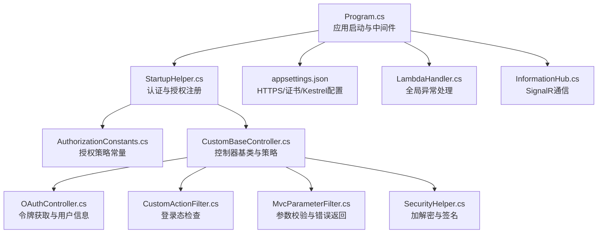
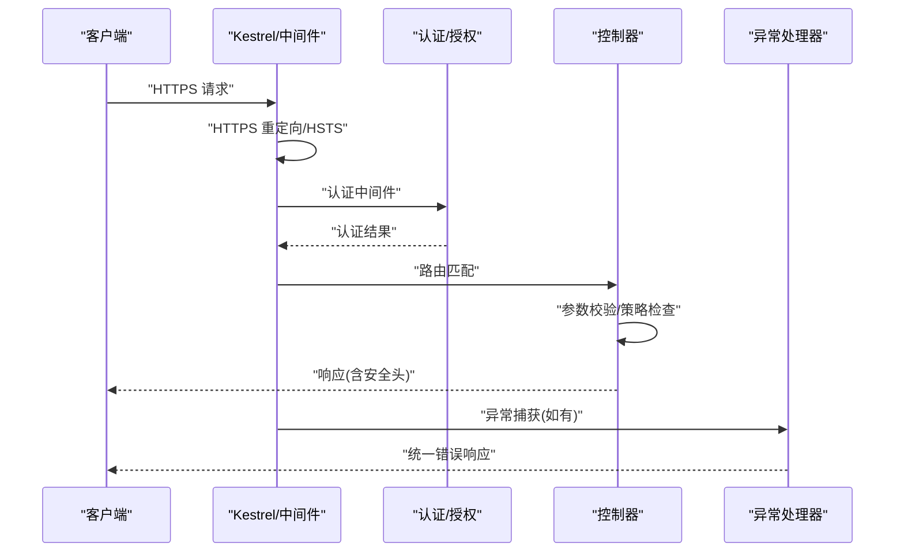
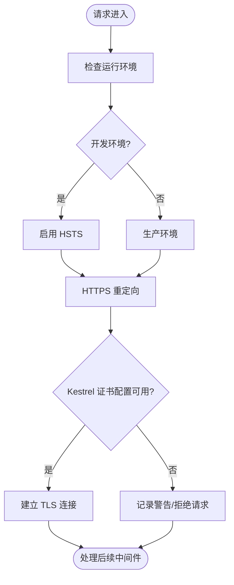
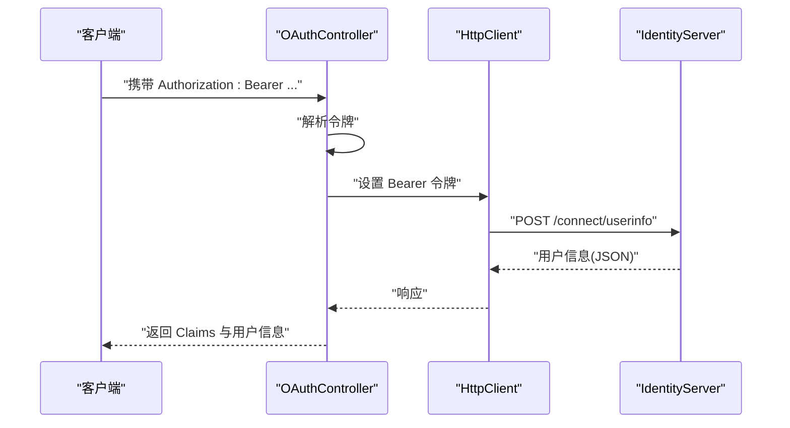
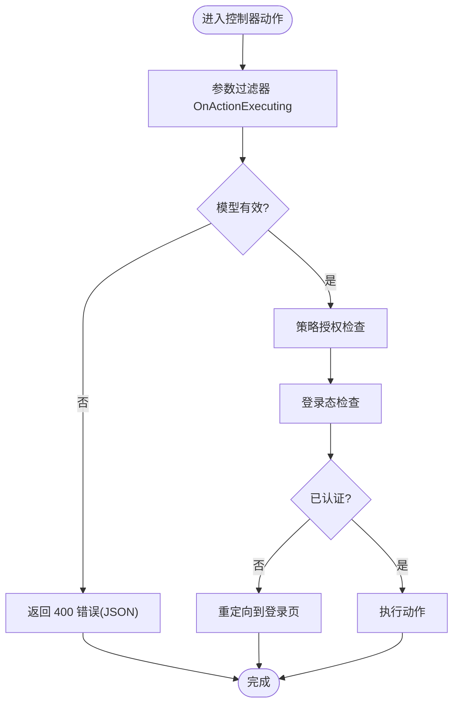
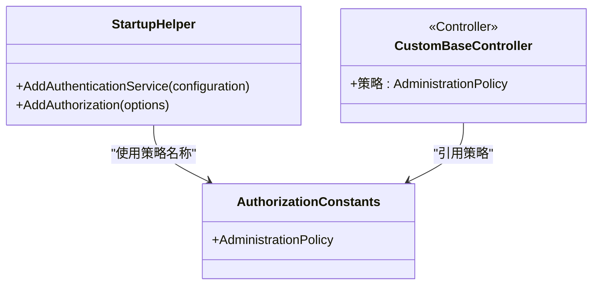
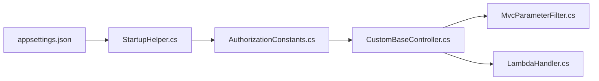

# 安全最佳实践

<cite>
**本文引用的文件**
- [Program.cs](file://Sylas.RemoteTasks.App/Program.cs)
- [appsettings.json](file://Sylas.RemoteTasks.App/appsettings.json)
- [StartupHelper.cs](file://Sylas.RemoteTasks.App/Helpers/StartupHelper.cs)
- [AuthorizationConstants.cs](file://Sylas.RemoteTasks.Utils/Constants/AuthorizationConstants.cs)
- [HeaderConstants.cs](file://Sylas.RemoteTasks.Utils/Constants/HeaderConstants.cs)
- [CustomBaseController.cs](file://Sylas.RemoteTasks.App/Controllers/CustomBaseController.cs)
- [OAuthController.cs](file://Sylas.RemoteTasks.App/Controllers/OAuthController.cs)
- [CustomActionFilter.cs](file://Sylas.RemoteTasks.App/Infrastructure/CustomActionFilter.cs)
- [MvcParameterFilter.cs](file://Sylas.RemoteTasks.App/Infrastructure/MvcParameterFilter.cs)
- [LambdaHandler.cs](file://Sylas.RemoteTasks.App/ExceptionHandlers/LambdaHandler.cs)
- [SecurityHelper.cs](file://Sylas.RemoteTasks.Common/SecurityHelper.cs)
- [InformationHub.cs](file://Sylas.RemoteTasks.App/Hubs/InformationHub.cs)
</cite>

## 目录
1. [引言](#引言)
2. [项目结构](#项目结构)
3. [核心组件](#核心组件)
4. [架构总览](#架构总览)
5. [详细组件分析](#详细组件分析)
6. [依赖分析](#依赖分析)
7. [性能考量](#性能考量)
8. [故障排查指南](#故障排查指南)
9. [结论](#结论)
10. [附录](#附录)

## 引言
本文件聚焦于本项目的“安全最佳实践”，围绕 HTTPS 强制、令牌存储与传输安全、跨域与同源策略、CSRF 保护、安全响应头配置、异常与日志安全、以及与安全常量和配置的协同实践展开。文档以代码库为依据，提供可落地的配置说明、策略实现与常见问题的解决方案，并辅以可视化流程图帮助不同层次读者快速掌握。

## 项目结构
本项目采用典型的 ASP.NET Core 分层结构，安全相关能力主要分布在以下模块：
- 应用启动与中间件管线：Program.cs、appsettings.json
- 认证与授权：StartupHelper.cs、AuthorizationConstants.cs、CustomBaseController.cs
- 请求头与安全常量：HeaderConstants.cs
- 控制器与过滤器：OAuthController.cs、CustomActionFilter.cs、MvcParameterFilter.cs
- 异常与错误处理：LambdaHandler.cs
- 加密与签名工具：SecurityHelper.cs
- SignalR 通信：InformationHub.cs

图表来源
- [Program.cs](file://Sylas.RemoteTasks.App/Program.cs#L1-L122)
- [StartupHelper.cs](file://Sylas.RemoteTasks.App/Helpers/StartupHelper.cs#L1-L275)
- [appsettings.json](file://Sylas.RemoteTasks.App/appsettings.json#L1-L142)
- [AuthorizationConstants.cs](file://Sylas.RemoteTasks.Utils/Constants/AuthorizationConstants.cs#L1-L14)
- [CustomBaseController.cs](file://Sylas.RemoteTasks.App/Controllers/CustomBaseController.cs#L1-L145)
- [OAuthController.cs](file://Sylas.RemoteTasks.App/Controllers/OAuthController.cs#L1-L49)
- [CustomActionFilter.cs](file://Sylas.RemoteTasks.App/Infrastructure/CustomActionFilter.cs#L1-L23)
- [MvcParameterFilter.cs](file://Sylas.RemoteTasks.App/Infrastructure/MvcParameterFilter.cs#L1-L37)
- [LambdaHandler.cs](file://Sylas.RemoteTasks.App/ExceptionHandlers/LambdaHandler.cs#L1-L28)
- [SecurityHelper.cs](file://Sylas.RemoteTasks.Common/SecurityHelper.cs#L1-L228)
- [InformationHub.cs](file://Sylas.RemoteTasks.App/Hubs/InformationHub.cs)

章节来源
- [Program.cs](file://Sylas.RemoteTasks.App/Program.cs#L1-L122)
- [appsettings.json](file://Sylas.RemoteTasks.App/appsettings.json#L1-L142)

## 核心组件
- HTTPS 强制与 Kestrel 配置：通过中间件与配置项确保所有流量走 TLS。
- 认证与授权：基于 IdentityServer 的 Bearer Token 与策略授权。
- 令牌传输与存储：控制器中显式提取 Bearer 令牌并进行安全使用；提供加密与签名工具。
- 跨域与同源：通过请求头常量与路由控制实现可信来源访问。
- CSRF 保护：结合授权策略与参数校验过滤器，降低跨站请求风险。
- 安全响应头：HSTS、HTTPS 重定向等中间件保障传输安全。
- 异常与日志：统一异常处理，避免敏感信息泄露。

章节来源
- [Program.cs](file://Sylas.RemoteTasks.App/Program.cs#L99-L122)
- [StartupHelper.cs](file://Sylas.RemoteTasks.App/Helpers/StartupHelper.cs#L124-L275)
- [appsettings.json](file://Sylas.RemoteTasks.App/appsettings.json#L109-L121)
- [CustomBaseController.cs](file://Sylas.RemoteTasks.App/Controllers/CustomBaseController.cs#L10-L14)
- [OAuthController.cs](file://Sylas.RemoteTasks.App/Controllers/OAuthController.cs#L31-L46)
- [SecurityHelper.cs](file://Sylas.RemoteTasks.Common/SecurityHelper.cs#L1-L228)

## 架构总览
下图展示了请求从进入管线到控制器处理的关键安全环节，包括 HTTPS 强制、认证授权、令牌提取与异常处理。

图表来源
- [Program.cs](file://Sylas.RemoteTasks.App/Program.cs#L102-L122)
- [StartupHelper.cs](file://Sylas.RemoteTasks.App/Helpers/StartupHelper.cs#L124-L275)
- [LambdaHandler.cs](file://Sylas.RemoteTasks.App/ExceptionHandlers/LambdaHandler.cs#L9-L25)

## 详细组件分析

### HTTPS 强制与 Kestrel 配置
- HTTPS 强制：开发环境下启用 HSTS，生产环境建议配合反向代理与证书配置。
- Kestrel 端点：配置文件中预留了 HTTPS 端点与证书参数，便于在部署时启用 TLS。
- 传输层安全：结合 RequireHttpsMetadata 与 HTTPS 重定向中间件，确保令牌与数据在传输过程中受保护。

图表来源
- [Program.cs](file://Sylas.RemoteTasks.App/Program.cs#L102-L110)
- [appsettings.json](file://Sylas.RemoteTasks.App/appsettings.json#L51-L64)

章节来源
- [Program.cs](file://Sylas.RemoteTasks.App/Program.cs#L102-L110)
- [appsettings.json](file://Sylas.RemoteTasks.App/appsettings.json#L51-L64)

### 令牌存储与传输安全
- 令牌提取：控制器中从 Authorization 请求头提取 Bearer 令牌，避免在 URL 或 Cookie 中携带敏感令牌。
- 令牌使用：通过 HttpClient 设置 Bearer 令牌访问用户信息接口，减少令牌暴露面。
- 加密与签名：提供 AES 加解密与 HMAC-SHA256 签名工具，可用于本地敏感数据存储与消息签名。

图表来源
- [OAuthController.cs](file://Sylas.RemoteTasks.App/Controllers/OAuthController.cs#L31-L46)
- [SecurityHelper.cs](file://Sylas.RemoteTasks.Common/SecurityHelper.cs#L216-L225)

章节来源
- [OAuthController.cs](file://Sylas.RemoteTasks.App/Controllers/OAuthController.cs#L31-L46)
- [SecurityHelper.cs](file://Sylas.RemoteTasks.Common/SecurityHelper.cs#L36-L88)
- [SecurityHelper.cs](file://Sylas.RemoteTasks.Common/SecurityHelper.cs#L216-L225)

### 跨域与同源策略
- 同源策略：控制器与前端交互遵循浏览器同源策略，避免跨站脚本攻击。
- 请求头常量：通过 X-Real-IP、X-Forwarded-For 等请求头获取真实来源，便于审计与风控。
- 路由与来源控制：结合控制器策略与过滤器，确保仅授权来源访问敏感接口。

章节来源
- [HeaderConstants.cs](file://Sylas.RemoteTasks.Utils/Constants/HeaderConstants.cs#L1-L18)
- [CustomBaseController.cs](file://Sylas.RemoteTasks.App/Controllers/CustomBaseController.cs#L10-L14)

### CSRF 保护
- 授权策略：控制器基类使用策略授权，降低匿名访问风险。
- 参数校验：参数过滤器在 Action 执行前校验模型状态，非法输入直接返回结构化错误。
- 登录态检查：动作过滤器在 Action 执行后检查用户是否已认证，未认证则重定向登录。

图表来源
- [CustomBaseController.cs](file://Sylas.RemoteTasks.App/Controllers/CustomBaseController.cs#L10-L14)
- [MvcParameterFilter.cs](file://Sylas.RemoteTasks.App/Infrastructure/MvcParameterFilter.cs#L14-L34)
- [CustomActionFilter.cs](file://Sylas.RemoteTasks.App/Infrastructure/CustomActionFilter.cs#L16-L20)

章节来源
- [CustomBaseController.cs](file://Sylas.RemoteTasks.App/Controllers/CustomBaseController.cs#L10-L14)
- [MvcParameterFilter.cs](file://Sylas.RemoteTasks.App/Infrastructure/MvcParameterFilter.cs#L14-L34)
- [CustomActionFilter.cs](file://Sylas.RemoteTasks.App/Infrastructure/CustomActionFilter.cs#L16-L20)

### 安全头配置与 HSTS
- HSTS：非开发环境启用 HSTS，提升长期安全强度。
- HTTPS 重定向：强制所有请求走 HTTPS，防止降级攻击。
- 日志与异常：统一异常处理返回 JSON，避免敏感堆栈信息泄露。

章节来源
- [Program.cs](file://Sylas.RemoteTasks.App/Program.cs#L102-L110)
- [LambdaHandler.cs](file://Sylas.RemoteTasks.App/ExceptionHandlers/LambdaHandler.cs#L9-L25)

### 认证与授权策略
- IdentityServer 集成：配置 Authority、RequireHttpsMetadata、ClientId/Secret、Scope 等，确保令牌签发与验证安全。
- 自定义策略：基于角色与作用域构建管理员策略，控制器基类使用该策略进行访问控制。
- 令牌验证：在认证中间件中映射声明类型，确保授权策略能正确识别角色与范围。

图表来源
- [StartupHelper.cs](file://Sylas.RemoteTasks.App/Helpers/StartupHelper.cs#L124-L275)
- [AuthorizationConstants.cs](file://Sylas.RemoteTasks.Utils/Constants/AuthorizationConstants.cs#L1-L14)
- [CustomBaseController.cs](file://Sylas.RemoteTasks.App/Controllers/CustomBaseController.cs#L10-L14)

章节来源
- [StartupHelper.cs](file://Sylas.RemoteTasks.App/Helpers/StartupHelper.cs#L124-L275)
- [AuthorizationConstants.cs](file://Sylas.RemoteTasks.Utils/Constants/AuthorizationConstants.cs#L1-L14)
- [CustomBaseController.cs](file://Sylas.RemoteTasks.App/Controllers/CustomBaseController.cs#L10-L14)

### SignalR 通信安全
- 传输格式：SignalR 在浏览器环境通过 WebSocket 或 SSE 传输，令牌可通过查询参数或请求头传递。
- 安全建议：在生产中优先使用 WebSocket 并确保 HTTPS；避免在 URL 中暴露访问令牌。

章节来源
- [InformationHub.cs](file://Sylas.RemoteTasks.App/Hubs/InformationHub.cs)

## 依赖分析
- 认证与授权依赖配置文件中的 IdentityServer 参数，确保 RequireHttpsMetadata 与 Scope 正确配置。
- 控制器依赖策略常量与过滤器，形成统一的访问控制链路。
- 异常处理依赖全局异常中间件，保证错误响应的一致性与安全性。

图表来源
- [appsettings.json](file://Sylas.RemoteTasks.App/appsettings.json#L109-L121)
- [StartupHelper.cs](file://Sylas.RemoteTasks.App/Helpers/StartupHelper.cs#L124-L275)
- [AuthorizationConstants.cs](file://Sylas.RemoteTasks.Utils/Constants/AuthorizationConstants.cs#L1-L14)
- [CustomBaseController.cs](file://Sylas.RemoteTasks.App/Controllers/CustomBaseController.cs#L10-L14)
- [MvcParameterFilter.cs](file://Sylas.RemoteTasks.App/Infrastructure/MvcParameterFilter.cs#L1-L37)
- [LambdaHandler.cs](file://Sylas.RemoteTasks.App/ExceptionHandlers/LambdaHandler.cs#L1-L28)

章节来源
- [appsettings.json](file://Sylas.RemoteTasks.App/appsettings.json#L109-L121)
- [StartupHelper.cs](file://Sylas.RemoteTasks.App/Helpers/StartupHelper.cs#L124-L275)
- [CustomBaseController.cs](file://Sylas.RemoteTasks.App/Controllers/CustomBaseController.cs#L10-L14)

## 性能考量
- 令牌验证与缓存：IdentityServer 配置支持缓存与 HTTPS 强制，减少重复验证开销。
- 中间件顺序：HTTPS 重定向与 HSTS 应尽早执行，避免不必要的后续处理。
- 异常处理：统一异常处理器返回 JSON，减少异常页面渲染成本。

[本节为通用指导，不直接分析具体文件]

## 故障排查指南
- HTTPS 无法访问
  - 检查 Kestrel 端点与证书配置是否启用。
  - 确认 RequireHttpsMetadata 与 HTTPS 重定向中间件生效。
- 令牌无效或 401
  - 确认 Authorization 头格式为 Bearer 令牌。
  - 校验 IdentityServer 的 Authority、ClientId/Secret、Scope 与 RequireHttpsMetadata。
- 参数校验失败
  - 检查参数过滤器是否拦截非法输入并返回 400。
- 登录态丢失
  - 确认会话与 Cookie 配置，避免 HttpOnly 与 SameSite 设置不当导致跨站请求失败。

章节来源
- [appsettings.json](file://Sylas.RemoteTasks.App/appsettings.json#L51-L64)
- [StartupHelper.cs](file://Sylas.RemoteTasks.App/Helpers/StartupHelper.cs#L147-L153)
- [MvcParameterFilter.cs](file://Sylas.RemoteTasks.App/Infrastructure/MvcParameterFilter.cs#L14-L34)
- [CustomActionFilter.cs](file://Sylas.RemoteTasks.App/Infrastructure/CustomActionFilter.cs#L16-L20)

## 结论
本项目在安全方面具备较为完整的基础设施：HTTPS 强制、IdentityServer 集成、策略授权、参数校验与统一异常处理。建议在生产环境中进一步完善：
- 强制 HTTPS 与 HSTS 配置；
- 严格控制令牌传输与存储；
- 明确跨域与同源策略；
- 结合审计日志与监控体系持续加固。

[本节为总结性内容，不直接分析具体文件]

## 附录
- 安全配置参数清单
  - IdentityServerConfiguration
    - Authority：认证服务器地址
    - RequireHttpsMetadata：是否要求 HTTPS 元数据
    - ClientId/ClientSecret：客户端凭据
    - ApiName/ApiSecret：API 资源与密钥
    - Scopes：作用域列表
    - EnableCaching/CacheDuration：缓存开关与时长
  - Kestrel.Endpoints：HTTPS 端点与证书配置
  - Logging：日志级别与输出格式
- 常见安全常量
  - HeaderConstants：X-Real-IP、X-Forwarded-For
  - AuthorizationConstants：管理员策略名称

章节来源
- [appsettings.json](file://Sylas.RemoteTasks.App/appsettings.json#L109-L121)
- [appsettings.json](file://Sylas.RemoteTasks.App/appsettings.json#L51-L64)
- [HeaderConstants.cs](file://Sylas.RemoteTasks.Utils/Constants/HeaderConstants.cs#L1-L18)
- [AuthorizationConstants.cs](file://Sylas.RemoteTasks.Utils/Constants/AuthorizationConstants.cs#L1-L14)