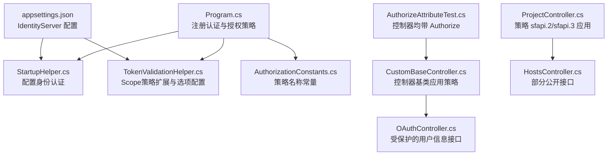
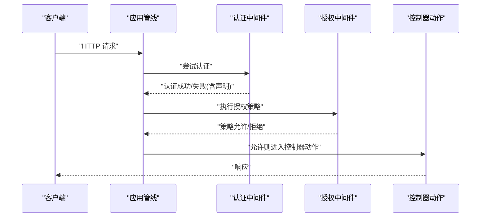
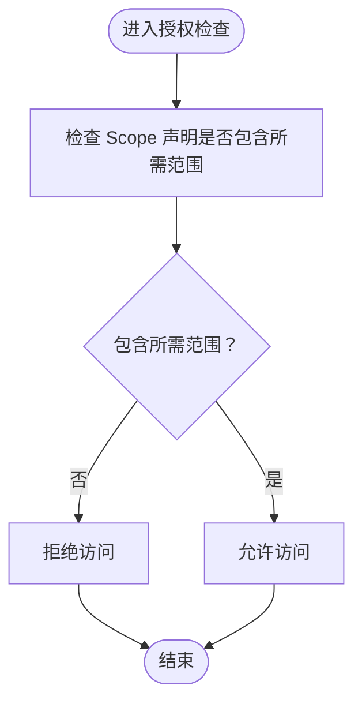
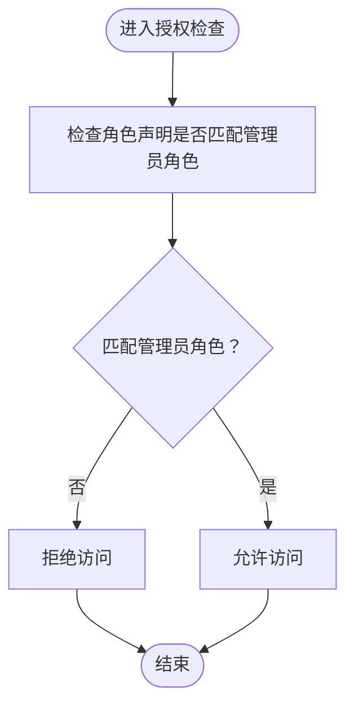
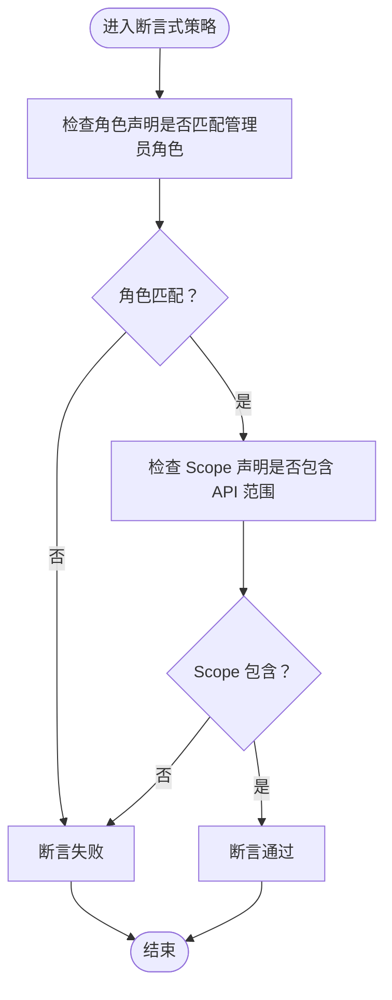
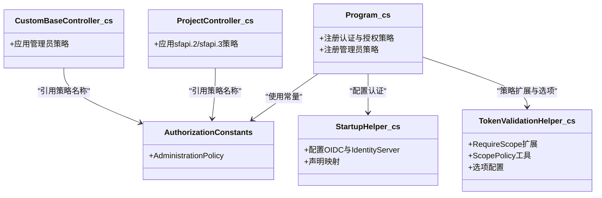
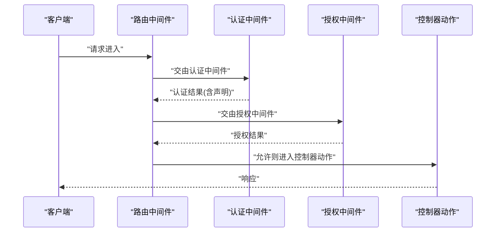
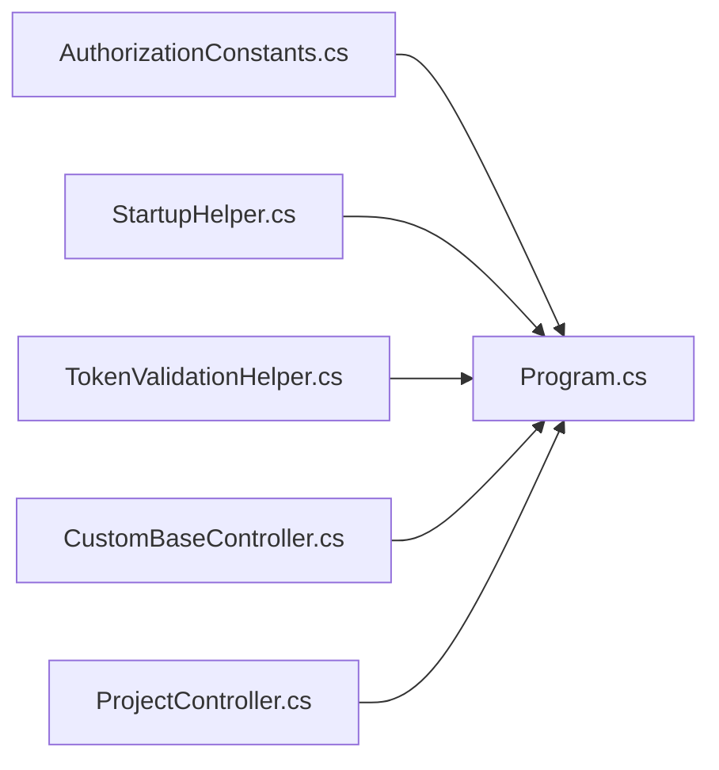

# 权限控制策略

<cite>
**本文引用的文件**
- [Program.cs](file://Sylas.RemoteTasks.App/Program.cs)
- [AuthorizationConstants.cs](file://Sylas.RemoteTasks.Utils/Constants/AuthorizationConstants.cs)
- [TokenValidationHelper.cs](file://Sylas.RemoteTasks.App/Helpers/TokenValidationHelper.cs)
- [StartupHelper.cs](file://Sylas.RemoteTasks.App/Helpers/StartupHelper.cs)
- [CustomBaseController.cs](file://Sylas.RemoteTasks.App/Controllers/CustomBaseController.cs)
- [OAuthController.cs](file://Sylas.RemoteTasks.App/Controllers/OAuthController.cs)
- [ProjectController.cs](file://Sylas.RemoteTasks.App/Controllers/ProjectController.cs)
- [HostsController.cs](file://Sylas.RemoteTasks.App/Controllers/HostsController.cs)
- [appsettings.json](file://Sylas.RemoteTasks.App/appsettings.json)
- [AuthorizeAttributeTest.cs](file://Sylas.RemoteTasks.Test/Auth/AuthorizeAttributeTest.cs)
</cite>

## 目录
1. [简介](#简介)
2. [项目结构](#项目结构)
3. [核心组件](#核心组件)
4. [架构总览](#架构总览)
5. [详细组件分析](#详细组件分析)
6. [依赖关系分析](#依赖关系分析)
7. [性能考虑](#性能考虑)
8. [故障排除指南](#故障排除指南)
9. [结论](#结论)
10. [附录](#附录)

## 简介
本文件系统性梳理并讲解本项目中的权限控制策略，重点覆盖以下方面：
- 基于范围的授权（Scope-based）：如何通过 Scope 声明进行 API 访问授权。
- 角色授权（Role-based）：如何结合角色声明与 Scope 声明实现复合授权策略。
- 声明授权（Claim-based）：如何利用自定义声明与断言式策略进行细粒度授权。
- 自定义授权策略：如何在授权策略中组合角色、范围与声明，形成可复用的策略。
- 与 ASP.NET Core 授权系统的集成：认证中间件、授权中间件、策略注册与控制器上的策略应用。
- 常见配置问题与解决方案：包括 Scope 缺失、角色映射、声明类型、HTTPS 元数据、缓存与令牌检索等。

本文件既面向初学者提供清晰的概念与流程说明，也为有经验的开发者提供代码级的实现细节与最佳实践建议。

## 项目结构
围绕权限控制的关键文件分布如下：
- 应用启动与授权策略注册：Program.cs
- 授权常量与策略名称：AuthorizationConstants.cs
- 身份认证与授权扩展：TokenValidationHelper.cs、StartupHelper.cs
- 控制器上的策略应用与受保护资源：CustomBaseController.cs、OAuthController.cs、ProjectController.cs、HostsController.cs
- 配置文件：appsettings.json
- 授权属性测试：AuthorizeAttributeTest.cs

图表来源
- [Program.cs](file://Sylas.RemoteTasks.App/Program.cs#L74-L87)
- [StartupHelper.cs](file://Sylas.RemoteTasks.App/Helpers/StartupHelper.cs#L123-L157)
- [TokenValidationHelper.cs](file://Sylas.RemoteTasks.App/Helpers/TokenValidationHelper.cs#L18-L53)
- [AuthorizationConstants.cs](file://Sylas.RemoteTasks.Utils/Constants/AuthorizationConstants.cs#L6-L12)
- [CustomBaseController.cs](file://Sylas.RemoteTasks.App/Controllers/CustomBaseController.cs#L10-L14)
- [OAuthController.cs](file://Sylas.RemoteTasks.App/Controllers/OAuthController.cs#L31-L46)
- [ProjectController.cs](file://Sylas.RemoteTasks.App/Controllers/ProjectController.cs#L117-L139)
- [HostsController.cs](file://Sylas.RemoteTasks.App/Controllers/HostsController.cs#L22-L26)
- [appsettings.json](file://Sylas.RemoteTasks.App/appsettings.json#L109-L121)
- [AuthorizeAttributeTest.cs](file://Sylas.RemoteTasks.Test/Auth/AuthorizeAttributeTest.cs#L8-L17)

章节来源
- [Program.cs](file://Sylas.RemoteTasks.App/Program.cs#L74-L116)
- [appsettings.json](file://Sylas.RemoteTasks.App/appsettings.json#L109-L121)

## 核心组件
- 授权策略注册与中间件管线
  - 在应用启动阶段注册认证与授权，并在授权策略中定义“超级管理员”策略，该策略要求用户具备特定角色声明与 API 的 Scope 声明。
  - 在路由与认证/授权中间件之间正确顺序放置，确保请求在进入控制器前完成身份认证与授权检查。
- 身份认证与声明映射
  - 通过 StartupHelper 配置 OIDC 与 IdentityServer，启用声明映射（如将传统 Role 声明映射为标准 JwtClaimTypes.Role），并支持 JWT 与引用令牌两种模式。
  - TokenValidationHelper 提供 Scope 相关的策略扩展与选项配置，便于统一管理 Scope 策略与令牌验证行为。
- 控制器与动作上的策略应用
  - 控制器基类通过 Authorize(Policy = ...) 应用统一的管理员策略，保证关键功能模块的访问受控。
  - 部分动作采用 [Authorize] 或显式指定策略（如 sfapi.2、sfapi.3），以满足不同 API 的授权需求。
- 配置驱动的策略与声明
  - appsettings.json 中的 IdentityServerConfiguration 提供 Authority、ApiName、ApiSecret、AdministrationRole、Scopes 等关键配置，驱动认证与授权策略的行为。

章节来源
- [Program.cs](file://Sylas.RemoteTasks.App/Program.cs#L74-L116)
- [StartupHelper.cs](file://Sylas.RemoteTasks.App/Helpers/StartupHelper.cs#L123-L157)
- [TokenValidationHelper.cs](file://Sylas.RemoteTasks.App/Helpers/TokenValidationHelper.cs#L18-L53)
- [CustomBaseController.cs](file://Sylas.RemoteTasks.App/Controllers/CustomBaseController.cs#L10-L14)
- [ProjectController.cs](file://Sylas.RemoteTasks.App/Controllers/ProjectController.cs#L117-L139)
- [OAuthController.cs](file://Sylas.RemoteTasks.App/Controllers/OAuthController.cs#L31-L46)
- [appsettings.json](file://Sylas.RemoteTasks.App/appsettings.json#L109-L121)

## 架构总览
下图展示了从请求进入应用到控制器处理的授权流程，涵盖认证、授权策略匹配与声明映射：

图表来源
- [Program.cs](file://Sylas.RemoteTasks.App/Program.cs#L112-L116)
- [StartupHelper.cs](file://Sylas.RemoteTasks.App/Helpers/StartupHelper.cs#L123-L157)
- [TokenValidationHelper.cs](file://Sylas.RemoteTasks.App/Helpers/TokenValidationHelper.cs#L135-L194)

## 详细组件分析

### 基于范围的授权（Scope-based）
- 策略扩展与工具
  - 通过 AuthorizationPolicyBuilderExtensions 的 RequireScope 方法，将 Scope 声明作为授权依据，简化策略构建。
  - ScopePolicy 工具类提供便捷方法创建仅基于 Scope 的策略，适用于 API 资源级别的访问控制。
- 实际应用
  - 在管理员策略中，除了角色声明外，还要求用户具备 API 的 Scope 声明，从而实现“角色+范围”的复合授权。
  - 在 ProjectController 中，部分动作直接使用策略名称（如 "sfapi.2"、"sfapi.3"）进行授权，体现了策略的可复用性与模块化。

图表来源
- [TokenValidationHelper.cs](file://Sylas.RemoteTasks.App/Helpers/TokenValidationHelper.cs#L18-L53)
- [Program.cs](file://Sylas.RemoteTasks.App/Program.cs#L77-L87)
- [ProjectController.cs](file://Sylas.RemoteTasks.App/Controllers/ProjectController.cs#L117-L139)

章节来源
- [TokenValidationHelper.cs](file://Sylas.RemoteTasks.App/Helpers/TokenValidationHelper.cs#L18-L53)
- [Program.cs](file://Sylas.RemoteTasks.App/Program.cs#L77-L87)
- [ProjectController.cs](file://Sylas.RemoteTasks.App/Controllers/ProjectController.cs#L117-L139)

### 角色授权（Role-based）
- 声明映射与策略
  - StartupHelper 在 OIDC 登录回调中将传统 Role 声明映射为标准 JwtClaimTypes.Role，确保授权策略能识别并使用角色声明。
  - 管理员策略要求用户具备特定角色声明，通常与 Scope 声明共同构成复合授权条件。
- 实际应用
  - CustomBaseController 通过 Authorize(Policy = ...) 应用管理员策略，使其派生的控制器默认受管理员策略保护。
  - OAuthController 的 UserInfo 接口标注 [Authorize]，确保在获取用户信息时已完成认证与授权。

图表来源
- [StartupHelper.cs](file://Sylas.RemoteTasks.App/Helpers/StartupHelper.cs#L246-L262)
- [Program.cs](file://Sylas.RemoteTasks.App/Program.cs#L80-L86)
- [CustomBaseController.cs](file://Sylas.RemoteTasks.App/Controllers/CustomBaseController.cs#L10-L14)
- [OAuthController.cs](file://Sylas.RemoteTasks.App/Controllers/OAuthController.cs#L31-L46)

章节来源
- [StartupHelper.cs](file://Sylas.RemoteTasks.App/Helpers/StartupHelper.cs#L246-L262)
- [Program.cs](file://Sylas.RemoteTasks.App/Program.cs#L80-L86)
- [CustomBaseController.cs](file://Sylas.RemoteTasks.App/Controllers/CustomBaseController.cs#L10-L14)
- [OAuthController.cs](file://Sylas.RemoteTasks.App/Controllers/OAuthController.cs#L31-L46)

### 声明授权（Claim-based）
- 断言式策略
  - 管理员策略使用 RequireAssertion，允许在策略内部对用户声明进行灵活组合判断（如角色与 Scope 的组合），实现声明级的细粒度授权。
- 实际应用
  - 通过策略断言，可在运行时动态组合多种声明条件，避免硬编码策略，提升策略的可维护性与可扩展性。

图表来源
- [Program.cs](file://Sylas.RemoteTasks.App/Program.cs#L80-L86)

章节来源
- [Program.cs](file://Sylas.RemoteTasks.App/Program.cs#L80-L86)

### 自定义授权策略
- 策略命名与常量
  - AuthorizationConstants 提供策略名称常量，统一管理策略名称，避免魔法字符串，提升可读性与一致性。
- 策略注册与复用
  - 在 Program.cs 中集中注册策略，结合 StartupHelper 与 TokenValidationHelper 的能力，实现策略的可复用与可扩展。
- 控制器应用
  - CustomBaseController 通过策略常量统一应用管理员策略；ProjectController 通过策略名称直接应用特定策略，体现策略的模块化与可组合性。

图表来源
- [AuthorizationConstants.cs](file://Sylas.RemoteTasks.Utils/Constants/AuthorizationConstants.cs#L6-L12)
- [Program.cs](file://Sylas.RemoteTasks.App/Program.cs#L74-L87)
- [StartupHelper.cs](file://Sylas.RemoteTasks.App/Helpers/StartupHelper.cs#L123-L157)
- [TokenValidationHelper.cs](file://Sylas.RemoteTasks.App/Helpers/TokenValidationHelper.cs#L18-L53)
- [CustomBaseController.cs](file://Sylas.RemoteTasks.App/Controllers/CustomBaseController.cs#L10-L14)
- [ProjectController.cs](file://Sylas.RemoteTasks.App/Controllers/ProjectController.cs#L117-L139)

章节来源
- [AuthorizationConstants.cs](file://Sylas.RemoteTasks.Utils/Constants/AuthorizationConstants.cs#L6-L12)
- [Program.cs](file://Sylas.RemoteTasks.App/Program.cs#L74-L87)
- [StartupHelper.cs](file://Sylas.RemoteTasks.App/Helpers/StartupHelper.cs#L123-L157)
- [TokenValidationHelper.cs](file://Sylas.RemoteTasks.App/Helpers/TokenValidationHelper.cs#L18-L53)
- [CustomBaseController.cs](file://Sylas.RemoteTasks.App/Controllers/CustomBaseController.cs#L10-L14)
- [ProjectController.cs](file://Sylas.RemoteTasks.App/Controllers/ProjectController.cs#L117-L139)

### 与 ASP.NET Core 授权系统的集成
- 中间件顺序
  - 在 Program.cs 中，路由、认证、授权的中间件顺序正确配置，确保请求在进入控制器前完成认证与授权。
- 认证与授权扩展
  - 通过 TokenValidationHelper 与 StartupHelper 的扩展方法，统一配置 JWT 与引用令牌的验证、声明映射与策略选项。
- 策略与动作应用
  - 控制器基类与具体动作分别应用策略，形成“模块级”与“动作级”的授权控制，满足不同场景的细粒度权限需求。

图表来源
- [Program.cs](file://Sylas.RemoteTasks.App/Program.cs#L112-L116)
- [StartupHelper.cs](file://Sylas.RemoteTasks.App/Helpers/StartupHelper.cs#L123-L157)
- [TokenValidationHelper.cs](file://Sylas.RemoteTasks.App/Helpers/TokenValidationHelper.cs#L135-L194)

章节来源
- [Program.cs](file://Sylas.RemoteTasks.App/Program.cs#L112-L116)
- [StartupHelper.cs](file://Sylas.RemoteTasks.App/Helpers/StartupHelper.cs#L123-L157)
- [TokenValidationHelper.cs](file://Sylas.RemoteTasks.App/Helpers/TokenValidationHelper.cs#L135-L194)

## 依赖关系分析
- 策略常量与策略注册
  - AuthorizationConstants 提供策略名称，Program.cs 使用该常量注册管理员策略，确保策略名称的一致性与可维护性。
- 认证配置与策略扩展
  - StartupHelper 负责 OIDC 与 IdentityServer 的配置，TokenValidationHelper 提供 Scope 策略扩展与选项配置，二者协同实现声明映射与策略选项的统一管理。
- 控制器与策略应用
  - CustomBaseController 与 ProjectController 分别在类级别与动作级别应用策略，形成层级化的授权控制。

图表来源
- [AuthorizationConstants.cs](file://Sylas.RemoteTasks.Utils/Constants/AuthorizationConstants.cs#L6-L12)
- [Program.cs](file://Sylas.RemoteTasks.App/Program.cs#L74-L87)
- [StartupHelper.cs](file://Sylas.RemoteTasks.App/Helpers/StartupHelper.cs#L123-L157)
- [TokenValidationHelper.cs](file://Sylas.RemoteTasks.App/Helpers/TokenValidationHelper.cs#L18-L53)
- [CustomBaseController.cs](file://Sylas.RemoteTasks.App/Controllers/CustomBaseController.cs#L10-L14)
- [ProjectController.cs](file://Sylas.RemoteTasks.App/Controllers/ProjectController.cs#L117-L139)

章节来源
- [AuthorizationConstants.cs](file://Sylas.RemoteTasks.Utils/Constants/AuthorizationConstants.cs#L6-L12)
- [Program.cs](file://Sylas.RemoteTasks.App/Program.cs#L74-L87)
- [StartupHelper.cs](file://Sylas.RemoteTasks.App/Helpers/StartupHelper.cs#L123-L157)
- [TokenValidationHelper.cs](file://Sylas.RemoteTasks.App/Helpers/TokenValidationHelper.cs#L18-L53)
- [CustomBaseController.cs](file://Sylas.RemoteTasks.App/Controllers/CustomBaseController.cs#L10-L14)
- [ProjectController.cs](file://Sylas.RemoteTasks.App/Controllers/ProjectController.cs#L117-L139)

## 性能考虑
- 令牌缓存
  - TokenValidationHelper 支持对引用令牌验证结果进行缓存，可通过配置启用缓存与缓存时长，减少对授权服务器的频繁调用，提升授权检查性能。
- 令牌类型支持
  - 支持 JWT 与引用令牌两种模式，可根据场景选择更高效或更安全的令牌类型。
- 声明映射与处理
  - 合理配置声明映射（如 NameClaimType、RoleClaimType），避免不必要的声明转换与重复处理，降低授权检查开销。

章节来源
- [TokenValidationHelper.cs](file://Sylas.RemoteTasks.App/Helpers/TokenValidationHelper.cs#L376-L400)
- [TokenValidationHelper.cs](file://Sylas.RemoteTasks.App/Helpers/TokenValidationHelper.cs#L558-L573)

## 故障排除指南
- Scope 缺失导致授权失败
  - 现象：控制器动作返回未授权。
  - 排查：确认 appsettings.json 中 IdentityServerConfiguration.Scopes 是否包含所需的 API 范围；确认 TokenValidationHelper 的 Scope 策略是否正确配置。
  - 参考位置
    - [appsettings.json](file://Sylas.RemoteTasks.App/appsettings.json#L119)
    - [TokenValidationHelper.cs](file://Sylas.RemoteTasks.App/Helpers/TokenValidationHelper.cs#L30-L33)
- 角色声明未生效
  - 现象：管理员策略无法识别用户角色。
  - 排查：确认 StartupHelper 在 OIDC 登录回调中是否将传统 Role 声明映射为 JwtClaimTypes.Role；确认管理员策略中角色声明的类型与值。
  - 参考位置
    - [StartupHelper.cs](file://Sylas.RemoteTasks.App/Helpers/StartupHelper.cs#L246-L262)
    - [Program.cs](file://Sylas.RemoteTasks.App/Program.cs#L80-L86)
- HTTPS 元数据配置错误
  - 现象：认证失败或发现文档获取异常。
  - 排查：确认 appsettings.json 中 RequireHttpsMetadata 的配置与部署环境一致；若使用本地开发，可临时调整为 false，生产环境务必开启。
  - 参考位置
    - [appsettings.json](file://Sylas.RemoteTasks.App/appsettings.json#L111)
- 令牌检索问题
  - 现象：授权中间件无法提取 Bearer 令牌。
  - 排查：确认 TokenRetriever 的实现是否正确从 Authorization 头中提取令牌；确保客户端请求头格式正确。
  - 参考位置
    - [TokenValidationHelper.cs](file://Sylas.RemoteTasks.App/Helpers/TokenValidationHelper.cs#L344-L345)
- 策略名称不一致
  - 现象：控制器动作引用的策略名称与注册时不一致，导致授权失败。
  - 排查：统一使用 AuthorizationConstants 中的常量，避免硬编码策略名称。
  - 参考位置
    - [AuthorizationConstants.cs](file://Sylas.RemoteTasks.Utils/Constants/AuthorizationConstants.cs#L6-L12)
    - [ProjectController.cs](file://Sylas.RemoteTasks.App/Controllers/ProjectController.cs#L117-L139)
- 控制器未应用 Authorize
  - 现象：控制器动作未受保护。
  - 排查：确保控制器或动作上应用了 AuthorizeAttribute；可参考测试用例验证所有控制器均带有 Authorize。
  - 参考位置
    - [AuthorizeAttributeTest.cs](file://Sylas.RemoteTasks.Test/Auth/AuthorizeAttributeTest.cs#L8-L17)

章节来源
- [appsettings.json](file://Sylas.RemoteTasks.App/appsettings.json#L111)
- [TokenValidationHelper.cs](file://Sylas.RemoteTasks.App/Helpers/TokenValidationHelper.cs#L30-L33)
- [StartupHelper.cs](file://Sylas.RemoteTasks.App/Helpers/StartupHelper.cs#L246-L262)
- [Program.cs](file://Sylas.RemoteTasks.App/Program.cs#L80-L86)
- [TokenValidationHelper.cs](file://Sylas.RemoteTasks.App/Helpers/TokenValidationHelper.cs#L344-L345)
- [AuthorizationConstants.cs](file://Sylas.RemoteTasks.Utils/Constants/AuthorizationConstants.cs#L6-L12)
- [ProjectController.cs](file://Sylas.RemoteTasks.App/Controllers/ProjectController.cs#L117-L139)
- [AuthorizeAttributeTest.cs](file://Sylas.RemoteTasks.Test/Auth/AuthorizeAttributeTest.cs#L8-L17)

## 结论
本项目通过“基于范围的授权 + 角色授权 + 声明授权 + 自定义策略”的组合，构建了可扩展、可维护的权限控制体系。借助 StartupHelper 与 TokenValidationHelper 的认证与策略扩展能力，配合 Program.cs 中的策略注册与中间件顺序配置，实现了与 ASP.NET Core 授权系统的无缝集成。通过 AuthorizationConstants 统一策略名称、appsettings.json 驱动的配置以及控制器层面的策略应用，形成了从全局到局部的多层次授权控制。针对常见问题，提供了明确的排查路径与解决方案，有助于快速定位与修复授权相关问题。

## 附录
- 关键实现路径参考
  - 策略注册与管理员策略断言式检查：[Program.cs](file://Sylas.RemoteTasks.App/Program.cs#L77-L87)
  - Scope 策略扩展与工具：[TokenValidationHelper.cs](file://Sylas.RemoteTasks.App/Helpers/TokenValidationHelper.cs#L18-L53)
  - OIDC 与 IdentityServer 配置及声明映射：[StartupHelper.cs](file://Sylas.RemoteTasks.App/Helpers/StartupHelper.cs#L123-L157)
  - 策略名称常量：[AuthorizationConstants.cs](file://Sylas.RemoteTasks.Utils/Constants/AuthorizationConstants.cs#L6-L12)
  - 控制器基类应用管理员策略：[CustomBaseController.cs](file://Sylas.RemoteTasks.App/Controllers/CustomBaseController.cs#L10-L14)
  - 策略名称在动作上的应用：[ProjectController.cs](file://Sylas.RemoteTasks.App/Controllers/ProjectController.cs#L117-L139)
  - 用户信息接口的授权：[OAuthController.cs](file://Sylas.RemoteTasks.App/Controllers/OAuthController.cs#L31-L46)
  - 配置驱动的认证与授权：[appsettings.json](file://Sylas.RemoteTasks.App/appsettings.json#L109-L121)
  - 控制器均带 Authorize 的测试：[AuthorizeAttributeTest.cs](file://Sylas.RemoteTasks.Test/Auth/AuthorizeAttributeTest.cs#L8-L17)