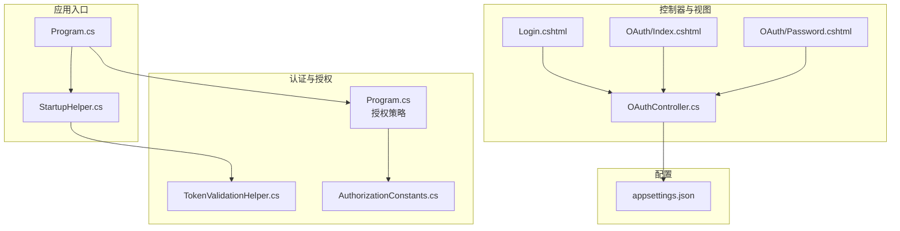
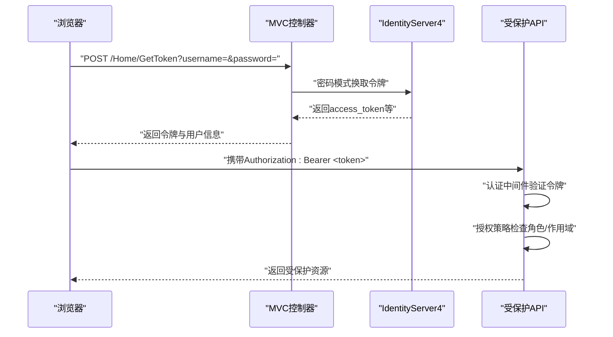
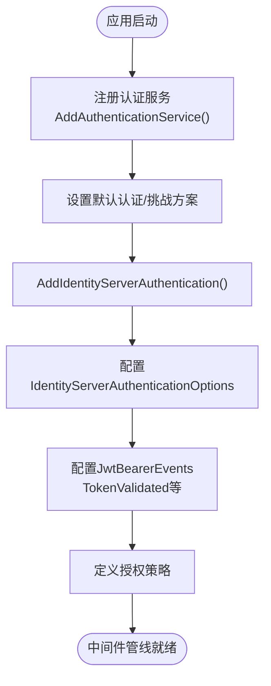
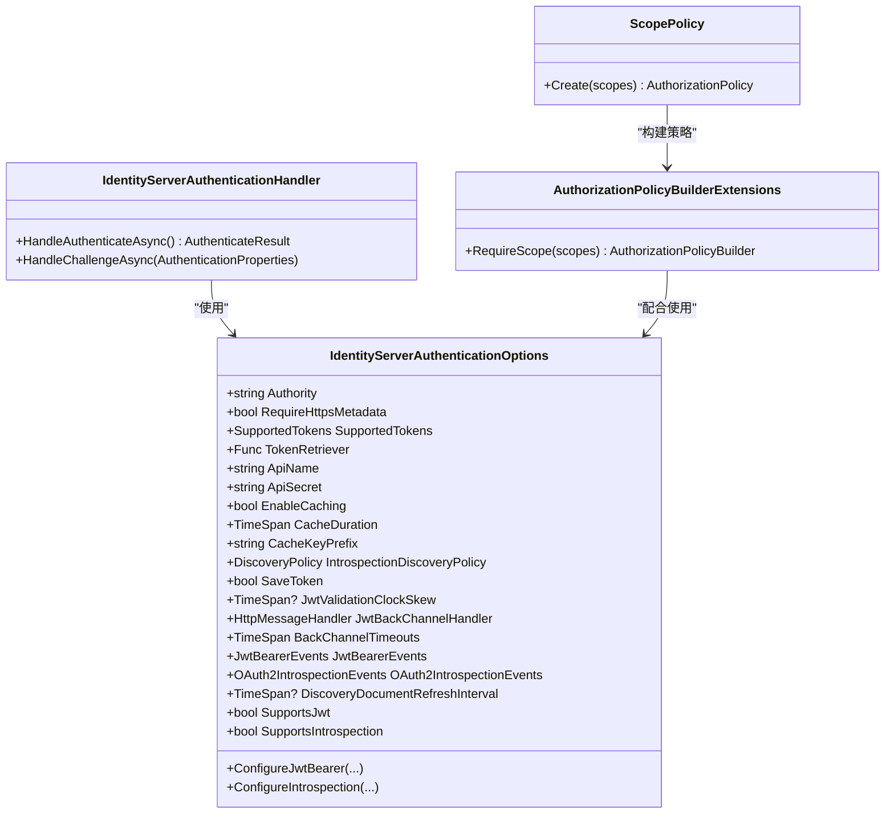
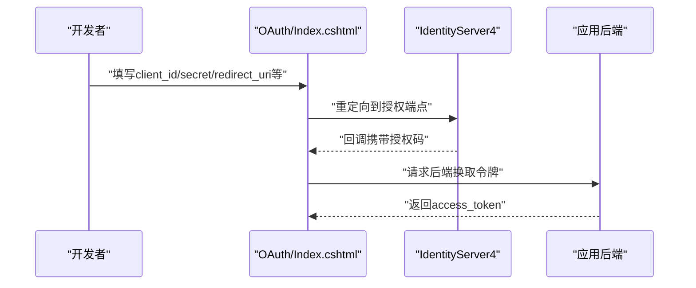
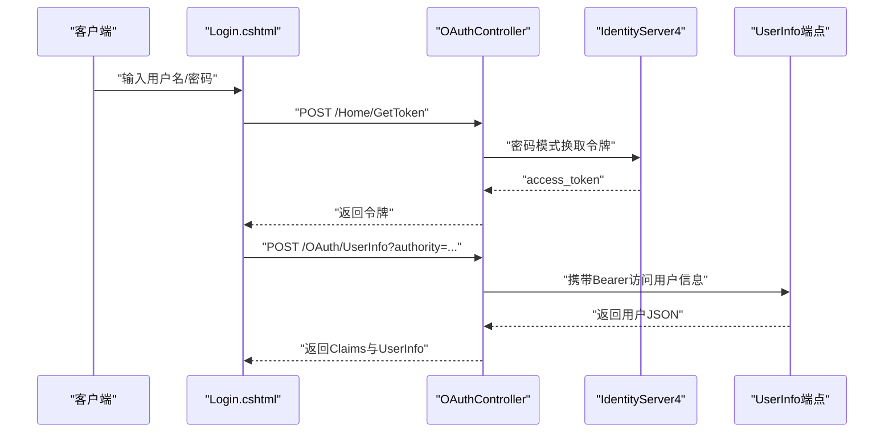
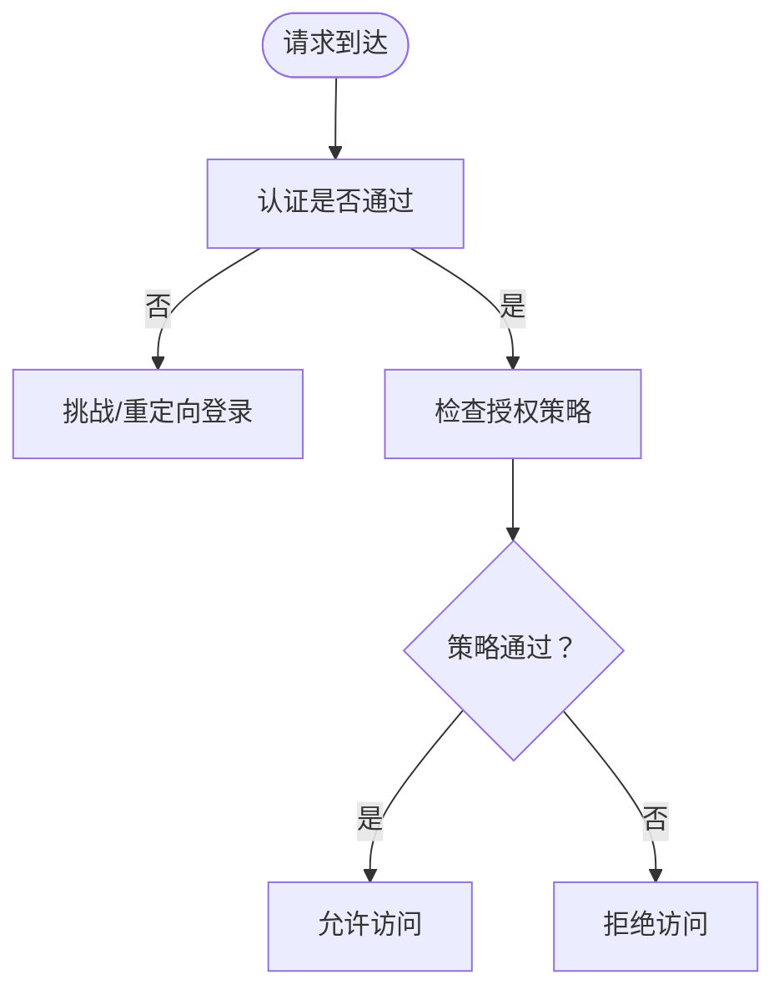
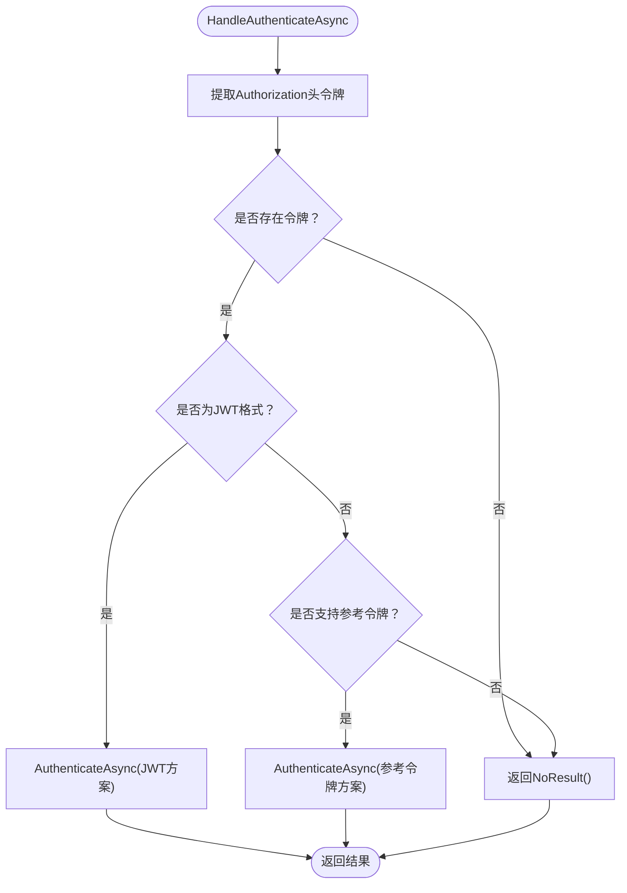
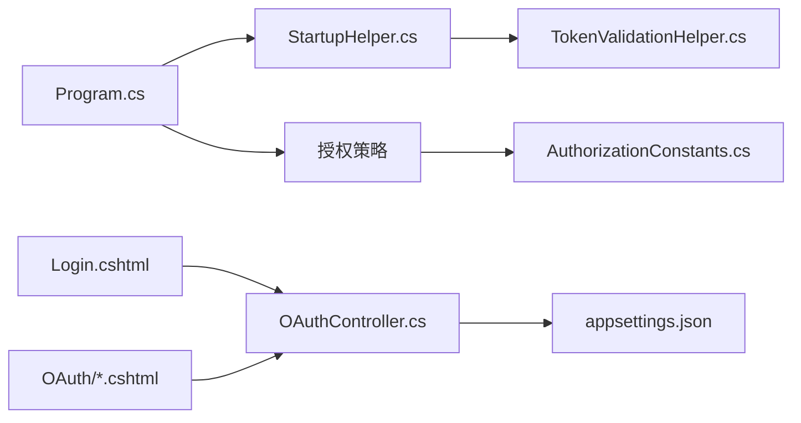

# 身份认证系统

<cite>
**本文引用的文件**
- [Program.cs](file://Sylas.RemoteTasks.App/Program.cs)
- [StartupHelper.cs](file://Sylas.RemoteTasks.App/Helpers/StartupHelper.cs)
- [TokenValidationHelper.cs](file://Sylas.RemoteTasks.App/Helpers/TokenValidationHelper.cs)
- [OAuthController.cs](file://Sylas.RemoteTasks.App/Controllers/OAuthController.cs)
- [appsettings.json](file://Sylas.RemoteTasks.App/appsettings.json)
- [AuthorizationConstants.cs](file://Sylas.RemoteTasks.Utils/Constants/AuthorizationConstants.cs)
- [CustomActionFilter.cs](file://Sylas.RemoteTasks.App/Infrastructure/CustomActionFilter.cs)
- [Login.cshtml](file://Sylas.RemoteTasks.App/Views/Home/Login.cshtml)
- [OAuth/Index.cshtml](file://Sylas.RemoteTasks.App/Views/OAuth/Index.cshtml)
- [OAuth/Password.cshtml](file://Sylas.RemoteTasks.App/Views/OAuth/Password.cshtml)
- [AuthorizeAttributeTest.cs](file://Sylas.RemoteTasks.Test/Auth/AuthorizeAttributeTest.cs)
</cite>

## 目录
1. [简介](#简介)
2. [项目结构](#项目结构)
3. [核心组件](#核心组件)
4. [架构总览](#架构总览)
5. [详细组件分析](#详细组件分析)
6. [依赖关系分析](#依赖关系分析)
7. [性能考量](#性能考量)
8. [故障排查指南](#故障排查指南)
9. [结论](#结论)
10. [附录](#附录)

## 简介
本文件面向“身份认证系统”的实现与使用，围绕 OIDC/OpenID Connect 集成、JWT 令牌处理、权限控制策略、Token 验证机制与安全最佳实践展开，结合代码库中的真实实现进行说明。内容既适合初学者快速上手，也为有经验的开发者提供深入的技术细节与扩展建议。

## 项目结构
该系统采用 ASP.NET Core MVC 架构，认证相关能力集中在应用启动阶段与辅助工具类中，控制器负责对外暴露认证调试接口，视图提供 OAuth 交互界面，配置文件集中管理 IdentityServer 相关参数。

图表来源
- [Program.cs](file://Sylas.RemoteTasks.App/Program.cs#L74-L87)
- [StartupHelper.cs](file://Sylas.RemoteTasks.App/Helpers/StartupHelper.cs#L124-L271)
- [TokenValidationHelper.cs](file://Sylas.RemoteTasks.App/Helpers/TokenValidationHelper.cs#L117-L200)
- [OAuthController.cs](file://Sylas.RemoteTasks.App/Controllers/OAuthController.cs#L1-L49)
- [appsettings.json](file://Sylas.RemoteTasks.App/appsettings.json#L109-L121)

章节来源
- [Program.cs](file://Sylas.RemoteTasks.App/Program.cs#L74-L87)
- [StartupHelper.cs](file://Sylas.RemoteTasks.App/Helpers/StartupHelper.cs#L124-L271)
- [TokenValidationHelper.cs](file://Sylas.RemoteTasks.App/Helpers/TokenValidationHelper.cs#L117-L200)
- [OAuthController.cs](file://Sylas.RemoteTasks.App/Controllers/OAuthController.cs#L1-L49)
- [appsettings.json](file://Sylas.RemoteTasks.App/appsettings.json#L109-L121)

## 核心组件
- 应用启动与认证注册：在应用启动时完成认证服务注册、授权策略定义与中间件管线配置。
- 认证处理器与选项：封装 JWT 与 OAuth2 参考令牌的验证逻辑与可配置项。
- 控制器与视图：提供 OAuth 调试页面与用户信息获取接口；前端登录页通过密码模式获取访问令牌。
- 配置文件：集中存放 IdentityServer 的 Authority、客户端凭据、作用域与缓存策略等。

章节来源
- [Program.cs](file://Sylas.RemoteTasks.App/Program.cs#L74-L87)
- [StartupHelper.cs](file://Sylas.RemoteTasks.App/Helpers/StartupHelper.cs#L124-L271)
- [TokenValidationHelper.cs](file://Sylas.RemoteTasks.App/Helpers/TokenValidationHelper.cs#L318-L557)
- [OAuthController.cs](file://Sylas.RemoteTasks.App/Controllers/OAuthController.cs#L1-L49)
- [Login.cshtml](file://Sylas.RemoteTasks.App/Views/Home/Login.cshtml#L182-L216)
- [OAuth/Index.cshtml](file://Sylas.RemoteTasks.App/Views/OAuth/Index.cshtml#L1-L128)
- [OAuth/Password.cshtml](file://Sylas.RemoteTasks.App/Views/OAuth/Password.cshtml#L1-L156)
- [appsettings.json](file://Sylas.RemoteTasks.App/appsettings.json#L109-L121)

## 架构总览
系统通过以下链路实现身份认证与授权：
- 客户端发起登录请求，前端从后端 API 获取访问令牌；
- 请求携带 Bearer 令牌访问受保护资源；
- 服务器端通过认证中间件解析令牌，验证签名与声明；
- 授权策略基于角色与作用域进行访问控制；
- 可选：通过用户信息端点获取更完整的用户资料。

图表来源
- [Login.cshtml](file://Sylas.RemoteTasks.App/Views/Home/Login.cshtml#L182-L216)
- [OAuthController.cs](file://Sylas.RemoteTasks.App/Controllers/OAuthController.cs#L30-L46)
- [Program.cs](file://Sylas.RemoteTasks.App/Program.cs#L114-L115)

## 详细组件分析

### 认证与授权注册流程
- 默认认证方案设为 Bearer，挑战响应也指向 Bearer；
- 注册 IdentityServer 认证处理器，配置 Authority、ApiName、ApiSecret、RequireHttpsMetadata、缓存与刷新间隔等；
- 在 JWT 令牌验证事件中，统一映射声明类型并补充角色声明；
- 定义授权策略 RequireAdministratorRole，要求用户具备特定角色与作用域。

图表来源
- [StartupHelper.cs](file://Sylas.RemoteTasks.App/Helpers/StartupHelper.cs#L163-L184)
- [StartupHelper.cs](file://Sylas.RemoteTasks.App/Helpers/StartupHelper.cs#L234-L270)
- [Program.cs](file://Sylas.RemoteTasks.App/Program.cs#L77-L87)

章节来源
- [StartupHelper.cs](file://Sylas.RemoteTasks.App/Helpers/StartupHelper.cs#L124-L271)
- [Program.cs](file://Sylas.RemoteTasks.App/Program.cs#L74-L87)

### Token 验证与处理机制
- 支持两种令牌类型：JWT 与 OAuth2 参考令牌（Introspection）；
- 自动识别令牌类型并选择对应验证路径；
- 提供 Scope 相关授权策略扩展与策略构建器；
- 可配置发现文档缓存、时钟偏移、声明类型映射、回源超时等。

图表来源
- [TokenValidationHelper.cs](file://Sylas.RemoteTasks.App/Helpers/TokenValidationHelper.cs#L318-L557)
- [TokenValidationHelper.cs](file://Sylas.RemoteTasks.App/Helpers/TokenValidationHelper.cs#L207-L316)
- [TokenValidationHelper.cs](file://Sylas.RemoteTasks.App/Helpers/TokenValidationHelper.cs#L18-L53)

章节来源
- [TokenValidationHelper.cs](file://Sylas.RemoteTasks.App/Helpers/TokenValidationHelper.cs#L117-L200)
- [TokenValidationHelper.cs](file://Sylas.RemoteTasks.App/Helpers/TokenValidationHelper.cs#L207-L316)
- [TokenValidationHelper.cs](file://Sylas.RemoteTasks.App/Helpers/TokenValidationHelper.cs#L318-L557)

### OIDC/OpenID Connect 集成
- 配置 IdentityServer 基础地址、客户端凭据、响应类型、作用域与 HTTPS 强制要求；
- 通过视图提供 OIDC 授权端点调试页面，便于联调第三方登录（如钉钉、微信）；
- 视图中可设置授权码、PKCE、state、acr_values 等参数，模拟真实 OIDC 场景。

图表来源
- [OAuth/Index.cshtml](file://Sylas.RemoteTasks.App/Views/OAuth/Index.cshtml#L1-L128)
- [appsettings.json](file://Sylas.RemoteTasks.App/appsettings.json#L109-L121)

章节来源
- [StartupHelper.cs](file://Sylas.RemoteTasks.App/Helpers/StartupHelper.cs#L194-L233)
- [OAuth/Index.cshtml](file://Sylas.RemoteTasks.App/Views/OAuth/Index.cshtml#L1-L128)
- [appsettings.json](file://Sylas.RemoteTasks.App/appsettings.json#L109-L121)

### JWT 令牌处理与用户信息获取
- 控制器提供受保护的用户信息接口，从 Authorization 头提取 Bearer 令牌；
- 通过 HTTP 客户端向 IdentityServer 的用户信息端点发起请求，返回用户声明与 JSON；
- 前端登录页通过密码模式获取令牌并持久化到本地存储。

图表来源
- [Login.cshtml](file://Sylas.RemoteTasks.App/Views/Home/Login.cshtml#L182-L216)
- [OAuthController.cs](file://Sylas.RemoteTasks.App/Controllers/OAuthController.cs#L30-L46)

章节来源
- [OAuthController.cs](file://Sylas.RemoteTasks.App/Controllers/OAuthController.cs#L30-L46)
- [Login.cshtml](file://Sylas.RemoteTasks.App/Views/Home/Login.cshtml#L182-L216)

### 权限控制策略与角色/作用域
- 授权策略 RequireAdministratorRole 要求用户具备管理员角色声明或客户端角色声明，并满足指定作用域；
- 策略常量集中管理策略名称，便于跨模块引用；
- 控制器可通过 Authorize 特性与策略名称组合使用。

图表来源
- [Program.cs](file://Sylas.RemoteTasks.App/Program.cs#L77-L87)
- [AuthorizationConstants.cs](file://Sylas.RemoteTasks.Utils/Constants/AuthorizationConstants.cs#L1-L14)

章节来源
- [Program.cs](file://Sylas.RemoteTasks.App/Program.cs#L77-L87)
- [AuthorizationConstants.cs](file://Sylas.RemoteTasks.Utils/Constants/AuthorizationConstants.cs#L1-L14)

### Token 验证流程（算法与决策）
- 从请求中提取令牌，区分 JWT 与参考令牌；
- 若为 JWT 且支持，则委托 JwtBearer 验证；
- 若为参考令牌且支持，则调用 OAuth2 Introspection；
- 未匹配时返回无结果，交由默认挑战处理。

图表来源
- [TokenValidationHelper.cs](file://Sylas.RemoteTasks.App/Helpers/TokenValidationHelper.cs#L225-L289)

章节来源
- [TokenValidationHelper.cs](file://Sylas.RemoteTasks.App/Helpers/TokenValidationHelper.cs#L207-L316)

## 依赖关系分析
- 认证注册依赖配置文件中的 IdentityServerConfiguration；
- 授权策略依赖 JwtClaimTypes 与自定义策略常量；
- 控制器依赖 IHttpClientFactory 与请求头解析；
- 视图依赖前端脚本与本地存储，用于调试与演示。

图表来源
- [Program.cs](file://Sylas.RemoteTasks.App/Program.cs#L74-L87)
- [StartupHelper.cs](file://Sylas.RemoteTasks.App/Helpers/StartupHelper.cs#L124-L271)
- [TokenValidationHelper.cs](file://Sylas.RemoteTasks.App/Helpers/TokenValidationHelper.cs#L117-L200)
- [AuthorizationConstants.cs](file://Sylas.RemoteTasks.Utils/Constants/AuthorizationConstants.cs#L1-L14)
- [OAuthController.cs](file://Sylas.RemoteTasks.App/Controllers/OAuthController.cs#L1-L49)
- [appsettings.json](file://Sylas.RemoteTasks.App/appsettings.json#L109-L121)

章节来源
- [Program.cs](file://Sylas.RemoteTasks.App/Program.cs#L74-L87)
- [StartupHelper.cs](file://Sylas.RemoteTasks.App/Helpers/StartupHelper.cs#L124-L271)
- [TokenValidationHelper.cs](file://Sylas.RemoteTasks.App/Helpers/TokenValidationHelper.cs#L117-L200)
- [AuthorizationConstants.cs](file://Sylas.RemoteTasks.Utils/Constants/AuthorizationConstants.cs#L1-L14)
- [OAuthController.cs](file://Sylas.RemoteTasks.App/Controllers/OAuthController.cs#L1-L49)
- [appsettings.json](file://Sylas.RemoteTasks.App/appsettings.json#L109-L121)

## 性能考量
- 发现文档缓存：通过配置缓存时长与键前缀，减少频繁拉取元数据带来的开销；
- 令牌类型支持：按需启用 JWT 或参考令牌，避免不必要的验证路径；
- 回源超时与通道处理器：合理设置回源超时与 HTTP 处理器，提升稳定性；
- 声明映射：关闭入站声明映射可减少转换成本；
- 作用域与受众校验：仅在必要时开启严格受众校验，降低验证复杂度。

章节来源
- [TokenValidationHelper.cs](file://Sylas.RemoteTasks.App/Helpers/TokenValidationHelper.cs#L466-L521)
- [TokenValidationHelper.cs](file://Sylas.RemoteTasks.App/Helpers/TokenValidationHelper.cs#L524-L556)
- [appsettings.json](file://Sylas.RemoteTasks.App/appsettings.json#L111-L121)

## 故障排查指南
- 令牌为空：控制器在提取 Bearer 令牌时若为空会抛出异常，需确保前端正确传递；
- HTTPS 元数据：RequireHttpsMetadata 与 Authority 配置需匹配，否则发现文档加载失败；
- 作用域与受众：若启用严格受众校验但未配置 ApiName，可能导致验证失败；
- 声明类型：默认入站声明映射已清空，需在事件中手动映射角色与名称声明；
- 授权策略：策略名称与常量需一致，且用户需具备所需角色与作用域；
- 前端登录：登录页通过密码模式获取令牌，若返回错误码需检查用户名/密码与后端实现。

章节来源
- [OAuthController.cs](file://Sylas.RemoteTasks.App/Controllers/OAuthController.cs#L36-L40)
- [StartupHelper.cs](file://Sylas.RemoteTasks.App/Helpers/StartupHelper.cs#L242-L265)
- [Program.cs](file://Sylas.RemoteTasks.App/Program.cs#L77-L87)
- [Login.cshtml](file://Sylas.RemoteTasks.App/Views/Home/Login.cshtml#L196-L211)

## 结论
该身份认证系统通过集中配置与可插拔的认证处理器，实现了对 OIDC/OpenID Connect 与 JWT 的完整支持，并结合授权策略与作用域控制，提供了清晰的安全边界。配合调试视图与控制器接口，便于开发与运维人员快速定位问题并进行优化。

## 附录

### 关键配置项与含义
- IdentityServerConfiguration
  - Authority：认证服务器基础地址
  - RequireHttpsMetadata：是否要求 HTTPS
  - EnableCaching：是否启用发现文档缓存
  - AdministrationRole：管理员角色名称
  - ApiName：API 资源名称（用于受众校验）
  - ApiSecret：API 资源密钥（用于参考令牌验证）
  - ClientId/ClientSecret：客户端凭据
  - OidcResponseType：OIDC 响应类型
  - Scopes：作用域列表
  - CacheDuration：缓存时长

章节来源
- [appsettings.json](file://Sylas.RemoteTasks.App/appsettings.json#L109-L121)

### 授权策略与常量
- 策略名称：RequireAdministratorRole
- 策略条件：用户必须具有管理员角色声明（含用户角色或客户端角色），并满足指定作用域

章节来源
- [Program.cs](file://Sylas.RemoteTasks.App/Program.cs#L77-L87)
- [AuthorizationConstants.cs](file://Sylas.RemoteTasks.Utils/Constants/AuthorizationConstants.cs#L1-L14)

### 安全最佳实践
- 始终启用 HTTPS（RequireHttpsMetadata）；
- 严格管理 ApiSecret 与客户端密钥；
- 合理设置缓存时长与刷新间隔；
- 在生产环境启用受众校验与作用域约束；
- 对前端令牌存储采取最小化原则，避免长期持久化高风险凭据。

章节来源
- [TokenValidationHelper.cs](file://Sylas.RemoteTasks.App/Helpers/TokenValidationHelper.cs#L492-L501)
- [appsettings.json](file://Sylas.RemoteTasks.App/appsettings.json#L111-L121)