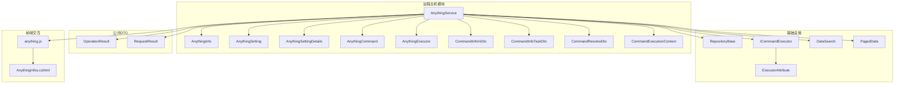
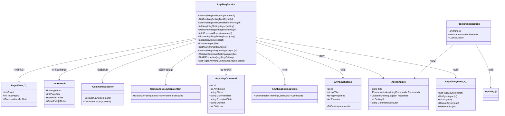
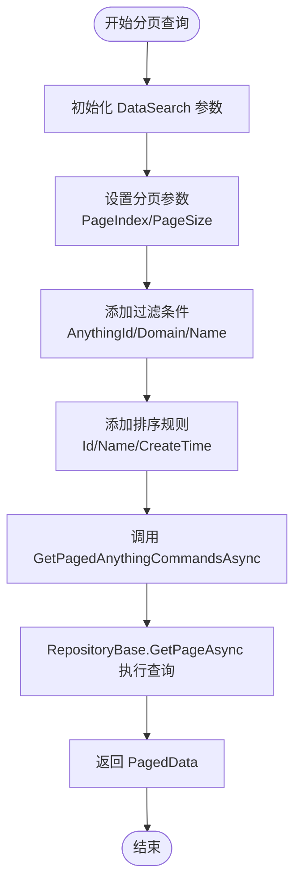
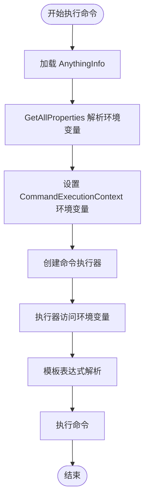
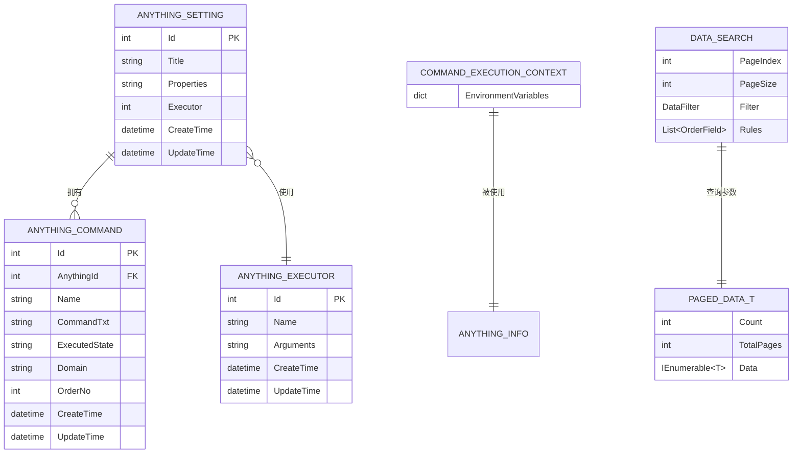
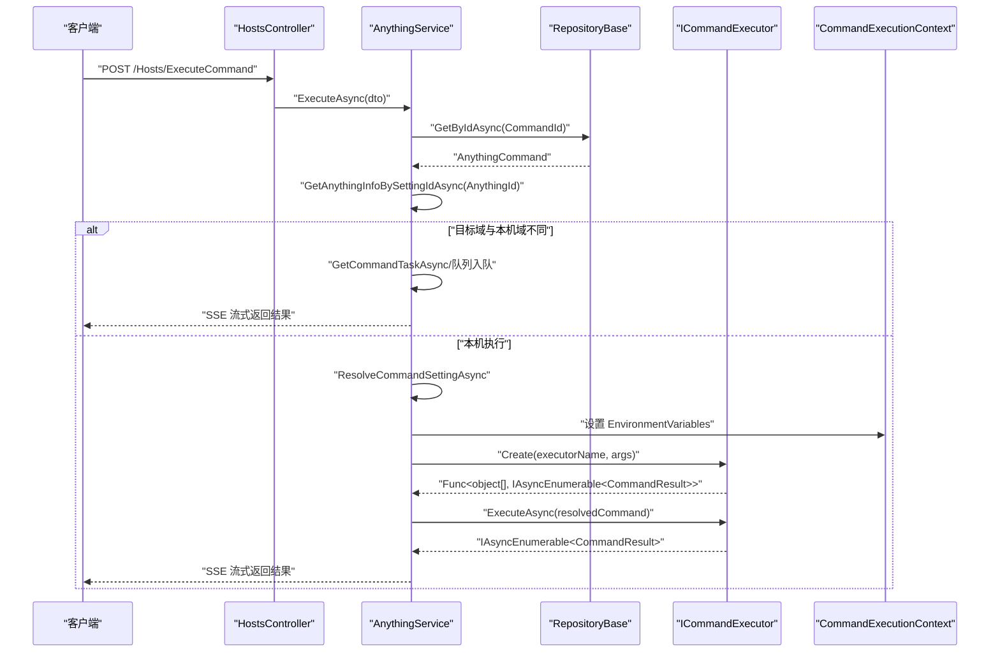
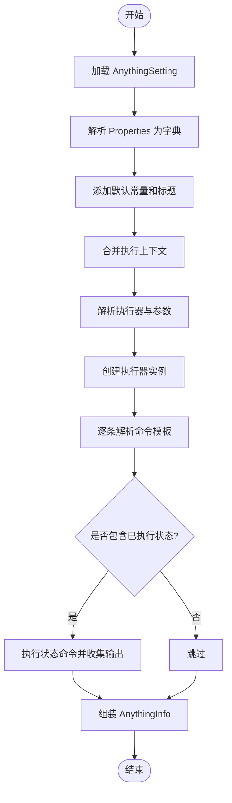
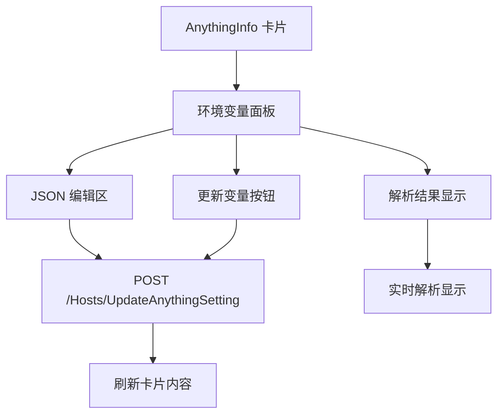
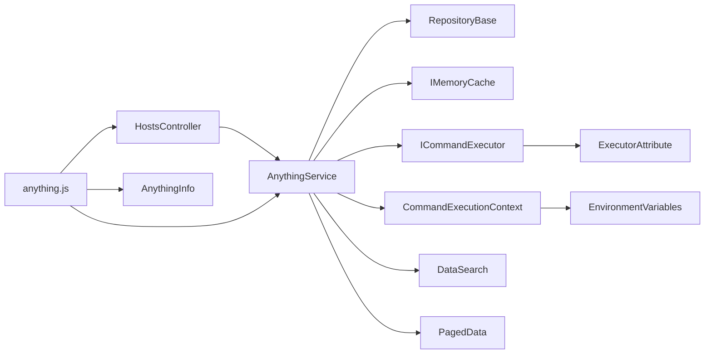

# AnythingService 核心功能

<cite>
**本文引用的文件**
- [AnythingService.cs](file://Sylas.RemoteTasks.App/RemoteHostModule/Anything/AnythingService.cs)
- [AnythingInfo.cs](file://Sylas.RemoteTasks.App/RemoteHostModule/Anything/AnythingInfo.cs)
- [AnythingSetting.cs](file://Sylas.RemoteTasks.App/RemoteHostModule/Anything/AnythingSetting.cs)
- [AnythingSettingDetails.cs](file://Sylas.RemoteTasks.App/RemoteHostModule/Anything/AnythingSettingDetails.cs)
- [AnythingCommand.cs](file://Sylas.RemoteTasks.App/RemoteHostModule/Anything/AnythingCommand.cs)
- [AnythingSettingDetailsInDto.cs](file://Sylas.RemoteTasks.App/RemoteHostModule/Anything/AnythingSettingDetailsInDto.cs)
- [RepositoryBase.cs](file://Sylas.RemoteTasks.App/Infrastructure/RepositoryBase.cs)
- [OperationResult.cs](file://Sylas.RemoteTasks.Common/Dtos/OperationResult.cs)
- [RequestResult.cs](file://Sylas.RemoteTasks.Common/Dtos/RequestResult.cs)
- [HostsController.cs](file://Sylas.RemoteTasks.App/Controllers/HostsController.cs)
- [CommandInfoInDto.cs](file://Sylas.RemoteTasks.App/RemoteHostModule/Anything/CommandInfoInDto.cs)
- [CommandInfoTaskDto.cs](file://Sylas.RemoteTasks.App/RemoteHostModule/Anything/CommandInfoTaskDto.cs)
- [CommandResolveDto.cs](file://Sylas.RemoteTasks.App/RemoteHostModule/Anything/CommandResolveDto.cs)
- [EntityBase.cs](file://Sylas.RemoteTasks.Database/EntityBase.cs)
- [ICommandExecutor.cs](file://Sylas.RemoteTasks.Utils/CommandExecutor/ICommandExecutor.cs)
- [ExecutorAttribute.cs](file://Sylas.RemoteTasks.Utils/CommandExecutor/ExecutorAttribute.cs)
- [CommandExecutionContext.cs](file://Sylas.RemoteTasks.Utils/CommandExecutor/CommandExecutionContext.cs)
- [FileHelper.cs](file://Sylas.RemoteTasks.Utils/CommandExecutor/FileHelper.cs)
- [TmplHelper2.cs](file://Sylas.RemoteTasks.Utils/Template/TmplHelper2.cs)
- [anything.js](file://Sylas.RemoteTasks.App/wwwroot/js/anything.js)
- [DataSearch.cs](file://Sylas.RemoteTasks.Database/SyncBase/DataSearch.cs)
- [PagedData.cs](file://Sylas.RemoteTasks.Database/SyncBase/PagedData.cs)
</cite>

## 更新摘要
**所做更改**
- 新增了分页查询功能：AnythingService 现在提供 GetPagedAnythingCommandsAsync 方法，支持通过 DataSearch 参数进行分页的数据检索
- 增强了大数据集处理能力，提升了命令查询的性能和可扩展性
- 更新了控制器集成，新增了 GetPagedAnythingCommandsAsync API 端点
- 完善了分页查询的参数配置和返回值结构

## 目录
1. [简介](#简介)
2. [项目结构](#项目结构)
3. [核心组件](#核心组件)
4. [架构总览](#架构总览)
5. [详细组件分析](#详细组件分析)
6. [依赖关系分析](#依赖关系分析)
7. [性能考量](#性能考量)
8. [故障排查指南](#故障排查指南)
9. [结论](#结论)
10. [附录](#附录)

## 简介
本文围绕 AnythingService 的核心功能进行系统化说明，涵盖其职责边界、关键方法、数据模型、调用流程与错误处理策略，并结合实际代码路径给出使用范式与最佳实践。读者可据此快速上手配置与扩展 Anything 相关能力，同时获得面向资深开发者的实现细节与优化建议。

**更新** 本文档已更新以反映应用的最新变更：AnythingService 现已新增分页查询功能，通过 GetPagedAnythingCommandsAsync 方法支持大数据集的高效检索，显著提升了系统的可扩展性和性能表现。

## 项目结构
AnythingService 所属模块位于远程主机模块下，围绕"配置-命令-执行器"三元组组织业务逻辑；其依赖仓储层完成持久化，使用内存缓存提升读取性能，并通过命令执行器接口解耦具体执行实现。新版本增强了环境变量管理，通过 CommandExecutionContext 为执行器提供统一的环境变量访问接口，并新增了分页查询功能以支持大规模数据集的高效处理。

**图表来源**
- [AnythingService.cs:30-694](file://Sylas.RemoteTasks.App/RemoteHostModule/Anything/AnythingService.cs#L30-L694)
- [CommandExecutionContext.cs:9-15](file://Sylas.RemoteTasks.Utils/CommandExecutor/CommandExecutionContext.cs#L9-L15)
- [RepositoryBase.cs:10-233](file://Sylas.RemoteTasks.App/Infrastructure/RepositoryBase.cs#L10-L233)
- [ICommandExecutor.cs:14-73](file://Sylas.RemoteTasks.Utils/CommandExecutor/ICommandExecutor.cs#L14-L73)
- [ExecutorAttribute.cs:9-25](file://Sylas.RemoteTasks.Utils/CommandExecutor/ExecutorAttribute.cs#L9-L25)
- [OperationResult.cs:8-52](file://Sylas.RemoteTasks.Common/Dtos/OperationResult.cs#L8-L52)
- [RequestResult.cs:6-65](file://Sylas.RemoteTasks.Common/Dtos/RequestResult.cs#L6-L65)
- [anything.js:1-742](file://Sylas.RemoteTasks.App/wwwroot/js/anything.js#L1-L742)
- [AnythingInfos.cshtml:1-10](file://Sylas.RemoteTasks.App/Views/Hosts/AnythingInfos.cshtml#L1-L10)
- [DataSearch.cs:8-49](file://Sylas.RemoteTasks.Database/SyncBase/DataSearch.cs#L8-L49)
- [PagedData.cs:30-45](file://Sylas.RemoteTasks.Database/SyncBase/PagedData.cs#L30-L45)

**章节来源**
- [AnythingService.cs:17-694](file://Sylas.RemoteTasks.App/RemoteHostModule/Anything/AnythingService.cs#L17-L694)
- [CommandExecutionContext.cs:9-15](file://Sylas.RemoteTasks.Utils/CommandExecutor/CommandExecutionContext.cs#L9-L15)
- [RepositoryBase.cs:10-233](file://Sylas.RemoteTasks.App/Infrastructure/RepositoryBase.cs#L10-L233)

## 核心组件
- AnythingService：Anything 配置与命令的统一管理入口，负责查询、增删改、命令解析、执行调度与缓存维护。现已增强环境变量管理，通过 CommandExecutionContext 为执行器提供统一的环境变量访问，并新增分页查询功能以支持大数据集处理。
- AnythingSetting/AnythingSettingDetails：配置实体及带命令明细的视图模型。
- AnythingInfo：运行时对象，承载标题、属性、命令集合与命令执行器名称，现包含直接嵌入的环境变量管理功能。
- AnythingCommand：命令实体，包含命令内容、执行状态、域名等属性，现支持分页查询。
- CommandExecutionContext：新的环境变量管理组件，提供统一的环境变量访问接口，供所有命令执行器使用。
- RepositoryBase<T>：通用仓储，封装分页查询、新增、更新、删除等基础操作。
- ICommandExecutor/ExecutorAttribute：命令执行器抽象与依赖注入装配标记。
- DTOs：OperationResult、RequestResult<T> 作为统一的返回体。
- Frontend Integration：anything.js 提供完整的前端交互界面，包括环境变量面板、命令执行、模板解析等功能。
- DataSearch/PagedData：分页查询参数和响应数据结构，支持复杂查询条件和排序规则。

**更新** 新增分页查询功能，通过 DataSearch 参数支持复杂的过滤、排序和分页操作，显著提升了大数据集的处理能力。

**章节来源**
- [AnythingService.cs:30-694](file://Sylas.RemoteTasks.App/RemoteHostModule/Anything/AnythingService.cs#L30-L694)
- [CommandExecutionContext.cs:9-15](file://Sylas.RemoteTasks.Utils/CommandExecutor/CommandExecutionContext.cs#L9-L15)
- [AnythingSetting.cs:8-34](file://Sylas.RemoteTasks.App/RemoteHostModule/Anything/AnythingSetting.cs#L8-L34)
- [AnythingSettingDetails.cs:3-11](file://Sylas.RemoteTasks.App/RemoteHostModule/Anything/AnythingSettingDetails.cs#L3-L11)
- [AnythingInfo.cs:9-38](file://Sylas.RemoteTasks.App/RemoteHostModule/Anything/AnythingInfo.cs#L9-L38)
- [AnythingCommand.cs:7-35](file://Sylas.RemoteTasks.App/RemoteHostModule/Anything/AnythingCommand.cs#L7-L35)
- [RepositoryBase.cs:10-233](file://Sylas.RemoteTasks.App/Infrastructure/RepositoryBase.cs#L10-L233)
- [ICommandExecutor.cs:14-73](file://Sylas.RemoteTasks.Utils/CommandExecutor/ICommandExecutor.cs#L14-L73)
- [ExecutorAttribute.cs:9-25](file://Sylas.RemoteTasks.Utils/CommandExecutor/ExecutorAttribute.cs#L9-L25)
- [OperationResult.cs:8-52](file://Sylas.RemoteTasks.Common/Dtos/OperationResult.cs#L8-L52)
- [RequestResult.cs:6-65](file://Sylas.RemoteTasks.Common/Dtos/RequestResult.cs#L6-L65)
- [anything.js:1-742](file://Sylas.RemoteTasks.App/wwwroot/js/anything.js#L1-L742)
- [DataSearch.cs:8-49](file://Sylas.RemoteTasks.Database/SyncBase/DataSearch.cs#L8-L49)
- [PagedData.cs:30-45](file://Sylas.RemoteTasks.Database/SyncBase/PagedData.cs#L30-L45)

## 架构总览
AnythingService 采用"配置-命令-执行器"的三层结构，现已增强环境变量管理与分页查询功能：
- 配置层：AnythingSetting/Details 描述操作对象与执行器选择。
- 命令层：AnythingCommand 定义可执行命令与模板化内容，支持分页查询。
- 执行层：ICommandExecutor 抽象具体执行器，通过反射或 DI 创建实例，现在可通过 CommandExecutionContext 访问环境变量。
- 环境管理层：CommandExecutionContext 提供统一的环境变量访问接口。
- 分页查询层：DataSearch/PagedData 支持复杂的过滤、排序和分页操作。
- 前端层：anything.js 提供卡片式界面，直接嵌入环境变量管理面板。

**图表来源**
- [AnythingService.cs:30-694](file://Sylas.RemoteTasks.App/RemoteHostModule/Anything/AnythingService.cs#L30-L694)
- [CommandExecutionContext.cs:9-15](file://Sylas.RemoteTasks.Utils/CommandExecutor/CommandExecutionContext.cs#L9-L15)
- [AnythingSetting.cs:8-34](file://Sylas.RemoteTasks.App/RemoteHostModule/Anything/AnythingSetting.cs#L8-L34)
- [AnythingSettingDetails.cs:3-11](file://Sylas.RemoteTasks.App/RemoteHostModule/Anything/AnythingSettingDetails.cs#L3-L11)
- [AnythingInfo.cs:9-38](file://Sylas.RemoteTasks.App/RemoteHostModule/Anything/AnythingInfo.cs#L9-L38)
- [AnythingCommand.cs:7-35](file://Sylas.RemoteTasks.App/RemoteHostModule/Anything/AnythingCommand.cs#L7-L35)
- [DataSearch.cs:8-49](file://Sylas.RemoteTasks.Database/SyncBase/DataSearch.cs#L8-L49)
- [PagedData.cs:30-45](file://Sylas.RemoteTasks.Database/SyncBase/PagedData.cs#L30-L45)
- [RepositoryBase.cs:10-233](file://Sylas.RemoteTasks.App/Infrastructure/RepositoryBase.cs#L10-L233)
- [ICommandExecutor.cs:14-73](file://Sylas.RemoteTasks.Utils/CommandExecutor/ICommandExecutor.cs#L14-L73)
- [anything.js:1-742](file://Sylas.RemoteTasks.App/wwwroot/js/anything.js#L1-L742)

## 详细组件分析

### AnythingService 关键方法与使用模式
- 查询与详情
  - GetAnythingSettingsAsync：分页查询配置集合，返回分页结果。
  - GetAnythingSettingByIdAsync：按主键获取配置。
  - GetAnythingSettingDetailsByIdAsync：获取配置及命令明细（含分页查询命令）。
  - **新增** GetPagedAnythingCommandsAsync：分页查询命令集合，支持复杂过滤和排序条件。
- 新增与删除
  - AddAnythingSettingAsync：新增配置并返回操作结果。
  - DeleteAnythingSettingByIdAsync：删除配置并级联删除其命令。
  - DeleteAnythingCommandByIdAsync：删除单条命令并同步更新缓存中的 AnythingInfo。
- 命令管理
  - GetAnythingCommandsAsync：按 AnythingId 获取命令列表（固定大小查询）。
  - AddCommandAsync：新增命令并更新缓存中的 AnythingInfo。
  - UpdateAnythingSettingAsync：基于字典的局部更新配置。
  - UpdateCommandAsync：基于字典的局部更新命令，必要时刷新缓存。
- 运行时信息与执行
  - GetAllAnythingInfosAsync：构建并缓存所有 AnythingInfo，供前端展示。
  - GetAnythingInfoBySettingIdAsync：按设置ID获取运行时信息，优先命中缓存。
  - ResolveCommandSettingAsync：解析命令模板，返回解析后的命令文本。
  - ExecuteAsync：执行命令，支持本地与跨节点转发，返回流式结果。**新增**：现在通过 CommandExecutionContext 传递环境变量。
  - ExecutorsAsync：查询可用的命令执行器列表。
  - GetAllProperties：获取并解析所有环境变量，包括默认常量和标题信息。
- 缓存与队列
  - 内存缓存：AllAnythingInfos、单个 AnythingInfo、Executor 查询结果。
  - 任务队列：按域名维护命令任务队列，用于跨节点命令调度。

**更新** ExecuteAsync 方法现在通过 CommandExecutionContext.EnvironmentVariables 属性传递环境变量给命令执行器。

**章节来源**
- [AnythingService.cs:45-694](file://Sylas.RemoteTasks.App/RemoteHostModule/Anything/AnythingService.cs#L45-L694)

### 分页查询功能详解
**新增** AnythingService 现已提供完整的分页查询功能，通过 GetPagedAnythingCommandsAsync 方法支持大数据集的高效处理：

- **DataSearch 参数支持**
  - PageIndex：当前页码，默认为1
  - PageSize：每页记录数，默认为20，最大支持10000
  - Filter：过滤条件，支持多字段组合查询
  - Rules：排序规则，支持多字段排序
  
- **PagedData 返回结构**
  - Count：当前页记录数
  - TotalPages：总页数
  - Data：当前页的命令数据集合

- **使用场景**
  - 大规模命令管理：支持数千条命令的分页浏览
  - 条件筛选：按 AnythingId、域名、命令名称等条件过滤
  - 性能优化：避免一次性加载大量数据到内存

**图表来源**
- [AnythingService.cs:175-180](file://Sylas.RemoteTasks.App/RemoteHostModule/Anything/AnythingService.cs#L175-L180)
- [DataSearch.cs:24-30](file://Sylas.RemoteTasks.Database/SyncBase/DataSearch.cs#L24-L30)
- [PagedData.cs:30-45](file://Sylas.RemoteTasks.Database/SyncBase/PagedData.cs#L30-L45)

**章节来源**
- [AnythingService.cs:175-180](file://Sylas.RemoteTasks.App/RemoteHostModule/Anything/AnythingService.cs#L175-L180)
- [DataSearch.cs:8-49](file://Sylas.RemoteTasks.Database/SyncBase/DataSearch.cs#L8-L49)
- [PagedData.cs:30-45](file://Sylas.RemoteTasks.Database/SyncBase/PagedData.cs#L30-L45)

### 环境变量管理流程
**新增** 环境变量管理是 AnythingService 的重要增强功能，通过以下流程实现：

- 环境变量收集：GetAllProperties 方法从 AnythingSetting.Properties 解析并合并默认常量
- 环境变量传递：ExecuteAsync 中将 anythingInfo.Properties 赋值给 commandExecutionContext.EnvironmentVariables
- 执行器访问：所有命令执行器通过 CommandExecutionContext 访问环境变量
- 模板解析：TmplHelper2 使用环境变量进行模板表达式解析

**图表来源**
- [AnythingService.cs:396-396](file://Sylas.RemoteTasks.App/RemoteHostModule/Anything/AnythingService.cs#L396-L396)
- [CommandExecutionContext.cs:14-14](file://Sylas.RemoteTasks.Utils/CommandExecutor/CommandExecutionContext.cs#L14-L14)
- [TmplHelper2.cs:43-66](file://Sylas.RemoteTasks.Utils/Template/TmplHelper2.cs#L43-L66)

**章节来源**
- [AnythingService.cs:651-669](file://Sylas.RemoteTasks.App/RemoteHostModule/Anything/AnythingService.cs#L651-L669)
- [CommandExecutionContext.cs:9-15](file://Sylas.RemoteTasks.Utils/CommandExecutor/CommandExecutionContext.cs#L9-L15)
- [TmplHelper2.cs:43-66](file://Sylas.RemoteTasks.Utils/Template/TmplHelper2.cs#L43-L66)

### 数据模型与关系
- AnythingSetting/AnythingSettingDetails：配置实体与带命令明细的视图模型，支持从配置生成详情。
- AnythingInfo：运行时对象，包含标题、属性字典、命令集合与命令执行器名称。现包含直接嵌入的环境变量管理功能。
- AnythingCommand：命令实体，包含命令内容、执行状态、域名等属性，现支持分页查询。
- CommandExecutionContext：新的环境变量管理组件，提供统一的环境变量访问接口。
- DataSearch/PagedData：分页查询参数和响应数据结构，支持复杂查询条件和排序规则。
- 实体基类：EntityBase<int> 提供 Id、CreateTime、UpdateTime 等通用字段。

**图表来源**
- [AnythingSetting.cs:8-34](file://Sylas.RemoteTasks.App/RemoteHostModule/Anything/AnythingSetting.cs#L8-L34)
- [AnythingSettingDetails.cs:3-11](file://Sylas.RemoteTasks.App/RemoteHostModule/Anything/AnythingSettingDetails.cs#L3-L11)
- [AnythingInfo.cs:9-38](file://Sylas.RemoteTasks.App/RemoteHostModule/Anything/AnythingInfo.cs#L9-L38)
- [AnythingCommand.cs:7-35](file://Sylas.RemoteTasks.App/RemoteHostModule/Anything/AnythingCommand.cs#L7-L35)
- [CommandExecutionContext.cs:9-15](file://Sylas.RemoteTasks.Utils/CommandExecutor/CommandExecutionContext.cs#L9-L15)
- [DataSearch.cs:8-49](file://Sylas.RemoteTasks.Database/SyncBase/DataSearch.cs#L8-L49)
- [PagedData.cs:30-45](file://Sylas.RemoteTasks.Database/SyncBase/PagedData.cs#L30-L45)
- [EntityBase.cs:9-32](file://Sylas.RemoteTasks.Database/EntityBase.cs#L9-L32)

**章节来源**
- [AnythingSetting.cs:8-34](file://Sylas.RemoteTasks.App/RemoteHostModule/Anything/AnythingSetting.cs#L8-L34)
- [AnythingSettingDetails.cs:3-11](file://Sylas.RemoteTasks.App/RemoteHostModule/Anything/AnythingSettingDetails.cs#L3-L11)
- [AnythingInfo.cs:9-38](file://Sylas.RemoteTasks.App/RemoteHostModule/Anything/AnythingInfo.cs#L9-L38)
- [AnythingCommand.cs:7-35](file://Sylas.RemoteTasks.App/RemoteHostModule/Anything/AnythingCommand.cs#L7-L35)
- [CommandExecutionContext.cs:9-15](file://Sylas.RemoteTasks.Utils/CommandExecutor/CommandExecutionContext.cs#L9-L15)
- [DataSearch.cs:8-49](file://Sylas.RemoteTasks.Database/SyncBase/DataSearch.cs#L8-L49)
- [PagedData.cs:30-45](file://Sylas.RemoteTasks.Database/SyncBase/PagedData.cs#L30-L45)
- [EntityBase.cs:9-32](file://Sylas.RemoteTasks.Database/EntityBase.cs#L9-L32)

### 执行流程与序列图
**更新** 以下序列图展示了 ExecuteAsync 的关键调用链，新增了环境变量传递步骤：

**图表来源**
- [HostsController.cs:85-97](file://Sylas.RemoteTasks.App/Controllers/HostsController.cs#L85-L97)
- [AnythingService.cs:306-407](file://Sylas.RemoteTasks.App/RemoteHostModule/Anything/AnythingService.cs#L306-L407)
- [CommandExecutionContext.cs:14-14](file://Sylas.RemoteTasks.Utils/CommandExecutor/CommandExecutionContext.cs#L14-L14)
- [CommandInfoInDto.cs:3-14](file://Sylas.RemoteTasks.App/RemoteHostModule/Anything/CommandInfoInDto.cs#L3-L14)
- [CommandInfoTaskDto.cs:3-18](file://Sylas.RemoteTasks.App/RemoteHostModule/Anything/CommandInfoTaskDto.cs#L3-L18)
- [ICommandExecutor.cs:31-73](file://Sylas.RemoteTasks.Utils/CommandExecutor/ICommandExecutor.cs#L31-L73)

**章节来源**
- [HostsController.cs:85-97](file://Sylas.RemoteTasks.App/Controllers/HostsController.cs#L85-L97)
- [AnythingService.cs:306-407](file://Sylas.RemoteTasks.App/RemoteHostModule/Anything/AnythingService.cs#L306-L407)
- [CommandExecutionContext.cs:9-15](file://Sylas.RemoteTasks.Utils/CommandExecutor/CommandExecutionContext.cs#L9-L15)

### 命令解析与模板处理
- ResolveCommandSettingAsync：根据 AnythingSetting 的 Properties 解析命令模板，返回解析后的命令文本。
- BuildAnythingInfoAsync：解析执行器参数、构建执行器实例、解析命令模板、预执行状态命令并生成 AnythingInfo。
- GetAllProperties：获取并解析所有环境变量，包括默认常量和标题信息，用于模板解析和执行器参数绑定。

**更新** GetAllProperties 现在负责环境变量的完整生命周期管理，确保执行器能够访问到所有必要的环境变量。

**图表来源**
- [AnythingService.cs:547-645](file://Sylas.RemoteTasks.App/RemoteHostModule/Anything/AnythingService.cs#L547-L645)
- [AnythingService.cs:651-669](file://Sylas.RemoteTasks.App/RemoteHostModule/Anything/AnythingService.cs#L651-L669)
- [CommandResolveDto.cs:3-14](file://Sylas.RemoteTasks.App/RemoteHostModule/Anything/CommandResolveDto.cs#L3-L14)

**章节来源**
- [AnythingService.cs:547-645](file://Sylas.RemoteTasks.App/RemoteHostModule/Anything/AnythingService.cs#L547-L645)
- [AnythingService.cs:651-669](file://Sylas.RemoteTasks.App/RemoteHostModule/Anything/AnythingService.cs#L651-L669)
- [CommandResolveDto.cs:3-14](file://Sylas.RemoteTasks.App/RemoteHostModule/Anything/CommandResolveDto.cs#L3-L14)

### 前端交互方式的重大变化
**更新** 环境变量管理现在直接嵌入到 AnythingInfo 卡片中，提供更直观的用户体验：

- **内嵌环境变量面板**：每个 Anything 卡片都包含一个独立的环境变量编辑面板，支持实时编辑和解析显示。
- **直接更新机制**：通过 update-env-btn 按钮直接更新 AnythingSetting 的 Properties 字段。
- **解析结果显示**：右侧区域实时显示解析后的环境变量，便于验证配置正确性。
- **卡片式界面**：采用 Bootstrap 卡片布局，支持展开/折叠，提供更好的视觉层次。

**图表来源**
- [anything.js:197-218](file://Sylas.RemoteTasks.App/wwwroot/js/anything.js#L197-L218)
- [anything.js:393-413](file://Sylas.RemoteTasks.App/wwwroot/js/anything.js#L393-L413)
- [HostsController.cs:184-187](file://Sylas.RemoteTasks.App/Controllers/HostsController.cs#L184-L187)

**章节来源**
- [anything.js:197-218](file://Sylas.RemoteTasks.App/wwwroot/js/anything.js#L197-L218)
- [anything.js:393-413](file://Sylas.RemoteTasks.App/wwwroot/js/anything.js#L393-L413)
- [HostsController.cs:184-187](file://Sylas.RemoteTasks.App/Controllers/HostsController.cs#L184-L187)

### 配置选项、参数与返回值
- GetAnythingSettingsAsync
  - 参数：DataSearch（可空，默认构造）
  - 返回：PagedData<AnythingSetting>
- GetAnythingSettingByIdAsync
  - 参数：int id
  - 返回：AnythingSetting?
- GetAnythingSettingDetailsByIdAsync
  - 参数：int id
  - 返回：AnythingSettingDetails
- AddAnythingSettingAsync
  - 参数：AnythingSetting
  - 返回：OperationResult
- DeleteAnythingSettingByIdAsync
  - 参数：int id
  - 返回：OperationResult
- DeleteAnythingCommandByIdAsync
  - 参数：int id
  - 返回：OperationResult
- GetAnythingCommandsAsync
  - 参数：int anythingId
  - 返回：IEnumerable<AnythingCommand>
- **新增** GetPagedAnythingCommandsAsync
  - 参数：DataSearch（可空，默认构造，支持复杂过滤和排序）
  - 返回：PagedData<AnythingCommand>
- AddCommandAsync
  - 参数：AnythingCommand
  - 返回：RequestResult<bool>
- UpdateAnythingSettingAsync
  - 参数：Dictionary<string, string>
  - 返回：OperationResult
- UpdateCommandAsync
  - 参数：Dictionary<string, string>
  - 返回：OperationResult
- GetAllAnythingInfosAsync
  - 参数：无
  - 返回：List<AnythingInfo>
- GetAnythingInfoBySettingIdAsync
  - 参数：int settingId
  - 返回：AnythingInfo
- ResolveCommandSettingAsync
  - 参数：CommandResolveDto（Id, CmdTxt）
  - 返回：RequestResult<string>
- ExecuteAsync
  - 参数：CommandInfoInDto（CommandId, CommandExecuteNo）
  - 返回：IAsyncEnumerable<CommandResult>
- ExecutorsAsync
  - 参数：DataSearch
  - 返回：PagedData<AnythingExecutor>
- GetAllProperties
  - 参数：AnythingSetting
  - 返回：Dictionary<string, object>

**更新** 新增 GetAllProperties 方法，用于环境变量的完整解析和管理。

**章节来源**
- [AnythingService.cs:45-694](file://Sylas.RemoteTasks.App/RemoteHostModule/Anything/AnythingService.cs#L45-L694)
- [CommandInfoInDto.cs:3-14](file://Sylas.RemoteTasks.App/RemoteHostModule/Anything/CommandInfoInDto.cs#L3-L14)
- [CommandResolveDto.cs:3-14](file://Sylas.RemoteTasks.App/RemoteHostModule/Anything/CommandResolveDto.cs#L3-L14)
- [OperationResult.cs:8-52](file://Sylas.RemoteTasks.Common/Dtos/OperationResult.cs#L8-L52)
- [RequestResult.cs:6-65](file://Sylas.RemoteTasks.Common/Dtos/RequestResult.cs#L6-L65)

### 与控制器的集成
- HostsController.ExecuteCommandAsync：以 Server-Sent Events 形式推送命令执行结果，支持并发匹配 CommandExecuteNo。
- HostsController.AnythingSettingAndInfoAsync：返回 AnythingSetting 和 AnythingInfo 的组合对象，支持前端直接获取完整信息。
- **新增** HostsController.GetPagedAnythingCommandsAsync：提供分页查询命令的 API 端点，支持复杂过滤和排序条件。

**更新** 新增的 AnythingSettingAndInfoAsync 方法简化了前端数据获取流程，避免了多次 API 调用。

**章节来源**
- [HostsController.cs:85-97](file://Sylas.RemoteTasks.App/Controllers/HostsController.cs#L85-L97)
- [HostsController.cs:42-55](file://Sylas.RemoteTasks.App/Controllers/HostsController.cs#L42-L55)
- [HostsController.cs:229-234](file://Sylas.RemoteTasks.App/Controllers/HostsController.cs#L229-L234)
- [AnythingService.cs:306-407](file://Sylas.RemoteTasks.App/RemoteHostModule/Anything/AnythingService.cs#L306-L407)

## 依赖关系分析
- AnythingService 依赖仓储层完成数据访问，使用内存缓存减少重复查询与解析开销。
- 命令执行器通过 ICommandExecutor 抽象创建，支持静态类与 DI 注入两种方式。**更新**：现在通过 CommandExecutionContext 提供统一的环境变量访问。
- 控制器通过 ExecuteAsync 暴露流式执行接口，便于前端实时展示执行进度与日志。
- 前端通过 anything.js 提供完整的用户界面，包括环境变量管理、命令执行、模板解析等功能。
- CommandExecutionContext 作为新的依赖注入组件，为所有命令执行器提供标准化的环境变量访问接口。
- **新增** DataSearch/PagedData 作为分页查询的核心依赖，支持复杂查询条件和排序规则。

**图表来源**
- [HostsController.cs:85-97](file://Sylas.RemoteTasks.App/Controllers/HostsController.cs#L85-L97)
- [AnythingService.cs:30-694](file://Sylas.RemoteTasks.App/RemoteHostModule/Anything/AnythingService.cs#L30-L694)
- [CommandExecutionContext.cs:9-15](file://Sylas.RemoteTasks.Utils/CommandExecutor/CommandExecutionContext.cs#L9-L15)
- [RepositoryBase.cs:10-233](file://Sylas.RemoteTasks.App/Infrastructure/RepositoryBase.cs#L10-L233)
- [ICommandExecutor.cs:31-73](file://Sylas.RemoteTasks.Utils/CommandExecutor/ICommandExecutor.cs#L31-L73)
- [ExecutorAttribute.cs:18-23](file://Sylas.RemoteTasks.Utils/CommandExecutor/ExecutorAttribute.cs#L18-L23)
- [anything.js:1-742](file://Sylas.RemoteTasks.App/wwwroot/js/anything.js#L1-L742)
- [DataSearch.cs:8-49](file://Sylas.RemoteTasks.Database/SyncBase/DataSearch.cs#L8-L49)
- [PagedData.cs:30-45](file://Sylas.RemoteTasks.Database/SyncBase/PagedData.cs#L30-L45)

**章节来源**
- [HostsController.cs:85-97](file://Sylas.RemoteTasks.App/Controllers/HostsController.cs#L85-L97)
- [AnythingService.cs:30-694](file://Sylas.RemoteTasks.App/RemoteHostModule/Anything/AnythingService.cs#L30-L694)
- [CommandExecutionContext.cs:9-15](file://Sylas.RemoteTasks.Utils/CommandExecutor/CommandExecutionContext.cs#L9-L15)
- [RepositoryBase.cs:10-233](file://Sylas.RemoteTasks.App/Infrastructure/RepositoryBase.cs#L10-L233)
- [ICommandExecutor.cs:31-73](file://Sylas.RemoteTasks.Utils/CommandExecutor/ICommandExecutor.cs#L31-L73)
- [ExecutorAttribute.cs:18-23](file://Sylas.RemoteTasks.Utils/CommandExecutor/ExecutorAttribute.cs#L18-L23)
- [anything.js:1-742](file://Sylas.RemoteTasks.App/wwwroot/js/anything.js#L1-L742)
- [DataSearch.cs:8-49](file://Sylas.RemoteTasks.Database/SyncBase/DataSearch.cs#L8-L49)
- [PagedData.cs:30-45](file://Sylas.RemoteTasks.Database/SyncBase/PagedData.cs#L30-L45)

## 性能考量
- 缓存策略
  - 全量 AnythingInfo 列表缓存（滑动过期），避免重复构建。
  - 单个 AnythingInfo 缓存（滑动过期），按设置ID索引。
  - 执行器查询缓存（短时过期），降低频繁解析成本。
  - **新增**：CommandExecutionContext 环境变量缓存，避免重复解析。
- 异步与流式
  - ExecuteAsync 返回 IAsyncEnumerable，边执行边输出，降低等待时延。
- 数据访问
  - RepositoryBase<T> 支持分页查询与局部更新，减少不必要的网络与解析开销。
  - **新增**：GetPagedAnythingCommandsAsync 支持复杂过滤和排序，避免全表扫描。
- 前端优化
  - 卡片状态缓存，避免重复渲染。
  - 环境变量面板的懒加载，仅在需要时显示。
- **新增**：分页查询优化
  - DataSearch 默认分页大小限制，防止内存溢出。
  - 支持复杂过滤条件，提高查询效率。
  - PagedData 结构优化，减少序列化开销。
- **新增**：环境变量解析优化
  - 模板表达式缓存，避免重复解析相同变量。
  - 执行器参数预解析，减少运行时计算开销。

**更新** 新增了 CommandExecutionContext 和环境变量相关的性能优化措施，以及分页查询功能的性能优化。

**章节来源**
- [AnythingService.cs:267-289](file://Sylas.RemoteTasks.App/RemoteHostModule/Anything/AnythingService.cs#L267-L289)
- [CommandExecutionContext.cs:9-15](file://Sylas.RemoteTasks.Utils/CommandExecutor/CommandExecutionContext.cs#L9-L15)
- [RepositoryBase.cs:20-181](file://Sylas.RemoteTasks.App/Infrastructure/RepositoryBase.cs#L20-L181)
- [anything.js:160-234](file://Sylas.RemoteTasks.App/wwwroot/js/anything.js#L160-L234)
- [DataSearch.cs:24-30](file://Sylas.RemoteTasks.Database/SyncBase/DataSearch.cs#L24-L30)

## 故障排查指南
- 未知命令
  - 现象：抛出异常提示"未知的命令"。
  - 排查：确认 CommandId 是否存在，命令是否属于正确的 Anything 设置。
  - 参考：[AnythingService.cs](file://Sylas.RemoteTasks.App/RemoteHostModule/Anything/AnythingService.cs#L308)
- 无效的 Anything 或执行器
  - 现象：提示"无效的 Anything"或"无效的 AnythingExecutor"。
  - 排查：检查设置ID与执行器ID是否有效；确认执行器参数 JSON 是否正确。
  - 参考：[AnythingService.cs:518-539](file://Sylas.RemoteTasks.App/RemoteHostModule/Anything/AnythingService.cs#L518-L539)
- 命令解析失败
  - 现象：ResolveCommandSettingAsync 返回错误。
  - 排查：检查 Properties 中模板变量是否完整，CmdTxt 是否为空。
  - 参考：[AnythingService.cs:677-691](file://Sylas.RemoteTasks.App/RemoteHostModule/Anything/AnythingService.cs#L677-L691)
- 跨节点执行失败
  - 现象：授权失败或请求失败。
  - 排查：确认中心服务器地址、认证头传递、目标节点可达性。
  - 参考：[AnythingService.cs:348-385](file://Sylas.RemoteTasks.App/RemoteHostModule/Anything/AnythingService.cs#L348-L385)
- 命令执行超时
  - 现象：长时间无结果返回。
  - 排查：检查命令耗时、网络延迟、中心服务器负载；适当延长等待时间。
  - 参考：[AnythingService.cs:458-509](file://Sylas.RemoteTasks.App/RemoteHostModule/Anything/AnythingService.cs#L458-L509)
- 环境变量更新失败
  - 现象：更新环境变量后无法生效。
  - 排查：确认 JSON 格式正确，检查 Properties 字段是否被正确更新。
  - 参考：[HostsController.cs:184-187](file://Sylas.RemoteTasks.App/Controllers/HostsController.cs#L184-L187)
- **新增**：环境变量访问失败
  - 现象：命令执行器无法访问环境变量。
  - 排查：确认 CommandExecutionContext.EnvironmentVariables 是否正确设置；检查模板表达式语法；验证执行器是否正确接收上下文。
  - 参考：[AnythingService.cs:396-396](file://Sylas.RemoteTasks.App/RemoteHostModule/Anything/AnythingService.cs#L396-L396)
- **新增**：模板变量解析错误
  - 现象：模板表达式无法解析或返回空值。
  - 排查：确认环境变量键名是否存在；检查模板语法格式；验证变量类型兼容性。
  - 参考：[TmplHelper2.cs:43-66](file://Sylas.RemoteTasks.Utils/Template/TmplHelper2.cs#L43-L66)
- **新增**：分页查询异常
  - 现象：GetPagedAnythingCommandsAsync 返回错误或性能问题。
  - 排查：检查 DataSearch 参数配置，确认过滤条件和排序规则合理；验证数据库索引是否存在。
  - 参考：[AnythingService.cs:175-180](file://Sylas.RemoteTasks.App/RemoteHostModule/Anything/AnythingService.cs#L175-L180)
- **新增**：分页数据不完整
  - 现象：PagedData.Count 与实际数据不符。
  - 排查：确认数据库连接字符串，检查事务隔离级别；验证分页算法正确性。
  - 参考：[PagedData.cs:30-45](file://Sylas.RemoteTasks.Database/SyncBase/PagedData.cs#L30-L45)

**更新** 新增了环境变量相关的故障排查指南和分页查询功能的故障排查指导。

**章节来源**
- [AnythingService.cs:308-691](file://Sylas.RemoteTasks.App/RemoteHostModule/Anything/AnythingService.cs#L308-L691)
- [CommandExecutionContext.cs:9-15](file://Sylas.RemoteTasks.Utils/CommandExecutor/CommandExecutionContext.cs#L9-L15)
- [HostsController.cs:184-187](file://Sylas.RemoteTasks.App/Controllers/HostsController.cs#L184-L187)
- [TmplHelper2.cs:43-66](file://Sylas.RemoteTasks.Utils/Template/TmplHelper2.cs#L43-L66)
- [DataSearch.cs:8-49](file://Sylas.RemoteTasks.Database/SyncBase/DataSearch.cs#L8-L49)
- [PagedData.cs:30-45](file://Sylas.RemoteTasks.Database/SyncBase/PagedData.cs#L30-L45)

## 结论
AnythingService 通过清晰的配置-命令-执行器分层设计，结合内存缓存与异步流式执行，提供了灵活且高性能的远程命令执行能力。**最新更新**通过引入 CommandExecutionContext 和增强环境变量管理，进一步提升了系统的可扩展性和易用性。**新增的分页查询功能**显著增强了系统处理大规模数据集的能力，通过 DataSearch 参数支持复杂的过滤、排序和分页操作，有效避免了内存溢出和性能问题。

前端交互方式的重大改进使得环境变量管理更加直观和便捷，用户可以直接在卡片中编辑和查看环境变量，提升了整体的用户体验。对于初学者，建议从配置与命令模板入手，逐步掌握执行器参数与跨节点调度；对于资深开发者，可关注缓存策略、执行器扩展点与异常恢复机制，以及前端交互优化。

**新增的分页查询功能**为系统提供了更强大的数据处理能力，建议充分利用 DataSearch 的过滤和排序功能来优化查询性能，特别是在处理大量命令数据时。**新的前端交互方式和环境变量管理**显著提升了系统的易用性和功能性，为复杂的企业级应用场景提供了坚实的技术基础。

## 附录
- 常用调用路径参考
  - 查询配置：[GetAnythingSettingsAsync:45-50](file://Sylas.RemoteTasks.App/RemoteHostModule/Anything/AnythingService.cs#L45-L50)
  - 获取详情：[GetAnythingSettingDetailsByIdAsync:69-77](file://Sylas.RemoteTasks.App/RemoteHostModule/Anything/AnythingService.cs#L69-L77)
  - 新增配置：[AddAnythingSettingAsync:84-88](file://Sylas.RemoteTasks.App/RemoteHostModule/Anything/AnythingService.cs#L84-L88)
  - 删除配置与命令：[DeleteAnythingSettingByIdAsync:95-107](file://Sylas.RemoteTasks.App/RemoteHostModule/Anything/AnythingService.cs#L95-L107)、[DeleteAnythingCommandByIdAsync:113-144](file://Sylas.RemoteTasks.App/RemoteHostModule/Anything/AnythingService.cs#L113-L144)
  - 新增命令：[AddCommandAsync:186-209](file://Sylas.RemoteTasks.App/RemoteHostModule/Anything/AnythingService.cs#L186-L209)
  - 更新配置/命令：[UpdateAnythingSettingAsync:216-220](file://Sylas.RemoteTasks.App/RemoteHostModule/Anything/AnythingService.cs#L216-L220)、[UpdateCommandAsync:226-258](file://Sylas.RemoteTasks.App/RemoteHostModule/Anything/AnythingService.cs#L226-L258)
  - 获取执行器列表：[ExecutorsAsync:295-299](file://Sylas.RemoteTasks.App/RemoteHostModule/Anything/AnythingService.cs#L295-L299)
  - 执行命令：[ExecuteAsync:306-407](file://Sylas.RemoteTasks.App/RemoteHostModule/Anything/AnythingService.cs#L306-L407)
  - 构建运行时信息：[BuildAnythingInfoAsync:547-645](file://Sylas.RemoteTasks.App/RemoteHostModule/Anything/AnythingService.cs#L547-L645)
  - 解析命令模板：[ResolveCommandSettingAsync:677-691](file://Sylas.RemoteTasks.App/RemoteHostModule/Anything/AnythingService.cs#L677-L691)
  - 获取组合信息：[AnythingSettingAndInfoAsync:42-55](file://Sylas.RemoteTasks.App/Controllers/HostsController.cs#L42-L55)
  - **新增**：获取分页命令：[GetPagedAnythingCommandsAsync:175-180](file://Sylas.RemoteTasks.App/RemoteHostModule/Anything/AnythingService.cs#L175-L180)
  - **新增**：获取环境变量：[GetAllProperties:651-669](file://Sylas.RemoteTasks.App/RemoteHostModule/Anything/AnythingService.cs#L651-L669)

**更新** 新增了分页查询和环境变量管理相关的 API 调用路径。