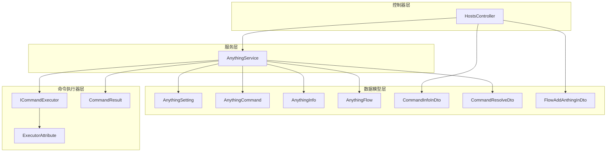
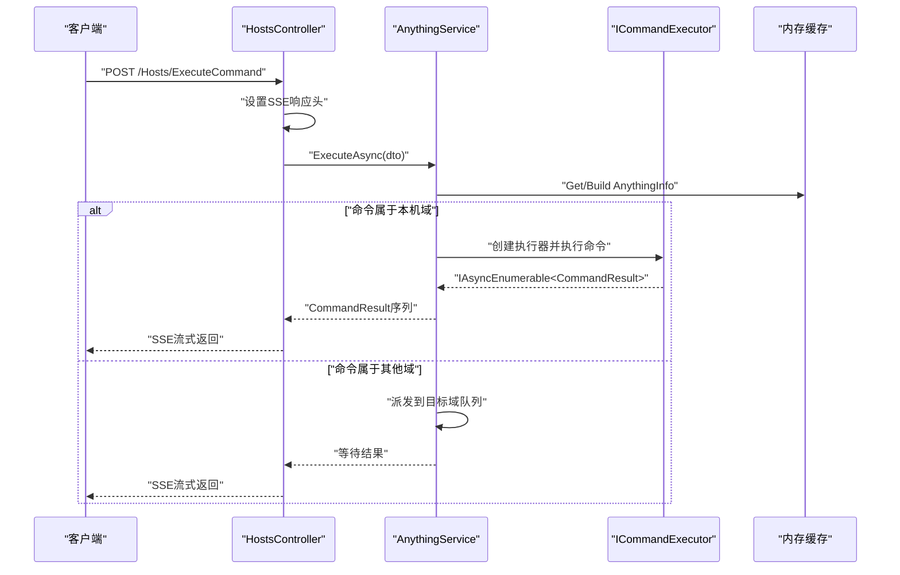
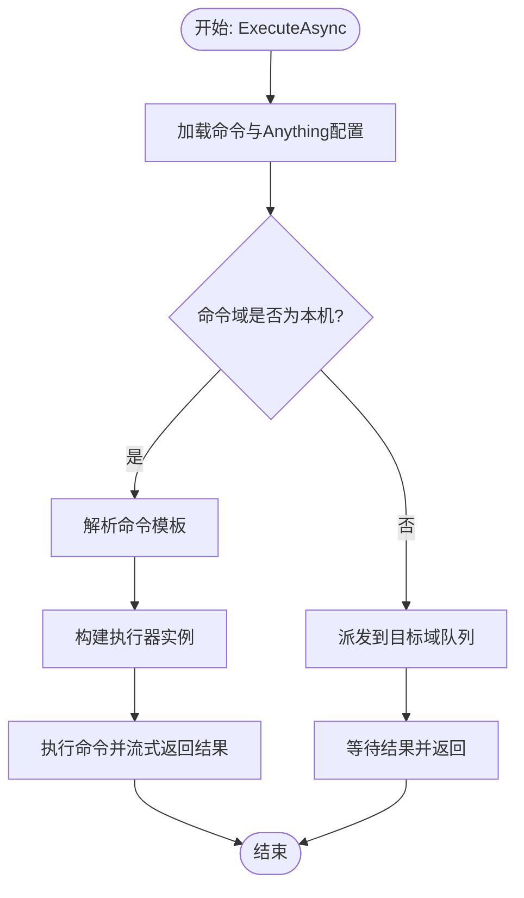
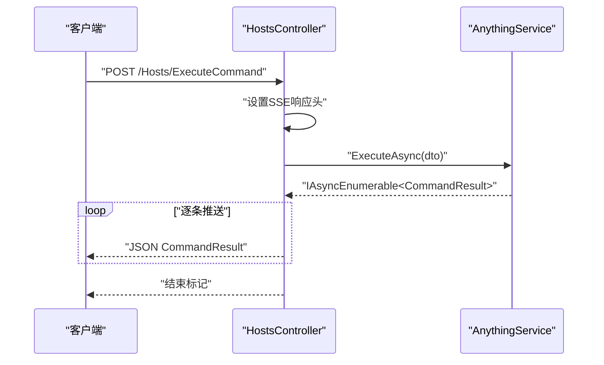
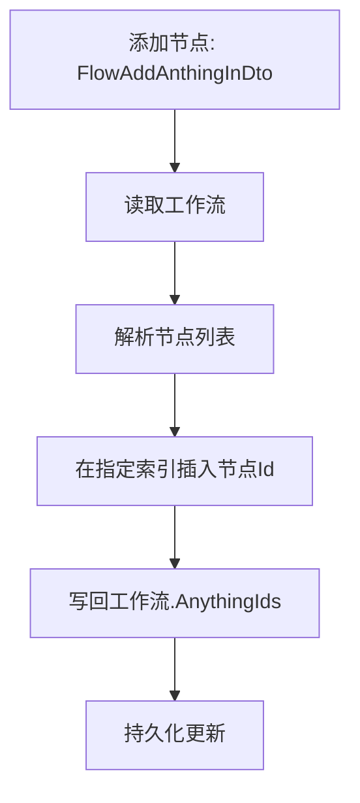
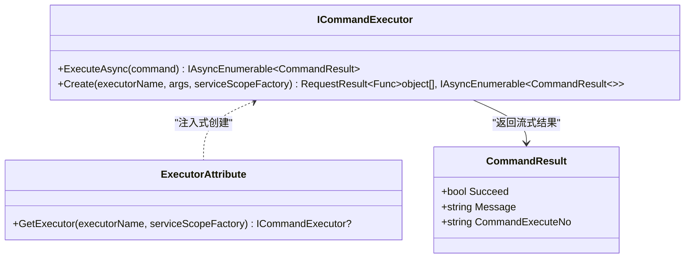
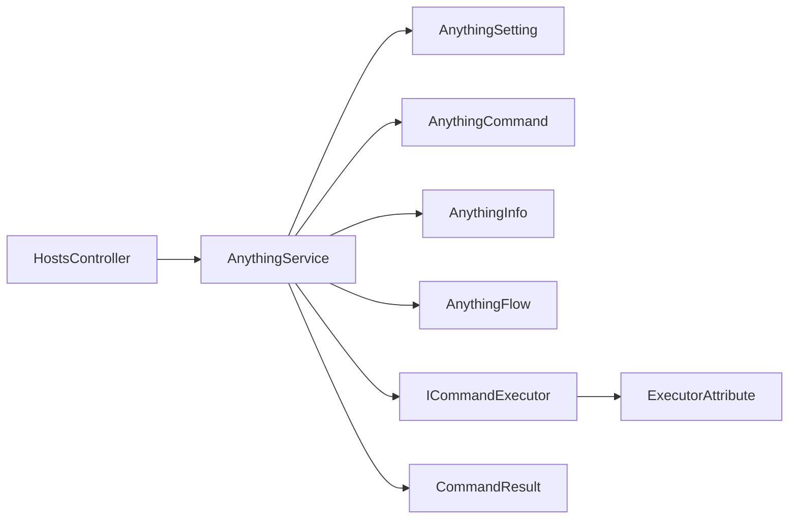

# 任务编排系统

<cite>
**本文引用的文件**
- [AnythingFlow.cs](file://Sylas.RemoteTasks.App/RemoteHostModule/Anything/AnythingFlow.cs)
- [FlowAddAnthingInDto.cs](file://Sylas.RemoteTasks.App/RemoteHostModule/Anything/FlowAddAnthingInDto.cs)
- [AnythingExecutor.cs](file://Sylas.RemoteTasks.App/RemoteHostModule/Anything/AnythingExecutor.cs)
- [AnythingService.cs](file://Sylas.RemoteTasks.App/RemoteHostModule/Anything/AnythingService.cs)
- [HostsController.cs](file://Sylas.RemoteTasks.App/Controllers/HostsController.cs)
- [AnythingSetting.cs](file://Sylas.RemoteTasks.App/RemoteHostModule/Anything/AnythingSetting.cs)
- [AnythingCommand.cs](file://Sylas.RemoteTasks.App/RemoteHostModule/Anything/AnythingCommand.cs)
- [AnythingInfo.cs](file://Sylas.RemoteTasks.App/RemoteHostModule/Anything/AnythingInfo.cs)
- [CommandInfoInDto.cs](file://Sylas.RemoteTasks.App/RemoteHostModule/Anything/CommandInfoInDto.cs)
- [CommandInfoTaskDto.cs](file://Sylas.RemoteTasks.App/RemoteHostModule/Anything/CommandInfoTaskDto.cs)
- [CommandResolveDto.cs](file://Sylas.RemoteTasks.App/RemoteHostModule/Anything/CommandResolveDto.cs)
- [AnythingSettingDetails.cs](file://Sylas.RemoteTasks.App/RemoteHostModule/Anything/AnythingSettingDetails.cs)
- [AnythingSettingDetailsInDto.cs](file://Sylas.RemoteTasks.App/RemoteHostModule/Anything/AnythingSettingDetailsInDto.cs)
- [ICommandExecutor.cs](file://Sylas.RemoteTasks.Utils/CommandExecutor/ICommandExecutor.cs)
- [ExecutorAttribute.cs](file://Sylas.RemoteTasks.Utils/CommandExecutor/ExecutorAttribute.cs)
- [CommandResult.cs](file://Sylas.RemoteTasks.Utils/CommandExecutor/CommandResult.cs)
</cite>

## 目录
1. [简介](#简介)
2. [项目结构](#项目结构)
3. [核心组件](#核心组件)
4. [架构总览](#架构总览)
5. [详细组件分析](#详细组件分析)
6. [依赖关系分析](#依赖关系分析)
7. [性能考虑](#性能考虑)
8. [故障排查指南](#故障排查指南)
9. [结论](#结论)
10. [附录](#附录)

## 简介
本文件面向“任务编排系统”的使用者与维护者，系统性阐述任务编排的设计理念、执行流程与配置方式。重点围绕以下主题展开：
- 任务步骤的定义、依赖关系与执行顺序
- 控制器接口与 API 调用方式
- 与命令执行器（ICommandExecutor）的集成
- 工作流（Flow）的节点管理与执行编排
- 配置、调试与性能优化建议

本系统采用“配置驱动 + 模板解析 + 命令执行器”的模式，将“操作对象”（Anything）与其“可执行命令”解耦，通过控制器暴露 REST API，实现远程主机上的命令执行与状态反馈。

## 项目结构
任务编排系统主要分布在以下模块：
- 控制器层：HostsController 提供对外 API，负责接收请求、建立 SSE 流并调用服务层
- 服务层：AnythingService 负责 Anything 配置、命令解析、命令执行与跨节点任务派发
- 数据模型层：AnythingSetting、AnythingCommand、AnythingInfo、AnythingFlow 等实体与 DTO
- 命令执行器层：ICommandExecutor 接口及其实现，支持动态创建与注入

图表来源
- [HostsController.cs](file://Sylas.RemoteTasks.App/Controllers/HostsController.cs#L1-L468)
- [AnythingService.cs](file://Sylas.RemoteTasks.App/RemoteHostModule/Anything/AnythingService.cs#L1-L680)
- [AnythingSetting.cs](file://Sylas.RemoteTasks.App/RemoteHostModule/Anything/AnythingSetting.cs#L1-L34)
- [AnythingCommand.cs](file://Sylas.RemoteTasks.App/RemoteHostModule/Anything/AnythingCommand.cs#L1-L35)
- [AnythingInfo.cs](file://Sylas.RemoteTasks.App/RemoteHostModule/Anything/AnythingInfo.cs#L1-L38)
- [AnythingFlow.cs](file://Sylas.RemoteTasks.App/RemoteHostModule/Anything/AnythingFlow.cs#L1-L29)
- [CommandInfoInDto.cs](file://Sylas.RemoteTasks.App/RemoteHostModule/Anything/CommandInfoInDto.cs#L1-L15)
- [CommandResolveDto.cs](file://Sylas.RemoteTasks.App/RemoteHostModule/Anything/CommandResolveDto.cs#L1-L15)
- [FlowAddAnthingInDto.cs](file://Sylas.RemoteTasks.App/RemoteHostModule/Anything/FlowAddAnthingInDto.cs#L1-L10)
- [ICommandExecutor.cs](file://Sylas.RemoteTasks.Utils/CommandExecutor/ICommandExecutor.cs#L1-L73)
- [ExecutorAttribute.cs](file://Sylas.RemoteTasks.Utils/CommandExecutor/ExecutorAttribute.cs#L1-L25)
- [CommandResult.cs](file://Sylas.RemoteTasks.Utils/CommandExecutor/CommandResult.cs#L1-L37)

章节来源
- [HostsController.cs](file://Sylas.RemoteTasks.App/Controllers/HostsController.cs#L1-L468)
- [AnythingService.cs](file://Sylas.RemoteTasks.App/RemoteHostModule/Anything/AnythingService.cs#L1-L680)

## 核心组件
- 任务步骤定义
  - AnythingSetting：定义“操作对象”的标题、自定义属性与命令执行器引用
  - AnythingCommand：定义“可执行命令”，包含命令文本、执行状态查询、所属域与排序
  - AnythingInfo：运行时聚合后的“操作对象+命令+属性+执行器”
- 工作流编排
  - AnythingFlow：工作流实体，保存标题、环境变量、节点（多个 AnythingSetting 的 Id 列表）、计划任务与触发条件
  - FlowAddAnthingInDto：向工作流添加节点时使用的输入 DTO
- 命令执行与控制
  - CommandInfoInDto：执行单条命令的输入 DTO（包含命令 Id 与执行编号）
  - CommandResolveDto：解析命令模板的输入 DTO（基于 AnythingSetting 的属性）
  - CommandInfoTaskDto：跨节点任务派发时的 DTO（包含目标域、命令名等）

章节来源
- [AnythingSetting.cs](file://Sylas.RemoteTasks.App/RemoteHostModule/Anything/AnythingSetting.cs#L1-L34)
- [AnythingCommand.cs](file://Sylas.RemoteTasks.App/RemoteHostModule/Anything/AnythingCommand.cs#L1-L35)
- [AnythingInfo.cs](file://Sylas.RemoteTasks.App/RemoteHostModule/Anything/AnythingInfo.cs#L1-L38)
- [AnythingFlow.cs](file://Sylas.RemoteTasks.App/RemoteHostModule/Anything/AnythingFlow.cs#L1-L29)
- [FlowAddAnthingInDto.cs](file://Sylas.RemoteTasks.App/RemoteHostModule/Anything/FlowAddAnthingInDto.cs#L1-L10)
- [CommandInfoInDto.cs](file://Sylas.RemoteTasks.App/RemoteHostModule/Anything/CommandInfoInDto.cs#L1-L15)
- [CommandResolveDto.cs](file://Sylas.RemoteTasks.App/RemoteHostModule/Anything/CommandResolveDto.cs#L1-L15)
- [CommandInfoTaskDto.cs](file://Sylas.RemoteTasks.App/RemoteHostModule/Anything/CommandInfoTaskDto.cs#L1-L19)

## 架构总览
系统采用“控制器 -> 服务层 -> 命令执行器”的分层设计。控制器通过 SSE 返回命令执行结果，服务层负责：
- 解析 Anything 配置与命令模板
- 构建 AnythingInfo（含执行器与命令）
- 在本地或跨节点执行命令
- 通过内存缓存提升性能

图表来源
- [HostsController.cs](file://Sylas.RemoteTasks.App/Controllers/HostsController.cs#L85-L124)
- [AnythingService.cs](file://Sylas.RemoteTasks.App/RemoteHostModule/Anything/AnythingService.cs#L294-L389)
- [ICommandExecutor.cs](file://Sylas.RemoteTasks.Utils/CommandExecutor/ICommandExecutor.cs#L31-L71)

## 详细组件分析

### 1) AnythingService：任务编排的核心
- 职责
  - Anything 配置与命令的增删改查
  - AnythingInfo 的构建与缓存
  - 命令模板解析与执行
  - 跨节点任务派发与结果汇聚
- 关键流程
  - 构建 AnythingInfo：解析 Properties、解析执行器参数、动态创建执行器、解析命令模板、预执行状态查询
  - 执行命令：根据命令域判断本地或转发；本地则直接调用执行器；跨域则通过 HTTP 转发并等待结果
  - 任务队列：按域维护队列，中心节点轮询队列并回传结果

图表来源
- [AnythingService.cs](file://Sylas.RemoteTasks.App/RemoteHostModule/Anything/AnythingService.cs#L294-L389)

章节来源
- [AnythingService.cs](file://Sylas.RemoteTasks.App/RemoteHostModule/Anything/AnythingService.cs#L1-L680)

### 2) HostsController：API 与 SSE
- 提供以下关键接口
  - 分页查询 Anything 配置
  - 获取 Anything 配置与解析后的 AnythingInfo
  - 执行单条或多条命令（SSE 流）
  - 增删改 Anything 配置与命令
  - 解析命令模板
  - 工作流管理：新增、更新、删除、重排、节点增删、环境变量同步
- SSE 设计
  - 设置 Content-Type 为 text/event-stream，保持连接并持续推送 CommandResult
  - 支持客户端取消请求，服务端记录日志并终止

图表来源
- [HostsController.cs](file://Sylas.RemoteTasks.App/Controllers/HostsController.cs#L85-L124)
- [CommandResult.cs](file://Sylas.RemoteTasks.Utils/CommandExecutor/CommandResult.cs#L1-L37)

章节来源
- [HostsController.cs](file://Sylas.RemoteTasks.App/Controllers/HostsController.cs#L1-L468)

### 3) AnythingFlow：工作流编排
- 作用
  - 以字符串形式存储多个节点（AnythingSetting Id）的顺序
  - 支持计划任务、域限制、执行完成触发
  - 支持将节点的环境变量汇总到工作流级别
- 节点管理
  - 添加节点：FlowAddAnthingInDto 指定 FlowId、AnythingId、插入索引
  - 删除节点：按索引移除
  - 重排节点：支持前后移动并循环

图表来源
- [HostsController.cs](file://Sylas.RemoteTasks.App/Controllers/HostsController.cs#L301-L314)
- [FlowAddAnthingInDto.cs](file://Sylas.RemoteTasks.App/RemoteHostModule/Anything/FlowAddAnthingInDto.cs#L1-L10)
- [AnythingFlow.cs](file://Sylas.RemoteTasks.App/RemoteHostModule/Anything/AnythingFlow.cs#L1-L29)

章节来源
- [HostsController.cs](file://Sylas.RemoteTasks.App/Controllers/HostsController.cs#L290-L368)
- [AnythingFlow.cs](file://Sylas.RemoteTasks.App/RemoteHostModule/Anything/AnythingFlow.cs#L1-L29)
- [FlowAddAnthingInDto.cs](file://Sylas.RemoteTasks.App/RemoteHostModule/Anything/FlowAddAnthingInDto.cs#L1-L10)

### 4) 命令执行器与模板解析
- 命令执行器
  - 通过 ICommandExecutor.Create 动态创建执行器实例，支持静态类与带 ExecutorAttribute 的注入式执行器
  - 返回 IAsyncEnumerable<CommandResult>，便于流式输出
- 模板解析
  - AnythingService.GetAllProperties 聚合 AnythingSetting.Properties 并解析自身模板
  - CommandResolveDto 用于解析单条命令模板，结合 Properties 进行替换

图表来源
- [ICommandExecutor.cs](file://Sylas.RemoteTasks.Utils/CommandExecutor/ICommandExecutor.cs#L1-L73)
- [ExecutorAttribute.cs](file://Sylas.RemoteTasks.Utils/CommandExecutor/ExecutorAttribute.cs#L1-L25)
- [CommandResult.cs](file://Sylas.RemoteTasks.Utils/CommandExecutor/CommandResult.cs#L1-L37)

章节来源
- [ICommandExecutor.cs](file://Sylas.RemoteTasks.Utils/CommandExecutor/ICommandExecutor.cs#L1-L73)
- [ExecutorAttribute.cs](file://Sylas.RemoteTasks.Utils/CommandExecutor/ExecutorAttribute.cs#L1-L25)
- [CommandResult.cs](file://Sylas.RemoteTasks.Utils/CommandExecutor/CommandResult.cs#L1-L37)
- [AnythingService.cs](file://Sylas.RemoteTasks.App/RemoteHostModule/Anything/AnythingService.cs#L637-L677)

## 依赖关系分析
- 控制器依赖服务层：HostsController 直接依赖 AnythingService
- 服务层依赖数据模型与工具：AnythingService 依赖 AnythingSetting/AnythingCommand/AnythingInfo、内存缓存、HTTP 客户端工厂、模板解析器、命令执行器
- 命令执行器依赖反射与 DI：ICommandExecutor.Create 通过反射与 ExecutorAttribute 注入执行器实例
- 工作流依赖控制器：工作流的节点管理通过 HostsController 的 API 实现

图表来源
- [HostsController.cs](file://Sylas.RemoteTasks.App/Controllers/HostsController.cs#L1-L468)
- [AnythingService.cs](file://Sylas.RemoteTasks.App/RemoteHostModule/Anything/AnythingService.cs#L1-L680)
- [ICommandExecutor.cs](file://Sylas.RemoteTasks.Utils/CommandExecutor/ICommandExecutor.cs#L1-L73)

章节来源
- [HostsController.cs](file://Sylas.RemoteTasks.App/Controllers/HostsController.cs#L1-L468)
- [AnythingService.cs](file://Sylas.RemoteTasks.App/RemoteHostModule/Anything/AnythingService.cs#L1-L680)

## 性能考虑
- 缓存策略
  - 为 AllAnythingInfos 与单个 AnythingInfo 设置滑动过期缓存，减少重复构建与查询成本
  - 为执行器参数解析结果设置短期缓存，降低频繁查询执行器的成本
- 异步与流式
  - 命令执行返回 IAsyncEnumerable<CommandResult>，通过 SSE 流式推送，避免阻塞与大体积一次性响应
- 跨节点通信
  - 使用队列与轮询机制处理远端任务派发，避免长连接带来的复杂性
- 建议
  - 对高频查询的 AnythingSetting/AnythingCommand 增加数据库索引（如 AnythingId、OrderNo）
  - 对模板解析结果进行缓存（若模板稳定）
  - 对命令执行器实例进行池化或复用，减少反射与 DI 开销

章节来源
- [AnythingService.cs](file://Sylas.RemoteTasks.App/RemoteHostModule/Anything/AnythingService.cs#L255-L277)
- [AnythingService.cs](file://Sylas.RemoteTasks.App/RemoteHostModule/Anything/AnythingService.cs#L500-L521)
- [AnythingService.cs](file://Sylas.RemoteTasks.App/RemoteHostModule/Anything/AnythingService.cs#L544-L550)

## 故障排查指南
- 常见错误与定位
  - 未知命令：ExecuteAsync 中若命令不存在会抛出异常，需检查 CommandId
  - 无效执行器：构建执行器时若名称不正确或参数类型不匹配，会抛出异常
  - 跨域授权失败：本机域转发到中心服务器时，若无有效令牌或返回非 JSON，会返回错误提示
  - 执行超时：等待结果时若超过设定秒数，会返回超时提示
- 日志与可观测性
  - 控制器在 SSE 写入前记录日志，便于追踪执行状态
  - 服务端在队列轮询、结果收集等关键路径记录日志
- 建议排查步骤
  - 确认 AnythingSetting 与 AnythingCommand 的关联与排序
  - 检查命令模板中的变量是否能在 Properties 中解析
  - 核对命令域与当前节点域一致性
  - 查看内存缓存命中情况与过期策略

章节来源
- [AnythingService.cs](file://Sylas.RemoteTasks.App/RemoteHostModule/Anything/AnythingService.cs#L294-L389)
- [HostsController.cs](file://Sylas.RemoteTasks.App/Controllers/HostsController.cs#L85-L124)

## 结论
本任务编排系统通过“配置 + 模板 + 执行器”的组合，实现了灵活、可扩展且具备跨节点能力的命令执行框架。控制器层提供统一的 API 与 SSE 输出，服务层负责解析与执行，数据模型清晰地承载了“操作对象”、“命令”与“工作流”的关系。配合缓存与异步流式输出，系统在易用性与性能之间取得良好平衡。对于初学者，建议从配置 AnythingSetting 与命令模板入手；对于资深开发者，可进一步扩展执行器类型与工作流编排策略。

## 附录

### A. API 一览（节选）
- GET /Hosts/AnythingSettingsAsync
  - 功能：分页查询 Anything 配置
  - 输入：DataSearch
  - 输出：RequestResult<PagedData<AnythingSetting>>
- GET /Hosts/AnythingSettingAndInfoAsync?id={id}
  - 功能：获取配置详情与解析后的 AnythingInfo
  - 输出：RequestResult<object>
- POST /Hosts/ExecuteCommand
  - 功能：执行单条命令（SSE）
  - 输入：CommandInfoInDto
  - 输出：SSE 流式 CommandResult
- POST /Hosts/AddAnythingToFlow
  - 功能：向工作流添加节点
  - 输入：FlowAddAnthingInDto
  - 输出：RequestResult<bool>
- POST /Hosts/ResolveCommandSetttingAsync
  - 功能：解析命令模板
  - 输入：CommandResolveDto
  - 输出：RequestResult<string>

章节来源
- [HostsController.cs](file://Sylas.RemoteTasks.App/Controllers/HostsController.cs#L32-L234)
- [HostsController.cs](file://Sylas.RemoteTasks.App/Controllers/HostsController.cs#L301-L314)
- [HostsController.cs](file://Sylas.RemoteTasks.App/Controllers/HostsController.cs#L231-L234)

### B. 关键 DTO 说明
- CommandInfoInDto
  - 字段：CommandId、CommandExecuteNo
  - 用途：指定要执行的命令及其执行编号
- CommandResolveDto
  - 字段：Id、CmdTxt
  - 用途：基于 AnythingSetting 的 Properties 解析命令模板
- FlowAddAnthingInDto
  - 字段：FlowId、AnythingId、AnythingIndex
  - 用途：向工作流插入节点

章节来源
- [CommandInfoInDto.cs](file://Sylas.RemoteTasks.App/RemoteHostModule/Anything/CommandInfoInDto.cs#L1-L15)
- [CommandResolveDto.cs](file://Sylas.RemoteTasks.App/RemoteHostModule/Anything/CommandResolveDto.cs#L1-L15)
- [FlowAddAnthingInDto.cs](file://Sylas.RemoteTasks.App/RemoteHostModule/Anything/FlowAddAnthingInDto.cs#L1-L10)