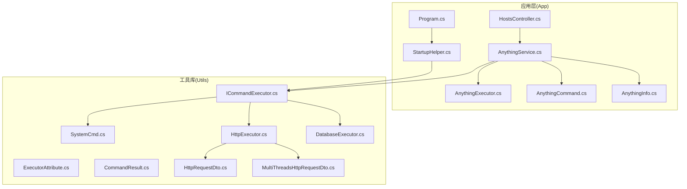
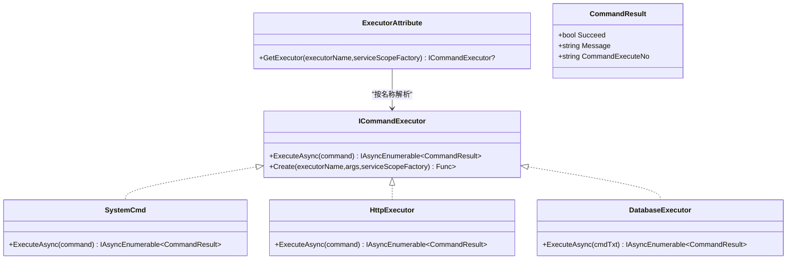
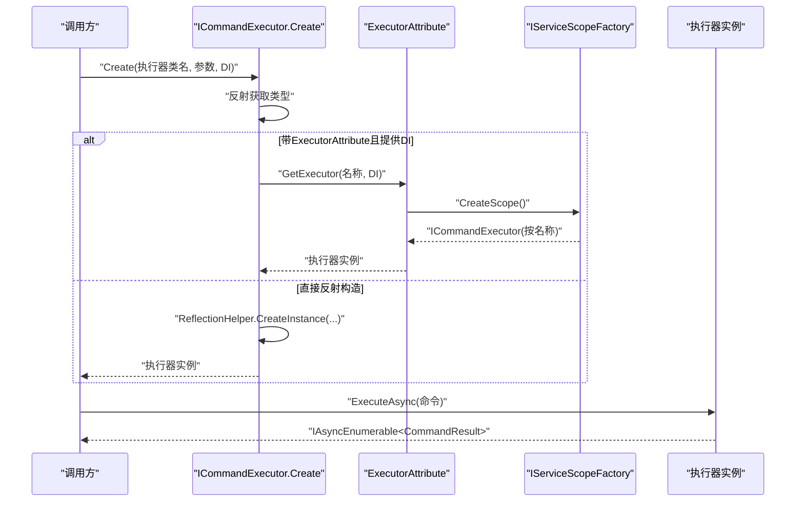
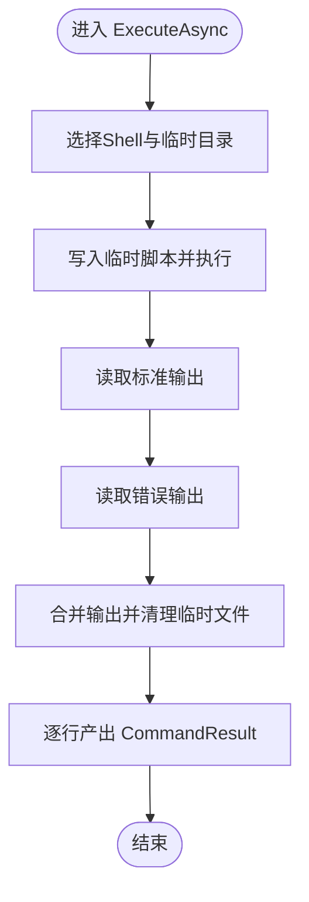
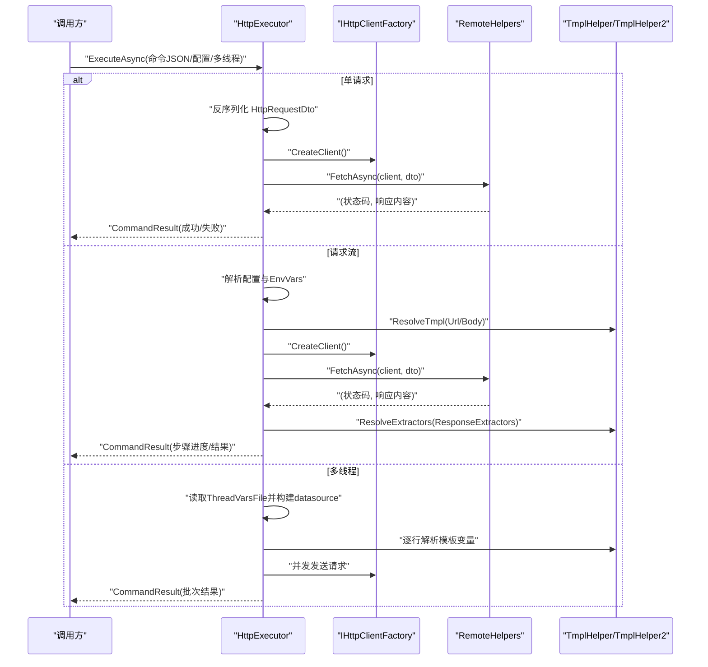
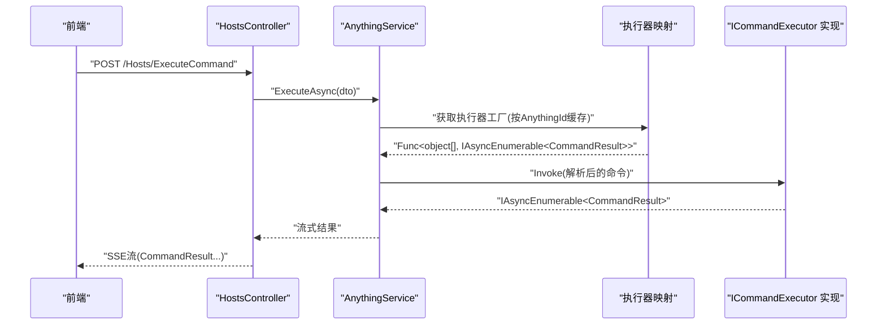
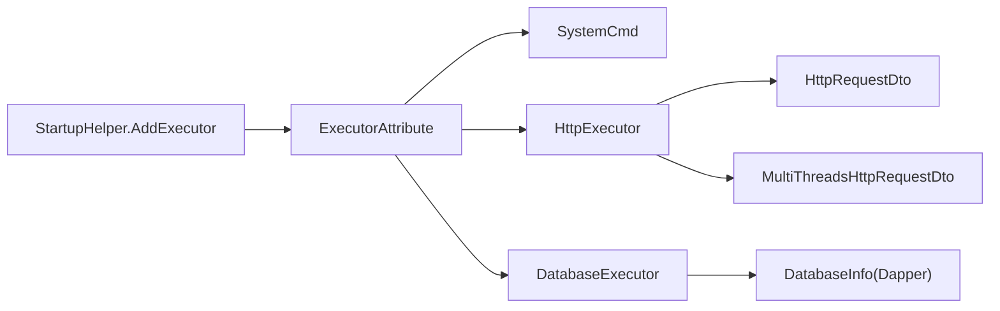

# 命令执行器系统

<cite>
**本文引用的文件**
- [ICommandExecutor.cs](file://Sylas.RemoteTasks.Utils/CommandExecutor/ICommandExecutor.cs)
- [ExecutorAttribute.cs](file://Sylas.RemoteTasks.Utils/CommandExecutor/ExecutorAttribute.cs)
- [SystemCmd.cs](file://Sylas.RemoteTasks.Utils/CommandExecutor/SystemCmd.cs)
- [HttpExecutor.cs](file://Sylas.RemoteTasks.Utils/CommandExecutor/HttpExecutor.cs)
- [DatabaseExecutor.cs](file://Sylas.RemoteTasks.Utils/CommandExecutor/DatabaseExecutor.cs)
- [CommandResult.cs](file://Sylas.RemoteTasks.Utils/CommandExecutor/CommandResult.cs)
- [HttpRequestDto.cs](file://Sylas.RemoteTasks.Utils/CommandExecutor/HttpRequestDto.cs)
- [MultiThreadsHttpRequestDto.cs](file://Sylas.RemoteTasks.Utils/CommandExecutor/MultiThreadsHttpRequestDto.cs)
- [StartupHelper.cs](file://Sylas.RemoteTasks.App/Helpers/StartupHelper.cs)
- [Program.cs](file://Sylas.RemoteTasks.App/Program.cs)
- [AnythingExecutor.cs](file://Sylas.RemoteTasks.App/RemoteHostModule/Anything/AnythingExecutor.cs)
- [AnythingCommand.cs](file://Sylas.RemoteTasks.App/RemoteHostModule/Anything/AnythingCommand.cs)
- [AnythingInfo.cs](file://Sylas.RemoteTasks.App/RemoteHostModule/Anything/AnythingInfo.cs)
- [AnythingService.cs](file://Sylas.RemoteTasks.App/RemoteHostModule/Anything/AnythingService.cs)
- [HostsController.cs](file://Sylas.RemoteTasks.App/Controllers/HostsController.cs)
</cite>

## 目录
1. [简介](#简介)
2. [项目结构](#项目结构)
3. [核心组件](#核心组件)
4. [架构总览](#架构总览)
5. [详细组件分析](#详细组件分析)
6. [依赖分析](#依赖分析)
7. [性能考虑](#性能考虑)
8. [故障排查指南](#故障排查指南)
9. [结论](#结论)
10. [附录](#附录)

## 简介
本文件系统性阐述命令执行器系统的设计与实现，覆盖接口与扩展机制、执行流程、注册与配置、以及与 AnythingExecutor/AnythingCommand 的关系。文档以实际代码为依据，提供面向初学者的循序讲解与面向资深开发者的深度分析。

## 项目结构
命令执行器位于工具库模块 Sylas.RemoteTasks.Utils 的 CommandExecutor 命名空间内；Anything 相关实体与服务位于应用模块 Sylas.RemoteTasks.App 的 RemoteHostModule/Anything 命名空间内；ASP.NET Core 启动与 DI 注册位于 Program.cs 与 StartupHelper.cs。

图表来源
- [Program.cs](file://Sylas.RemoteTasks.App/Program.cs#L26-L27)
- [StartupHelper.cs](file://Sylas.RemoteTasks.App/Helpers/StartupHelper.cs#L88-L99)
- [ICommandExecutor.cs](file://Sylas.RemoteTasks.Utils/CommandExecutor/ICommandExecutor.cs#L14-L21)
- [SystemCmd.cs](file://Sylas.RemoteTasks.Utils/CommandExecutor/SystemCmd.cs#L23-L129)
- [HttpExecutor.cs](file://Sylas.RemoteTasks.Utils/CommandExecutor/HttpExecutor.cs#L21-L102)
- [DatabaseExecutor.cs](file://Sylas.RemoteTasks.Utils/CommandExecutor/DatabaseExecutor.cs#L18-L81)
- [AnythingService.cs](file://Sylas.RemoteTasks.App/RemoteHostModule/Anything/AnythingService.cs#L294-L389)
- [HostsController.cs](file://Sylas.RemoteTasks.App/Controllers/HostsController.cs#L85-L97)

章节来源
- [Program.cs](file://Sylas.RemoteTasks.App/Program.cs#L26-L27)
- [StartupHelper.cs](file://Sylas.RemoteTasks.App/Helpers/StartupHelper.cs#L88-L99)

## 核心组件
- 命令执行器接口与工厂
  - ICommandExecutor：统一的异步命令执行接口，返回 IAsyncEnumerable<CommandResult>。
  - ICommandExecutor.Create：基于类名反射创建执行器实例，支持通过 ExecutorAttribute 从 DI 容器解析带依赖的执行器。
  - ExecutorAttribute：标记类为执行器，并通过 IServiceScopeFactory 从 DI 中按名称解析具体实现。
- 执行器实现
  - SystemCmd：系统命令执行器，封装本地命令执行、主机信息采集等能力。
  - HttpExecutor：HTTP 请求执行器，支持单请求、请求流、多线程压力测试与响应提取/数据处理。
  - DatabaseExecutor：数据库执行器，按“别名:SQL”格式路由到目标连接并执行查询或更新。
- 结果模型
  - CommandResult：封装执行成功标志、消息与可选的执行编号。
- DTO
  - HttpRequestDto：HTTP 请求参数模型。
  - MultiThreadsHttpRequestDto：多线程请求配置模型。

章节来源
- [ICommandExecutor.cs](file://Sylas.RemoteTasks.Utils/CommandExecutor/ICommandExecutor.cs#L14-L72)
- [ExecutorAttribute.cs](file://Sylas.RemoteTasks.Utils/CommandExecutor/ExecutorAttribute.cs#L10-L24)
- [SystemCmd.cs](file://Sylas.RemoteTasks.Utils/CommandExecutor/SystemCmd.cs#L23-L138)
- [HttpExecutor.cs](file://Sylas.RemoteTasks.Utils/CommandExecutor/HttpExecutor.cs#L21-L102)
- [DatabaseExecutor.cs](file://Sylas.RemoteTasks.Utils/CommandExecutor/DatabaseExecutor.cs#L18-L81)
- [CommandResult.cs](file://Sylas.RemoteTasks.Utils/CommandExecutor/CommandResult.cs#L6-L36)
- [HttpRequestDto.cs](file://Sylas.RemoteTasks.Utils/CommandExecutor/HttpRequestDto.cs#L11-L77)
- [MultiThreadsHttpRequestDto.cs](file://Sylas.RemoteTasks.Utils/CommandExecutor/MultiThreadsHttpRequestDto.cs#L8-L18)

## 架构总览
命令执行器采用“接口 + 反射 + DI”的扩展架构：
- 通过 ExecutorAttribute 标记的执行器由 StartupHelper 注册到 DI（按名称 Scoped）。
- 业务层通过 ICommandExecutor.Create 或直接从 DI 获取执行器实例。
- 执行器内部可依赖 HttpClientFactory、DatabaseInfo 等服务完成具体任务。
- AnythingService 将“Anything 配置 + 命令模板”解析为最终命令，再委派给具体执行器。

图表来源
- [ICommandExecutor.cs](file://Sylas.RemoteTasks.Utils/CommandExecutor/ICommandExecutor.cs#L14-L72)
- [ExecutorAttribute.cs](file://Sylas.RemoteTasks.Utils/CommandExecutor/ExecutorAttribute.cs#L10-L24)
- [SystemCmd.cs](file://Sylas.RemoteTasks.Utils/CommandExecutor/SystemCmd.cs#L23-L138)
- [HttpExecutor.cs](file://Sylas.RemoteTasks.Utils/CommandExecutor/HttpExecutor.cs#L21-L102)
- [DatabaseExecutor.cs](file://Sylas.RemoteTasks.Utils/CommandExecutor/DatabaseExecutor.cs#L18-L81)
- [CommandResult.cs](file://Sylas.RemoteTasks.Utils/CommandExecutor/CommandResult.cs#L6-L36)

## 详细组件分析

### 接口与工厂：ICommandExecutor 与 ExecutorAttribute
- 设计要点
  - ExecuteAsync 统一异步流式输出 CommandResult，便于实时反馈。
  - Create 支持两种实例化路径：若类带有 ExecutorAttribute 且传入 IServiceScopeFactory，则从 DI 解析；否则通过反射构造。
  - 反射定位 ExecuteAsync 方法，动态包装为 Func<object[], IAsyncEnumerable<CommandResult>>，便于上层统一调用。
- 扩展机制
  - 新增执行器只需实现 ICommandExecutor，并可选标注 ExecutorAttribute 以便 DI 注入。
  - 通过 StartupHelper 的 AddExecutor 扫描并注册带 ExecutorAttribute 的实现。

图表来源
- [ICommandExecutor.cs](file://Sylas.RemoteTasks.Utils/CommandExecutor/ICommandExecutor.cs#L31-L71)
- [ExecutorAttribute.cs](file://Sylas.RemoteTasks.Utils/CommandExecutor/ExecutorAttribute.cs#L18-L23)

章节来源
- [ICommandExecutor.cs](file://Sylas.RemoteTasks.Utils/CommandExecutor/ICommandExecutor.cs#L14-L72)
- [ExecutorAttribute.cs](file://Sylas.RemoteTasks.Utils/CommandExecutor/ExecutorAttribute.cs#L10-L24)
- [StartupHelper.cs](file://Sylas.RemoteTasks.App/Helpers/StartupHelper.cs#L88-L99)

### SystemCmd：系统命令执行器
- 能力概览
  - 实现 ICommandExecutor.ExecuteAsync，逐行输出 CommandResult。
  - 提供静态 ExecuteAsync/ExecuteSingleCommandAsync/ExecuteParallellyAsync，支持批量与并行执行。
  - 封装主机信息采集（CPU/内存/磁盘/进程），用于运维监控。
- 关键流程
  - 选择 shell（Windows PowerShell 或 Linux bash），写入临时脚本，通过管道执行并收集输出。
  - 对错误输出进行捕获与合并，保证结果完整性。
- 参数与错误处理
  - 命令字符串直接透传至执行层；错误通过 CommandResult.Message 返回。
  - 临时目录清理策略避免磁盘膨胀。

图表来源
- [SystemCmd.cs](file://Sylas.RemoteTasks.Utils/CommandExecutor/SystemCmd.cs#L129-L138)
- [SystemCmd.cs](file://Sylas.RemoteTasks.Utils/CommandExecutor/SystemCmd.cs#L144-L221)
- [SystemCmd.cs](file://Sylas.RemoteTasks.Utils/CommandExecutor/SystemCmd.cs#L227-L295)

章节来源
- [SystemCmd.cs](file://Sylas.RemoteTasks.Utils/CommandExecutor/SystemCmd.cs#L23-L138)
- [SystemCmd.cs](file://Sylas.RemoteTasks.Utils/CommandExecutor/SystemCmd.cs#L144-L221)
- [SystemCmd.cs](file://Sylas.RemoteTasks.Utils/CommandExecutor/SystemCmd.cs#L227-L295)

### HttpExecutor：HTTP 请求执行器
- 能力概览
  - 支持三种命令形态：单请求 JSON、请求流配置、多线程压力测试。
  - 请求流支持模板变量解析、成功正则校验、响应提取器与数据处理器。
- 关键流程
  - 单请求：反序列化 HttpRequestDto，调用远程接口，按正则判断成功与否。
  - 请求流：解析配置，逐条发送请求，将响应数据注入环境变量供后续提取与处理。
  - 多线程：按线程变量文件生成上下文，同一时刻并发请求，不同阶段顺序串行。
- 参数与错误处理
  - 成功判定通过 IsSuccessPattern 正则；失败返回 CommandResult(false, message)。
  - 数据处理器目前支持数据库传输（TransferDataAsync）。

图表来源
- [HttpExecutor.cs](file://Sylas.RemoteTasks.Utils/CommandExecutor/HttpExecutor.cs#L29-L102)
- [HttpExecutor.cs](file://Sylas.RemoteTasks.Utils/CommandExecutor/HttpExecutor.cs#L148-L255)
- [HttpRequestDto.cs](file://Sylas.RemoteTasks.Utils/CommandExecutor/HttpRequestDto.cs#L11-L77)
- [MultiThreadsHttpRequestDto.cs](file://Sylas.RemoteTasks.Utils/CommandExecutor/MultiThreadsHttpRequestDto.cs#L8-L18)

章节来源
- [HttpExecutor.cs](file://Sylas.RemoteTasks.Utils/CommandExecutor/HttpExecutor.cs#L21-L102)
- [HttpExecutor.cs](file://Sylas.RemoteTasks.Utils/CommandExecutor/HttpExecutor.cs#L148-L255)
- [HttpRequestDto.cs](file://Sylas.RemoteTasks.Utils/CommandExecutor/HttpRequestDto.cs#L11-L77)
- [MultiThreadsHttpRequestDto.cs](file://Sylas.RemoteTasks.Utils/CommandExecutor/MultiThreadsHttpRequestDto.cs#L8-L18)

### DatabaseExecutor：数据库执行器
- 能力概览
  - 命令格式：“别名:SQL”，根据别名查找连接信息，自动解密敏感连接串。
  - 支持 SELECT 返回序列化结果，非 SELECT 返回影响行数。
- 关键流程
  - 解析目标数据库别名，查询连接信息，构造连接对象。
  - 执行 SQL，捕获异常并返回 CommandResult(false, message)。
- 参数与错误处理
  - 别名缺失时抛出异常；连接串加密时自动解密。
  - 异常统一包装为失败结果。

图表来源
- [DatabaseExecutor.cs](file://Sylas.RemoteTasks.Utils/CommandExecutor/DatabaseExecutor.cs#L26-L81)

章节来源
- [DatabaseExecutor.cs](file://Sylas.RemoteTasks.Utils/CommandExecutor/DatabaseExecutor.cs#L18-L81)

### 与 AnythingExecutor、AnythingCommand 的关系
- AnythingExecutor
  - 仅作为“执行器元信息”实体，包含 Name 与 Arguments，用于在 Anything 配置中标识执行器类型与参数。
- AnythingCommand
  - 表示可执行的命令条目，包含命令名称、命令文本、执行状态查询、域与排序等。
- AnythingService
  - 负责将 Anything 配置与命令模板解析为最终命令，缓存执行器工厂函数，按需调用执行器。
  - 支持跨节点转发执行（中心服务器与子节点协作）。
- 控制器
  - HostsController 暴露 ExecuteCommandAsync，以 Server-Sent Events 流式返回 CommandResult。

图表来源
- [HostsController.cs](file://Sylas.RemoteTasks.App/Controllers/HostsController.cs#L85-L97)
- [AnythingService.cs](file://Sylas.RemoteTasks.App/RemoteHostModule/Anything/AnythingService.cs#L294-L389)
- [AnythingExecutor.cs](file://Sylas.RemoteTasks.App/RemoteHostModule/Anything/AnythingExecutor.cs#L5-L11)
- [AnythingCommand.cs](file://Sylas.RemoteTasks.App/RemoteHostModule/Anything/AnythingCommand.cs#L7-L34)
- [AnythingInfo.cs](file://Sylas.RemoteTasks.App/RemoteHostModule/Anything/AnythingInfo.cs#L9-L36)

章节来源
- [AnythingExecutor.cs](file://Sylas.RemoteTasks.App/RemoteHostModule/Anything/AnythingExecutor.cs#L5-L11)
- [AnythingCommand.cs](file://Sylas.RemoteTasks.App/RemoteHostModule/Anything/AnythingCommand.cs#L7-L34)
- [AnythingInfo.cs](file://Sylas.RemoteTasks.App/RemoteHostModule/Anything/AnythingInfo.cs#L9-L36)
- [AnythingService.cs](file://Sylas.RemoteTasks.App/RemoteHostModule/Anything/AnythingService.cs#L294-L389)
- [HostsController.cs](file://Sylas.RemoteTasks.App/Controllers/HostsController.cs#L85-L97)

## 依赖分析
- 组件耦合
  - 执行器实现与通用工具库解耦，通过接口与 DTO 交互。
  - HttpExecutor 依赖 IHttpClientFactory、RemoteHelpers、TmplHelper/TmplHelper2。
  - DatabaseExecutor 依赖 DatabaseInfo、Dapper、加密解密工具。
- DI 注册
  - StartupHelper.AddExecutor 扫描 ExecutorAttribute 并注册为按名称的 Scoped 服务。
  - Program.cs 注册 HttpClient、SignalR、仓储与服务。

图表来源
- [StartupHelper.cs](file://Sylas.RemoteTasks.App/Helpers/StartupHelper.cs#L88-L99)
- [ExecutorAttribute.cs](file://Sylas.RemoteTasks.Utils/CommandExecutor/ExecutorAttribute.cs#L18-L23)
- [HttpExecutor.cs](file://Sylas.RemoteTasks.Utils/CommandExecutor/HttpExecutor.cs#L21-L102)
- [DatabaseExecutor.cs](file://Sylas.RemoteTasks.Utils/CommandExecutor/DatabaseExecutor.cs#L18-L81)

章节来源
- [StartupHelper.cs](file://Sylas.RemoteTasks.App/Helpers/StartupHelper.cs#L88-L99)
- [Program.cs](file://Sylas.RemoteTasks.App/Program.cs#L40-L41)

## 性能考虑
- I/O 密集与流式输出
  - 所有执行器均返回 IAsyncEnumerable<CommandResult>，有利于边执行边消费，降低等待时间。
- 并发与批处理
  - SystemCmd 支持并行执行 ExecuteParallellyAsync；HttpExecutor 支持多线程并发请求。
- 资源管理
  - 临时脚本与日志文件在 SystemCmd 中按时间戳命名并定期清理，避免磁盘膨胀。
- 线程安全
  - AnythingService 使用并发集合与缓存键隔离，避免竞态条件。

## 故障排查指南
- 执行器未找到或实例化失败
  - 确认类名正确且已通过 ExecutorAttribute 标记并在 StartupHelper 中注册。
  - 若依赖 DI，确保传入 IServiceScopeFactory 且服务已注册。
- HTTP 请求失败
  - 检查 HttpRequestDto 的 IsSuccessPattern 是否与响应匹配；确认 URL/Headers/Body 模板解析正确。
  - 多线程场景检查 ThreadVarsFile 是否存在且首行为字段名。
- 数据库执行失败
  - 确认命令格式为“别名:SQL”，别名存在且连接串可解密；关注异常消息。
- Anything 执行无响应
  - 检查 AnythingService 的执行器映射缓存是否命中；确认命令模板解析成功。
  - 跨节点场景检查中心服务器转发逻辑与授权头。

章节来源
- [ICommandExecutor.cs](file://Sylas.RemoteTasks.Utils/CommandExecutor/ICommandExecutor.cs#L31-L71)
- [HttpExecutor.cs](file://Sylas.RemoteTasks.Utils/CommandExecutor/HttpExecutor.cs#L84-L101)
- [DatabaseExecutor.cs](file://Sylas.RemoteTasks.Utils/CommandExecutor/DatabaseExecutor.cs#L28-L54)
- [AnythingService.cs](file://Sylas.RemoteTasks.App/RemoteHostModule/Anything/AnythingService.cs#L294-L389)

## 结论
命令执行器系统通过统一接口、反射工厂与 DI 注册，实现了高扩展的执行器生态。SystemCmd、HttpExecutor、DatabaseExecutor 分别覆盖系统命令、HTTP 与数据库场景。AnythingService 将配置与模板转化为可执行命令，并通过流式 SSE 将结果回传，满足复杂运维与自动化需求。建议在生产环境中结合日志与超时控制，进一步增强可观测性与稳定性。

## 附录
- 注册与使用清单
  - 启动注册：Program.cs 调用 StartupHelper.AddExecutor 注册执行器。
  - 执行器创建：ICommandExecutor.Create(类名, 参数, DI)。
  - 执行命令：执行器.ExecuteAsync(命令字符串)。
- 与 Anything 的集成
  - 通过 AnythingCommand 存储命令文本与状态查询，AnythingService 解析模板并调用执行器。
- 错误处理约定
  - 所有异常与失败均以 CommandResult(false, message) 形式返回，便于上层统一处理。