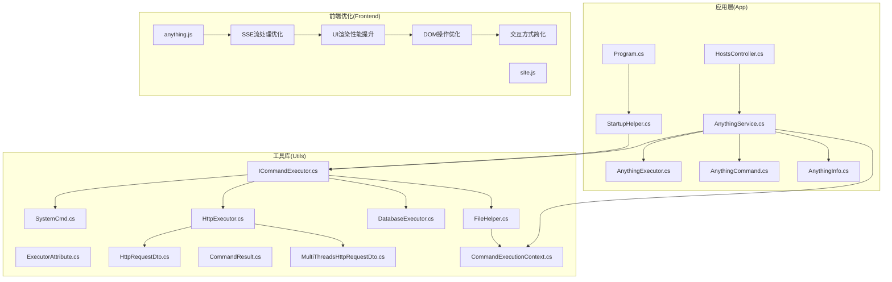
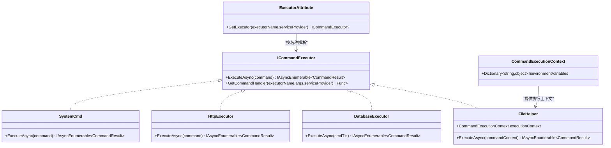
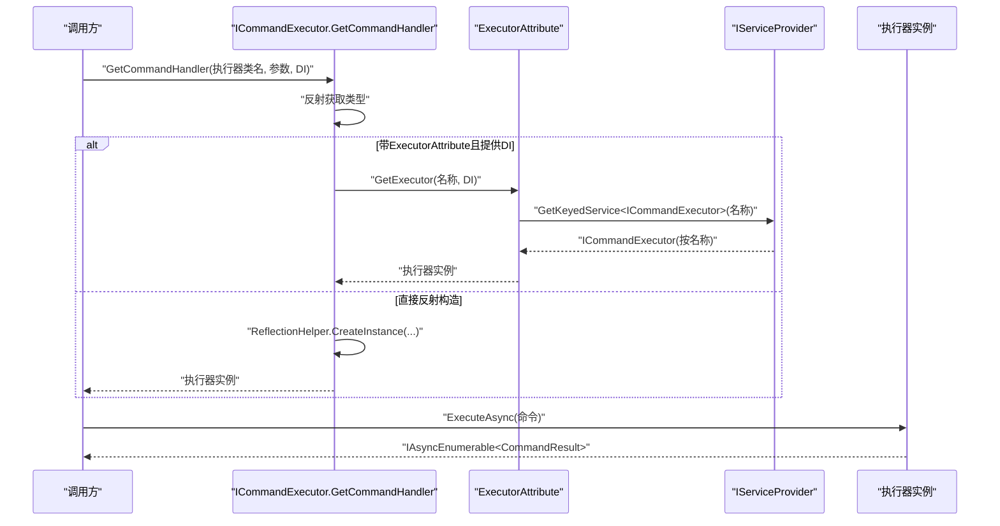
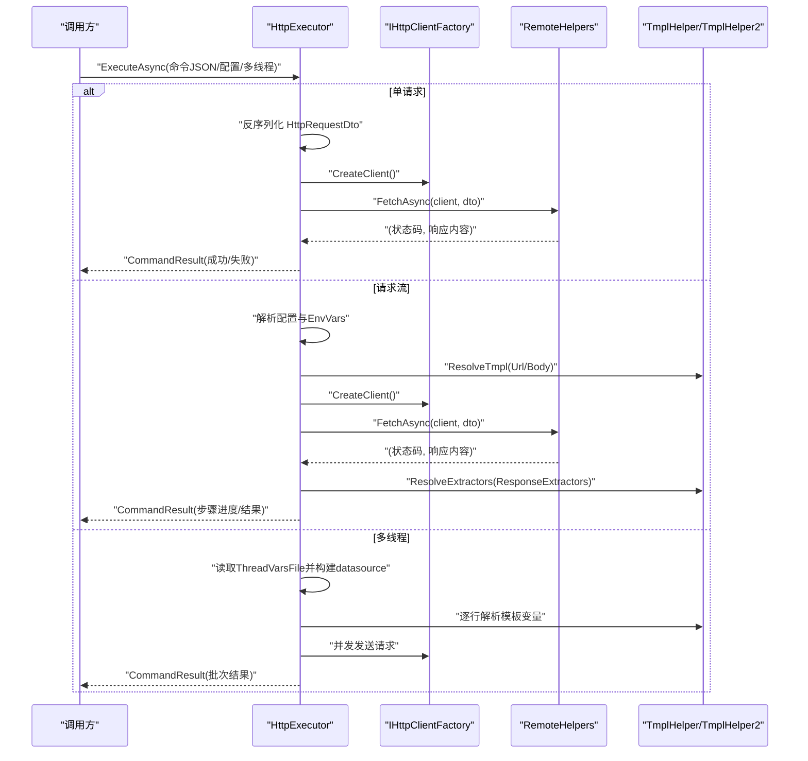
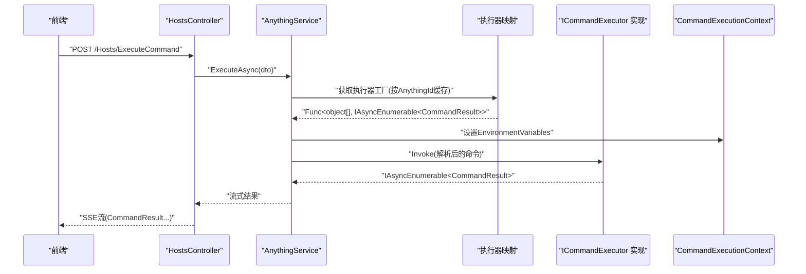
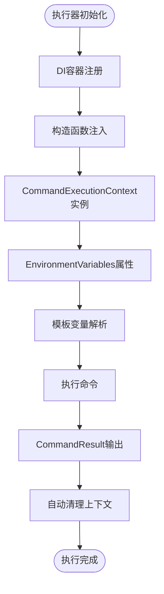
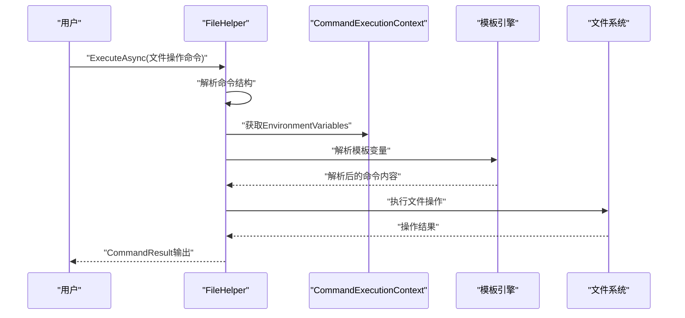
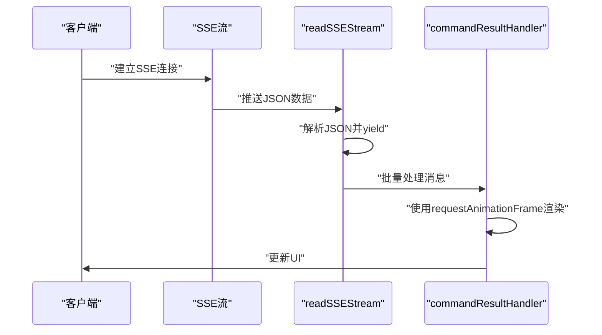
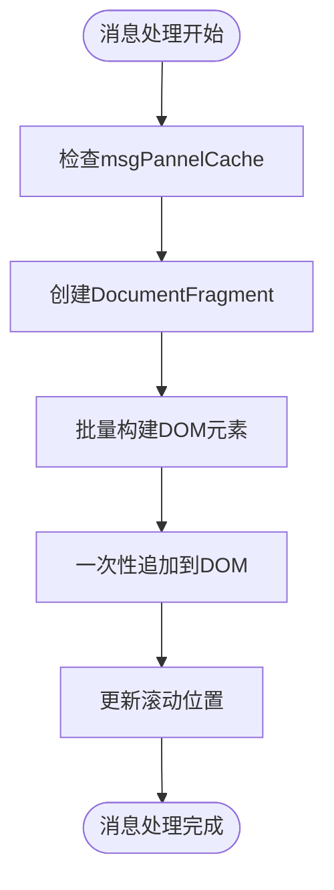
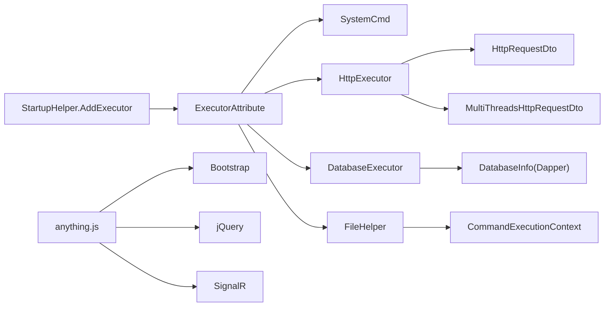

# 命令执行器系统

<cite>
**本文引用的文件**
- [ICommandExecutor.cs](file://Sylas.RemoteTasks.Utils/CommandExecutor/ICommandExecutor.cs)
- [ExecutorAttribute.cs](file://Sylas.RemoteTasks.Utils/CommandExecutor/ExecutorAttribute.cs)
- [SystemCmd.cs](file://Sylas.RemoteTasks.Utils/CommandExecutor/SystemCmd.cs)
- [HttpExecutor.cs](file://Sylas.RemoteTasks.Utils/CommandExecutor/HttpExecutor.cs)
- [DatabaseExecutor.cs](file://Sylas.RemoteTasks.Utils/CommandExecutor/DatabaseExecutor.cs)
- [CommandExecutionContext.cs](file://Sylas.RemoteTasks.Utils/CommandExecutor/CommandExecutionContext.cs)
- [FileHelper.cs](file://Sylas.RemoteTasks.Utils/CommandExecutor/FileHelper.cs)
- [CommandResult.cs](file://Sylas.RemoteTasks.Utils/CommandExecutor/CommandResult.cs)
- [HttpRequestDto.cs](file://Sylas.RemoteTasks.Utils/CommandExecutor/HttpRequestDto.cs)
- [MultiThreadsHttpRequestDto.cs](file://Sylas.RemoteTasks.Utils/CommandExecutor/MultiThreadsHttpRequestDto.cs)
- [StartupHelper.cs](file://Sylas.RemoteTasks.App/Helpers/StartupHelper.cs)
- [Program.cs](file://Sylas.RemoteTasks.App/Program.cs)
- [AnythingExecutor.cs](file://Sylas.RemoteTasks.App/RemoteHostModule/Anything/AnythingExecutor.cs)
- [AnythingCommand.cs](file://Sylas.RemoteTasks.App/RemoteHostModule/Anything/AnythingCommand.cs)
- [AnythingInfo.cs](file://Sylas.RemoteTasks.App/RemoteHostModule/Anything/AnythingInfo.cs)
- [AnythingService.cs](file://Sylas.RemoteTasks.App/RemoteHostModule/Anything/AnythingService.cs)
- [HostsController.cs](file://Sylas.RemoteTasks.App/Controllers/HostsController.cs)
- [anything.js](file://Sylas.RemoteTasks.App/wwwroot/js/anything.js)
- [site.js](file://Sylas.RemoteTasks.App/wwwroot/js/site.js)
</cite>

## 更新摘要
**变更内容**
- 新增CommandExecutionContext框架，提供统一的执行上下文和环境变量管理
- FileHelper组件重构，增强模板引擎支持和变量解析能力
- 更新AnythingService与CommandExecutionContext的集成方式
- 完善环境变量在执行器间的传递和使用机制
- 增强模板变量解析的灵活性和可扩展性

## 目录
1. [简介](#简介)
2. [项目结构](#项目结构)
3. [核心组件](#核心组件)
4. [架构总览](#架构总览)
5. [详细组件分析](#详细组件分析)
6. [CommandExecutionContext框架](#commandexecutioncontext框架)
7. [FileHelper组件重构](#filehelper组件重构)
8. [前端性能优化](#前端性能优化)
9. [依赖分析](#依赖分析)
10. [性能考虑](#性能考虑)
11. [故障排查指南](#故障排查指南)
12. [结论](#结论)
13. [附录](#附录)

## 简介
本文件系统性阐述命令执行器系统的设计与实现，覆盖接口与扩展机制、执行流程、注册与配置、CommandExecutionContext框架以及FileHelper组件重构。文档以实际代码为依据，提供面向初学者的循序讲解与面向资深开发者的深度分析。特别关注最新的CommandExecutionContext框架引入和FileHelper组件重构，增强了环境变量管理和执行上下文处理能力。

## 项目结构
命令执行器位于工具库模块 Sylas.RemoteTasks.Utils 的 CommandExecutor 命名空间内；Anything 相关实体与服务位于应用模块 Sylas.RemoteTasks.App 的 RemoteHostModule/Anything 命名空间内；ASP.NET Core 启动与 DI 注册位于 Program.cs 与 StartupHelper.cs。新增的 CommandExecutionContext 提供统一的执行上下文管理，FileHelper 组件经过重构增强了模板引擎支持。

**图表来源**
- [Program.cs:26-27](file://Sylas.RemoteTasks.App/Program.cs#L26-L27)
- [StartupHelper.cs:88-102](file://Sylas.RemoteTasks.App/Helpers/StartupHelper.cs#L88-L102)
- [ICommandExecutor.cs:14-72](file://Sylas.RemoteTasks.Utils/CommandExecutor/ICommandExecutor.cs#L14-L72)
- [SystemCmd.cs:23-129](file://Sylas.RemoteTasks.Utils/CommandExecutor/SystemCmd.cs#L23-L129)
- [HttpExecutor.cs:21-102](file://Sylas.RemoteTasks.Utils/CommandExecutor/HttpExecutor.cs#L21-L102)
- [DatabaseExecutor.cs:18-81](file://Sylas.RemoteTasks.Utils/CommandExecutor/DatabaseExecutor.cs#L18-L81)
- [FileHelper.cs:27-28](file://Sylas.RemoteTasks.Utils/CommandExecutor/FileHelper.cs#L27-L28)
- [CommandExecutionContext.cs:9-15](file://Sylas.RemoteTasks.Utils/CommandExecutor/CommandExecutionContext.cs#L9-L15)
- [AnythingService.cs:29-38](file://Sylas.RemoteTasks.App/RemoteHostModule/Anything/AnythingService.cs#L29-L38)
- [HostsController.cs:85-97](file://Sylas.RemoteTasks.App/Controllers/HostsController.cs#L85-L97)
- [anything.js:1-36](file://Sylas.RemoteTasks.App/wwwroot/js/anything.js#L1-L36)
- [site.js:1-800](file://Sylas.RemoteTasks.App/wwwroot/js/site.js#L1-L800)

**章节来源**
- [Program.cs:26-27](file://Sylas.RemoteTasks.App/Program.cs#L26-L27)
- [StartupHelper.cs:88-102](file://Sylas.RemoteTasks.App/Helpers/StartupHelper.cs#L88-L102)

## 核心组件
- 命令执行器接口与工厂
  - ICommandExecutor：统一的异步命令执行接口，返回 IAsyncEnumerable<CommandResult>。
  - ICommandExecutor.Create：基于类名反射创建执行器实例，支持通过 ExecutorAttribute 从 DI 容器解析带依赖的执行器。
  - ExecutorAttribute：标记类为执行器，并通过 IServiceScopeFactory 从 DI 中按名称解析具体实现。
- 执行器实现
  - SystemCmd：系统命令执行器，封装本地命令执行、主机信息采集等能力。
  - HttpExecutor：HTTP 请求执行器，支持单请求、请求流、多线程压力测试与响应提取/数据处理。
  - DatabaseExecutor：数据库执行器，按"别名:SQL"格式路由到目标连接并执行查询或更新。
  - FileHelper：文件操作执行器，支持复杂的文件模板处理和批量文件操作。
- 执行上下文管理
  - CommandExecutionContext：提供统一的执行上下文，包含环境变量管理功能。
- 结果模型
  - CommandResult：封装执行成功标志、消息与可选的执行编号。
- DTO
  - HttpRequestDto：HTTP 请求参数模型。
  - MultiThreadsHttpRequestDto：多线程请求配置模型。

**章节来源**
- [ICommandExecutor.cs:14-72](file://Sylas.RemoteTasks.Utils/CommandExecutor/ICommandExecutor.cs#L14-L72)
- [ExecutorAttribute.cs:10-24](file://Sylas.RemoteTasks.Utils/CommandExecutor/ExecutorAttribute.cs#L10-L24)
- [SystemCmd.cs:23-138](file://Sylas.RemoteTasks.Utils/CommandExecutor/SystemCmd.cs#L23-L138)
- [HttpExecutor.cs:21-102](file://Sylas.RemoteTasks.Utils/CommandExecutor/HttpExecutor.cs#L21-L102)
- [DatabaseExecutor.cs:18-81](file://Sylas.RemoteTasks.Utils/CommandExecutor/DatabaseExecutor.cs#L18-L81)
- [FileHelper.cs:27-28](file://Sylas.RemoteTasks.Utils/CommandExecutor/FileHelper.cs#L27-L28)
- [CommandExecutionContext.cs:9-15](file://Sylas.RemoteTasks.Utils/CommandExecutor/CommandExecutionContext.cs#L9-L15)
- [CommandResult.cs:6-36](file://Sylas.RemoteTasks.Utils/CommandExecutor/CommandResult.cs#L6-L36)
- [HttpRequestDto.cs:11-77](file://Sylas.RemoteTasks.Utils/CommandExecutor/HttpRequestDto.cs#L11-L77)
- [MultiThreadsHttpRequestDto.cs:8-18](file://Sylas.RemoteTasks.Utils/CommandExecutor/MultiThreadsHttpRequestDto.cs#L8-L18)

## 架构总览
命令执行器采用"接口 + 反射 + DI + 上下文"的扩展架构：
- 通过 ExecutorAttribute 标记的执行器由 StartupHelper 注册到 DI（按名称 Scoped）。
- 业务层通过 ICommandExecutor.Create 或直接从 DI 获取执行器实例。
- 执行器内部可依赖 CommandExecutionContext 管理环境变量和执行上下文。
- AnythingService 将"Anything 配置 + 命令模板"解析为最终命令，再委派给具体执行器。

**图表来源**
- [ICommandExecutor.cs:14-72](file://Sylas.RemoteTasks.Utils/CommandExecutor/ICommandExecutor.cs#L14-L72)
- [ExecutorAttribute.cs:10-24](file://Sylas.RemoteTasks.Utils/CommandExecutor/ExecutorAttribute.cs#L10-L24)
- [SystemCmd.cs:23-138](file://Sylas.RemoteTasks.Utils/CommandExecutor/SystemCmd.cs#L23-L138)
- [HttpExecutor.cs:21-102](file://Sylas.RemoteTasks.Utils/CommandExecutor/HttpExecutor.cs#L21-L102)
- [DatabaseExecutor.cs:18-81](file://Sylas.RemoteTasks.Utils/CommandExecutor/DatabaseExecutor.cs#L18-L81)
- [FileHelper.cs:27-28](file://Sylas.RemoteTasks.Utils/CommandExecutor/FileHelper.cs#L27-L28)
- [CommandExecutionContext.cs:9-15](file://Sylas.RemoteTasks.Utils/CommandExecutor/CommandExecutionContext.cs#L9-L15)
- [CommandResult.cs:6-36](file://Sylas.RemoteTasks.Utils/CommandExecutor/CommandResult.cs#L6-L36)

## 详细组件分析

### 接口与工厂：ICommandExecutor 与 ExecutorAttribute
- 设计要点
  - ExecuteAsync 统一异步流式输出 CommandResult，便于实时反馈。
  - GetCommandHandler 支持两种实例化路径：若类带有 ExecutorAttribute 且传入 IServiceProvider，则从 DI 解析；否则通过反射构造。
  - 反射定位 ExecuteAsync 方法，动态包装为 Func<object[], IAsyncEnumerable<CommandResult>>，便于上层统一调用。
- 扩展机制
  - 新增执行器只需实现 ICommandExecutor，并可选标注 ExecutorAttribute 以便 DI 注入。
  - 通过 StartupHelper 的 AddExecutor 扫描并注册带 ExecutorAttribute 的实现。

**图表来源**
- [ICommandExecutor.cs:30-71](file://Sylas.RemoteTasks.Utils/CommandExecutor/ICommandExecutor.cs#L30-L71)
- [ExecutorAttribute.cs:18-23](file://Sylas.RemoteTasks.Utils/CommandExecutor/ExecutorAttribute.cs#L18-L23)

**章节来源**
- [ICommandExecutor.cs:14-72](file://Sylas.RemoteTasks.Utils/CommandExecutor/ICommandExecutor.cs#L14-L72)
- [ExecutorAttribute.cs:10-24](file://Sylas.RemoteTasks.Utils/CommandExecutor/ExecutorAttribute.cs#L10-L24)
- [StartupHelper.cs:88-102](file://Sylas.RemoteTasks.App/Helpers/StartupHelper.cs#L88-L102)

### SystemCmd：系统命令执行器
- 能力概览
  - 实现 ICommandExecutor.ExecuteAsync，逐行输出 CommandResult。
  - 提供静态 ExecuteAsync/ExecuteSingleCommandAsync/ExecuteParallellyAsync，支持批量与并行执行。
  - 封装主机信息采集（CPU/内存/磁盘/进程），用于运维监控。
- 关键流程
  - 选择 shell（Windows PowerShell 或 Linux bash），写入临时脚本，通过管道执行并收集输出。
  - 对错误输出进行捕获与合并，保证结果完整性。
- 参数与错误处理
  - 命令字符串直接透传至执行层；错误通过 CommandResult.Message 返回。
  - 临时目录清理策略避免磁盘膨胀。

**图表来源**
- [SystemCmd.cs:129-138](file://Sylas.RemoteTasks.Utils/CommandExecutor/SystemCmd.cs#L129-L138)
- [SystemCmd.cs:144-221](file://Sylas.RemoteTasks.Utils/CommandExecutor/SystemCmd.cs#L144-L221)
- [SystemCmd.cs:227-295](file://Sylas.RemoteTasks.Utils/CommandExecutor/SystemCmd.cs#L227-L295)

**章节来源**
- [SystemCmd.cs:23-138](file://Sylas.RemoteTasks.Utils/CommandExecutor/SystemCmd.cs#L23-L138)
- [SystemCmd.cs:144-221](file://Sylas.RemoteTasks.Utils/CommandExecutor/SystemCmd.cs#L144-L221)
- [SystemCmd.cs:227-295](file://Sylas.RemoteTasks.Utils/CommandExecutor/SystemCmd.cs#L227-L295)

### HttpExecutor：HTTP 请求执行器
- 能力概览
  - 支持三种命令形态：单请求 JSON、请求流配置、多线程压力测试。
  - 请求流支持模板变量解析、成功正则校验、响应提取器与数据处理器。
- 关键流程
  - 单请求：反序列化 HttpRequestDto，调用远程接口，按正则判断成功与否。
  - 请求流：解析配置，逐条发送请求，将响应数据注入环境变量供后续提取与处理。
  - 多线程：按线程变量文件生成上下文，同一时刻并发请求，不同阶段顺序串行。
- 参数与错误处理
  - 成功判定通过 IsSuccessPattern 正则；失败返回 CommandResult(false, message)。
  - 数据处理器目前支持数据库传输（TransferDataAsync）。

**图表来源**
- [HttpExecutor.cs:29-102](file://Sylas.RemoteTasks.Utils/CommandExecutor/HttpExecutor.cs#L29-L102)
- [HttpExecutor.cs:148-255](file://Sylas.RemoteTasks.Utils/CommandExecutor/HttpExecutor.cs#L148-L255)
- [HttpRequestDto.cs:11-77](file://Sylas.RemoteTasks.Utils/CommandExecutor/HttpRequestDto.cs#L11-L77)
- [MultiThreadsHttpRequestDto.cs:8-18](file://Sylas.RemoteTasks.Utils/CommandExecutor/MultiThreadsHttpRequestDto.cs#L8-L18)

**章节来源**
- [HttpExecutor.cs:21-102](file://Sylas.RemoteTasks.Utils/CommandExecutor/HttpExecutor.cs#L21-L102)
- [HttpExecutor.cs:148-255](file://Sylas.RemoteTasks.Utils/CommandExecutor/HttpExecutor.cs#L148-L255)
- [HttpRequestDto.cs:11-77](file://Sylas.RemoteTasks.Utils/CommandExecutor/HttpRequestDto.cs#L11-L77)
- [MultiThreadsHttpRequestDto.cs:8-18](file://Sylas.RemoteTasks.Utils/CommandExecutor/MultiThreadsHttpRequestDto.cs#L8-L18)

### DatabaseExecutor：数据库执行器
- 能力概览
  - 命令格式："别名:SQL"，根据别名查找连接信息，自动解密敏感连接串。
  - 支持 SELECT 返回序列化结果，非 SELECT 返回影响行数。
- 关键流程
  - 解析目标数据库别名，查询连接信息，构造连接对象。
  - 执行 SQL，捕获异常并返回 CommandResult(false, message)。
- 参数与错误处理
  - 别名缺失时抛出异常；连接串加密时自动解密。
  - 异常统一包装为失败结果。

**图表来源**
- [DatabaseExecutor.cs:26-81](file://Sylas.RemoteTasks.Utils/CommandExecutor/DatabaseExecutor.cs#L26-L81)

**章节来源**
- [DatabaseExecutor.cs:18-81](file://Sylas.RemoteTasks.Utils/CommandExecutor/DatabaseExecutor.cs#L18-L81)

### 与 AnythingExecutor、AnythingCommand 的关系
- AnythingExecutor
  - 仅作为"执行器元信息"实体，包含 Name 与 Arguments，用于在 Anything 配置中标识执行器类型与参数。
- AnythingCommand
  - 表示可执行的命令条目，包含命令名称、命令文本、执行状态查询、域与排序等。
- AnythingService
  - 负责将 Anything 配置与命令模板解析为最终命令，缓存执行器工厂函数，按需调用执行器。
  - 支持跨节点转发执行（中心服务器与子节点协作）。
  - 集成 CommandExecutionContext，将 Anything 配置的 Properties 作为环境变量传递给执行器。
- 控制器
  - HostsController 暴露 ExecuteCommandAsync，以 Server-Sent Events 流式返回 CommandResult。

**图表来源**
- [HostsController.cs:85-97](file://Sylas.RemoteTasks.App/Controllers/HostsController.cs#L85-L97)
- [AnythingService.cs:294-396](file://Sylas.RemoteTasks.App/RemoteHostModule/Anything/AnythingService.cs#L294-L396)
- [AnythingExecutor.cs:5-11](file://Sylas.RemoteTasks.App/RemoteHostModule/Anything/AnythingExecutor.cs#L5-L11)
- [AnythingCommand.cs:7-34](file://Sylas.RemoteTasks.App/RemoteHostModule/Anything/AnythingCommand.cs#L7-L34)
- [AnythingInfo.cs:9-36](file://Sylas.RemoteTasks.App/RemoteHostModule/Anything/AnythingInfo.cs#L9-L36)
- [CommandExecutionContext.cs:9-15](file://Sylas.RemoteTasks.Utils/CommandExecutor/CommandExecutionContext.cs#L9-L15)

**章节来源**
- [AnythingExecutor.cs:5-11](file://Sylas.RemoteTasks.App/RemoteHostModule/Anything/AnythingExecutor.cs#L5-L11)
- [AnythingCommand.cs:7-34](file://Sylas.RemoteTasks.App/RemoteHostModule/Anything/AnythingCommand.cs#L7-L34)
- [AnythingInfo.cs:9-36](file://Sylas.RemoteTasks.App/RemoteHostModule/Anything/AnythingInfo.cs#L9-L36)
- [AnythingService.cs:294-396](file://Sylas.RemoteTasks.App/RemoteHostModule/Anything/AnythingService.cs#L294-L396)
- [HostsController.cs:85-97](file://Sylas.RemoteTasks.App/Controllers/HostsController.cs#L85-L97)

## CommandExecutionContext框架

### 框架概述
CommandExecutionContext 是新增的执行上下文管理框架，提供统一的环境变量管理和执行上下文处理能力。该框架解决了执行器间共享状态和配置的问题，增强了命令执行的灵活性和可扩展性。

### 核心功能
- 环境变量管理：提供 Dictionary<string, object> 类型的 EnvironmentVariables 属性，支持动态添加、修改和访问环境变量。
- 执行上下文隔离：每个执行器实例拥有独立的 CommandExecutionContext 实例，避免状态污染。
- 模板变量解析：与模板引擎深度集成，支持在执行过程中动态解析和更新变量。

### 集成方式
- DI 注册：通过 StartupHelper.AddExecutor 在服务容器中注册 CommandExecutionContext 为 Scoped 服务。
- 构造函数注入：支持在执行器构造函数中注入 CommandExecutionContext 实例。
- 运行时设置：在执行前通过 AnythingService 设置环境变量，执行后自动清理。

**图表来源**
- [CommandExecutionContext.cs:9-15](file://Sylas.RemoteTasks.Utils/CommandExecutor/CommandExecutionContext.cs#L9-L15)
- [StartupHelper.cs](file://Sylas.RemoteTasks.App/Helpers/StartupHelper.cs#L101)
- [AnythingService.cs](file://Sylas.RemoteTasks.App/RemoteHostModule/Anything/AnythingService.cs#L385)

**章节来源**
- [CommandExecutionContext.cs:9-15](file://Sylas.RemoteTasks.Utils/CommandExecutor/CommandExecutionContext.cs#L9-L15)
- [StartupHelper.cs](file://Sylas.RemoteTasks.App/Helpers/StartupHelper.cs#L101)
- [AnythingService.cs](file://Sylas.RemoteTasks.App/RemoteHostModule/Anything/AnythingService.cs#L385)

## FileHelper组件重构

### 重构概述
FileHelper 组件经过重大重构，增强了模板引擎支持、变量解析能力和文件操作的灵活性。重构后的 FileHelper 不仅保留了原有的文件操作功能，还增加了复杂的文件模板处理和批量文件操作能力。

### 新增功能
- 模板引擎支持：支持 RazorEngine 和 TmplHelper 两种模板引擎，提供灵活的模板处理能力。
- 全局变量管理：通过 CommandExecutionContext 的 EnvironmentVariables 实现全局变量的集中管理。
- 文件操作流水线：支持复杂的文件操作流水线，包括创建、修改、删除等多种操作类型。
- 变量解析增强：支持函数调用、条件判断、数据提取等高级模板功能。

### 核心流程
- 命令解析：解析文件操作命令，提取操作名称、工作目录和操作节点。
- 变量解析：解析全局变量和函数调用，支持复杂的模板表达式。
- 文件操作：根据操作类型执行相应的文件操作，支持批量处理。
- 结果输出：将操作结果以 CommandResult 形式输出，便于实时反馈。

**图表来源**
- [FileHelper.cs:574-645](file://Sylas.RemoteTasks.Utils/CommandExecutor/FileHelper.cs#L574-L645)
- [FileHelper.cs:911-1020](file://Sylas.RemoteTasks.Utils/CommandExecutor/FileHelper.cs#L911-L1020)
- [CommandExecutionContext.cs:9-15](file://Sylas.RemoteTasks.Utils/CommandExecutor/CommandExecutionContext.cs#L9-L15)

**章节来源**
- [FileHelper.cs:27-28](file://Sylas.RemoteTasks.Utils/CommandExecutor/FileHelper.cs#L27-L28)
- [FileHelper.cs:574-645](file://Sylas.RemoteTasks.Utils/CommandExecutor/FileHelper.cs#L574-L645)
- [FileHelper.cs:911-1020](file://Sylas.RemoteTasks.Utils/CommandExecutor/FileHelper.cs#L911-L1020)
- [FileHelper.cs:1166-1256](file://Sylas.RemoteTasks.Utils/CommandExecutor/FileHelper.cs#L1166-L1256)

### 文件操作类型
- 创建文件：支持创建新文件，自动处理目录结构。
- 追加内容：在文件末尾追加内容，支持空行处理。
- 插入内容：在指定行之前插入内容。
- 替换内容：使用正则表达式替换文件内容。
- 覆盖内容：完全替换文件内容。

### 模板变量系统
- 全局变量：通过 CommandExecutionContext 传递的环境变量。
- 函数变量：支持调用 FileHelper 内部方法获取动态值。
- 条件变量：支持基于条件判断的变量输出。
- 数据提取：从文件内容中提取特定数据并存储为变量。

**章节来源**
- [FileHelper.cs:1257-1344](file://Sylas.RemoteTasks.Utils/CommandExecutor/FileHelper.cs#L1257-L1344)
- [FileHelper.cs:1026-1061](file://Sylas.RemoteTasks.Utils/CommandExecutor/FileHelper.cs#L1026-L1061)
- [FileHelper.cs:945-1020](file://Sylas.RemoteTasks.Utils/CommandExecutor/FileHelper.cs#L945-L1020)

## 前端性能优化

### SSE流处理优化
前端采用了现代化的SSE流处理机制，通过async generator和requestAnimationFrame实现高效的流式数据处理：

- **异步生成器流处理**：使用 `readSSEStream` 函数实现异步生成器，逐条解析SSE数据流
- **批量渲染优化**：通过 `pendingRender` 标志位避免重复渲染，使用 `requestAnimationFrame` 进行批量DOM更新
- **消息容器管理**：使用 `msgContainer` 对消息进行队列管理，支持定时清理和超时处理
- **频率控制**：通过 `frequency` 常量（200ms）控制轮询频率，平衡响应速度与性能

**图表来源**
- [anything.js:6-36](file://Sylas.RemoteTasks.App/wwwroot/js/anything.js#L6-L36)
- [anything.js:81-140](file://Sylas.RemoteTasks.App/wwwroot/js/anything.js#L81-L140)
- [site.js:1381-1412](file://Sylas.RemoteTasks.App/wwwroot/js/site.js#L1381-L1412)
- [site.js:1467-1493](file://Sylas.RemoteTasks.App/wwwroot/js/site.js#L1467-L1493)

### UI渲染性能提升
前端实现了多项UI渲染性能优化措施：

- **DocumentFragment批量构建**：使用 `document.createDocumentFragment()` 创建文档片段，减少DOM操作次数
- **DOM缓存优化**：通过 `msgPannelCache` 缓存DOM元素，避免重复查询和操作
- **滚动性能优化**：智能滚动到最新消息，使用 `scrollTop = scrollHeight` 实现平滑滚动
- **消息去重处理**：针对进度条消息进行特殊处理，避免重复渲染
- **批量DOM操作**：使用DocumentFragment一次性插入多个元素，减少重排重绘

**图表来源**
- [anything.js:155-234](file://Sylas.RemoteTasks.App/wwwroot/js/anything.js#L155-L234)
- [anything.js:37-38](file://Sylas.RemoteTasks.App/wwwroot/js/anything.js#L37-L38)

### DOM操作优化
前端实现了多项DOM操作优化策略：

- **缓存DOM查询结果**：使用 `msgPannelCache` Map缓存DOM元素，避免重复查询
- **批量DOM操作**：使用DocumentFragment一次性插入多个元素，减少重排重绘
- **内存泄漏防护**：合理使用 `reader.releaseLock()` 释放资源，避免内存泄漏
- **滚动性能优化**：通过 `requestAnimationFrame` 控制滚动更新频率
- **消息队列管理**：使用 `globalMsgContainer` 实现消息队列，支持批量处理

**章节来源**
- [anything.js:1-36](file://Sylas.RemoteTasks.App/wwwroot/js/anything.js#L1-L36)
- [anything.js:81-140](file://Sylas.RemoteTasks.App/wwwroot/js/anything.js#L81-L140)
- [anything.js:155-234](file://Sylas.RemoteTasks.App/wwwroot/js/anything.js#L155-L234)
- [site.js:1381-1412](file://Sylas.RemoteTasks.App/wwwroot/js/site.js#L1381-L1412)
- [site.js:1467-1493](file://Sylas.RemoteTasks.App/wwwroot/js/site.js#L1467-L1493)
- [site.js:1526-1527](file://Sylas.RemoteTasks.App/wwwroot/js/site.js#L1526-L1527)

### 前端交互方式简化
前端交互方式经过优化，提供了更简洁的用户界面：

- **简化的命令执行界面**：通过 `executeCommand` 函数统一处理命令执行，自动清空消息面板
- **环境变量面板**：新增内嵌环境变量面板，支持一键展开/收起
- **命令管理功能**：提供命令的添加、删除、更新、排序等完整功能
- **响应式设计**：支持卡片样式的命令列表，自动适应不同屏幕尺寸

**章节来源**
- [anything.js:6-25](file://Sylas.RemoteTasks.App/wwwroot/js/anything.js#L6-L25)
- [anything.js:393-413](file://Sylas.RemoteTasks.App/wwwroot/js/anything.js#L393-L413)
- [anything.js:435-516](file://Sylas.RemoteTasks.App/wwwroot/js/anything.js#L435-L516)

## 依赖分析
- 组件耦合
  - 执行器实现与通用工具库解耦，通过接口与 DTO 交互。
  - HttpExecutor 依赖 IHttpClientFactory、RemoteHelpers、TmplHelper/TmplHelper2。
  - DatabaseExecutor 依赖 DatabaseInfo、Dapper、加密解密工具。
  - FileHelper 依赖 CommandExecutionContext 和多种模板引擎。
- DI 注册
  - StartupHelper.AddExecutor 扫描 ExecutorAttribute 并注册为按名称的 Scoped 服务。
  - Program.cs 注册 HttpClient、SignalR、仓储与服务。
  - CommandExecutionContext 作为 Scoped 服务注册，支持执行器注入。
- 前端依赖
  - anything.js 依赖 Bootstrap、jQuery 和 SignalR 库。
  - site.js 提供通用的表格渲染和数据处理功能。

**图表来源**
- [StartupHelper.cs:88-102](file://Sylas.RemoteTasks.App/Helpers/StartupHelper.cs#L88-L102)
- [ExecutorAttribute.cs:18-23](file://Sylas.RemoteTasks.Utils/CommandExecutor/ExecutorAttribute.cs#L18-L23)
- [HttpExecutor.cs:21-102](file://Sylas.RemoteTasks.Utils/CommandExecutor/HttpExecutor.cs#L21-L102)
- [DatabaseExecutor.cs:18-81](file://Sylas.RemoteTasks.Utils/CommandExecutor/DatabaseExecutor.cs#L18-L81)
- [FileHelper.cs:27-28](file://Sylas.RemoteTasks.Utils/CommandExecutor/FileHelper.cs#L27-L28)
- [CommandExecutionContext.cs:9-15](file://Sylas.RemoteTasks.Utils/CommandExecutor/CommandExecutionContext.cs#L9-L15)
- [anything.js:1-36](file://Sylas.RemoteTasks.App/wwwroot/js/anything.js#L1-L36)

**章节来源**
- [StartupHelper.cs:88-102](file://Sylas.RemoteTasks.App/Helpers/StartupHelper.cs#L88-L102)
- [Program.cs:40-41](file://Sylas.RemoteTasks.App/Program.cs#L40-L41)

## 性能考虑
- I/O 密集与流式输出
  - 所有执行器均返回 IAsyncEnumerable<CommandResult>，有利于边执行边消费，降低等待时间。
- 并发与批处理
  - SystemCmd 支持并行执行 ExecuteParallellyAsync；HttpExecutor 支持多线程并发请求。
- 资源管理
  - 临时脚本与日志文件在 SystemCmd 中按时间戳命名并定期清理，避免磁盘膨胀。
- 线程安全
  - AnythingService 使用并发集合与缓存键隔离，避免竞态条件。
- 执行上下文管理
  - CommandExecutionContext 提供线程安全的环境变量管理，避免状态污染。
  - Scoped 作用域确保每个请求拥有独立的执行上下文。
- 模板引擎优化
  - FileHelper 支持多种模板引擎，可根据场景选择最优的处理方式。
  - 模板缓存机制减少重复解析开销。
- 前端性能优化
  - 使用 requestAnimationFrame 进行批量渲染，避免频繁DOM操作。
  - 通过 DocumentFragment 减少重排重绘次数。
  - 实现消息队列和缓存机制，提升长命令执行时的用户体验。
  - 通过频率控制（200ms）平衡响应速度与性能消耗。
  - 使用DOM缓存避免重复查询，提升交互响应速度。

## 故障排查指南
- 执行器未找到或实例化失败
  - 确认类名正确且已通过 ExecutorAttribute 标记并在 StartupHelper 中注册。
  - 若依赖 DI，确保传入 IServiceProvider 且服务已注册。
- HTTP 请求失败
  - 检查 HttpRequestDto 的 IsSuccessPattern 是否与响应匹配；确认 URL/Headers/Body 模板解析正确。
  - 多线程场景检查 ThreadVarsFile 是否存在且首行为字段名。
- 数据库执行失败
  - 确认命令格式为"别名:SQL"，别名存在且连接串可解密；关注异常消息。
- Anything 执行无响应
  - 检查 AnythingService 的执行器映射缓存是否命中；确认命令模板解析成功。
  - 跨节点场景检查中心服务器转发逻辑与授权头。
- CommandExecutionContext 相关问题
  - 确认 CommandExecutionContext 已正确注册为 Scoped 服务。
  - 检查环境变量是否正确设置和传递。
  - 验证执行器是否正确注入了 CommandExecutionContext 实例。
- FileHelper 模板解析失败
  - 检查模板语法是否正确，特别是变量引用和函数调用。
  - 确认全局变量和函数变量的解析顺序。
  - 验证文件操作权限和路径有效性。
- 前端性能问题
  - 检查浏览器控制台是否有内存泄漏警告。
  - 确认 requestAnimationFrame 是否正常工作。
  - 验证 DocumentFragment 使用是否正确。
  - 检查频率控制设置是否合理。
  - 确认DOM缓存是否正确初始化。

**章节来源**
- [ICommandExecutor.cs:30-71](file://Sylas.RemoteTasks.Utils/CommandExecutor/ICommandExecutor.cs#L30-L71)
- [HttpExecutor.cs:84-101](file://Sylas.RemoteTasks.Utils/CommandExecutor/HttpExecutor.cs#L84-L101)
- [DatabaseExecutor.cs:28-54](file://Sylas.RemoteTasks.Utils/CommandExecutor/DatabaseExecutor.cs#L28-L54)
- [AnythingService.cs:294-396](file://Sylas.RemoteTasks.App/RemoteHostModule/Anything/AnythingService.cs#L294-L396)
- [HostsController.cs:85-97](file://Sylas.RemoteTasks.App/Controllers/HostsController.cs#L85-L97)
- [CommandExecutionContext.cs:9-15](file://Sylas.RemoteTasks.Utils/CommandExecutor/CommandExecutionContext.cs#L9-L15)
- [FileHelper.cs:574-645](file://Sylas.RemoteTasks.Utils/CommandExecutor/FileHelper.cs#L574-L645)

## 结论
命令执行器系统通过统一接口、反射工厂与 DI 注册，实现了高扩展的执行器生态。SystemCmd、HttpExecutor、DatabaseExecutor 分别覆盖系统命令、HTTP 与数据库场景。新增的 CommandExecutionContext 框架提供了统一的执行上下文管理，增强了环境变量处理能力。重构后的 FileHelper 组件支持复杂的模板引擎和文件操作，大大提升了文件处理的灵活性。

最新的架构改进显著提升了系统的整体性能和可维护性：
- **CommandExecutionContext框架**：提供统一的执行上下文和环境变量管理，支持线程安全的状态共享
- **FileHelper组件重构**：增强模板引擎支持和变量解析能力，支持复杂的文件操作流水线
- **AnythingService集成**：通过 CommandExecutionContext 实现配置驱动的执行器管理
- **前端性能优化**：通过SSE流处理优化、UI渲染性能提升和DOM操作优化，显著改善用户体验

这些改进措施在保证功能完整性的同时，显著提升了系统的响应速度和用户体验，特别是在处理大量命令输出、长时间运行任务和复杂文件操作场景时表现尤为突出。建议在生产环境中结合日志与超时控制，进一步增强可观测性与稳定性。

## 附录
- 注册与使用清单
  - 启动注册：Program.cs 调用 StartupHelper.AddExecutor 注册执行器。
  - 执行器创建：ICommandExecutor.GetCommandHandler(类名, 参数, DI)。
  - 执行命令：执行器.ExecuteAsync(命令字符串)。
  - CommandExecutionContext：通过 DI 注入或手动创建。
- 与 Anything 的集成
  - 通过 AnythingCommand 存储命令文本与状态查询，AnythingService 解析模板并调用执行器。
  - CommandExecutionContext 通过 AnythingService 设置环境变量。
- 错误处理约定
  - 所有异常与失败均以 CommandResult(false, message) 形式返回，便于上层统一处理。
- CommandExecutionContext 使用指南
  - 在执行器构造函数中注入 CommandExecutionContext。
  - 在执行前设置 EnvironmentVariables 属性。
  - 在执行完成后自动清理上下文状态。
- FileHelper 使用指南
  - 支持多种模板引擎：RazorEngine 和 TmplHelper。
  - 支持复杂的文件操作流水线。
  - 提供丰富的变量解析和条件判断功能。
- 前端性能优化清单
  - 使用 requestAnimationFrame 进行批量渲染
  - 通过 DocumentFragment 减少DOM操作
  - 实现消息队列和缓存机制
  - 优化滚动性能和内存管理
  - 通过频率控制平衡性能与响应速度
  - 简化前端交互方式，提升用户体验