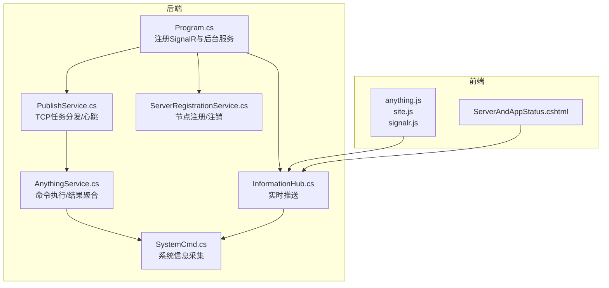
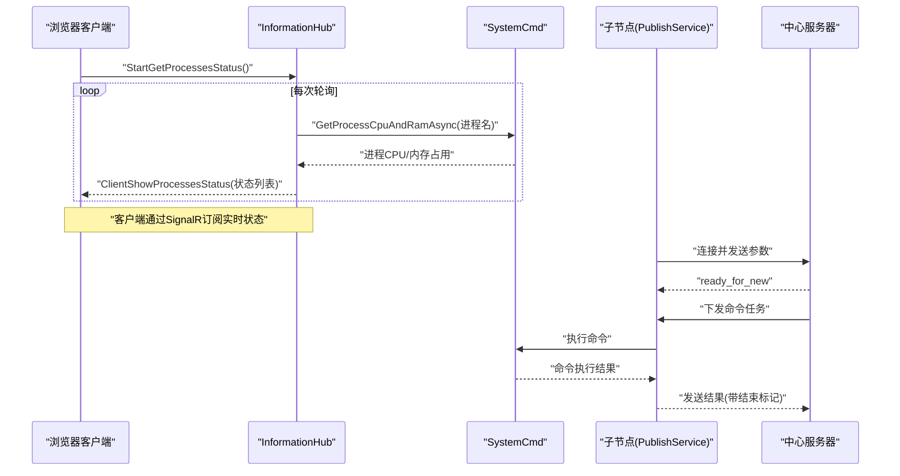
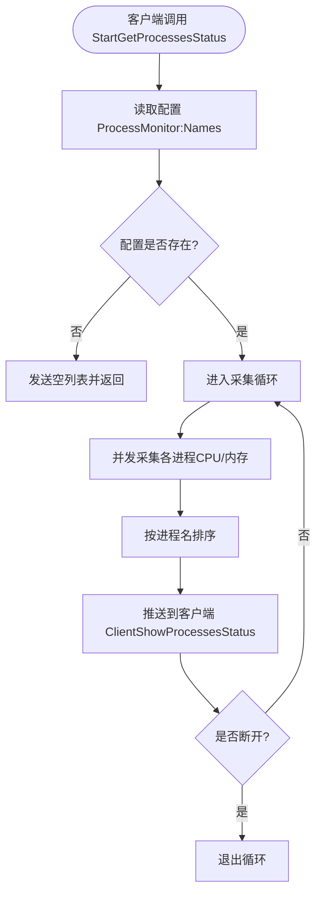
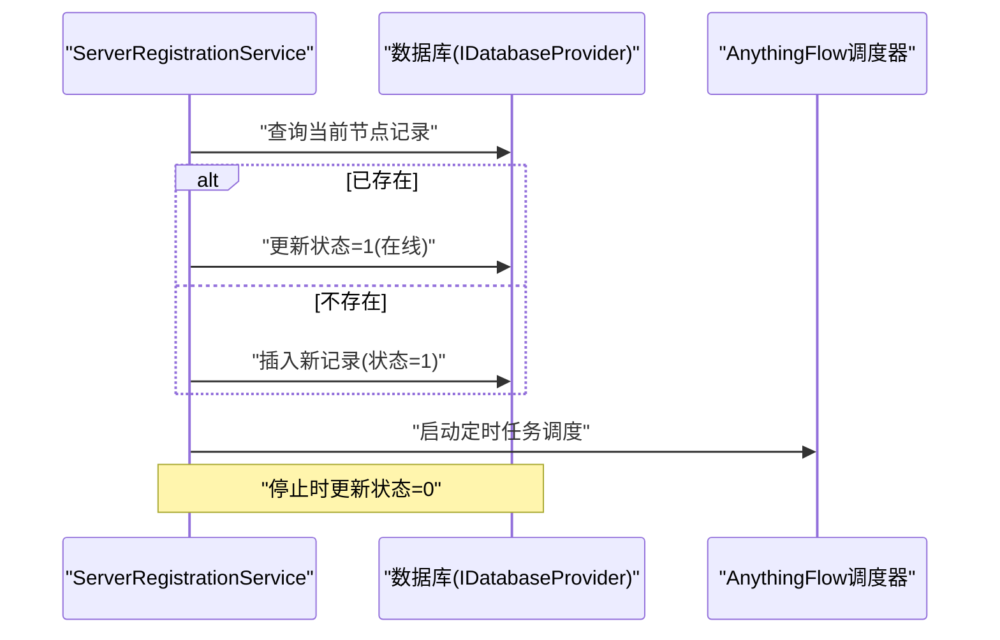
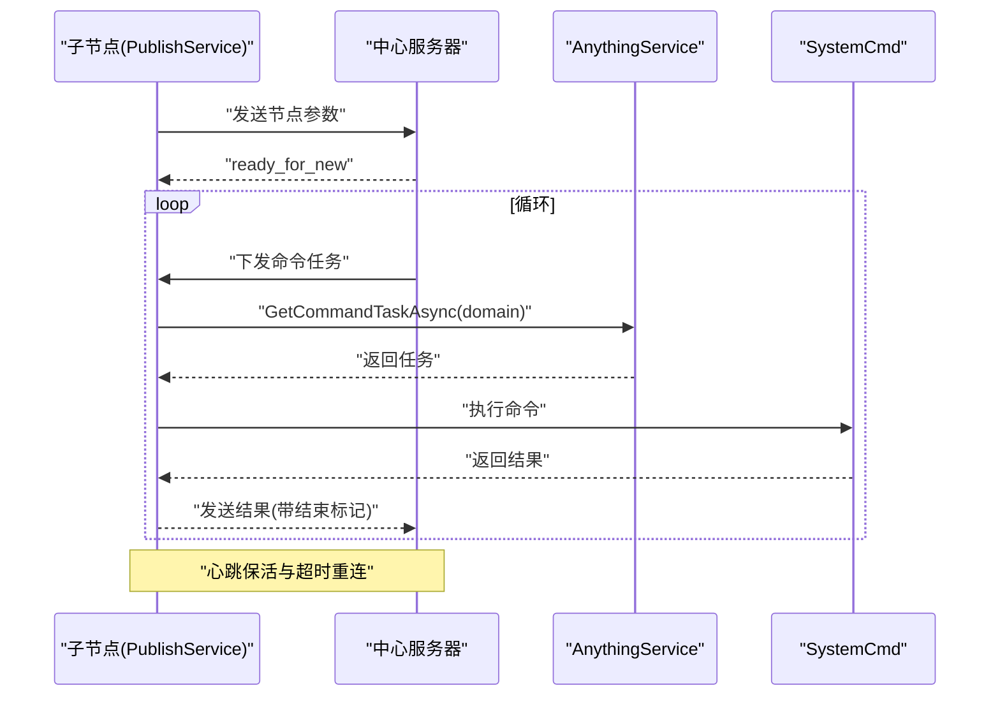
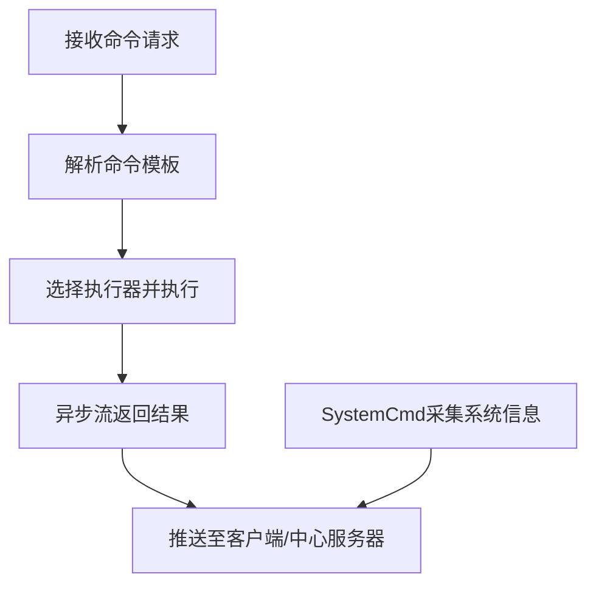
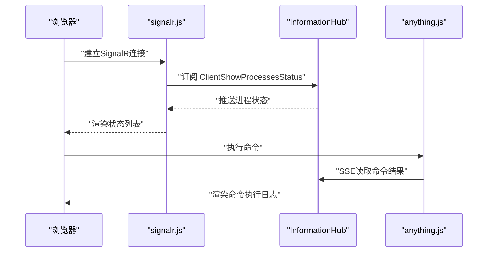
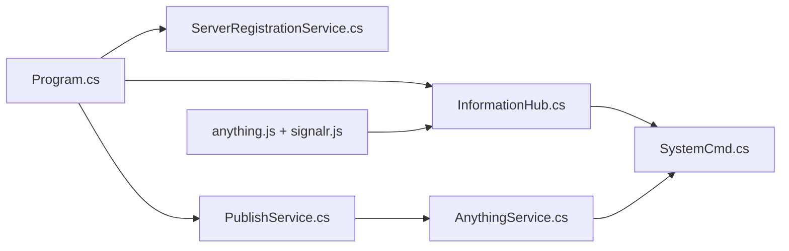

# 实时状态监控

<cite>
**本文引用的文件**
- [InformationHub.cs](file://Sylas.RemoteTasks.App/Hubs/InformationHub.cs)
- [PublishService.cs](file://Sylas.RemoteTasks.App/BackgroundServices/PublishService.cs)
- [ServerRegistrationService.cs](file://Sylas.RemoteTasks.App/BackgroundServices/ServerRegistrationService.cs)
- [AppStatus.cs](file://Sylas.RemoteTasks.Common/AppStatus.cs)
- [SystemCmd.cs](file://Sylas.RemoteTasks.Utils/CommandExecutor/SystemCmd.cs)
- [AnythingService.cs](file://Sylas.RemoteTasks.App/RemoteHostModule/Anything/AnythingService.cs)
- [Program.cs](file://Sylas.RemoteTasks.App/Program.cs)
- [anything.js](file://Sylas.RemoteTasks.App/wwwroot/js/anything.js)
- [site.js](file://Sylas.RemoteTasks.App/wwwroot/js/site.js)
- [signalr.js](file://Sylas.RemoteTasks.App/wwwroot/lib/signalr/dist/browser/signalr.js)
- [ServerAndAppStatus.cshtml](file://Sylas.RemoteTasks.App/Views/Hosts/ServerAndAppStatus.cshtml)
</cite>

## 目录
1. [简介](#简介)
2. [项目结构](#项目结构)
3. [核心组件](#核心组件)
4. [架构总览](#架构总览)
5. [详细组件分析](#详细组件分析)
6. [依赖关系分析](#依赖关系分析)
7. [性能考量](#性能考量)
8. [故障排查指南](#故障排查指南)
9. [结论](#结论)
10. [附录](#附录)

## 简介
本文件面向实时状态监控系统，系统通过 SignalR Hub 实现实时推送，结合后台服务与命令执行器，采集主机与应用状态、进程资源占用、磁盘与内存信息，并将结果以异步流形式返回至前端。系统支持中心服务器与子节点的分布式协作，通过 TCP 长连接进行任务下发与结果回传，具备心跳保活、断线重连与结果聚合能力。

## 项目结构
系统采用 ASP.NET Core + SignalR + 后台服务的组合：
- 前端：SignalR 客户端、页面脚本负责订阅推送与渲染
- 后端：SignalR Hub 负责实时推送；后台服务负责任务编排、命令执行与结果汇聚
- 命令执行：SystemCmd 提供跨平台命令执行与系统信息采集
- 服务注册：ServerRegistrationService 负责节点注册与状态变更
- 分布式：PublishService 负责与中心服务器的 TCP 通信与任务分发

**图表来源**
- [Program.cs](file://Sylas.RemoteTasks.App/Program.cs#L38-L68)
- [InformationHub.cs](file://Sylas.RemoteTasks.App/Hubs/InformationHub.cs#L11-L57)
- [ServerRegistrationService.cs](file://Sylas.RemoteTasks.App/BackgroundServices/ServerRegistrationService.cs#L26-L110)
- [PublishService.cs](file://Sylas.RemoteTasks.App/BackgroundServices/PublishService.cs#L16-L86)
- [AnythingService.cs](file://Sylas.RemoteTasks.App/RemoteHostModule/Anything/AnythingService.cs#L30-L38)
- [SystemCmd.cs](file://Sylas.RemoteTasks.Utils/CommandExecutor/SystemCmd.cs#L23-L648)

**章节来源**
- [Program.cs](file://Sylas.RemoteTasks.App/Program.cs#L38-L119)
- [InformationHub.cs](file://Sylas.RemoteTasks.App/Hubs/InformationHub.cs#L11-L57)

## 核心组件
- SignalR Hub（InformationHub）：负责向连接的客户端推送进程状态等实时信息，支持启动/停止状态采集循环
- 后台服务（ServerRegistrationService）：服务启动/停止时注册/注销节点，维护服务状态
- 分布式任务服务（PublishService）：与中心服务器建立 TCP 长连接，负责任务下发、心跳保活与结果回传
- 命令执行与系统信息（AnythingService + SystemCmd）：解析命令模板、执行命令、采集 CPU/内存/磁盘/应用运行时信息
- 前端脚本（anything.js + site.js + signalr.js）：建立 SignalR 连接、订阅推送、渲染命令执行结果与系统状态

**章节来源**
- [InformationHub.cs](file://Sylas.RemoteTasks.App/Hubs/InformationHub.cs#L13-L56)
- [ServerRegistrationService.cs](file://Sylas.RemoteTasks.App/BackgroundServices/ServerRegistrationService.cs#L55-L110)
- [PublishService.cs](file://Sylas.RemoteTasks.App/BackgroundServices/PublishService.cs#L443-L624)
- [AnythingService.cs](file://Sylas.RemoteTasks.App/RemoteHostModule/Anything/AnythingService.cs#L294-L389)
- [SystemCmd.cs](file://Sylas.RemoteTasks.Utils/CommandExecutor/SystemCmd.cs#L386-L648)
- [anything.js](file://Sylas.RemoteTasks.App/wwwroot/js/anything.js#L1-L107)

## 架构总览
系统采用“中心服务器 + 子节点”的分布式模型：
- 子节点通过 PublishService 与中心服务器建立 TCP 长连接，周期性发送心跳，接收任务并执行
- 任何节点均可通过 SignalR Hub 向客户端推送实时状态
- AnythingService 负责命令解析与执行，SystemCmd 提供系统级信息采集
- 前端通过 SignalR 客户端与 Hub 建立连接，订阅推送事件

**图表来源**
- [InformationHub.cs](file://Sylas.RemoteTasks.App/Hubs/InformationHub.cs#L14-L56)
- [SystemCmd.cs](file://Sylas.RemoteTasks.Utils/CommandExecutor/SystemCmd.cs#L386-L417)
- [PublishService.cs](file://Sylas.RemoteTasks.App/BackgroundServices/PublishService.cs#L547-L601)

## 详细组件分析

### SignalR Hub：实时状态推送
- 启动状态采集：客户端调用 Hub 方法启动采集循环，按配置读取进程名列表，异步并发采集各进程 CPU/内存
- 推送机制：每次采集完成后，按进程名排序并推送给当前连接的客户端
- 断开处理：客户端断开时设置停止标志，避免后台循环继续执行

**图表来源**
- [InformationHub.cs](file://Sylas.RemoteTasks.App/Hubs/InformationHub.cs#L14-L56)

**章节来源**
- [InformationHub.cs](file://Sylas.RemoteTasks.App/Hubs/InformationHub.cs#L13-L56)

### 后台服务：节点注册与状态维护
- 启动时：查询/创建服务节点记录，状态置为“在线”
- 停止时：将状态置为“离线”，便于运维感知
- 任务调度：基于 Cron 表达式的 AnythingFlow 定时任务，按节点域调度执行

**图表来源**
- [ServerRegistrationService.cs](file://Sylas.RemoteTasks.App/BackgroundServices/ServerRegistrationService.cs#L55-L110)
- [ServerRegistrationService.cs](file://Sylas.RemoteTasks.App/BackgroundServices/ServerRegistrationService.cs#L187-L341)

**章节来源**
- [ServerRegistrationService.cs](file://Sylas.RemoteTasks.App/BackgroundServices/ServerRegistrationService.cs#L55-L110)
- [ServerRegistrationService.cs](file://Sylas.RemoteTasks.App/BackgroundServices/ServerRegistrationService.cs#L187-L341)

### 分布式任务服务：TCP 任务分发与心跳
- 与中心服务器建立长连接，发送节点参数，接收任务并执行
- 心跳保活：定期发送心跳包，检测超时自动重连
- 结果回传：命令执行结果以 JSON 流形式发送，以结束标记分隔
- 子节点识别：通过域名与实例路径区分不同节点实例

**图表来源**
- [PublishService.cs](file://Sylas.RemoteTasks.App/BackgroundServices/PublishService.cs#L443-L624)
- [PublishService.cs](file://Sylas.RemoteTasks.App/BackgroundServices/PublishService.cs#L346-L434)
- [AnythingService.cs](file://Sylas.RemoteTasks.App/RemoteHostModule/Anything/AnythingService.cs#L399-L491)

**章节来源**
- [PublishService.cs](file://Sylas.RemoteTasks.App/BackgroundServices/PublishService.cs#L443-L624)
- [PublishService.cs](file://Sylas.RemoteTasks.App/BackgroundServices/PublishService.cs#L346-L434)
- [AnythingService.cs](file://Sylas.RemoteTasks.App/RemoteHostModule/Anything/AnythingService.cs#L399-L491)

### 命令执行与系统信息采集
- 命令执行：AnythingService 解析模板、选择执行器、执行命令并返回异步流
- 系统信息：SystemCmd 提供 CPU/内存/磁盘/应用运行时信息采集，支持跨平台
- 进程监控：并发采集多个进程的 CPU/内存占用，去抖后汇总推送

**图表来源**
- [AnythingService.cs](file://Sylas.RemoteTasks.App/RemoteHostModule/Anything/AnythingService.cs#L294-L389)
- [SystemCmd.cs](file://Sylas.RemoteTasks.Utils/CommandExecutor/SystemCmd.cs#L386-L648)

**章节来源**
- [AnythingService.cs](file://Sylas.RemoteTasks.App/RemoteHostModule/Anything/AnythingService.cs#L294-L389)
- [SystemCmd.cs](file://Sylas.RemoteTasks.Utils/CommandExecutor/SystemCmd.cs#L386-L648)

### 前端监控与可视化
- SignalR 客户端：通过 signalr.js 建立连接，订阅 Hub 事件
- 命令执行：anything.js 通过 SSE 流式读取命令执行结果，解析 JSON 并渲染
- 状态展示：ServerAndAppStatus 页面展示 CPU/内存/磁盘使用率与应用运行时信息

**图表来源**
- [signalr.js](file://Sylas.RemoteTasks.App/wwwroot/lib/signalr/dist/browser/signalr.js#L1192-L1351)
- [InformationHub.cs](file://Sylas.RemoteTasks.App/Hubs/InformationHub.cs#L14-L56)
- [anything.js](file://Sylas.RemoteTasks.App/wwwroot/js/anything.js#L1-L107)
- [ServerAndAppStatus.cshtml](file://Sylas.RemoteTasks.App/Views/Hosts/ServerAndAppStatus.cshtml#L92-L108)

**章节来源**
- [signalr.js](file://Sylas.RemoteTasks.App/wwwroot/lib/signalr/dist/browser/signalr.js#L1192-L1351)
- [anything.js](file://Sylas.RemoteTasks.App/wwwroot/js/anything.js#L1-L107)
- [ServerAndAppStatus.cshtml](file://Sylas.RemoteTasks.App/Views/Hosts/ServerAndAppStatus.cshtml#L92-L108)

## 依赖关系分析
- Program.cs 注册 SignalR、后台服务与 DI 容器，映射 Hub 路由
- InformationHub 依赖 SystemCmd 进行系统信息采集
- PublishService 依赖 AnythingService 执行命令并将结果回传
- ServerRegistrationService 依赖数据库提供者进行节点状态维护
- 前端通过 signalr.js 与 Hub 交互，anything.js 负责命令执行与结果渲染

**图表来源**
- [Program.cs](file://Sylas.RemoteTasks.App/Program.cs#L38-L119)
- [InformationHub.cs](file://Sylas.RemoteTasks.App/Hubs/InformationHub.cs#L11-L57)
- [PublishService.cs](file://Sylas.RemoteTasks.App/BackgroundServices/PublishService.cs#L16-L86)
- [AnythingService.cs](file://Sylas.RemoteTasks.App/RemoteHostModule/Anything/AnythingService.cs#L30-L38)
- [SystemCmd.cs](file://Sylas.RemoteTasks.Utils/CommandExecutor/SystemCmd.cs#L23-L648)
- [anything.js](file://Sylas.RemoteTasks.App/wwwroot/js/anything.js#L1-L107)

**章节来源**
- [Program.cs](file://Sylas.RemoteTasks.App/Program.cs#L38-L119)

## 性能考量
- 并发采集：进程状态采集采用并发 Task，提升吞吐但需注意系统负载
- 心跳保活：心跳频率与超时阈值可配置，避免频繁重连
- 结果聚合：命令结果以流式 JSON 返回，前端按结束标记聚合，减少网络往返
- 缓存策略：AnythingService 使用内存缓存优化执行器与配置解析
- I/O 优化：SystemCmd 通过临时脚本与日志文件落盘，避免长时间阻塞标准输出流

[本节为通用指导，无需具体文件引用]

## 故障排查指南
- 连接问题
  - 检查 SignalR Hub 路由映射与客户端连接状态
  - 查看 Hub 断开事件日志，确认停止标志是否正确设置
- 心跳与重连
  - PublishService 心跳发送与超时检测逻辑，确认 LastKeepAliveTime 更新
  - 若出现长时间无心跳，检查网络与防火墙策略
- 命令执行
  - 检查 AnythingService 的命令队列与结果聚合逻辑，确认结束标记
  - SystemCmd 执行异常时，查看临时脚本与日志文件
- 节点状态
  - ServerRegistrationService 启停时的状态更新，确保数据库记录正确

**章节来源**
- [InformationHub.cs](file://Sylas.RemoteTasks.App/Hubs/InformationHub.cs#L51-L56)
- [PublishService.cs](file://Sylas.RemoteTasks.App/BackgroundServices/PublishService.cs#L482-L542)
- [AnythingService.cs](file://Sylas.RemoteTasks.App/RemoteHostModule/Anything/AnythingService.cs#L440-L491)
- [ServerRegistrationService.cs](file://Sylas.RemoteTasks.App/BackgroundServices/ServerRegistrationService.cs#L100-L110)

## 结论
该系统通过 SignalR 实现实时推送，结合后台服务与命令执行器，实现了对主机与应用状态的全面监控。分布式模型下，子节点与中心服务器通过 TCP 长连接协同工作，具备心跳保活与断线重连能力。前端通过流式渲染与可视化界面，直观展示系统状态与命令执行结果。整体设计兼顾性能与可观测性，适合在多节点环境下部署与运维。

[本节为总结，无需具体文件引用]

## 附录
- 配置要点
  - ProcessMonitor:Names：进程名列表，用于状态采集
  - CenterServer/CenterServerPort：中心服务器地址与端口
  - TcpPort：子节点监听端口
- 监控指标
  - 进程 CPU/内存占用
  - 系统 CPU 使用率、内存总量/使用量/空闲率
  - 磁盘使用率与容量
  - 应用启动时间与运行时长、内存占用与占比

[本节为概览，无需具体文件引用]