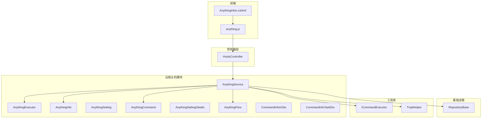
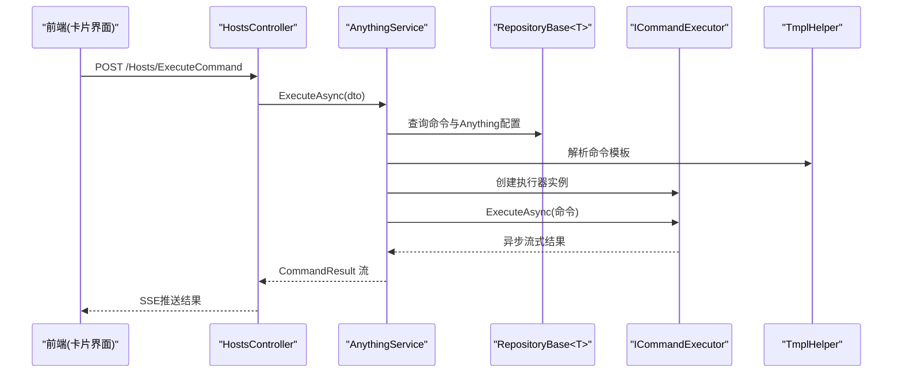
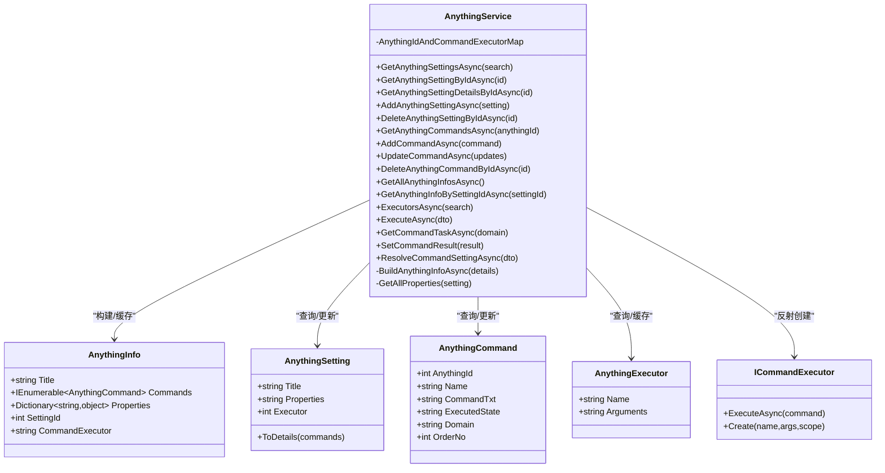
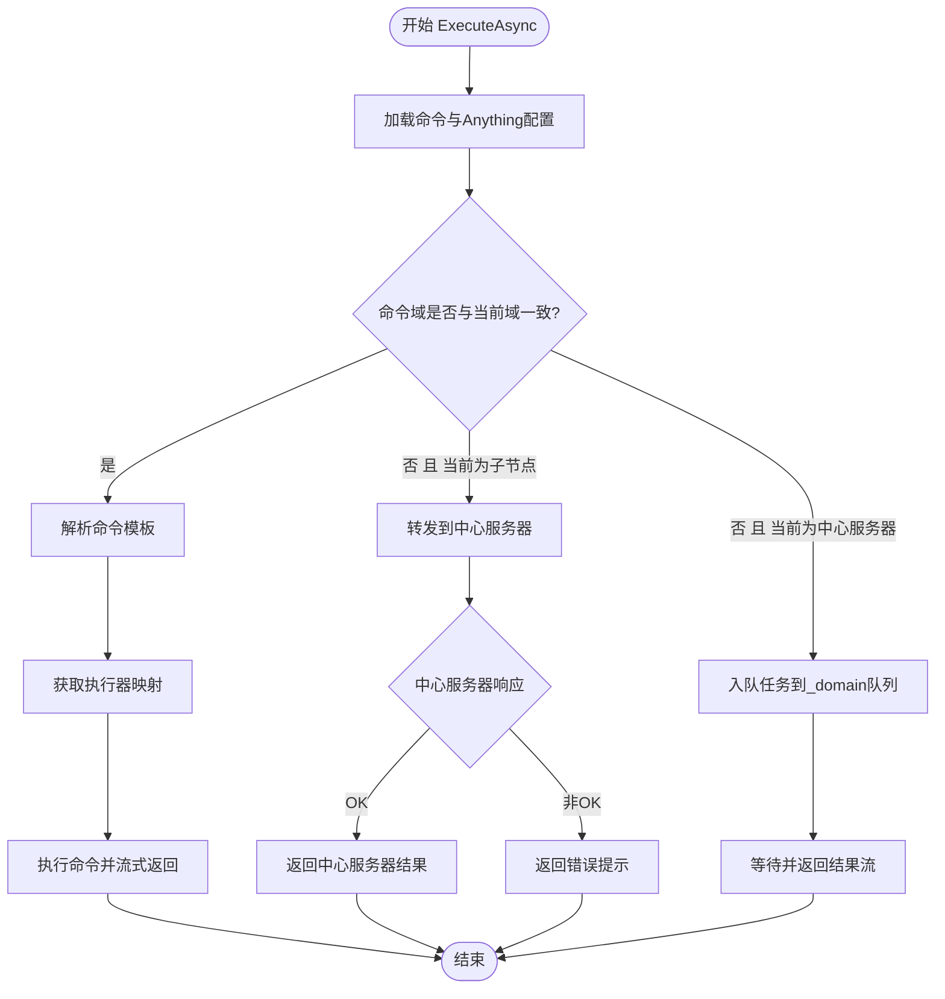
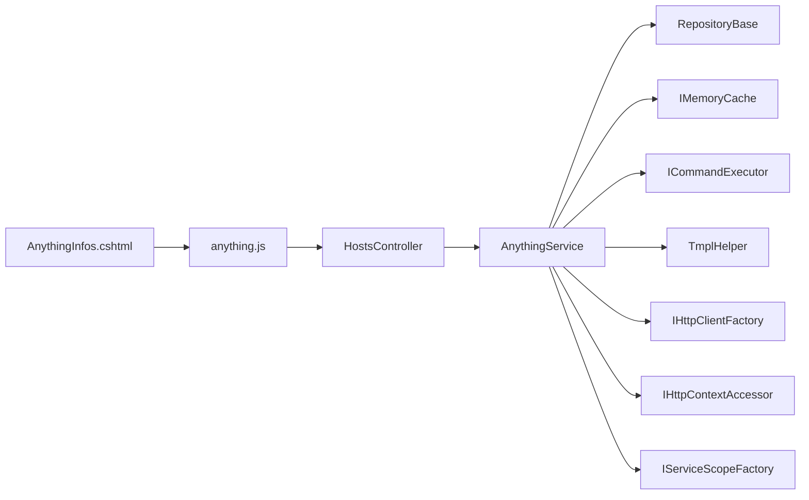
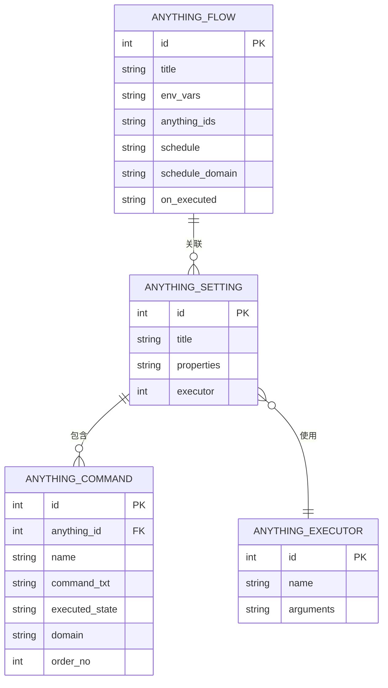

# 远程主机管理模块

<cite>
**本文档引用的文件**
- [AnythingService.cs](file://Sylas.RemoteTasks.App/RemoteHostModule/Anything/AnythingService.cs)
- [AnythingExecutor.cs](file://Sylas.RemoteTasks.App/RemoteHostModule/Anything/AnythingExecutor.cs)
- [AnythingFlow.cs](file://Sylas.RemoteTasks.App/RemoteHostModule/Anything/AnythingFlow.cs)
- [AnythingInfo.cs](file://Sylas.RemoteTasks.App/RemoteHostModule/Anything/AnythingInfo.cs)
- [AnythingSetting.cs](file://Sylas.RemoteTasks.App/RemoteHostModule/Anything/AnythingSetting.cs)
- [AnythingCommand.cs](file://Sylas.RemoteTasks.App/RemoteHostModule/Anything/AnythingCommand.cs)
- [AnythingSettingDetails.cs](file://Sylas.RemoteTasks.App/RemoteHostModule/Anything/AnythingSettingDetails.cs)
- [CommandInfoInDto.cs](file://Sylas.RemoteTasks.App/RemoteHostModule/Anything/CommandInfoInDto.cs)
- [CommandInfoTaskDto.cs](file://Sylas.RemoteTasks.App/RemoteHostModule/Anything/CommandInfoTaskDto.cs)
- [HostsController.cs](file://Sylas.RemoteTasks.App/Controllers/HostsController.cs)
- [RepositoryBase.cs](file://Sylas.RemoteTasks.App/Infrastructure/RepositoryBase.cs)
- [ICommandExecutor.cs](file://Sylas.RemoteTasks.Utils/CommandExecutor/ICommandExecutor.cs)
- [TmplHelper.cs](file://Sylas.RemoteTasks.Utils/Template/TmplHelper.cs)
- [ServerRegistrationService.cs](file://Sylas.RemoteTasks.App/BackgroundServices/ServerRegistrationService.cs)
- [anything.js](file://Sylas.RemoteTasks.App/wwwroot/js/anything.js)
- [AnythingInfos.cshtml](file://Sylas.RemoteTasks.App/Views/Hosts/AnythingInfos.cshtml)
</cite>

## 更新摘要
**所做更改**
- 更新了页面重构部分，反映 AnythingInfos 页面从传统表格布局改为卡片布局的变更
- 新增了环境变量管理集成到卡片中的说明
- 更新了前端交互部分，反映新的卡片式界面设计
- 完善了领域模型图，体现环境变量管理功能

## 目录
1. [简介](#简介)
2. [项目结构](#项目结构)
3. [核心组件](#核心组件)
4. [架构总览](#架构总览)
5. [详细组件分析](#详细组件分析)
6. [页面重构与环境变量管理](#页面重构与环境变量管理)
7. [依赖关系分析](#依赖关系分析)
8. [性能考虑](#性能考虑)
9. [故障排除指南](#故障排除指南)
10. [结论](#结论)
11. [附录](#附录)

## 简介
本模块提供"远程主机管理"能力，允许用户通过配置化的"操作对象"（Anything）与不同类型的命令执行器（如系统命令、SSH、HTTP 等）交互，实现跨主机的命令下发、执行与结果回传。核心围绕 AnythingService 展开，负责：
- Anything 配置与命令的增删改查
- Anything 配置解析为可执行的 AnythingInfo
- 命令执行（本地或跨节点）
- 任务队列与结果收集（SSE 流式返回）
- **新增**：环境变量管理集成到卡片界面中

模块采用仓储模式访问数据库，模板引擎驱动配置解析，命令执行器通过反射与依赖注入创建实例，支持扩展。

## 项目结构
远程主机管理模块位于 Sylas.RemoteTasks.App/RemoteHostModule/Anything 下，配合控制器、仓储、模板与命令执行器等组件协同工作。**页面已重构为卡片式布局**，环境变量管理集成到每个卡片中。

**图表来源**
- [AnythingService.cs](file://Sylas.RemoteTasks.App/RemoteHostModule/Anything/AnythingService.cs#L30-L680)
- [HostsController.cs](file://Sylas.RemoteTasks.App/Controllers/HostsController.cs#L19-L468)
- [RepositoryBase.cs](file://Sylas.RemoteTasks.App/Infrastructure/RepositoryBase.cs#L10-L233)
- [ICommandExecutor.cs](file://Sylas.RemoteTasks.Utils/CommandExecutor/ICommandExecutor.cs#L14-L74)
- [TmplHelper.cs](file://Sylas.RemoteTasks.Utils/Template/TmplHelper.cs#L20-L740)
- [anything.js](file://Sylas.RemoteTasks.App/wwwroot/js/anything.js#L1-L730)
- [AnythingInfos.cshtml](file://Sylas.RemoteTasks.App/Views/Hosts/AnythingInfos.cshtml#L1-L10)

**章节来源**
- [AnythingService.cs](file://Sylas.RemoteTasks.App/RemoteHostModule/Anything/AnythingService.cs#L17-L680)
- [HostsController.cs](file://Sylas.RemoteTasks.App/Controllers/HostsController.cs#L19-L468)
- [AnythingInfos.cshtml](file://Sylas.RemoteTasks.App/Views/Hosts/AnythingInfos.cshtml#L1-L10)

## 核心组件
- AnythingService：业务核心，封装 Anything 配置、命令、执行器解析与命令执行流程。
- AnythingExecutor：命令执行器元数据（名称、参数模板）。
- AnythingInfo：解析后的可执行对象，包含标题、属性、命令集合与执行器名称。
- AnythingSetting/AnythingSettingDetails：Anything 配置与命令明细。
- AnythingCommand：单条命令（名称、内容、状态查询、域、排序）。
- **新增**：AnythingFlow：环境变量管理实体，支持多 Anything 设置的环境变量配置。
- CommandInfoInDto/CommandInfoTaskDto：命令执行输入与任务队列项。
- HostsController：对外 HTTP 接口，暴露 Anything 配置、命令执行、模板解析等。
- RepositoryBase<T>：通用仓储，提供分页查询、增删改查。
- ICommandExecutor：命令执行器抽象，支持反射创建与异步流式执行。
- TmplHelper：模板解析引擎，支持表达式、集合、循环等。
- anything.js：前端交互，SSE 订阅命令执行结果。
- **新增**：AnythingInfos.cshtml：重构后的卡片式页面，集成环境变量管理。

**章节来源**
- [AnythingService.cs](file://Sylas.RemoteTasks.App/RemoteHostModule/Anything/AnythingService.cs#L30-L680)
- [AnythingExecutor.cs](file://Sylas.RemoteTasks.App/RemoteHostModule/Anything/AnythingExecutor.cs#L5-L11)
- [AnythingInfo.cs](file://Sylas.RemoteTasks.App/RemoteHostModule/Anything/AnythingInfo.cs#L9-L37)
- [AnythingSetting.cs](file://Sylas.RemoteTasks.App/RemoteHostModule/Anything/AnythingSetting.cs#L8-L33)
- [AnythingCommand.cs](file://Sylas.RemoteTasks.App/RemoteHostModule/Anything/AnythingCommand.cs#L7-L34)
- [AnythingFlow.cs](file://Sylas.RemoteTasks.App/RemoteHostModule/Anything/AnythingFlow.cs#L7-L28)
- [CommandInfoInDto.cs](file://Sylas.RemoteTasks.App/RemoteHostModule/Anything/CommandInfoInDto.cs#L3-L14)
- [CommandInfoTaskDto.cs](file://Sylas.RemoteTasks.App/RemoteHostModule/Anything/CommandInfoTaskDto.cs#L3-L18)
- [HostsController.cs](file://Sylas.RemoteTasks.App/Controllers/HostsController.cs#L19-L468)
- [RepositoryBase.cs](file://Sylas.RemoteTasks.App/Infrastructure/RepositoryBase.cs#L10-L233)
- [ICommandExecutor.cs](file://Sylas.RemoteTasks.Utils/CommandExecutor/ICommandExecutor.cs#L14-L74)
- [TmplHelper.cs](file://Sylas.RemoteTasks.Utils/Template/TmplHelper.cs#L20-L740)
- [anything.js](file://Sylas.RemoteTasks.App/wwwroot/js/anything.js#L1-L730)
- [AnythingInfos.cshtml](file://Sylas.RemoteTasks.App/Views/Hosts/AnythingInfos.cshtml#L1-L10)

## 架构总览
模块采用分层架构：
- 控制器层：HostsController 提供 REST 接口，处理 Anything 配置与命令执行。
- 业务层：AnythingService 负责配置解析、命令执行、跨节点任务调度。
- 基础设施层：RepositoryBase<T> 提供统一数据访问；MemoryCache 缓存 AnythingInfo 与执行器。
- 工具层：ICommandExecutor 抽象命令执行器；TmplHelper 解析配置模板。
- 前端层：anything.js 通过 SSE 订阅命令执行结果，实时展示。**页面重构为卡片式布局**。

**图表来源**
- [HostsController.cs](file://Sylas.RemoteTasks.App/Controllers/HostsController.cs#L85-L124)
- [AnythingService.cs](file://Sylas.RemoteTasks.App/RemoteHostModule/Anything/AnythingService.cs#L294-L389)
- [ICommandExecutor.cs](file://Sylas.RemoteTasks.Utils/CommandExecutor/ICommandExecutor.cs#L31-L71)
- [TmplHelper.cs](file://Sylas.RemoteTasks.Utils/Template/TmplHelper.cs#L461-L634)

## 详细组件分析

### AnythingService 详解
- 职责
  - Anything 配置与命令的 CRUD
  - Anything 配置解析为 AnythingInfo（含执行器、命令模板解析）
  - 命令执行（本地或跨节点）
  - 任务队列与结果收集（SSE）
- 关键方法
  - 配置查询与详情：GetAnythingSettingsAsync、GetAnythingSettingByIdAsync、GetAnythingSettingDetailsByIdAsync
  - 命令管理：GetAnythingCommandsAsync、AddCommandAsync、UpdateCommandAsync、DeleteAnythingCommandByIdAsync
  - AnythingInfo 缓存：GetAllAnythingInfosAsync、GetAnythingInfoBySettingIdAsync
  - 命令执行：ExecuteAsync（含跨节点转发与本地执行）、GetCommandTaskAsync、SetCommandResult、GetCommandResultAsync
  - 模板解析：ResolveCommandSettingAsync
  - 执行器映射：AnythingIdAndCommandExecutorMap
- 数据结构
  - AnythingInfo：标题、命令集合、属性、执行器名称
  - AnythingSetting/AnythingSettingDetails：配置与命令明细
  - AnythingCommand：命令文本、状态查询、域、排序
  - AnythingExecutor：执行器名称与参数模板
- 依赖关系
  - 仓储：RepositoryBase<AnythingSetting>、RepositoryBase<AnythingExecutor>、RepositoryBase<AnythingCommand>
  - 缓存：IMemoryCache
  - 执行器：ICommandExecutor（反射创建）
  - 模板：TmplHelper
  - HTTP：IHttpClientFactory、IHttpContextAccessor
  - 作用域：IServiceScopeFactory

**图表来源**
- [AnythingService.cs](file://Sylas.RemoteTasks.App/RemoteHostModule/Anything/AnythingService.cs#L45-L677)
- [AnythingInfo.cs](file://Sylas.RemoteTasks.App/RemoteHostModule/Anything/AnythingInfo.cs#L9-L37)
- [AnythingSetting.cs](file://Sylas.RemoteTasks.App/RemoteHostModule/Anything/AnythingSetting.cs#L8-L33)
- [AnythingCommand.cs](file://Sylas.RemoteTasks.App/RemoteHostModule/Anything/AnythingCommand.cs#L7-L34)
- [AnythingExecutor.cs](file://Sylas.RemoteTasks.App/RemoteHostModule/Anything/AnythingExecutor.cs#L5-L11)
- [ICommandExecutor.cs](file://Sylas.RemoteTasks.Utils/CommandExecutor/ICommandExecutor.cs#L14-L74)

**章节来源**
- [AnythingService.cs](file://Sylas.RemoteTasks.App/RemoteHostModule/Anything/AnythingService.cs#L45-L677)

### 命令执行流程（ExecuteAsync）
- 本地执行路径
  - 解析命令模板
  - 从缓存/映射获取执行器
  - 执行命令并流式返回结果
- 跨节点执行路径（中心服务器）
  - 若命令域与当前域不一致且当前为中心服务器：将任务入队，等待子节点拉取
  - 若命令域与当前域不一致且当前为子节点：向中心服务器转发执行请求
  - 中心服务器收到请求后，将任务入队并返回结果流

**图表来源**
- [AnythingService.cs](file://Sylas.RemoteTasks.App/RemoteHostModule/Anything/AnythingService.cs#L294-L389)
- [HostsController.cs](file://Sylas.RemoteTasks.App/Controllers/HostsController.cs#L85-L124)

**章节来源**
- [AnythingService.cs](file://Sylas.RemoteTasks.App/RemoteHostModule/Anything/AnythingService.cs#L294-L389)
- [HostsController.cs](file://Sylas.RemoteTasks.App/Controllers/HostsController.cs#L85-L124)

### AnythingInfo 构建与缓存
- BuildAnythingInfoAsync
  - 解析 Anything.Properties 为模板上下文
  - 加载执行器（缓存）并解析参数模板
  - 反射创建执行器实例，建立 AnythingId->执行器映射
  - 解析命令模板，必要时预执行状态查询命令
  - 缓存单个 AnythingInfo 与 AllAnythingInfos
- 缓存策略
  - 单个 AnythingInfo：按 SettingId 缓存，滑动过期 8 小时
  - 全量 AnythingInfo：按固定键缓存，滑动过期 8 小时

**章节来源**
- [AnythingService.cs](file://Sylas.RemoteTasks.App/RemoteHostModule/Anything/AnythingService.cs#L529-L631)
- [AnythingService.cs](file://Sylas.RemoteTasks.App/RemoteHostModule/Anything/AnythingService.cs#L255-L277)

### 模板解析（TmplHelper）
- 支持表达式解析、集合处理、循环块渲染
- 支持自定义解析器（ITmplParser），如集合拼接、选择、正则提取等
- 支持上下文自引用解析（先解析自身引用，再逐步展开）

**章节来源**
- [TmplHelper.cs](file://Sylas.RemoteTasks.Utils/Template/TmplHelper.cs#L461-L634)
- [TmplHelper.cs](file://Sylas.RemoteTasks.Utils/Template/TmplHelper.cs#L641-L719)

### 前端交互（anything.js）
- 通过 SSE 订阅 /Hosts/ExecuteCommand 的结果流
- 支持多命令批量执行、进度条识别、超时检测
- 解析命令模板、更新命令、调整命令顺序、添加/删除命令
- **页面重构后**：适配卡片式界面布局，支持环境变量面板的动态显示与隐藏

**章节来源**
- [anything.js](file://Sylas.RemoteTasks.App/wwwroot/js/anything.js#L1-L730)
- [HostsController.cs](file://Sylas.RemoteTasks.App/Controllers/HostsController.cs#L85-L158)

## 页面重构与环境变量管理

### AnythingInfos 页面重构
**更新** AnythingInfos 页面已从传统的表格布局重构为卡片式布局，提供更好的用户体验：

- **布局变更**：从表格展示改为卡片网格布局
- **交互优化**：每个 Anything 配置以独立卡片形式展示
- **环境变量集成**：环境变量编辑面板集成到卡片中，默认以"+"按钮形式显示
- **动态切换**：当前展开的 Anything 卡片对应的环境变量面板会展示并可修改

### 环境变量管理集成
**新增功能**：环境变量管理已完全集成到卡片界面中：

- **卡片内编辑**：每个 Anything 卡片内置环境变量编辑面板
- **实时应用**：修改的环境变量可直接应用到该 Anything 下的所有命令
- **默认显示**：环境变量面板默认以"+"按钮形式显示在页面右上角
- **上下文关联**：当前展开的 Anything 卡片对应的环境变量面板会自动展示

### 前端实现细节
- **容器结构**：使用 `#anythingContainer` 作为卡片渲染容器
- **模块化加载**：通过 `/js/anything.js` 以模块形式加载前端逻辑
- **响应式设计**：卡片布局支持响应式显示，适应不同屏幕尺寸

**章节来源**
- [AnythingInfos.cshtml](file://Sylas.RemoteTasks.App/Views/Hosts/AnythingInfos.cshtml#L1-L10)

## 依赖关系分析
- AnythingService 依赖
  - RepositoryBase<T>：AnythingSetting、AnythingExecutor、AnythingCommand 的数据访问
  - IMemoryCache：AnythingInfo 与执行器元数据缓存
  - ICommandExecutor：命令执行器抽象与反射创建
  - TmplHelper：配置与命令模板解析
  - IHttpClientFactory/IHttpContextAccessor：跨节点转发与鉴权头传递
  - IServiceScopeFactory：执行器实例化的作用域控制
- 控制器依赖
  - HostsController 依赖 AnythingService 提供的业务能力
- 前端依赖
  - anything.js 依赖 HostsController 的 SSE 接口
  - **新增**：AnythingInfos.cshtml 依赖 anything.js 进行卡片渲染

**图表来源**
- [AnythingService.cs](file://Sylas.RemoteTasks.App/RemoteHostModule/Anything/AnythingService.cs#L30-L680)
- [HostsController.cs](file://Sylas.RemoteTasks.App/Controllers/HostsController.cs#L19-L468)
- [anything.js](file://Sylas.RemoteTasks.App/wwwroot/js/anything.js#L1-L730)
- [AnythingInfos.cshtml](file://Sylas.RemoteTasks.App/Views/Hosts/AnythingInfos.cshtml#L1-L10)

**章节来源**
- [AnythingService.cs](file://Sylas.RemoteTasks.App/RemoteHostModule/Anything/AnythingService.cs#L30-L680)
- [HostsController.cs](file://Sylas.RemoteTasks.App/Controllers/HostsController.cs#L19-L468)

## 性能考虑
- 缓存策略
  - AnythingInfo 全量与单个缓存，减少重复解析与查询
  - 执行器元数据缓存，避免频繁查询
- 异步流式执行
  - 命令执行返回 IAsyncEnumerable<CommandResult>，前端可边收边显
- 数据库访问
  - RepositoryBase<T> 统一分页查询与参数化更新，减少 SQL 拼接
- 跨节点通信
  - 使用队列与 SSE，避免阻塞等待
- **页面性能优化**
  - **新增**：卡片式布局减少 DOM 操作，提升渲染性能
  - **新增**：环境变量面板懒加载，仅在需要时初始化
- 建议
  - 对高频命令可增加执行器实例池
  - 对模板复杂度进行限制，避免过度解析

## 故障排除指南
- 命令执行无返回
  - 检查中心服务器队列是否正确入队与出队
  - 确认前端 SSE 是否正常订阅
- 身份认证失败
  - 确认前端是否携带 Bearer Token
  - 检查中心服务器转发时是否透传授权头
- 模板解析异常
  - 检查 Anything.Properties 是否完整
  - 确认模板表达式是否符合语法
- 命令状态查询无效
  - 确认 ExecutedState 命令是否能正确返回状态文本
- 跨节点执行失败
  - 确认命令 Domain 与当前节点域一致
  - 检查中心服务器任务队列是否存在
- **页面显示问题**
  - **新增**：检查 anything.js 是否正确加载
  - **新增**：确认 #anythingContainer 容器是否存在
  - **新增**：验证卡片渲染逻辑是否正常执行

**章节来源**
- [AnythingService.cs](file://Sylas.RemoteTasks.App/RemoteHostModule/Anything/AnythingService.cs#L336-L373)
- [HostsController.cs](file://Sylas.RemoteTasks.App/Controllers/HostsController.cs#L85-L124)
- [anything.js](file://Sylas.RemoteTasks.App/wwwroot/js/anything.js#L17-L107)
- [AnythingInfos.cshtml](file://Sylas.RemoteTasks.App/Views/Hosts/AnythingInfos.cshtml#L1-L10)

## 结论
AnythingService 是远程主机管理模块的核心，通过配置化 Anything、模板解析与可插拔的命令执行器，实现了灵活、可扩展的跨主机命令执行能力。**最新更新**包括页面重构为卡片式布局和环境变量管理集成，进一步提升了用户体验。结合缓存、异步流式执行与前端 SSE，提供了良好的用户体验与性能表现。建议在生产环境中关注模板复杂度、执行器实例化成本与跨节点通信稳定性。

## 附录

### API 一览（来自控制器）
- GET /Hosts/AnythingSettings：分页查询 Anything 配置
- GET /Hosts/AnythingSettingAndInfo：获取配置与解析后的 AnythingInfo
- GET /Hosts/Executors：查询命令执行器列表
- POST /Hosts/ExecuteCommand：执行命令（SSE）
- POST /Hosts/ExecuteCommands：批量执行命令（SSE）
- POST /Hosts/AddAnythingSetting：新增 Anything 配置
- POST /Hosts/UpdateAnythingSetting：更新 Anything 配置
- POST /Hosts/UpdateCommand：更新命令
- POST /Hosts/DeleteAnythingSettingById：删除 Anything 配置
- POST /Hosts/DeleteAnythingCommandById：删除命令
- POST /Hosts/AddCommand：为 Anything 添加命令
- POST /Hosts/ResolveCommandSettting：解析命令模板

**章节来源**
- [HostsController.cs](file://Sylas.RemoteTasks.App/Controllers/HostsController.cs#L32-L468)

### 领域模型图
**更新**：增加了环境变量管理相关的 AnythingFlow 实体

**图表来源**
- [AnythingSetting.cs](file://Sylas.RemoteTasks.App/RemoteHostModule/Anything/AnythingSetting.cs#L8-L33)
- [AnythingCommand.cs](file://Sylas.RemoteTasks.App/RemoteHostModule/Anything/AnythingCommand.cs#L7-L34)
- [AnythingExecutor.cs](file://Sylas.RemoteTasks.App/RemoteHostModule/Anything/AnythingExecutor.cs#L5-L11)
- [AnythingFlow.cs](file://Sylas.RemoteTasks.App/RemoteHostModule/Anything/AnythingFlow.cs#L7-L28)

### 页面重构说明
**新增章节**：详细说明页面重构的具体变更

- **布局变更**：从传统的表格布局迁移到卡片式网格布局
- **交互改进**：每个 Anything 配置以独立卡片展示，支持展开/折叠
- **环境变量集成**：环境变量编辑面板集成到卡片中，支持实时编辑
- **响应式设计**：适配不同屏幕尺寸，移动端友好
- **性能优化**：减少 DOM 操作，提升页面渲染性能

**章节来源**
- [AnythingInfos.cshtml](file://Sylas.RemoteTasks.App/Views/Hosts/AnythingInfos.cshtml#L1-L10)