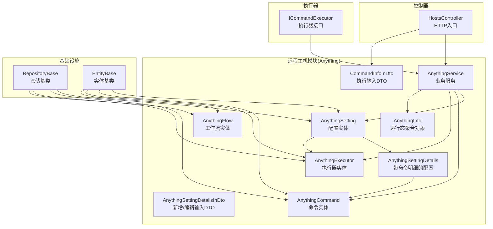
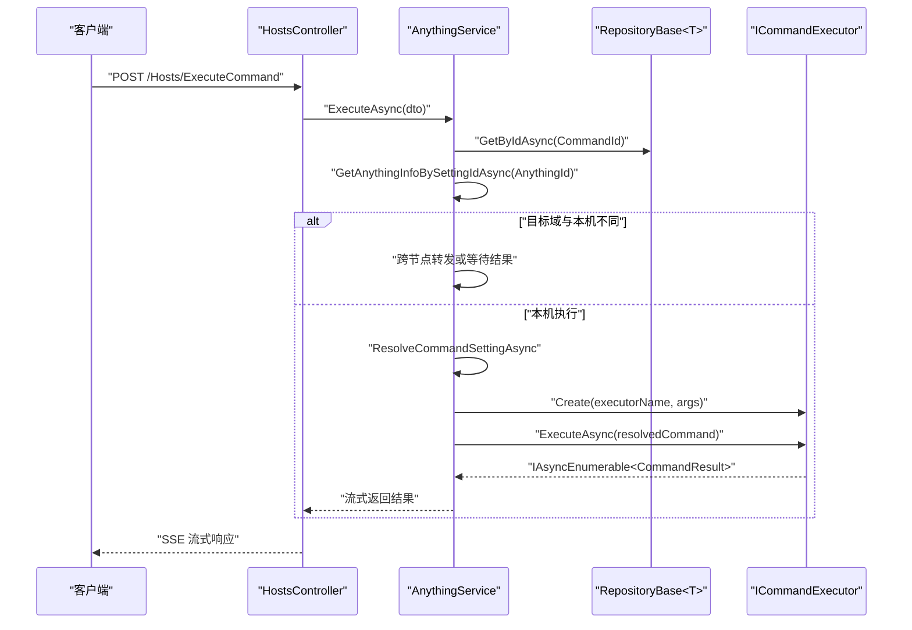
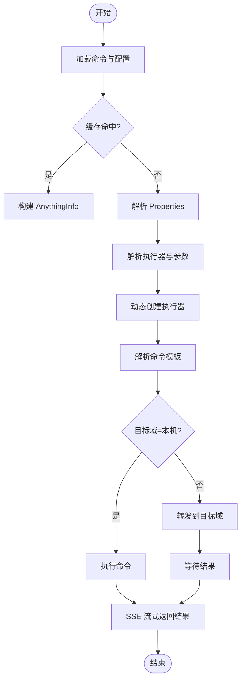
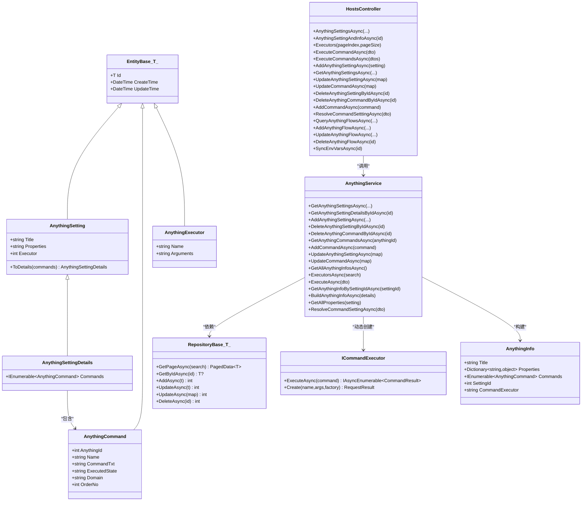

# 配置管理

<cite>
**本文引用的文件**
- [AnythingSettingDetailsInDto.cs](file://Sylas.RemoteTasks.App/RemoteHostModule/Anything/AnythingSettingDetailsInDto.cs)
- [CommandInfoInDto.cs](file://Sylas.RemoteTasks.App/RemoteHostModule/Anything/CommandInfoInDto.cs)
- [AnythingSetting.cs](file://Sylas.RemoteTasks.App/RemoteHostModule/Anything/AnythingSetting.cs)
- [AnythingSettingDetails.cs](file://Sylas.RemoteTasks.App/RemoteHostModule/Anything/AnythingSettingDetails.cs)
- [AnythingExecutor.cs](file://Sylas.RemoteTasks.App/RemoteHostModule/Anything/AnythingExecutor.cs)
- [AnythingCommand.cs](file://Sylas.RemoteTasks.App/RemoteHostModule/Anything/AnythingCommand.cs)
- [AnythingInfo.cs](file://Sylas.RemoteTasks.App/RemoteHostModule/Anything/AnythingInfo.cs)
- [AnythingService.cs](file://Sylas.RemoteTasks.App/RemoteHostModule/Anything/AnythingService.cs)
- [AnythingFlow.cs](file://Sylas.RemoteTasks.App/RemoteHostModule/Anything/AnythingFlow.cs)
- [RepositoryBase.cs](file://Sylas.RemoteTasks.App/Infrastructure/RepositoryBase.cs)
- [EntityBase.cs](file://Sylas.RemoteTasks.Database/EntityBase.cs)
- [ICommandExecutor.cs](file://Sylas.RemoteTasks.Utils/CommandExecutor/ICommandExecutor.cs)
- [HostsController.cs](file://Sylas.RemoteTasks.App/Controllers/HostsController.cs)
- [DbConnectionInfoInDto.cs](file://Sylas.RemoteTasks.App/DatabaseManager/Models/Dtos/DbConnectionInfoInDto.cs)
</cite>

## 目录
1. [简介](#简介)
2. [项目结构](#项目结构)
3. [核心组件](#核心组件)
4. [架构总览](#架构总览)
5. [组件详解](#组件详解)
6. [依赖关系分析](#依赖关系分析)
7. [性能与扩展性](#性能与扩展性)
8. [故障排查指南](#故障排查指南)
9. [结论](#结论)
10. [附录：常用操作流程与示例路径](#附录常用操作流程与示例路径)

## 简介
本文件系统性阐述“配置管理系统”的设计与实现，聚焦于“Anything”配置体系：配置项定义、DTO 转换、验证与持久化、与执行器/命令的关系与依赖、以及跨节点命令执行与结果回传机制。文档以真实代码为依据，提供面向初学者的循序讲解与面向资深开发者的深度分析。

## 项目结构
围绕“配置管理”，核心代码分布在以下模块：
- 远程主机模块（Anything）：配置实体、DTO、服务与控制器
- 基础设施层（RepositoryBase）：统一的仓储与分页查询
- 数据库基础（EntityBase）：实体基类与通用字段
- 命令执行器接口（ICommandExecutor）：动态创建与调用执行器
- 控制器入口（HostsController）：对外暴露配置与执行 API
- 其他配置示例（DbConnectionInfoInDto）：说明 DTO 到实体映射模式

图表来源
- [AnythingSetting.cs](file://Sylas.RemoteTasks.App/RemoteHostModule/Anything/AnythingSetting.cs#L8-L32)
- [AnythingSettingDetails.cs](file://Sylas.RemoteTasks.App/RemoteHostModule/Anything/AnythingSettingDetails.cs#L3-L9)
- [AnythingSettingDetailsInDto.cs](file://Sylas.RemoteTasks.App/RemoteHostModule/Anything/AnythingSettingDetailsInDto.cs#L3-L30)
- [AnythingCommand.cs](file://Sylas.RemoteTasks.App/RemoteHostModule/Anything/AnythingCommand.cs#L6-L33)
- [AnythingExecutor.cs](file://Sylas.RemoteTasks.App/RemoteHostModule/Anything/AnythingExecutor.cs#L5-L10)
- [AnythingInfo.cs](file://Sylas.RemoteTasks.App/RemoteHostModule/Anything/AnythingInfo.cs#L9-L36)
- [AnythingService.cs](file://Sylas.RemoteTasks.App/RemoteHostModule/Anything/AnythingService.cs#L30-L38)
- [CommandInfoInDto.cs](file://Sylas.RemoteTasks.App/RemoteHostModule/Anything/CommandInfoInDto.cs#L3-L14)
- [AnythingFlow.cs](file://Sylas.RemoteTasks.App/RemoteHostModule/Anything/AnythingFlow.cs#L6-L27)
- [RepositoryBase.cs](file://Sylas.RemoteTasks.App/Infrastructure/RepositoryBase.cs#L10-L193)
- [EntityBase.cs](file://Sylas.RemoteTasks.Database/EntityBase.cs#L9-L31)
- [ICommandExecutor.cs](file://Sylas.RemoteTasks.Utils/CommandExecutor/ICommandExecutor.cs#L14-L71)
- [HostsController.cs](file://Sylas.RemoteTasks.App/Controllers/HostsController.cs#L19-L467)

章节来源
- [HostsController.cs](file://Sylas.RemoteTasks.App/Controllers/HostsController.cs#L19-L467)
- [RepositoryBase.cs](file://Sylas.RemoteTasks.App/Infrastructure/RepositoryBase.cs#L10-L193)
- [EntityBase.cs](file://Sylas.RemoteTasks.Database/EntityBase.cs#L9-L31)

## 核心组件
- AnythingSetting：配置实体，包含标题、自定义属性、执行器标识等
- AnythingSettingDetails：在配置基础上附加命令集合
- AnythingSettingDetailsInDto：新增/编辑配置时的输入 DTO，提供 ToAnythingSetting 映射
- AnythingCommand：命令实体，包含命令文本、状态查询、域、排序等
- AnythingExecutor：执行器实体，包含名称与参数模板
- AnythingInfo：运行态聚合对象，包含解析后的属性、命令与执行器名称
- AnythingService：核心业务服务，负责配置与命令的增删改查、模板解析、执行器装配、跨节点执行与结果回传
- RepositoryBase<T>：泛型仓储，封装分页查询、新增、更新、删除
- EntityBase<T>：实体基类，统一 Id、CreateTime、UpdateTime
- ICommandExecutor：执行器接口，支持按名称动态创建执行器实例
- HostsController：HTTP 入口，提供配置查询、执行命令、工作流管理等 API
- CommandInfoInDto：执行命令时的输入 DTO，包含命令 Id 与执行编号
- AnythingFlow：工作流实体，串联多个配置节点

章节来源
- [AnythingSetting.cs](file://Sylas.RemoteTasks.App/RemoteHostModule/Anything/AnythingSetting.cs#L8-L32)
- [AnythingSettingDetails.cs](file://Sylas.RemoteTasks.App/RemoteHostModule/Anything/AnythingSettingDetails.cs#L3-L9)
- [AnythingSettingDetailsInDto.cs](file://Sylas.RemoteTasks.App/RemoteHostModule/Anything/AnythingSettingDetailsInDto.cs#L3-L30)
- [AnythingCommand.cs](file://Sylas.RemoteTasks.App/RemoteHostModule/Anything/AnythingCommand.cs#L6-L33)
- [AnythingExecutor.cs](file://Sylas.RemoteTasks.App/RemoteHostModule/Anything/AnythingExecutor.cs#L5-L10)
- [AnythingInfo.cs](file://Sylas.RemoteTasks.App/RemoteHostModule/Anything/AnythingInfo.cs#L9-L36)
- [AnythingService.cs](file://Sylas.RemoteTasks.App/RemoteHostModule/Anything/AnythingService.cs#L30-L38)
- [RepositoryBase.cs](file://Sylas.RemoteTasks.App/Infrastructure/RepositoryBase.cs#L10-L193)
- [EntityBase.cs](file://Sylas.RemoteTasks.Database/EntityBase.cs#L9-L31)
- [ICommandExecutor.cs](file://Sylas.RemoteTasks.Utils/CommandExecutor/ICommandExecutor.cs#L14-L71)
- [HostsController.cs](file://Sylas.RemoteTasks.App/Controllers/HostsController.cs#L19-L467)
- [CommandInfoInDto.cs](file://Sylas.RemoteTasks.App/RemoteHostModule/Anything/CommandInfoInDto.cs#L3-L14)
- [AnythingFlow.cs](file://Sylas.RemoteTasks.App/RemoteHostModule/Anything/AnythingFlow.cs#L6-L27)

## 架构总览
配置管理采用“实体-服务-仓储-控制器”的分层架构：
- 实体层：AnythingSetting/Details/Command/Executor/Flow
- DTO 层：AnythingSettingDetailsInDto、CommandInfoInDto 等
- 服务层：AnythingService 负责业务编排、模板解析、执行器装配、跨节点执行
- 基础设施：RepositoryBase 提供统一 CRUD 与分页能力
- 控制器：HostsController 暴露 HTTP 接口，处理请求与响应流式输出
- 执行器：ICommandExecutor 动态创建具体执行器，统一异步枚举结果

图表来源
- [HostsController.cs](file://Sylas.RemoteTasks.App/Controllers/HostsController.cs#L85-L124)
- [AnythingService.cs](file://Sylas.RemoteTasks.App/RemoteHostModule/Anything/AnythingService.cs#L294-L389)
- [ICommandExecutor.cs](file://Sylas.RemoteTasks.Utils/CommandExecutor/ICommandExecutor.cs#L31-L71)

## 组件详解

### 1) 配置定义与 DTO 映射
- AnythingSettingDetailsInDto：用于新增/编辑配置，提供 Title、Commands、Properties、Executor 字段，并通过 ToAnythingSetting 映射为 AnythingSetting 实体
- AnythingSetting/AnythingSettingDetails：配置实体与明细实体，明细实体在配置基础上附加 Commands
- 与仓储配合：RepositoryBase<T> 支持分页查询、新增、更新、删除；EntityBase<T> 统一时间戳字段

章节来源
- [AnythingSettingDetailsInDto.cs](file://Sylas.RemoteTasks.App/RemoteHostModule/Anything/AnythingSettingDetailsInDto.cs#L3-L30)
- [AnythingSetting.cs](file://Sylas.RemoteTasks.App/RemoteHostModule/Anything/AnythingSetting.cs#L8-L32)
- [AnythingSettingDetails.cs](file://Sylas.RemoteTasks.App/RemoteHostModule/Anything/AnythingSettingDetails.cs#L3-L9)
- [RepositoryBase.cs](file://Sylas.RemoteTasks.App/Infrastructure/RepositoryBase.cs#L20-L193)
- [EntityBase.cs](file://Sylas.RemoteTasks.Database/EntityBase.cs#L9-L31)

### 2) 命令与执行器
- AnythingCommand：命令实体，包含命令文本、状态查询、域、排序等
- AnythingExecutor：执行器实体，包含名称与参数模板（JSON 数组）
- AnythingInfo：运行态聚合对象，包含解析后的属性、命令与执行器名称
- ICommandExecutor：接口支持按名称动态创建执行器实例，统一异步枚举结果

章节来源
- [AnythingCommand.cs](file://Sylas.RemoteTasks.App/RemoteHostModule/Anything/AnythingCommand.cs#L6-L33)
- [AnythingExecutor.cs](file://Sylas.RemoteTasks.App/RemoteHostModule/Anything/AnythingExecutor.cs#L5-L10)
- [AnythingInfo.cs](file://Sylas.RemoteTasks.App/RemoteHostModule/Anything/AnythingInfo.cs#L9-L36)
- [ICommandExecutor.cs](file://Sylas.RemoteTasks.Utils/CommandExecutor/ICommandExecutor.cs#L14-L71)

### 3) 业务服务：AnythingService
- 配置与命令管理：分页查询、新增、删除、更新、批量删除命令
- 缓存策略：内存缓存 AllAnythingInfos 与单条 AnythingInfo，以及执行器缓存
- 模板解析：基于 Properties 解析命令模板与执行器参数
- 执行器装配：根据 Executor 或默认 SystemCmd 动态创建执行器
- 跨节点执行：当命令域与本机不一致时，中心服务器转发或等待结果
- 结果回传：通过静态队列与 SSE 流式返回命令执行结果

图表来源
- [AnythingService.cs](file://Sylas.RemoteTasks.App/RemoteHostModule/Anything/AnythingService.cs#L255-L631)

章节来源
- [AnythingService.cs](file://Sylas.RemoteTasks.App/RemoteHostModule/Anything/AnythingService.cs#L30-L679)

### 4) 控制器：HostsController
- 提供配置查询、执行命令、执行多命令、新增/更新/删除配置与命令、解析命令模板、工作流管理等 API
- 执行命令采用 Server-Sent Events（SSE）流式返回结果，支持取消与结束标记

章节来源
- [HostsController.cs](file://Sylas.RemoteTasks.App/Controllers/HostsController.cs#L19-L467)

### 5) 工作流：AnythingFlow
- 用于串联多个配置节点，支持环境变量同步、重排、增删节点等操作

章节来源
- [AnythingFlow.cs](file://Sylas.RemoteTasks.App/RemoteHostModule/Anything/AnythingFlow.cs#L6-L27)
- [HostsController.cs](file://Sylas.RemoteTasks.App/Controllers/HostsController.cs#L291-L465)

### 6) 验证与持久化
- DTO 到实体映射：例如 DbConnectionInfoInDto 提供 ToEntity 映射，体现一致的映射模式
- 仓储更新：RepositoryBase<T>.UpdateAsync 支持按字段选择性更新，自动处理 updateTime

章节来源
- [DbConnectionInfoInDto.cs](file://Sylas.RemoteTasks.App/DatabaseManager/Models/Dtos/DbConnectionInfoInDto.cs#L6-L33)
- [RepositoryBase.cs](file://Sylas.RemoteTasks.App/Infrastructure/RepositoryBase.cs#L129-L181)

## 依赖关系分析

图表来源
- [EntityBase.cs](file://Sylas.RemoteTasks.Database/EntityBase.cs#L9-L31)
- [AnythingSetting.cs](file://Sylas.RemoteTasks.App/RemoteHostModule/Anything/AnythingSetting.cs#L8-L32)
- [AnythingSettingDetails.cs](file://Sylas.RemoteTasks.App/RemoteHostModule/Anything/AnythingSettingDetails.cs#L3-L9)
- [AnythingCommand.cs](file://Sylas.RemoteTasks.App/RemoteHostModule/Anything/AnythingCommand.cs#L6-L33)
- [AnythingExecutor.cs](file://Sylas.RemoteTasks.App/RemoteHostModule/Anything/AnythingExecutor.cs#L5-L10)
- [AnythingInfo.cs](file://Sylas.RemoteTasks.App/RemoteHostModule/Anything/AnythingInfo.cs#L9-L36)
- [RepositoryBase.cs](file://Sylas.RemoteTasks.App/Infrastructure/RepositoryBase.cs#L10-L193)
- [ICommandExecutor.cs](file://Sylas.RemoteTasks.Utils/CommandExecutor/ICommandExecutor.cs#L14-L71)
- [AnythingService.cs](file://Sylas.RemoteTasks.App/RemoteHostModule/Anything/AnythingService.cs#L30-L38)
- [HostsController.cs](file://Sylas.RemoteTasks.App/Controllers/HostsController.cs#L19-L467)

## 性能与扩展性
- 缓存策略
  - 内存缓存：AllAnythingInfos、单条 AnythingInfo、执行器对象，滑动过期，降低重复解析与查询成本
  - 建议：对高频访问的配置与执行器增加缓存预热，避免冷启动抖动
- 异步与流式
  - 命令执行返回 IAsyncEnumerable<CommandResult>，结合 SSE 流式输出，提升交互体验
  - 建议：客户端侧合理拆分事件消息，避免一次性接收过多数据
- 跨节点执行
  - 中心服务器维护队列，子节点轮询任务；注意队列容量与超时控制
  - 建议：引入背压与限流，防止队列积压导致延迟放大
- 仓储更新
  - 支持按字段选择性更新，减少不必要的字段写入
  - 建议：对热点字段建立索引，优化查询与更新性能

[本节为通用建议，无需特定文件引用]

## 故障排查指南
- 执行器创建失败
  - 现象：抛出“无法解析命令执行器”或“命令执行者返回的不是正确的命令结果类型”
  - 排查：确认执行器名称正确、参数模板 JSON 可序列化、实现符合约定
  - 参考
    - [ICommandExecutor.cs](file://Sylas.RemoteTasks.Utils/CommandExecutor/ICommandExecutor.cs#L31-L71)
    - [AnythingService.cs](file://Sylas.RemoteTasks.App/RemoteHostModule/Anything/AnythingService.cs#L578-L590)
- 命令域不一致导致的跨节点问题
  - 现象：需要转发到中心服务器或子节点，若授权失败或请求失败会返回错误
  - 排查：检查 Authorization 头、中心服务器地址、目标域一致性
  - 参考
    - [AnythingService.cs](file://Sylas.RemoteTasks.App/RemoteHostModule/Anything/AnythingService.cs#L303-L373)
    - [HostsController.cs](file://Sylas.RemoteTasks.App/Controllers/HostsController.cs#L85-L124)
- 命令解析异常
  - 现象：解析命令模板返回空值或异常
  - 排查：确认 Properties 完整、模板表达式合法
  - 参考
    - [AnythingService.cs](file://Sylas.RemoteTasks.App/RemoteHostModule/Anything/AnythingService.cs#L663-L677)
- 缓存不一致
  - 现象：更新配置或命令后，缓存未刷新导致读取旧数据
  - 排查：检查缓存键与失效策略，必要时主动清理
  - 参考
    - [AnythingService.cs](file://Sylas.RemoteTasks.App/RemoteHostModule/Anything/AnythingService.cs#L125-L143)
    - [AnythingService.cs](file://Sylas.RemoteTasks.App/RemoteHostModule/Anything/AnythingService.cs#L229-L246)
    - [AnythingService.cs](file://Sylas.RemoteTasks.App/RemoteHostModule/Anything/AnythingService.cs#L508-L521)

章节来源
- [ICommandExecutor.cs](file://Sylas.RemoteTasks.Utils/CommandExecutor/ICommandExecutor.cs#L31-L71)
- [AnythingService.cs](file://Sylas.RemoteTasks.App/RemoteHostModule/Anything/AnythingService.cs#L294-L491)
- [HostsController.cs](file://Sylas.RemoteTasks.App/Controllers/HostsController.cs#L85-L124)

## 结论
本配置管理系统以“配置-命令-执行器”为核心，通过 DTO 映射、模板解析、动态执行器装配与跨节点执行机制，实现了灵活、可扩展的远程任务编排。依托仓储与缓存策略，系统在易用性与性能之间取得平衡。建议在生产环境中完善监控与告警、缓存预热与失效策略、以及跨节点的可观测性与限流保护。

[本节为总结，无需特定文件引用]

## 附录：常用操作流程与示例路径

- 新增配置并映射为实体
  - 示例路径
    - [AnythingSettingDetailsInDto.cs](file://Sylas.RemoteTasks.App/RemoteHostModule/Anything/AnythingSettingDetailsInDto.cs#L21-L29)
    - [AnythingSetting.cs](file://Sylas.RemoteTasks.App/RemoteHostModule/Anything/AnythingSetting.cs#L21-L31)
- 查询配置详情与命令明细
  - 示例路径
    - [AnythingService.cs](file://Sylas.RemoteTasks.App/RemoteHostModule/Anything/AnythingService.cs#L68-L76)
    - [RepositoryBase.cs](file://Sylas.RemoteTasks.App/Infrastructure/RepositoryBase.cs#L20-L25)
- 执行命令（含跨节点）
  - 示例路径
    - [HostsController.cs](file://Sylas.RemoteTasks.App/Controllers/HostsController.cs#L85-L124)
    - [AnythingService.cs](file://Sylas.RemoteTasks.App/RemoteHostModule/Anything/AnythingService.cs#L294-L389)
- 解析命令模板
  - 示例路径
    - [AnythingService.cs](file://Sylas.RemoteTasks.App/RemoteHostModule/Anything/AnythingService.cs#L663-L677)
- 更新命令并刷新缓存
  - 示例路径
    - [AnythingService.cs](file://Sylas.RemoteTasks.App/RemoteHostModule/Anything/AnythingService.cs#L214-L246)
- 工作流管理（增删改查、重排、环境变量同步）
  - 示例路径
    - [HostsController.cs](file://Sylas.RemoteTasks.App/Controllers/HostsController.cs#L301-L368)
    - [HostsController.cs](file://Sylas.RemoteTasks.App/Controllers/HostsController.cs#L425-L465)