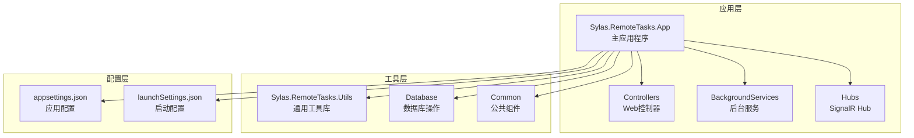
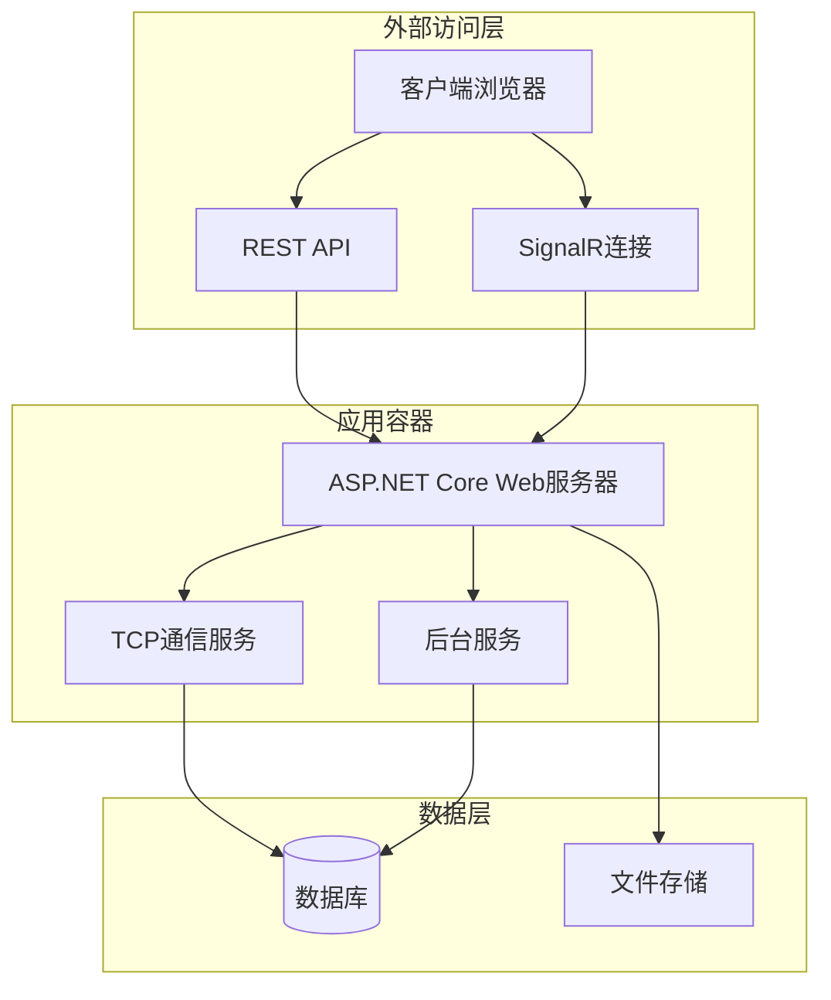
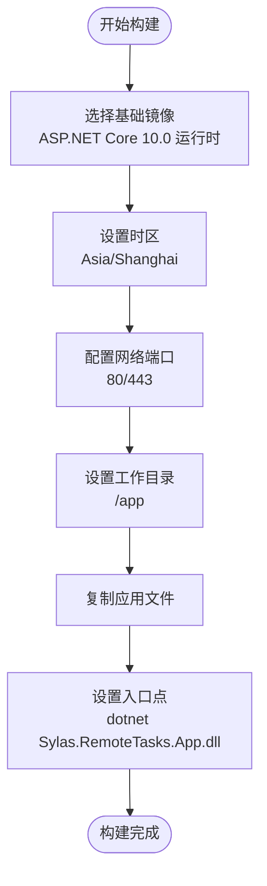
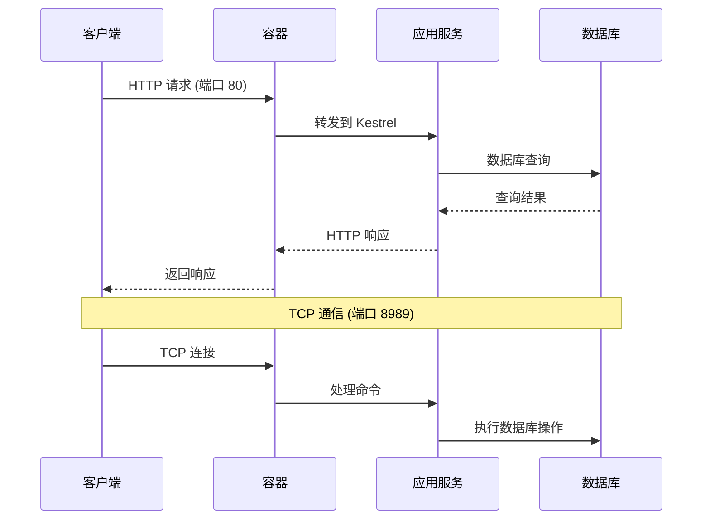
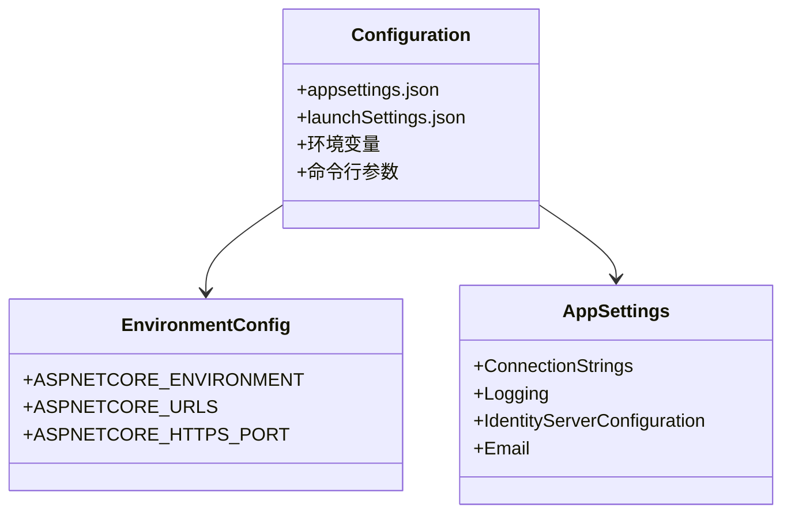
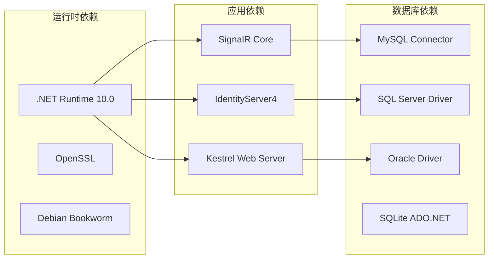
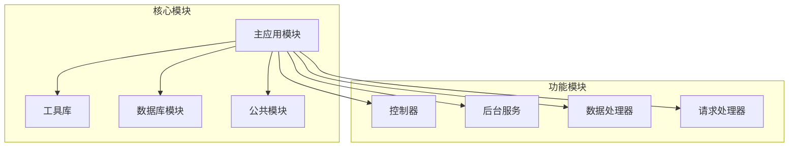

# Docker 部署

<cite>
**本文档引用的文件**
- [Dockerfile](file://Sylas.RemoteTasks.App/Dockerfile)
- [appsettings.json](file://Sylas.RemoteTasks.App/appsettings.json)
- [launchSettings.json](file://Sylas.RemoteTasks.App/Properties/launchSettings.json)
- [Program.cs](file://Sylas.RemoteTasks.App/Program.cs)
- [Sylas.RemoteTasks.App.csproj](file://Sylas.RemoteTasks.App/Sylas.RemoteTasks.App.csproj)
- [README.md](file://README.md)
- [PublishService.cs](file://Sylas.RemoteTasks.App/BackgroundServices/PublishService.cs)
- [DatabaseConstants.cs](file://Sylas.RemoteTasks.Utils/Constants/DatabaseConstants.cs)
- [RegexConst.cs](file://Sylas.RemoteTasks.Common/RegexConst.cs)
</cite>

## 目录
1. [简介](#简介)
2. [项目结构](#项目结构)
3. [核心组件](#核心组件)
4. [架构概览](#架构概览)
5. [详细组件分析](#详细组件分析)
6. [依赖关系分析](#依赖关系分析)
7. [性能考虑](#性能考虑)
8. [故障排除指南](#故障排除指南)
9. [结论](#结论)
10. [附录](#附录)

## 简介

Sylas.RemoteTasks 是一个基于 .NET 的远程任务管理系统，支持数据库同步、文件上传下载、远程命令执行等功能。本文件提供了完整的 Docker 部署指南，包括 Dockerfile 配置、镜像构建过程、容器运行参数、网络配置和环境变量设置。

该系统采用 ASP.NET Core 作为 Web 框架，支持多种数据库连接，并具备 TCP 通信能力用于节点间通信。部署时需要考虑端口映射、时区配置、证书处理和环境变量设置等多个方面。

## 项目结构

Sylas.RemoteTasks 项目采用多项目结构，主要包含以下关键组件：



**图表来源**
- [Sylas.RemoteTasks.App.csproj](file://Sylas.RemoteTasks.App/Sylas.RemoteTasks.App.csproj#L1-L61)
- [Program.cs](file://Sylas.RemoteTasks.App/Program.cs#L1-L122)

**章节来源**
- [Sylas.RemoteTasks.App.csproj](file://Sylas.RemoteTasks.App/Sylas.RemoteTasks.App.csproj#L1-L61)
- [Program.cs](file://Sylas.RemoteTasks.App/Program.cs#L1-L122)

## 核心组件

### Docker 容器配置

Dockerfile 使用 ASP.NET Core 运行时镜像，配置了以下关键设置：

- **基础镜像**: `mcr.microsoft.com/dotnet/aspnet:10.0`（运行时）
- **时区配置**: 中国标准时间 (`Asia/Shanghai`)
- **网络端口**: 80 (HTTP) 和 443 (HTTPS)
- **工作目录**: `/app`
- **入口点**: `dotnet Sylas.RemoteTasks.App.dll`

### 端口配置

系统使用多个端口进行不同功能：

- **Web 服务端口**: 80 (HTTP) / 443 (HTTPS)
- **TCP 通信端口**: 8989
- **开发端口**: 5105 (HTTP) / 7166 (HTTPS)

### 环境变量

支持的关键环境变量：

- `ASPNETCORE_URLS`: 应用程序 URL 配置
- `ASPNETCORE_ENVIRONMENT`: 环境模式（Development/Production）
- `TZ`: 时区设置

**章节来源**
- [Dockerfile](file://Sylas.RemoteTasks.App/Dockerfile#L1-L21)
- [appsettings.json](file://Sylas.RemoteTasks.App/appsettings.json#L25-L36)
- [launchSettings.json](file://Sylas.RemoteTasks.App/Properties/launchSettings.json#L15-L27)

## 架构概览

系统采用分层架构设计，支持容器化部署：



**图表来源**
- [Program.cs](file://Sylas.RemoteTasks.App/Program.cs#L66-L68)
- [PublishService.cs](file://Sylas.RemoteTasks.App/BackgroundServices/PublishService.cs#L88-L340)

## 详细组件分析

### Dockerfile 配置详解

Dockerfile 实现了最小化的容器配置：



**图表来源**
- [Dockerfile](file://Sylas.RemoteTasks.App/Dockerfile#L1-L21)

### 网络配置分析

系统支持多种网络配置模式：



**图表来源**
- [appsettings.json](file://Sylas.RemoteTasks.App/appsettings.json#L29-L35)
- [PublishService.cs](file://Sylas.RemoteTasks.App/BackgroundServices/PublishService.cs#L65-L75)

### 环境配置管理

应用程序支持多种配置源：



**图表来源**
- [appsettings.json](file://Sylas.RemoteTasks.App/appsettings.json#L1-L142)
- [launchSettings.json](file://Sylas.RemoteTasks.App/Properties/launchSettings.json#L15-L27)

**章节来源**
- [Dockerfile](file://Sylas.RemoteTasks.App/Dockerfile#L12-L15)
- [appsettings.json](file://Sylas.RemoteTasks.App/appsettings.json#L1-L142)
- [launchSettings.json](file://Sylas.RemoteTasks.App/Properties/launchSettings.json#L15-L27)

## 依赖关系分析

### 外部依赖

系统依赖的关键外部组件：



**图表来源**
- [Sylas.RemoteTasks.App.csproj](file://Sylas.RemoteTasks.App/Sylas.RemoteTasks.App.csproj#L33-L40)

### 内部模块依赖



**图表来源**
- [Program.cs](file://Sylas.RemoteTasks.App/Program.cs#L1-L122)

**章节来源**
- [Sylas.RemoteTasks.App.csproj](file://Sylas.RemoteTasks.App/Sylas.RemoteTasks.App.csproj#L33-L40)
- [Program.cs](file://Sylas.RemoteTasks.App/Program.cs#L1-L122)

## 性能考虑

### 容器优化建议

1. **镜像大小优化**
   - 使用多阶段构建减少最终镜像大小
   - 移除不必要的开发工具和调试文件

2. **内存和 CPU 限制**
   - 设置合理的资源限制避免资源争用
   - 监控容器资源使用情况

3. **连接池配置**
   - 优化数据库连接池大小
   - 合理配置 HTTP 客户端连接池

### 网络性能

- **端口复用**: 使用单个容器暴露多个端口
- **负载均衡**: 在生产环境中使用反向代理
- **TLS 优化**: 配置适当的 TLS 参数

## 故障排除指南

### 常见部署问题

1. **端口冲突**
   ```bash
   # 检查端口占用
   netstat -an | grep :80
   
   # 查找占用进程
   lsof -i :80
   ```

2. **权限问题**
   ```bash
   # 检查文件权限
   ls -la /app
   
   # 设置正确的权限
   chmod 755 /app
   ```

3. **时区问题**
   ```bash
   # 检查容器时区
   date
   
   # 验证时区配置
   cat /etc/timezone
   ```

### 日志诊断

```bash
# 查看容器日志
docker logs -f container_name

# 检查应用日志
docker exec container_name cat /app/Logs/application.log

# 监控容器状态
docker stats container_name
```

**章节来源**
- [Dockerfile](file://Sylas.RemoteTasks.App/Dockerfile#L12-L15)
- [README.md](file://README.md#L4-L17)

## 结论

Sylas.RemoteTasks 的 Docker 部署提供了灵活且高效的容器化解决方案。通过合理的 Dockerfile 配置、端口管理和环境变量设置，可以实现稳定可靠的生产部署。

关键成功因素包括：
- 正确的端口映射和网络配置
- 合适的时区和环境变量设置
- 适当的资源限制和监控
- 安全的证书和身份验证配置

## 附录

### 部署命令示例

#### 基础部署
```bash
# 构建镜像
docker build -t sylas-remotetasks .

# 运行容器
docker run -d \
  --name remotetasks \
  -p 80:80 \
  -p 443:443 \
  -p 8989:8989 \
  -e ASPNETCORE_ENVIRONMENT=Production \
  -e TZ=Asia/Shanghai \
  sylas-remotetasks
```

#### 生产环境部署
```bash
# 使用 Docker Compose
docker-compose up -d

# 健康检查
docker-compose ps
docker-compose logs
```

#### 环境变量配置
```bash
# 开发环境
docker run -d \
  -e ASPNETCORE_ENVIRONMENT=Development \
  -e ASPNETCORE_URLS=http://+:80 \
  sylas-remotetasks

# 生产环境
docker run -d \
  -e ASPNETCORE_ENVIRONMENT=Production \
  -e ASPNETCORE_URLS=https://+:443 \
  sylas-remotetasks
```

### Docker Compose 配置示例

```yaml
version: '3.8'

services:
  remotetasks:
    image: sylas-remotetasks:latest
    container_name: remotetasks
    restart: always
    ports:
      - "80:80"
      - "443:443"
      - "8989:8989"
    environment:
      - ASPNETCORE_ENVIRONMENT=Production
      - ASPNETCORE_URLS=http://+:80;https://+:443
      - TZ=Asia/Shanghai
    volumes:
      - ./logs:/app/Logs
      - ./data:/app/Data
    healthcheck:
      test: ["CMD", "curl", "-f", "http://localhost/health"]
      interval: 30s
      timeout: 10s
      retries: 3
```

### 最佳实践

1. **镜像版本管理**
   - 固定基础镜像版本
   - 使用语义化版本标签

2. **安全配置**
   - 使用非 root 用户运行
   - 配置适当的文件权限
   - 启用 HTTPS 和安全头

3. **监控和日志**
   - 配置结构化日志
   - 设置健康检查
   - 监控资源使用情况

4. **备份和恢复**
   - 定期备份数据库
   - 配置持久化存储
   - 制定灾难恢复计划

**章节来源**
- [README.md](file://README.md#L4-L17)
- [Dockerfile](file://Sylas.RemoteTasks.App/Dockerfile#L12-L15)