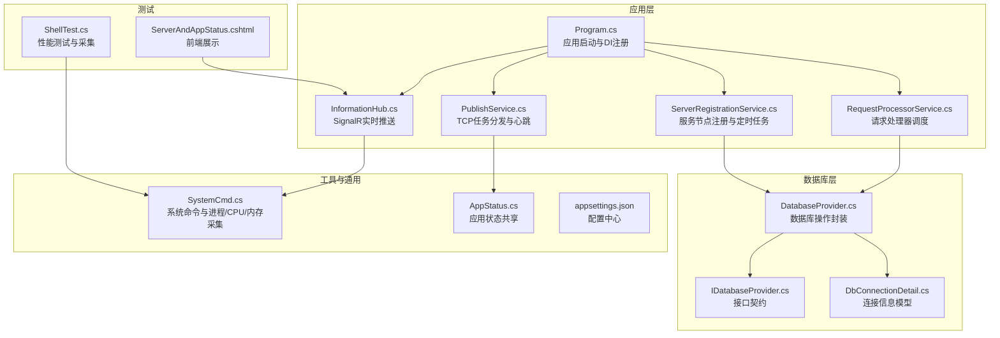
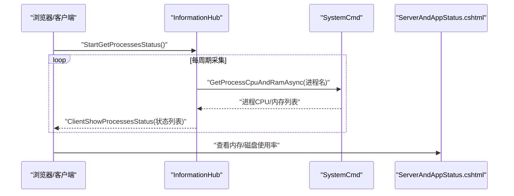
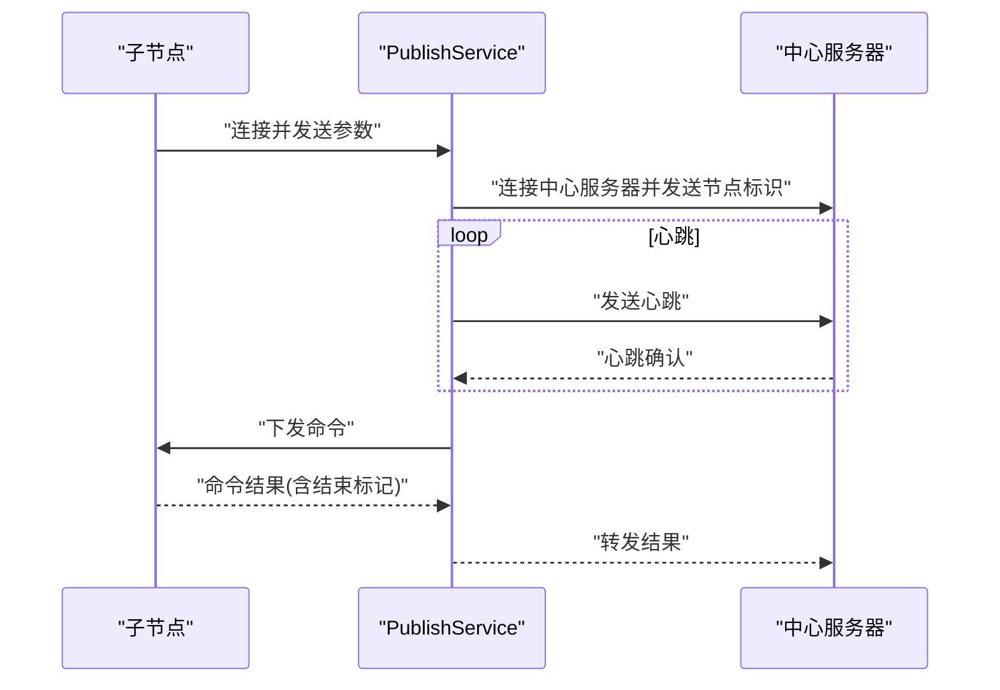
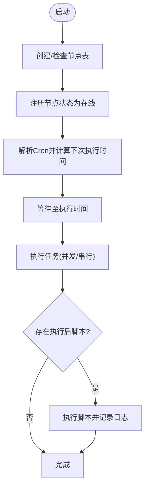
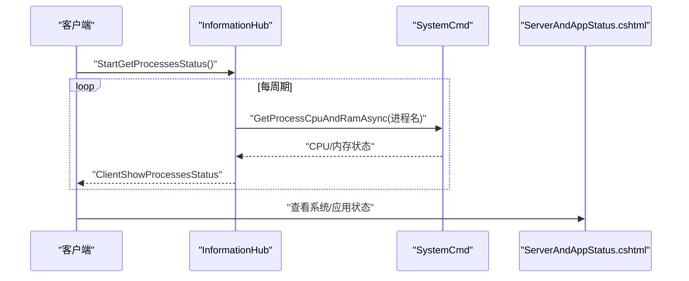
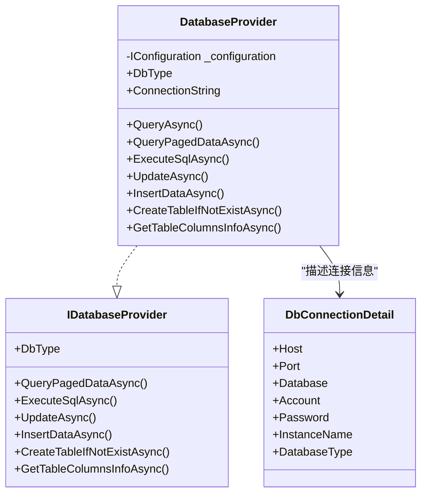
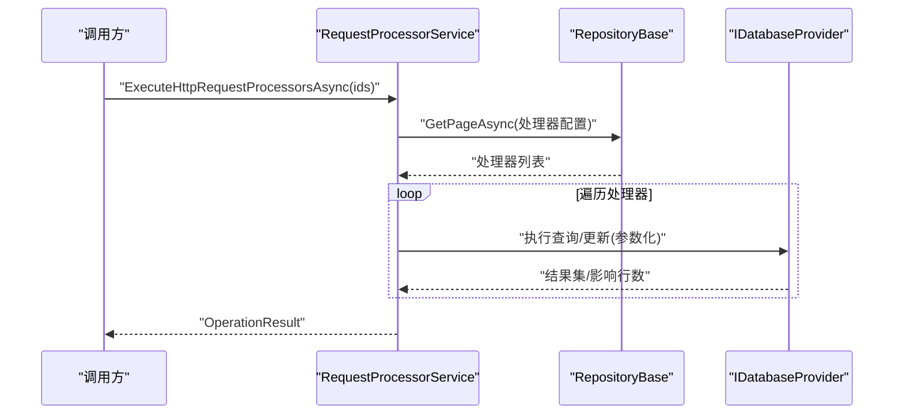
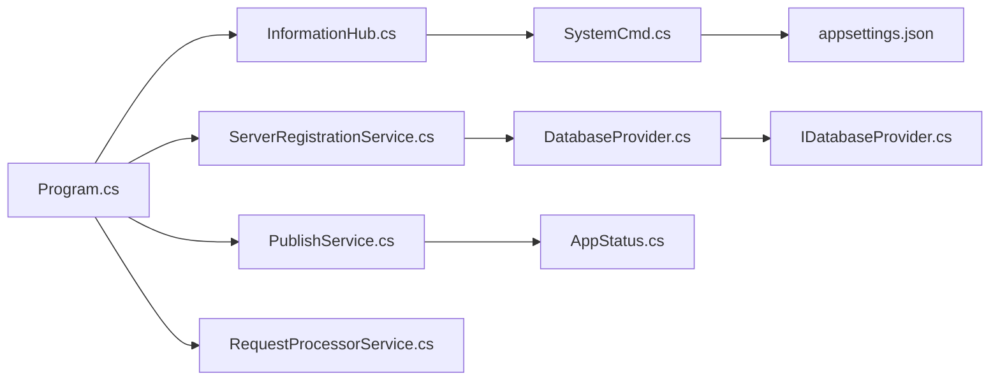

# 性能监控

<cite>
**本文引用的文件**
- [Program.cs](file://Sylas.RemoteTasks.App/Program.cs)
- [appsettings.json](file://Sylas.RemoteTasks.App/appsettings.json)
- [PublishService.cs](file://Sylas.RemoteTasks.App/BackgroundServices/PublishService.cs)
- [ServerRegistrationService.cs](file://Sylas.RemoteTasks.App/BackgroundServices/ServerRegistrationService.cs)
- [InformationHub.cs](file://Sylas.RemoteTasks.App/Hubs/InformationHub.cs)
- [DatabaseProvider.cs](file://Sylas.RemoteTasks.Database/DatabaseProvider.cs)
- [IDatabaseProvider.cs](file://Sylas.RemoteTasks.Database/IDatabaseProvider.cs)
- [DbConnectionDetail.cs](file://Sylas.RemoteTasks.Database/SyncBase/DbConnectionDetail.cs)
- [SystemCmd.cs](file://Sylas.RemoteTasks.Utils/CommandExecutor/SystemCmd.cs)
- [AppStatus.cs](file://Sylas.RemoteTasks.Common/AppStatus.cs)
- [ShellTest.cs](file://Sylas.RemoteTasks.Test/SystemHelperTest/ShellTest.cs)
- [ServerAndAppStatus.cshtml](file://Sylas.RemoteTasks.App/Views/Hosts/ServerAndAppStatus.cshtml)
- [RequestProcessorService.cs](file://Sylas.RemoteTasks.App/RequestProcessor/RequestProcessorService.cs)
</cite>

## 目录
1. [简介](#简介)
2. [项目结构](#项目结构)
3. [核心组件](#核心组件)
4. [架构总览](#架构总览)
5. [详细组件分析](#详细组件分析)
6. [依赖关系分析](#依赖关系分析)
7. [性能考量](#性能考量)
8. [故障排查指南](#故障排查指南)
9. [结论](#结论)
10. [附录](#附录)

## 简介
本文件面向 Sylas.RemoteTasks 的性能监控与运维需求，围绕应用性能指标监控、内存使用情况、CPU 占用率、数据库连接池监控、后台服务监控、实时状态推送与性能告警机制展开，提供监控数据采集、存储与可视化的方案，并解释关键性能指标的含义与优化建议。同时给出性能基准测试与压力测试方法，帮助在开发与生产环境中持续评估与改进系统性能。

## 项目结构
Sylas.RemoteTasks 采用多项目组合的解决方案，核心应用层位于 Sylas.RemoteTasks.App，数据库抽象层位于 Sylas.RemoteTasks.Database，工具与命令执行位于 Sylas.RemoteTasks.Utils，通用状态与常量位于 Sylas.RemoteTasks.Common，测试位于 Sylas.RemoteTasks.Test。应用通过 SignalR 实现实时状态推送，通过后台服务承载 TCP 任务分发与数据库节点注册，通过 DI 容器管理服务生命周期。

图表来源
- [Program.cs](file://Sylas.RemoteTasks.App/Program.cs#L1-L122)
- [InformationHub.cs](file://Sylas.RemoteTasks.App/Hubs/InformationHub.cs#L1-L59)
- [PublishService.cs](file://Sylas.RemoteTasks.App/BackgroundServices/PublishService.cs#L1-L645)
- [ServerRegistrationService.cs](file://Sylas.RemoteTasks.App/BackgroundServices/ServerRegistrationService.cs#L1-L493)
- [RequestProcessorService.cs](file://Sylas.RemoteTasks.App/RequestProcessor/RequestProcessorService.cs#L1-L24)
- [DatabaseProvider.cs](file://Sylas.RemoteTasks.Database/DatabaseProvider.cs#L1-L485)
- [IDatabaseProvider.cs](file://Sylas.RemoteTasks.Database/IDatabaseProvider.cs#L1-L99)
- [DbConnectionDetail.cs](file://Sylas.RemoteTasks.Database/SyncBase/DbConnectionDetail.cs#L1-L54)
- [SystemCmd.cs](file://Sylas.RemoteTasks.Utils/CommandExecutor/SystemCmd.cs#L381-L765)
- [AppStatus.cs](file://Sylas.RemoteTasks.Common/AppStatus.cs#L1-L35)
- [appsettings.json](file://Sylas.RemoteTasks.App/appsettings.json#L1-L142)
- [ShellTest.cs](file://Sylas.RemoteTasks.Test/SystemHelperTest/ShellTest.cs#L57-L100)
- [ServerAndAppStatus.cshtml](file://Sylas.RemoteTasks.App/Views/Hosts/ServerAndAppStatus.cshtml#L92-L108)

章节来源
- [Program.cs](file://Sylas.RemoteTasks.App/Program.cs#L1-L122)
- [appsettings.json](file://Sylas.RemoteTasks.App/appsettings.json#L1-L142)

## 核心组件
- 应用启动与服务注册：Program.cs 负责注册 SignalR、HTTP 客户端、仓储、后台服务、认证授权等，统一构建应用生命周期。
- 实时状态推送：InformationHub.cs 通过 SignalR 将进程 CPU/内存状态推送到前端；支持客户端拉取与断开清理。
- 后台服务：
  - PublishService.cs：TCP 任务分发、子节点连接、心跳检测、命令下发与结果回传。
  - ServerRegistrationService.cs：服务节点注册、状态更新、定时任务调度与执行。
- 数据库抽象：DatabaseProvider.cs 封装查询、分页、增删改等操作；IDatabaseProvider.cs 定义接口契约；DbConnectionDetail.cs 描述连接信息。
- 系统命令与监控：SystemCmd.cs 提供进程 CPU/内存采集、系统信息获取；ShellTest.cs 提供性能测试与采集示例。
- 配置中心：appsettings.json 提供日志、连接串、TCP 端口、中心服务器、进程监控名单等配置。
- 前端展示：ServerAndAppStatus.cshtml 展示内存与磁盘使用率等信息。

章节来源
- [Program.cs](file://Sylas.RemoteTasks.App/Program.cs#L1-L122)
- [InformationHub.cs](file://Sylas.RemoteTasks.App/Hubs/InformationHub.cs#L1-L59)
- [PublishService.cs](file://Sylas.RemoteTasks.App/BackgroundServices/PublishService.cs#L1-L645)
- [ServerRegistrationService.cs](file://Sylas.RemoteTasks.App/BackgroundServices/ServerRegistrationService.cs#L1-L493)
- [DatabaseProvider.cs](file://Sylas.RemoteTasks.Database/DatabaseProvider.cs#L1-L485)
- [IDatabaseProvider.cs](file://Sylas.RemoteTasks.Database/IDatabaseProvider.cs#L1-L99)
- [DbConnectionDetail.cs](file://Sylas.RemoteTasks.Database/SyncBase/DbConnectionDetail.cs#L1-L54)
- [SystemCmd.cs](file://Sylas.RemoteTasks.Utils/CommandExecutor/SystemCmd.cs#L381-L765)
- [appsettings.json](file://Sylas.RemoteTasks.App/appsettings.json#L1-L142)
- [ServerAndAppStatus.cshtml](file://Sylas.RemoteTasks.App/Views/Hosts/ServerAndAppStatus.cshtml#L92-L108)

## 架构总览
应用通过 SignalR 实时推送系统与进程状态，后台服务承载 TCP 任务分发与节点心跳，数据库层提供统一访问接口。配置中心集中管理运行参数与监控名单。

图表来源
- [InformationHub.cs](file://Sylas.RemoteTasks.App/Hubs/InformationHub.cs#L1-L59)
- [SystemCmd.cs](file://Sylas.RemoteTasks.Utils/CommandExecutor/SystemCmd.cs#L381-L765)
- [ServerAndAppStatus.cshtml](file://Sylas.RemoteTasks.App/Views/Hosts/ServerAndAppStatus.cshtml#L92-L108)

## 详细组件分析

### 组件A：后台服务监控（PublishService）
- TCP 任务分发与心跳
  - 监听本地 TCP 端口，接受来自子节点的文件上传与命令任务。
  - 与中心服务器建立长连接，定期发送心跳，检测心跳超时并自动重连。
  - 命令下发与结果回传，支持批量结果分片与结束标记。
- 性能关注点
  - 线程模型：主线程 Accept，子线程处理每个客户端，注意线程池与内存分配。
  - 心跳频率与超时阈值：避免频繁重连与误判。
  - 结束标记校验：防止粘包导致的解析错误。
- 建议
  - 引入连接池与连接复用，减少频繁创建销毁。
  - 对缓冲区大小与超时参数进行动态调整，适配高并发场景。

图表来源
- [PublishService.cs](file://Sylas.RemoteTasks.App/BackgroundServices/PublishService.cs#L443-L624)

章节来源
- [PublishService.cs](file://Sylas.RemoteTasks.App/BackgroundServices/PublishService.cs#L1-L645)

### 组件B：服务节点注册与定时任务（ServerRegistrationService）
- 服务节点注册
  - 启动时创建/更新服务节点记录，停止时更新状态为离线。
  - 通过数据库 Provider 查询与更新节点状态。
- 定时任务调度
  - 解析 Cron 表达式，计算下次执行时间，支持秒/分/时三段。
  - 为每个定时任务创建独立执行线程，支持取消与重载。
- 性能关注点
  - Cron 解析缓存：减少重复计算。
  - 作用域管理：每次循环创建作用域，避免内存泄漏。
  - 执行耗时统计：便于性能基线与告警阈值设定。

图表来源
- [ServerRegistrationService.cs](file://Sylas.RemoteTasks.App/BackgroundServices/ServerRegistrationService.cs#L118-L490)

章节来源
- [ServerRegistrationService.cs](file://Sylas.RemoteTasks.App/BackgroundServices/ServerRegistrationService.cs#L1-L493)
- [DatabaseProvider.cs](file://Sylas.RemoteTasks.Database/DatabaseProvider.cs#L450-L485)

### 组件C：实时状态推送（InformationHub + SystemCmd）
- 进程监控
  - 通过配置 ProcessMonitor:Names 指定监控进程名列表。
  - SystemCmd 采集进程 CPU 平均值与内存占用，支持 Windows/Linux。
- SignalR 推送
  - 客户端调用 StartGetProcessesStatus 后，服务端周期性推送状态列表。
  - 断开连接时停止采集，避免资源泄露。
- 前端展示
  - ServerAndAppStatus.cshtml 展示内存使用率与磁盘占用率。

图表来源
- [InformationHub.cs](file://Sylas.RemoteTasks.App/Hubs/InformationHub.cs#L1-L59)
- [SystemCmd.cs](file://Sylas.RemoteTasks.Utils/CommandExecutor/SystemCmd.cs#L381-L765)
- [ServerAndAppStatus.cshtml](file://Sylas.RemoteTasks.App/Views/Hosts/ServerAndAppStatus.cshtml#L92-L108)

章节来源
- [InformationHub.cs](file://Sylas.RemoteTasks.App/Hubs/InformationHub.cs#L1-L59)
- [SystemCmd.cs](file://Sylas.RemoteTasks.Utils/CommandExecutor/SystemCmd.cs#L381-L765)
- [ServerAndAppStatus.cshtml](file://Sylas.RemoteTasks.App/Views/Hosts/ServerAndAppStatus.cshtml#L92-L108)

### 组件D：数据库连接池监控（DatabaseProvider + DbConnectionDetail）
- 连接与查询
  - DatabaseProvider 封装查询、分页、增删改等操作，默认使用 SqlClientFactory。
  - 支持按连接串切换数据库，参数化 SQL，避免注入风险。
- 连接信息模型
  - DbConnectionDetail 描述 Host、Port、Database、Account、Password、InstanceName、DatabaseType 等。
- 性能关注点
  - 连接复用与超时控制：避免频繁打开/关闭连接。
  - 参数化与预编译：提升执行计划复用率。
  - 分页查询与条件参数：减少数据传输与内存占用。

图表来源
- [IDatabaseProvider.cs](file://Sylas.RemoteTasks.Database/IDatabaseProvider.cs#L1-L99)
- [DatabaseProvider.cs](file://Sylas.RemoteTasks.Database/DatabaseProvider.cs#L1-L485)
- [DbConnectionDetail.cs](file://Sylas.RemoteTasks.Database/SyncBase/DbConnectionDetail.cs#L1-L54)

章节来源
- [DatabaseProvider.cs](file://Sylas.RemoteTasks.Database/DatabaseProvider.cs#L1-L485)
- [IDatabaseProvider.cs](file://Sylas.RemoteTasks.Database/IDatabaseProvider.cs#L1-L99)
- [DbConnectionDetail.cs](file://Sylas.RemoteTasks.Database/SyncBase/DbConnectionDetail.cs#L1-L54)

### 组件E：请求处理器与性能基线（RequestProcessorService）
- 请求处理器调度
  - 通过 RepositoryBase 获取处理器配置，按顺序执行步骤与数据处理器。
  - 记录执行过程与结果，便于性能分析与告警。
- 基准测试
  - ShellTest 提供多线程 HTTP 请求模拟与系统信息采集，可用于性能基线与回归测试。

图表来源
- [RequestProcessorService.cs](file://Sylas.RemoteTasks.App/RequestProcessor/RequestProcessorService.cs#L1-L24)
- [ServerRegistrationService.cs](file://Sylas.RemoteTasks.App/BackgroundServices/ServerRegistrationService.cs#L197-L202)

章节来源
- [RequestProcessorService.cs](file://Sylas.RemoteTasks.App/RequestProcessor/RequestProcessorService.cs#L1-L24)
- [ServerRegistrationService.cs](file://Sylas.RemoteTasks.App/BackgroundServices/ServerRegistrationService.cs#L197-L202)

## 依赖关系分析
- 组件耦合
  - Program.cs 作为入口，集中注册 SignalR、后台服务、认证授权与数据库 Provider。
  - InformationHub 依赖 SystemCmd 采集系统与进程状态。
  - PublishService 与 ServerRegistrationService 通过 DI 获取服务，避免直接依赖具体实现。
  - DatabaseProvider 依赖 IDatabaseProvider 接口，便于替换与测试。
- 外部依赖
  - SignalR 用于实时推送。
  - SystemCmd 依赖系统命令与进程 API。
  - appsettings.json 提供配置与监控名单。

图表来源
- [Program.cs](file://Sylas.RemoteTasks.App/Program.cs#L1-L122)
- [InformationHub.cs](file://Sylas.RemoteTasks.App/Hubs/InformationHub.cs#L1-L59)
- [PublishService.cs](file://Sylas.RemoteTasks.App/BackgroundServices/PublishService.cs#L1-L645)
- [ServerRegistrationService.cs](file://Sylas.RemoteTasks.App/BackgroundServices/ServerRegistrationService.cs#L1-L493)
- [RequestProcessorService.cs](file://Sylas.RemoteTasks.App/RequestProcessor/RequestProcessorService.cs#L1-L24)
- [DatabaseProvider.cs](file://Sylas.RemoteTasks.Database/DatabaseProvider.cs#L1-L485)
- [IDatabaseProvider.cs](file://Sylas.RemoteTasks.Database/IDatabaseProvider.cs#L1-L99)
- [AppStatus.cs](file://Sylas.RemoteTasks.Common/AppStatus.cs#L1-L35)
- [appsettings.json](file://Sylas.RemoteTasks.App/appsettings.json#L1-L142)

章节来源
- [Program.cs](file://Sylas.RemoteTasks.App/Program.cs#L1-L122)

## 性能考量
- 应用性能指标监控
  - CPU 占用率：SystemCmd 采集进程 CPU 平均值；InformationHub 周期推送。
  - 内存使用：SystemCmd 采集进程内存占用；ServerAndAppStatus.cshtml 展示系统内存使用率。
  - 磁盘使用：SystemCmd 采集磁盘信息；前端展示各分区使用率。
- 数据库连接池监控
  - DatabaseProvider 默认使用 SqlClientFactory，建议结合连接池参数（最大/最小连接数、连接超时）进行调优。
  - 参数化查询与分页查询减少内存与网络开销。
- 后台服务性能
  - PublishService 的线程模型与缓冲区大小需根据并发与吞吐量调整。
  - ServerRegistrationService 的 Cron 解析缓存与作用域管理有助于降低 GC 压力。
- 实时状态推送
  - SignalR 长轮询与 Server-Sent Events 的选择会影响延迟与资源消耗，建议结合部署环境与客户端特性评估。
- 告警机制
  - 建议基于进程 CPU/内存阈值、数据库查询耗时、后台任务执行时长、TCP 心跳超时等指标设定阈值与告警规则。

## 故障排查指南
- 心跳超时与重连
  - PublishService 中心跳频率与超时阈值不当可能导致频繁重连；检查 _heartbeatFrequency 与 _heartbeatLogsDirectory 日志定位问题。
- 进程监控无数据
  - 确认 appsettings.json 中 ProcessMonitor:Names 是否正确配置；InformationHub.StartGetProcessesStatus 是否被调用。
- 数据库连接异常
  - 检查 ConnectionString 与加密解密流程；确认 DatabaseProvider 的连接打开/关闭逻辑。
- 前端状态不更新
  - 检查 SignalR 连接状态与日志级别；确认 ServerAndAppStatus.cshtml 的渲染逻辑。

章节来源
- [PublishService.cs](file://Sylas.RemoteTasks.App/BackgroundServices/PublishService.cs#L482-L543)
- [InformationHub.cs](file://Sylas.RemoteTasks.App/Hubs/InformationHub.cs#L13-L56)
- [DatabaseProvider.cs](file://Sylas.RemoteTasks.Database/DatabaseProvider.cs#L230-L258)
- [appsettings.json](file://Sylas.RemoteTasks.App/appsettings.json#L122-L124)

## 结论
通过 SignalR 实时推送、后台服务的心跳与任务调度、数据库抽象层的参数化与分页查询，以及 SystemCmd 的系统与进程监控，Sylas.RemoteTasks 形成了较为完善的性能监控体系。建议进一步引入连接池参数调优、Cron 缓存与作用域管理优化、以及基于指标的告警机制，以满足生产环境的稳定性与可观测性要求。

## 附录
- 监控数据采集与存储
  - 进程 CPU/内存：SystemCmd 采集，可持久化至日志或时序数据库。
  - 数据库查询耗时：在 DatabaseProvider 的查询方法中埋点，记录开始/结束时间与参数。
  - 后台任务执行时长：在 ServerRegistrationService 的任务执行前后记录时间戳。
- 可视化方案
  - 前端 ServerAndAppStatus.cshtml 展示内存/磁盘使用率；可扩展为仪表板集成 Grafana/Prometheus。
- 性能基准测试与压力测试
  - 使用 ShellTest 的多线程 HTTP 请求模拟与系统信息采集，形成基线；逐步增加并发与数据规模，观察 CPU/内存/数据库连接池变化，定位瓶颈。

章节来源
- [ShellTest.cs](file://Sylas.RemoteTasks.Test/SystemHelperTest/ShellTest.cs#L57-L100)
- [SystemCmd.cs](file://Sylas.RemoteTasks.Utils/CommandExecutor/SystemCmd.cs#L381-L765)
- [ServerRegistrationService.cs](file://Sylas.RemoteTasks.App/BackgroundServices/ServerRegistrationService.cs#L268-L306)