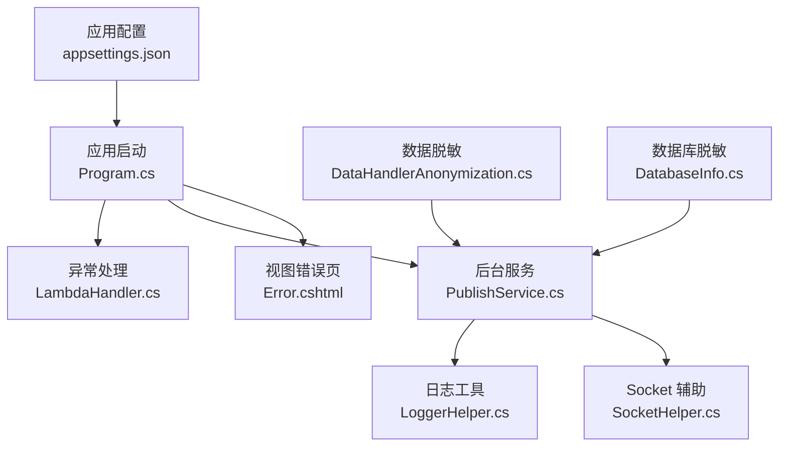
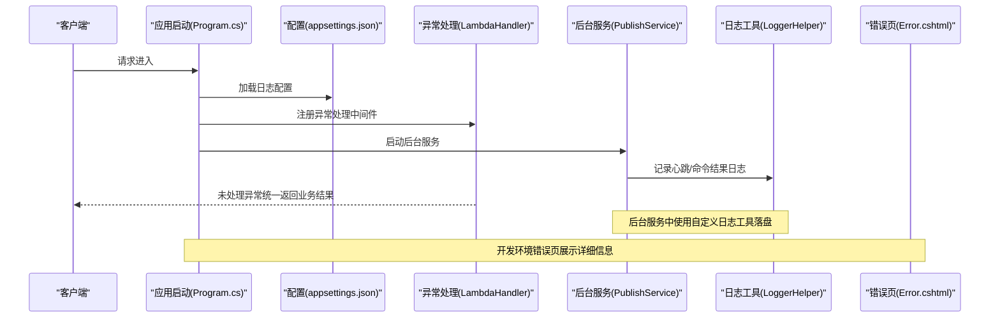
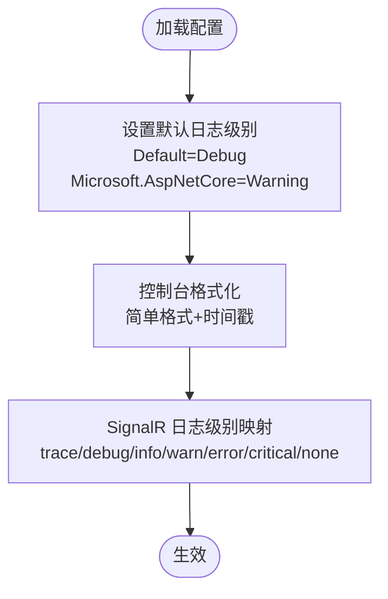
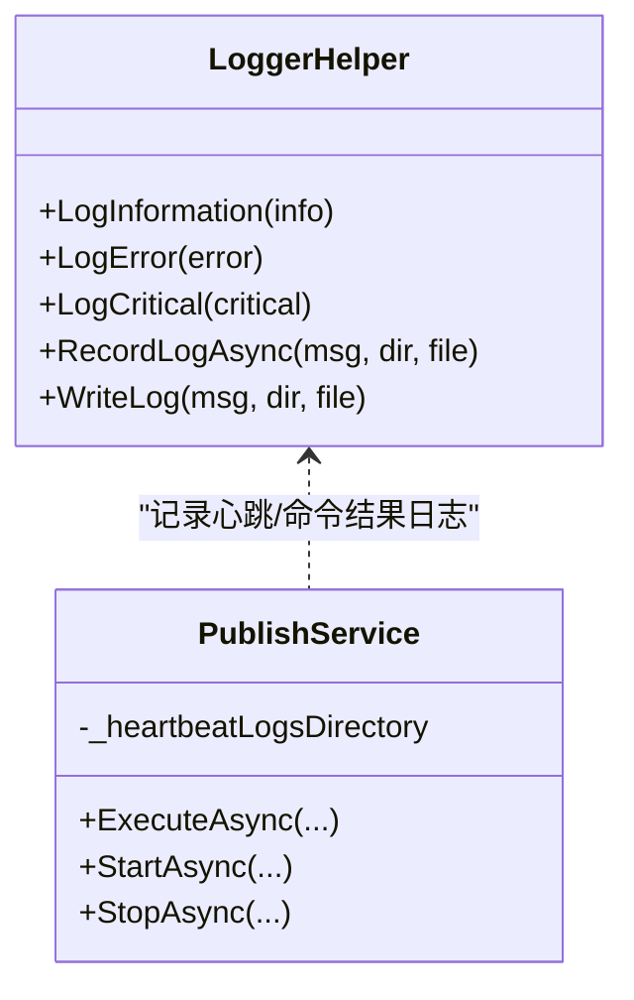
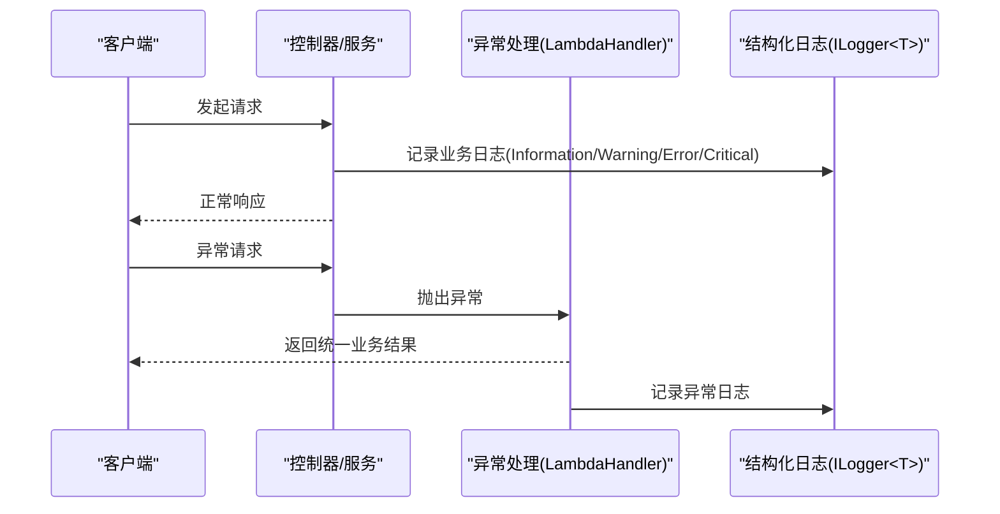
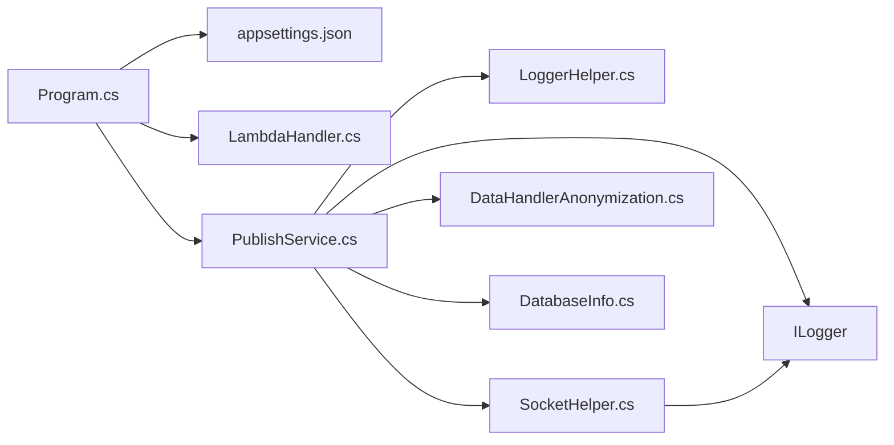

# 日志管理

<cite>
**本文引用的文件**
- [Sylas.RemoteTasks.Common/LoggerHelper.cs](file://Sylas.RemoteTasks.Common/LoggerHelper.cs)
- [Sylas.RemoteTasks.App/appsettings.json](file://Sylas.RemoteTasks.App/appsettings.json)
- [Sylas.RemoteTasks.App/Program.cs](file://Sylas.RemoteTasks.App/Program.cs)
- [Sylas.RemoteTasks.App/BackgroundServices/PublishService.cs](file://Sylas.RemoteTasks.App/BackgroundServices/PublishService.cs)
- [Sylas.RemoteTasks.App/ExceptionHandlers/LambdaHandler.cs](file://Sylas.RemoteTasks.App/ExceptionHandlers/LambdaHandler.cs)
- [Sylas.RemoteTasks.App/Views/Shared/Error.cshtml](file://Sylas.RemoteTasks.App/Views/Shared/Error.cshtml)
- [Sylas.RemoteTasks.Utils/SocketHelper.cs](file://Sylas.RemoteTasks.Utils/SocketHelper.cs)
- [Sylas.RemoteTasks.App/DataHandlers/DataHandlerAnonymization.cs](file://Sylas.RemoteTasks.App/DataHandlers/DataHandlerAnonymization.cs)
- [Sylas.RemoteTasks.Database/SyncBase/DatabaseInfo.cs](file://Sylas.RemoteTasks.Database/SyncBase/DatabaseInfo.cs)
</cite>

## 目录
1. [简介](#简介)
2. [项目结构](#项目结构)
3. [核心组件](#核心组件)
4. [架构总览](#架构总览)
5. [详细组件分析](#详细组件分析)
6. [依赖关系分析](#依赖关系分析)
7. [性能考量](#性能考量)
8. [故障排查指南](#故障排查指南)
9. [结论](#结论)
10. [附录](#附录)

## 简介
本文件系统化梳理 Sylas.RemoteTasks 的日志管理现状与最佳实践，覆盖日志记录配置、日志级别设置、日志格式标准化、日志轮转策略、异常处理日志、业务日志与调试日志的分类管理，以及日志收集、存储与检索方案，并给出日志分析方法、常见问题定位技巧与日志安全与隐私保护措施。

## 项目结构
围绕日志的关键位置包括：
- 应用配置层：appsettings.json 提供默认日志级别与控制台格式化选项
- 应用启动层：Program.cs 注册异常处理器与 SignalR 日志配置入口
- 业务与基础设施层：BackgroundServices、Utils、Common 等模块中既有结构化日志（ILogger<T>），也有自定义日志工具（LoggerHelper）
- 异常处理层：LambdaHandler 将未处理异常统一包装为业务结果返回
- 视图层：Error.cshtml 展示开发环境下的错误页与环境提示
- 数据脱敏：DataHandlerAnonymization 与 DatabaseInfo 中对敏感字段进行脱敏处理，降低日志中敏感信息泄露风险

**图表来源**
- [Sylas.RemoteTasks.App/appsettings.json](file://Sylas.RemoteTasks.App/appsettings.json#L1-L142)
- [Sylas.RemoteTasks.App/Program.cs](file://Sylas.RemoteTasks.App/Program.cs#L1-L122)
- [Sylas.RemoteTasks.App/ExceptionHandlers/LambdaHandler.cs](file://Sylas.RemoteTasks.App/ExceptionHandlers/LambdaHandler.cs#L1-L27)
- [Sylas.RemoteTasks.App/BackgroundServices/PublishService.cs](file://Sylas.RemoteTasks.App/BackgroundServices/PublishService.cs#L1-L645)
- [Sylas.RemoteTasks.Common/LoggerHelper.cs](file://Sylas.RemoteTasks.Common/LoggerHelper.cs#L1-L115)
- [Sylas.RemoteTasks.Utils/SocketHelper.cs](file://Sylas.RemoteTasks.Utils/SocketHelper.cs#L328-L363)
- [Sylas.RemoteTasks.App/DataHandlers/DataHandlerAnonymization.cs](file://Sylas.RemoteTasks.App/DataHandlers/DataHandlerAnonymization.cs#L1-L42)
- [Sylas.RemoteTasks.Database/SyncBase/DatabaseInfo.cs](file://Sylas.RemoteTasks.Database/SyncBase/DatabaseInfo.cs#L4115-L4136)
- [Sylas.RemoteTasks.App/Views/Shared/Error.cshtml](file://Sylas.RemoteTasks.App/Views/Shared/Error.cshtml#L1-L25)

**章节来源**
- [Sylas.RemoteTasks.App/appsettings.json](file://Sylas.RemoteTasks.App/appsettings.json#L1-L142)
- [Sylas.RemoteTasks.App/Program.cs](file://Sylas.RemoteTasks.App/Program.cs#L1-L122)

## 核心组件
- 结构化日志（ILogger<T>）：由框架提供，支持多种日志提供程序（控制台、调试、文件等），可按类别设置日志级别与格式化选项
- 自定义日志工具（LoggerHelper）：提供控制台彩色输出与文件落盘能力，便于在后台服务中记录心跳与命令结果等业务日志
- 异常处理（LambdaHandler）：捕获未处理异常，统一返回业务结果，避免敏感堆栈外泄
- 数据脱敏（DataHandlerAnonymization、DatabaseInfo）：对敏感字段进行脱敏处理，降低日志中敏感信息泄露风险
- 视图错误页（Error.cshtml）：开发环境下展示更详细的错误信息，生产环境建议关闭

**章节来源**
- [Sylas.RemoteTasks.Common/LoggerHelper.cs](file://Sylas.RemoteTasks.Common/LoggerHelper.cs#L1-L115)
- [Sylas.RemoteTasks.App/ExceptionHandlers/LambdaHandler.cs](file://Sylas.RemoteTasks.App/ExceptionHandlers/LambdaHandler.cs#L1-L27)
- [Sylas.RemoteTasks.App/DataHandlers/DataHandlerAnonymization.cs](file://Sylas.RemoteTasks.App/DataHandlers/DataHandlerAnonymization.cs#L1-L42)
- [Sylas.RemoteTasks.Database/SyncBase/DatabaseInfo.cs](file://Sylas.RemoteTasks.Database/SyncBase/DatabaseInfo.cs#L4115-L4136)
- [Sylas.RemoteTasks.App/Views/Shared/Error.cshtml](file://Sylas.RemoteTasks.App/Views/Shared/Error.cshtml#L1-L25)

## 架构总览
下图展示了日志在系统中的流向：应用启动时加载配置，注册异常处理；运行期通过结构化日志记录业务事件，同时在后台服务中使用自定义日志工具落盘；异常统一由异常处理器包装返回；开发环境下的错误页用于辅助定位问题。

**图表来源**
- [Sylas.RemoteTasks.App/Program.cs](file://Sylas.RemoteTasks.App/Program.cs#L1-L122)
- [Sylas.RemoteTasks.App/appsettings.json](file://Sylas.RemoteTasks.App/appsettings.json#L1-L142)
- [Sylas.RemoteTasks.App/ExceptionHandlers/LambdaHandler.cs](file://Sylas.RemoteTasks.App/ExceptionHandlers/LambdaHandler.cs#L1-L27)
- [Sylas.RemoteTasks.App/BackgroundServices/PublishService.cs](file://Sylas.RemoteTasks.App/BackgroundServices/PublishService.cs#L1-L645)
- [Sylas.RemoteTasks.Common/LoggerHelper.cs](file://Sylas.RemoteTasks.Common/LoggerHelper.cs#L1-L115)
- [Sylas.RemoteTasks.App/Views/Shared/Error.cshtml](file://Sylas.RemoteTasks.App/Views/Shared/Error.cshtml#L1-L25)

## 详细组件分析

### 日志记录配置与级别设置
- 默认日志级别：Default 设置为 Debug，Microsoft.AspNetCore 设置为 Warning，确保框架日志不过度冗余
- 控制台格式化：使用简单格式化器，带时间戳，便于快速定位
- SignalR 日志：前端 SignalR 客户端支持按字符串配置最小日志级别，映射到 Trace/Debug/Information/Warning/Error/Critical/None

**图表来源**
- [Sylas.RemoteTasks.App/appsettings.json](file://Sylas.RemoteTasks.App/appsettings.json#L1-L142)
- [Sylas.RemoteTasks.App/wwwroot/lib/signalr/dist/browser/signalr.js](file://Sylas.RemoteTasks.App/wwwroot/lib/signalr/dist/browser/signalr.js#L266-L485)

**章节来源**
- [Sylas.RemoteTasks.App/appsettings.json](file://Sylas.RemoteTasks.App/appsettings.json#L1-L142)
- [Sylas.RemoteTasks.App/wwwroot/lib/signalr/dist/browser/signalr.js](file://Sylas.RemoteTasks.App/wwwroot/lib/signalr/dist/browser/signalr.js#L266-L485)

### 日志格式标准化
- 控制台输出：统一时间戳格式，便于跨模块对齐
- 文件落盘：LoggerHelper 使用固定日期格式追加写入，避免多线程竞争导致的乱序
- 后台服务：PublishService 在日志中嵌入线程号、Socket 编号、域与节点路径等上下文信息，提升可追溯性

**图表来源**
- [Sylas.RemoteTasks.Common/LoggerHelper.cs](file://Sylas.RemoteTasks.Common/LoggerHelper.cs#L1-L115)
- [Sylas.RemoteTasks.App/BackgroundServices/PublishService.cs](file://Sylas.RemoteTasks.App/BackgroundServices/PublishService.cs#L1-L645)

**章节来源**
- [Sylas.RemoteTasks.Common/LoggerHelper.cs](file://Sylas.RemoteTasks.Common/LoggerHelper.cs#L1-L115)
- [Sylas.RemoteTasks.App/BackgroundServices/PublishService.cs](file://Sylas.RemoteTasks.App/BackgroundServices/PublishService.cs#L1-L645)

### 日志轮转策略
- 当前实现：LoggerHelper 采用“按日切分”的文件命名方式（基于日期），并在目录不存在时自动创建
- 建议策略：
  - 基于大小与时间的双阈值轮转（如单文件不超过 100MB，按日轮转）
  - 保留 N 天/周/月的日志副本，定期清理过期文件
  - 引入结构化日志提供程序（如 RollingFile、Seq、Serilog）以获得更完善的轮转与查询能力

**章节来源**
- [Sylas.RemoteTasks.Common/LoggerHelper.cs](file://Sylas.RemoteTasks.Common/LoggerHelper.cs#L48-L112)

### 异常处理日志、业务日志与调试日志
- 异常处理日志：LambdaHandler 捕获未处理异常，统一返回业务结果，避免将内部异常堆栈直接暴露给客户端
- 业务日志：PublishService 使用结构化日志记录 TCP 服务生命周期、命令任务收发、心跳与断开连接等关键事件
- 调试日志：LoggerHelper 提供控制台彩色输出，便于开发调试；生产环境建议关闭或降低级别

**图表来源**
- [Sylas.RemoteTasks.App/ExceptionHandlers/LambdaHandler.cs](file://Sylas.RemoteTasks.App/ExceptionHandlers/LambdaHandler.cs#L1-L27)
- [Sylas.RemoteTasks.App/BackgroundServices/PublishService.cs](file://Sylas.RemoteTasks.App/BackgroundServices/PublishService.cs#L1-L645)

**章节来源**
- [Sylas.RemoteTasks.App/ExceptionHandlers/LambdaHandler.cs](file://Sylas.RemoteTasks.App/ExceptionHandlers/LambdaHandler.cs#L1-L27)
- [Sylas.RemoteTasks.App/BackgroundServices/PublishService.cs](file://Sylas.RemoteTasks.App/BackgroundServices/PublishService.cs#L1-L645)

### 日志收集、存储与检索方案
- 收集：结构化日志通过 ILogger<T> 输出至控制台/调试器；LoggerHelper 将关键业务日志落盘
- 存储：按日期分文件，目录自动创建；建议引入集中式日志存储（如 Seq、ELK、Azure Monitor）
- 检索：为日志增加结构化字段（如服务名、版本、主机、线程、命令ID、节点ID），便于查询与聚合

**章节来源**
- [Sylas.RemoteTasks.Common/LoggerHelper.cs](file://Sylas.RemoteTasks.Common/LoggerHelper.cs#L48-L112)
- [Sylas.RemoteTasks.App/BackgroundServices/PublishService.cs](file://Sylas.RemoteTasks.App/BackgroundServices/PublishService.cs#L1-L645)

### 日志分析方法与常见问题定位技巧
- 分层定位：先看 Default 级别日志，再逐步降低到 Debug；关注 Microsoft.AspNetCore 的 Warning/错误
- 关键事件追踪：结合 PublishService 中的线程号、Socket 编号、域与节点路径，串联命令下发、执行与回传链路
- 心跳与断连：通过 LoggerHelper 记录的心跳日志判断网络稳定性与服务存活
- 异常收敛：统一由 LambdaHandler 处理，避免分散的异常处理逻辑影响排查

**章节来源**
- [Sylas.RemoteTasks.App/BackgroundServices/PublishService.cs](file://Sylas.RemoteTasks.App/BackgroundServices/PublishService.cs#L1-L645)
- [Sylas.RemoteTasks.Common/LoggerHelper.cs](file://Sylas.RemoteTasks.Common/LoggerHelper.cs#L48-L112)
- [Sylas.RemoteTasks.App/ExceptionHandlers/LambdaHandler.cs](file://Sylas.RemoteTasks.App/ExceptionHandlers/LambdaHandler.cs#L1-L27)

### 日志安全与隐私保护
- 数据脱敏：在数据处理阶段对敏感字段进行脱敏（如 DataHandlerAnonymization、DatabaseInfo），减少日志中敏感信息
- 异常信息控制：LambdaHandler 统一返回业务结果，避免将内部异常细节暴露给客户端
- 环境隔离：开发环境错误页展示详细信息，生产环境关闭该功能，防止敏感信息泄露

**章节来源**
- [Sylas.RemoteTasks.App/DataHandlers/DataHandlerAnonymization.cs](file://Sylas.RemoteTasks.App/DataHandlers/DataHandlerAnonymization.cs#L1-L42)
- [Sylas.RemoteTasks.Database/SyncBase/DatabaseInfo.cs](file://Sylas.RemoteTasks.Database/SyncBase/DatabaseInfo.cs#L4115-L4136)
- [Sylas.RemoteTasks.App/ExceptionHandlers/LambdaHandler.cs](file://Sylas.RemoteTasks.App/ExceptionHandlers/LambdaHandler.cs#L1-L27)
- [Sylas.RemoteTasks.App/Views/Shared/Error.cshtml](file://Sylas.RemoteTasks.App/Views/Shared/Error.cshtml#L1-L25)

## 依赖关系分析
- Program.cs 依赖 appsettings.json 的 Logging 配置，注册异常处理中间件
- PublishService 依赖 ILogger<T> 与 LoggerHelper，既使用结构化日志也使用自定义落盘
- SocketHelper 在不同日志级别下选择结构化日志或控制台输出
- DataHandlerAnonymization 与 DatabaseInfo 在数据处理阶段进行脱敏，间接降低日志敏感度

**图表来源**
- [Sylas.RemoteTasks.App/Program.cs](file://Sylas.RemoteTasks.App/Program.cs#L1-L122)
- [Sylas.RemoteTasks.App/appsettings.json](file://Sylas.RemoteTasks.App/appsettings.json#L1-L142)
- [Sylas.RemoteTasks.App/ExceptionHandlers/LambdaHandler.cs](file://Sylas.RemoteTasks.App/ExceptionHandlers/LambdaHandler.cs#L1-L27)
- [Sylas.RemoteTasks.App/BackgroundServices/PublishService.cs](file://Sylas.RemoteTasks.App/BackgroundServices/PublishService.cs#L1-L645)
- [Sylas.RemoteTasks.Common/LoggerHelper.cs](file://Sylas.RemoteTasks.Common/LoggerHelper.cs#L1-L115)
- [Sylas.RemoteTasks.Utils/SocketHelper.cs](file://Sylas.RemoteTasks.Utils/SocketHelper.cs#L328-L363)
- [Sylas.RemoteTasks.App/DataHandlers/DataHandlerAnonymization.cs](file://Sylas.RemoteTasks.App/DataHandlers/DataHandlerAnonymization.cs#L1-L42)
- [Sylas.RemoteTasks.Database/SyncBase/DatabaseInfo.cs](file://Sylas.RemoteTasks.Database/SyncBase/DatabaseInfo.cs#L4115-L4136)

**章节来源**
- [Sylas.RemoteTasks.App/Program.cs](file://Sylas.RemoteTasks.App/Program.cs#L1-L122)
- [Sylas.RemoteTasks.App/BackgroundServices/PublishService.cs](file://Sylas.RemoteTasks.App/BackgroundServices/PublishService.cs#L1-L645)

## 性能考量
- 控制台输出：在高并发场景下，控制台输出可能成为瓶颈，建议在生产环境减少控制台日志量或切换到文件/集中式日志
- 文件落盘：LoggerHelper 采用追加写入，建议配合异步写入与批量刷盘，避免频繁 IO
- 日志级别：合理设置 Default 与组件级日志级别，避免过度记录 Debug/Trace 导致磁盘与 CPU 压力

[本节为通用指导，无需特定文件引用]

## 故障排查指南
- 未处理异常：检查 LambdaHandler 是否正确捕获异常并返回业务结果
- 网络问题：通过 PublishService 的心跳与断连日志判断连接稳定性
- 命令执行异常：查看命令发送器与接收器的日志，定位具体命令ID与执行批次
- 开发定位：在开发环境启用错误页，查看详细异常信息与堆栈

**章节来源**
- [Sylas.RemoteTasks.App/ExceptionHandlers/LambdaHandler.cs](file://Sylas.RemoteTasks.App/ExceptionHandlers/LambdaHandler.cs#L1-L27)
- [Sylas.RemoteTasks.App/BackgroundServices/PublishService.cs](file://Sylas.RemoteTasks.App/BackgroundServices/PublishService.cs#L1-L645)
- [Sylas.RemoteTasks.App/Views/Shared/Error.cshtml](file://Sylas.RemoteTasks.App/Views/Shared/Error.cshtml#L1-L25)

## 结论
Sylas.RemoteTasks 当前采用“结构化日志 + 自定义落盘”的混合方案，既能满足后台服务的业务日志需求，又能通过异常处理器统一处理未捕获异常。建议在生产环境中引入集中式日志存储与轮转策略，完善日志字段结构化，强化数据脱敏与环境隔离，以提升可观测性与安全性。

[本节为总结性内容，无需特定文件引用]

## 附录
- 日志级别映射参考：Trace < Debug < Information < Warning < Error < Critical < None
- 建议新增：集中式日志提供程序、结构化字段规范、日志轮转与保留策略

[本节为补充说明，无需特定文件引用]