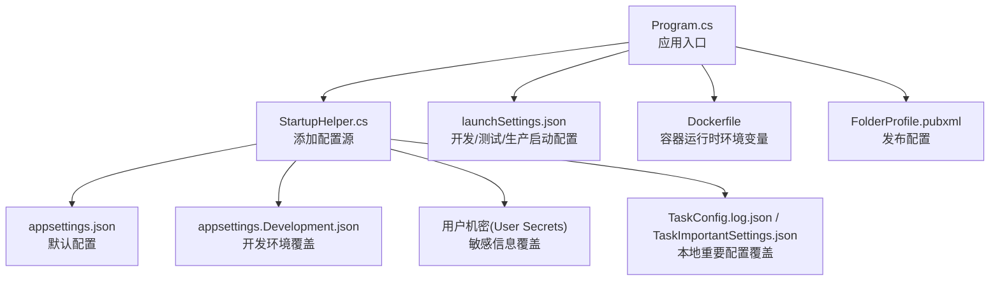
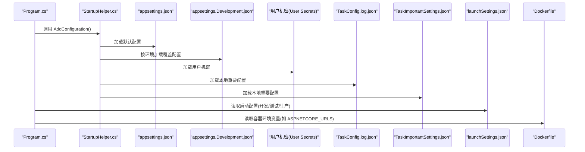
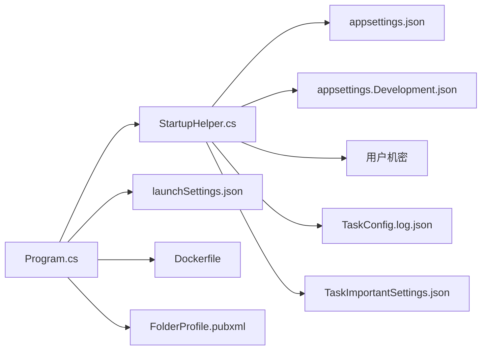

# 环境配置

<cite>
**本文引用的文件**
- [appsettings.json](file://Sylas.RemoteTasks.App/appsettings.json)
- [appsettings.Development.json](file://Sylas.RemoteTasks.App/appsettings.Development.json)
- [launchSettings.json](file://Sylas.RemoteTasks.App/Properties/launchSettings.json)
- [FolderProfile.pubxml](file://Sylas.RemoteTasks.App/Properties/PublishProfiles/FolderProfile.pubxml)
- [Dockerfile](file://Sylas.RemoteTasks.App/Dockerfile)
- [Program.cs](file://Sylas.RemoteTasks.App/Program.cs)
- [StartupHelper.cs](file://Sylas.RemoteTasks.App/Helpers/StartupHelper.cs)
- [Sylas.RemoteTasks.App.csproj](file://Sylas.RemoteTasks.App/Sylas.RemoteTasks.App.csproj)
- [DatabaseConstants.cs](file://Sylas.RemoteTasks.Utils/Constants/DatabaseConstants.cs)
- [DatabaseInfo.cs](file://Sylas.RemoteTasks.Database/SyncBase/DatabaseInfo.cs)
</cite>

## 目录
1. [简介](#简介)
2. [项目结构](#项目结构)
3. [核心组件](#核心组件)
4. [架构总览](#架构总览)
5. [详细组件分析](#详细组件分析)
6. [依赖关系分析](#依赖关系分析)
7. [性能考量](#性能考量)
8. [故障排查指南](#故障排查指南)
9. [结论](#结论)
10. [附录](#附录)

## 简介
本文件系统性梳理 Sylas.RemoteTasks 的环境配置，涵盖以下方面：
- appsettings.json 配置文件结构与字段说明
- 环境变量（含 ASP.NET Core 环境、Kestrel URL、时区等）
- 发布配置文件与启动设置
- 开发/测试/生产环境的差异化配置策略
- 数据库连接、身份认证、日志级别、性能相关配置
- 配置文件优先级与覆盖规则

## 项目结构
围绕环境配置的关键文件与位置如下：
- 应用配置：appsettings.json、appsettings.{Environment}.json
- 启动配置：launchSettings.json
- 发布配置：FolderProfile.pubxml
- 容器化：Dockerfile
- 程序入口：Program.cs
- 配置扩展：StartupHelper.cs
- 项目文件：Sylas.RemoteTasks.App.csproj
- 数据库常量：DatabaseConstants.cs
- 数据库连接解析：DatabaseInfo.cs

图表来源
- [Program.cs](file://Sylas.RemoteTasks.App/Program.cs#L12-L25)
- [StartupHelper.cs](file://Sylas.RemoteTasks.App/Helpers/StartupHelper.cs#L20-L25)
- [appsettings.json](file://Sylas.RemoteTasks.App/appsettings.json#L1-L142)
- [appsettings.Development.json](file://Sylas.RemoteTasks.App/appsettings.Development.json#L1-L4)
- [launchSettings.json](file://Sylas.RemoteTasks.App/Properties/launchSettings.json#L10-L36)
- [Dockerfile](file://Sylas.RemoteTasks.App/Dockerfile#L14-L15)
- [FolderProfile.pubxml](file://Sylas.RemoteTasks.App/Properties/PublishProfiles/FolderProfile.pubxml#L6-L18)

章节来源
- [Program.cs](file://Sylas.RemoteTasks.App/Program.cs#L12-L25)
- [StartupHelper.cs](file://Sylas.RemoteTasks.App/Helpers/StartupHelper.cs#L20-L25)
- [appsettings.json](file://Sylas.RemoteTasks.App/appsettings.json#L1-L142)
- [appsettings.Development.json](file://Sylas.RemoteTasks.App/appsettings.Development.json#L1-L4)
- [launchSettings.json](file://Sylas.RemoteTasks.App/Properties/launchSettings.json#L10-L36)
- [Dockerfile](file://Sylas.RemoteTasks.App/Dockerfile#L14-L15)
- [FolderProfile.pubxml](file://Sylas.RemoteTasks.App/Properties/PublishProfiles/FolderProfile.pubxml#L6-L18)

## 核心组件
- 配置加载顺序与优先级
  - 默认从 appsettings.json 加载基础配置
  - 若存在 appsettings.{Environment}.json，则按环境覆盖
  - 用户机密(User Secrets)与本地配置文件可进一步覆盖
  - 运行时环境变量可覆盖配置值
- 关键配置项
  - 日志：日志级别、控制台格式化器
  - 全局热键、允许主机、连接字符串关键词
  - 连接字符串、TCP/中心服务器、Web 服务地址
  - Kestrel 端点（注释示例）
  - 请求流水线（RequestPipeline）与数据处理器
  - 身份认证（IdentityServerConfiguration）
  - 邮件发送（Email Sender）
  - 进程监控（ProcessMonitor）
  - 解析器与模板（SlnDirs）

章节来源
- [StartupHelper.cs](file://Sylas.RemoteTasks.App/Helpers/StartupHelper.cs#L20-L25)
- [appsettings.json](file://Sylas.RemoteTasks.App/appsettings.json#L1-L142)

## 架构总览
下图展示配置在启动阶段的加载与覆盖流程。

图表来源
- [Program.cs](file://Sylas.RemoteTasks.App/Program.cs#L12-L25)
- [StartupHelper.cs](file://Sylas.RemoteTasks.App/Helpers/StartupHelper.cs#L20-L25)
- [appsettings.json](file://Sylas.RemoteTasks.App/appsettings.json#L1-L142)
- [appsettings.Development.json](file://Sylas.RemoteTasks.App/appsettings.Development.json#L1-L4)
- [launchSettings.json](file://Sylas.RemoteTasks.App/Properties/launchSettings.json#L10-L36)
- [Dockerfile](file://Sylas.RemoteTasks.App/Dockerfile#L14-L15)

## 详细组件分析

### 1) appsettings.json 结构与字段说明
- 日志配置（Logging）
  - Default、Microsoft.AspNetCore 的日志级别
  - 控制台输出格式化器名称与时间戳格式
- 全局热键（GlobalHotKeys）
  - 支持的热键列表（示例：Ctrl+Alt+Space）
- 允许主机（AllowedHosts）
  - 允许的主机名或通配符
- 允许的连接字符串关键字（AllowedConnectionStringKeywords）
  - 用于白名单校验的连接串关键字集合
- 连接字符串（ConnectionStrings.Default）
  - 默认数据库连接串（示例：本地 SQLite 文件）
- 服务端口与中心服务器（TcpPort、CenterServer、CenterServerPort、CenterWebServer）
  - TCP 端口、中心服务器域名、中心 Web 服务地址
- 首张表（FirstTable）
  - 初始化生成页面的目标表名
- 上传配置（Upload）
  - 客户端目录、主机地址、服务端保存目录
- AI 配置（AiConfig）
  - 服务地址、API Key、模型名称
- Kestrel 端点（Kestrel.Endpoints）
  - 注释示例展示了 HTTP/HTTPS 端点与证书配置
- 请求流水线（RequestPipeline.RequestProcessorDispatch）
  - 包含多个处理器调度项，每项支持：
    - Parameters：查询/筛选参数
    - DataContextBuilder：上下文构建模板
    - DataHandlers：数据处理器及其参数
    - RequestProcessorName/Url/Steps/Break：远程处理器调用配置
- 解析器与模板（SlnDirs）
  - 解决方案目录列表
- 身份认证（IdentityServerConfiguration）
  - Authority、RequireHttpsMetadata、EnableCaching、AdministrationRole、ApiName、ApiSecret、ClientId、ClientSecret、OidcResponseType、Scopes、CacheDuration
- 进程监控（ProcessMonitor.Names）
  - 监控的进程名列表
- 邮件发送（Email.Sender）
  - 发件人名称、地址、密码、SMTP 服务器、端口、是否使用 SSL

章节来源
- [appsettings.json](file://Sylas.RemoteTasks.App/appsettings.json#L1-L142)

### 2) appsettings.{Environment}.json 与用户机密
- appsettings.Development.json
  - 当前仓库中为空文件，可用于开发环境覆盖
- 用户机密（User Secrets）
  - 通过 StartupHelper.cs 添加，可在本地覆盖敏感配置
- 本地重要配置文件
  - TaskConfig.log.json、TaskImportantSettings.json 由 StartupHelper.cs 动态加载

章节来源
- [appsettings.Development.json](file://Sylas.RemoteTasks.App/appsettings.Development.json#L1-L4)
- [StartupHelper.cs](file://Sylas.RemoteTasks.App/Helpers/StartupHelper.cs#L20-L25)

### 3) 启动设置（launchSettings.json）
- IIS Express
  - applicationUrl、sslPort、匿名身份验证
- 自定义启动配置
  - http：HTTP 端口、环境变量 ASPNETCORE_ENVIRONMENT=Development
  - https：HTTPS/HTTP 双端口、环境变量 ASPNETCORE_ENVIRONMENT=Production
  - IIS Express：环境变量 ASPNETCORE_ENVIRONMENT=Development
- 环境变量优先级
  - 启动配置中的环境变量会影响运行时环境判断与配置加载

章节来源
- [launchSettings.json](file://Sylas.RemoteTasks.App/Properties/launchSettings.json#L10-L36)

### 4) 发布配置（FolderProfile.pubxml）
- 发布目标
  - FileSystem 发布，发布路径 bin\Release\net10.0\publish\
- 平台与框架
  - TargetFramework=net10.0，SelfContained=false
- 发布行为
  - DeleteExistingFiles、ExcludeApp_Data、LaunchSiteAfterPublish

章节来源
- [FolderProfile.pubxml](file://Sylas.RemoteTasks.App/Properties/PublishProfiles/FolderProfile.pubxml#L6-L18)

### 5) 容器化（Dockerfile）
- 基础镜像与运行时
  - 使用 ASP.NET 10.0 运行时镜像
- 环境变量
  - ASPNETCORE_URLS：容器监听 80/443
  - TZ：Asia/Shanghai
- 工作目录与暴露端口
  - WORKDIR /app；EXPOSE 80

章节来源
- [Dockerfile](file://Sylas.RemoteTasks.App/Dockerfile#L1-L21)

### 6) 程序入口（Program.cs）
- 配置加载
  - builder.AddConfiguration() 调用 StartupHelper.cs 中的扩展方法
- 身份认证与授权
  - AddAuthenticationService、AddAuthorization 策略
- Kestrel 限制
  - MaxRequestBodySize=null（上传文件无限制）

章节来源
- [Program.cs](file://Sylas.RemoteTasks.App/Program.cs#L12-L25)
- [Program.cs](file://Sylas.RemoteTasks.App/Program.cs#L74-L87)
- [Program.cs](file://Sylas.RemoteTasks.App/Program.cs#L14-L17)

### 7) 数据库连接配置要点
- 连接字符串关键字白名单
  - DatabaseConstants.cs 定义了连接串关键字数组
- 连接串解析
  - DatabaseInfo.cs 提供多种数据库类型的连接串解析逻辑
- 配置建议
  - 在 AllowedConnectionStringKeywords 中声明允许的关键字
  - 使用 TaskImportantSettings.json 或用户机密存放真实连接串

章节来源
- [DatabaseConstants.cs](file://Sylas.RemoteTasks.Utils/Constants/DatabaseConstants.cs#L1-L13)
- [DatabaseInfo.cs](file://Sylas.RemoteTasks.Database/SyncBase/DatabaseInfo.cs#L280-L296)

### 8) 身份认证配置要点
- IdentityServerConfiguration
  - Authority、ClientId/Secret、ApiName/Secret、Scopes、AdministrationRole
- 授权策略
  - 基于角色与作用域的策略，结合 JwtClaimTypes 角色与范围
- 运行时覆盖
  - 可通过用户机密或环境变量覆盖敏感值

章节来源
- [appsettings.json](file://Sylas.RemoteTasks.App/appsettings.json#L109-L121)
- [Program.cs](file://Sylas.RemoteTasks.App/Program.cs#L74-L87)

### 9) 日志级别与输出格式
- 默认日志级别
  - Default=Debug，Microsoft.AspNetCore=Warning
- 控制台输出
  - FormatterName=simple，时间戳格式自定义，可关闭包含 Scope
- SignalR 日志级别映射
  - trace/debug/info/warning/error/critical/none 映射到内部枚举

章节来源
- [appsettings.json](file://Sylas.RemoteTasks.App/appsettings.json#L2-L14)

### 10) 性能相关配置
- 上传文件大小
  - Kestrel 最大请求体大小设为无限制（MaxRequestBodySize=null）
- Kestrel 端点
  - 可通过注释示例启用 HTTPS 并指定证书与协议版本
- 进程监控
  - ProcessMonitor.Names 列表用于监控关键进程

章节来源
- [Program.cs](file://Sylas.RemoteTasks.App/Program.cs#L14-L17)
- [appsettings.json](file://Sylas.RemoteTasks.App/appsettings.json#L51-L64)
- [appsettings.json](file://Sylas.RemoteTasks.App/appsettings.json#L122-L124)

## 依赖关系分析
- 配置加载依赖链
  - Program.cs -> StartupHelper.AddConfiguration() -> appsettings.json -> appsettings.{Environment}.json -> 用户机密 -> 本地重要配置文件
- 环境变量影响
  - launchSettings.json 设置 ASPNETCORE_ENVIRONMENT
  - Dockerfile 设置 ASPNETCORE_URLS、TZ
- 发布与运行时差异
  - FolderProfile.pubxml 决定发布产物与运行框架
  - Dockerfile 决定容器内监听端口与环境变量

图表来源
- [Program.cs](file://Sylas.RemoteTasks.App/Program.cs#L12-L25)
- [StartupHelper.cs](file://Sylas.RemoteTasks.App/Helpers/StartupHelper.cs#L20-L25)
- [launchSettings.json](file://Sylas.RemoteTasks.App/Properties/launchSettings.json#L10-L36)
- [Dockerfile](file://Sylas.RemoteTasks.App/Dockerfile#L14-L15)
- [FolderProfile.pubxml](file://Sylas.RemoteTasks.App/Properties/PublishProfiles/FolderProfile.pubxml#L6-L18)

章节来源
- [Program.cs](file://Sylas.RemoteTasks.App/Program.cs#L12-L25)
- [StartupHelper.cs](file://Sylas.RemoteTasks.App/Helpers/StartupHelper.cs#L20-L25)
- [launchSettings.json](file://Sylas.RemoteTasks.App/Properties/launchSettings.json#L10-L36)
- [Dockerfile](file://Sylas.RemoteTasks.App/Dockerfile#L14-L15)
- [FolderProfile.pubxml](file://Sylas.RemoteTasks.App/Properties/PublishProfiles/FolderProfile.pubxml#L6-L18)

## 性能考量
- 上传性能
  - 将 MaxRequestBodySize 设为无限制以支持大文件上传
- 日志开销
  - 生产环境建议提升默认日志级别，减少 Debug/Trace 输出
- Kestrel 端点
  - 在生产环境启用 HTTPS 并配置 TLS 协议版本
- 进程监控
  - 合理配置 ProcessMonitor.Names，避免过多进程检查带来的开销

## 故障排查指南
- 配置未生效
  - 检查 appsettings.{Environment}.json 是否正确命名且位于输出目录
  - 确认用户机密已正确配置且未被忽略
- 身份认证失败
  - 核对 IdentityServerConfiguration 中的 Authority、ClientId/Secret、ApiName/Secret、Scopes
  - 确保 RequireHttpsMetadata 与实际部署环境一致
- 数据库连接异常
  - 确认连接串关键字在 AllowedConnectionStringKeywords 中
  - 使用 TaskImportantSettings.json 存放真实连接串
- 日志级别过高导致性能下降
  - 调整 Logging.Default 与 Console.FormatterOptions
- 上传失败
  - 检查 Kestrel 最大请求体大小设置
- 容器访问异常
  - 确认 Dockerfile 中 ASPNETCORE_URLS 与 EXPOSE 端口匹配

章节来源
- [appsettings.json](file://Sylas.RemoteTasks.App/appsettings.json#L1-L142)
- [appsettings.json](file://Sylas.RemoteTasks.App/appsettings.json#L109-L121)
- [appsettings.json](file://Sylas.RemoteTasks.App/appsettings.json#L20-L23)
- [Program.cs](file://Sylas.RemoteTasks.App/Program.cs#L14-L17)
- [Dockerfile](file://Sylas.RemoteTasks.App/Dockerfile#L14-L15)

## 结论
- 通过多层配置源（默认、环境、用户机密、本地重要配置）与环境变量，实现灵活的开发/测试/生产差异化配置
- 建议在生产环境启用 HTTPS、收紧日志级别、使用用户机密与本地重要配置文件存放敏感信息
- 发布与容器化应与配置保持一致，确保端口、URL 与环境变量匹配

## 附录

### A. 环境变量清单
- ASPNETCORE_ENVIRONMENT
  - 用途：决定加载 appsettings.{Environment}.json 与中间件行为
  - 示例值：Development、Production
- ASPNETCORE_URLS
  - 用途：容器内监听地址（如 http://+:80;https://+:443）
- TZ
  - 用途：容器内时区设置（如 Asia/Shanghai）

章节来源
- [launchSettings.json](file://Sylas.RemoteTasks.App/Properties/launchSettings.json#L16-L26)
- [Dockerfile](file://Sylas.RemoteTasks.App/Dockerfile#L12-L15)

### B. 配置文件优先级与覆盖规则
- 优先级（从高到低）
  1) 运行时环境变量
  2) 用户机密（User Secrets）
  3) 本地重要配置文件（TaskConfig.log.json、TaskImportantSettings.json）
  4) appsettings.{Environment}.json
  5) appsettings.json
- 覆盖方式
  - 字段级覆盖：后加载的配置覆盖先前配置
  - 数组字段：通常整体替换而非合并（需按具体实现确认）

章节来源
- [StartupHelper.cs](file://Sylas.RemoteTasks.App/Helpers/StartupHelper.cs#L20-L25)
- [appsettings.json](file://Sylas.RemoteTasks.App/appsettings.json#L1-L142)
- [appsettings.Development.json](file://Sylas.RemoteTasks.App/appsettings.Development.json#L1-L4)

### C. 发布与启动策略建议
- 开发环境
  - 使用 launchSettings.json 的 http/https 配置，ASPNETCORE_ENVIRONMENT=Development
  - 启用用户机密存放敏感信息
- 测试环境
  - 使用 FolderProfile.pubxml 发布到测试目录
  - 在容器中设置 ASPNETCORE_ENVIRONMENT=Staging
- 生产环境
  - 使用 FolderProfile.pubxml 发布到生产目录
  - 在容器中设置 ASPNETCORE_ENVIRONMENT=Production
  - 确保 HTTPS 端点与证书配置生效

章节来源
- [launchSettings.json](file://Sylas.RemoteTasks.App/Properties/launchSettings.json#L10-L36)
- [FolderProfile.pubxml](file://Sylas.RemoteTasks.App/Properties/PublishProfiles/FolderProfile.pubxml#L6-L18)
- [Dockerfile](file://Sylas.RemoteTasks.App/Dockerfile#L14-L15)