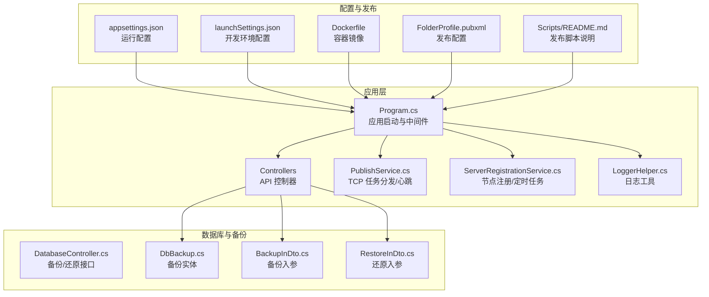
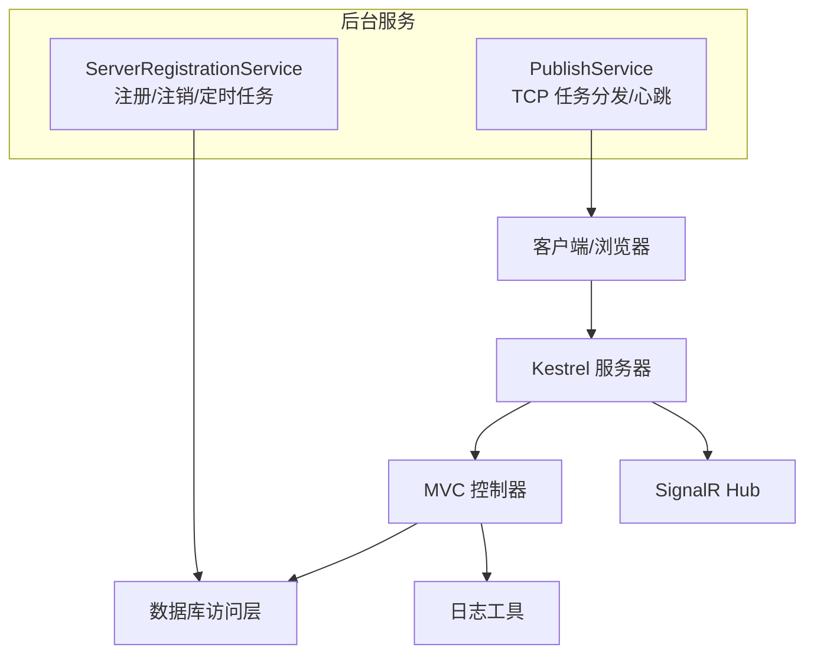
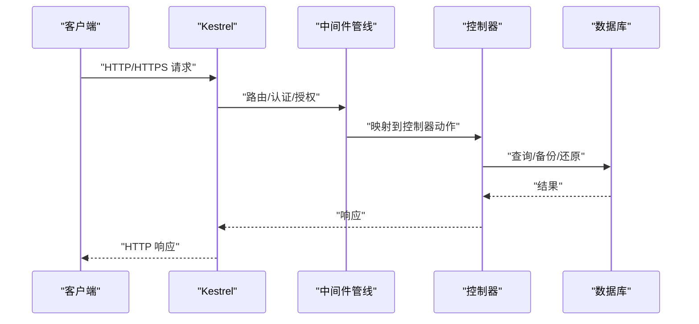
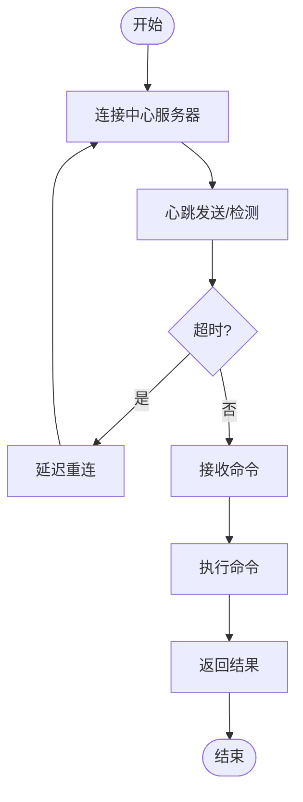
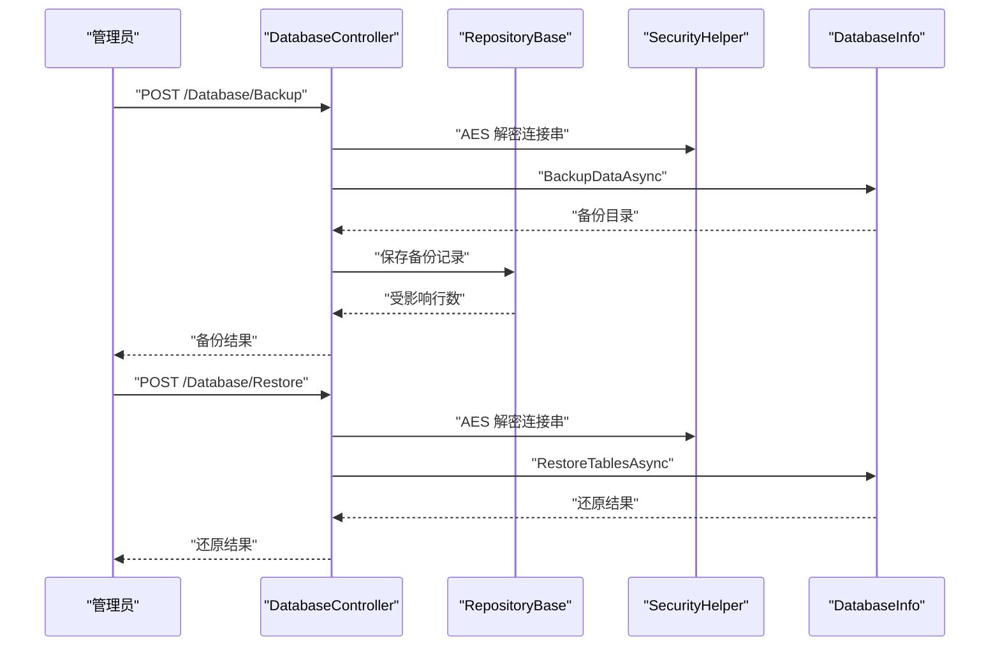
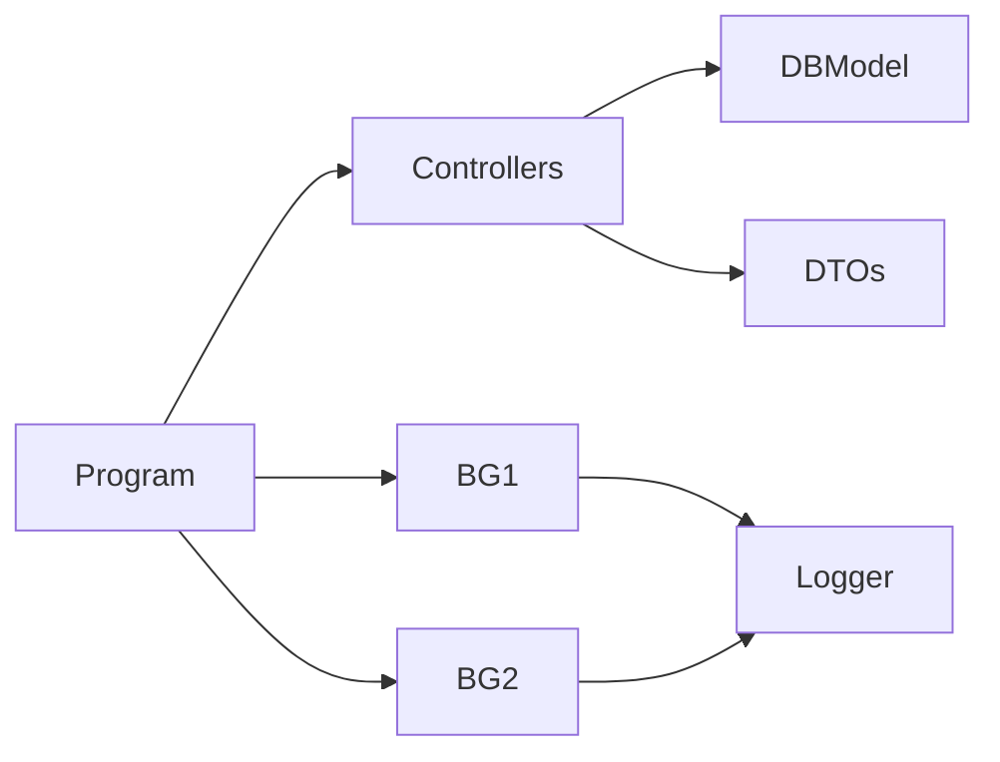

# 部署和运维

<cite>
**本文引用的文件**
- [Dockerfile](file://Sylas.RemoteTasks.App/Dockerfile)
- [appsettings.json](file://Sylas.RemoteTasks.App/appsettings.json)
- [Program.cs](file://Sylas.RemoteTasks.App/Program.cs)
- [launchSettings.json](file://Sylas.RemoteTasks.App/Properties/launchSettings.json)
- [FolderProfile.pubxml](file://Sylas.RemoteTasks.App/Properties/PublishProfiles/FolderProfile.pubxml)
- [README.md（Scripts）](file://Scripts/README.md)
- [LoggerHelper.cs](file://Sylas.RemoteTasks.Common/LoggerHelper.cs)
- [PublishService.cs](file://Sylas.RemoteTasks.App/BackgroundServices/PublishService.cs)
- [ServerRegistrationService.cs](file://Sylas.RemoteTasks.App/BackgroundServices/ServerRegistrationService.cs)
- [DatabaseController.cs](file://Sylas.RemoteTasks.App/Controllers/DatabaseController.cs)
- [DbBackup.cs](file://Sylas.RemoteTasks.App/DatabaseManager/Models/DbBackup.cs)
- [BackupInDto.cs](file://Sylas.RemoteTasks.App/DatabaseManager/Models/Dtos/BackupInDto.cs)
- [RestoreInDto.cs](file://Sylas.RemoteTasks.App/DatabaseManager/Models/Dtos/RestoreInDto.cs)
- [SystemCmd.cs](file://Sylas.RemoteTasks.Utils/CommandExecutor/SystemCmd.cs)
</cite>

## 目录
1. [简介](#简介)
2. [项目结构](#项目结构)
3. [核心组件](#核心组件)
4. [架构总览](#架构总览)
5. [详细组件分析](#详细组件分析)
6. [依赖关系分析](#依赖关系分析)
7. [性能考量](#性能考量)
8. [故障排除指南](#故障排除指南)
9. [结论](#结论)
10. [附录](#附录)

## 简介
本文件面向 Sylas.RemoteTasks 的部署与运维团队，提供从 Docker 部署配置、环境变量与配置文件管理、性能监控、日志管理到故障排除、备份恢复与灾难恢复的全栈运维指南。文档结合仓库中的实际配置与代码，给出可落地的步骤、最佳实践与安全建议，并针对常见问题提供排障思路。

## 项目结构
Sylas.RemoteTasks 采用 .NET 10（容器镜像基于 aspnet 10.0）构建，核心应用位于 Sylas.RemoteTasks.App，包含：
- Web 应用入口与配置：Program.cs、appsettings.json、launchSettings.json
- Docker 容器化：Dockerfile
- 发布配置：FolderProfile.pubxml
- 运维相关后台服务：PublishService（TCP 任务分发与心跳）、ServerRegistrationService（服务节点注册/注销与定时任务调度）
- 数据库备份与还原：DatabaseController、DbBackup 实体与 DTO
- 日志工具：LoggerHelper
- 系统信息采集：SystemCmd（用于监控）

图表来源
- [Program.cs](file://Sylas.RemoteTasks.App/Program.cs#L1-L122)
- [appsettings.json](file://Sylas.RemoteTasks.App/appsettings.json#L1-L142)
- [launchSettings.json](file://Sylas.RemoteTasks.App/Properties/launchSettings.json#L1-L38)
- [Dockerfile](file://Sylas.RemoteTasks.App/Dockerfile#L1-L21)
- [FolderProfile.pubxml](file://Sylas.RemoteTasks.App/Properties/PublishProfiles/FolderProfile.pubxml#L1-L21)
- [DatabaseController.cs](file://Sylas.RemoteTasks.App/Controllers/DatabaseController.cs#L1-L235)
- [DbBackup.cs](file://Sylas.RemoteTasks.App/DatabaseManager/Models/DbBackup.cs#L1-L47)
- [BackupInDto.cs](file://Sylas.RemoteTasks.App/DatabaseManager/Models/Dtos/BackupInDto.cs#L1-L25)
- [RestoreInDto.cs](file://Sylas.RemoteTasks.App/DatabaseManager/Models/Dtos/RestoreInDto.cs#L1-L21)

章节来源
- [Program.cs](file://Sylas.RemoteTasks.App/Program.cs#L1-L122)
- [appsettings.json](file://Sylas.RemoteTasks.App/appsettings.json#L1-L142)
- [launchSettings.json](file://Sylas.RemoteTasks.App/Properties/launchSettings.json#L1-L38)
- [Dockerfile](file://Sylas.RemoteTasks.App/Dockerfile#L1-L21)
- [FolderProfile.pubxml](file://Sylas.RemoteTasks.App/Properties/PublishProfiles/FolderProfile.pubxml#L1-L21)
- [DatabaseController.cs](file://Sylas.RemoteTasks.App/Controllers/DatabaseController.cs#L1-L235)
- [DbBackup.cs](file://Sylas.RemoteTasks.App/DatabaseManager/Models/DbBackup.cs#L1-L47)
- [BackupInDto.cs](file://Sylas.RemoteTasks.App/DatabaseManager/Models/Dtos/BackupInDto.cs#L1-L25)
- [RestoreInDto.cs](file://Sylas.RemoteTasks.App/DatabaseManager/Models/Dtos/RestoreInDto.cs#L1-L21)

## 核心组件
- 应用启动与中间件管线：Program.cs 负责注册服务、认证授权、路由、SignalR、异常处理与 HTTPS/HSTS 等。
- 配置体系：appsettings.json 提供日志、连接串、Kestrel 端点、请求管道、身份认证、进程监控、邮件等配置；launchSettings.json 提供开发环境 URL 与环境变量。
- Docker 容器：Dockerfile 指定基础镜像、时区、暴露端口、工作目录与入口命令。
- 发布配置：FolderProfile.pubxml 定义发布目标与平台框架。
- 运维后台服务：
  - PublishService：负责 TCP 任务分发、与中心服务器的心跳、命令下发与结果回传。
  - ServerRegistrationService：服务节点注册/注销、创建节点表、基于 Cron 的定时任务调度。
- 数据库备份与还原：DatabaseController 提供备份/还原接口，DbBackup 与 DTOs 描述备份元数据与入参。
- 日志工具：LoggerHelper 提供控制台与文件日志记录能力。
- 系统信息采集：SystemCmd 提供系统与应用运行信息采集（CPU、内存、磁盘、进程等），可用于监控。

章节来源
- [Program.cs](file://Sylas.RemoteTasks.App/Program.cs#L1-L122)
- [appsettings.json](file://Sylas.RemoteTasks.App/appsettings.json#L1-L142)
- [launchSettings.json](file://Sylas.RemoteTasks.App/Properties/launchSettings.json#L1-L38)
- [Dockerfile](file://Sylas.RemoteTasks.App/Dockerfile#L1-L21)
- [FolderProfile.pubxml](file://Sylas.RemoteTasks.App/Properties/PublishProfiles/FolderProfile.pubxml#L1-L21)
- [PublishService.cs](file://Sylas.RemoteTasks.App/BackgroundServices/PublishService.cs#L1-L645)
- [ServerRegistrationService.cs](file://Sylas.RemoteTasks.App/BackgroundServices/ServerRegistrationService.cs#L1-L493)
- [DatabaseController.cs](file://Sylas.RemoteTasks.App/Controllers/DatabaseController.cs#L1-L235)
- [LoggerHelper.cs](file://Sylas.RemoteTasks.Common/LoggerHelper.cs#L1-L115)
- [SystemCmd.cs](file://Sylas.RemoteTasks.Utils/CommandExecutor/SystemCmd.cs#L672-L712)

## 架构总览
应用采用 Kestrel 作为 Web 服务器，支持 HTTP/HTTPS；通过 SignalR 提供实时通信；后台服务负责节点注册、定时任务与 TCP 任务分发。数据库备份/还原通过控制器接口实现，日志同时输出到控制台与文件。

图表来源
- [Program.cs](file://Sylas.RemoteTasks.App/Program.cs#L90-L122)
- [ServerRegistrationService.cs](file://Sylas.RemoteTasks.App/BackgroundServices/ServerRegistrationService.cs#L55-L110)
- [PublishService.cs](file://Sylas.RemoteTasks.App/BackgroundServices/PublishService.cs#L88-L120)

## 详细组件分析

### Docker 部署配置
- 基础镜像与运行时：使用 aspnet 10.0 运行时镜像，减少体积与攻击面。
- 时区与时钟：设置 Asia/Shanghai。
- 端口暴露：默认暴露 80（HTTP），可通过环境变量 ASPNETCORE_URLS 覆盖。
- 入口命令：以 DLL 方式运行应用，便于在 docker run 时追加参数（如 --urls、--environment）。
- 中国镜像源：替换 apt 源为北京外国语大学镜像，提升安装速度。
- 依赖安装：安装 vim 便于容器内排查。

建议
- 生产环境固定镜像标签，避免使用 latest。
- 使用只读根文件系统与最小权限运行容器。
- 通过环境变量注入敏感配置（如连接串、证书），避免硬编码在镜像中。

章节来源
- [Dockerfile](file://Sylas.RemoteTasks.App/Dockerfile#L1-L21)

### 环境配置与密钥管理
- appsettings.json
  - 日志：控制台格式化、时间戳、默认级别。
  - 全局热键、允许主机、连接串关键字白名单、TCP 端口、中心服务器地址与 Web 地址、首张表名等。
  - Kestrel：可选内联证书与 TLS 协议配置（注释示例）。
  - 请求管道：定义 RequestProcessor 调度与数据处理器链路。
  - IdentityServer：鉴权配置（Authority、ClientId/Secret、Scopes、缓存时长）。
  - 进程监控：监控进程名列表。
  - 邮件：发件人信息（SMTP 服务器、端口、SSL）。
- launchSettings.json
  - 开发环境 HTTP/HTTPS 端口与环境变量（Development/Production）。
- FolderProfile.pubxml
  - 发布目标目录、平台框架、是否自包含等。

建议
- 生产环境使用 appsettings.Production.json 或通过环境变量覆盖敏感项。
- 使用 Azure Key Vault/AWS Secrets Manager 等集中式密钥管理。
- 严格限制 AllowedConnectionStringKeywords，避免误用高权限连接串。

章节来源
- [appsettings.json](file://Sylas.RemoteTasks.App/appsettings.json#L1-L142)
- [launchSettings.json](file://Sylas.RemoteTasks.App/Properties/launchSettings.json#L1-L38)
- [FolderProfile.pubxml](file://Sylas.RemoteTasks.App/Properties/PublishProfiles/FolderProfile.pubxml#L1-L21)

### 性能监控与可观测性
- 日志
  - 控制台日志：简单格式，带时间戳。
  - 文件日志：LoggerHelper 支持异步追加与异常兜底。
- 系统资源
  - SystemCmd 提供 CPU、内存、磁盘、进程等信息采集，可用于监控面板或告警。
- TCP 心跳与命令执行
  - PublishService 维护心跳频率与超时检测，记录心跳日志到 Logs/Heartbeats。
  - ServerRegistrationService 基于 Cron 的任务调度，支持取消与并发控制。

建议
- 结合 Prometheus/Grafana 或云监控平台采集 SystemCmd 输出。
- 为心跳日志与命令日志设置轮转策略与保留周期。
- 对长时间运行的定时任务增加超时与重试上限。

章节来源
- [LoggerHelper.cs](file://Sylas.RemoteTasks.Common/LoggerHelper.cs#L1-L115)
- [SystemCmd.cs](file://Sylas.RemoteTasks.Utils/CommandExecutor/SystemCmd.cs#L672-L712)
- [PublishService.cs](file://Sylas.RemoteTasks.App/BackgroundServices/PublishService.cs#L48-L86)
- [ServerRegistrationService.cs](file://Sylas.RemoteTasks.App/BackgroundServices/ServerRegistrationService.cs#L182-L341)

### 日志管理
- 控制台日志：统一格式化输出，便于容器日志收集。
- 文件日志：按日期分文件，异常时降级输出控制台。
- 心跳日志：单独目录 Logs/Heartbeats，便于排查网络与连接问题。

建议
- 使用 Fluentd/Vector/Loki 等集中式日志收集。
- 设置日志轮转（大小/时间），避免磁盘占满。
- 对敏感字段脱敏（如连接串）。

章节来源
- [LoggerHelper.cs](file://Sylas.RemoteTasks.Common/LoggerHelper.cs#L48-L112)
- [PublishService.cs](file://Sylas.RemoteTasks.App/BackgroundServices/PublishService.cs#L80-L86)

### 故障排除流程

#### 应用启动与中间件
- HTTPS/HSTS：非开发环境启用 HSTS；确保证书与 URL 配置正确。
- 异常处理：全局异常处理器返回统一结构。
- 身份认证/授权：确认 IdentityServer 配置与作用域/角色策略一致。

图表来源
- [Program.cs](file://Sylas.RemoteTasks.App/Program.cs#L90-L122)
- [DatabaseController.cs](file://Sylas.RemoteTasks.App/Controllers/DatabaseController.cs#L115-L137)

#### TCP 任务分发与心跳
- 心跳频率与超时：心跳频率与超时阈值影响重连与任务下发稳定性。
- 粘包/断包：接收端需处理“000000”结束标志，避免消息截断。
- 子节点连接：同一主机多实例需区分实例路径，避免旧连接干扰。

图表来源
- [PublishService.cs](file://Sylas.RemoteTasks.App/BackgroundServices/PublishService.cs#L443-L624)

#### 备份/还原
- 备份：加密连接串解密后执行备份，记录备份目录与大小。
- 还原：校验目标连接串关键字白名单，再执行还原。

图表来源
- [DatabaseController.cs](file://Sylas.RemoteTasks.App/Controllers/DatabaseController.cs#L115-L137)
- [DatabaseController.cs](file://Sylas.RemoteTasks.App/Controllers/DatabaseController.cs#L213-L232)
- [DbBackup.cs](file://Sylas.RemoteTasks.App/DatabaseManager/Models/DbBackup.cs#L1-L47)
- [BackupInDto.cs](file://Sylas.RemoteTasks.App/DatabaseManager/Models/Dtos/BackupInDto.cs#L1-L25)
- [RestoreInDto.cs](file://Sylas.RemoteTasks.App/DatabaseManager/Models/Dtos/RestoreInDto.cs#L1-L21)

章节来源
- [Program.cs](file://Sylas.RemoteTasks.App/Program.cs#L90-L122)
- [DatabaseController.cs](file://Sylas.RemoteTasks.App/Controllers/DatabaseController.cs#L115-L137)
- [DatabaseController.cs](file://Sylas.RemoteTasks.App/Controllers/DatabaseController.cs#L213-L232)
- [DbBackup.cs](file://Sylas.RemoteTasks.App/DatabaseManager/Models/DbBackup.cs#L1-L47)
- [BackupInDto.cs](file://Sylas.RemoteTasks.App/DatabaseManager/Models/Dtos/BackupInDto.cs#L1-L25)
- [RestoreInDto.cs](file://Sylas.RemoteTasks.App/DatabaseManager/Models/Dtos/RestoreInDto.cs#L1-L21)

## 依赖关系分析
- 组件耦合
  - Program.cs 作为入口，集中注册服务与中间件，耦合度适中。
  - PublishService 与 ServerRegistrationService 依赖 DI 容器与配置，分别处理网络与调度。
  - DatabaseController 依赖仓储与安全工具，职责清晰。
- 外部依赖
  - Kestrel、SignalR、IdentityServer、数据库驱动与备份工具。
- 循环依赖
  - 未见直接循环依赖迹象；各模块通过接口与仓储解耦。

图表来源
- [Program.cs](file://Sylas.RemoteTasks.App/Program.cs#L1-L122)
- [PublishService.cs](file://Sylas.RemoteTasks.App/BackgroundServices/PublishService.cs#L1-L645)
- [ServerRegistrationService.cs](file://Sylas.RemoteTasks.App/BackgroundServices/ServerRegistrationService.cs#L1-L493)
- [DatabaseController.cs](file://Sylas.RemoteTasks.App/Controllers/DatabaseController.cs#L1-L235)

章节来源
- [Program.cs](file://Sylas.RemoteTasks.App/Program.cs#L1-L122)
- [PublishService.cs](file://Sylas.RemoteTasks.App/BackgroundServices/PublishService.cs#L1-L645)
- [ServerRegistrationService.cs](file://Sylas.RemoteTasks.App/BackgroundServices/ServerRegistrationService.cs#L1-L493)
- [DatabaseController.cs](file://Sylas.RemoteTasks.App/Controllers/DatabaseController.cs#L1-L235)

## 性能考量
- 上传文件：Kestrel 请求体大小无限制，适合大文件上传，但需注意磁盘与网络带宽。
- 心跳与重连：合理设置心跳频率与超时阈值，避免频繁重连造成抖动。
- 定时任务：并发调度与取消令牌控制，避免重复执行与资源争用。
- 日志：文件异步写入与异常兜底，避免 IO 阻塞。

章节来源
- [Program.cs](file://Sylas.RemoteTasks.App/Program.cs#L14-L17)
- [PublishService.cs](file://Sylas.RemoteTasks.App/BackgroundServices/PublishService.cs#L38-L42)
- [ServerRegistrationService.cs](file://Sylas.RemoteTasks.App/BackgroundServices/ServerRegistrationService.cs#L182-L341)
- [LoggerHelper.cs](file://Sylas.RemoteTasks.Common/LoggerHelper.cs#L48-L112)

## 故障排除指南
- 启动失败
  - 检查 appsettings 与 launchSettings 的端口与证书配置。
  - 确认环境变量 ASPNETCORE_URLS 与容器端口映射一致。
- TCP 连接异常
  - 查看 Logs/Heartbeats 心跳日志，确认心跳频率与超时。
  - 检查中心服务器地址与端口配置，确保网络连通。
- 备份/还原失败
  - 校验连接串关键字白名单与 AES 加解密。
  - 确认备份目录存在且有足够空间。
- 日志缺失
  - 检查日志目录权限与磁盘配额。
  - 使用集中式日志收集器验证采集规则。

章节来源
- [appsettings.json](file://Sylas.RemoteTasks.App/appsettings.json#L51-L64)
- [launchSettings.json](file://Sylas.RemoteTasks.App/Properties/launchSettings.json#L10-L38)
- [Dockerfile](file://Sylas.RemoteTasks.App/Dockerfile#L14-L18)
- [LoggerHelper.cs](file://Sylas.RemoteTasks.Common/LoggerHelper.cs#L48-L112)
- [DatabaseController.cs](file://Sylas.RemoteTasks.App/Controllers/DatabaseController.cs#L224-L228)

## 结论
通过合理的 Docker 镜像与环境配置、完善的日志与监控、健壮的后台服务与备份/还原机制，Sylas.RemoteTasks 可在生产环境中稳定运行。建议持续完善密钥管理、日志轮转与告警策略，并定期演练备份恢复与灾难恢复流程。

## 附录

### 部署脚本与发布
- 发布 Nuget 包脚本说明：位于 Scripts/README.md，指导如何设置 API Key 与版本并运行 PowerShell 发布。
- 发布配置：FolderProfile.pubxml 定义发布目标与框架。

章节来源
- [README.md（Scripts）](file://Scripts/README.md#L1-L9)
- [FolderProfile.pubxml](file://Sylas.RemoteTasks.App/Properties/PublishProfiles/FolderProfile.pubxml#L1-L21)

### 备份恢复策略与灾难恢复
- 备份
  - 通过 DatabaseController 的 /Database/Backup 接口执行备份，自动记录备份目录与大小。
  - 备份记录保存在 DbBackups 表，包含连接信息 ID、域名、名称、路径与备注。
- 还原
  - 通过 /Database/Restore 接口执行还原，校验目标连接串关键字白名单。
- 灾难恢复
  - 建议：定期验证备份可用性与还原流程；将备份目录与数据库分离存储；制定 RPO/RTO 指标并演练。

章节来源
- [DatabaseController.cs](file://Sylas.RemoteTasks.App/Controllers/DatabaseController.cs#L115-L137)
- [DatabaseController.cs](file://Sylas.RemoteTasks.App/Controllers/DatabaseController.cs#L213-L232)
- [DbBackup.cs](file://Sylas.RemoteTasks.App/DatabaseManager/Models/DbBackup.cs#L1-L47)
- [BackupInDto.cs](file://Sylas.RemoteTasks.App/DatabaseManager/Models/Dtos/BackupInDto.cs#L1-L25)
- [RestoreInDto.cs](file://Sylas.RemoteTasks.App/DatabaseManager/Models/Dtos/RestoreInDto.cs#L1-L21)