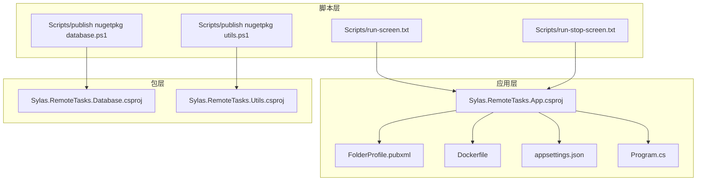
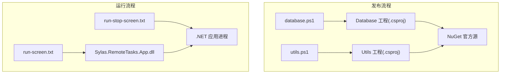
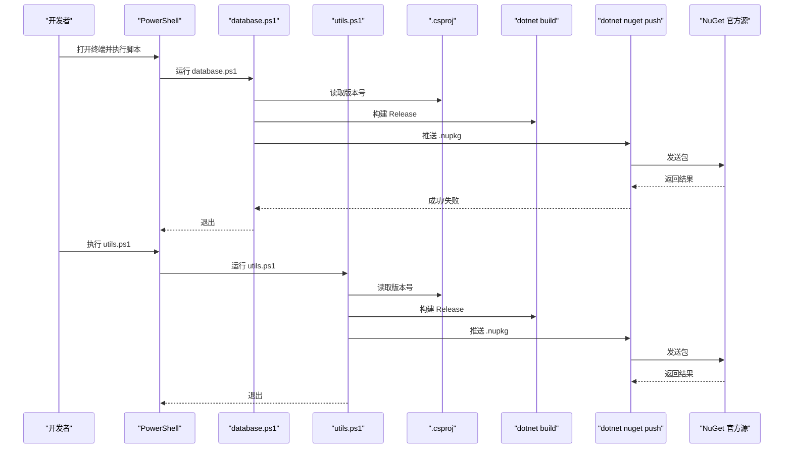
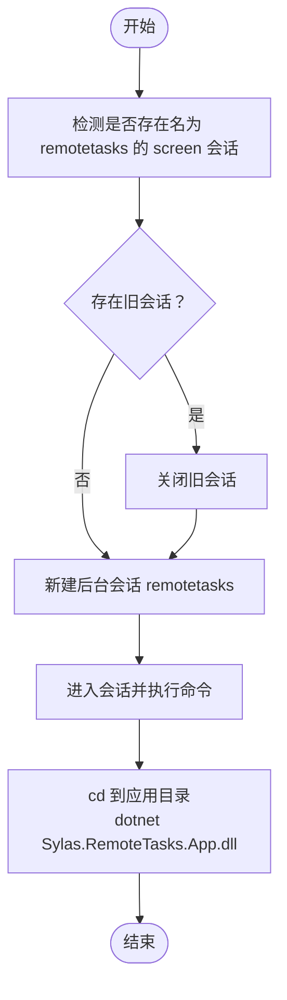
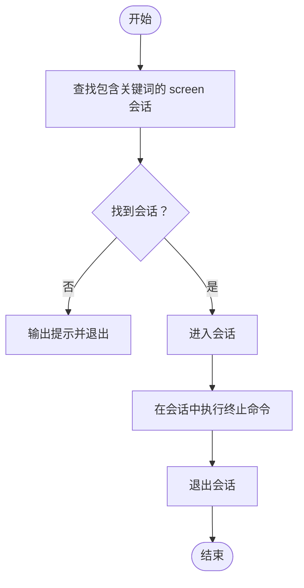
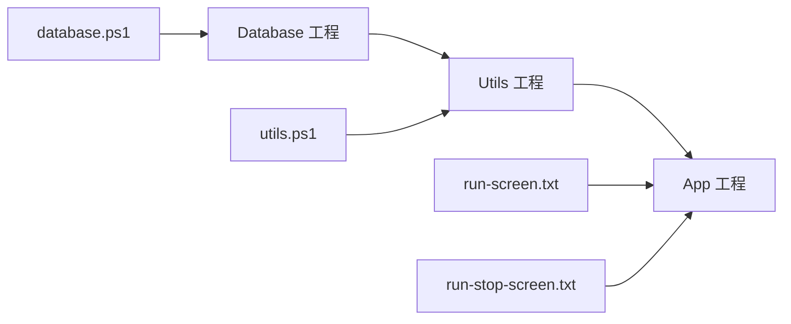

# 部署脚本

<cite>
**本文引用的文件**
- [Scripts/README.md](file://Scripts/README.md)
- [Scripts/publish nugetpkg database.ps1](file://Scripts/publish%20nugetpkg%20database.ps1)
- [Scripts/publish nugetpkg utils.ps1](file://Scripts/publish%20nugetpkg%20utils.ps1)
- [Scripts/run-screen.txt](file://Scripts/run-screen.txt)
- [Scripts/run-stop-screen.txt](file://Scripts/run-stop-screen.txt)
- [Sylas.RemoteTasks.App/Sylas.RemoteTasks.App.csproj](file://Sylas.RemoteTasks.App/Sylas.RemoteTasks.App.csproj)
- [Sylas.RemoteTasks.App/Properties/PublishProfiles/FolderProfile.pubxml](file://Sylas.RemoteTasks.App/Properties/PublishProfiles/FolderProfile.pubxml)
- [Sylas.RemoteTasks.App/Dockerfile](file://Sylas.RemoteTasks.App/Dockerfile)
- [Sylas.RemoteTasks.App/appsettings.json](file://Sylas.RemoteTasks.App/appsettings.json)
- [Sylas.RemoteTasks.App/Program.cs](file://Sylas.RemoteTasks.App/Program.cs)
- [Sylas.RemoteTasks.Database/Sylas.RemoteTasks.Database.csproj](file://Sylas.RemoteTasks.Database/Sylas.RemoteTasks.Database.csproj)
- [Sylas.RemoteTasks.Utils/Sylas.RemoteTasks.Utils.csproj](file://Sylas.RemoteTasks.Utils/Sylas.RemoteTasks.Utils.csproj)
- [Sylas.RemoteTasks.Database/README.md](file://Sylas.RemoteTasks.Database/README.md)
- [Sylas.RemoteTasks.Utils/README.md](file://Sylas.RemoteTasks.Utils/README.md)
</cite>

## 目录
1. [简介](#简介)
2. [项目结构](#项目结构)
3. [核心组件](#核心组件)
4. [架构总览](#架构总览)
5. [详细组件分析](#详细组件分析)
6. [依赖关系分析](#依赖关系分析)
7. [性能考虑](#性能考虑)
8. [故障排查指南](#故障排查指南)
9. [结论](#结论)
10. [附录](#附录)

## 简介
本文件面向 Sylas.RemoteTasks 的部署与运维场景，系统化梳理并说明以下三类脚本的功能与使用方法：
- NuGet 包发布脚本：自动读取项目版本、构建 Release 并推送至 NuGet 官方源。
- 运行脚本：在 Linux 环境下通过 screen 会话托管应用进程，支持重启与清理旧会话。
- 停止脚本：定位 screen 会话并尝试优雅终止应用进程。

同时给出自动化部署流程、版本管理与回滚策略、脚本参数说明、错误处理与重试机制、执行环境要求与权限设置，以及部署前后检查清单与验证步骤。

## 项目结构
围绕部署相关的关键文件与目录如下：
- Scripts：包含 NuGet 发布与 Linux screen 托管脚本
- Sylas.RemoteTasks.App：ASP.NET 应用工程，含发布配置与 Dockerfile
- Sylas.RemoteTasks.Database 与 Sylas.RemoteTasks.Utils：被发布的 NuGet 包工程

图表来源
- [Scripts/publish nugetpkg database.ps1](file://Scripts/publish%20nugetpkg%20database.ps1#L1-L29)
- [Scripts/publish nugetpkg utils.ps1](file://Scripts/publish%20nugetpkg%20utils.ps1#L1-L29)
- [Scripts/run-screen.txt](file://Scripts/run-screen.txt#L1-L7)
- [Scripts/run-stop-screen.txt](file://Scripts/run-stop-screen.txt#L1-L23)
- [Sylas.RemoteTasks.App/Sylas.RemoteTasks.App.csproj](file://Sylas.RemoteTasks.App/Sylas.RemoteTasks.App.csproj#L1-L61)
- [Sylas.RemoteTasks.App/Properties/PublishProfiles/FolderProfile.pubxml](file://Sylas.RemoteTasks.App/Properties/PublishProfiles/FolderProfile.pubxml#L1-L21)
- [Sylas.RemoteTasks.App/Dockerfile](file://Sylas.RemoteTasks.App/Dockerfile#L1-L21)
- [Sylas.RemoteTasks.App/appsettings.json](file://Sylas.RemoteTasks.App/appsettings.json#L1-L142)
- [Sylas.RemoteTasks.App/Program.cs](file://Sylas.RemoteTasks.App/Program.cs#L1-L122)
- [Sylas.RemoteTasks.Database/Sylas.RemoteTasks.Database.csproj](file://Sylas.RemoteTasks.Database/Sylas.RemoteTasks.Database.csproj#L1-L52)
- [Sylas.RemoteTasks.Utils/Sylas.RemoteTasks.Utils.csproj](file://Sylas.RemoteTasks.Utils/Sylas.RemoteTasks.Utils.csproj#L1-L47)

章节来源
- [Scripts/README.md](file://Scripts/README.md#L1-L9)
- [Sylas.RemoteTasks.App/Sylas.RemoteTasks.App.csproj](file://Sylas.RemoteTasks.App/Sylas.RemoteTasks.App.csproj#L1-L61)
- [Sylas.RemoteTasks.App/Properties/PublishProfiles/FolderProfile.pubxml](file://Sylas.RemoteTasks.App/Properties/PublishProfiles/FolderProfile.pubxml#L1-L21)
- [Sylas.RemoteTasks.App/Dockerfile](file://Sylas.RemoteTasks.App/Dockerfile#L1-L21)
- [Sylas.RemoteTasks.App/appsettings.json](file://Sylas.RemoteTasks.App/appsettings.json#L1-L142)
- [Sylas.RemoteTasks.App/Program.cs](file://Sylas.RemoteTasks.App/Program.cs#L1-L122)
- [Sylas.RemoteTasks.Database/Sylas.RemoteTasks.Database.csproj](file://Sylas.RemoteTasks.Database/Sylas.RemoteTasks.Database.csproj#L1-L52)
- [Sylas.RemoteTasks.Utils/Sylas.RemoteTasks.Utils.csproj](file://Sylas.RemoteTasks.Utils/Sylas.RemoteTasks.Utils.csproj#L1-L47)

## 核心组件
- NuGet 包发布脚本
  - database.ps1：读取数据库工具包工程版本，构建 Release 并推送至官方 NuGet 源；依赖外部密钥文件路径。
  - utils.ps1：读取通用工具包工程版本，构建 Release 并推送至官方 NuGet 源；依赖外部密钥文件路径。
- 运行脚本 run-screen.txt
  - 自动关闭同名旧 screen 会话，新建名为 remotetasks 的后台会话，并在其中启动 .NET 应用。
- 停止脚本 run-stop-screen.txt
  - 查找包含特定关键词的 screen 会话，进入会话并在其中尝试终止目标进程，最后退出会话。

章节来源
- [Scripts/publish nugetpkg database.ps1](file://Scripts/publish%20nugetpkg%20database.ps1#L1-L29)
- [Scripts/publish nugetpkg utils.ps1](file://Scripts/publish%20nugetpkg%20utils.ps1#L1-L29)
- [Scripts/run-screen.txt](file://Scripts/run-screen.txt#L1-L7)
- [Scripts/run-stop-screen.txt](file://Scripts/run-stop-screen.txt#L1-L23)

## 架构总览
下图展示从脚本到应用与包工程的整体交互关系，以及发布与运行两条主线。

图表来源
- [Scripts/publish nugetpkg database.ps1](file://Scripts/publish%20nugetpkg%20database.ps1#L1-L29)
- [Scripts/publish nugetpkg utils.ps1](file://Scripts/publish%20nugetpkg%20utils.ps1#L1-L29)
- [Sylas.RemoteTasks.Database/Sylas.RemoteTasks.Database.csproj](file://Sylas.RemoteTasks.Database/Sylas.RemoteTasks.Database.csproj#L1-L52)
- [Sylas.RemoteTasks.Utils/Sylas.RemoteTasks.Utils.csproj](file://Sylas.RemoteTasks.Utils/Sylas.RemoteTasks.Utils.csproj#L1-L47)
- [Scripts/run-screen.txt](file://Scripts/run-screen.txt#L1-L7)
- [Scripts/run-stop-screen.txt](file://Scripts/run-stop-screen.txt#L1-L23)

## 详细组件分析

### NuGet 包发布脚本（database.ps1 与 utils.ps1）
- 功能概述
  - 从目标工程的 .csproj 文件中解析版本号。
  - 切换到工程目录并执行 Release 构建。
  - 使用 dotnet nuget push 推送 .nupkg 至官方 NuGet 源，跳过重复包。
  - 依赖外部密钥文件（路径在脚本内硬编码），确保推送成功。
- 关键步骤与参数
  - 版本解析：通过正则匹配工程文件中的版本字段。
  - 构建：使用 dotnet build -c Release。
  - 推送：dotnet nuget push 指定 -k（密钥）、-s（源地址）与 --skip-duplicate。
  - 退出：推送完成后等待用户按键退出。
- 错误处理与重试
  - 若未找到版本号，输出提示并退出。
  - 推送阶段建议增加幂等性与重试逻辑（见“性能考虑”与“故障排查指南”）。
- 权限与环境
  - 需要具备访问外部密钥文件的权限。
  - 需要安装 .NET SDK 与 dotnet CLI。
- 使用示例
  - 在 PowerShell 中右键“使用 PowerShell 运行”，或直接执行脚本。

图表来源
- [Scripts/publish nugetpkg database.ps1](file://Scripts/publish%20nugetpkg%20database.ps1#L1-L29)
- [Scripts/publish nugetpkg utils.ps1](file://Scripts/publish%20nugetpkg%20utils.ps1#L1-L29)

章节来源
- [Scripts/README.md](file://Scripts/README.md#L1-L9)
- [Scripts/publish nugetpkg database.ps1](file://Scripts/publish%20nugetpkg%20database.ps1#L1-L29)
- [Scripts/publish nugetpkg utils.ps1](file://Scripts/publish%20nugetpkg%20utils.ps1#L1-L29)
- [Sylas.RemoteTasks.Database/Sylas.RemoteTasks.Database.csproj](file://Sylas.RemoteTasks.Database/Sylas.RemoteTasks.Database.csproj#L1-L52)
- [Sylas.RemoteTasks.Utils/Sylas.RemoteTasks.Utils.csproj](file://Sylas.RemoteTasks.Utils/Sylas.RemoteTasks.Utils.csproj#L1-L47)

### 运行脚本（run-screen.txt）
- 功能概述
  - 若存在同名 screen 会话，则先关闭旧会话。
  - 新建名为 remotetasks 的后台会话，并在其中切换目录、启动 .NET 应用。
- 关键步骤
  - 会话检测与关闭。
  - 后台创建会话并进入。
  - 在会话中执行 cd 与 dotnet 启动命令。
- 使用场景
  - 作为 systemd 或服务管理的替代方案，在交互式环境中托管应用。
- 注意事项
  - 需要具备 screen 命令权限与目标目录的可执行权限。

图表来源
- [Scripts/run-screen.txt](file://Scripts/run-screen.txt#L1-L7)

章节来源
- [Scripts/run-screen.txt](file://Scripts/run-screen.txt#L1-L7)

### 停止脚本（run-stop-screen.txt）
- 功能概述
  - 查找包含特定关键词的 screen 会话。
  - 进入会话并通过 pkill 终止目标进程，随后退出会话。
- 关键步骤
  - 会话查找与存在性判断。
  - 进入会话并执行终止命令。
  - 退出会话。
- 使用场景
  - 与运行脚本配合，实现对应用进程的控制。

图表来源
- [Scripts/run-stop-screen.txt](file://Scripts/run-stop-screen.txt#L1-L23)

章节来源
- [Scripts/run-stop-screen.txt](file://Scripts/run-stop-screen.txt#L1-L23)

## 依赖关系分析
- 包工程与应用工程
  - Utils 工程引用 Database 工程，应用工程引用 Utils 工程。
- 发布与运行
  - 发布脚本依赖 .csproj 中的版本号与打包配置。
  - 运行脚本依赖目标主机的 screen 与 .NET 运行时环境。

图表来源
- [Sylas.RemoteTasks.Database/Sylas.RemoteTasks.Database.csproj](file://Sylas.RemoteTasks.Database/Sylas.RemoteTasks.Database.csproj#L1-L52)
- [Sylas.RemoteTasks.Utils/Sylas.RemoteTasks.Utils.csproj](file://Sylas.RemoteTasks.Utils/Sylas.RemoteTasks.Utils.csproj#L1-L47)
- [Sylas.RemoteTasks.App/Sylas.RemoteTasks.App.csproj](file://Sylas.RemoteTasks.App/Sylas.RemoteTasks.App.csproj#L1-L61)
- [Scripts/publish nugetpkg database.ps1](file://Scripts/publish%20nugetpkg%20database.ps1#L1-L29)
- [Scripts/publish nugetpkg utils.ps1](file://Scripts/publish%20nugetpkg%20utils.ps1#L1-L29)
- [Scripts/run-screen.txt](file://Scripts/run-screen.txt#L1-L7)
- [Scripts/run-stop-screen.txt](file://Scripts/run-stop-screen.txt#L1-L23)

章节来源
- [Sylas.RemoteTasks.Database/Sylas.RemoteTasks.Database.csproj](file://Sylas.RemoteTasks.Database/Sylas.RemoteTasks.Database.csproj#L1-L52)
- [Sylas.RemoteTasks.Utils/Sylas.RemoteTasks.Utils.csproj](file://Sylas.RemoteTasks.Utils/Sylas.RemoteTasks.Utils.csproj#L1-L47)
- [Sylas.RemoteTasks.App/Sylas.RemoteTasks.App.csproj](file://Sylas.RemoteTasks.App/Sylas.RemoteTasks.App.csproj#L1-L61)

## 性能考虑
- 发布阶段
  - 建议在 CI 环境中缓存 NuGet 包与 .NET SDK，减少重复下载时间。
  - 对推送操作增加幂等性校验与指数退避重试，避免瞬时网络波动导致失败。
- 运行阶段
  - screen 会话适合交互式托管；生产环境建议结合 systemd 或容器编排平台。
  - 启动命令可加入日志重定向与健康检查，便于监控与排障。

## 故障排查指南
- NuGet 发布失败
  - 检查密钥文件路径与权限；确认 .csproj 中版本号存在且格式正确。
  - 确认网络可达官方 NuGet 源；必要时配置代理或镜像。
- 运行脚本异常
  - 检查 screen 命令可用性与权限；确认应用目录与 DLL 存在且可执行。
  - 查看会话日志，定位启动参数与配置问题。
- 停止脚本无效
  - 确认会话名称与关键词匹配；检查是否有足够权限在目标会话中执行命令。
  - 若 pkill 无法终止，可手动进入会话并使用 kill -TERM/-9 强制终止。

章节来源
- [Scripts/publish nugetpkg database.ps1](file://Scripts/publish%20nugetpkg%20database.ps1#L1-L29)
- [Scripts/publish nugetpkg utils.ps1](file://Scripts/publish%20nugetpkg%20utils.ps1#L1-L29)
- [Scripts/run-screen.txt](file://Scripts/run-screen.txt#L1-L7)
- [Scripts/run-stop-screen.txt](file://Scripts/run-stop-screen.txt#L1-L23)

## 结论
通过上述脚本与配置，Sylas.RemoteTasks 实现了从包发布到应用运行与停止的完整闭环。建议在 CI/CD 流水线中集成发布脚本，并在生产环境中采用更稳健的托管方式（如 systemd 或容器编排）。同时完善版本管理与回滚策略，确保变更可控、可追踪。

## 附录

### 自动化部署流程（建议）
- 版本管理
  - 在 .csproj 中维护统一版本号；发布前校验版本号与变更日志。
- 构建与发布
  - 在 CI 中执行 Release 构建与 NuGet 推送；对推送结果进行校验。
- 部署与运行
  - 下载最新包或镜像；准备配置文件；通过 run-screen.txt 启动应用。
- 回滚策略
  - 记录当前版本与发布时间；若发现问题，使用历史版本快速回滚。
- 验证步骤
  - 访问应用首页与健康检查接口；检查日志与指标；验证核心功能。

### 执行环境要求与权限设置
- .NET 与工具
  - 安装 .NET SDK 与 dotnet CLI；确保可访问 NuGet 官方源。
- Linux 主机
  - 安装 screen；授予脚本执行权限；确保应用目录与 DLL 的可执行权限。
- 密钥与网络
  - 准备并保护密钥文件；确保网络可达 NuGet 源与应用所需资源。

### 部署前检查清单
- 版本号已更新且符合语义化版本规范
- 密钥文件路径正确且可读
- .csproj 打包配置已启用
- 应用配置文件与证书准备就绪
- 目标主机具备 screen 与 .NET 运行时

### 部署后验证步骤
- 访问应用首页与关键接口
- 查看日志输出与错误信息
- 验证后台服务与定时任务正常运行
- 进行端到端功能测试