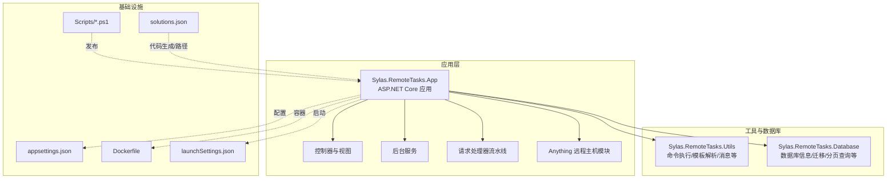
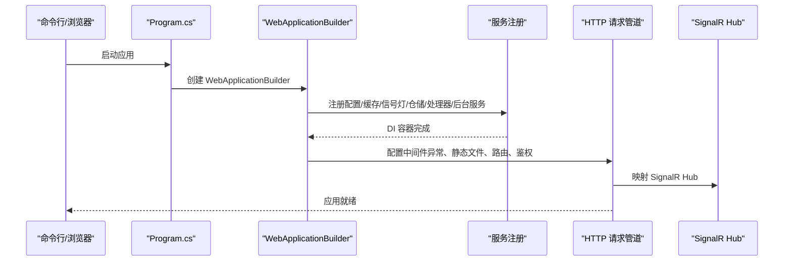
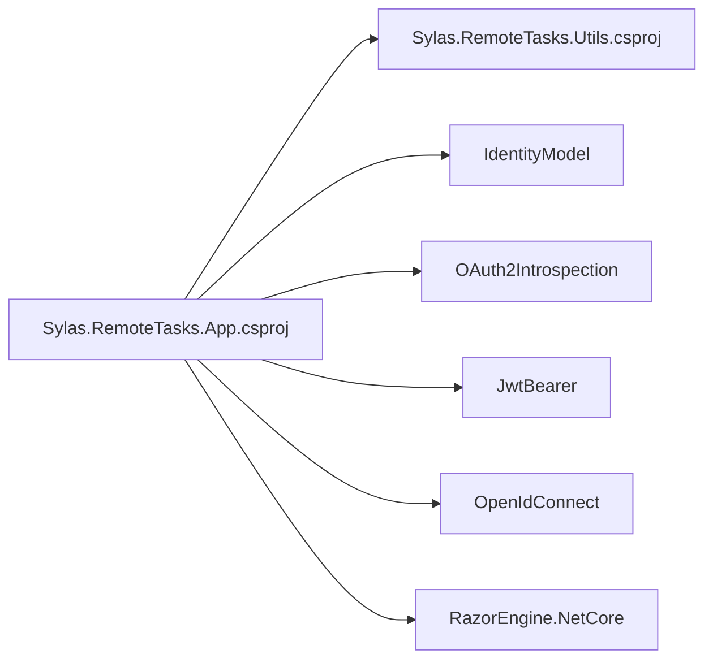

# 附录参考

<cite>
**本文引用的文件**
- [README.md](file://README.md)
- [appsettings.json](file://Sylas.RemoteTasks.App/appsettings.json)
- [Dockerfile](file://Sylas.RemoteTasks.App/Dockerfile)
- [Program.cs](file://Sylas.RemoteTasks.App/Program.cs)
- [Sylas.RemoteTasks.App.csproj](file://Sylas.RemoteTasks.App/Sylas.RemoteTasks.App.csproj)
- [launchSettings.json](file://Sylas.RemoteTasks.App/Properties/launchSettings.json)
- [solutions.json](file://Sylas.RemoteTasks.App/solutions.json)
- [publish nugetpkg database.ps1](file://Scripts/publish%20nugetpkg%20database.ps1)
- [publish nugetpkg utils.ps1](file://Scripts/publish%20nugetpkg%20utils.ps1)
- [README.md（工具模块）](file://Sylas.RemoteTasks.Utils/README.md)
- [README.md（数据库模块）](file://Sylas.RemoteTasks.Database/README.md)
</cite>

## 目录
1. [简介](#简介)
2. [项目结构](#项目结构)
3. [核心组件](#核心组件)
4. [架构总览](#架构总览)
5. [详细组件分析](#详细组件分析)
6. [依赖关系分析](#依赖关系分析)
7. [性能考虑](#性能考虑)
8. [故障排查指南](#故障排查指南)
9. [结论](#结论)
10. [附录](#附录)

## 简介
本附录面向 Sylas.RemoteTasks 的运维与开发人员，提供配置参考、常用命令、资源链接、版本历史与更新记录、许可证与贡献指南等附加信息。内容基于仓库中的配置文件、构建脚本与说明文档整理而成，旨在帮助快速理解与部署系统。

## 项目结构
- 应用主体位于 Sylas.RemoteTasks.App，采用 ASP.NET Core 10.0，包含控制器、后台服务、请求处理流水线、远程主机模块、数据库备份与同步工具等。
- 工具与数据库辅助功能分别封装在 Sylas.RemoteTasks.Utils 与 Sylas.RemoteTasks.Database 两个独立项目中，便于复用与发布。
- Scripts 目录提供 NuGet 包发布的 PowerShell 脚本；Dockerfile 提供容器化部署参考；README.md 提供部署与前端交互示例。

图表来源
- [Program.cs](file://Sylas.RemoteTasks.App/Program.cs#L1-L122)
- [Sylas.RemoteTasks.App.csproj](file://Sylas.RemoteTasks.App/Sylas.RemoteTasks.App.csproj#L1-L61)
- [appsettings.json](file://Sylas.RemoteTasks.App/appsettings.json#L1-L142)
- [Dockerfile](file://Sylas.RemoteTasks.App/Dockerfile#L1-L21)
- [launchSettings.json](file://Sylas.RemoteTasks.App/Properties/launchSettings.json#L1-L38)
- [solutions.json](file://Sylas.RemoteTasks.App/solutions.json#L1-L132)
- [publish nugetpkg database.ps1](file://Scripts/publish%20nugetpkg%20database.ps1#L1-L29)
- [publish nugetpkg utils.ps1](file://Scripts/publish%20nugetpkg%20utils.ps1#L1-L29)

章节来源
- [Program.cs](file://Sylas.RemoteTasks.App/Program.cs#L1-L122)
- [Sylas.RemoteTasks.App.csproj](file://Sylas.RemoteTasks.App/Sylas.RemoteTasks.App.csproj#L1-L61)

## 核心组件
- 配置中心与日志
  - 日志级别、控制台格式化、时间戳格式化、默认日志等级与 Microsoft.AspNetCore 警告级别。
  - 允许的连接字符串关键字列表，用于白名单校验。
- 端口与服务
  - TCP 端口、中心服务器地址与 Web 服务器地址。
  - Kestrel 端点配置（注释示例展示 HTTP/HTTPS 端口与证书配置）。
- 请求流水线与数据处理
  - RequestPipeline.Dispatch 定义多条请求处理器调度规则，支持参数传递、上下文构建器与数据处理器链路。
- 身份认证与授权
  - IdentityServer 配置（Authority、ClientId、ClientSecret、ApiName、Scopes 等），以及基于角色与作用域的授权策略。
- 全局热键与进程监控
  - GlobalHotKeys 列表与 ProcessMonitor.Names。
- 邮件发送
  - Sender 的 Name、Address、Password、Server、Port、UseSsl 等字段。
- 上传与 AI 配置
  - Upload.ClientDir、Host、SaveDir；AiConfig.Server、ApiKey、Model。

章节来源
- [appsettings.json](file://Sylas.RemoteTasks.App/appsettings.json#L1-L142)

## 架构总览
应用启动流程概览如下：

图表来源
- [Program.cs](file://Sylas.RemoteTasks.App/Program.cs#L1-L122)

章节来源
- [Program.cs](file://Sylas.RemoteTasks.App/Program.cs#L1-L122)

## 详细组件分析

### 配置参考（appsettings.json）
- 日志与控制台
  - Logging.LogLevel.Default、Microsoft.AspNetCore
  - Console.FormatterName、FormatterOptions.TimestampFormat、IncludeScopes
- 全局设置
  - AllowedHosts、AllowedConnectionStringKeywords
- 数据库与连接
  - ConnectionStrings.Default
  - FirstTable
- 网络与服务
  - TcpPort、CenterServer、CenterWebServer
  - Kestrel.Endpoints（注释示例）
- 请求流水线
  - RequestPipeline.RequestProcessorDispatch
    - Parameters：参数字符串
    - DataContextBuilder：上下文构建器数组（如 DataPropertyParser、RegexSubStringParser、TypeConversionParser、CollectionSelectParser）
    - DataHandlers：数据处理器集合（如 DataHandlerSyncDataToDb、DataHandlerCreateTable、DataHandlerAnonymization）
    - RequestProcessorName/Url/Steps/Break：可选的请求处理器步骤定义
- 身份认证与授权
  - IdentityServerConfiguration：Authority、RequireHttpsMetadata、EnableCaching、AdministrationRole、ApiName、ApiSecret、ClientId、ClientSecret、OidcResponseType、Scopes、CacheDuration
  - 授权策略：AdministrationPolicy（基于角色与作用域断言）
- 全局热键与进程监控
  - GlobalHotKeys、ProcessMonitor.Names
- 邮件发送
  - Email.Sender：Name、Address、Password、Server、Port、UseSsl
- 上传与 AI
  - Upload：ClientDir、Host、SaveDir
  - AiConfig：Server、ApiKey、Model

章节来源
- [appsettings.json](file://Sylas.RemoteTasks.App/appsettings.json#L1-L142)

### 常用命令与脚本
- 启动与调试
  - launchSettings.json 定义了 http/https/IIS Express 三种启动配置，包含端口与环境变量。
- 容器化部署
  - Dockerfile 使用 ASP.NET 10 运行时镜像，设置时区、暴露端口、复制应用并以 dotnet 运行 DLL。
- 发布 NuGet 包
  - publish nugetpkg database.ps1：从数据库模块项目文件提取版本号，构建 Release 并推送至 NuGet。
  - publish nugetpkg utils.ps1：从工具模块项目文件提取版本号，构建 Release 并推送至 NuGet。

章节来源
- [launchSettings.json](file://Sylas.RemoteTasks.App/Properties/launchSettings.json#L1-L38)
- [Dockerfile](file://Sylas.RemoteTasks.App/Dockerfile#L1-L21)
- [publish nugetpkg database.ps1](file://Scripts/publish%20nugetpkg%20database.ps1#L1-L29)
- [publish nugetpkg utils.ps1](file://Scripts/publish%20nugetpkg%20utils.ps1#L1-L29)

### 资源链接与外部材料
- 工具模块 README：概述 ICommandExecutor 与模板解析能力。
- 数据库模块 README：概述数据库信息、连接、迁移、分页查询、比较与建表等通用方法。
- 前端交互示例：README 展示了前端全局函数 execute 的使用方式与按钮 data-* 属性说明。

章节来源
- [README.md（工具模块）](file://Sylas.RemoteTasks.Utils/README.md#L1-L3)
- [README.md（数据库模块）](file://Sylas.RemoteTasks.Database/README.md#L1-L24)
- [README.md](file://README.md#L1-L43)

### 版本历史与更新记录
- 仓库未提供独立的 CHANGELOG 或版本发布历史文件。建议通过以下方式追踪：
  - Git 提交历史：查看各模块（App/Utils/Database）的提交记录与标签。
  - NuGet 发布：根据 Scripts 中的发布脚本逻辑，结合各项目文件的版本号变更进行关联。
  - 发布脚本：database.ps1 与 utils.ps1 会自动读取对应 .csproj 的 Version 字段并发布包。

章节来源
- [publish nugetpkg database.ps1](file://Scripts/publish%20nugetpkg%20database.ps1#L1-L29)
- [publish nugetpkg utils.ps1](file://Scripts/publish%20nugetpkg%20utils.ps1#L1-L29)

### 许可证与贡献指南
- 仓库未包含独立的 LICENSE 文件或明确的贡献指南文档。建议：
  - 查看各子模块的 NuGet 包元数据或项目文件中的许可信息。
  - 若涉及第三方依赖（如 jQuery、SignalR 等），请遵循其各自许可证条款。
  - 贡献流程：fork 仓库 -> 分支开发 -> 提交 PR -> 代码审查 -> 合并。

章节来源
- [Sylas.RemoteTasks.App.csproj](file://Sylas.RemoteTasks.App/Sylas.RemoteTasks.App.csproj#L1-L61)

## 依赖关系分析
- 项目依赖
  - Sylas.RemoteTasks.App 引用 Sylas.RemoteTasks.Utils，并引入 IdentityModel、OAuth2Introspection、JwtBearer、OpenIdConnect、RazorEngine 等包。
- 运行时与容器
  - Dockerfile 使用 ASP.NET 10 运行时镜像，设置时区与端口映射。
- 启动配置
  - Program.cs 注册缓存、SignalR、HttpClient、仓储、请求处理器、后台服务、鉴权与授权策略，并映射 SignalR Hub。

图表来源
- [Sylas.RemoteTasks.App.csproj](file://Sylas.RemoteTasks.App/Sylas.RemoteTasks.App.csproj#L33-L40)

章节来源
- [Sylas.RemoteTasks.App.csproj](file://Sylas.RemoteTasks.App/Sylas.RemoteTasks.App.csproj#L1-L61)
- [Program.cs](file://Sylas.RemoteTasks.App/Program.cs#L1-L122)

## 性能考虑
- 上传文件大小限制：在 Program.cs 中设置 Kestrel 最大请求体大小为无限制，适用于大文件上传场景。
- 缓存与异步：启用缓存服务与异步数据处理（如数据库迁移、分页查询、批量插入）有助于提升吞吐量。
- 线程与并发：后台服务与 SignalR Hub 支持并发通信，建议结合限流与健康检查策略。

章节来源
- [Program.cs](file://Sylas.RemoteTasks.App/Program.cs#L14-L17)

## 故障排查指南
- 配置错误
  - 检查 appsettings.json 中的连接字符串、端口、Kestrel 端点与身份认证配置是否正确。
- 身份认证失败
  - 确认 IdentityServerConfiguration 的 Authority、ClientId、ClientSecret、ApiName、Scopes 与缓存配置。
- 请求流水线异常
  - 核对 RequestPipeline.Dispatch 的 Parameters、DataContextBuilder 与 DataHandlers 配置，确保处理器参数顺序与类型一致。
- 容器启动问题
  - 检查 Dockerfile 的时区、端口映射与入口命令；确认宿主机防火墙放行相应端口。
- 发布失败
  - 确认发布脚本读取的版本号与 NuGet API Key 正确；检查网络连通性与包名重复跳过策略。

章节来源
- [appsettings.json](file://Sylas.RemoteTasks.App/appsettings.json#L1-L142)
- [Program.cs](file://Sylas.RemoteTasks.App/Program.cs#L74-L87)
- [Dockerfile](file://Sylas.RemoteTasks.App/Dockerfile#L1-L21)
- [publish nugetpkg database.ps1](file://Scripts/publish%20nugetpkg%20database.ps1#L1-L29)
- [publish nugetpkg utils.ps1](file://Scripts/publish%20nugetpkg%20utils.ps1#L1-L29)

## 结论
本附录汇总了 Sylas.RemoteTasks 的配置要点、常用命令、资源链接、版本发布脚本与外部材料索引，并提供了架构与依赖关系的可视化说明。建议在实际部署与维护中结合本附录与各模块 README 进行对照与验证。

## 附录

### A. 配置示例（片段路径）
- 日志与控制台
  - [日志与控制台配置](file://Sylas.RemoteTasks.App/appsettings.json#L2-L14)
- 全局设置
  - [允许的连接字符串关键字](file://Sylas.RemoteTasks.App/appsettings.json#L20-L23)
- 数据库与连接
  - [默认连接字符串与首张表](file://Sylas.RemoteTasks.App/appsettings.json#L25-L37)
- 网络与服务
  - [TCP/中心服务器/Kestrel 端点示例](file://Sylas.RemoteTasks.App/appsettings.json#L29-L64)
- 请求流水线
  - [Dispatch 规则与处理器](file://Sylas.RemoteTasks.App/appsettings.json#L65-L106)
- 身份认证与授权
  - [IdentityServer 配置与授权策略](file://Sylas.RemoteTasks.App/appsettings.json#L109-L121)
  - [授权策略定义](file://Sylas.RemoteTasks.App/Program.cs#L77-L87)
- 全局热键与进程监控
  - [GlobalHotKeys 与 ProcessMonitor](file://Sylas.RemoteTasks.App/appsettings.json#L15-L24)
  - [ProcessMonitor.Names](file://Sylas.RemoteTasks.App/appsettings.json#L122-L124)
- 邮件发送
  - [Email.Sender 字段](file://Sylas.RemoteTasks.App/appsettings.json#L125-L140)
- 上传与 AI
  - [Upload 配置](file://Sylas.RemoteTasks.App/appsettings.json#L39-L43)
  - [AiConfig 配置](file://Sylas.RemoteTasks.App/appsettings.json#L44-L49)

章节来源
- [appsettings.json](file://Sylas.RemoteTasks.App/appsettings.json#L1-L142)
- [Program.cs](file://Sylas.RemoteTasks.App/Program.cs#L77-L87)

### B. 命令行参考（片段路径）
- 启动配置
  - [launchSettings.json（HTTP/HTTPS/IIS Express）](file://Sylas.RemoteTasks.App/Properties/launchSettings.json#L10-L35)
- 容器化
  - [Dockerfile（时区/端口/入口）](file://Sylas.RemoteTasks.App/Dockerfile#L12-L21)
- 发布 NuGet 包
  - [database.ps1（读取版本/构建/推送）](file://Scripts/publish%20nugetpkg%20database.ps1#L8-L27)
  - [utils.ps1（读取版本/构建/推送）](file://Scripts/publish%20nugetpkg%20utils.ps1#L8-L27)

章节来源
- [launchSettings.json](file://Sylas.RemoteTasks.App/Properties/launchSettings.json#L1-L38)
- [Dockerfile](file://Sylas.RemoteTasks.App/Dockerfile#L1-L21)
- [publish nugetpkg database.ps1](file://Scripts/publish%20nugetpkg%20database.ps1#L1-L29)
- [publish nugetpkg utils.ps1](file://Scripts/publish%20nugetpkg%20utils.ps1#L1-L29)

### C. 外部资源与学习材料
- 工具模块
  - [README（工具模块）](file://Sylas.RemoteTasks.Utils/README.md#L1-L3)
- 数据库模块
  - [README（数据库模块）](file://Sylas.RemoteTasks.Database/README.md#L1-L24)
- 前端交互
  - [README（前端 execute 函数与按钮属性）](file://README.md#L19-L43)

章节来源
- [README.md（工具模块）](file://Sylas.RemoteTasks.Utils/README.md#L1-L3)
- [README.md（数据库模块）](file://Sylas.RemoteTasks.Database/README.md#L1-L24)
- [README.md](file://README.md#L19-L43)

### D. 版本演进与更新历史
- 当前仓库未提供独立的版本历史文件。建议：
  - 通过 Git 标签与提交记录定位版本号与变更范围。
  - 结合 Scripts 中的发布脚本与 .csproj 的 Version 字段进行关联。

章节来源
- [publish nugetpkg database.ps1](file://Scripts/publish%20nugetpkg%20database.ps1#L11-L20)
- [publish nugetpkg utils.ps1](file://Scripts/publish%20nugetpkg%20utils.ps1#L11-L20)

### E. 许可证与贡献指南
- 许可证
  - 仓库未包含独立 LICENSE 文件；请参考各子模块 NuGet 元数据与第三方依赖的许可证。
- 贡献指南
  - 仓库未提供贡献指南文档；建议遵循 fork -> 分支 -> PR -> 审查 -> 合并的标准流程。

章节来源
- [Sylas.RemoteTasks.App.csproj](file://Sylas.RemoteTasks.App/Sylas.RemoteTasks.App.csproj#L1-L61)