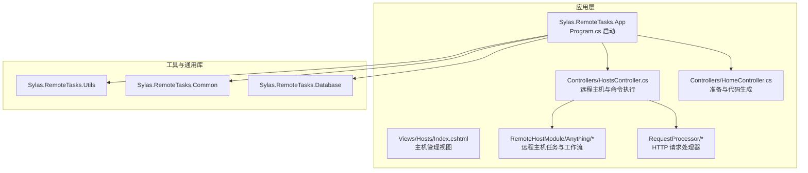
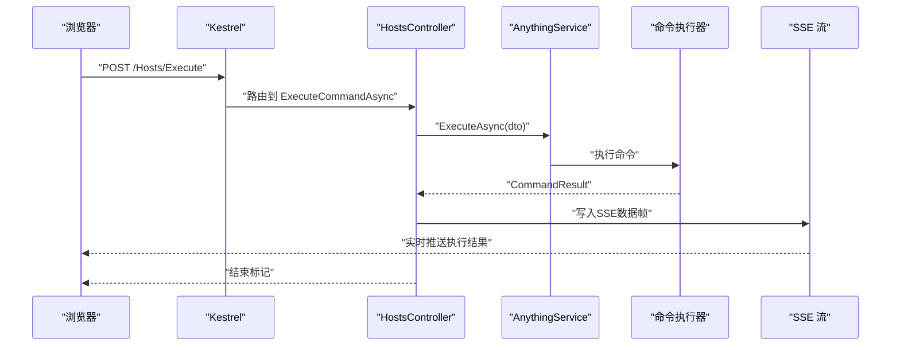
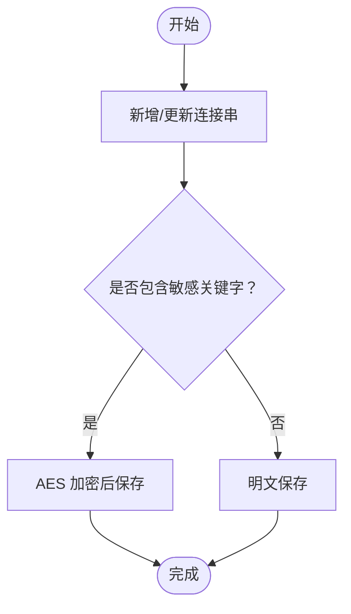
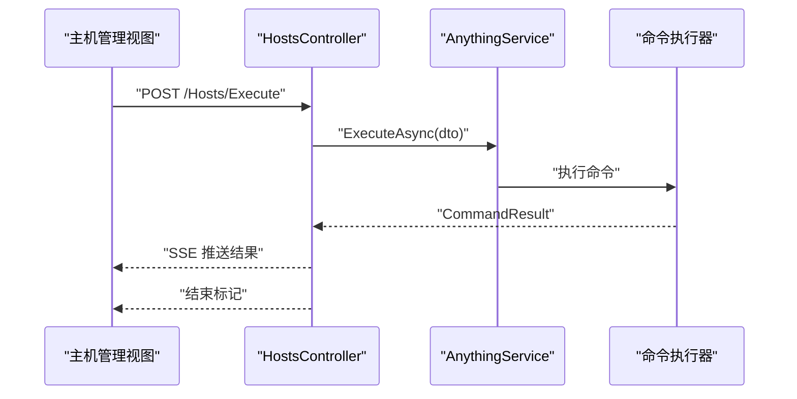
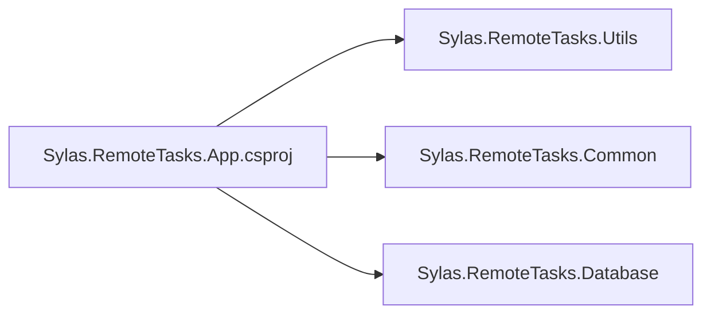

# 快速开始

<cite>
**本文引用的文件**
- [README.md](file://README.md)
- [appsettings.json](file://Sylas.RemoteTasks.App/appsettings.json)
- [Dockerfile](file://Sylas.RemoteTasks.App/Dockerfile)
- [Program.cs](file://Sylas.RemoteTasks.App/Program.cs)
- [launchSettings.json](file://Sylas.RemoteTasks.App/Properties/launchSettings.json)
- [solutions.json](file://Sylas.RemoteTasks.App/solutions.json)
- [HostsController.cs](file://Sylas.RemoteTasks.App/Controllers/HostsController.cs)
- [AnythingFlow.cs](file://Sylas.RemoteTasks.App/RemoteHostModule/Anything/AnythingFlow.cs)
- [HttpRequestProcessor.cs](file://Sylas.RemoteTasks.App/RequestProcessor/Models/HttpRequestProcessor.cs)
- [HomeController.cs](file://Sylas.RemoteTasks.App/Controllers/HomeController.cs)
- [Sylas.RemoteTasks.App.csproj](file://Sylas.RemoteTasks.App/Sylas.RemoteTasks.App.csproj)
- [DatabaseConstants.cs](file://Sylas.RemoteTasks.Utils/Constants/DatabaseConstants.cs)
- [DatabaseInfo.cs](file://Sylas.RemoteTasks.Database/SyncBase/DatabaseInfo.cs)
- [DatabaseController.cs](file://Sylas.RemoteTasks.App/Controllers/DatabaseController.cs)
- [Index.cshtml（主机管理）](file://Sylas.RemoteTasks.App/Views/Hosts/Index.cshtml)
</cite>

## 目录
1. [简介](#简介)
2. [项目结构](#项目结构)
3. [核心组件](#核心组件)
4. [架构总览](#架构总览)
5. [详细组件分析](#详细组件分析)
6. [依赖分析](#依赖分析)
7. [性能考虑](#性能考虑)
8. [故障排除指南](#故障排除指南)
9. [结论](#结论)
10. [附录](#附录)

## 简介
本指南面向首次接触 Sylas.RemoteTasks 的用户，帮助你在最短时间内完成环境搭建、项目启动、数据库初始化，并成功执行第一个“远程主机任务”。文档同时覆盖本地开发与 Docker 部署两种方式，提供常见配置项说明、默认值提示、故障排除与常见问题解答，确保你能快速体验核心功能。

## 项目结构
Sylas.RemoteTasks 是一个基于 .NET 的远程任务与主机管理平台，前端采用 ASP.NET Core MVC，后端提供远程命令执行、工作流编排、HTTP 请求处理、数据库连接管理与可视化界面。核心模块包括：
- 应用层：Sylas.RemoteTasks.App（Web 应用、控制器、视图、后台服务、Hub）
- 工具与通用库：Sylas.RemoteTasks.Utils、Sylas.RemoteTasks.Common
- 数据访问与同步：Sylas.RemoteTasks.Database
- 测试工程：Sylas.RemoteTasks.Test

图表来源
- [Program.cs](file://Sylas.RemoteTasks.App/Program.cs#L1-L122)
- [HostsController.cs](file://Sylas.RemoteTasks.App/Controllers/HostsController.cs#L1-L468)
- [HomeController.cs](file://Sylas.RemoteTasks.App/Controllers/HomeController.cs#L1-L975)
- [Index.cshtml（主机管理）](file://Sylas.RemoteTasks.App/Views/Hosts/Index.cshtml#L1-L93)

章节来源
- [Program.cs](file://Sylas.RemoteTasks.App/Program.cs#L1-L122)
- [Sylas.RemoteTasks.App.csproj](file://Sylas.RemoteTasks.App/Sylas.RemoteTasks.App.csproj#L1-L61)

## 核心组件
- 远程主机与命令执行：通过 HostsController 提供命令执行接口，支持 SSE 流式输出执行结果。
- 任务工作流：AnythingFlow 定义可编排的节点序列，支持调度与环境变量同步。
- HTTP 请求处理器：HttpRequestProcessor 描述多步骤请求与数据处理链路。
- 配置与启动：Program.cs 注册服务、中间件与认证授权；appsettings.json 提供运行参数与默认值。
- 数据库连接：DatabaseController 管理连接串，DatabaseInfo 解析连接详情，DatabaseConstants 定义关键字白名单。

章节来源
- [HostsController.cs](file://Sylas.RemoteTasks.App/Controllers/HostsController.cs#L1-L468)
- [AnythingFlow.cs](file://Sylas.RemoteTasks.App/RemoteHostModule/Anything/AnythingFlow.cs#L1-L29)
- [HttpRequestProcessor.cs](file://Sylas.RemoteTasks.App/RequestProcessor/Models/HttpRequestProcessor.cs#L1-L22)
- [Program.cs](file://Sylas.RemoteTasks.App/Program.cs#L1-L122)
- [appsettings.json](file://Sylas.RemoteTasks.App/appsettings.json#L1-L142)
- [DatabaseController.cs](file://Sylas.RemoteTasks.App/Controllers/DatabaseController.cs#L46-L75)
- [DatabaseInfo.cs](file://Sylas.RemoteTasks.Database/SyncBase/DatabaseInfo.cs#L200-L296)
- [DatabaseConstants.cs](file://Sylas.RemoteTasks.Utils/Constants/DatabaseConstants.cs#L1-L13)

## 架构总览
应用启动后，Kestrel 监听 HTTP/HTTPS 端口，路由到控制器；控制器调用服务层执行远程命令或工作流；通过 SignalR Hub 或 SSE 推送执行进度；配置与数据库连接信息通过 appsettings.json 与数据库控制器维护。

图表来源
- [HostsController.cs](file://Sylas.RemoteTasks.App/Controllers/HostsController.cs#L85-L124)

章节来源
- [HostsController.cs](file://Sylas.RemoteTasks.App/Controllers/HostsController.cs#L1-L468)
- [Program.cs](file://Sylas.RemoteTasks.App/Program.cs#L1-L122)

## 详细组件分析

### 环境与依赖准备
- 开发环境要求
  - .NET 版本：目标框架为 net10.0，建议使用 .NET 10 SDK。
  - IDE：Visual Studio 或 VS Code。
  - 可选：Docker（用于容器化部署）。
- 依赖安装
  - 直接还原 NuGet 包（IDE 自动处理），或使用命令行还原。
  - 项目引用了 IdentityModel、RazorEngine、Microsoft.CodeAnalysis.CSharp 等包。
- 项目配置
  - appsettings.json 提供日志、连接串、Kestrel 端口、请求流水线、身份认证等默认配置。
  - launchSettings.json 定义本地开发的 HTTP/HTTPS 端口与环境变量。
  - solutions.json 用于代码生成与 DbContext 初始化的路径与命名空间模板。

章节来源
- [Sylas.RemoteTasks.App.csproj](file://Sylas.RemoteTasks.App/Sylas.RemoteTasks.App.csproj#L1-L61)
- [appsettings.json](file://Sylas.RemoteTasks.App/appsettings.json#L1-L142)
- [launchSettings.json](file://Sylas.RemoteTasks.App/Properties/launchSettings.json#L1-L38)
- [solutions.json](file://Sylas.RemoteTasks.App/solutions.json#L1-L132)

### 数据库初始化与连接
- 连接串管理
  - 通过 DatabaseController 的新增/更新接口保存连接串，内部会对包含特定关键字的连接串进行加密存储。
  - 关键字白名单由 DatabaseConstants 定义，用于识别敏感连接串。
- 连接串解析
  - DatabaseInfo 提供多种数据库连接串的正则匹配与解析，支持 SQLite、SQL Server、MySQL、PostgreSQL、达梦等。
- 本地 .db 文件
  - 若连接串指向 .db 文件，HomeController 在初始化时会将其转换为绝对路径，确保 SQLite 文件定位正确。

图表来源
- [DatabaseController.cs](file://Sylas.RemoteTasks.App/Controllers/DatabaseController.cs#L46-L75)
- [DatabaseConstants.cs](file://Sylas.RemoteTasks.Utils/Constants/DatabaseConstants.cs#L1-L13)

章节来源
- [DatabaseController.cs](file://Sylas.RemoteTasks.App/Controllers/DatabaseController.cs#L46-L75)
- [DatabaseConstants.cs](file://Sylas.RemoteTasks.Utils/Constants/DatabaseConstants.cs#L1-L13)
- [DatabaseInfo.cs](file://Sylas.RemoteTasks.Database/SyncBase/DatabaseInfo.cs#L200-L296)
- [HomeController.cs](file://Sylas.RemoteTasks.App/Controllers/HomeController.cs#L539-L549)

### 远程主机与第一个任务示例
- 创建远程主机配置
  - 在“主机管理”页面，通过控制器提供的接口添加或编辑主机配置（如 IP、凭据、命令模板等）。
  - 前端视图提供命令执行入口，调用 /Hosts/Execute 接口。
- 定义任务流程
  - 使用 AnythingFlow 定义节点顺序与调度规则；可将命令环境变量同步至工作流。
- 执行任务并查看结果
  - 调用 ExecuteCommandAsync 接口，后端以 SSE 流式返回执行过程与结果，最终发送结束标记。
  - 前端示例脚本展示了如何发起请求并处理响应。

图表来源
- [HostsController.cs](file://Sylas.RemoteTasks.App/Controllers/HostsController.cs#L85-L124)
- [Index.cshtml（主机管理）](file://Sylas.RemoteTasks.App/Views/Hosts/Index.cshtml#L54-L76)

章节来源
- [HostsController.cs](file://Sylas.RemoteTasks.App/Controllers/HostsController.cs#L1-L468)
- [Index.cshtml（主机管理）](file://Sylas.RemoteTasks.App/Views/Hosts/Index.cshtml#L1-L93)

### HTTP 请求处理器（可选高级场景）
- HttpRequestProcessor 支持多步骤请求与数据处理链路，适合跨系统数据同步或批量 API 调用场景。
- 可结合 DataHandlers 实现数据落库、匿名化、建表等扩展。

章节来源
- [HttpRequestProcessor.cs](file://Sylas.RemoteTasks.App/RequestProcessor/Models/HttpRequestProcessor.cs#L1-L22)

## 依赖分析
- 项目依赖
  - Sylas.RemoteTasks.App 引用 Sylas.RemoteTasks.Utils 与 Sylas.RemoteTasks.Common。
  - 使用 IdentityModel、RazorEngine、Microsoft.CodeAnalysis.CSharp 等第三方包。
- 运行时端口
  - Kestrel 默认监听 HTTP/HTTPS 端口，可通过 launchSettings.json 与 appsettings.json 配置。
- Docker 端口映射
  - Dockerfile 中声明容器暴露 80/443，实际运行时可通过环境变量或 docker run 的 -p 映射宿主机端口。

图表来源
- [Sylas.RemoteTasks.App.csproj](file://Sylas.RemoteTasks.App/Sylas.RemoteTasks.App.csproj#L42-L44)

章节来源
- [Sylas.RemoteTasks.App.csproj](file://Sylas.RemoteTasks.App/Sylas.RemoteTasks.App.csproj#L1-L61)
- [Dockerfile](file://Sylas.RemoteTasks.App/Dockerfile#L1-L21)
- [launchSettings.json](file://Sylas.RemoteTasks.App/Properties/launchSettings.json#L1-L38)

## 性能考虑
- 上传文件大小限制：在 Program.cs 中已将最大请求体大小设置为无限制，便于大文件传输。
- SSE 流式输出：命令执行结果以流式方式推送，避免一次性返回大量数据导致内存压力。
- 数据库连接解析：DatabaseInfo 使用正则解析连接串，注意避免在高频场景下重复解析，可在上层缓存解析结果。

章节来源
- [Program.cs](file://Sylas.RemoteTasks.App/Program.cs#L14-L17)
- [HostsController.cs](file://Sylas.RemoteTasks.App/Controllers/HostsController.cs#L85-L124)
- [DatabaseInfo.cs](file://Sylas.RemoteTasks.Database/SyncBase/DatabaseInfo.cs#L200-L296)

## 故障排除指南
- 无法启动或端口占用
  - 检查 launchSettings.json 中的 HTTP/HTTPS 端口是否被占用；必要时修改为未占用端口。
  - Docker 部署时确认 -p 映射与容器暴露端口一致。
- 连接串无效或无法解析
  - 确认连接串格式符合 DatabaseInfo 支持的数据库类型正则。
  - 对包含敏感关键字的连接串，确保已通过 DatabaseController 加密保存。
- SQLite 文件找不到
  - 若连接串为相对路径 .db 文件，HomeController 会在初始化时转换为绝对路径，请确认文件存在且路径正确。
- 命令执行无输出
  - 确认前端已正确发起 /Hosts/Execute 请求并处理 SSE 流。
  - 检查后端日志与异常处理中间件输出。
- Docker 证书与 HTTPS
  - Dockerfile 中未启用 dotnet dev-certs，若需要 HTTPS，请在容器内信任证书或使用外部代理。

章节来源
- [launchSettings.json](file://Sylas.RemoteTasks.App/Properties/launchSettings.json#L1-L38)
- [Dockerfile](file://Sylas.RemoteTasks.App/Dockerfile#L1-L21)
- [DatabaseController.cs](file://Sylas.RemoteTasks.App/Controllers/DatabaseController.cs#L46-L75)
- [DatabaseInfo.cs](file://Sylas.RemoteTasks.Database/SyncBase/DatabaseInfo.cs#L200-L296)
- [HomeController.cs](file://Sylas.RemoteTasks.App/Controllers/HomeController.cs#L539-L549)
- [HostsController.cs](file://Sylas.RemoteTasks.App/Controllers/HostsController.cs#L85-L124)

## 结论
通过本指南，你已完成开发环境准备、项目启动、数据库连接配置与第一个远程主机任务的执行。建议后续深入探索：
- 使用 HttpRequestProcessor 编排复杂数据同步流程
- 借助 AnythingFlow 构建可调度的工作流
- 配置身份认证与授权策略，满足生产环境安全需求

## 附录

### 常见初始配置参数与默认值
- 日志级别与控制台格式：默认日志级别为 Debug，控制台时间戳格式为“yyyy-MM-dd HH:mm:ss”。
- 全局热键：默认启用 ctrl+alt+space。
- 连接串默认值：默认连接名为 Default，默认值为本地 SQLite 文件 remotetasks.db。
- TCP/Kestrel 端口：TCP 端口默认 8989；Kestrel 端口默认未显式配置，可通过 launchSettings.json 设置。
- 请求流水线：RequestPipeline 中包含示例步骤与数据处理器配置，可直接参考。
- 身份认证：IdentityServerConfiguration 提供默认 Authority、ClientId、ClientSecret、ApiName 等，需按实际环境调整。
- 邮件配置：Email.Sender 提供 SMTP 地址、端口、SSL 等默认值，需按实际邮箱服务商配置。

章节来源
- [appsettings.json](file://Sylas.RemoteTasks.App/appsettings.json#L1-L142)

### 部署方式对比

- 本地开发
  - 使用 launchSettings.json 中的 http/https 配置启动项目，浏览器访问对应端口。
  - 适用于调试与快速验证。
- Docker 部署
  - 使用 Dockerfile 构建镜像，容器暴露 80/443，通过 -p 映射宿主机端口。
  - 可通过环境变量或 docker run 的 --urls 覆盖默认 URL。

章节来源
- [launchSettings.json](file://Sylas.RemoteTasks.App/Properties/launchSettings.json#L1-L38)
- [Dockerfile](file://Sylas.RemoteTasks.App/Dockerfile#L1-L21)
- [README.md](file://README.md#L4-L17)