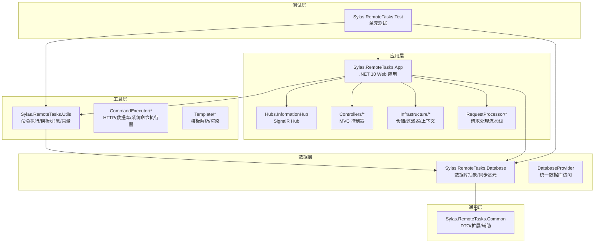
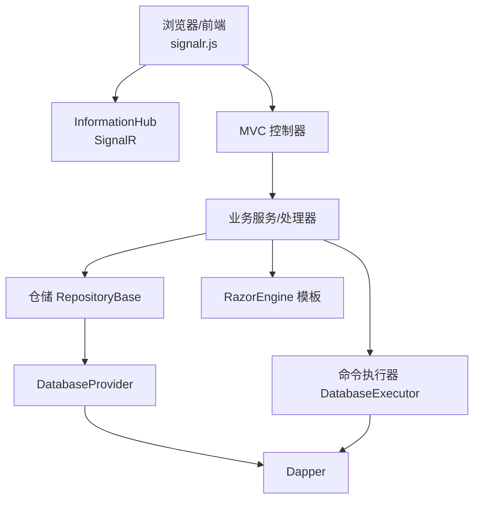
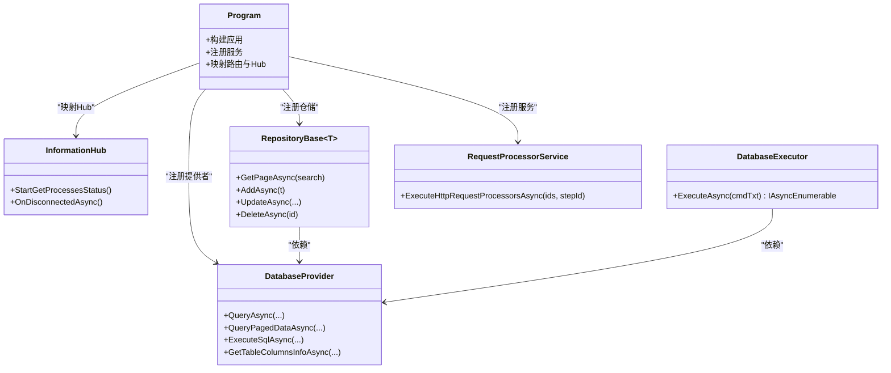
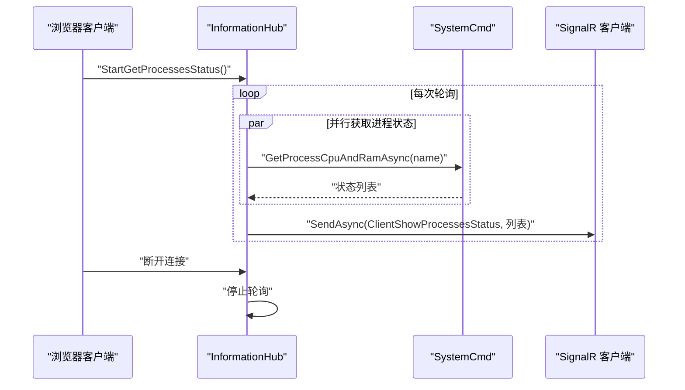
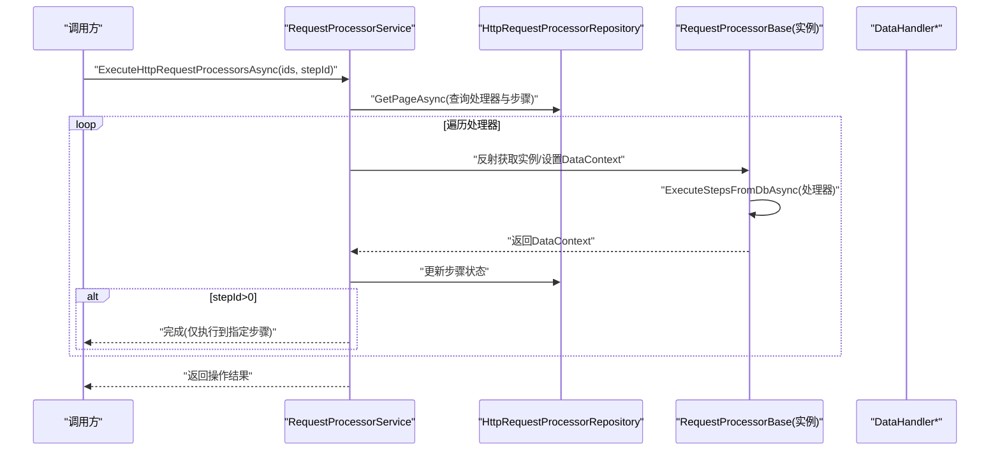
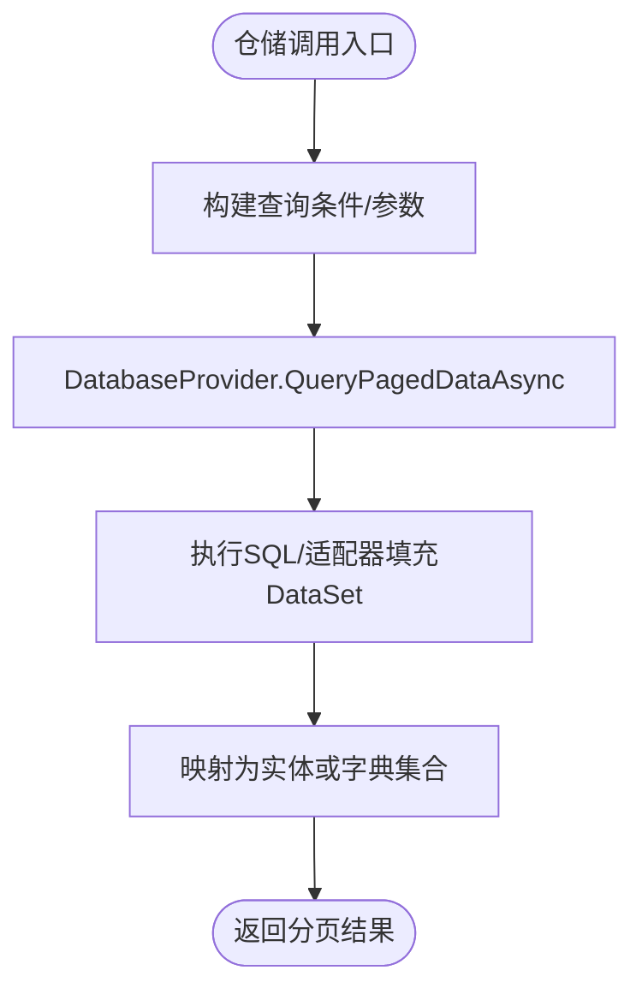
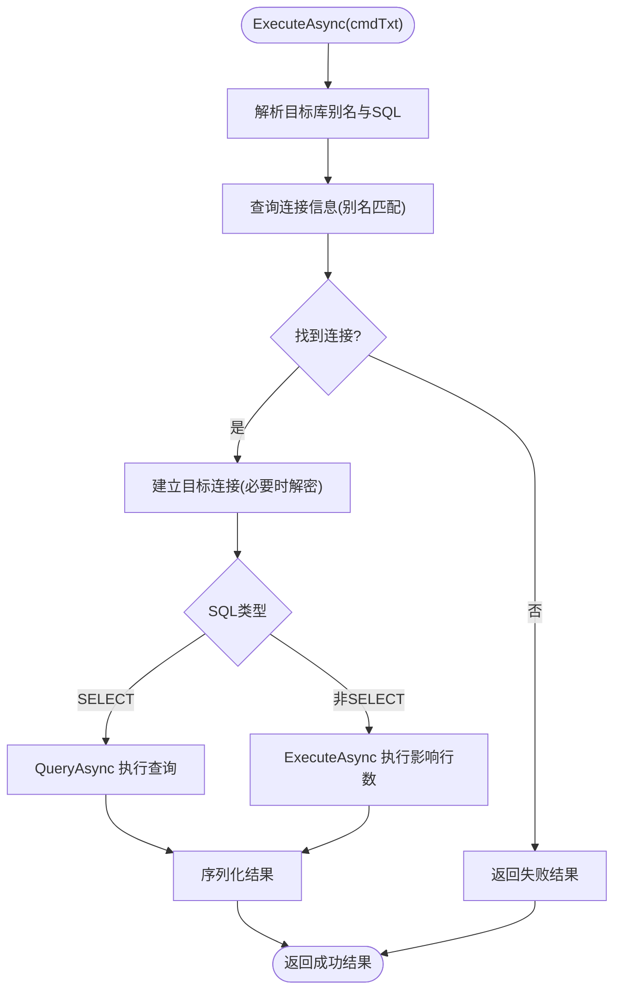
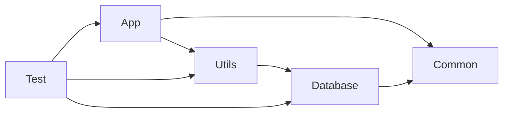

# 技术栈

<cite>
**本文引用的文件**
- [Sylas.RemoteTasks.App.csproj](file://Sylas.RemoteTasks.App/Sylas.RemoteTasks.App.csproj)
- [Sylas.RemoteTasks.Common.csproj](file://Sylas.RemoteTasks.Common/Sylas.RemoteTasks.Common.csproj)
- [Sylas.RemoteTasks.Database.csproj](file://Sylas.RemoteTasks.Database/Sylas.RemoteTasks.Database.csproj)
- [Sylas.RemoteTasks.Utils.csproj](file://Sylas.RemoteTasks.Utils/Sylas.RemoteTasks.Utils.csproj)
- [Sylas.RemoteTasks.Test.csproj](file://Sylas.RemoteTasks.Test/Sylas.RemoteTasks.Test.csproj)
- [Program.cs](file://Sylas.RemoteTasks.App/Program.cs)
- [appsettings.json](file://Sylas.RemoteTasks.App/appsettings.json)
- [InformationHub.cs](file://Sylas.RemoteTasks.App/Hubs/InformationHub.cs)
- [RepositoryBase.cs](file://Sylas.RemoteTasks.App/Infrastructure/RepositoryBase.cs)
- [DatabaseProvider.cs](file://Sylas.RemoteTasks.Database/DatabaseProvider.cs)
- [DatabaseExecutor.cs](file://Sylas.RemoteTasks.Utils/CommandExecutor/DatabaseExecutor.cs)
- [RequestProcessorService.cs](file://Sylas.RemoteTasks.App/RequestProcessor/RequestProcessorService.cs)
- [signalr.js](file://Sylas.RemoteTasks.App/wwwroot/lib/signalr/dist/browser/signalr.js)
</cite>

## 目录
1. [简介](#简介)
2. [项目结构](#项目结构)
3. [核心组件](#核心组件)
4. [架构总览](#架构总览)
5. [组件详解](#组件详解)
6. [依赖关系分析](#依赖关系分析)
7. [性能考量](#性能考量)
8. [故障排查指南](#故障排查指南)
9. [结论](#结论)

## 简介
本文件系统化梳理 Sylas.RemoteTasks 的技术栈与架构设计，重点覆盖以下方面：
- 技术选型与版本要求：.NET 10、ASP.NET Core、SignalR、Dapper、RazorEngine 等
- 分层架构：表现层、业务层、数据访问层的职责划分
- 第三方依赖与版本兼容性
- 技术选型优势与潜在局限
- 开发者决策背景与实践建议

## 项目结构
项目采用多项目解决方案组织，围绕“应用层 + 工具层 + 数据层 + 通用层 + 测试层”进行模块化拆分，便于职责分离与复用。

图表来源
- [Program.cs](file://Sylas.RemoteTasks.App/Program.cs#L1-L122)
- [Sylas.RemoteTasks.App.csproj](file://Sylas.RemoteTasks.App/Sylas.RemoteTasks.App.csproj#L1-L61)
- [Sylas.RemoteTasks.Utils.csproj](file://Sylas.RemoteTasks.Utils/Sylas.RemoteTasks.Utils.csproj#L1-L47)
- [Sylas.RemoteTasks.Database.csproj](file://Sylas.RemoteTasks.Database/Sylas.RemoteTasks.Database.csproj#L1-L52)
- [Sylas.RemoteTasks.Common.csproj](file://Sylas.RemoteTasks.Common/Sylas.RemoteTasks.Common.csproj#L1-L16)
- [Sylas.RemoteTasks.Test.csproj](file://Sylas.RemoteTasks.Test/Sylas.RemoteTasks.Test.csproj#L1-L44)

章节来源
- [Program.cs](file://Sylas.RemoteTasks.App/Program.cs#L1-L122)
- [Sylas.RemoteTasks.App.csproj](file://Sylas.RemoteTasks.App/Sylas.RemoteTasks.App.csproj#L1-L61)

## 核心组件
- 运行时与框架
  - .NET 10：应用层目标框架，提供最新语言与运行时能力
  - ASP.NET Core：MVC + SignalR 的 Web 框架，内置依赖注入、中间件管线
- 通信与实时能力
  - SignalR：服务端推送、进程监控状态广播
- ORM 与数据访问
  - Dapper：轻量高性能的微 ORM，广泛用于仓储与命令执行
- 视图与模板
  - RazorEngine：服务端模板引擎，用于动态渲染与代码生成
- 工具与执行器
  - Utils.CommandExecutor：统一的命令执行抽象，支持数据库/HTTP/系统命令
- 请求处理流水线
  - RequestProcessor：基于配置的可扩展请求处理与数据处理器链路

章节来源
- [Sylas.RemoteTasks.App.csproj](file://Sylas.RemoteTasks.App/Sylas.RemoteTasks.App.csproj#L3-L39)
- [Program.cs](file://Sylas.RemoteTasks.App/Program.cs#L36-L87)
- [InformationHub.cs](file://Sylas.RemoteTasks.App/Hubs/InformationHub.cs#L1-L59)
- [RepositoryBase.cs](file://Sylas.RemoteTasks.App/Infrastructure/RepositoryBase.cs#L1-L233)
- [DatabaseExecutor.cs](file://Sylas.RemoteTasks.Utils/CommandExecutor/DatabaseExecutor.cs#L1-L84)
- [RequestProcessorService.cs](file://Sylas.RemoteTasks.App/RequestProcessor/RequestProcessorService.cs#L1-L72)

## 架构总览
整体采用“三层 + 多模块”的分层设计：
- 表现层（Presentation Layer）：MVC 控制器、SignalR Hub、静态资源与前端脚本
- 业务层（Business Layer）：请求处理流水线、数据处理器、过滤器与上下文
- 数据访问层（Data Access Layer）：仓储、数据库提供者、命令执行器

图表来源
- [InformationHub.cs](file://Sylas.RemoteTasks.App/Hubs/InformationHub.cs#L1-L59)
- [Program.cs](file://Sylas.RemoteTasks.App/Program.cs#L36-L87)
- [RepositoryBase.cs](file://Sylas.RemoteTasks.App/Infrastructure/RepositoryBase.cs#L1-L233)
- [DatabaseProvider.cs](file://Sylas.RemoteTasks.Database/DatabaseProvider.cs#L1-L485)
- [DatabaseExecutor.cs](file://Sylas.RemoteTasks.Utils/CommandExecutor/DatabaseExecutor.cs#L1-L84)
- [signalr.js](file://Sylas.RemoteTasks.App/wwwroot/lib/signalr/dist/browser/signalr.js#L1-L1351)

## 组件详解

### 1) 技术选型与版本要求
- .NET 10
  - 应用层目标框架，提供最新语言特性与性能优化
  - 项目文件中明确声明目标框架
- ASP.NET Core
  - MVC 控制器路由、认证授权、中间件管线
  - SignalR 集成与 Hub 映射
- Dapper
  - 通用层与数据层均引入，用于仓储与命令执行
  - 版本约束在各项目中保持一致
- RazorEngine
  - 应用层用于视图与模板渲染；工具层同样引入
- 其他关键依赖
  - 身份认证：JwtBearer、OpenIdConnect、IdentityModel
  - HTTP：HttpClient、HttpContextAccessor
  - 缓存：MemoryCache
  - 日志：Microsoft.Extensions.Logging
  - JSON：System.Text.Json、Newtonsoft.Json

章节来源
- [Sylas.RemoteTasks.App.csproj](file://Sylas.RemoteTasks.App/Sylas.RemoteTasks.App.csproj#L3-L39)
- [Sylas.RemoteTasks.Common.csproj](file://Sylas.RemoteTasks.Common/Sylas.RemoteTasks.Common.csproj#L9-L13)
- [Sylas.RemoteTasks.Database.csproj](file://Sylas.RemoteTasks.Database/Sylas.RemoteTasks.Database.csproj#L18-L32)
- [Sylas.RemoteTasks.Utils.csproj](file://Sylas.RemoteTasks.Utils/Sylas.RemoteTasks.Utils.csproj#L18-L29)

### 2) 分层架构设计
- 表现层
  - MVC 控制器：处理 HTTP 请求、调用业务服务、返回视图或结果
  - SignalR Hub：服务端推送，如进程监控状态
  - 静态资源与前端脚本：Bootstrap、jQuery、Prism、SignalR JS 客户端
- 业务层
  - 请求处理流水线：按配置执行步骤与数据处理器
  - 过滤器与上下文：统一参数解析、动作过滤、全局异常处理
- 数据访问层
  - 仓储：泛型仓储封装 CRUD 与分页
  - 数据库提供者：统一查询、分页、执行、表结构信息等
  - 命令执行器：数据库/HTTP/系统命令的统一入口

图表来源
- [Program.cs](file://Sylas.RemoteTasks.App/Program.cs#L36-L87)
- [InformationHub.cs](file://Sylas.RemoteTasks.App/Hubs/InformationHub.cs#L1-L59)
- [RepositoryBase.cs](file://Sylas.RemoteTasks.App/Infrastructure/RepositoryBase.cs#L10-L194)
- [DatabaseProvider.cs](file://Sylas.RemoteTasks.Database/DatabaseProvider.cs#L19-L484)
- [DatabaseExecutor.cs](file://Sylas.RemoteTasks.Utils/CommandExecutor/DatabaseExecutor.cs#L18-L82)
- [RequestProcessorService.cs](file://Sylas.RemoteTasks.App/RequestProcessor/RequestProcessorService.cs#L7-L71)

章节来源
- [Program.cs](file://Sylas.RemoteTasks.App/Program.cs#L36-L121)
- [InformationHub.cs](file://Sylas.RemoteTasks.App/Hubs/InformationHub.cs#L1-L59)
- [RepositoryBase.cs](file://Sylas.RemoteTasks.App/Infrastructure/RepositoryBase.cs#L10-L194)
- [DatabaseProvider.cs](file://Sylas.RemoteTasks.Database/DatabaseProvider.cs#L19-L484)
- [DatabaseExecutor.cs](file://Sylas.RemoteTasks.Utils/CommandExecutor/DatabaseExecutor.cs#L18-L82)
- [RequestProcessorService.cs](file://Sylas.RemoteTasks.App/RequestProcessor/RequestProcessorService.cs#L7-L71)

### 3) 关键流程与序列图

#### SignalR 推送流程

图表来源
- [InformationHub.cs](file://Sylas.RemoteTasks.App/Hubs/InformationHub.cs#L14-L56)
- [signalr.js](file://Sylas.RemoteTasks.App/wwwroot/lib/signalr/dist/browser/signalr.js#L1192-L1351)

章节来源
- [InformationHub.cs](file://Sylas.RemoteTasks.App/Hubs/InformationHub.cs#L1-L59)

#### 请求处理流水线执行

图表来源
- [RequestProcessorService.cs](file://Sylas.RemoteTasks.App/RequestProcessor/RequestProcessorService.cs#L11-L69)

章节来源
- [RequestProcessorService.cs](file://Sylas.RemoteTasks.App/RequestProcessor/RequestProcessorService.cs#L1-L72)

### 4) 数据访问与模板渲染

#### 仓储与数据库提供者协作

图表来源
- [RepositoryBase.cs](file://Sylas.RemoteTasks.App/Infrastructure/RepositoryBase.cs#L20-L36)
- [DatabaseProvider.cs](file://Sylas.RemoteTasks.Database/DatabaseProvider.cs#L337-L370)

章节来源
- [RepositoryBase.cs](file://Sylas.RemoteTasks.App/Infrastructure/RepositoryBase.cs#L10-L194)
- [DatabaseProvider.cs](file://Sylas.RemoteTasks.Database/DatabaseProvider.cs#L19-L484)

#### 命令执行器（数据库）

图表来源
- [DatabaseExecutor.cs](file://Sylas.RemoteTasks.Utils/CommandExecutor/DatabaseExecutor.cs#L26-L81)

章节来源
- [DatabaseExecutor.cs](file://Sylas.RemoteTasks.Utils/CommandExecutor/DatabaseExecutor.cs#L1-L84)

## 依赖关系分析
- 项目间依赖
  - App 依赖 Utils、Common
  - Utils 依赖 Database、Common
  - Database 依赖 Common
  - Test 依赖 App、Utils、Database
- 第三方包版本一致性
  - Dapper：通用层、数据层、工具层、测试层均使用相同版本
  - JSON：System.Text.Json 与 Newtonsoft.Json 并存，分别用于不同场景
  - SignalR：前端 JS 客户端与后端 Hub 配套使用
- 配置与运行时
  - appsettings.json 提供日志、连接串、身份认证、请求流水线等配置
  - Program.cs 注册服务、中间件、认证授权、SignalR、仓储与处理器

图表来源
- [Sylas.RemoteTasks.App.csproj](file://Sylas.RemoteTasks.App/Sylas.RemoteTasks.App.csproj#L43-L44)
- [Sylas.RemoteTasks.Utils.csproj](file://Sylas.RemoteTasks.Utils/Sylas.RemoteTasks.Utils.csproj#L32-L33)
- [Sylas.RemoteTasks.Database.csproj](file://Sylas.RemoteTasks.Database/Sylas.RemoteTasks.Database.csproj#L35-L36)
- [Sylas.RemoteTasks.Test.csproj](file://Sylas.RemoteTasks.Test/Sylas.RemoteTasks.Test.csproj#L27-L28)

章节来源
- [Sylas.RemoteTasks.App.csproj](file://Sylas.RemoteTasks.App/Sylas.RemoteTasks.App.csproj#L1-L61)
- [Sylas.RemoteTasks.Utils.csproj](file://Sylas.RemoteTasks.Utils/Sylas.RemoteTasks.Utils.csproj#L1-L47)
- [Sylas.RemoteTasks.Database.csproj](file://Sylas.RemoteTasks.Database/Sylas.RemoteTasks.Database.csproj#L1-L52)
- [Sylas.RemoteTasks.Common.csproj](file://Sylas.RemoteTasks.Common/Sylas.RemoteTasks.Common.csproj#L1-L16)
- [Sylas.RemoteTasks.Test.csproj](file://Sylas.RemoteTasks.Test/Sylas.RemoteTasks.Test.csproj#L1-L44)
- [appsettings.json](file://Sylas.RemoteTasks.App/appsettings.json#L1-L142)

## 性能考量
- Dapper 的轻量与高性能
  - 仓储与命令执行广泛使用 Dapper，减少 ORM 成本，适合高频查询与批量写入
- 分页与条件查询
  - DatabaseProvider 提供分页 SQL 构造与条件参数化，避免一次性加载大结果集
- SignalR 轮询与并发
  - InformationHub 使用并行获取进程状态，注意客户端断开时及时停止轮询，避免资源浪费
- JSON 序列化
  - System.Text.Json 与 Newtonsoft.Json 并存，建议在跨模块边界统一序列化策略，减少重复转换
- 建议
  - 对热点查询增加索引与参数化 SQL
  - 对长耗时步骤引入异步与进度上报
  - 对模板渲染与大文本处理进行缓存与压缩

[本节为通用指导，不直接分析具体文件]

## 故障排查指南
- 认证与授权
  - 检查 appsettings.json 中的身份服务器配置与作用域/角色声明
  - 确认 Program.cs 中 AddAuthenticationService 与 AddAuthorization 的策略
- 数据库连接
  - 确认默认连接串与加密解密逻辑
  - 检查 DatabaseProvider 的连接字符串解析与数据库类型识别
- 请求处理流水线
  - 确认 RequestProcessorService 的反射实例化与 DataContext 设置
  - 检查步骤执行后的状态更新与 Break 条件
- SignalR
  - 检查 Hub 的连接状态与断开清理逻辑
  - 确认前端 signalr.js 的握手与重连策略

章节来源
- [appsettings.json](file://Sylas.RemoteTasks.App/appsettings.json#L109-L121)
- [Program.cs](file://Sylas.RemoteTasks.App/Program.cs#L74-L87)
- [DatabaseProvider.cs](file://Sylas.RemoteTasks.Database/DatabaseProvider.cs#L25-L45)
- [RequestProcessorService.cs](file://Sylas.RemoteTasks.App/RequestProcessor/RequestProcessorService.cs#L23-L55)
- [InformationHub.cs](file://Sylas.RemoteTasks.App/Hubs/InformationHub.cs#L51-L56)
- [signalr.js](file://Sylas.RemoteTasks.App/wwwroot/lib/signalr/dist/browser/signalr.js#L1174-L1229)

## 结论
Sylas.RemoteTasks 采用 .NET 10 + ASP.NET Core 的现代技术栈，结合 Dapper 的高效数据访问与 SignalR 的实时通信能力，形成清晰的分层架构与可扩展的请求处理流水线。通过统一的命令执行器与模板引擎，项目在灵活性与可维护性之间取得平衡。建议在后续演进中进一步统一 JSON 序列化策略、完善长耗时任务的可观测性，并持续关注 .NET 生态的版本升级与安全补丁。