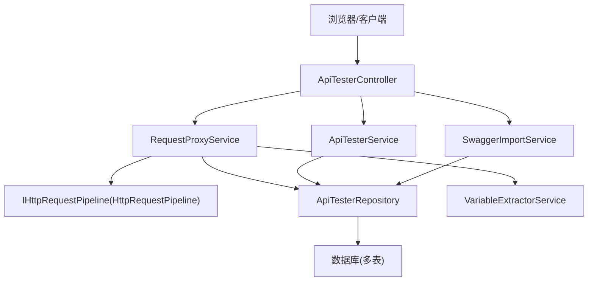
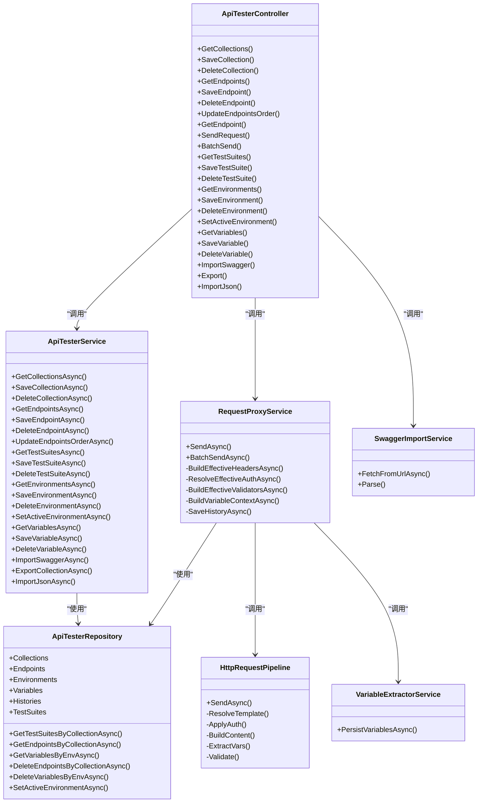
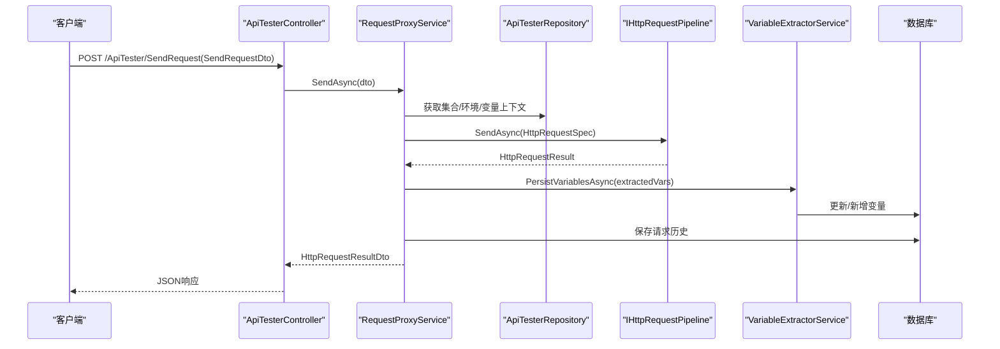
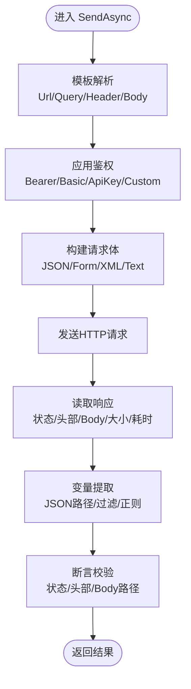
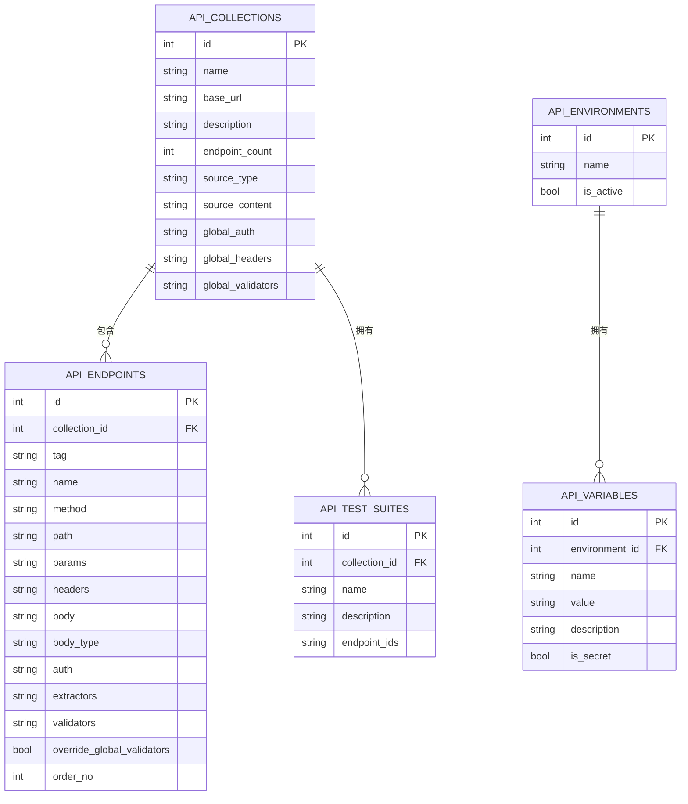
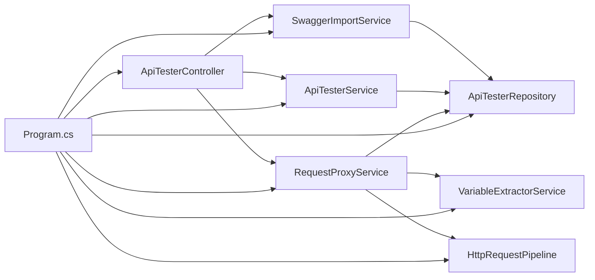

# API测试套件管理系统

<cite>
**本文引用的文件**   
- [Program.cs](file://Sylas.RemoteTasks.App/Program.cs)
- [ApiTesterController.cs](file://Sylas.RemoteTasks.App/Controllers/ApiTesterController.cs)
- [ApiTesterService.cs](file://Sylas.RemoteTasks.App/ApiTester/Services/ApiTesterService.cs)
- [RequestProxyService.cs](file://Sylas.RemoteTasks.App/ApiTester/Services/RequestProxyService.cs)
- [SwaggerImportService.cs](file://Sylas.RemoteTasks.App/ApiTester/Services/SwaggerImportService.cs)
- [VariableExtractorService.cs](file://Sylas.RemoteTasks.App/ApiTester/Services/VariableExtractorService.cs)
- [ApiTesterRepository.cs](file://Sylas.RemoteTasks.App/ApiTester/Repositories/ApiTesterRepository.cs)
- [ApiTesterDtos.cs](file://Sylas.RemoteTasks.App/ApiTester/Models/Dtos/ApiTesterDtos.cs)
- [ApiCollection.cs](file://Sylas.RemoteTasks.App/ApiTester/Models/Entities/ApiCollection.cs)
- [ApiEndpoint.cs](file://Sylas.RemoteTasks.App/ApiTester/Models/Entities/ApiEndpoint.cs)
- [ApiEnvironment.cs](file://Sylas.RemoteTasks.App/ApiTester/Models/Entities/ApiEnvironment.cs)
- [ApiTestSuite.cs](file://Sylas.RemoteTasks.App/ApiTester/Models/Entities/ApiTestSuite.cs)
- [HttpRequestPipeline.cs](file://Sylas.RemoteTasks.Utils/CommandExecutor/Http/HttpRequestPipeline.cs)
- [Index.cshtml](file://Sylas.RemoteTasks.App/Views/ApiTester/Index.cshtml)
</cite>

## 目录
1. [简介](#简介)
2. [项目结构](#项目结构)
3. [核心组件](#核心组件)
4. [架构总览](#架构总览)
5. [详细组件分析](#详细组件分析)
6. [依赖关系分析](#依赖关系分析)
7. [性能考量](#性能考量)
8. [故障排查指南](#故障排查指南)
9. [结论](#结论)
10. [附录](#附录)

## 简介
本系统是一个面向后端的API测试套件管理工具，提供集合、接口、环境变量与变量、测试套件的CRUD能力，支持从Swagger/OpenAPI导入接口定义，具备模板变量解析、请求头/参数合并、鉴权注入、响应提取、断言校验、批量执行与历史记录持久化等能力。前端采用MVC视图+静态资源组织，后端基于ASP.NET Core Web应用，通过控制器暴露REST接口，服务层编排业务逻辑，仓储层封装数据库访问，HTTP管道负责实际网络请求与结果处理。

## 项目结构
- 应用入口与依赖注入：Program.cs 统一注册控制器、SignalR、HttpClient、仓储、服务、后台服务等。
- 控制器层：ApiTesterController 暴露集合、接口、发送请求、测试套件、环境与变量、Swagger导入、导入导出等API。
- 服务层：
  - ApiTesterService：集合/接口/环境/变量/套件的CRUD与Swagger导入整合。
  - RequestProxyService：请求代理转发，合并全局配置、映射共享Spec、调用HTTP管道、落历史、持久化变量。
  - SwaggerImportService：解析Swagger v2/OpenAPI 3.x（JSON/YAML），生成集合与接口。
  - VariableExtractorService：将提取的变量写入当前激活环境。
- 仓储层：ApiTesterRepository 聚合6张表的通用CRUD与常用查询。
- 模型与DTO：实体类与传输对象清晰分离，便于前后端交互与数据库映射。
- HTTP管道：HttpRequestPipeline 实现模板解析、鉴权、Body构建、发送、提取、校验等核心流程。
- 前端视图：Index.cshtml 提供三栏界面与弹窗，配合静态JS/CSS完成交互。

图表来源 
- [Program.cs:13-98](file://Sylas.RemoteTasks.App/Program.cs#L13-L98)
- [ApiTesterController.cs:1-256](file://Sylas.RemoteTasks.App/Controllers/ApiTesterController.cs#L1-L256)
- [ApiTesterService.cs:1-359](file://Sylas.RemoteTasks.App/ApiTester/Services/ApiTesterService.cs#L1-L359)
- [RequestProxyService.cs:1-356](file://Sylas.RemoteTasks.App/ApiTester/Services/RequestProxyService.cs#L1-L356)
- [SwaggerImportService.cs:1-280](file://Sylas.RemoteTasks.App/ApiTester/Services/SwaggerImportService.cs#L1-L280)
- [VariableExtractorService.cs:1-58](file://Sylas.RemoteTasks.App/ApiTester/Services/VariableExtractorService.cs#L1-L58)
- [ApiTesterRepository.cs:1-93](file://Sylas.RemoteTasks.App/ApiTester/Repositories/ApiTesterRepository.cs#L1-L93)
- [HttpRequestPipeline.cs:1-534](file://Sylas.RemoteTasks.Utils/CommandExecutor/Http/HttpRequestPipeline.cs#L1-L534)

章节来源
- [Program.cs:13-98](file://Sylas.RemoteTasks.App/Program.cs#L13-L98)

## 核心组件
- 控制器：对外暴露REST接口，接收DTO并委托服务层处理，统一返回格式与异常处理。
- 服务层：
  - ApiTesterService：负责集合、接口、环境、变量、测试套件的增删改查与Swagger导入；维护集合接口计数；支持导入导出自有JSON格式。
  - RequestProxyService：构建有效Headers/Auth/Validators，映射为共享层Spec，调用HTTP管道，持久化变量与历史，支持批量顺序执行并共享上下文变量。
  - SwaggerImportService：自动识别JSON/YAML，解析paths、parameters、requestBody，生成集合与接口默认值。
  - VariableExtractorService：按激活环境持久化提取的变量，存在则更新，不存在则新增。
- 仓储层：集中持有6个实体的RepositoryBase实例，并提供按集合/环境查询、批量排序更新、级联删除、切换激活环境等便捷方法。
- HTTP管道：模板解析、URL拼接、鉴权注入、Body构建、发送、响应读取、变量提取、断言校验，输出结构化结果。

章节来源
- [ApiTesterController.cs:1-256](file://Sylas.RemoteTasks.App/Controllers/ApiTesterController.cs#L1-L256)
- [ApiTesterService.cs:1-359](file://Sylas.RemoteTasks.App/ApiTester/Services/ApiTesterService.cs#L1-L359)
- [RequestProxyService.cs:1-356](file://Sylas.RemoteTasks.App/ApiTester/Services/RequestProxyService.cs#L1-L356)
- [SwaggerImportService.cs:1-280](file://Sylas.RemoteTasks.App/ApiTester/Services/SwaggerImportService.cs#L1-L280)
- [VariableExtractorService.cs:1-58](file://Sylas.RemoteTasks.App/ApiTester/Services/VariableExtractorService.cs#L1-L58)
- [ApiTesterRepository.cs:1-93](file://Sylas.RemoteTasks.App/ApiTester/Repositories/ApiTesterRepository.cs#L1-L93)
- [HttpRequestPipeline.cs:1-534](file://Sylas.RemoteTasks.Utils/CommandExecutor/Http/HttpRequestPipeline.cs#L1-L534)

## 架构总览
系统采用分层架构：
- 表现层：MVC控制器 + Razor视图 + 静态资源
- 业务层：服务类组合仓储与外部能力（HTTP管道、Swagger解析）
- 数据层：RepositoryBase泛型仓储 + IDatabaseProvider直接SQL
- 横切关注点：认证授权、日志、异常处理、缓存、SignalR

图表来源 
- [ApiTesterController.cs:1-256](file://Sylas.RemoteTasks.App/Controllers/ApiTesterController.cs#L1-L256)
- [ApiTesterService.cs:1-359](file://Sylas.RemoteTasks.App/ApiTester/Services/ApiTesterService.cs#L1-L359)
- [RequestProxyService.cs:1-356](file://Sylas.RemoteTasks.App/ApiTester/Services/RequestProxyService.cs#L1-L356)
- [SwaggerImportService.cs:1-280](file://Sylas.RemoteTasks.App/ApiTester/Services/SwaggerImportService.cs#L1-L280)
- [VariableExtractorService.cs:1-58](file://Sylas.RemoteTasks.App/ApiTester/Services/VariableExtractorService.cs#L1-L58)
- [ApiTesterRepository.cs:1-93](file://Sylas.RemoteTasks.App/ApiTester/Repositories/ApiTesterRepository.cs#L1-L93)
- [HttpRequestPipeline.cs:1-534](file://Sylas.RemoteTasks.Utils/CommandExecutor/Http/HttpRequestPipeline.cs#L1-L534)

## 详细组件分析

### 控制器：ApiTesterController
- 职责：暴露集合、接口、发送请求、测试套件、环境与变量、Swagger导入、导入导出等REST接口；统一错误处理与日志记录。
- 关键流程：
  - SendRequest/BatchSend：委托RequestProxyService执行，捕获异常并返回统一格式。
  - GetEndpoint：根据Id获取接口详情，并附带所属集合信息。
  - ImportSwagger：委托ApiTesterService进行解析与入库。
  - Export/ImportJson：导出集合为自有JSON或导入自有JSON（含自动识别Swagger）。

章节来源
- [ApiTesterController.cs:1-256](file://Sylas.RemoteTasks.App/Controllers/ApiTesterController.cs#L1-L256)

### 服务：ApiTesterService
- 职责：集合/接口/环境/变量/测试套件的CRUD；Swagger导入整合；导入导出自有JSON；维护集合接口计数；批量排序更新。
- 关键点：
  - SaveEndpoint：新增时维护集合EndpointCount；更新时覆盖字段。
  - UpdateEndpointsOrder：仅更新OrderNo字段，提升拖拽排序性能。
  - ImportSwaggerAsync：先拉取或解析内容，创建集合，再批量插入接口。
  - ImportJsonAsync：检测是否为Swagger，若是走Swagger导入路径，否则按自有格式导入。

章节来源
- [ApiTesterService.cs:1-359](file://Sylas.RemoteTasks.App/ApiTester/Services/ApiTesterService.cs#L1-L359)

### 服务：RequestProxyService
- 职责：后端代理转发，合并全局配置，映射共享Spec，调用HTTP管道，持久化变量与历史，支持批量顺序执行。
- 关键流程：
  - BuildEffectiveHeadersAsync：合并集合全局Headers与接口Headers，同名接口优先。
  - ResolveEffectiveAuthAsync：若接口继承且集合存在GlobalAuth，则使用全局Auth。
  - BuildEffectiveValidatorsAsync：合并集合全局校验与接口校验，支持Override。
  - BuildVariableContextAsync：加载激活环境的变量作为上下文。
  - SendAsync：构造Spec，调用IHttpRequestPipeline.SendAsync，映射结果，持久化变量与历史。
  - BatchSendAsync：顺序执行多个接口，共享同一份变量上下文。

图表来源 
- [ApiTesterController.cs:92-122](file://Sylas.RemoteTasks.App/Controllers/ApiTesterController.cs#L92-L122)
- [RequestProxyService.cs:28-154](file://Sylas.RemoteTasks.App/ApiTester/Services/RequestProxyService.cs#L28-L154)
- [VariableExtractorService.cs:19-55](file://Sylas.RemoteTasks.App/ApiTester/Services/VariableExtractorService.cs#L19-L55)

章节来源
- [RequestProxyService.cs:1-356](file://Sylas.RemoteTasks.App/ApiTester/Services/RequestProxyService.cs#L1-L356)

### 服务：SwaggerImportService
- 职责：从URL拉取或解析本地内容（JSON/YAML），生成集合与接口列表。
- 关键点：
  - FetchFromUrlAsync：超时控制与字符串拉取。
  - Parse：自动识别JSON/YAML，解析info、servers/host/basePath、paths、parameters、requestBody，生成默认示例Body与类型。
  - SchemaToSample：简单schema→示例值生成，支持object/array/基本类型与$ref引用。

章节来源
- [SwaggerImportService.cs:1-280](file://Sylas.RemoteTasks.App/ApiTester/Services/SwaggerImportService.cs#L1-L280)

### 服务：VariableExtractorService
- 职责：将提取的变量写入当前激活环境，存在则更新，不存在则新增。
- 关键点：
  - 查找激活环境，按名称去重，批量更新/新增。

章节来源
- [VariableExtractorService.cs:1-58](file://Sylas.RemoteTasks.App/ApiTester/Services/VariableExtractorService.cs#L1-L58)

### 仓储：ApiTesterRepository
- 职责：聚合6张表的RepositoryBase，提供按集合/环境查询、批量排序更新、级联删除、切换激活环境等方法。
- 关键点：
  - GetEndpointsByCollectionAsync：按OrderNo与Id排序。
  - SetActiveEnvironmentAsync：原子切换激活状态。
  - DeleteEndpointsByCollectionAsync/DeleteVariablesByEnvAsync：级联清理。

章节来源
- [ApiTesterRepository.cs:1-93](file://Sylas.RemoteTasks.App/ApiTester/Repositories/ApiTesterRepository.cs#L1-L93)

### HTTP管道：HttpRequestPipeline
- 职责：模板解析、URL拼接、鉴权注入、Body构建、发送、响应读取、变量提取、断言校验。
- 关键点：
  - ResolveTemplate：支持{{var}}/${var}/$var模板，内置时间表达式。
  - ApplyAuth：Bearer、Basic、ApiKey（header/query）、Custom Headers。
  - BuildContent：none/json/form-urlencoded/form-data/xml/text。
  - ExtractVars：支持JSON路径、数组过滤、正则提取。
  - Validate：支持status、headers.*、body路径，操作符eq/ne/gt/lt/ge/le/contains/exists。

图表来源 
- [HttpRequestPipeline.cs:31-149](file://Sylas.RemoteTasks.Utils/CommandExecutor/Http/HttpRequestPipeline.cs#L31-L149)

章节来源
- [HttpRequestPipeline.cs:1-534](file://Sylas.RemoteTasks.Utils/CommandExecutor/Http/HttpRequestPipeline.cs#L1-L534)

### 模型与DTO
- 实体：
  - ApiCollection：集合基本信息、全局Auth/Headers/Validators、来源类型与原始内容。
  - ApiEndpoint：接口方法、路径、参数、请求头、Body、鉴权、提取器、校验器、排序号。
  - ApiEnvironment：环境名称与激活状态。
  - ApiTestSuite：有序接口ID列表（JSON数组）。
- DTO：
  - ApiCollectionSaveDto、ApiEndpointSaveDto、SendRequestDto、AuthDto、ExtractorDto、ValidatorDto、BatchSendDto、ApiTestSuiteSaveDto、SwaggerImportDto等。

图表来源 
- [ApiCollection.cs:1-51](file://Sylas.RemoteTasks.App/ApiTester/Models/Entities/ApiCollection.cs#L1-L51)
- [ApiEndpoint.cs:1-71](file://Sylas.RemoteTasks.App/ApiTester/Models/Entities/ApiEndpoint.cs#L1-L71)
- [ApiEnvironment.cs:1-23](file://Sylas.RemoteTasks.App/ApiTester/Models/Entities/ApiEnvironment.cs#L1-L23)
- [ApiTestSuite.cs:1-31](file://Sylas.RemoteTasks.App/ApiTester/Models/Entities/ApiTestSuite.cs#L1-L31)

章节来源
- [ApiTesterDtos.cs:1-279](file://Sylas.RemoteTasks.App/ApiTester/Models/Dtos/ApiTesterDtos.cs#L1-L279)
- [ApiCollection.cs:1-51](file://Sylas.RemoteTasks.App/ApiTester/Models/Entities/ApiCollection.cs#L1-L51)
- [ApiEndpoint.cs:1-71](file://Sylas.RemoteTasks.App/ApiTester/Models/Entities/ApiEndpoint.cs#L1-L71)
- [ApiEnvironment.cs:1-23](file://Sylas.RemoteTasks.App/ApiTester/Models/Entities/ApiEnvironment.cs#L1-L23)
- [ApiTestSuite.cs:1-31](file://Sylas.RemoteTasks.App/ApiTester/Models/Entities/ApiTestSuite.cs#L1-L31)

### 前端视图：Index.cshtml
- 三栏布局：左侧集合与接口列表、中间编辑器、右侧响应面板。
- 顶部工具栏：导入Swagger、全局授权、环境变量、全局校验、批量测试、新建接口、导出/导入。
- 弹窗：Swagger导入、环境变量管理、全局授权等。
- 全局状态：apiTesterState用于跨模块共享状态。

章节来源
- [Index.cshtml:1-200](file://Sylas.RemoteTasks.App/Views/ApiTester/Index.cshtml#L1-L200)

## 依赖关系分析
- Program.cs中注册了所有服务与仓储，确保依赖注入可用。
- ApiTesterController依赖ApiTesterService、RequestProxyService、SwaggerImportService。
- RequestProxyService依赖IHttpRequestPipeline、ApiTesterRepository、VariableExtractorService、IDatabaseProvider。
- ApiTesterService依赖ApiTesterRepository、SwaggerImportService。
- SwaggerImportService依赖IHttpClientFactory与YAML/JSON库。
- VariableExtractorService依赖ApiTesterRepository。
- ApiTesterRepository依赖IDatabaseProvider与RepositoryBase<T>。

图表来源 
- [Program.cs:13-98](file://Sylas.RemoteTasks.App/Program.cs#L13-L98)
- [ApiTesterController.cs:1-256](file://Sylas.RemoteTasks.App/Controllers/ApiTesterController.cs#L1-L256)
- [ApiTesterService.cs:1-359](file://Sylas.RemoteTasks.App/ApiTester/Services/ApiTesterService.cs#L1-L359)
- [RequestProxyService.cs:1-356](file://Sylas.RemoteTasks.App/ApiTester/Services/RequestProxyService.cs#L1-L356)
- [SwaggerImportService.cs:1-280](file://Sylas.RemoteTasks.App/ApiTester/Services/SwaggerImportService.cs#L1-L280)
- [VariableExtractorService.cs:1-58](file://Sylas.RemoteTasks.App/ApiTester/Services/VariableExtractorService.cs#L1-L58)
- [ApiTesterRepository.cs:1-93](file://Sylas.RemoteTasks.App/ApiTester/Repositories/ApiTesterRepository.cs#L1-L93)
- [HttpRequestPipeline.cs:1-534](file://Sylas.RemoteTasks.Utils/CommandExecutor/Http/HttpRequestPipeline.cs#L1-L534)

章节来源
- [Program.cs:13-98](file://Sylas.RemoteTasks.App/Program.cs#L13-L98)

## 性能考量
- 批量排序更新：UpdateEndpointsOrderAsync仅更新OrderNo字段，减少不必要的数据变更。
- 集合接口计数：EndpointCount冗余字段提升列表展示性能。
- 历史截断：SaveHistoryAsync对Body进行长度限制，避免大体积存储。
- HTTP超时：HttpRequestPipeline设置合理超时，避免阻塞。
- 模板解析：TmplHelper2内置时间表达式，减少预处理开销。
- 变量上下文：批量执行共享上下文，减少重复解析与查询。

[本节为通用指导，不直接分析具体文件]

## 故障排查指南
- 请求失败：检查HttpRequestPipeline中的异常日志与Error字段；确认URL、鉴权、Body类型是否正确。
- 变量未生效：确认激活环境已设置；检查VariableExtractorService是否成功持久化；查看历史记录的extractedVars。
- 校验失败：检查ValidatorResults中的Passed与Actual值；确认Expected模板解析正确。
- Swagger导入失败：确认Content或Url提供；检查YAML/JSON解析；查看日志中的警告信息。
- 历史未落库：检查IDatabaseProvider.InsertDataAsync调用是否抛出异常；确认表名与字段映射。

章节来源
- [RequestProxyService.cs:138-154](file://Sylas.RemoteTasks.App/ApiTester/Services/RequestProxyService.cs#L138-L154)
- [HttpRequestPipeline.cs:96-149](file://Sylas.RemoteTasks.Utils/CommandExecutor/Http/HttpRequestPipeline.cs#L96-L149)
- [SwaggerImportService.cs:96-110](file://Sylas.RemoteTasks.App/ApiTester/Services/SwaggerImportService.cs#L96-L110)

## 结论
本系统以清晰的层次结构与职责划分，实现了完整的API测试套件管理能力。通过Swagger导入、模板变量、鉴权注入、响应提取与断言校验，满足日常接口调试与回归测试需求。批量执行与历史持久化提升了效率与可追溯性。建议后续扩展更多校验规则、增强错误诊断与可视化报告。

[本节为总结，不直接分析具体文件]

## 附录
- 部署说明参考README.md中的Docker命令。
- 前端execute函数支持简单参数传递与复杂表单ID列表，详见README.md。

章节来源
- [README.md:1-43](file://README.md#L1-L43)