# 低代码VDS可视化编辑器系统

<cite>
**本文档引用的文件**
- [Program.cs](file://Sylas.RemoteTasks.App/Program.cs)
- [VdsPage.cs](file://Sylas.RemoteTasks.App/LowCode/VdsPage.cs)
- [LowCodeController.cs](file://Sylas.RemoteTasks.App/Controllers/LowCodeController.cs)
- [Index.cshtml](file://Sylas.RemoteTasks.App/Views/LowCode/Index.cshtml)
- [Render.cshtml](file://Sylas.RemoteTasks.App/Views/LowCode/Render.cshtml)
- [vds-configurator.js](file://Sylas.RemoteTasks.App/wwwroot/js/vds-configurator.js)
- [site.js](file://Sylas.RemoteTasks.App/wwwroot/js/site.js)
- [RepositoryBase.cs](file://Sylas.RemoteTasks.App/Infrastructure/RepositoryBase.cs)
- [EntityBase.cs](file://Sylas.RemoteTasks.Database/EntityBase.cs)
- [README.md](file://README.md)
- [VDS解析渲染.md](file://docs/VDS System/1. VDS解析渲染.md)
- [搜索实现-数据过滤实现时序图.txt](file://docs/VDS System/2. VDS实现site.js - 搜索实现 - 数据过滤实现时序图.txt)
- [架构总结.txt](file://docs/VDS System/3. 总结 把之前手动写js调用site.js的createTable渲染页面的这个js代码改为了动态生成.txt)
</cite>

## 更新摘要
**变更内容**
- 新增VDS解析渲染流程文档，详细说明配置编辑到页面渲染的完整流程
- 新增搜索实现时序图，展示数据源解析和搜索过滤的技术实现
- 新增架构总结文档，阐述从手动配置到动态生成的技术演进
- 完善数据源解析和搜索过滤功能的技术细节
- 增强自定义操作按钮和数据源字段的配置能力

## 目录
1. [简介](#简介)
2. [项目结构](#项目结构)
3. [核心组件](#核心组件)
4. [架构概览](#架构概览)
5. [详细组件分析](#详细组件分析)
6. [VDS解析渲染流程](#vds解析渲染流程)
7. [搜索实现时序图](#搜索实现时序图)
8. [架构总结](#架构总结)
9. [数据源解析机制](#数据源解析机制)
10. [搜索过滤实现](#搜索过滤实现)
11. [自定义操作按钮增强](#自定义操作按钮增强)
12. [依赖关系分析](#依赖关系分析)
13. [性能考虑](#性能考虑)
14. [故障排除指南](#故障排除指南)
15. [结论](#结论)

## 简介

低代码VDS可视化编辑器系统是一个基于ASP.NET Core构建的企业级低代码平台，专门用于快速创建和管理数据表格页面。该系统通过可视化的配置界面，让用户无需编写复杂代码即可生成功能完整的数据管理页面。

**更新** 新增了完整的VDS解析渲染流程文档、搜索实现时序图和架构总结文档，深入阐述了从配置编辑到页面渲染的技术实现细节。

系统的核心特色包括：
- 可视化VDS配置编辑器
- 支持多种字段类型的灵活配置
- 实时预览功能
- 多数据库支持
- 完整的CRUD操作
- 响应式设计
- **新增** VDS解析渲染完整流程
- **新增** 搜索实现时序图
- **新增** 架构演进总结
- **增强** 数据源解析机制
- **增强** 搜索过滤功能
- **增强** 自定义操作按钮配置

## 项目结构

该项目采用标准的ASP.NET Core项目结构，主要分为以下几个核心模块：

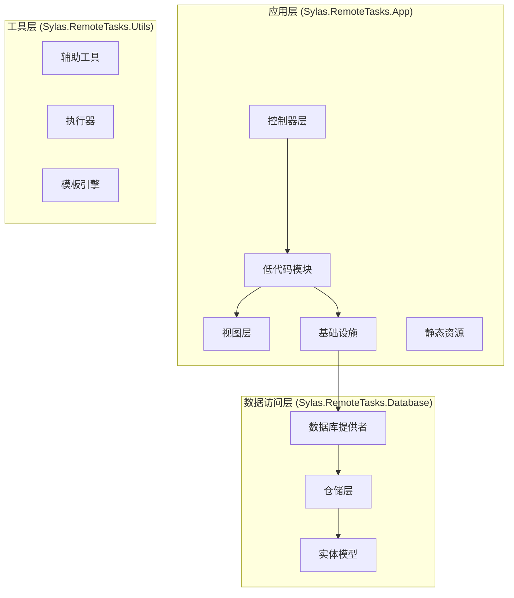

**图表来源**
- [Program.cs:12-89](file://Sylas.RemoteTasks.App/Program.cs#L12-L89)
- [README.md:1-43](file://README.md#L1-L43)

**章节来源**
- [Program.cs:12-89](file://Sylas.RemoteTasks.App/Program.cs#L12-L89)
- [README.md:1-43](file://README.md#L1-L43)

## 核心组件

### VDS页面配置实体

VdsPage是系统的核心实体，用于存储低代码页面的配置信息：

| 属性名 | 类型 | 描述 | 默认值 |
|--------|------|------|--------|
| Id | int | 主键标识符 | - |
| Name | string | 页面唯一标识符 | 空字符串 |
| Title | string | 页面显示标题 | 空字符串 |
| Description | string | 页面描述信息 | 空字符串 |
| VdsConfig | string | VDS配置JSON字符串 | "{}" |
| IsEnabled | bool | 页面是否启用 | true |
| OrderNo | int | 排序编号 | 0 |
| CreateTime | DateTime | 创建时间 | 当前时间 |
| UpdateTime | DateTime | 更新时间 | 当前时间 |

### 控制器层

系统采用分层架构设计，主要控制器包括：

- **LowCodeController**: 低代码页面管理控制器
- **DatabaseController**: 数据库管理控制器  
- **HostsController**: 主机管理控制器
- **ProjectController**: 项目管理控制器

每个控制器都遵循RESTful API设计原则，提供标准的CRUD操作接口。

**章节来源**
- [VdsPage.cs:10-62](file://Sylas.RemoteTasks.App/LowCode/VdsPage.cs#L10-L62)
- [LowCodeController.cs:13-162](file://Sylas.RemoteTasks.App/Controllers/LowCodeController.cs#L13-L162)

## 架构概览

系统采用经典的三层架构模式，结合依赖注入和服务定位器模式：

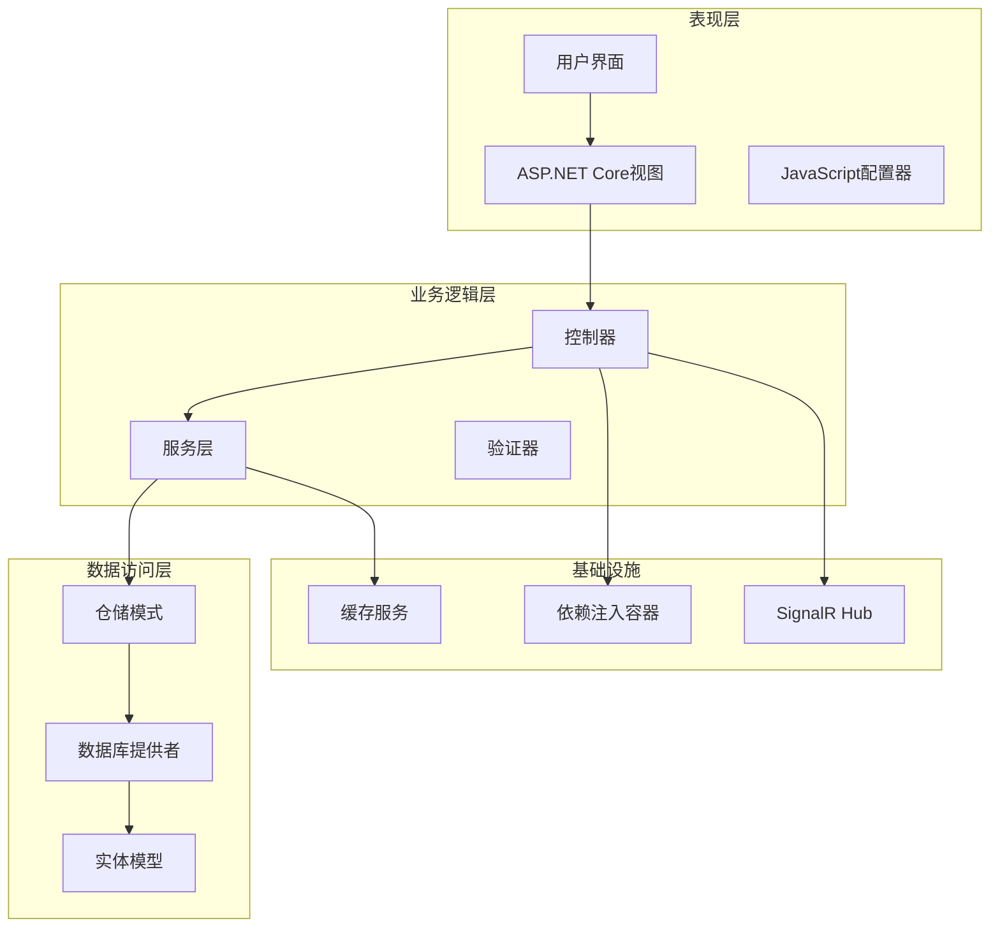

**图表来源**
- [Program.cs:26-68](file://Sylas.RemoteTasks.App/Program.cs#L26-L68)
- [RepositoryBase.cs:10-194](file://Sylas.RemoteTasks.App/Infrastructure/RepositoryBase.cs#L10-L194)

## 详细组件分析

### VDS可视化配置器

VdsConfigurator是系统的核心前端组件，提供了完整的可视化配置功能：

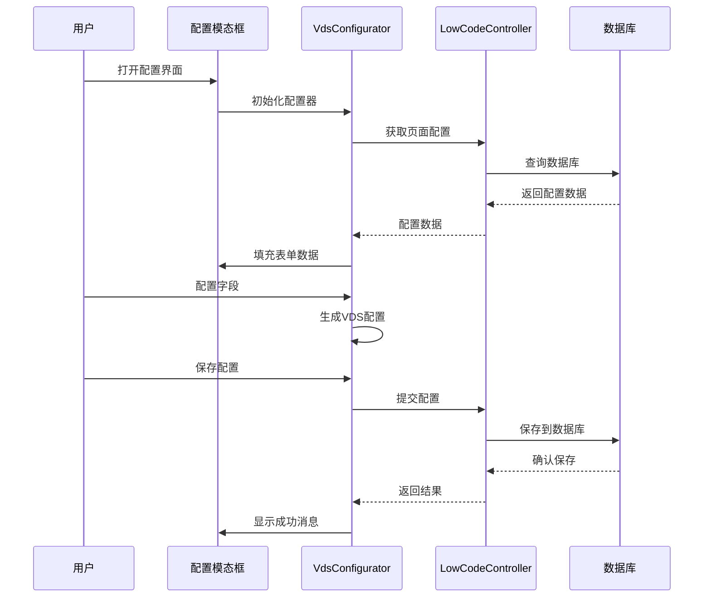

**图表来源**
- [vds-configurator.js:45-63](file://Sylas.RemoteTasks.App/wwwroot/js/vds-configurator.js#L45-L63)
- [LowCodeController.cs:56-116](file://Sylas.RemoteTasks.App/Controllers/LowCodeController.cs#L56-L116)

#### 字段类型支持

系统支持多种字段类型，每种类型都有特定的配置选项：

| 字段类型 | 描述 | 配置选项 |
|----------|------|----------|
| 文本 | 基础文本字段 | 搜索、截断、对齐 |
| 数字 | 数值类型字段 | 数字格式、精度 |
| 多行文本 | 长文本字段 | 行数、自动换行 |
| 枚举 | 下拉选择字段 | 选项列表 |
| 图片 | 图片显示字段 | 预览、尺寸 |
| 多媒体 | 媒体文件字段 | 播放器、格式 |
| 数据源 | 动态数据字段 | API、显示字段 |
| **操作按钮** | **交互按钮** | **预设、自定义** |

**章节来源**
- [vds-configurator.js:298-320](file://Sylas.RemoteTasks.App/wwwroot/js/vds-configurator.js#L298-L320)
- [vds-configurator.js:507-544](file://Sylas.RemoteTasks.App/wwwroot/js/vds-configurator.js#L507-L544)

### 数据持久化机制

系统采用仓储模式实现数据持久化，支持多种数据库类型：

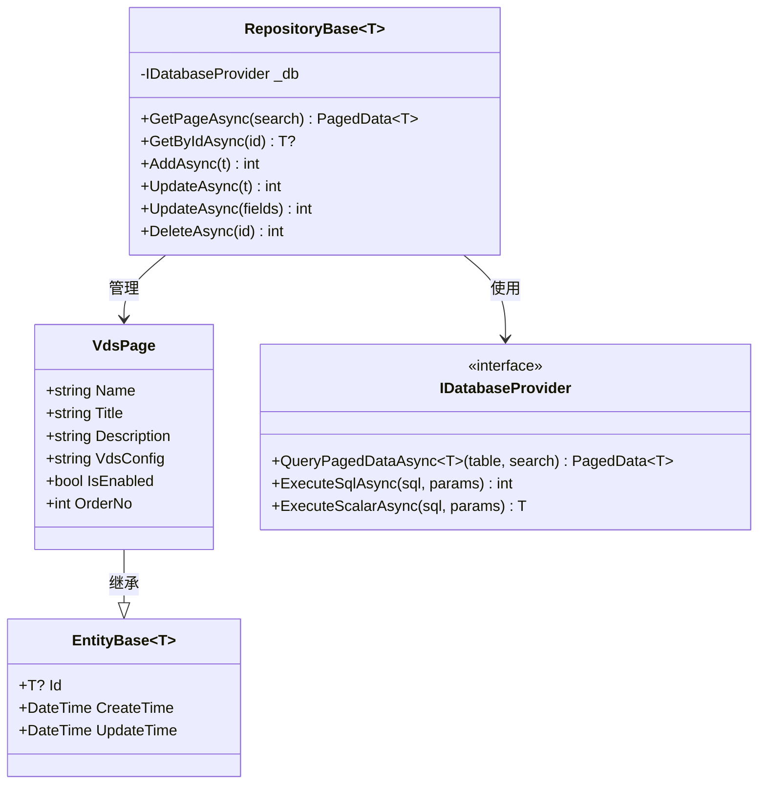

**图表来源**
- [RepositoryBase.cs:10-194](file://Sylas.RemoteTasks.App/Infrastructure/RepositoryBase.cs#L10-L194)
- [VdsPage.cs:11-62](file://Sylas.RemoteTasks.App/LowCode/VdsPage.cs#L11-L62)
- [EntityBase.cs:9-31](file://Sylas.RemoteTasks.Database/EntityBase.cs#L9-L31)

**章节来源**
- [RepositoryBase.cs:20-192](file://Sylas.RemoteTasks.App/Infrastructure/RepositoryBase.cs#L20-L192)
- [EntityBase.cs:9-31](file://Sylas.RemoteTasks.Database/EntityBase.cs#L9-L31)

### 前端渲染流程

系统采用前后端分离的渲染模式，后端负责数据处理，前端负责页面展示：

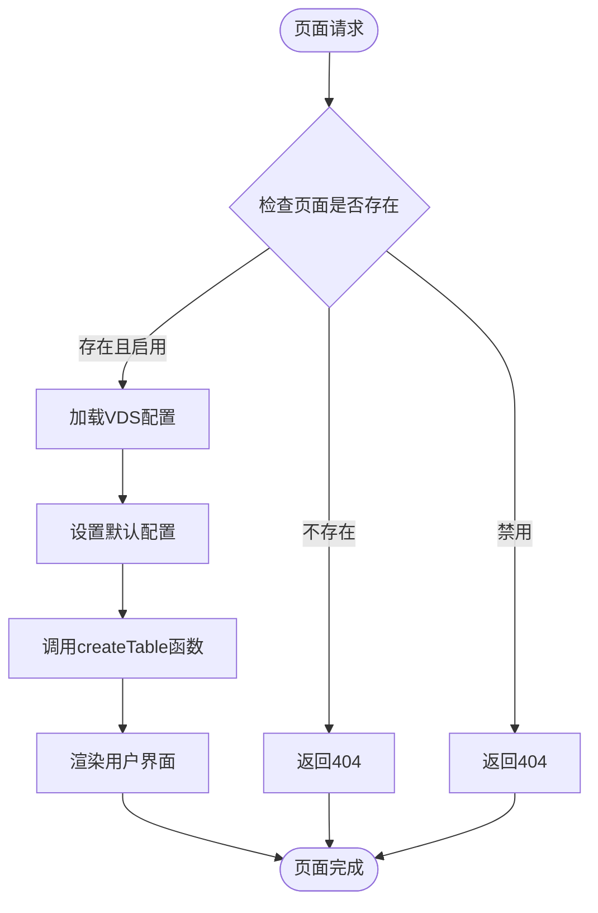

**图表来源**
- [LowCodeController.cs:126-144](file://Sylas.RemoteTasks.App/Controllers/LowCodeController.cs#L126-L144)
- [Render.cshtml:17-42](file://Sylas.RemoteTasks.App/Views/LowCode/Render.cshtml#L17-L42)

**章节来源**
- [LowCodeController.cs:126-159](file://Sylas.RemoteTasks.App/Controllers/LowCodeController.cs#L126-L159)
- [Render.cshtml:17-42](file://Sylas.RemoteTasks.App/Views/LowCode/Render.cshtml#L17-L42)

## VDS解析渲染流程

### 配置编辑阶段

VDS配置编辑器提供了完整的可视化配置功能，支持多种配置场景：

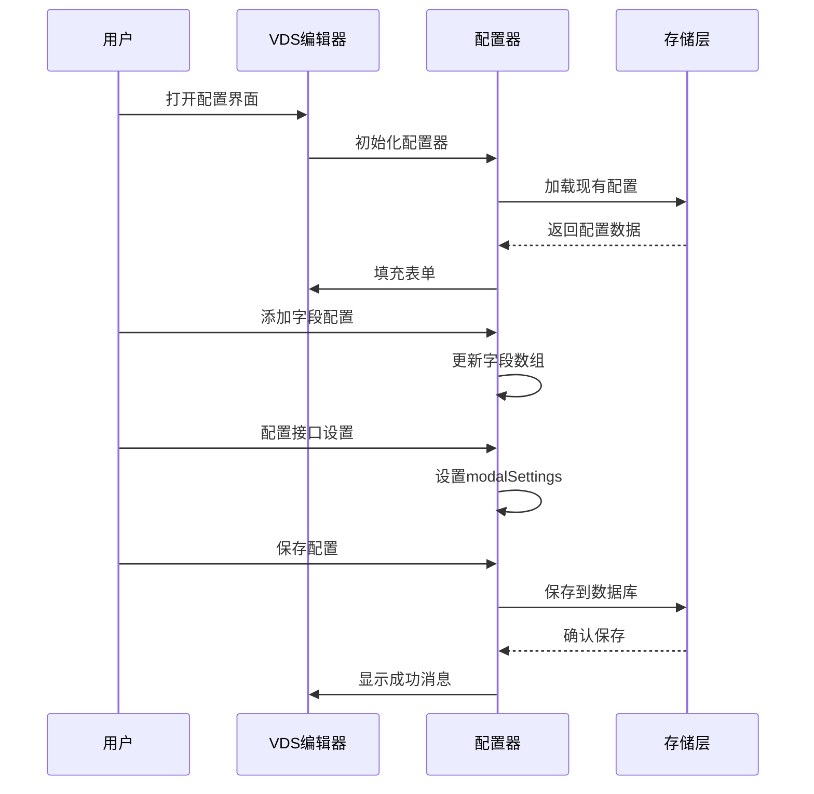

**图表来源**
- [VDS解析渲染.md:1-157](file://docs/VDS System/1. VDS解析渲染.md#L1-L157)

### 保存入库阶段

配置保存过程采用标准化的数据处理流程：

- **表单数据收集**: 从各个配置Tab收集用户输入
- **JSON配置构建**: 将表单数据组装为VDS配置对象
- **字段验证**: 验证必需字段的完整性
- **数据库持久化**: 通过仓储层保存到VdsPages表
- **配置回显**: 刷新列表显示新配置

### 页面渲染阶段

动态页面渲染采用前后端协作模式：

- **配置加载**: 从数据库获取VDS配置
- **配置解析**: 将JSON字符串解析为JavaScript对象
- **运行时配置**: 补充tableId、容器选择器等运行时属性
- **createTable调用**: 调用前端渲染函数生成页面
- **实时预览**: 支持配置修改后的即时预览

**章节来源**
- [VDS解析渲染.md:1-157](file://docs/VDS System/1. VDS解析渲染.md#L1-L157)

## 搜索实现时序图

### 数据源解析流程

系统实现了完整的数据源解析机制，支持动态数据字段：

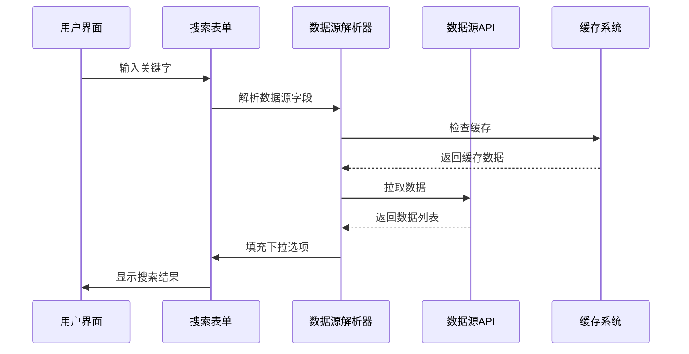

**图表来源**
- [搜索实现-数据过滤实现时序图.txt:1-17](file://docs/VDS System/2. VDS实现site.js - 搜索实现 - 数据过滤实现时序图.txt#L1-L17)

### 搜索过滤实现

搜索功能采用多层次过滤机制：

1. **关键字搜索**: 支持多字段关键字模糊匹配
2. **下拉筛选**: 基于数据源的精确筛选
3. **组合过滤**: 关键字和下拉筛选的组合使用
4. **实时响应**: 输入延迟触发搜索，避免频繁请求

**章节来源**
- [搜索实现-数据过滤实现时序图.txt:1-17](file://docs/VDS System/2. VDS实现site.js - 搜索实现 - 数据过滤实现时序图.txt#L1-L17)

## 架构总结

### 技术演进历程

系统经历了从手动配置到动态生成的技术演进：

**传统方式**: 在C#页面中手动创建配置对象，然后调用createTable函数渲染页面

**动态生成方式**: 将VDS配置转换为JavaScript对象，直接嵌入到Render.cshtml中

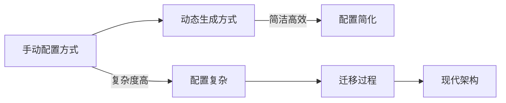

**图表来源**
- [架构总结.txt](file://docs/VDS System/3. 总结 把之前手动写js调用site.js的createTable渲染页面的这个js代码改为了动态生成.txt#L1)

### 架构优势

- **配置驱动**: VDS配置完全驱动页面行为
- **运行时解析**: JavaScript运行时解析配置，支持动态调整
- **前后端分离**: 前端负责渲染，后端负责数据，职责清晰
- **可扩展性**: 支持自定义字段类型和操作按钮
- **性能优化**: 数据源缓存和搜索防抖机制

**章节来源**
- [架构总结.txt](file://docs/VDS System/3. 总结 把之前手动写js调用site.js的createTable渲染页面的这个js代码改为了动态生成.txt#L1)

## 数据源解析机制

### 数据源字段类型

系统支持多种数据源字段类型，每种类型都有特定的解析规则：

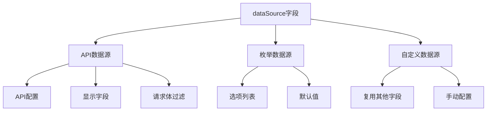

**图表来源**
- [site.js:527-583](file://Sylas.RemoteTasks.App/wwwroot/js/site.js#L527-L583)

### 数据源缓存策略

为提升性能，系统实现了智能缓存机制：

- **缓存键**: 基于数据源配置生成唯一键
- **缓存内容**: API返回的完整数据列表
- **缓存更新**: 首次请求后缓存，后续请求直接使用
- **缓存失效**: 配置变更时自动清理相关缓存

**章节来源**
- [site.js:554-565](file://Sylas.RemoteTasks.App/wwwroot/js/site.js#L554-L565)

## 搜索过滤实现

### 搜索表单构建

系统根据数据源字段动态构建搜索表单：

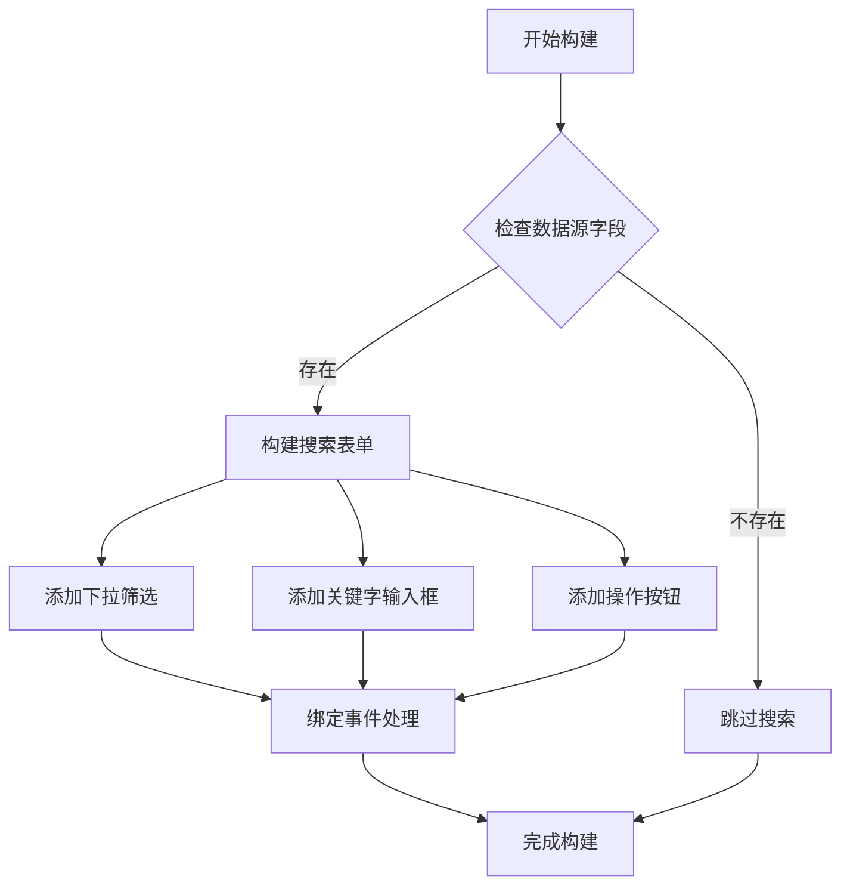

**图表来源**
- [site.js:585-669](file://Sylas.RemoteTasks.App/wwwroot/js/site.js#L585-L669)

### 过滤条件组合

搜索功能支持多种过滤条件的组合：

- **关键字过滤**: 支持多字段模糊匹配
- **精确过滤**: 基于下拉选择的精确匹配
- **组合过滤**: 关键字和精确过滤的组合使用
- **延迟执行**: 输入防抖，避免频繁请求

**章节来源**
- [site.js:635-668](file://Sylas.RemoteTasks.App/wwwroot/js/site.js#L635-L668)

## 自定义操作按钮增强

### 按钮配置系统

系统提供了完整的自定义操作按钮配置能力：

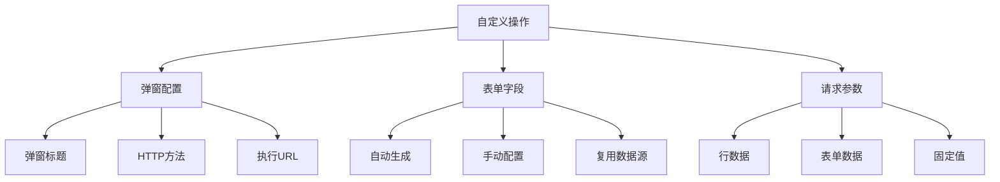

**图表来源**
- [vds-configurator.js:649-776](file://Sylas.RemoteTasks.App/wwwroot/js/vds-configurator.js#L649-L776)

### 按钮模板生成

系统支持多种按钮模板的动态生成：

- **预设按钮**: 编辑、删除、查看等常用按钮
- **自定义按钮**: 支持CSS类名和事件绑定
- **回调按钮**: 支持onDataAllLoaded回调绑定
- **API按钮**: 直接执行API的按钮配置

**章节来源**
- [vds-configurator.js:603-643](file://Sylas.RemoteTasks.App/wwwroot/js/vds-configurator.js#L603-L643)

## 依赖关系分析

系统采用模块化设计，各组件之间的依赖关系清晰明确：

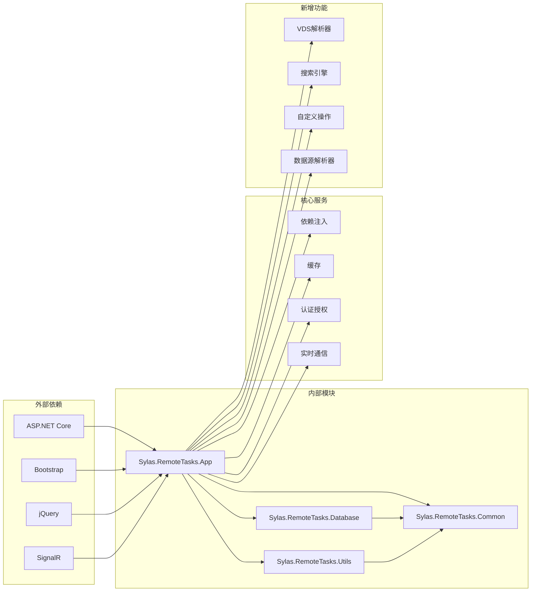

**图表来源**
- [Program.cs:1-122](file://Sylas.RemoteTasks.App/Program.cs#L1-L122)

**章节来源**
- [Program.cs:26-68](file://Sylas.RemoteTasks.App/Program.cs#L26-L68)

## 性能考虑

### 数据库优化

系统在数据库层面采用了多项优化措施：

1. **分页查询优化**: 使用`DataSearch`类实现高效的分页查询
2. **索引字段**: 关键查询字段建立适当索引
3. **批量操作**: 支持批量插入和更新操作
4. **连接池管理**: 合理配置数据库连接池

### 前端性能优化

1. **懒加载**: 配置器按需加载，减少初始加载时间
2. **缓存策略**: 重要数据进行客户端缓存
3. **异步操作**: 所有网络请求采用异步模式
4. **资源压缩**: 静态资源进行压缩和合并
5. **拖拽性能优化**: 使用requestAnimationFrame和GPU加速
6. **模板缓存**: 按钮模板数据本地缓存
7. **数据源缓存**: API数据缓存机制
8. **搜索防抖**: 输入延迟触发，避免频繁请求

### 服务端优化

1. **依赖注入**: 使用IoC容器管理对象生命周期
2. **中间件管道**: 优化HTTP请求处理管道
3. **异常处理**: 统一的异常处理机制
4. **日志记录**: 结构化日志记录

## 故障排除指南

### 常见问题及解决方案

#### 1. 页面无法加载

**症状**: 访问VDS页面时返回404错误

**可能原因**:
- 页面配置不存在
- 页面被禁用
- URL路由配置错误

**解决步骤**:
1. 检查数据库中是否存在对应的VdsPage记录
2. 验证IsEnabled字段是否为true
3. 确认URL格式是否正确

#### 2. 配置器无法保存

**症状**: 修改VDS配置后无法保存

**可能原因**:
- 权限不足
- JSON格式错误
- 网络请求失败

**解决步骤**:
1. 检查用户权限和认证状态
2. 使用"格式化"功能验证JSON格式
3. 查看浏览器开发者工具中的网络请求

#### 3. 数据显示异常

**症状**: 页面数据显示不正确或缺失

**可能原因**:
- API接口返回数据格式错误
- 字段映射配置错误
- 数据库连接问题

**解决步骤**:
1. 检查API接口返回的数据结构
2. 验证字段配置与数据库表结构匹配
3. 测试数据库连接和查询

#### 4. 搜索功能异常

**症状**: 搜索功能无法正常工作

**可能原因**:
- 数据源API配置错误
- 缓存数据过期
- 搜索条件格式错误

**解决步骤**:
1. 检查数据源API的可达性和返回格式
2. 清除相关缓存数据
3. 验证搜索条件的配置

#### 5. 自定义操作按钮配置问题

**症状**: 自定义操作按钮配置无效或报错

**可能原因**:
- 模板语法错误
- 占位符使用不当
- 按钮配置冲突
- 拖拽模态框初始化失败

**解决步骤**:
1. 检查模板语法是否正确
2. 验证占位符是否匹配实际字段
3. 确认按钮配置没有重复或冲突
4. 检查拖拽模态框的初始化代码

#### 6. 数据源解析失败

**症状**: 数据源字段无法正确显示

**可能原因**:
- 数据源API不可用
- 显示字段配置错误
- 缓存数据损坏

**解决步骤**:
1. 测试数据源API的连通性和响应
2. 验证displayField配置的正确性
3. 清除相关数据源缓存

**章节来源**
- [LowCodeController.cs:133-141](file://Sylas.RemoteTasks.App/Controllers/LowCodeController.cs#L133-L141)
- [vds-configurator.js:598-606](file://Sylas.RemoteTasks.App/wwwroot/js/vds-configurator.js#L598-L606)

## 结论

低代码VDS可视化编辑器系统是一个功能完整、架构清晰的企业级低代码平台。通过新增的VDS解析渲染流程文档、搜索实现时序图和架构总结文档，系统的技术实现得到了全面阐述。

系统的主要成就包括：

1. **完整的生命周期管理**: 从配置编辑到页面渲染的全流程覆盖
2. **智能化的数据源解析**: 支持多种数据源类型的动态解析和缓存
3. **高效的搜索过滤机制**: 多层次搜索和实时响应的优化实现
4. **灵活的自定义操作**: 完整的自定义按钮和操作配置能力
5. **现代化的架构演进**: 从手动配置到动态生成的技术升级
6. **优秀的性能表现**: 多层优化策略确保系统响应速度
7. **完善的错误处理**: 清晰的故障排除和问题诊断机制

该系统特别适合需要快速开发数据管理界面的场景，能够显著提高开发效率并降低维护成本。随着VDS解析渲染流程、搜索实现机制和架构演进的不断完善，该系统将继续为企业级低代码解决方案提供强有力的技术支撑。

**更新** 最新的VDS解析渲染流程文档、搜索实现时序图和架构总结文档为系统的技术理解和使用提供了宝贵的参考资料，进一步增强了系统的透明度和可维护性。