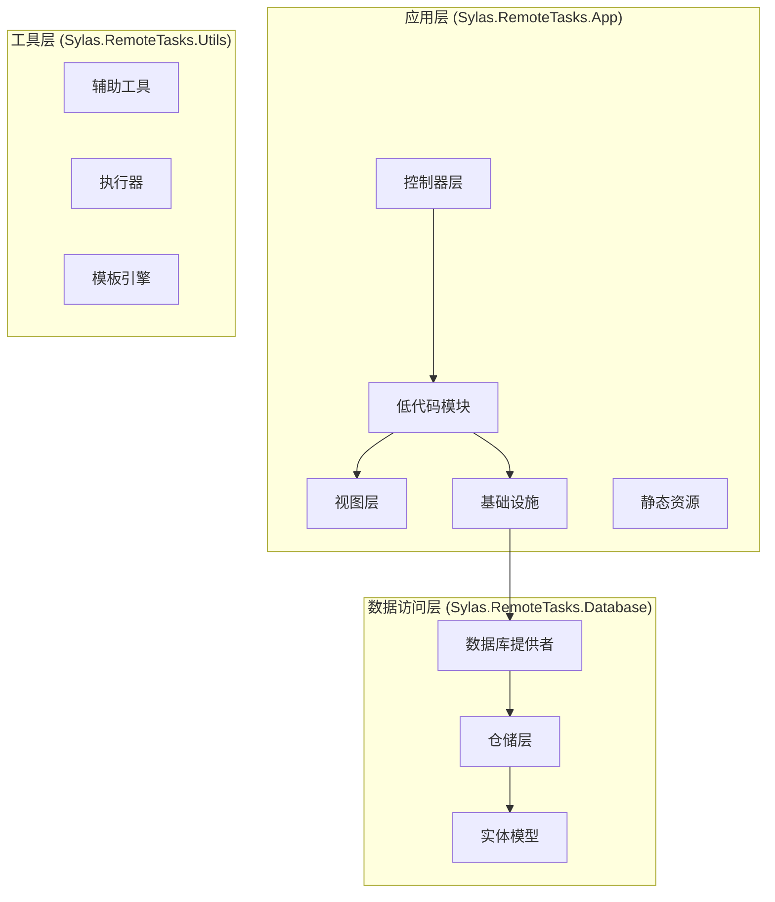
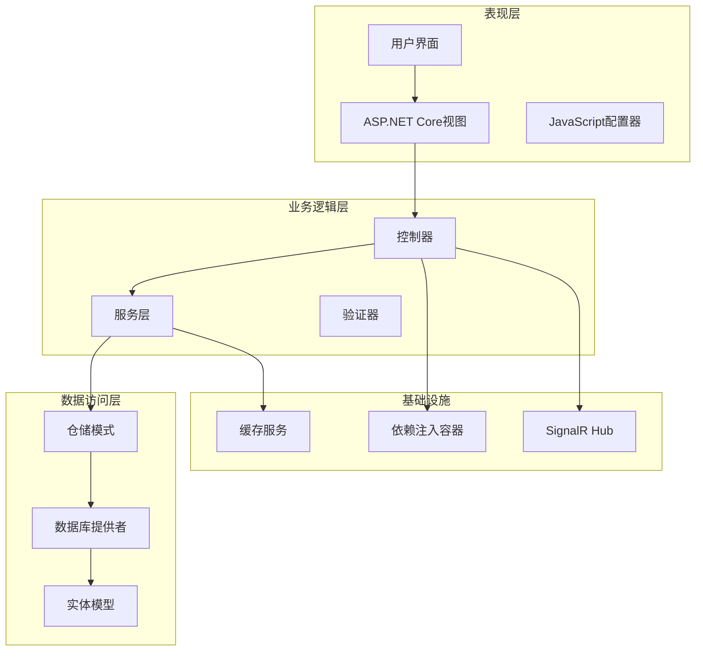
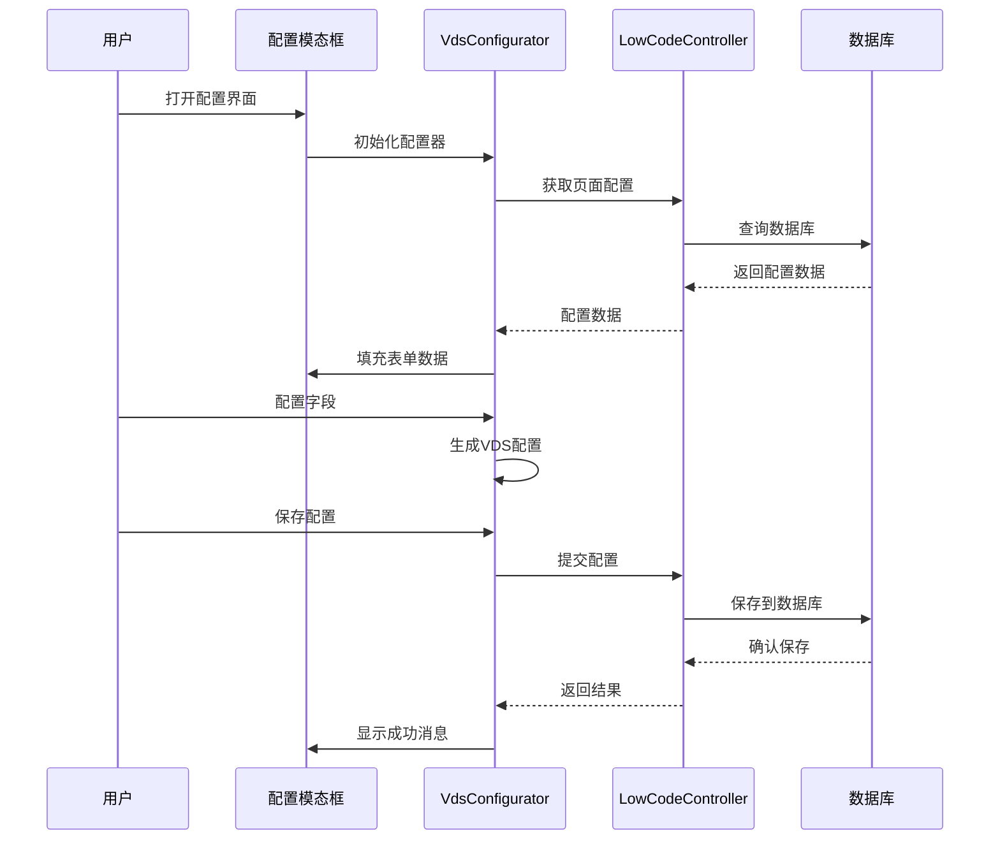
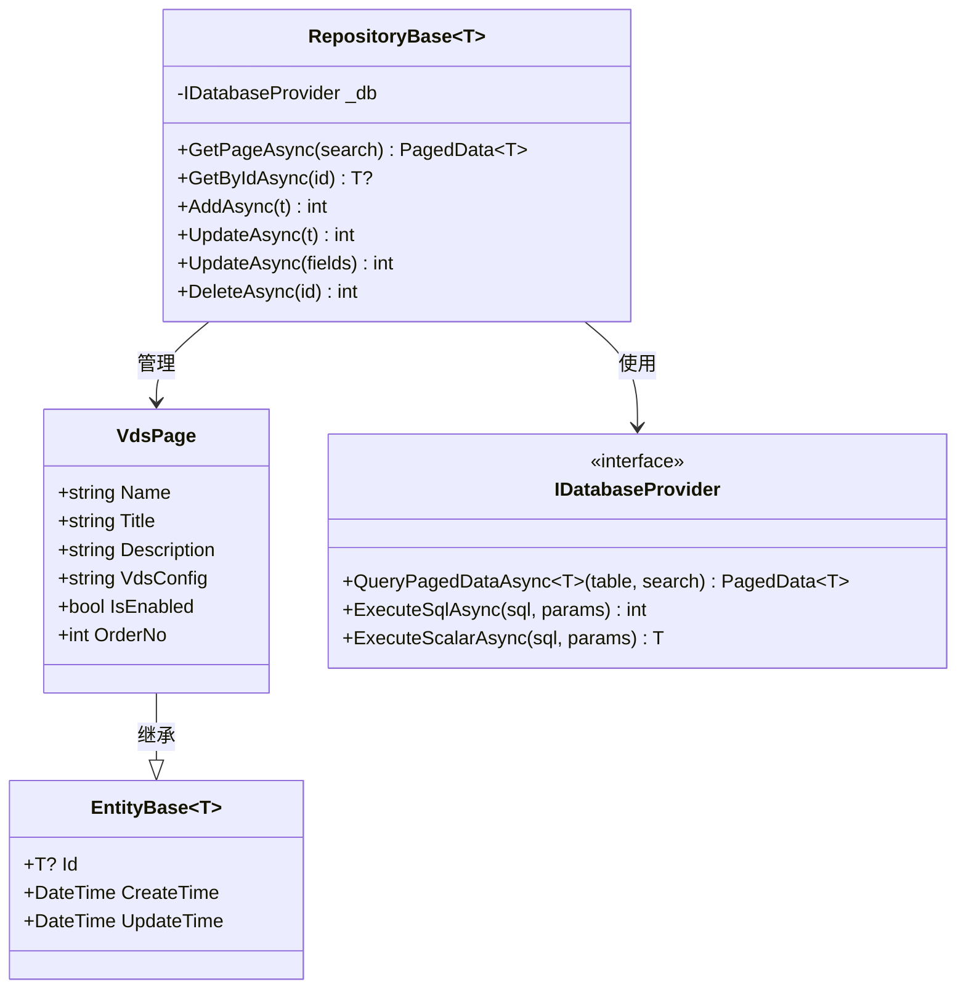
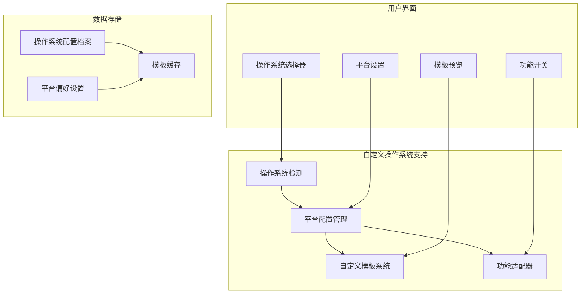
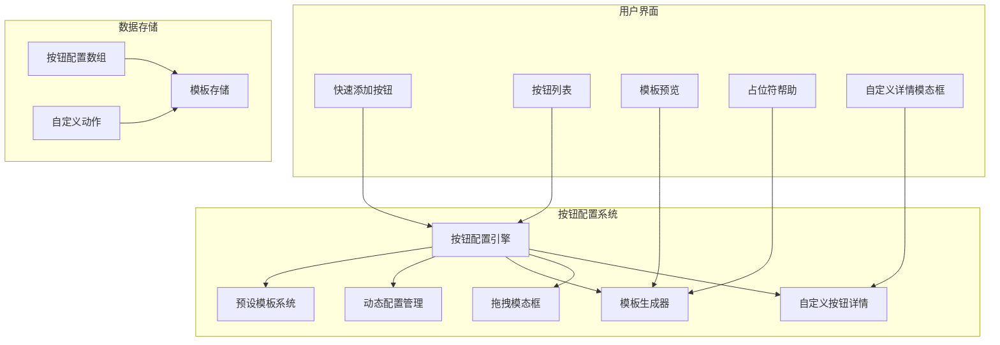
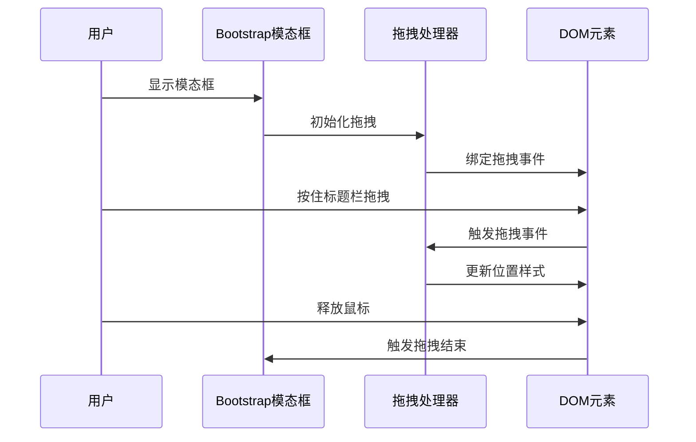
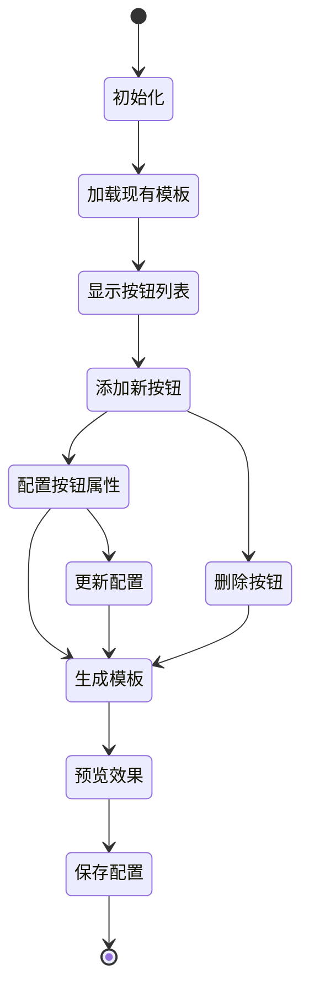
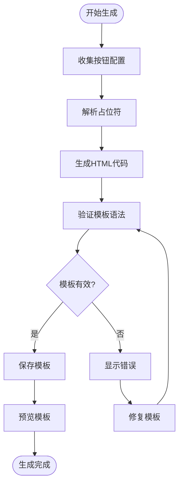
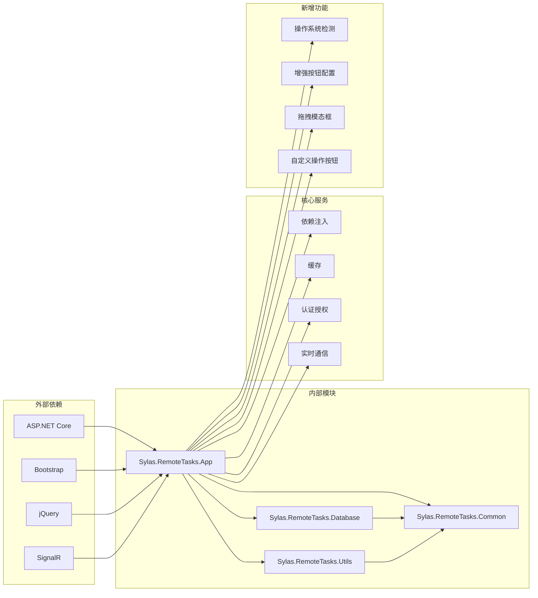

# 低代码VDS可视化编辑器系统

<cite>
**本文档引用的文件**
- [Program.cs](file://Sylas.RemoteTasks.App/Program.cs)
- [VdsPage.cs](file://Sylas.RemoteTasks.App/LowCode/VdsPage.cs)
- [LowCodeController.cs](file://Sylas.RemoteTasks.App/Controllers/LowCodeController.cs)
- [Index.cshtml](file://Sylas.RemoteTasks.App/Views/LowCode/Index.cshtml)
- [Render.cshtml](file://Sylas.RemoteTasks.App/Views/LowCode/Render.cshtml)
- [vds-configurator.js](file://Sylas.RemoteTasks.App/wwwroot/js/vds-configurator.js)
- [RepositoryBase.cs](file://Sylas.RemoteTasks.App/Infrastructure/RepositoryBase.cs)
- [EntityBase.cs](file://Sylas.RemoteTasks.Database/EntityBase.cs)
- [README.md](file://README.md)
</cite>

## 更新摘要
**变更内容**
- 新增自定义操作系统支持功能
- 增强操作按钮配置系统，支持拖拽模态框交互体验
- 新增自定义操作按钮配置功能
- 完善按钮模板生成和管理机制
- 优化模态框拖拽性能和用户体验

## 目录
1. [简介](#简介)
2. [项目结构](#项目结构)
3. [核心组件](#核心组件)
4. [架构概览](#架构概览)
5. [详细组件分析](#详细组件分析)
6. [自定义操作系统支持](#自定义操作系统支持)
7. [增强的按钮配置系统](#增强的按钮配置系统)
8. [拖拽模态框交互体验](#拖拽模态框交互体验)
9. [自定义操作按钮配置](#自定义操作按钮配置)
10. [按钮模板生成与管理](#按钮模板生成与管理)
11. [依赖关系分析](#依赖关系分析)
12. [性能考虑](#性能考虑)
13. [故障排除指南](#故障排除指南)
14. [结论](#结论)

## 简介

低代码VDS可视化编辑器系统是一个基于ASP.NET Core构建的企业级低代码平台，专门用于快速创建和管理数据表格页面。该系统通过可视化的配置界面，让用户无需编写复杂代码即可生成功能完整的数据管理页面。

**更新** 新增了强大的自定义操作系统支持功能，包括增强的操作按钮配置系统、拖拽模态框交互体验和自定义操作按钮配置能力。

系统的核心特色包括：
- 可视化VDS配置编辑器
- 支持多种字段类型的灵活配置
- 实时预览功能
- 多数据库支持
- 完整的CRUD操作
- 响应式设计
- **新增** 自定义操作系统支持
- **新增** 增强的按钮配置系统
- **新增** 拖拽模态框交互体验
- **新增** 自定义操作按钮配置
- **新增** 按钮模板生成和管理机制

## 项目结构

该项目采用标准的ASP.NET Core项目结构，主要分为以下几个核心模块：

**图表来源**
- [Program.cs](file://Sylas.RemoteTasks.App/Program.cs#L12-L89)
- [README.md](file://README.md#L1-L43)

**章节来源**
- [Program.cs](file://Sylas.RemoteTasks.App/Program.cs#L12-L89)
- [README.md](file://README.md#L1-L43)

## 核心组件

### VDS页面配置实体

VdsPage是系统的核心实体，用于存储低代码页面的配置信息：

| 属性名 | 类型 | 描述 | 默认值 |
|--------|------|------|--------|
| Id | int | 主键标识符 | - |
| Name | string | 页面唯一标识符 | 空字符串 |
| Title | string | 页面显示标题 | 空字符串 |
| Description | string | 页面描述信息 | 空字符串 |
| VdsConfig | string | VDS配置JSON字符串 | "{}" |
| IsEnabled | bool | 页面是否启用 | true |
| OrderNo | int | 排序编号 | 0 |
| CreateTime | DateTime | 创建时间 | 当前时间 |
| UpdateTime | DateTime | 更新时间 | 当前时间 |

### 控制器层

系统采用分层架构设计，主要控制器包括：

- **LowCodeController**: 低代码页面管理控制器
- **DatabaseController**: 数据库管理控制器  
- **HostsController**: 主机管理控制器
- **ProjectController**: 项目管理控制器

每个控制器都遵循RESTful API设计原则，提供标准的CRUD操作接口。

**章节来源**
- [VdsPage.cs](file://Sylas.RemoteTasks.App/LowCode/VdsPage.cs#L10-L62)
- [LowCodeController.cs](file://Sylas.RemoteTasks.App/Controllers/LowCodeController.cs#L13-L162)

## 架构概览

系统采用经典的三层架构模式，结合依赖注入和服务定位器模式：

**图表来源**
- [Program.cs](file://Sylas.RemoteTasks.App/Program.cs#L26-L68)
- [RepositoryBase.cs](file://Sylas.RemoteTasks.App/Infrastructure/RepositoryBase.cs#L10-L194)

## 详细组件分析

### VDS可视化配置器

VdsConfigurator是系统的核心前端组件，提供了完整的可视化配置功能：

**图表来源**
- [vds-configurator.js](file://Sylas.RemoteTasks.App/wwwroot/js/vds-configurator.js#L45-L63)
- [LowCodeController.cs](file://Sylas.RemoteTasks.App/Controllers/LowCodeController.cs#L56-L116)

#### 字段类型支持

系统支持多种字段类型，每种类型都有特定的配置选项：

| 字段类型 | 描述 | 配置选项 |
|----------|------|----------|
| 文本 | 基础文本字段 | 搜索、截断、对齐 |
| 数字 | 数值类型字段 | 数字格式、精度 |
| 多行文本 | 长文本字段 | 行数、自动换行 |
| 枚举 | 下拉选择字段 | 选项列表 |
| 图片 | 图片显示字段 | 预览、尺寸 |
| 多媒体 | 媒体文件字段 | 播放器、格式 |
| 数据源 | 动态数据字段 | API、显示字段 |
| **操作按钮** | **交互按钮** | **预设、自定义** |

**章节来源**
- [vds-configurator.js](file://Sylas.RemoteTasks.App/wwwroot/js/vds-configurator.js#L298-L320)
- [vds-configurator.js](file://Sylas.RemoteTasks.App/wwwroot/js/vds-configurator.js#L507-L544)

### 数据持久化机制

系统采用仓储模式实现数据持久化，支持多种数据库类型：

**图表来源**
- [RepositoryBase.cs](file://Sylas.RemoteTasks.App/Infrastructure/RepositoryBase.cs#L10-L194)
- [VdsPage.cs](file://Sylas.RemoteTasks.App/LowCode/VdsPage.cs#L11-L62)
- [EntityBase.cs](file://Sylas.RemoteTasks.Database/EntityBase.cs#L9-L31)

**章节来源**
- [RepositoryBase.cs](file://Sylas.RemoteTasks.App/Infrastructure/RepositoryBase.cs#L20-L192)
- [EntityBase.cs](file://Sylas.RemoteTasks.Database/EntityBase.cs#L9-L31)

### 前端渲染流程

系统采用前后端分离的渲染模式，后端负责数据处理，前端负责页面展示：

**图表来源**
- [LowCodeController.cs](file://Sylas.RemoteTasks.App/Controllers/LowCodeController.cs#L126-L144)
- [Render.cshtml](file://Sylas.RemoteTasks.App/Views/LowCode/Render.cshtml#L17-L42)

**章节来源**
- [LowCodeController.cs](file://Sylas.RemoteTasks.App/Controllers/LowCodeController.cs#L126-L159)
- [Render.cshtml](file://Sylas.RemoteTasks.App/Views/LowCode/Render.cshtml#L17-L42)

## 自定义操作系统支持

### 系统架构

系统新增了自定义操作系统支持功能，为不同平台提供定制化的配置能力：

**图表来源**
- [vds-configurator.js](file://Sylas.RemoteTasks.App/wwwroot/js/vds-configurator.js#L421-L427)
- [Index.cshtml](file://Sylas.RemoteTasks.App/Views/LowCode/Index.cshtml#L290-L318)

### 支持的操作系统类型

系统支持多种操作系统类型，每种都有特定的配置选项：

| 操作系统 | 描述 | 特殊配置 |
|----------|------|----------|
| Windows | 微软Windows系统 | 文件路径、注册表访问 |
| Linux | 各种Linux发行版 | Shell命令、权限管理 |
| macOS | 苹果macOS系统 | Finder集成、权限控制 |
| Android | 安卓移动系统 | Activity管理、权限请求 |
| iOS | 苹果iOS系统 | App Store集成、权限管理 |

**章节来源**
- [vds-configurator.js](file://Sylas.RemoteTasks.App/wwwroot/js/vds-configurator.js#L443-L476)
- [vds-configurator.js](file://Sylas.RemoteTasks.App/wwwroot/js/vds-configurator.js#L515-L527)

## 增强的按钮配置系统

### 系统架构

增强的按钮配置系统提供了完整的按钮配置能力，支持拖拽模态框交互：

**图表来源**
- [vds-configurator.js](file://Sylas.RemoteTasks.App/wwwroot/js/vds-configurator.js#L421-L427)
- [Index.cshtml](file://Sylas.RemoteTasks.App/Views/LowCode/Index.cshtml#L290-L318)

### 按钮类型支持

系统支持多种预设按钮类型，每种类型都有特定的配置选项：

| 按钮类型 | 描述 | 配置选项 |
|----------|------|----------|
| 编辑 | 编辑记录按钮 | 样式、文本、图标 |
| 删除 | 删除记录按钮 | 样式、确认对话框、API URL |
| 查看 | 查看详情按钮 | 样式、跳转URL |
| 自定义 | 自定义操作按钮 | CSS类名、执行方式、确认框 |

**章节来源**
- [vds-configurator.js](file://Sylas.RemoteTasks.App/wwwroot/js/vds-configurator.js#L443-L476)
- [vds-configurator.js](file://Sylas.RemoteTasks.App/wwwroot/js/vds-configurator.js#L515-L527)

## 拖拽模态框交互体验

### 模态框实现

系统集成了Bootstrap的模态框功能，并增加了高性能的拖拽支持：

**图表来源**
- [vds-configurator.js](file://Sylas.RemoteTasks.App/wwwroot/js/vds-configurator.js#L629-L662)

### 拖拽功能特性

- **高性能拖拽**: 使用requestAnimationFrame优化拖拽性能
- **GPU加速**: 启用will-change属性实现硬件加速
- **边界限制**: 自动限制在可视区域内
- **位置记忆**: 保持拖拽后的相对位置
- **响应式适配**: 自适应不同屏幕尺寸
- **即时响应**: 禁用过渡动画确保拖拽即时响应

**章节来源**
- [vds-configurator.js](file://Sylas.RemoteTasks.App/wwwroot/js/vds-configurator.js#L660-L662)

## 自定义操作按钮配置

### 配置管理

自定义操作按钮配置系统提供了完整的按钮配置管理能力：

**图表来源**
- [vds-configurator.js](file://Sylas.RemoteTasks.App/wwwroot/js/vds-configurator.js#L431-L438)
- [vds-configurator.js](file://Sylas.RemoteTasks.App/wwwroot/js/vds-configurator.js#L536-L551)

### 配置属性

每个按钮都可以配置以下属性：

- **类型**: 编辑、删除、查看、自定义
- **样式**: 按钮样式（primary、secondary、success等）
- **文本**: 按钮显示文本
- **URL**: 跳转链接（适用于查看按钮）
- **class名称**: 自定义CSS类名（适用于自定义按钮）
- **事件绑定**: JavaScript事件处理
- **执行方式**: 回调绑定或直接执行API
- **确认框**: 执行前是否需要确认对话框

**章节来源**
- [vds-configurator.js](file://Sylas.RemoteTasks.App/wwwroot/js/vds-configurator.js#L515-L527)
- [vds-configurator.js](file://Sylas.RemoteTasks.App/wwwroot/js/vds-configurator.js#L536-L551)

## 按钮模板生成与管理

### 生成流程

按钮模板生成系统负责将按钮配置转换为可执行的HTML代码：

**图表来源**
- [vds-configurator.js](file://Sylas.RemoteTasks.App/wwwroot/js/vds-configurator.js#L667-L673)

### 模板输出

系统支持生成多种格式的按钮模板：

- **HTML按钮**: `<button class="btn btn-primary btn-sm">编辑</button>`
- **链接按钮**: `<a href="/edit/{{id}}" class="btn btn-primary">编辑</a>`
- **JavaScript按钮**: `<button onclick="editRecord({{id}})">编辑</button>`
- **回调按钮**: `<button class="custom-action" data-table-id="{{tableId}}" data-id="{{id}}">操作</button>`

**章节来源**
- [vds-configurator.js](file://Sylas.RemoteTasks.App/wwwroot/js/vds-configurator.js#L667-L673)

## 依赖关系分析

系统采用模块化设计，各组件之间的依赖关系清晰明确：

**图表来源**
- [Program.cs](file://Sylas.RemoteTasks.App/Program.cs#L1-L122)

**章节来源**
- [Program.cs](file://Sylas.RemoteTasks.App/Program.cs#L26-L68)

## 性能考虑

### 数据库优化

系统在数据库层面采用了多项优化措施：

1. **分页查询优化**: 使用`DataSearch`类实现高效的分页查询
2. **索引字段**: 关键查询字段建立适当索引
3. **批量操作**: 支持批量插入和更新操作
4. **连接池管理**: 合理配置数据库连接池

### 前端性能优化

1. **懒加载**: 配置器按需加载，减少初始加载时间
2. **缓存策略**: 重要数据进行客户端缓存
3. **异步操作**: 所有网络请求采用异步模式
4. **资源压缩**: 静态资源进行压缩和合并
5. **拖拽性能优化**: 使用requestAnimationFrame和GPU加速
6. **模板缓存**: 按钮模板数据本地缓存

### 服务端优化

1. **依赖注入**: 使用IoC容器管理对象生命周期
2. **中间件管道**: 优化HTTP请求处理管道
3. **异常处理**: 统一的异常处理机制
4. **日志记录**: 结构化日志记录

## 故障排除指南

### 常见问题及解决方案

#### 1. 页面无法加载

**症状**: 访问VDS页面时返回404错误

**可能原因**:
- 页面配置不存在
- 页面被禁用
- URL路由配置错误

**解决步骤**:
1. 检查数据库中是否存在对应的VdsPage记录
2. 验证IsEnabled字段是否为true
3. 确认URL格式是否正确

#### 2. 配置器无法保存

**症状**: 修改VDS配置后无法保存

**可能原因**:
- 权限不足
- JSON格式错误
- 网络请求失败

**解决步骤**:
1. 检查用户权限和认证状态
2. 使用"格式化"功能验证JSON格式
3. 查看浏览器开发者工具中的网络请求

#### 3. 数据显示异常

**症状**: 页面数据显示不正确或缺失

**可能原因**:
- API接口返回数据格式错误
- 字段映射配置错误
- 数据库连接问题

**解决步骤**:
1. 检查API接口返回的数据结构
2. 验证字段配置与数据库表结构匹配
3. 测试数据库连接和查询

#### 4. 操作按钮配置问题

**症状**: 操作按钮配置无效或报错

**可能原因**:
- 模板语法错误
- 占位符使用不当
- 按钮配置冲突
- 拖拽模态框初始化失败

**解决步骤**:
1. 检查模板语法是否正确
2. 验证占位符是否匹配实际字段
3. 确认按钮配置没有重复或冲突
4. 检查拖拽模态框的初始化代码

#### 5. 自定义操作系统配置问题

**症状**: 自定义操作系统配置不生效

**可能原因**:
- 操作系统检测失败
- 平台配置不兼容
- 模板生成错误

**解决步骤**:
1. 检查操作系统检测逻辑
2. 验证平台配置与目标系统匹配
3. 确认模板生成过程无错误

**章节来源**
- [LowCodeController.cs](file://Sylas.RemoteTasks.App/Controllers/LowCodeController.cs#L133-L141)
- [vds-configurator.js](file://Sylas.RemoteTasks.App/wwwroot/js/vds-configurator.js#L598-L606)

## 结论

低代码VDS可视化编辑器系统是一个功能完整、架构清晰的企业级低代码平台。系统通过以下特点实现了高效的数据管理页面生成：

1. **高度可视化**: 提供直观的配置界面，降低技术门槛
2. **灵活扩展**: 支持多种字段类型和自定义配置
3. **自定义操作系统支持**: 为不同平台提供定制化配置能力
4. **增强的按钮配置系统**: 提供完整的按钮配置和管理功能
5. **拖拽模态框交互体验**: 增强用户体验的高性能拖拽功能
6. **自定义操作按钮配置**: 支持复杂的自定义操作按钮配置
7. **按钮模板生成与管理**: 自动化的模板生成和管理机制
8. **性能优化**: 采用多层优化策略确保系统响应速度
9. **易于维护**: 清晰的代码结构和完善的错误处理机制
10. **跨平台支持**: 支持多种操作系统和部署环境

该系统特别适合需要快速开发数据管理界面的场景，能够显著提高开发效率并降低维护成本。通过持续的功能扩展和性能优化，该系统有望成为企业级低代码解决方案的重要组成部分。

**更新** 最新的自定义操作系统支持、增强的按钮配置功能和拖拽模态框交互体验进一步增强了系统的灵活性和易用性，为用户提供了更加丰富的交互体验和更强大的定制能力。