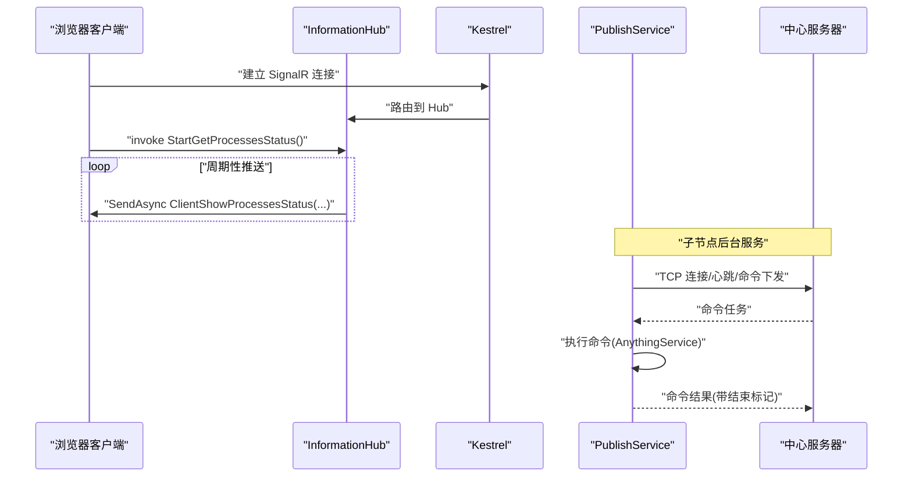
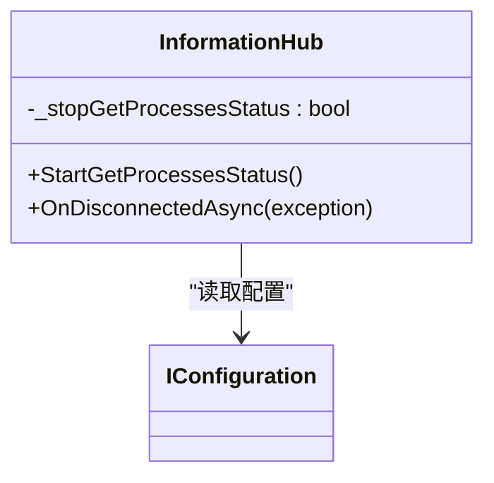
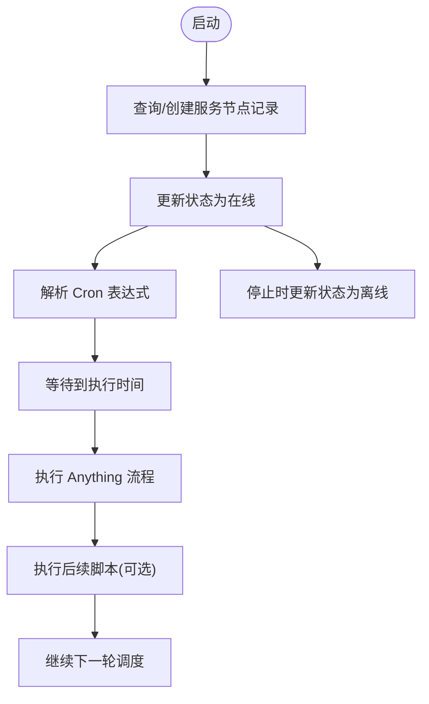
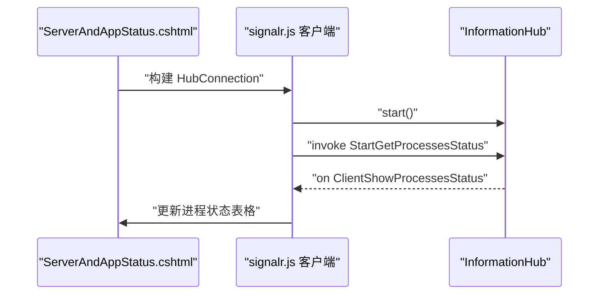
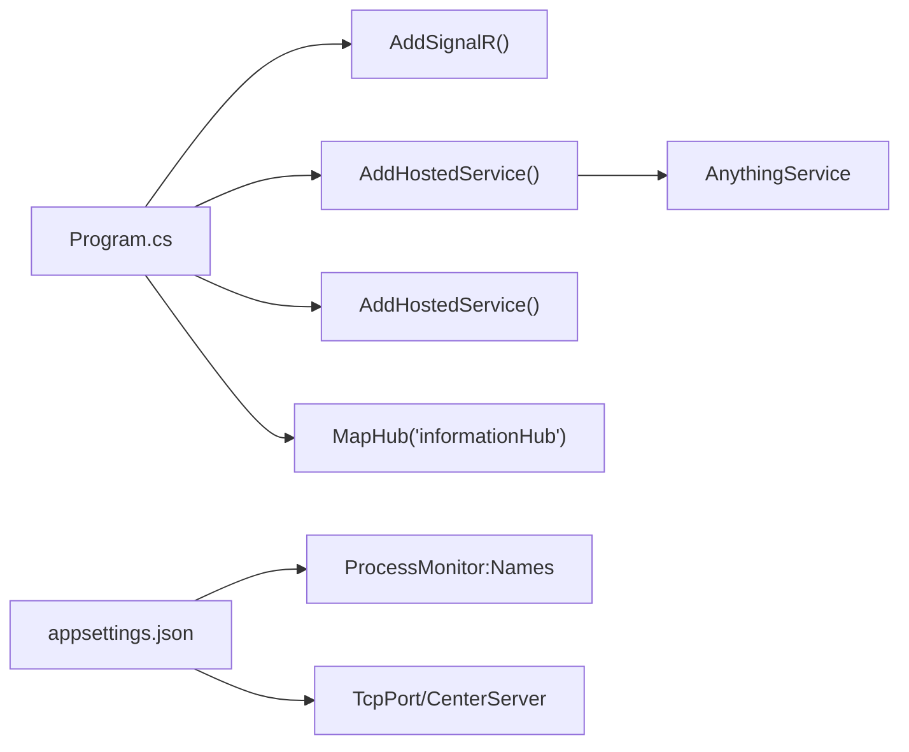

# 实时通信系统

<cite>
**本文引用的文件**
- [Program.cs](file://Sylas.RemoteTasks.App/Program.cs)
- [appsettings.json](file://Sylas.RemoteTasks.App/appsettings.json)
- [InformationHub.cs](file://Sylas.RemoteTasks.App/Hubs/InformationHub.cs)
- [PublishService.cs](file://Sylas.RemoteTasks.App/BackgroundServices/PublishService.cs)
- [ServerRegistrationService.cs](file://Sylas.RemoteTasks.App/BackgroundServices/ServerRegistrationService.cs)
- [ServerAndAppStatus.cshtml](file://Sylas.RemoteTasks.App/Views/Hosts/ServerAndAppStatus.cshtml)
- [signalr.js](file://Sylas.RemoteTasks.App/wwwroot/lib/signalr/dist/browser/signalr.js)
- [AnythingService.cs](file://Sylas.RemoteTasks.App/RemoteHostModule/Anything/AnythingService.cs)
</cite>

## 目录
1. [简介](#简介)
2. [项目结构](#项目结构)
3. [核心组件](#核心组件)
4. [架构总览](#架构总览)
5. [详细组件分析](#详细组件分析)
6. [依赖关系分析](#依赖关系分析)
7. [性能考量](#性能考量)
8. [故障排查指南](#故障排查指南)
9. [结论](#结论)
10. [附录](#附录)

## 简介
本技术文档围绕实时通信系统展开，重点阐述 SignalR 集成架构与配置、InformationHub 的实现原理（连接管理、消息广播、客户端通信协议）、后台服务 PublishService 与 ServerRegistrationService 的工作机制、实时状态推送与性能优化策略，并提供客户端连接示例与消息处理要点，涵盖连接断开处理、重连机制、消息队列管理以及与任务执行系统的集成与状态同步。

## 项目结构
系统采用 ASP.NET Core + SignalR 的前后端分离架构，前端通过浏览器 JavaScript 客户端连接到后端 Hub，后端通过后台服务进行跨节点任务分发与状态上报。

```mermaid
graph TB
subgraph "前端"
FE_JS["浏览器 SignalR 客户端<br/>signalr.js"]
FE_View["视图页面<br/>ServerAndAppStatus.cshtml"]
end
subgraph "后端"
Kestrel["Kestrel 服务器"]
SignalR["SignalR Hub 管道<br/>InformationHub"]
BG1["后台服务<br/>PublishService"]
BG2["后台服务<br/>ServerRegistrationService"]
DI["依赖注入容器"]
end
FE_JS --> |"HTTP(S)"/"WebSocket"| Kestrel
FE_View --> FE_JS
Kestrel --> SignalR
DI --> SignalR
DI --> BG1
DI --> BG2
BG1 --> |"TCP/命令分发"| BG2
```

图表来源
- [Program.cs](file://Sylas.RemoteTasks.App/Program.cs#L38-L119)
- [InformationHub.cs](file://Sylas.RemoteTasks.App/Hubs/InformationHub.cs#L11-L57)
- [PublishService.cs](file://Sylas.RemoteTasks.App/BackgroundServices/PublishService.cs#L16-L86)
- [ServerRegistrationService.cs](file://Sylas.RemoteTasks.App/BackgroundServices/ServerRegistrationService.cs#L26-L92)

章节来源
- [Program.cs](file://Sylas.RemoteTasks.App/Program.cs#L12-L122)
- [appsettings.json](file://Sylas.RemoteTasks.App/appsettings.json#L1-L142)

## 核心组件
- SignalR Hub：提供双向通信能力，支持客户端订阅与服务端推送。
- InformationHub：负责进程状态采集与推送，演示基于 Hub 的实时状态展示。
- PublishService：后台服务，负责与中心服务器建立长连接、心跳维持、命令下发与结果回传。
- ServerRegistrationService：后台服务，负责服务节点注册/注销、定时任务调度。
- 客户端：浏览器端通过 signalr.js 连接 Hub，处理事件回调与 UI 更新。

章节来源
- [InformationHub.cs](file://Sylas.RemoteTasks.App/Hubs/InformationHub.cs#L11-L57)
- [PublishService.cs](file://Sylas.RemoteTasks.App/BackgroundServices/PublishService.cs#L16-L86)
- [ServerRegistrationService.cs](file://Sylas.RemoteTasks.App/BackgroundServices/ServerRegistrationService.cs#L26-L92)
- [Program.cs](file://Sylas.RemoteTasks.App/Program.cs#L38-L119)

## 架构总览
系统通过以下链路实现“中心服务器-子节点-客户端”的实时通信闭环：
- 客户端通过 SignalR 连接到 Hub，订阅特定事件。
- 服务端 Hub 将状态推送给连接的客户端。
- 子节点后台服务与中心服务器保持 TCP 长连接，进行心跳、命令下发与结果回传。
- 任务执行服务通过 AnythingService 执行命令并异步返回结果，供后台服务汇总上报。



图表来源
- [InformationHub.cs](file://Sylas.RemoteTasks.App/Hubs/InformationHub.cs#L14-L49)
- [Program.cs](file://Sylas.RemoteTasks.App/Program.cs#L119-L119)
- [PublishService.cs](file://Sylas.RemoteTasks.App/BackgroundServices/PublishService.cs#L443-L624)
- [ServerAndAppStatus.cshtml](file://Sylas.RemoteTasks.App/Views/Hosts/ServerAndAppStatus.cshtml#L42-L75)

## 详细组件分析

### InformationHub 组件分析
- 连接管理
  - 通过 SignalR HubConnection 生命周期钩子处理连接建立与断开，断开时设置停止标志，避免后台任务继续运行。
- 消息广播
  - 提供 StartGetProcessesStatus 方法，周期性采集进程状态并通过 SendAsync 推送到调用方。
  - 使用并发集合收集状态，确保多进程并发采集的线程安全。
- 客户端通信协议
  - 客户端通过 invoke 调用 StartGetProcessesStatus，服务端在 OnDisconnectedAsync 中清理资源。
- 配置来源
  - 进程监控列表来自配置文件的 ProcessMonitor:Names 节点。



图表来源
- [InformationHub.cs](file://Sylas.RemoteTasks.App/Hubs/InformationHub.cs#L11-L57)
- [appsettings.json](file://Sylas.RemoteTasks.App/appsettings.json#L122-L124)

章节来源
- [InformationHub.cs](file://Sylas.RemoteTasks.App/Hubs/InformationHub.cs#L11-L57)
- [appsettings.json](file://Sylas.RemoteTasks.App/appsettings.json#L122-L124)

### PublishService 组件分析
- 后台服务机制
  - 继承 BackgroundService，在 ExecuteAsync 中监听本地 TCP 端口，接受子节点连接；在 StartAsync 中与中心服务器建立长连接。
- 连接管理
  - 维护子节点 Socket 映射，按域区分实例，避免旧连接干扰。
  - 心跳维持：发送/接收心跳包，超时检测触发重连。
- 命令分发与结果回传
  - 从中心服务器读取命令任务，调用 AnythingService 执行，逐条返回结果并在末尾发送结束信号。
  - 使用结束标记“000000”解决粘包问题，保证消息边界清晰。
- 断开与重连
  - StopAsync 主动通知中心服务器断开；异常时按固定频率重连。
- 性能优化
  - 使用大缓冲区与异步 I/O；并发采集进程状态；按需发送心跳。

```mermaid
sequenceDiagram
participant Child as "子节点"
participant Pub as "PublishService"
participant Center as "中心服务器"
participant Exec as "AnythingService"
Child->>Pub : "TCP 连接(参数 : 2;;;;domain;;;;socketNo)"
Pub->>Center : "连接中心服务器"
loop "心跳维持"
Pub->>Center : "keep-alive"
Center-->>Pub : "keep-alive"
end
Center-->>Pub : "ready_for_new"
Pub->>Center : "ready_for_new"
Center-->>Pub : "命令任务(含结束标记)"
Pub->>Exec : "ExecuteAsync"
Exec-->>Pub : "命令结果(批量)"
Pub-->>Center : "结果(带结束标记)"
Pub-->>Center : "cmd-end 结束信号"
```

图表来源
- [PublishService.cs](file://Sylas.RemoteTasks.App/BackgroundServices/PublishService.cs#L443-L624)
- [PublishService.cs](file://Sylas.RemoteTasks.App/BackgroundServices/PublishService.cs#L346-L434)
- [AnythingService.cs](file://Sylas.RemoteTasks.App/RemoteHostModule/Anything/AnythingService.cs#L1-L200)

章节来源
- [PublishService.cs](file://Sylas.RemoteTasks.App/BackgroundServices/PublishService.cs#L16-L86)
- [PublishService.cs](file://Sylas.RemoteTasks.App/BackgroundServices/PublishService.cs#L88-L340)
- [PublishService.cs](file://Sylas.RemoteTasks.App/BackgroundServices/PublishService.cs#L346-L434)
- [PublishService.cs](file://Sylas.RemoteTasks.App/BackgroundServices/PublishService.cs#L443-L624)
- [PublishService.cs](file://Sylas.RemoteTasks.App/BackgroundServices/PublishService.cs#L626-L637)
- [AnythingService.cs](file://Sylas.RemoteTasks.App/RemoteHostModule/Anything/AnythingService.cs#L1-L200)

### ServerRegistrationService 组件分析
- 服务注册/注销
  - 启动时查询/创建服务节点记录，更新状态为在线；停止时更新状态为离线。
- 定时任务调度
  - 解析 Cron 表达式，计算下次执行时间，按需执行 Anything 流程并执行后续脚本。
- 内存缓存与并发控制
  - 使用 ConcurrentDictionary 管理运行中的调度任务，支持取消与替换。



图表来源
- [ServerRegistrationService.cs](file://Sylas.RemoteTasks.App/BackgroundServices/ServerRegistrationService.cs#L55-L110)
- [ServerRegistrationService.cs](file://Sylas.RemoteTasks.App/BackgroundServices/ServerRegistrationService.cs#L187-L341)
- [ServerRegistrationService.cs](file://Sylas.RemoteTasks.App/BackgroundServices/ServerRegistrationService.cs#L362-L490)

章节来源
- [ServerRegistrationService.cs](file://Sylas.RemoteTasks.App/BackgroundServices/ServerRegistrationService.cs#L26-L110)
- [ServerRegistrationService.cs](file://Sylas.RemoteTasks.App/BackgroundServices/ServerRegistrationService.cs#L187-L341)
- [ServerRegistrationService.cs](file://Sylas.RemoteTasks.App/BackgroundServices/ServerRegistrationService.cs#L362-L490)

### 客户端连接与消息处理
- 客户端连接
  - 通过 signalr.js 构建 HubConnection，连接到 "/informationHub"。
- 事件订阅
  - 使用 on("ClientShowProcessesStatus") 订阅服务端推送的进程状态列表。
- 调用 Hub 方法
  - 使用 invoke("StartGetProcessesStatus") 触发服务端开始推送。
- 重连机制
  - 客户端内置重连策略，自动处理断线与恢复。



图表来源
- [ServerAndAppStatus.cshtml](file://Sylas.RemoteTasks.App/Views/Hosts/ServerAndAppStatus.cshtml#L42-L75)
- [signalr.js](file://Sylas.RemoteTasks.App/wwwroot/lib/signalr/dist/browser/signalr.js#L1192-L1229)
- [signalr.js](file://Sylas.RemoteTasks.App/wwwroot/lib/signalr/dist/browser/signalr.js#L1847-L1917)

章节来源
- [ServerAndAppStatus.cshtml](file://Sylas.RemoteTasks.App/Views/Hosts/ServerAndAppStatus.cshtml#L36-L107)
- [signalr.js](file://Sylas.RemoteTasks.App/wwwroot/lib/signalr/dist/browser/signalr.js#L1192-L1229)
- [signalr.js](file://Sylas.RemoteTasks.App/wwwroot/lib/signalr/dist/browser/signalr.js#L1847-L1917)

## 依赖关系分析
- 服务注册与映射
  - Program.cs 中注册 SignalR、控制器、后台服务与各类仓储/服务。
- 配置依赖
  - appsettings.json 提供 TcpPort、CenterServer、ProcessMonitor 等关键配置。
- Hub 与后台服务协作
  - InformationHub 仅负责客户端推送；PublishService 与中心服务器交互；ServerRegistrationService 负责节点注册与任务调度。



图表来源
- [Program.cs](file://Sylas.RemoteTasks.App/Program.cs#L38-L119)
- [appsettings.json](file://Sylas.RemoteTasks.App/appsettings.json#L28-L35)
- [appsettings.json](file://Sylas.RemoteTasks.App/appsettings.json#L122-L124)

章节来源
- [Program.cs](file://Sylas.RemoteTasks.App/Program.cs#L38-L119)
- [appsettings.json](file://Sylas.RemoteTasks.App/appsettings.json#L28-L35)
- [appsettings.json](file://Sylas.RemoteTasks.App/appsettings.json#L122-L124)

## 性能考量
- 异步 I/O 与并发
  - 使用异步 Socket 与 Task.WhenAll 并发采集进程状态，减少等待时间。
- 缓冲与粘包处理
  - 大缓冲区与结束标记“000000”确保长消息边界清晰，降低解析复杂度。
- 心跳与断线恢复
  - 心跳频率与超时阈值平衡网络稳定性与资源消耗；客户端内置指数退避重连策略。
- 资源管理
  - 后台服务在 StopAsync 中主动释放连接与取消令牌，避免资源泄露。

[本节为通用指导，无需列出具体文件来源]

## 故障排查指南
- 进程状态不更新
  - 检查 ProcessMonitor:Names 配置是否正确；确认客户端已调用 StartGetProcessesStatus。
- 与中心服务器断连
  - 查看 PublishService 日志与心跳日志目录；确认 CenterServer 与 CenterServerPort 配置；关注重连频率与超时阈值。
- 命令结果缺失
  - 确认服务端按批返回并发送结束信号；检查粘包处理逻辑与结束标记匹配。
- 客户端无法连接
  - 检查 Kestrel 端口与 HTTPS 配置；确认 SignalR 路由映射与静态文件服务启用。

章节来源
- [InformationHub.cs](file://Sylas.RemoteTasks.App/Hubs/InformationHub.cs#L17-L22)
- [PublishService.cs](file://Sylas.RemoteTasks.App/BackgroundServices/PublishService.cs#L482-L543)
- [appsettings.json](file://Sylas.RemoteTasks.App/appsettings.json#L31-L33)

## 结论
该系统通过 SignalR 实现客户端与服务端的低延迟双向通信，结合后台服务完成跨节点任务分发与状态上报。InformationHub 提供轻量级实时状态推送示例；PublishService 与 ServerRegistrationService 分别承担中心-子节点通信与节点注册/任务调度职责。整体架构具备良好的扩展性与可维护性，适合在分布式任务执行场景中部署与演进。

[本节为总结性内容，无需列出具体文件来源]

## 附录
- 客户端连接示例与消息处理要点
  - 使用 signalr.js 构建 HubConnection，连接 "/informationHub"。
  - 订阅事件 on("ClientShowProcessesStatus")，在连接建立后调用 invoke("StartGetProcessesStatus")。
  - 重连策略由客户端内置，无需手动干预。
- 与任务执行系统的集成
  - 通过 AnythingService 执行命令并异步返回结果，供 PublishService 汇总上报。
- 配置参考
  - appsettings.json 中包含 TcpPort、CenterServer、ProcessMonitor 等关键配置项。

章节来源
- [ServerAndAppStatus.cshtml](file://Sylas.RemoteTasks.App/Views/Hosts/ServerAndAppStatus.cshtml#L42-L75)
- [signalr.js](file://Sylas.RemoteTasks.App/wwwroot/lib/signalr/dist/browser/signalr.js#L1192-L1229)
- [AnythingService.cs](file://Sylas.RemoteTasks.App/RemoteHostModule/Anything/AnythingService.cs#L1-L200)
- [appsettings.json](file://Sylas.RemoteTasks.App/appsettings.json#L28-L35)
- [appsettings.json](file://Sylas.RemoteTasks.App/appsettings.json#L122-L124)