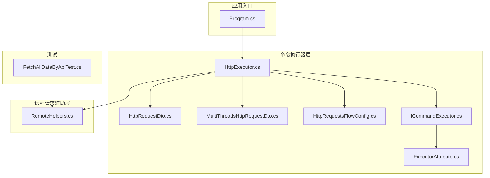
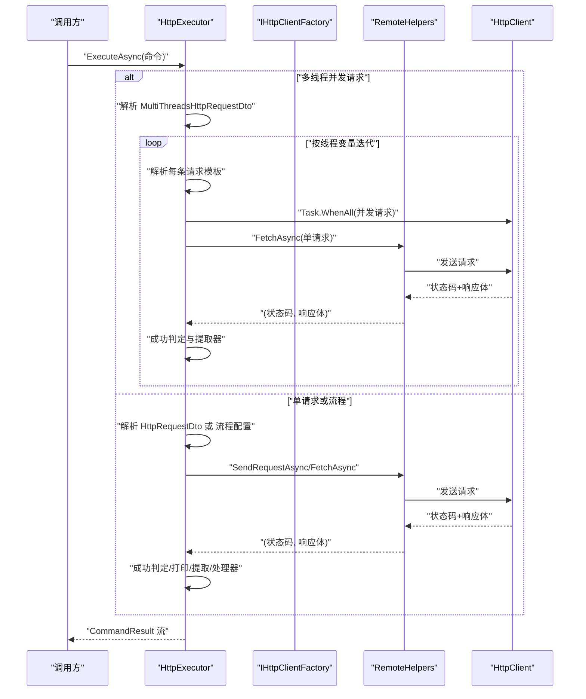
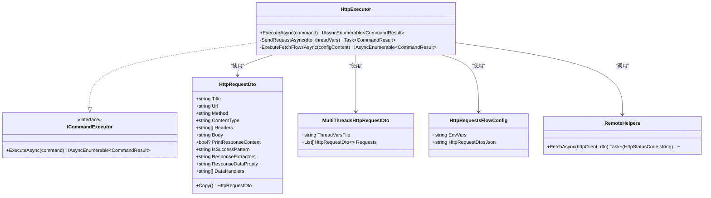
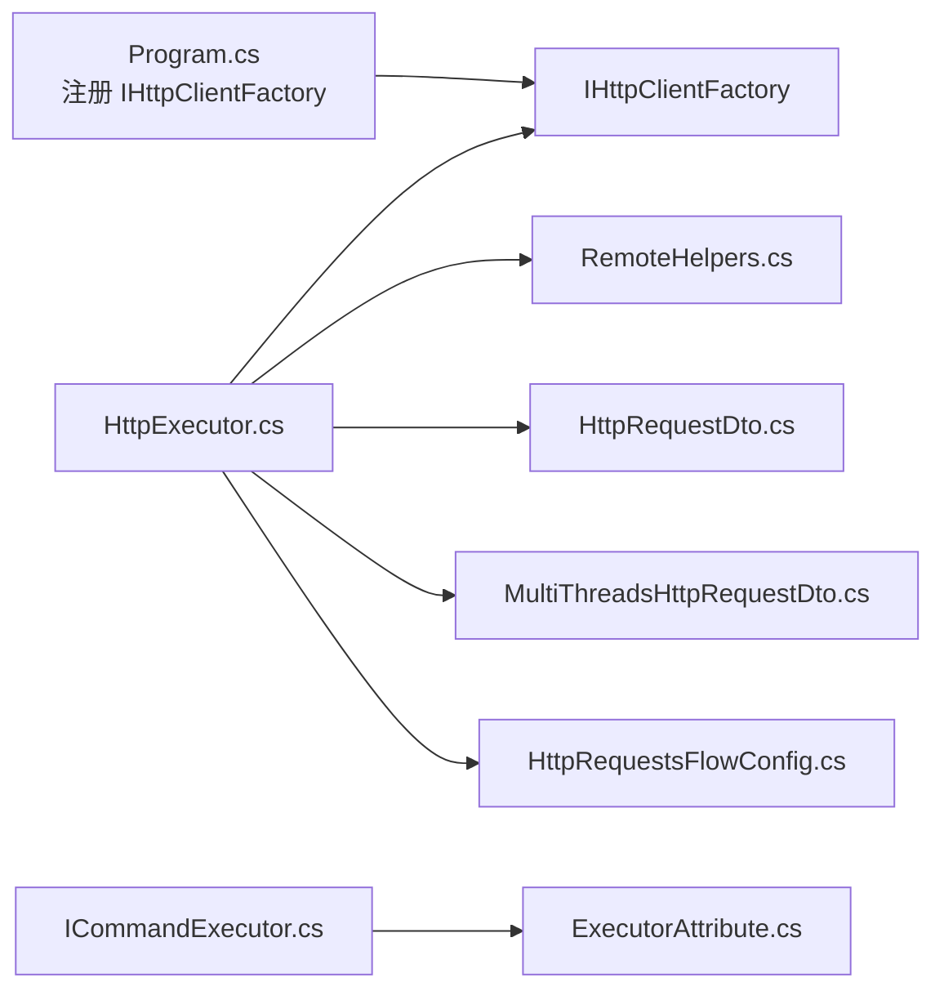

# HTTP 请求执行器

<cite>
**本文引用的文件**
- [HttpExecutor.cs](file://Sylas.RemoteTasks.Utils/CommandExecutor/HttpExecutor.cs)
- [HttpRequestDto.cs](file://Sylas.RemoteTasks.Utils/CommandExecutor/HttpRequestDto.cs)
- [MultiThreadsHttpRequestDto.cs](file://Sylas.RemoteTasks.Utils/CommandExecutor/MultiThreadsHttpRequestDto.cs)
- [HttpRequestsFlowConfig.cs](file://Sylas.RemoteTasks.Utils/CommandExecutor/HttpRequestsFlowConfig.cs)
- [ICommandExecutor.cs](file://Sylas.RemoteTasks.Utils/CommandExecutor/ICommandExecutor.cs)
- [ExecutorAttribute.cs](file://Sylas.RemoteTasks.Utils/CommandExecutor/ExecutorAttribute.cs)
- [RemoteHelpers.cs](file://Sylas.RemoteTasks.Utils/RemoteHelpers.cs)
- [Program.cs](file://Sylas.RemoteTasks.App/Program.cs)
- [FetchAllDataByApiTest.cs](file://Sylas.RemoteTasks.Test/Remote/FetchAllDataByApiTest.cs)
</cite>

## 目录
1. [简介](#简介)
2. [项目结构](#项目结构)
3. [核心组件](#核心组件)
4. [架构总览](#架构总览)
5. [组件详解](#组件详解)
6. [依赖关系分析](#依赖关系分析)
7. [性能考量](#性能考量)
8. [故障排查指南](#故障排查指南)
9. [结论](#结论)
10. [附录](#附录)

## 简介
本文档围绕 HTTP 请求执行器展开，系统性阐述 HttpExecutor 的设计与实现，覆盖单线程与多线程请求处理、请求头与认证、模板驱动的变量解析、响应提取与数据处理器、并发控制与连接池、超时与重试策略、以及 GET/POST/PUT/DELETE 的使用范式与最佳实践。文档同时提供关键流程的时序图与类图，帮助读者快速理解与落地应用。

## 项目结构
- 命令执行器层：HttpExecutor 实现 ICommandExecutor 接口，负责解析命令、调度请求、处理响应与模板抽取。
- 数据传输对象层：HttpRequestDto、MultiThreadsHttpRequestDto、HttpRequestsFlowConfig 描述请求参数、并发请求编排与流程配置。
- 远程请求辅助层：RemoteHelpers 封装 HttpClient 使用细节，统一处理请求头、内容类型、请求体、响应读取与日志记录。
- 依赖注入与入口：Program.cs 注册 IHttpClientFactory；ExecutorAttribute/ICommandExecutor 支持基于特性与 DI 的执行器发现与创建。

图表来源
- [HttpExecutor.cs](file://Sylas.RemoteTasks.Utils/CommandExecutor/HttpExecutor.cs#L21-L102)
- [HttpRequestDto.cs](file://Sylas.RemoteTasks.Utils/CommandExecutor/HttpRequestDto.cs#L11-L76)
- [MultiThreadsHttpRequestDto.cs](file://Sylas.RemoteTasks.Utils/CommandExecutor/MultiThreadsHttpRequestDto.cs#L8-L18)
- [HttpRequestsFlowConfig.cs](file://Sylas.RemoteTasks.Utils/CommandExecutor/HttpRequestsFlowConfig.cs#L6-L16)
- [ICommandExecutor.cs](file://Sylas.RemoteTasks.Utils/CommandExecutor/ICommandExecutor.cs#L14-L72)
- [ExecutorAttribute.cs](file://Sylas.RemoteTasks.Utils/CommandExecutor/ExecutorAttribute.cs#L10-L24)
- [RemoteHelpers.cs](file://Sylas.RemoteTasks.Utils/RemoteHelpers.cs#L50-L141)
- [Program.cs](file://Sylas.RemoteTasks.App/Program.cs#L40-L41)
- [FetchAllDataByApiTest.cs](file://Sylas.RemoteTasks.Test/Remote/FetchAllDataByApiTest.cs#L132-L138)

章节来源
- [Program.cs](file://Sylas.RemoteTasks.App/Program.cs#L40-L41)
- [HttpExecutor.cs](file://Sylas.RemoteTasks.Utils/CommandExecutor/HttpExecutor.cs#L21-L102)
- [RemoteHelpers.cs](file://Sylas.RemoteTasks.Utils/RemoteHelpers.cs#L50-L141)

## 核心组件
- HttpExecutor：实现 ICommandExecutor，负责解析命令（单请求、多请求流程、多线程并发），调用 RemoteHelpers 发送请求，处理响应、模板抽取与数据处理器。
- HttpRequestDto：描述一次 HTTP 请求的完整参数，包括 URL、方法、内容类型、请求头、请求体、成功判定正则、响应提取器、数据处理器等。
- MultiThreadsHttpRequestDto：描述多线程并发请求场景，包含线程变量文件与请求编排（按顺序与并发组合）。
- HttpRequestsFlowConfig：描述一系列按阶段顺序执行的请求集合，支持模板解析与环境变量共享。
- RemoteHelpers：封装 HttpClient 使用细节，统一处理请求头、内容类型、请求体、响应读取与日志记录。
- ICommandExecutor/ExecutorAttribute：提供基于特性的执行器发现与创建能力，结合 DI 容器实现可插拔的命令执行器。

章节来源
- [HttpExecutor.cs](file://Sylas.RemoteTasks.Utils/CommandExecutor/HttpExecutor.cs#L21-L102)
- [HttpRequestDto.cs](file://Sylas.RemoteTasks.Utils/CommandExecutor/HttpRequestDto.cs#L11-L76)
- [MultiThreadsHttpRequestDto.cs](file://Sylas.RemoteTasks.Utils/CommandExecutor/MultiThreadsHttpRequestDto.cs#L8-L18)
- [HttpRequestsFlowConfig.cs](file://Sylas.RemoteTasks.Utils/CommandExecutor/HttpRequestsFlowConfig.cs#L6-L16)
- [RemoteHelpers.cs](file://Sylas.RemoteTasks.Utils/RemoteHelpers.cs#L50-L141)
- [ICommandExecutor.cs](file://Sylas.RemoteTasks.Utils/CommandExecutor/ICommandExecutor.cs#L14-L72)
- [ExecutorAttribute.cs](file://Sylas.RemoteTasks.Utils/CommandExecutor/ExecutorAttribute.cs#L10-L24)

## 架构总览
下图展示 HttpExecutor 与 RemoteHelpers 的协作关系，以及命令解析与请求发送的关键路径。

图表来源
- [HttpExecutor.cs](file://Sylas.RemoteTasks.Utils/CommandExecutor/HttpExecutor.cs#L29-L102)
- [HttpExecutor.cs](file://Sylas.RemoteTasks.Utils/CommandExecutor/HttpExecutor.cs#L110-L140)
- [HttpExecutor.cs](file://Sylas.RemoteTasks.Utils/CommandExecutor/HttpExecutor.cs#L148-L255)
- [RemoteHelpers.cs](file://Sylas.RemoteTasks.Utils/RemoteHelpers.cs#L50-L141)

## 组件详解

### HttpExecutor 类设计与实现
- 单线程请求：当命令为 JSON 且包含请求参数时，反序列化为 HttpRequestDto，调用 SendRequestAsync，基于 RemoteHelpers.FetchAsync 发送请求，依据 IsSuccessPattern 判定成功与否，并支持响应提取器与数据处理器。
- 多线程并发请求：当命令包含多线程变量文件与请求编排时，按行读取线程变量文件，逐行构建线程上下文，对 Requests 中的每个阶段（二维列表）内的请求并发执行（Task.WhenAll），阶段之间顺序执行。
- 请求流程编排：当命令为非 JSON 时，按流程配置解析 HttpRequestDtosJson，逐条请求发送，支持模板解析、环境变量共享、响应提取、数据处理器（如数据库落库）与日志输出。

图表来源
- [HttpExecutor.cs](file://Sylas.RemoteTasks.Utils/CommandExecutor/HttpExecutor.cs#L21-L102)
- [HttpRequestDto.cs](file://Sylas.RemoteTasks.Utils/CommandExecutor/HttpRequestDto.cs#L11-L76)
- [MultiThreadsHttpRequestDto.cs](file://Sylas.RemoteTasks.Utils/CommandExecutor/MultiThreadsHttpRequestDto.cs#L8-L18)
- [HttpRequestsFlowConfig.cs](file://Sylas.RemoteTasks.Utils/CommandExecutor/HttpRequestsFlowConfig.cs#L6-L16)
- [RemoteHelpers.cs](file://Sylas.RemoteTasks.Utils/RemoteHelpers.cs#L50-L141)

章节来源
- [HttpExecutor.cs](file://Sylas.RemoteTasks.Utils/CommandExecutor/HttpExecutor.cs#L29-L102)
- [HttpExecutor.cs](file://Sylas.RemoteTasks.Utils/CommandExecutor/HttpExecutor.cs#L110-L140)
- [HttpExecutor.cs](file://Sylas.RemoteTasks.Utils/CommandExecutor/HttpExecutor.cs#L148-L255)

### HttpRequestDto 数据结构与使用场景
- 字段说明
  - Title：请求标题，便于日志与调试。
  - Url：目标接口地址。
  - Method：HTTP 方法（大小写不敏感，内部统一处理）。
  - ContentType：请求内容类型（如 application/json、application/x-www-form-urlencoded）。
  - Headers：请求头数组，格式为“键:值”。
  - Body：请求体内容，支持 JSON、表单与 multipart。
  - PrintResponseContent：是否打印响应内容。
  - IsSuccessPattern：正则表达式，用于判定响应是否成功。
  - ResponseExtractors：响应提取器模板，用于从响应中抽取变量。
  - ResponseDataPropty：响应对象中数据所在属性路径。
  - DataHandlers：数据处理器列表，用于对响应数据进行进一步处理（如数据库落库）。
  - Copy：浅拷贝当前对象。
- 使用场景
  - 单次请求：构造 HttpRequestDto，设置 Url、Method、Headers、Body、ContentType、IsSuccessPattern，调用 ExecuteAsync。
  - 流程编排：将多个 HttpRequestDto 组织为流程配置，借助模板与环境变量实现跨请求的数据传递。
  - 响应提取：通过 ResponseExtractors 与 ResponseDataPropty 将响应数据注入上下文，供后续请求或处理器使用。

章节来源
- [HttpRequestDto.cs](file://Sylas.RemoteTasks.Utils/CommandExecutor/HttpRequestDto.cs#L11-L76)

### MultiThreadsHttpRequestDto 数据结构与并发控制
- 字段说明
  - ThreadVarsFile：线程变量文件路径，首行为变量名，其余行代表每个线程的初始变量集合。
  - Requests：二维列表，Requests[i][j] 表示第 i 个阶段的第 j 个请求，同一阶段内并发执行，不同阶段顺序执行。
- 并发控制
  - 同阶段并发：对同一阶段内的请求并发发送（Task.WhenAll），提升吞吐。
  - 阶段顺序：不同阶段之间按顺序执行，保证依赖关系。
  - 模板解析：对每个请求的 Url、Headers、Body 基于当前线程变量进行模板解析。

章节来源
- [MultiThreadsHttpRequestDto.cs](file://Sylas.RemoteTasks.Utils/CommandExecutor/MultiThreadsHttpRequestDto.cs#L8-L18)
- [HttpExecutor.cs](file://Sylas.RemoteTasks.Utils/CommandExecutor/HttpExecutor.cs#L31-L81)
- [HttpExecutor.cs](file://Sylas.RemoteTasks.Utils/CommandExecutor/HttpExecutor.cs#L57-L74)

### 请求头管理与认证处理
- 请求头管理
  - RemoteHelpers.FetchAsync 会遍历 HttpRequestDto.Headers，按“键:值”拆分并设置到 HttpClient.DefaultRequestHeaders。
  - 支持覆盖默认请求头，便于统一注入认证信息。
- 认证处理
  - 当存在 Authorization 请求头时，RemoteHelpers 会将其解析并设置到 HttpClient.DefaultRequestHeaders。
  - 若需要动态令牌，可在上层通过模板或外部逻辑更新 Headers，再由 RemoteHelpers 应用。

章节来源
- [RemoteHelpers.cs](file://Sylas.RemoteTasks.Utils/RemoteHelpers.cs#L50-L141)

### SSL/TLS 支持
- 代码中未显式配置 SSL/TLS 证书校验策略或自定义证书验证回调，因此默认遵循 .NET HttpClient 的系统默认行为。
- 如需定制信任链或忽略证书错误，请在应用启动时通过 IHttpClientFactory 或 HttpClientHandler 进行全局配置（不在当前代码范围内）。

章节来源
- [RemoteHelpers.cs](file://Sylas.RemoteTasks.Utils/RemoteHelpers.cs#L50-L141)

### 重试机制
- 当前实现未内置自动重试逻辑。若需重试，建议在上层调用侧对失败的 CommandResult 进行条件判断与重试调度，或扩展 HttpExecutor 的 SendRequestAsync 以引入指数退避与最大重试次数策略。

章节来源
- [HttpExecutor.cs](file://Sylas.RemoteTasks.Utils/CommandExecutor/HttpExecutor.cs#L110-L140)

### 并发请求控制与连接池管理
- 并发控制
  - 同阶段并发：通过 Task.WhenAll 控制同一阶段内请求的并发度。
  - 阶段顺序：不同阶段顺序执行，避免资源竞争。
- 连接池管理
  - 通过 IHttpClientFactory 创建 HttpClient，复用底层连接池，减少连接建立开销。
  - 建议在应用启动时通过 IHttpClientBuilder 配置超时、最大连接数、PooledConnectionLifetime 等参数（当前代码未显式配置）。

章节来源
- [HttpExecutor.cs](file://Sylas.RemoteTasks.Utils/CommandExecutor/HttpExecutor.cs#L63-L72)
- [Program.cs](file://Sylas.RemoteTasks.App/Program.cs#L40-L41)

### 超时配置
- RemoteHelpers.FetchAsync 使用 HttpClient 的默认超时行为。
- 建议通过 IHttpClientFactory 的 ConfigureHttpClientDefaults 或 IHttpClientBuilder.ConfigurePrimaryHttpMessageHandler 配置超时（当前代码未显式配置）。

章节来源
- [RemoteHelpers.cs](file://Sylas.RemoteTasks.Utils/RemoteHelpers.cs#L50-L141)

### 错误重试策略
- 建议策略
  - 对幂等请求（GET/DELETE）进行有限次数的指数退避重试。
  - 对非幂等请求（POST/PUT）谨慎重试，必要时引入去重与幂等键。
  - 对 5xx 类错误进行重试，对 4xx 类错误直接失败并记录。
- 实施位置
  - 可在 SendRequestAsync 外围增加重试包装，或在上层调用侧根据 CommandResult 的失败原因进行决策。

章节来源
- [HttpExecutor.cs](file://Sylas.RemoteTasks.Utils/CommandExecutor/HttpExecutor.cs#L110-L140)

### HTTP 方法使用示例与最佳实践
- GET
  - 设置 Method 为 GET，Url 为目标接口，Headers 可选，Body 为空。
  - 使用 IsSuccessPattern 判断响应是否成功。
- POST
  - 设置 Method 为 POST，ContentType 为 application/json 或 application/x-www-form-urlencoded。
  - Body 为 JSON 字符串或表单参数。
  - 对于 multipart/form-data，Body 为参数列表（含边界与文件字节）。
- PUT/DELETE
  - 与 POST 类似，仅方法不同。
  - 对于需要携带请求体的 DELETE，建议明确设置 ContentType 与 Body。

章节来源
- [RemoteHelpers.cs](file://Sylas.RemoteTasks.Utils/RemoteHelpers.cs#L84-L137)
- [HttpRequestDto.cs](file://Sylas.RemoteTasks.Utils/CommandExecutor/HttpRequestDto.cs#L22-L36)

### 响应处理最佳实践
- 成功判定：优先使用 IsSuccessPattern 对响应内容进行正则匹配，确保业务语义正确。
- 响应提取：通过 ResponseExtractors 与 ResponseDataPropty 将关键数据注入上下文，供后续请求或处理器使用。
- 日志输出：PrintResponseContent 可用于调试，生产环境建议关闭或限制输出范围。
- 数据处理器：DataHandlers 支持将响应数据落库或其他处理，注意参数完整性与异常捕获。

章节来源
- [HttpExecutor.cs](file://Sylas.RemoteTasks.Utils/CommandExecutor/HttpExecutor.cs#L116-L139)
- [HttpExecutor.cs](file://Sylas.RemoteTasks.Utils/CommandExecutor/HttpExecutor.cs#L198-L247)

## 依赖关系分析
- HttpExecutor 依赖 IHttpClientFactory 创建 HttpClient，依赖 RemoteHelpers 执行网络请求。
- 命令执行器通过 ExecutorAttribute 与 DI 容器发现与创建，ICommandExecutor 抽象出统一的执行接口。
- 多线程场景依赖模板解析与文件读取，流程场景依赖模板解析与环境变量。

图表来源
- [Program.cs](file://Sylas.RemoteTasks.App/Program.cs#L40-L41)
- [HttpExecutor.cs](file://Sylas.RemoteTasks.Utils/CommandExecutor/HttpExecutor.cs#L21-L102)
- [RemoteHelpers.cs](file://Sylas.RemoteTasks.Utils/RemoteHelpers.cs#L50-L141)
- [HttpRequestDto.cs](file://Sylas.RemoteTasks.Utils/CommandExecutor/HttpRequestDto.cs#L11-L76)
- [MultiThreadsHttpRequestDto.cs](file://Sylas.RemoteTasks.Utils/CommandExecutor/MultiThreadsHttpRequestDto.cs#L8-L18)
- [HttpRequestsFlowConfig.cs](file://Sylas.RemoteTasks.Utils/CommandExecutor/HttpRequestsFlowConfig.cs#L6-L16)
- [ICommandExecutor.cs](file://Sylas.RemoteTasks.Utils/CommandExecutor/ICommandExecutor.cs#L14-L72)
- [ExecutorAttribute.cs](file://Sylas.RemoteTasks.Utils/CommandExecutor/ExecutorAttribute.cs#L10-L24)

章节来源
- [Program.cs](file://Sylas.RemoteTasks.App/Program.cs#L40-L41)
- [HttpExecutor.cs](file://Sylas.RemoteTasks.Utils/CommandExecutor/HttpExecutor.cs#L21-L102)
- [RemoteHelpers.cs](file://Sylas.RemoteTasks.Utils/RemoteHelpers.cs#L50-L141)

## 性能考量
- 连接复用：通过 IHttpClientFactory 复用 HttpClient，降低连接建立成本。
- 并发优化：同阶段并发发送请求（Task.WhenAll），显著提升吞吐；但需关注目标服务端限流与自身 CPU/内存压力。
- 内容类型选择：JSON 与表单提交的序列化/反序列化成本不同，合理选择可减少带宽与 CPU 开销。
- 超时与背压：为长耗时请求设置合理超时，避免阻塞线程池；在多线程场景中控制并发度，防止资源争用。
- 日志与调试：生产环境避免输出大体量响应内容，减少 IO 压力。

## 故障排查指南
- 常见错误
  - 请求体无法反序列化：检查 Body 格式与 ContentType 是否匹配。
  - 成功判定失败：核对 IsSuccessPattern 与响应内容。
  - 多线程变量文件为空：确认文件路径与首行变量名。
  - 数据处理器异常：检查 DataHandlers 参数数量与格式。
- 建议排查步骤
  - 打开 PrintResponseContent 进行调试，定位响应内容与状态码。
  - 使用最小化命令复现问题，逐步排除模板与变量影响。
  - 检查 IHttpClientFactory 是否正确注册与作用域配置。

章节来源
- [HttpExecutor.cs](file://Sylas.RemoteTasks.Utils/CommandExecutor/HttpExecutor.cs#L34-L81)
- [HttpExecutor.cs](file://Sylas.RemoteTasks.Utils/CommandExecutor/HttpExecutor.cs#L161-L188)
- [RemoteHelpers.cs](file://Sylas.RemoteTasks.Utils/RemoteHelpers.cs#L52-L55)

## 结论
HttpExecutor 以简洁的命令模型与强大的模板解析能力，实现了从单请求到多线程并发、从简单到复杂的 HTTP 请求编排。通过 IHttpClientFactory 与 RemoteHelpers 的解耦，既保证了可维护性，也为性能优化与扩展提供了空间。建议在生产环境中结合超时、重试、限流与监控策略，确保稳定与高效。

## 附录
- 使用建议
  - 在应用启动时通过 IHttpClientFactory 配置超时、连接池与 TLS 策略。
  - 对关键流程启用响应提取与数据处理器，确保数据闭环。
  - 对多线程场景设定合理的并发度上限，避免对下游造成冲击。
- 参考测试
  - 通过 FetchAllDataByApiTest 验证远程请求与批量数据获取流程。

章节来源
- [FetchAllDataByApiTest.cs](file://Sylas.RemoteTasks.Test/Remote/FetchAllDataByApiTest.cs#L132-L138)