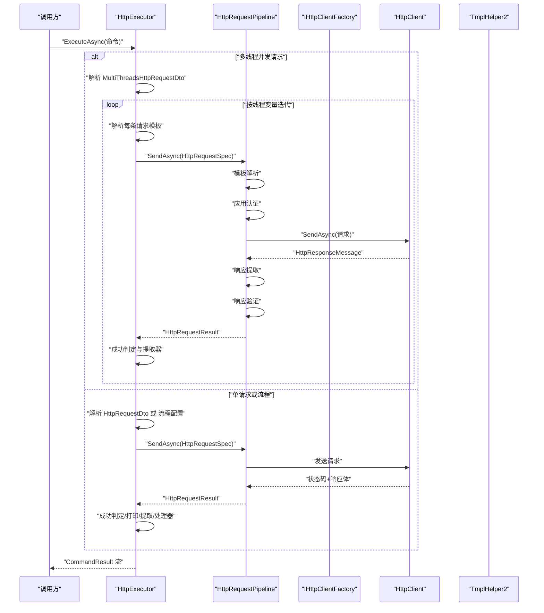
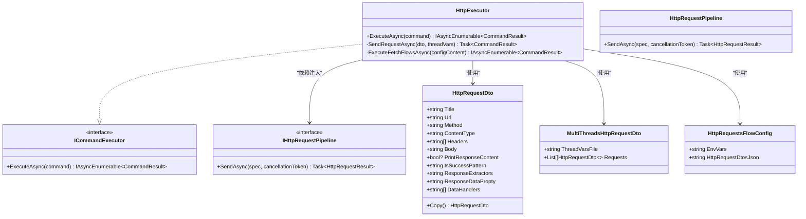
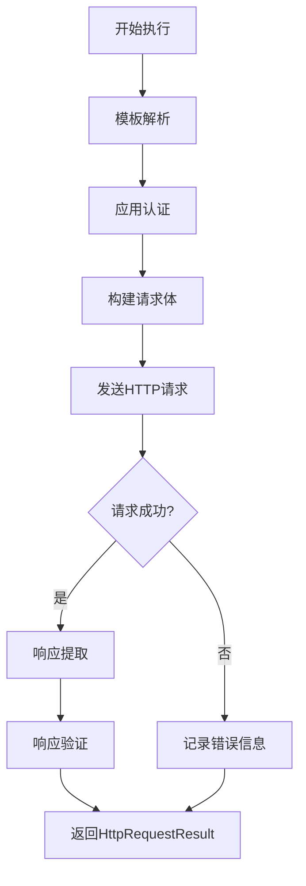
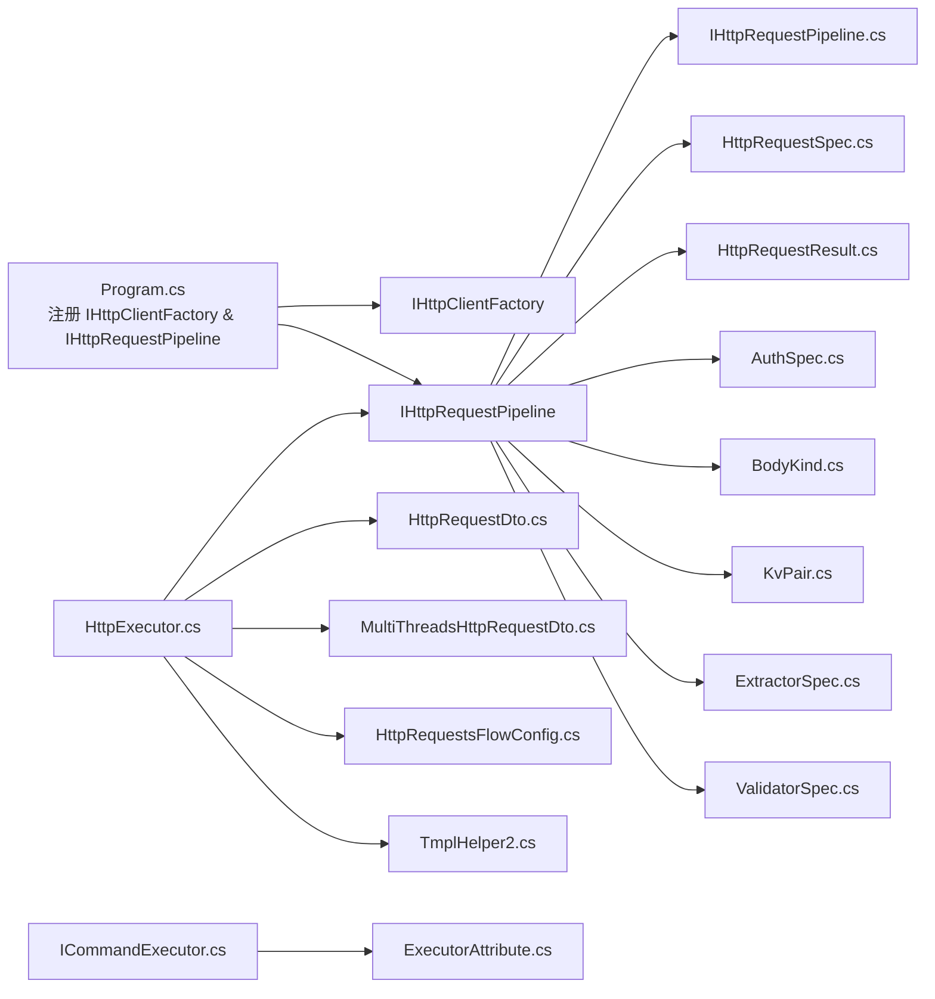

# HTTP 请求执行器

<cite>
**本文引用的文件**
- [HttpExecutor.cs](file://Sylas.RemoteTasks.Utils/CommandExecutor/HttpExecutor.cs)
- [HttpRequestDto.cs](file://Sylas.RemoteTasks.Utils/CommandExecutor/HttpRequestDto.cs)
- [MultiThreadsHttpRequestDto.cs](file://Sylas.RemoteTasks.Utils/CommandExecutor/MultiThreadsHttpRequestDto.cs)
- [HttpRequestsFlowConfig.cs](file://Sylas.RemoteTasks.Utils/CommandExecutor/HttpRequestsFlowConfig.cs)
- [ICommandExecutor.cs](file://Sylas.RemoteTasks.Utils/CommandExecutor/ICommandExecutor.cs)
- [ExecutorAttribute.cs](file://Sylas.RemoteTasks.Utils/CommandExecutor/ExecutorAttribute.cs)
- [Program.cs](file://Sylas.RemoteTasks.App/Program.cs)
- [FetchAllDataByApiTest.cs](file://Sylas.RemoteTasks.Test/Remote/FetchAllDataByApiTest.cs)
- [StringExtensions.cs](file://Sylas.RemoteTasks.Common/Extensions/StringExtensions.cs)
- [TmplHelper.cs](file://Sylas.RemoteTasks.Utils/Template/TmplHelper.cs)
- [TmplHelper2.cs](file://Sylas.RemoteTasks.Utils/Template/TmplHelper2.cs)
- [HttpRequestPipeline.cs](file://Sylas.RemoteTasks.Utils/CommandExecutor/Http/HttpRequestPipeline.cs)
- [IHttpRequestPipeline.cs](file://Sylas.RemoteTasks.Utils/CommandExecutor/Http/IHttpRequestPipeline.cs)
- [AuthSpec.cs](file://Sylas.RemoteTasks.Utils/CommandExecutor/Http/Models/AuthSpec.cs)
- [BodyKind.cs](file://Sylas.RemoteTasks.Utils/CommandExecutor/Http/Models/BodyKind.cs)
- [HttpRequestSpec.cs](file://Sylas.RemoteTasks.Utils/CommandExecutor/Http/Models/HttpRequestSpec.cs)
- [HttpRequestResult.cs](file://Sylas.RemoteTasks.Utils/CommandExecutor/Http/Models/HttpRequestResult.cs)
- [KvPair.cs](file://Sylas.RemoteTasks.Utils/CommandExecutor/Http/Models/KvPair.cs)
- [ExtractorSpec.cs](file://Sylas.RemoteTasks.Utils/CommandExecutor/Http/Models/ExtractorSpec.cs)
- [ValidatorSpec.cs](file://Sylas.RemoteTasks.Utils/CommandExecutor/Http/Models/ValidatorSpec.cs)
</cite>

## 更新摘要
**变更内容**
- HttpExecutor 已重构为依赖注入 IHttpRequestPipeline，移除了直接的 HttpClient 使用
- 新增完整的 HTTP 请求管道系统，提供更好的分离关注点和可扩展性
- 引入统一的请求规格模型 HttpRequestSpec 和响应结果模型 HttpRequestResult
- 增强了认证处理、模板解析、响应提取和验证机制
- 改进了多线程并发请求的处理流程和资源管理

## 目录
1. [简介](#简介)
2. [项目结构](#项目结构)
3. [核心组件](#核心组件)
4. [架构总览](#架构总览)
5. [组件详解](#组件详解)
6. [HTTP 请求管道系统](#http-请求管道系统)
7. [依赖关系分析](#依赖关系分析)
8. [性能考量](#性能考量)
9. [故障排查指南](#故障排查指南)
10. [结论](#结论)
11. [附录](#附录)

## 简介
本文档围绕 HTTP 请求执行器展开，系统性阐述 HttpExecutor 的设计与实现，覆盖单线程与多线程请求处理、请求头与认证、模板驱动的变量解析、响应提取与数据处理器、并发控制与连接池、超时与重试策略、以及 GET/POST/PUT/DELETE 的使用范式与最佳实践。文档同时提供关键流程的时序图与类图，帮助读者快速理解与落地应用。

**更新** 本次更新重点介绍了重构后的 HTTP 请求管道系统，该系统通过依赖注入 IHttpRequestPipeline 接口，提供了更好的分离关注点、增强的可配置性和可扩展性，替代了原有的直接 HTTP 客户端使用方式。

## 项目结构
- 命令执行器层：HttpExecutor 实现 ICommandExecutor 接口，负责解析命令、调度请求、处理响应与模板抽取。
- HTTP 请求管道层：HttpRequestPipeline 实现 IHttpRequestPipeline 接口，提供完整的 HTTP 请求执行管道，包括模板解析、认证应用、请求构建、发送、响应提取和验证。
- 数据传输对象层：HttpRequestDto、MultiThreadsHttpRequestDto、HttpRequestsFlowConfig 描述请求参数、并发请求编排与流程配置。
- 统一模型层：HttpRequestSpec、HttpRequestResult、AuthSpec、BodyKind 等模型提供标准化的请求描述和响应结果。
- 远程请求辅助层：RemoteHelpers 封装 HttpClient 使用细节，统一处理请求头、内容类型、请求体、响应读取与日志记录。
- 模板处理层：TmplHelper 和 TmplHelper2 提供强大的模板解析和响应提取功能。
- 依赖注入与入口：Program.cs 注册 IHttpClientFactory 和 IHttpRequestPipeline；ExecutorAttribute/ICommandExecutor 支持基于特性与 DI 的执行器发现与创建。

```mermaid
graph TB
subgraph "命令执行器层"
HE["HttpExecutor.cs"]
DTO["HttpRequestDto.cs"]
MT["MultiThreadsHttpRequestDto.cs"]
FLOW["HttpRequestsFlowConfig.cs"]
IE["ICommandExecutor.cs"]
EA["ExecutorAttribute.cs"]
END
subgraph "HTTP请求管道层"
PIPE["HttpRequestPipeline.cs"]
IPIPE["IHttpRequestPipeline.cs"]
SPEC["HttpRequestSpec.cs"]
RESULT["HttpRequestResult.cs"]
AUTH["AuthSpec.cs"]
BODY["BodyKind.cs"]
KV["KvPair.cs"]
EXTRACT["ExtractorSpec.cs"]
VALID["ValidatorSpec.cs"]
END
subgraph "远程请求辅助层"
RH["RemoteHelpers.cs"]
END
subgraph "模板处理层"
TMPL1["TmplHelper.cs"]
TMPL2["TmplHelper2.cs"]
END
subgraph "应用入口"
PRG["Program.cs"]
END
subgraph "测试"
TST["FetchAllDataByApiTest.cs"]
END
PRG --> HE
HE --> PIPE
PIPE --> SPEC
PIPE --> RESULT
PIPE --> AUTH
PIPE --> BODY
PIPE --> KV
PIPE --> EXTRACT
PIPE --> VALID
HE --> RH
HE --> DTO
HE --> MT
HE --> FLOW
HE --> TMPL2
IE --> EA
TST --> RH
```

**图表来源**
- [HttpExecutor.cs:21-102](file://Sylas.RemoteTasks.Utils/CommandExecutor/HttpExecutor.cs#L21-L102)
- [HttpRequestPipeline.cs:23-31](file://Sylas.RemoteTasks.Utils/CommandExecutor/Http/HttpRequestPipeline.cs#L23-L31)
- [IHttpRequestPipeline.cs:11-17](file://Sylas.RemoteTasks.Utils/CommandExecutor/Http/IHttpRequestPipeline.cs#L11-L17)
- [HttpRequestSpec.cs:8-55](file://Sylas.RemoteTasks.Utils/CommandExecutor/Http/Models/HttpRequestSpec.cs#L8-L55)
- [HttpRequestResult.cs:8-70](file://Sylas.RemoteTasks.Utils/CommandExecutor/Http/Models/HttpRequestResult.cs#L8-L70)
- [AuthSpec.cs:8-46](file://Sylas.RemoteTasks.Utils/CommandExecutor/Http/Models/AuthSpec.cs#L8-L46)
- [BodyKind.cs:6-32](file://Sylas.RemoteTasks.Utils/CommandExecutor/Http/Models/BodyKind.cs#L6-L32)
- [KvPair.cs:6-27](file://Sylas.RemoteTasks.Utils/CommandExecutor/Http/Models/KvPair.cs#L6-L27)
- [ExtractorSpec.cs:6-43](file://Sylas.RemoteTasks.Utils/CommandExecutor/Http/Models/ExtractorSpec.cs#L6-L43)
- [ValidatorSpec.cs:6-27](file://Sylas.RemoteTasks.Utils/CommandExecutor/Http/Models/ValidatorSpec.cs#L6-L27)

**章节来源**
- [Program.cs:40-41](file://Sylas.RemoteTasks.App/Program.cs#L40-L41)
- [HttpExecutor.cs:21-102](file://Sylas.RemoteTasks.Utils/CommandExecutor/HttpExecutor.cs#L21-L102)
- [RemoteHelpers.cs:50-141](file://Sylas.RemoteTasks.Utils/RemoteHelpers.cs#L50-L141)

## 核心组件
- HttpExecutor：实现 ICommandExecutor，负责解析命令（单请求、多请求流程、多线程并发），调用 IHttpRequestPipeline 发送请求，处理响应、模板抽取与数据处理器。
- HttpRequestPipeline：实现 IHttpRequestPipeline，提供完整的 HTTP 请求执行管道，包括模板解析、认证应用、请求构建、发送、响应提取和验证。
- HttpRequestSpec：统一的 HTTP 请求规格描述，替代原有的 HttpRequestDto 直接传递给管道的方式。
- HttpRequestResult：标准化的 HTTP 响应结果模型，包含状态码、响应体、头部、验证结果等。
- AuthSpec：统一的认证描述，支持 Bearer Token、Basic Auth、API Key、自定义头部等多种认证方式。
- BodyKind：HTTP 请求体类型枚举，支持 None、Json、FormUrlEncoded、FormData、Xml、Text 等类型。
- HttpRequestDto：描述一次 HTTP 请求的完整参数，包括 URL、方法、内容类型、请求头、请求体、成功判定正则、响应提取器、数据处理器等。
- MultiThreadsHttpRequestDto：描述多线程并发请求场景，包含线程变量文件与请求编排（按顺序与并发组合）。
- HttpRequestsFlowConfig：描述一系列按阶段顺序执行的请求集合，支持模板解析与环境变量共享。
- ICommandExecutor/ExecutorAttribute：提供基于特性的执行器发现与创建能力，结合 DI 容器实现可插拔的命令执行器。
- TmplHelper/TmplHelper2：提供强大的模板解析和响应提取功能，支持复杂的表达式处理和数据提取。

**更新** 新增了 HTTP 请求管道系统的核心组件介绍，强调了统一模型和管道执行的优势。

**章节来源**
- [HttpExecutor.cs:21-102](file://Sylas.RemoteTasks.Utils/CommandExecutor/HttpExecutor.cs#L21-L102)
- [HttpRequestPipeline.cs:23-31](file://Sylas.RemoteTasks.Utils/CommandExecutor/Http/HttpRequestPipeline.cs#L23-L31)
- [HttpRequestSpec.cs:8-55](file://Sylas.RemoteTasks.Utils/CommandExecutor/Http/Models/HttpRequestSpec.cs#L8-L55)
- [HttpRequestResult.cs:8-70](file://Sylas.RemoteTasks.Utils/CommandExecutor/Http/Models/HttpRequestResult.cs#L8-L70)
- [AuthSpec.cs:8-46](file://Sylas.RemoteTasks.Utils/CommandExecutor/Http/Models/AuthSpec.cs#L8-L46)
- [BodyKind.cs:6-32](file://Sylas.RemoteTasks.Utils/CommandExecutor/Http/Models/BodyKind.cs#L6-L32)

## 架构总览
下图展示 HttpExecutor 与 HttpRequestPipeline 的协作关系，以及命令解析与请求发送的关键路径。



**图表来源**
- [HttpExecutor.cs:29-102](file://Sylas.RemoteTasks.Utils/CommandExecutor/HttpExecutor.cs#L29-L102)
- [HttpRequestPipeline.cs:31-149](file://Sylas.RemoteTasks.Utils/CommandExecutor/Http/HttpRequestPipeline.cs#L31-L149)

## 组件详解

### HttpExecutor 类设计与实现
- 单线程请求：当命令为 JSON 且包含请求参数时，反序列化为 HttpRequestDto，调用 MapDtoToSpec 转换为 HttpRequestSpec，通过 IHttpRequestPipeline.SendAsync 发送请求，依据 IsSuccessPattern 判定成功与否，并支持响应提取器与数据处理器。
- 多线程并发请求：当命令包含多线程变量文件与请求编排时，按行读取线程变量文件，逐行构建线程上下文，对 Requests 中的每个阶段（二维列表）内的请求并发执行（Task.WhenAll），阶段之间顺序执行。
- 请求流程编排：当命令为非 JSON 时，按流程配置解析 HttpRequestDtosJson，逐条请求发送，支持模板解析、环境变量共享、响应提取、数据处理器（如数据库落库）与日志输出。

**更新** 优化了资源管理，移除了显式 Dispose() 调用，采用更简洁的模式。同时改进了响应处理机制，暂时禁用了自动反序列化，改为手动处理响应内容。



**图表来源**
- [HttpExecutor.cs:21-102](file://Sylas.RemoteTasks.Utils/CommandExecutor/HttpExecutor.cs#L21-L102)
- [HttpRequestDto.cs:11-76](file://Sylas.RemoteTasks.Utils/CommandExecutor/HttpRequestDto.cs#L11-L76)
- [MultiThreadsHttpRequestDto.cs:8-18](file://Sylas.RemoteTasks.Utils/CommandExecutor/MultiThreadsHttpRequestDto.cs#L8-L18)
- [HttpRequestsFlowConfig.cs:6-16](file://Sylas.RemoteTasks.Utils/CommandExecutor/HttpRequestsFlowConfig.cs#L6-L16)
- [IHttpRequestPipeline.cs:11-17](file://Sylas.RemoteTasks.Utils/CommandExecutor/Http/IHttpRequestPipeline.cs#L11-L17)
- [HttpRequestPipeline.cs:23-31](file://Sylas.RemoteTasks.Utils/CommandExecutor/Http/HttpRequestPipeline.cs#L23-L31)

**章节来源**
- [HttpExecutor.cs:29-102](file://Sylas.RemoteTasks.Utils/CommandExecutor/HttpExecutor.cs#L29-L102)
- [HttpExecutor.cs:110-140](file://Sylas.RemoteTasks.Utils/CommandExecutor/HttpExecutor.cs#L110-L140)
- [HttpExecutor.cs:148-255](file://Sylas.RemoteTasks.Utils/CommandExecutor/HttpExecutor.cs#L148-L255)

### HttpRequestDto 数据结构与使用场景
- 字段说明
  - Title：请求标题，便于日志与调试。
  - Url：目标接口地址。
  - Method：HTTP 方法（大小写不敏感，内部统一处理）。
  - ContentType：请求内容类型（如 application/json、application/x-www-form-urlencoded）。
  - Headers：请求头数组，格式为"键:值"。
  - Body：请求体内容，支持 JSON、表单与 multipart。
  - PrintResponseContent：是否打印响应内容。
  - IsSuccessPattern：正则表达式，用于判定响应是否成功。
  - ResponseExtractors：响应提取器模板，用于从响应中抽取变量。
  - ResponseDataPropty：响应对象中数据所在属性路径。
  - DataHandlers：数据处理器列表，用于对响应数据进行进一步处理（如数据库落库）。
  - Auth：统一认证描述，支持多种认证方式。
  - BodyKind：请求体类型，支持显式指定或自动推断。
  - TimeoutSeconds：请求超时时间（秒）。
  - Copy：浅拷贝当前对象。
- 使用场景
  - 单次请求：构造 HttpRequestDto，设置 Url、Method、Headers、Body、ContentType、IsSuccessPattern，调用 ExecuteAsync。
  - 流程编排：将多个 HttpRequestDto 组织为流程配置，借助模板与环境变量实现跨请求的数据传递。
  - 响应提取：通过 ResponseExtractors 与 ResponseDataPropty 将响应数据注入上下文，供后续请求或处理器使用。

**章节来源**
- [HttpRequestDto.cs:11-76](file://Sylas.RemoteTasks.Utils/CommandExecutor/HttpRequestDto.cs#L11-L76)

### MultiThreadsHttpRequestDto 数据结构与并发控制
- 字段说明
  - ThreadVarsFile：线程变量文件路径，首行为变量名，其余行代表每个线程的初始变量集合。
  - Requests：二维列表，Requests[i][j] 表示第 i 个阶段的第 j 个请求，同一阶段内并发执行，不同阶段顺序执行。
- 并发控制
  - 同阶段并发：对同一阶段内的请求并发发送（Task.WhenAll），提升吞吐。
  - 阶段顺序：不同阶段之间按顺序执行，保证依赖关系。
  - 模板解析：对每个请求的 Url、Headers、Body 基于当前线程变量进行模板解析。

**章节来源**
- [MultiThreadsHttpRequestDto.cs:8-18](file://Sylas.RemoteTasks.Utils/CommandExecutor/MultiThreadsHttpRequestDto.cs#L8-L18)
- [HttpExecutor.cs:31-81](file://Sylas.RemoteTasks.Utils/CommandExecutor/HttpExecutor.cs#L31-L81)
- [HttpExecutor.cs:57-74](file://Sylas.RemoteTasks.Utils/CommandExecutor/HttpExecutor.cs#L57-L74)

### 请求头管理与认证处理
- 请求头管理
  - HttpRequestPipeline 会遍历 HttpRequestSpec.Headers，按"键:值"拆分并设置到 HttpRequestMessage。
  - 支持覆盖默认请求头，便于统一注入认证信息。
- 认证处理
  - 当存在 Auth 配置时，HttpRequestPipeline 会根据 AuthSpec 应用不同的认证方式。
  - 支持 Bearer Token、Basic Auth、API Key、Custom Headers 等多种认证方式。

**章节来源**
- [HttpRequestPipeline.cs:48-56](file://Sylas.RemoteTasks.Utils/CommandExecutor/Http/HttpRequestPipeline.cs#L48-L56)
- [AuthSpec.cs:8-46](file://Sylas.RemoteTasks.Utils/CommandExecutor/Http/Models/AuthSpec.cs#L8-L46)

### SSL/TLS 支持
- 通过 IHttpClientFactory 创建 HttpClient，默认遵循 .NET HttpClient 的系统默认行为。
- 如需定制信任链或忽略证书错误，请在应用启动时通过 IHttpClientFactory 或 HttpClientHandler 进行全局配置。

**章节来源**
- [Program.cs:41-43](file://Sylas.RemoteTasks.App/Program.cs#L41-L43)
- [HttpRequestPipeline.cs:74-76](file://Sylas.RemoteTasks.Utils/CommandExecutor/Http/HttpRequestPipeline.cs#L74-L76)

### 重试机制
- 当前实现未内置自动重试逻辑。若需重试，建议在上层调用侧对失败的 CommandResult 进行条件判断与重试调度，或扩展 HttpExecutor 的 SendRequestAsync 以引入指数退避与最大重试次数策略。

**章节来源**
- [HttpExecutor.cs:110-140](file://Sylas.RemoteTasks.Utils/CommandExecutor/HttpExecutor.cs#L110-L140)

### 并发请求控制与连接池管理
- 并发控制
  - 同阶段并发：通过 Task.WhenAll 控制同一阶段内请求的并发度。
  - 阶段顺序：不同阶段顺序执行，避免资源竞争。
- 连接池管理
  - 通过 IHttpClientFactory 创建 HttpClient，复用底层连接池，减少连接建立开销。
  - 建议在应用启动时通过 IHttpClientBuilder 配置超时、最大连接数、PooledConnectionLifetime 等参数。

**章节来源**
- [HttpExecutor.cs:63-72](file://Sylas.RemoteTasks.Utils/CommandExecutor/HttpExecutor.cs#L63-L72)
- [Program.cs:41-43](file://Sylas.RemoteTasks.App/Program.cs#L41-L43)

### 超时配置
- HttpRequestPipeline 使用 HttpClient.Timeout 设置超时，支持通过 HttpRequestSpec.TimeoutSeconds 配置。
- 建议通过 IHttpClientFactory 的 ConfigureHttpClientDefaults 或 IHttpClientBuilder.ConfigurePrimaryHttpMessageHandler 配置超时。

**章节来源**
- [HttpRequestPipeline.cs:74-76](file://Sylas.RemoteTasks.Utils/CommandExecutor/Http/HttpRequestPipeline.cs#L74-L76)
- [HttpRequestSpec.cs:47-49](file://Sylas.RemoteTasks.Utils/CommandExecutor/Http/Models/HttpRequestSpec.cs#L47-L49)

### 错误重试策略
- 建议策略
  - 对幂等请求（GET/DELETE）进行有限次数的指数退避重试。
  - 对非幂等请求（POST/PUT）谨慎重试，必要时引入去重与幂等键。
  - 对 5xx 类错误进行重试，对 4xx 类错误直接失败并记录。
- 实施位置
  - 可在 SendRequestAsync 外围增加重试包装，或在上层调用侧根据 CommandResult 的失败原因进行决策。

**章节来源**
- [HttpExecutor.cs:110-140](file://Sylas.RemoteTasks.Utils/CommandExecutor/HttpExecutor.cs#L110-L140)

### HTTP 方法使用示例与最佳实践
- GET
  - 设置 Method 为 GET，Url 为目标接口，Headers 可选，Body 为空。
  - 使用 IsSuccessPattern 判断响应是否成功。
- POST
  - 设置 Method 为 POST，ContentType 为 application/json 或 application/x-www-form-urlencoded。
  - Body 为 JSON 字符串或表单参数。
  - 对于 multipart/form-data，Body 为参数列表（含边界与文件字节）。
- PUT/DELETE
  - 与 POST 类似，仅方法不同。
  - 对于需要携带请求体的 DELETE，建议明确设置 ContentType 与 Body。

**章节来源**
- [HttpRequestPipeline.cs:45-46](file://Sylas.RemoteTasks.Utils/CommandExecutor/Http/HttpRequestPipeline.cs#L45-L46)
- [HttpRequestDto.cs:22-36](file://Sylas.RemoteTasks.Utils/CommandExecutor/HttpRequestDto.cs#L22-L36)

### 响应处理最佳实践
- 成功判定：优先使用 IsSuccessPattern 对响应内容进行正则匹配，确保业务语义正确。
- 响应提取：通过 ResponseExtractors 与 ResponseDataPropty 将关键数据注入上下文，供后续请求或处理器使用。
- 日志输出：PrintResponseContent 可用于调试，生产环境建议关闭或限制输出范围。
- 数据处理器：DataHandlers 支持将响应数据落库或其他处理，注意参数完整性与异常捕获。

**更新** 优化了响应处理机制，暂时禁用了自动反序列化功能，改为手动处理响应内容，提高了灵活性和安全性。

**章节来源**
- [HttpExecutor.cs:116-139](file://Sylas.RemoteTasks.Utils/CommandExecutor/HttpExecutor.cs#L116-L139)
- [HttpExecutor.cs:198-247](file://Sylas.RemoteTasks.Utils/CommandExecutor/HttpExecutor.cs#L198-L247)

### 模板处理与响应提取
- 模板解析：使用 TmplHelper2 进行复杂的模板解析，支持表达式链式处理和数据提取。
- 响应提取：通过 ResolveExtractors 方法从响应中提取数据，支持多种提取器和管道操作。
- 表达式处理：支持数组索引、属性访问、正则提取等多种表达式语法。

**新增** 模板处理层提供了强大的响应提取功能，替代了传统的自动反序列化机制。

**章节来源**
- [TmplHelper2.cs:89-176](file://Sylas.RemoteTasks.Utils/Template/TmplHelper2.cs#L89-L176)
- [TmplHelper2.cs:185-362](file://Sylas.RemoteTasks.Utils/Template/TmplHelper2.cs#L185-L362)

## HTTP 请求管道系统

### IHttpRequestPipeline 接口设计
IHttpRequestPipeline 是 HTTP 请求执行管道的抽象接口，定义了统一的请求执行规范：

- 职责范围：包括模板解析 → 认证应用 → 请求构建 → 发送 → 响应提取 → 验证的完整流程
- 核心方法：SendAsync(HttpRequestSpec, CancellationToken) 返回标准化的 HttpRequestResult
- 设计优势：提供清晰的关注点分离，便于扩展和测试

**章节来源**
- [IHttpRequestPipeline.cs:11-17](file://Sylas.RemoteTasks.Utils/CommandExecutor/Http/IHttpRequestPipeline.cs#L11-L17)

### HttpRequestPipeline 实现详解
HttpRequestPipeline 是 IHttpRequestPipeline 的默认实现，提供了完整的 HTTP 请求执行管道：

#### 核心执行流程
1. **模板解析**：解析 Url、Body、Headers 中的模板变量
2. **认证应用**：根据 AuthSpec 应用不同的认证方式
3. **请求构建**：根据 BodyKind 构建相应的 HttpContent
4. **发送请求**：使用 IHttpClientFactory 创建的 HttpClient 发送请求
5. **响应提取**：根据 ExtractorSpec 从响应中提取变量
6. **响应验证**：根据 ValidatorSpec 验证响应结果

#### 认证处理机制
支持五种认证方式：
- **Bearer Token**：设置 Authorization: Bearer {token}
- **Basic Auth**：设置 Authorization: Basic base64(username:password)
- **API Key**：支持作为请求头或查询参数添加
- **Custom Headers**：自定义请求头集合
- **无认证**：默认 none 类型

#### 请求体构建
根据 BodyKind 枚举构建不同类型的请求体：
- None：无请求体
- Json：application/json
- FormUrlEncoded：application/x-www-form-urlencoded
- FormData：multipart/form-data
- Xml：text/xml
- Text：text/plain

#### 响应提取与验证
- **变量提取**：支持 JSON 路径、数组过滤、正则表达式等多种提取方式
- **响应验证**：支持等于、不等于、大于、小于、包含、存在等多种比较操作
- **模板集成**：提取的变量可直接用于后续请求的模板解析



**图表来源**
- [HttpRequestPipeline.cs:31-149](file://Sylas.RemoteTasks.Utils/CommandExecutor/Http/HttpRequestPipeline.cs#L31-L149)

**章节来源**
- [HttpRequestPipeline.cs:23-31](file://Sylas.RemoteTasks.Utils/CommandExecutor/Http/HttpRequestPipeline.cs#L23-L31)
- [HttpRequestPipeline.cs:31-149](file://Sylas.RemoteTasks.Utils/CommandExecutor/Http/HttpRequestPipeline.cs#L31-L149)
- [AuthSpec.cs:8-46](file://Sylas.RemoteTasks.Utils/CommandExecutor/Http/Models/AuthSpec.cs#L8-L46)
- [BodyKind.cs:6-32](file://Sylas.RemoteTasks.Utils/CommandExecutor/Http/Models/BodyKind.cs#L6-L32)

### 统一模型体系

#### HttpRequestSpec 请求规格
标准化的 HTTP 请求描述，替代原有的 HttpRequestDto 直接传递给管道的方式：

- **基础信息**：Method、Url、QueryParams、Headers
- **请求体**：BodyKind、Body
- **认证**：Auth
- **验证**：Validators、Extractors
- **配置**：TimeoutSeconds、VariableContext

#### HttpRequestResult 响应结果
标准化的 HTTP 响应结果模型：

- **状态信息**：Status、StatusText、Error
- **响应内容**：Headers、Body、Size、DurationMs
- **处理结果**：ValidatorResults、ExtractedVars
- **最终信息**：FinalUrl、FinalBody、FinalHeaders

#### 辅助模型
- **KvPair**：键值对通用模型，支持 Enabled 和 Description
- **ExtractorSpec**：变量提取描述，支持数据路径、过滤器、正则表达式
- **ValidatorSpec**：响应验证描述，支持多种比较操作符

**章节来源**
- [HttpRequestSpec.cs:8-55](file://Sylas.RemoteTasks.Utils/CommandExecutor/Http/Models/HttpRequestSpec.cs#L8-L55)
- [HttpRequestResult.cs:8-70](file://Sylas.RemoteTasks.Utils/CommandExecutor/Http/Models/HttpRequestResult.cs#L8-L70)
- [KvPair.cs:6-27](file://Sylas.RemoteTasks.Utils/CommandExecutor/Http/Models/KvPair.cs#L6-L27)
- [ExtractorSpec.cs:6-43](file://Sylas.RemoteTasks.Utils/CommandExecutor/Http/Models/ExtractorSpec.cs#L6-L43)
- [ValidatorSpec.cs:6-27](file://Sylas.RemoteTasks.Utils/CommandExecutor/Http/Models/ValidatorSpec.cs#L6-L27)

## 依赖关系分析
- HttpExecutor 通过依赖注入获取 IHttpRequestPipeline，不再直接使用 HttpClient。
- 命令执行器通过 ExecutorAttribute 与 DI 容器发现与创建，ICommandExecutor 抽象出统一的执行接口。
- 多线程场景依赖模板解析与文件读取，流程场景依赖模板解析与环境变量。
- 模板处理依赖 TmplHelper2 进行响应提取和数据处理。
- **新增** HTTP 请求管道系统通过 IHttpRequestPipeline 接口实现与 HttpExecutor 的解耦，提供更好的可扩展性。

**更新** 新增了 HTTP 请求管道系统的依赖关系，强调了接口抽象带来的解耦优势。



**图表来源**
- [Program.cs:41-43](file://Sylas.RemoteTasks.App/Program.cs#L41-L43)
- [HttpExecutor.cs:21-102](file://Sylas.RemoteTasks.Utils/CommandExecutor/HttpExecutor.cs#L21-L102)
- [HttpRequestPipeline.cs:23-31](file://Sylas.RemoteTasks.Utils/CommandExecutor/Http/HttpRequestPipeline.cs#L23-L31)
- [IHttpRequestPipeline.cs:11-17](file://Sylas.RemoteTasks.Utils/CommandExecutor/Http/IHttpRequestPipeline.cs#L11-L17)

**章节来源**
- [Program.cs:41-43](file://Sylas.RemoteTasks.App/Program.cs#L41-L43)
- [HttpExecutor.cs:21-102](file://Sylas.RemoteTasks.Utils/CommandExecutor/HttpExecutor.cs#L21-L102)
- [HttpRequestPipeline.cs:23-31](file://Sylas.RemoteTasks.Utils/CommandExecutor/Http/HttpRequestPipeline.cs#L23-L31)

## 性能考量
- 连接复用：通过 IHttpClientFactory 复用 HttpClient，降低连接建立成本。
- 并发优化：同阶段并发发送请求（Task.WhenAll），显著提升吞吐；但需关注目标服务端限流与自身 CPU/内存压力。
- 内容类型选择：JSON 与表单提交的序列化/反序列化成本不同，合理选择可减少带宽与 CPU 开销。
- 超时与背压：为长耗时请求设置合理超时，避免阻塞线程池；在多线程场景中控制并发度，防止资源争用。
- 日志与调试：生产环境避免输出大体量响应内容，减少 IO 压力。
- 资源管理：采用更简洁的资源管理模式，移除不必要的显式释放操作，提高代码可维护性。
- **新增** 管道系统优化：HTTP 请求管道系统提供更好的资源管理，自动处理 HttpClient 的生命周期和响应内容的释放。

**更新** 新增了 HTTP 请求管道系统的性能考量，强调了管道系统在资源管理方面的优势。

## 故障排查指南
- 常见错误
  - 请求体无法反序列化：检查 Body 格式与 ContentType 是否匹配。
  - 成功判定失败：核对 IsSuccessPattern 与响应内容。
  - 多线程变量文件为空：确认文件路径与首行变量名。
  - 数据处理器异常：检查 DataHandlers 参数数量与格式。
  - 响应提取失败：检查 ResponseExtractors 语法和数据上下文。
  - **新增** 管道执行错误：检查 HttpRequestSpec 配置和模板变量解析。
  - **新增** 认证失败：验证 AuthSpec 配置和令牌有效性。
- 建议排查步骤
  - 打开 PrintResponseContent 进行调试，定位响应内容与状态码。
  - 使用最小化命令复现问题，逐步排除模板与变量影响。
  - 检查 IHttpClientFactory 是否正确注册与作用域配置。
  - 验证模板表达式的正确性和数据上下文的完整性。
  - **新增** 检查 HttpRequestPipeline 的日志输出，定位管道执行问题。
  - **新增** 验证 HttpRequestSpec 的配置是否符合预期。

**更新** 新增了 HTTP 请求管道系统的故障排查指导。

**章节来源**
- [HttpExecutor.cs:34-81](file://Sylas.RemoteTasks.Utils/CommandExecutor/HttpExecutor.cs#L34-L81)
- [HttpExecutor.cs:161-188](file://Sylas.RemoteTasks.Utils/CommandExecutor/HttpExecutor.cs#L161-L188)
- [HttpRequestPipeline.cs:100-104](file://Sylas.RemoteTasks.Utils/CommandExecutor/Http/HttpRequestPipeline.cs#L100-104)

## 结论
HttpExecutor 以简洁的命令模型与强大的模板解析能力，实现了从单请求到多线程并发、从简单到复杂的 HTTP 请求编排。通过依赖注入 IHttpRequestPipeline 接口，既保证了可维护性，也为性能优化与扩展提供了空间。最新的更新引入了全新的 HTTP 请求管道系统，该系统提供了更好的分离关注点、增强的可配置性和可扩展性，替代了原有的直接 HTTP 客户端使用方式。最新的更新移除了不必要的显式资源释放操作，采用了更现代的资源管理模式，同时优化了响应处理机制，提高了系统的灵活性和安全性。建议在生产环境中结合超时、重试、限流与监控策略，确保稳定与高效。

**更新** 强调了 HTTP 请求管道系统带来的架构改进，以及资源管理和响应处理机制的优化。

## 附录
- 使用建议
  - 在应用启动时通过 IHttpClientFactory 配置超时、连接池与 TLS 策略。
  - 对关键流程启用响应提取与数据处理器，确保数据闭环。
  - 对多线程场景设定合理的并发度上限，避免对下游造成冲击。
  - 充分利用模板处理功能，实现复杂的响应提取和数据转换。
  - **新增** 优先使用 HTTP 请求管道系统，通过 HttpRequestSpec 配置标准化请求。
  - **新增** 合理配置 AuthSpec 和 BodyKind，确保请求正确构建。
- 参考测试
  - 通过 FetchAllDataByApiTest 验证远程请求与批量数据获取流程。

**章节来源**
- [FetchAllDataByApiTest.cs:132-138](file://Sylas.RemoteTasks.Test/Remote/FetchAllDataByApiTest.cs#L132-L138)