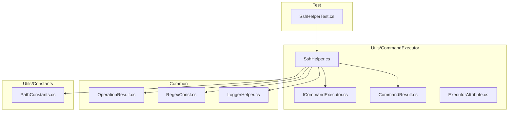
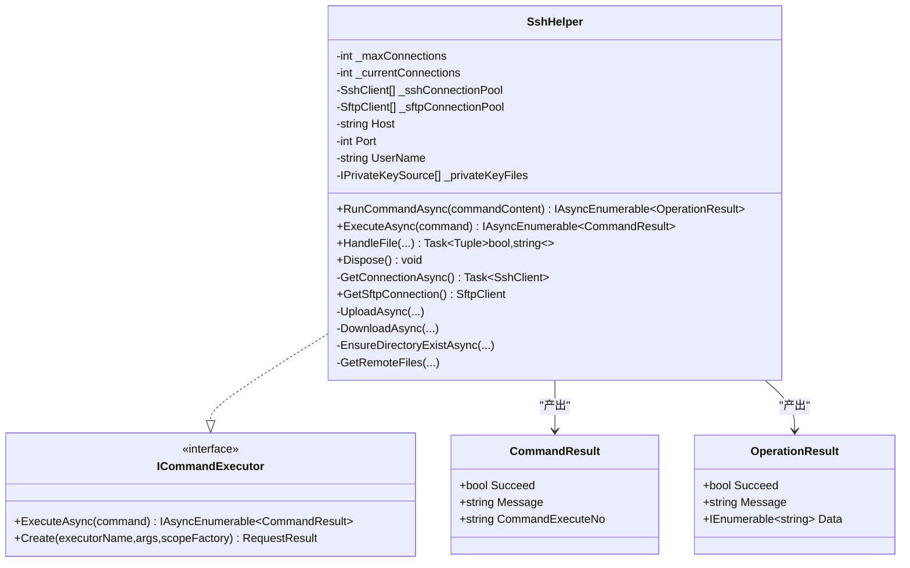
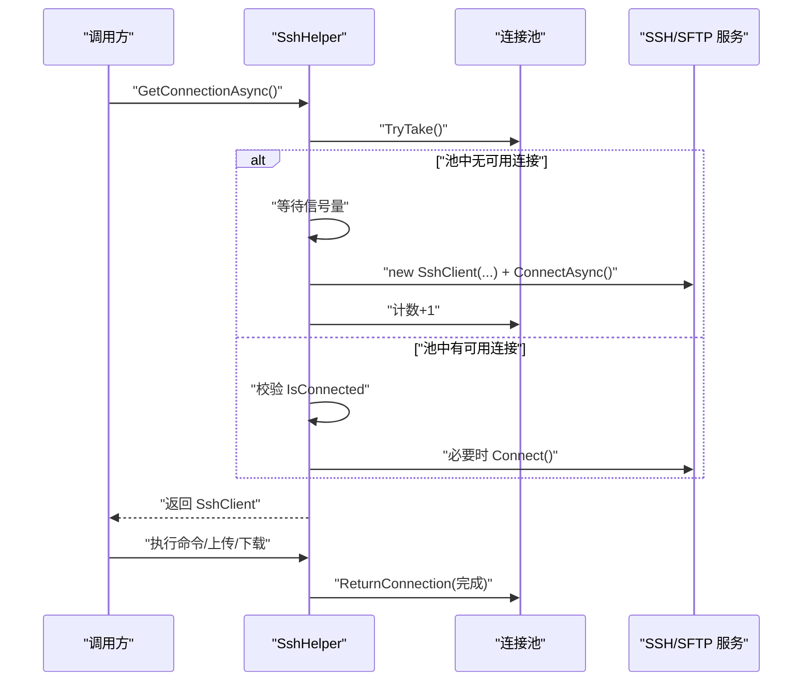
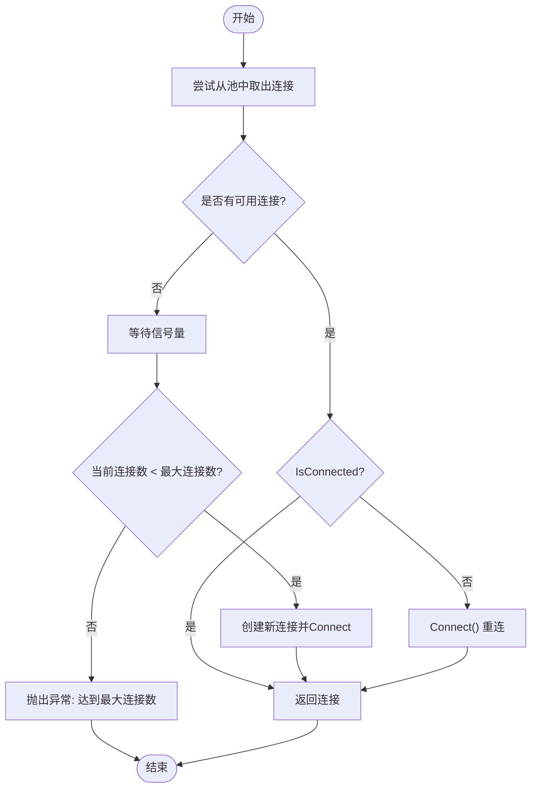
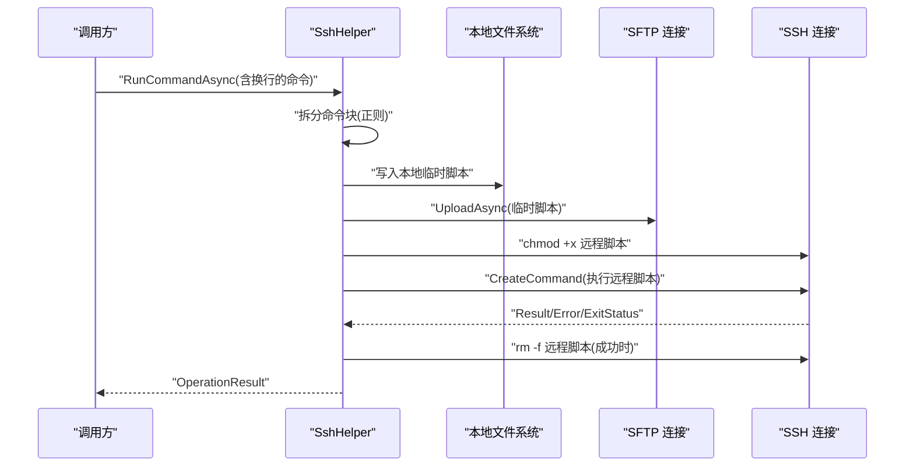
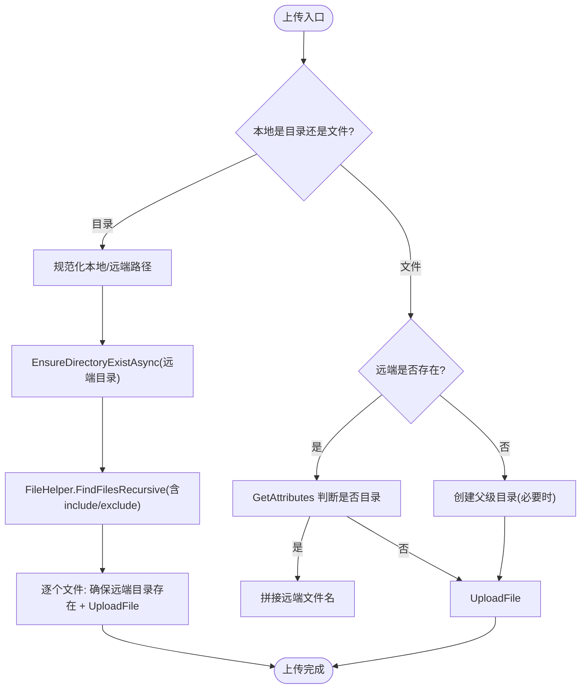
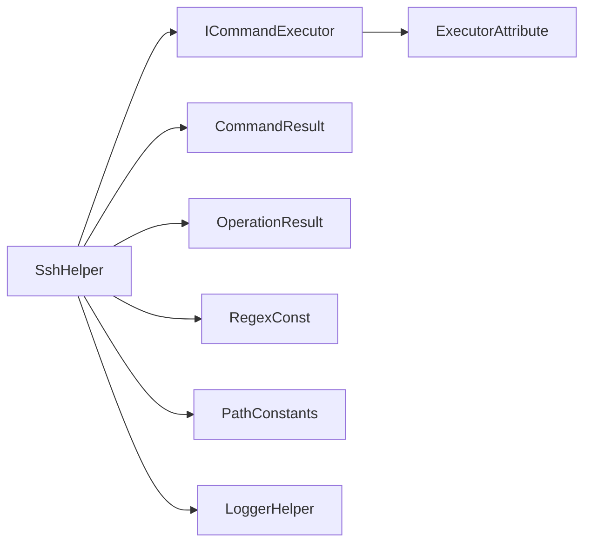

# SSH 连接管理

<cite>
**本文档引用的文件**
- [SshHelper.cs](file://Sylas.RemoteTasks.Utils/CommandExecutor/SshHelper.cs)
- [ICommandExecutor.cs](file://Sylas.RemoteTasks.Utils/CommandExecutor/ICommandExecutor.cs)
- [CommandResult.cs](file://Sylas.RemoteTasks.Utils/CommandExecutor/CommandResult.cs)
- [ExecutorAttribute.cs](file://Sylas.RemoteTasks.Utils/CommandExecutor/ExecutorAttribute.cs)
- [OperationResult.cs](file://Sylas.RemoteTasks.Common/Dtos/OperationResult.cs)
- [RegexConst.cs](file://Sylas.RemoteTasks.Common/RegexConst.cs)
- [PathConstants.cs](file://Sylas.RemoteTasks.Utils/Constants/PathConstants.cs)
- [LoggerHelper.cs](file://Sylas.RemoteTasks.Common/LoggerHelper.cs)
- [SshHelperTest.cs](file://Sylas.RemoteTasks.Test/Remote/SshHelperTest.cs)
</cite>

## 目录
1. [简介](#简介)
2. [项目结构](#项目结构)
3. [核心组件](#核心组件)
4. [架构总览](#架构总览)
5. [组件详细分析](#组件详细分析)
6. [依赖关系分析](#依赖关系分析)
7. [性能考量](#性能考量)
8. [故障排除指南](#故障排除指南)
9. [结论](#结论)
10. [附录](#附录)

## 简介
本文件面向 SSH 连接管理与远程运维场景，系统化梳理 SshHelper 类的安全连接建立与维护机制（公钥认证、密码认证、会话管理）、连接池与并发控制、超时与断线重连策略、通道管理（SFTP/SSH 命令通道），以及远程命令执行、文件上传/下载、端口转发能力的实现原理。同时给出安全性考虑、密钥管理、连接加密、性能优化建议、连接复用策略、安全最佳实践与常见问题排查方法。

## 项目结构
围绕 SSH 的核心实现位于 Sylas.RemoteTasks.Utils/CommandExecutor/SshHelper.cs，配套接口与结果模型位于同一目录；正则与常量位于 Sylas.RemoteTasks.Common 与 Sylas.RemoteTasks.Utils/Constants；日志与测试分别位于 Common 与 Sylas.RemoteTasks.Test。

**图表来源**
- [SshHelper.cs](file://Sylas.RemoteTasks.Utils/CommandExecutor/SshHelper.cs#L1-L619)
- [ICommandExecutor.cs](file://Sylas.RemoteTasks.Utils/CommandExecutor/ICommandExecutor.cs#L1-L74)
- [CommandResult.cs](file://Sylas.RemoteTasks.Utils/CommandExecutor/CommandResult.cs#L1-L37)
- [ExecutorAttribute.cs](file://Sylas.RemoteTasks.Utils/CommandExecutor/ExecutorAttribute.cs#L1-L25)
- [OperationResult.cs](file://Sylas.RemoteTasks.Common/Dtos/OperationResult.cs#L1-L52)
- [RegexConst.cs](file://Sylas.RemoteTasks.Common/RegexConst.cs#L1-L161)
- [PathConstants.cs](file://Sylas.RemoteTasks.Utils/Constants/PathConstants.cs#L1-L25)
- [LoggerHelper.cs](file://Sylas.RemoteTasks.Common/LoggerHelper.cs#L1-L45)
- [SshHelperTest.cs](file://Sylas.RemoteTasks.Test/Remote/SshHelperTest.cs#L1-L59)

**章节来源**
- [SshHelper.cs](file://Sylas.RemoteTasks.Utils/CommandExecutor/SshHelper.cs#L1-L619)
- [ICommandExecutor.cs](file://Sylas.RemoteTasks.Utils/CommandExecutor/ICommandExecutor.cs#L1-L74)
- [RegexConst.cs](file://Sylas.RemoteTasks.Common/RegexConst.cs#L140-L147)
- [PathConstants.cs](file://Sylas.RemoteTasks.Utils/Constants/PathConstants.cs#L11-L23)
- [LoggerHelper.cs](file://Sylas.RemoteTasks.Common/LoggerHelper.cs#L10-L45)
- [SshHelperTest.cs](file://Sylas.RemoteTasks.Test/Remote/SshHelperTest.cs#L1-L59)

## 核心组件
- SshHelper：单实例对应一台远程主机的 SSH/SFTP 管理器，负责连接池管理、命令执行、文件传输、远程文件发现、资源回收。
- ICommandExecutor：命令执行器抽象，支持反射创建与异步枚举结果输出。
- CommandResult/OperationResult：统一的执行结果承载对象。
- RegexConst：提供上传/下载命令解析的正则。
- PathConstants：默认 SSH 私钥路径常量。
- LoggerHelper：统一日志输出。
- SshHelperTest：端到端示例测试，演示命令执行与文件传输流程。

**章节来源**
- [SshHelper.cs](file://Sylas.RemoteTasks.Utils/CommandExecutor/SshHelper.cs#L18-L187)
- [ICommandExecutor.cs](file://Sylas.RemoteTasks.Utils/CommandExecutor/ICommandExecutor.cs#L14-L71)
- [CommandResult.cs](file://Sylas.RemoteTasks.Utils/CommandExecutor/CommandResult.cs#L6-L36)
- [OperationResult.cs](file://Sylas.RemoteTasks.Common/Dtos/OperationResult.cs#L8-L50)
- [RegexConst.cs](file://Sylas.RemoteTasks.Common/RegexConst.cs#L140-L147)
- [PathConstants.cs](file://Sylas.RemoteTasks.Utils/Constants/PathConstants.cs#L11-L23)
- [LoggerHelper.cs](file://Sylas.RemoteTasks.Common/LoggerHelper.cs#L10-L45)
- [SshHelperTest.cs](file://Sylas.RemoteTasks.Test/Remote/SshHelperTest.cs#L16-L56)

## 架构总览
SshHelper 采用“连接池 + 通道复用”的模式，按需创建 SSH/SFTP 客户端，执行完成后放回池中，避免频繁握手带来的性能损耗。命令执行支持“脚本块”与“上传-执行-清理”一体化流程，并通过正则解析 upload/download 指令，实现批量文件同步。

**图表来源**
- [SshHelper.cs](file://Sylas.RemoteTasks.Utils/CommandExecutor/SshHelper.cs#L18-L619)
- [ICommandExecutor.cs](file://Sylas.RemoteTasks.Utils/CommandExecutor/ICommandExecutor.cs#L14-L71)
- [CommandResult.cs](file://Sylas.RemoteTasks.Utils/CommandExecutor/CommandResult.cs#L6-L36)
- [OperationResult.cs](file://Sylas.RemoteTasks.Common/Dtos/OperationResult.cs#L8-L50)

## 组件详细分析

### 连接与认证机制
- 公钥认证：构造函数接收私钥文件路径列表，内部以分隔符拆分并构造多个私钥源；若未提供私钥，则根据平台选择默认私钥路径（Windows 与 Linux 分别指向不同用户家目录）。
- 密码认证：当前实现基于私钥文件，未直接暴露密码认证入口；如需密码认证，可在外部扩展为多种凭据组合（例如结合用户名密码与私钥）。
- 连接建立：首次从池中取连接失败时，使用信号量限制并发创建；创建后立即 ConnectAsync/Connect，确保可用性；连接池满时抛出“达到最大连接数”异常。
- 断线检测与重连：每次取连接时检查 IsConnected，若断开则主动 Connect() 恢复；执行完成后将连接放回池中，便于复用。

**图表来源**
- [SshHelper.cs](file://Sylas.RemoteTasks.Utils/CommandExecutor/SshHelper.cs#L36-L79)
- [SshHelper.cs](file://Sylas.RemoteTasks.Utils/CommandExecutor/SshHelper.cs#L87-L120)

**章节来源**
- [SshHelper.cs](file://Sylas.RemoteTasks.Utils/CommandExecutor/SshHelper.cs#L173-L187)
- [PathConstants.cs](file://Sylas.RemoteTasks.Utils/Constants/PathConstants.cs#L11-L23)
- [SshHelper.cs](file://Sylas.RemoteTasks.Utils/CommandExecutor/SshHelper.cs#L36-L79)
- [SshHelper.cs](file://Sylas.RemoteTasks.Utils/CommandExecutor/SshHelper.cs#L87-L120)

### 连接池与并发控制
- 最大连接数：固定上限 20；超过上限抛出异常，避免资源耗尽。
- 并发创建：使用信号量限制同一时刻仅有一个线程尝试扩容连接池，避免过度竞争。
- 池回收：Dispose 时断开并释放所有池内连接；返回连接时追加至池尾，遵循“用完即还”。

**图表来源**
- [SshHelper.cs](file://Sylas.RemoteTasks.Utils/CommandExecutor/SshHelper.cs#L36-L79)
- [SshHelper.cs](file://Sylas.RemoteTasks.Utils/CommandExecutor/SshHelper.cs#L87-L120)
- [SshHelper.cs](file://Sylas.RemoteTasks.Utils/CommandExecutor/SshHelper.cs#L149-L165)

**章节来源**
- [SshHelper.cs](file://Sylas.RemoteTasks.Utils/CommandExecutor/SshHelper.cs#L20-L29)
- [SshHelper.cs](file://Sylas.RemoteTasks.Utils/CommandExecutor/SshHelper.cs#L185-L186)

### 命令执行与脚本块处理
- 命令解析：使用正则识别 upload/download 块，其余作为普通命令执行。
- 脚本块：当命令包含换行时，先写入本地临时文件，上传到远程临时目录并赋予可执行权限，再执行远程脚本，最后清理临时文件。
- 结果判定：依据错误输出与退出状态综合判断成功与否。

**图表来源**
- [SshHelper.cs](file://Sylas.RemoteTasks.Utils/CommandExecutor/SshHelper.cs#L206-L317)
- [RegexConst.cs](file://Sylas.RemoteTasks.Common/RegexConst.cs#L140-L147)

**章节来源**
- [SshHelper.cs](file://Sylas.RemoteTasks.Utils/CommandExecutor/SshHelper.cs#L206-L317)
- [RegexConst.cs](file://Sylas.RemoteTasks.Common/RegexConst.cs#L140-L147)

### 文件上传/下载与远程文件发现
- 上传：
  - 支持本地目录与文件两种模式；目录上传时递归遍历，按相对路径映射到远端；支持 include/exclude 过滤。
  - 文件上传时自动判断远端目标是目录还是文件，必要时创建父级目录。
- 下载：
  - 目录下载时先获取远端文件清单，逐个下载；文件下载时确保本地目录存在。
- 远程文件发现：
  - 使用 find + 正则过滤生成文件列表，限制深度与数量上限，避免大规模扫描造成阻塞。

**图表来源**
- [SshHelper.cs](file://Sylas.RemoteTasks.Utils/CommandExecutor/SshHelper.cs#L319-L421)
- [SshHelper.cs](file://Sylas.RemoteTasks.Utils/CommandExecutor/SshHelper.cs#L485-L503)
- [SshHelper.cs](file://Sylas.RemoteTasks.Utils/CommandExecutor/SshHelper.cs#L511-L546)

**章节来源**
- [SshHelper.cs](file://Sylas.RemoteTasks.Utils/CommandExecutor/SshHelper.cs#L319-L421)
- [SshHelper.cs](file://Sylas.RemoteTasks.Utils/CommandExecutor/SshHelper.cs#L423-L484)
- [SshHelper.cs](file://Sylas.RemoteTasks.Utils/CommandExecutor/SshHelper.cs#L485-L546)

### 端口转发
- 当前 SshHelper 未实现端口转发功能；如需端口转发，可在现有 SSH 客户端基础上扩展 TCP 转发通道（例如使用 Renci.SshNet 的 ForwardedPortLocal/ForwardedPortRemote）。

[本节为概念性说明，不直接分析具体文件，故无“章节来源”]

### 超时控制与断线重连
- 超时控制：连接建立阶段使用 CancellationTokenSource，但未设置超时时间；建议在调用层或封装层增加超时策略。
- 断线重连：取连接时检测 IsConnected 并主动 Connect()；执行完成后放回池中，便于后续复用。

**章节来源**
- [SshHelper.cs](file://Sylas.RemoteTasks.Utils/CommandExecutor/SshHelper.cs#L49-L50)
- [SshHelper.cs](file://Sylas.RemoteTasks.Utils/CommandExecutor/SshHelper.cs#L74-L78)

### 通道管理
- SSH 命令通道：通过 CreateCommand 执行命令，支持获取标准输出、错误输出与退出状态。
- SFTP 通道：独立于 SSH 命令通道，用于文件传输；两者共享同一认证信息，但复用不同的底层通道。

**章节来源**
- [SshHelper.cs](file://Sylas.RemoteTasks.Utils/CommandExecutor/SshHelper.cs#L299-L314)
- [SshHelper.cs](file://Sylas.RemoteTasks.Utils/CommandExecutor/SshHelper.cs#L87-L120)

### 远程文件处理（文件转换示例）
- HandleFile：在服务器上处理文件，若源文件不存在则上传，处理完成后下载结果并清理临时文件；适用于“本地准备、远程处理、结果回传”的工作流。

**章节来源**
- [SshHelper.cs](file://Sylas.RemoteTasks.Utils/CommandExecutor/SshHelper.cs#L568-L616)

## 依赖关系分析
- SshHelper 实现 ICommandExecutor 接口，支持通过反射创建与异步枚举结果。
- 命令结果模型 CommandResult 与 OperationResult 分别服务于不同抽象层级。
- 正则与常量模块为 SshHelper 的命令解析与路径推导提供支撑。
- 日志模块统一输出关键事件，便于排障。

**图表来源**
- [SshHelper.cs](file://Sylas.RemoteTasks.Utils/CommandExecutor/SshHelper.cs#L18-L619)
- [ICommandExecutor.cs](file://Sylas.RemoteTasks.Utils/CommandExecutor/ICommandExecutor.cs#L14-L71)
- [CommandResult.cs](file://Sylas.RemoteTasks.Utils/CommandExecutor/CommandResult.cs#L6-L36)
- [OperationResult.cs](file://Sylas.RemoteTasks.Common/Dtos/OperationResult.cs#L8-L50)
- [RegexConst.cs](file://Sylas.RemoteTasks.Common/RegexConst.cs#L140-L147)
- [PathConstants.cs](file://Sylas.RemoteTasks.Utils/Constants/PathConstants.cs#L11-L23)
- [LoggerHelper.cs](file://Sylas.RemoteTasks.Common/LoggerHelper.cs#L10-L45)
- [ExecutorAttribute.cs](file://Sylas.RemoteTasks.Utils/CommandExecutor/ExecutorAttribute.cs#L10-L24)

**章节来源**
- [ICommandExecutor.cs](file://Sylas.RemoteTasks.Utils/CommandExecutor/ICommandExecutor.cs#L14-L71)
- [ExecutorAttribute.cs](file://Sylas.RemoteTasks.Utils/CommandExecutor/ExecutorAttribute.cs#L10-L24)

## 性能考量
- 连接池复用：通过池化减少握手与认证开销，建议在高并发场景下保持合理的最大连接数。
- 批量文件传输：目录上传时按需创建远端目录，避免重复 mkdir；使用 include/exclude 过滤减少传输量。
- 远程文件发现：限制 find 深度与数量上限，避免长时间阻塞。
- 临时脚本清理：成功执行后及时删除远程临时脚本，降低磁盘占用。
- 日志级别：生产环境建议降低日志频率，避免 I/O 影响。

[本节提供通用建议，不直接分析具体文件，故无“章节来源”]

## 故障排除指南
- “达到最大连接数”：检查并发任务数与连接池上限，适当降低并发或提升上限。
- 连接断开：确认网络稳定性与 Keep-Alive 设置；SshHelper 已具备断线重连逻辑，仍建议在上层增加重试与熔断。
- 上传/下载失败：检查本地路径与远端权限、磁盘空间；使用 include/exclude 精确筛选文件。
- 命令执行无输出：确认远程脚本可执行权限与 shebang；检查错误输出与退出状态。
- 日志定位：利用 LoggerHelper 输出的关键节点信息快速定位问题。

**章节来源**
- [SshHelper.cs](file://Sylas.RemoteTasks.Utils/CommandExecutor/SshHelper.cs#L56-L60)
- [SshHelper.cs](file://Sylas.RemoteTasks.Utils/CommandExecutor/SshHelper.cs#L74-L78)
- [LoggerHelper.cs](file://Sylas.RemoteTasks.Common/LoggerHelper.cs#L10-L45)

## 结论
SshHelper 提供了完善的 SSH/SFTP 管理能力，涵盖连接池、命令执行、文件传输与远程文件发现等核心功能。通过正则解析与脚本块处理，实现了“上传-执行-清理”的自动化流水线。建议在生产环境中补充超时控制、断线重试与熔断策略，并结合日志与监控完善可观测性。

[本节为总结性内容，不直接分析具体文件，故无“章节来源”]

## 附录

### 实际使用示例（基于测试）
- 命令执行：从配置读取命令数组，逐条执行并输出结果。
- 文件上传：构造 SshHelper 实例，调用 RunCommandAsync 执行 upload 命令块。

**章节来源**
- [SshHelperTest.cs](file://Sylas.RemoteTasks.Test/Remote/SshHelperTest.cs#L16-L56)

### 安全性与密钥管理
- 私钥路径：优先显式传入，否则使用平台默认路径；建议使用受保护的密钥文件与最小权限账户。
- 连接加密：基于 SSH 协议的加密通道；建议启用强密钥算法（如 Ed25519）。
- 凭据注入：避免在命令中明文传递敏感信息；优先通过环境变量或配置中心管理。

**章节来源**
- [PathConstants.cs](file://Sylas.RemoteTasks.Utils/Constants/PathConstants.cs#L11-L23)
- [SshHelper.cs](file://Sylas.RemoteTasks.Utils/CommandExecutor/SshHelper.cs#L179-L184)