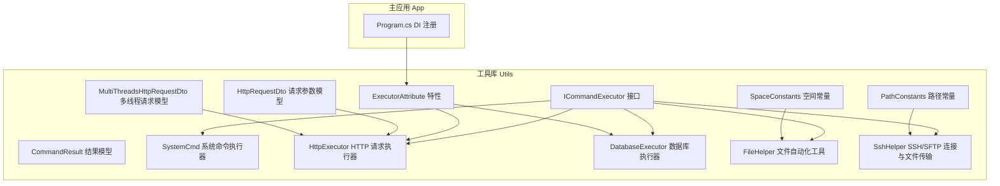
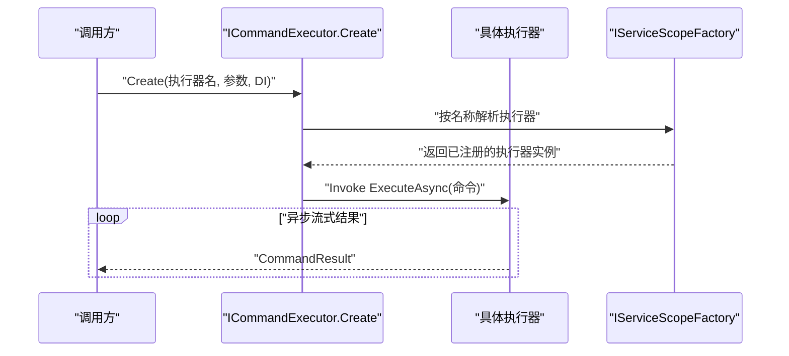
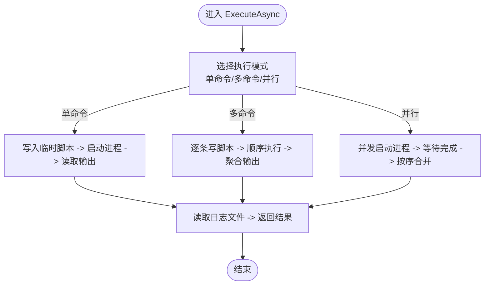
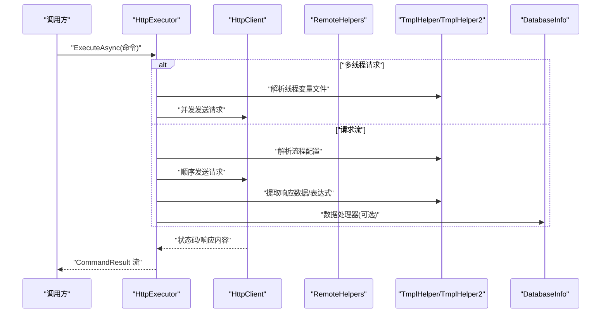
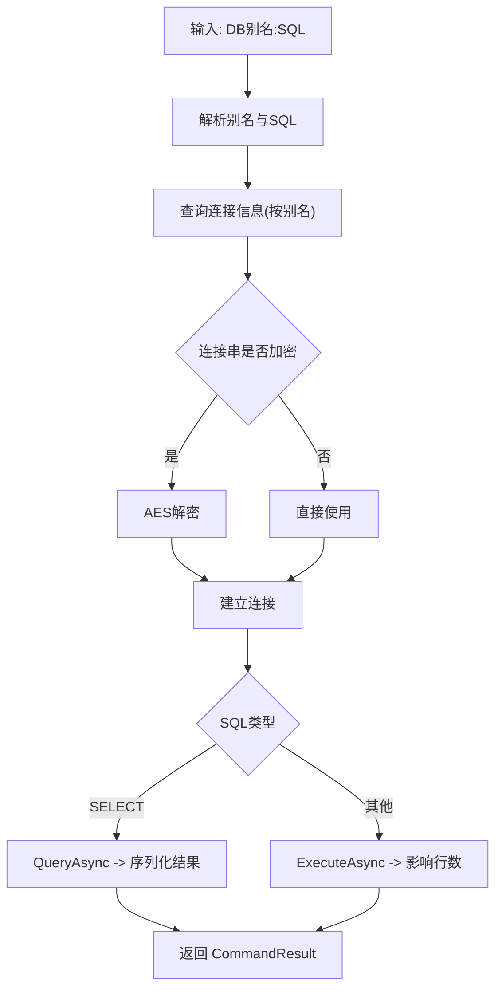
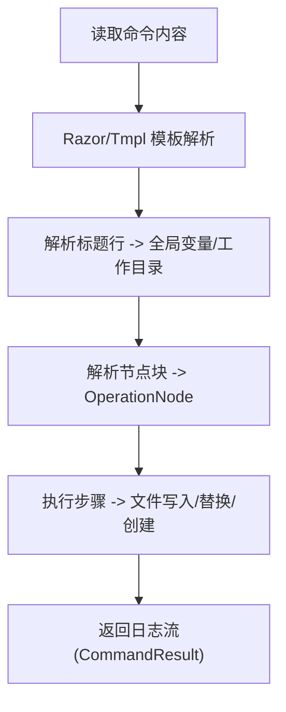
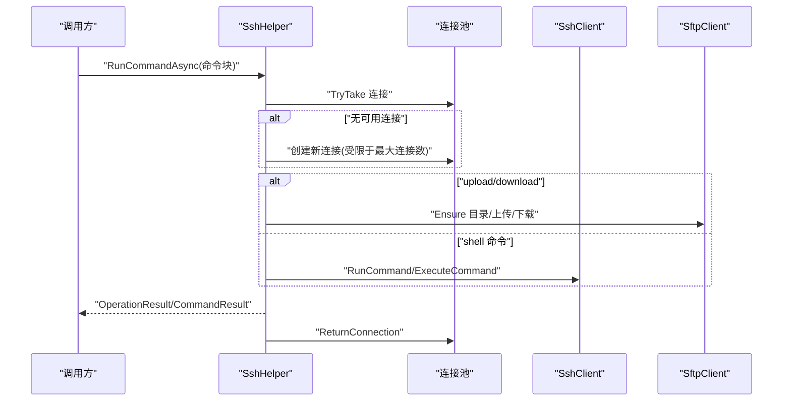
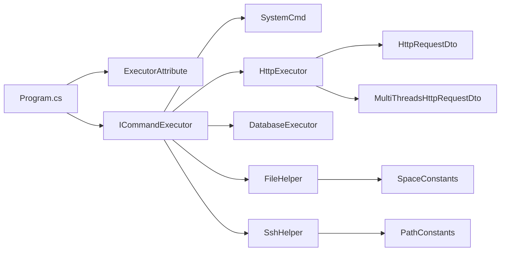

# 工具库系统

<cite>
**本文引用的文件**
- [SystemCmd.cs](file://Sylas.RemoteTasks.Utils/CommandExecutor/SystemCmd.cs)
- [HttpExecutor.cs](file://Sylas.RemoteTasks.Utils/CommandExecutor/HttpExecutor.cs)
- [DatabaseExecutor.cs](file://Sylas.RemoteTasks.Utils/CommandExecutor/DatabaseExecutor.cs)
- [FileHelper.cs](file://Sylas.RemoteTasks.Utils/CommandExecutor/FileHelper.cs)
- [SshHelper.cs](file://Sylas.RemoteTasks.Utils/CommandExecutor/SshHelper.cs)
- [ICommandExecutor.cs](file://Sylas.RemoteTasks.Utils/CommandExecutor/ICommandExecutor.cs)
- [ExecutorAttribute.cs](file://Sylas.RemoteTasks.Utils/CommandExecutor/ExecutorAttribute.cs)
- [CommandResult.cs](file://Sylas.RemoteTasks.Utils/CommandExecutor/CommandResult.cs)
- [HttpRequestDto.cs](file://Sylas.RemoteTasks.Utils/CommandExecutor/HttpRequestDto.cs)
- [MultiThreadsHttpRequestDto.cs](file://Sylas.RemoteTasks.Utils/CommandExecutor/MultiThreadsHttpRequestDto.cs)
- [PathConstants.cs](file://Sylas.RemoteTasks.Utils/Constants/PathConstants.cs)
- [SpaceConstants.cs](file://Sylas.RemoteTasks.Utils/Constants/SpaceConstants.cs)
- [Program.cs](file://Sylas.RemoteTasks.App/Program.cs)
</cite>

## 目录
1. [简介](#简介)
2. [项目结构](#项目结构)
3. [核心组件](#核心组件)
4. [架构总览](#架构总览)
5. [详细组件分析](#详细组件分析)
6. [依赖关系分析](#依赖关系分析)
7. [性能考量](#性能考量)
8. [故障排查指南](#故障排查指南)
9. [结论](#结论)
10. [附录](#附录)

## 简介
本文件面向“工具库系统”的使用者与维护者，系统性阐述以下能力与实现细节：
- 命令执行器：SystemCmd（系统命令）、HttpExecutor（HTTP 请求）、DatabaseExecutor（数据库操作）
- 文件与远程操作工具：FileHelper（文件自动化与模板驱动的批量文件操作）、SshHelper（SSH/SFTP 连接与文件传输）
- 执行器注册机制与扩展开发方式
- 使用示例与配置参数
- 错误处理策略、超时控制、并发安全
- 与主应用系统的集成方式与性能优化建议

## 项目结构
工具库位于 Sylas.RemoteTasks.Utils/CommandExecutor 目录，围绕 ICommandExecutor 抽象统一调度各类执行器；常量与模板辅助类位于 Utils/Constants 与 Utils/Template 等目录；主应用 Sylas.RemoteTasks.App 在 Program.cs 中完成执行器与服务的注册。

图表来源
- [ICommandExecutor.cs](file://Sylas.RemoteTasks.Utils/CommandExecutor/ICommandExecutor.cs#L1-L74)
- [ExecutorAttribute.cs](file://Sylas.RemoteTasks.Utils/CommandExecutor/ExecutorAttribute.cs#L1-L26)
- [CommandResult.cs](file://Sylas.RemoteTasks.Utils/CommandExecutor/CommandResult.cs#L1-L38)
- [SystemCmd.cs](file://Sylas.RemoteTasks.Utils/CommandExecutor/SystemCmd.cs#L1-L788)
- [HttpExecutor.cs](file://Sylas.RemoteTasks.Utils/CommandExecutor/HttpExecutor.cs#L1-L258)
- [DatabaseExecutor.cs](file://Sylas.RemoteTasks.Utils/CommandExecutor/DatabaseExecutor.cs#L1-L84)
- [FileHelper.cs](file://Sylas.RemoteTasks.Utils/CommandExecutor/FileHelper.cs#L1-L800)
- [SshHelper.cs](file://Sylas.RemoteTasks.Utils/CommandExecutor/SshHelper.cs#L1-L619)
- [HttpRequestDto.cs](file://Sylas.RemoteTasks.Utils/CommandExecutor/HttpRequestDto.cs#L1-L78)
- [MultiThreadsHttpRequestDto.cs](file://Sylas.RemoteTasks.Utils/CommandExecutor/MultiThreadsHttpRequestDto.cs#L1-L20)
- [PathConstants.cs](file://Sylas.RemoteTasks.Utils/Constants/PathConstants.cs#L1-L25)
- [SpaceConstants.cs](file://Sylas.RemoteTasks.Utils/Constants/SpaceConstants.cs#L1-L50)
- [Program.cs](file://Sylas.RemoteTasks.App/Program.cs#L1-L122)

章节来源
- [Program.cs](file://Sylas.RemoteTasks.App/Program.cs#L1-L122)

## 核心组件
- ICommandExecutor：统一的异步流式执行接口，返回 CommandResult 流，便于实时反馈与进度展示。
- ExecutorAttribute：标记类为执行器，并通过 DI 容器按名称解析具体实现。
- CommandResult：封装执行成功标志、消息与可选的执行编号，便于客户端并发匹配。
- SystemCmd：跨平台系统命令执行、主机信息采集、磁盘/内存/CPU 查询、批处理与并行执行。
- HttpExecutor：单请求、请求流、多线程压力测试、响应提取与数据处理器链路。
- DatabaseExecutor：基于别名定位目标数据库，自动解密连接串，支持 select/非 select 统一执行。
- FileHelper：递归文件检索、模板驱动的批量文件操作（Razor/Tmpl）、JSON/正则解析、实体代码生成辅助。
- SshHelper：SSH/SFTP 连接池、命令执行、文件上传/下载、远程文件遍历、带容器环境的文件处理。

章节来源
- [ICommandExecutor.cs](file://Sylas.RemoteTasks.Utils/CommandExecutor/ICommandExecutor.cs#L1-L74)
- [ExecutorAttribute.cs](file://Sylas.RemoteTasks.Utils/CommandExecutor/ExecutorAttribute.cs#L1-L26)
- [CommandResult.cs](file://Sylas.RemoteTasks.Utils/CommandExecutor/CommandResult.cs#L1-L38)

## 架构总览
执行器通过特性标注与 DI 解析实现“按名创建”，统一由 ICommandExecutor.ExecuteAsync 驱动，形成“命令字符串 -> 执行器 -> 异步流式结果”的标准通道。

图表来源
- [ICommandExecutor.cs](file://Sylas.RemoteTasks.Utils/CommandExecutor/ICommandExecutor.cs#L31-L71)
- [ExecutorAttribute.cs](file://Sylas.RemoteTasks.Utils/CommandExecutor/ExecutorAttribute.cs#L18-L23)

## 详细组件分析

### SystemCmd：系统命令执行与主机信息采集
- 能力概览
  - 单命令/多命令/并行命令执行
  - 跨平台（Windows PowerShell/Linux Bash）脚本执行与日志落盘
  - 主机信息采集：CPU/内存/磁盘/网卡/IP/进程资源
- 关键实现要点
  - 使用 ProcessStartInfo 启动 shell，重定向标准输入/输出/错误，UTF-8 编码
  - 通过临时脚本与日志文件聚合输出，避免阻塞与乱码
  - 并发安全：并行执行采用 Task.WhenAll，输出收集使用 ConcurrentBag 与有序索引
  - 主机信息：根据 OS 判定，分别调用系统命令或 .NET API 获取
- 使用建议
  - 大量命令建议使用 ExecuteAsync(params string[]) 或 ExecuteParallellyAsync
  - 注意清理临时目录（保留最近 N 个）

图表来源
- [SystemCmd.cs](file://Sylas.RemoteTasks.Utils/CommandExecutor/SystemCmd.cs#L144-L221)
- [SystemCmd.cs](file://Sylas.RemoteTasks.Utils/CommandExecutor/SystemCmd.cs#L301-L379)

章节来源
- [SystemCmd.cs](file://Sylas.RemoteTasks.Utils/CommandExecutor/SystemCmd.cs#L1-L788)

### HttpExecutor：HTTP 请求与请求流
- 能力概览
  - 单请求 JSON 命令
  - 请求流配置（多步骤、模板变量、成功模式校验）
  - 多线程压力测试（线程变量文件 + 并发请求）
  - 响应提取器与数据处理器链（如保存到数据库）
- 关键实现要点
  - 命令解析：JSON DTO 或流程配置字符串
  - 成功判定：正则 IsSuccessPattern
  - 模板解析：TmplHelper/TmplHelper2 支持变量替换与表达式提取
  - 数据处理：DataHandlers 调用 DatabaseInfo.TransferDataAsync
- 使用建议
  - 为每个请求配置 IsSuccessPattern，确保结果可验证
  - 压力测试场景使用 MultiThreadsHttpRequestDto，准备 CSV 变量文件

图表来源
- [HttpExecutor.cs](file://Sylas.RemoteTasks.Utils/CommandExecutor/HttpExecutor.cs#L29-L102)
- [HttpExecutor.cs](file://Sylas.RemoteTasks.Utils/CommandExecutor/HttpExecutor.cs#L148-L255)
- [HttpRequestDto.cs](file://Sylas.RemoteTasks.Utils/CommandExecutor/HttpRequestDto.cs#L11-L78)
- [MultiThreadsHttpRequestDto.cs](file://Sylas.RemoteTasks.Utils/CommandExecutor/MultiThreadsHttpRequestDto.cs#L8-L20)

章节来源
- [HttpExecutor.cs](file://Sylas.RemoteTasks.Utils/CommandExecutor/HttpExecutor.cs#L1-L258)
- [HttpRequestDto.cs](file://Sylas.RemoteTasks.Utils/CommandExecutor/HttpRequestDto.cs#L1-L78)
- [MultiThreadsHttpRequestDto.cs](file://Sylas.RemoteTasks.Utils/CommandExecutor/MultiThreadsHttpRequestDto.cs#L1-L20)

### DatabaseExecutor：数据库操作
- 能力概览
  - 以“数据库别名: SQL”格式解析目标库
  - 自动识别明文/加密连接串并解密
  - 支持 SELECT（返回序列化结果）与非 SELECT（返回影响行数）
- 关键实现要点
  - 通过 DbConnectionInfo 表与 DataFilter 按别名筛选目标连接
  - 使用 Dapper 执行 SQL，异常捕获并包装为 CommandResult
- 使用建议
  - 为敏感连接串使用加密存储，避免明文泄露

图表来源
- [DatabaseExecutor.cs](file://Sylas.RemoteTasks.Utils/CommandExecutor/DatabaseExecutor.cs#L26-L81)

章节来源
- [DatabaseExecutor.cs](file://Sylas.RemoteTasks.Utils/CommandExecutor/DatabaseExecutor.cs#L1-L84)

### FileHelper：文件自动化与模板驱动
- 能力概览
  - 递归文件/目录查找、过滤与停止条件
  - 模板驱动的批量文件操作（Razor/Tmpl），支持 IF/变量/替换
  - JSON/正则解析、实体代码生成辅助、编码检测
- 关键实现要点
  - 模板解析：支持 RazorEngine 与自研 TmplHelper2，标题行定义全局变量与工作目录
  - 节点解析：从配置块中提取 TargetFilePattern/Steps/OperationType 等
  - 性能：正则去重、分组匹配，避免重复结果
- 使用建议
  - 大文件解析建议配合分组与去重逻辑，避免内存峰值

图表来源
- [FileHelper.cs](file://Sylas.RemoteTasks.Utils/CommandExecutor/FileHelper.cs#L587-L662)
- [FileHelper.cs](file://Sylas.RemoteTasks.Utils/CommandExecutor/FileHelper.cs#L663-L747)

章节来源
- [FileHelper.cs](file://Sylas.RemoteTasks.Utils/CommandExecutor/FileHelper.cs#L1-L800)
- [SpaceConstants.cs](file://Sylas.RemoteTasks.Utils/Constants/SpaceConstants.cs#L1-L50)

### SshHelper：SSH/SFTP 连接与文件传输
- 能力概览
  - 连接池：最大连接数限制，SSH/SFTP 分离池，线程安全
  - 命令执行：支持上传/下载命令块解析与执行
  - 文件操作：目录/文件上传、下载、远程文件遍历、容器环境兼容
- 关键实现要点
  - 连接池：SemaphoreSlim + Lock 保护，连接断开自动重连
  - 命令块：正则匹配 upload/download 命令，支持 include/exclude 过滤
  - 临时脚本：长命令自动上传至远程临时目录执行，成功后清理
- 使用建议
  - 控制并发，避免超过最大连接数
  - 上传/下载时注意 include/exclude 规则，减少传输量

图表来源
- [SshHelper.cs](file://Sylas.RemoteTasks.Utils/CommandExecutor/SshHelper.cs#L36-L80)
- [SshHelper.cs](file://Sylas.RemoteTasks.Utils/CommandExecutor/SshHelper.cs#L206-L318)
- [SshHelper.cs](file://Sylas.RemoteTasks.Utils/CommandExecutor/SshHelper.cs#L319-L421)
- [PathConstants.cs](file://Sylas.RemoteTasks.Utils/Constants/PathConstants.cs#L14-L23)

章节来源
- [SshHelper.cs](file://Sylas.RemoteTasks.Utils/CommandExecutor/SshHelper.cs#L1-L619)
- [PathConstants.cs](file://Sylas.RemoteTasks.Utils/Constants/PathConstants.cs#L1-L25)

## 依赖关系分析
- 执行器注册
  - Program.cs 中调用 builder.Services.AddExecutor() 完成执行器扫描与注册（通过 ExecutorAttribute 标记）
  - ICommandExecutor.Create 通过反射与 DI 解析，按名称获取执行器实例
- 外部依赖
  - SystemCmd 依赖系统 shell 与 .NET 进程模型
  - HttpExecutor 依赖 HttpClientFactory 与远程 helpers
  - DatabaseExecutor 依赖 Dapper 与数据库连接信息表
  - SshHelper 依赖 Renci.SshNet 与连接池
  - FileHelper 依赖 RazorEngine 与模板解析

图表来源
- [Program.cs](file://Sylas.RemoteTasks.App/Program.cs#L27-L27)
- [ICommandExecutor.cs](file://Sylas.RemoteTasks.Utils/CommandExecutor/ICommandExecutor.cs#L31-L55)
- [ExecutorAttribute.cs](file://Sylas.RemoteTasks.Utils/CommandExecutor/ExecutorAttribute.cs#L18-L23)
- [HttpRequestDto.cs](file://Sylas.RemoteTasks.Utils/CommandExecutor/HttpRequestDto.cs#L11-L78)
- [MultiThreadsHttpRequestDto.cs](file://Sylas.RemoteTasks.Utils/CommandExecutor/MultiThreadsHttpRequestDto.cs#L8-L20)
- [PathConstants.cs](file://Sylas.RemoteTasks.Utils/Constants/PathConstants.cs#L14-L23)
- [SpaceConstants.cs](file://Sylas.RemoteTasks.Utils/Constants/SpaceConstants.cs#L1-L50)

章节来源
- [Program.cs](file://Sylas.RemoteTasks.App/Program.cs#L1-L122)
- [ICommandExecutor.cs](file://Sylas.RemoteTasks.Utils/CommandExecutor/ICommandExecutor.cs#L1-L74)
- [ExecutorAttribute.cs](file://Sylas.RemoteTasks.Utils/CommandExecutor/ExecutorAttribute.cs#L1-L26)

## 性能考量
- 并发与连接池
  - SystemCmd 并行执行使用 Task.WhenAll，注意系统资源上限
  - SshHelper 最大连接数固定为 20，避免过度并发导致资源争用
- I/O 优化
  - FileHelper 模板解析与正则去重，建议分批处理大文件
  - SshHelper 上传/下载支持 include/exclude 过滤，减少传输量
- 序列化与编码
  - SystemCmd 使用 UTF-8 输出编码，避免跨平台乱码
  - DatabaseExecutor 对 SELECT 结果进行 JSON 序列化，注意大数据量的内存占用

[本节为通用性能建议，无需特定文件引用]

## 故障排查指南
- 常见问题与定位
  - HTTP 请求失败：检查 IsSuccessPattern 与响应内容；确认模板变量解析正确
  - 数据库连接失败：确认别名存在且连接串可解密；检查 Dapper 执行异常
  - SSH/SFTP 失败：检查连接池上限与连接断开自动重连；核对 include/exclude 规则
  - 文件操作异常：确认模板语法、全局变量与工作目录；检查编码检测与文件权限
- 日志与诊断
  - HttpExecutor 在关键节点输出日志，便于定位失败步骤
  - SystemCmd/HttpExecutor/DatabaseExecutor 均将异常信息封装为 CommandResult.Message 返回
  - SshHelper 在上传/下载与命令执行前后输出详细日志

章节来源
- [HttpExecutor.cs](file://Sylas.RemoteTasks.Utils/CommandExecutor/HttpExecutor.cs#L170-L189)
- [SystemCmd.cs](file://Sylas.RemoteTasks.Utils/CommandExecutor/SystemCmd.cs#L197-L221)
- [DatabaseExecutor.cs](file://Sylas.RemoteTasks.Utils/CommandExecutor/DatabaseExecutor.cs#L76-L81)
- [SshHelper.cs](file://Sylas.RemoteTasks.Utils/CommandExecutor/SshHelper.cs#L300-L316)

## 结论
工具库系统通过统一的执行器抽象与特性驱动的注册机制，实现了命令执行、HTTP 请求、数据库操作、文件自动化与远程传输的模块化与可扩展。结合模板解析、连接池与异步流式结果，既满足复杂业务编排，也兼顾性能与可观测性。建议在生产环境中合理配置并发与连接上限，完善日志与监控，确保稳定性与可维护性。

[本节为总结性内容，无需特定文件引用]

## 附录

### 执行器注册与扩展开发
- 注册方式
  - 在 Program.cs 中调用 builder.Services.AddExecutor() 完成扫描与注册
  - 通过 ExecutorAttribute 标记类为执行器，并在 DI 中以键名注册
- 扩展开发
  - 新增执行器需实现 ICommandExecutor.ExecuteAsync，返回 CommandResult 流
  - 若依赖 DI 服务，使用 ExecutorAttribute 标注并通过 Create 方法按名称解析
  - 命令参数建议采用 JSON DTO 或配置字符串，便于模板与流程编排

章节来源
- [Program.cs](file://Sylas.RemoteTasks.App/Program.cs#L27-L27)
- [ICommandExecutor.cs](file://Sylas.RemoteTasks.Utils/CommandExecutor/ICommandExecutor.cs#L31-L71)
- [ExecutorAttribute.cs](file://Sylas.RemoteTasks.Utils/CommandExecutor/ExecutorAttribute.cs#L18-L23)

### 使用示例与配置参数（路径指引）
- SystemCmd
  - 单命令执行：参考 [SystemCmd.cs](file://Sylas.RemoteTasks.Utils/CommandExecutor/SystemCmd.cs#L227-L295)
  - 多命令/并行执行：参考 [SystemCmd.cs](file://Sylas.RemoteTasks.Utils/CommandExecutor/SystemCmd.cs#L144-L221), [SystemCmd.cs](file://Sylas.RemoteTasks.Utils/CommandExecutor/SystemCmd.cs#L301-L379)
  - 主机信息采集：参考 [SystemCmd.cs](file://Sylas.RemoteTasks.Utils/CommandExecutor/SystemCmd.cs#L505-L648)
- HttpExecutor
  - 单请求 JSON 命令：参考 [HttpExecutor.cs](file://Sylas.RemoteTasks.Utils/CommandExecutor/HttpExecutor.cs#L86-L91)
  - 请求流配置：参考 [HttpExecutor.cs](file://Sylas.RemoteTasks.Utils/CommandExecutor/HttpExecutor.cs#L148-L255)
  - 多线程压力测试：参考 [MultiThreadsHttpRequestDto.cs](file://Sylas.RemoteTasks.Utils/CommandExecutor/MultiThreadsHttpRequestDto.cs#L8-L20)
  - 请求参数模型：参考 [HttpRequestDto.cs](file://Sylas.RemoteTasks.Utils/CommandExecutor/HttpRequestDto.cs#L11-L78)
- DatabaseExecutor
  - 命令格式与执行：参考 [DatabaseExecutor.cs](file://Sylas.RemoteTasks.Utils/CommandExecutor/DatabaseExecutor.cs#L26-L81)
- FileHelper
  - 模板驱动文件操作：参考 [FileHelper.cs](file://Sylas.RemoteTasks.Utils/CommandExecutor/FileHelper.cs#L587-L662)
  - 递归查找与过滤：参考 [FileHelper.cs](file://Sylas.RemoteTasks.Utils/CommandExecutor/FileHelper.cs#L116-L150)
- SshHelper
  - 命令块解析与执行：参考 [SshHelper.cs](file://Sylas.RemoteTasks.Utils/CommandExecutor/SshHelper.cs#L206-L318)
  - 上传/下载：参考 [SshHelper.cs](file://Sylas.RemoteTasks.Utils/CommandExecutor/SshHelper.cs#L319-L421)
  - 远程文件遍历：参考 [SshHelper.cs](file://Sylas.RemoteTasks.Utils/CommandExecutor/SshHelper.cs#L511-L546)