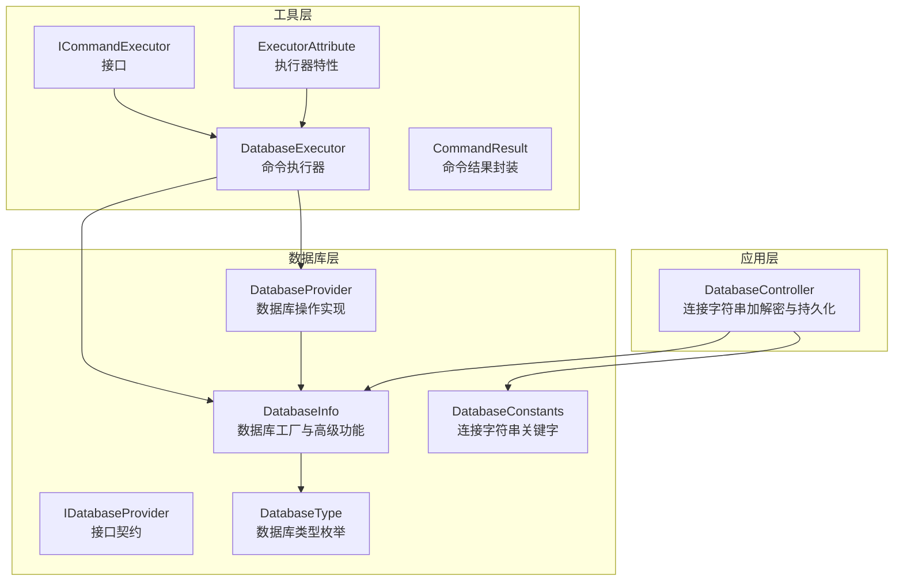
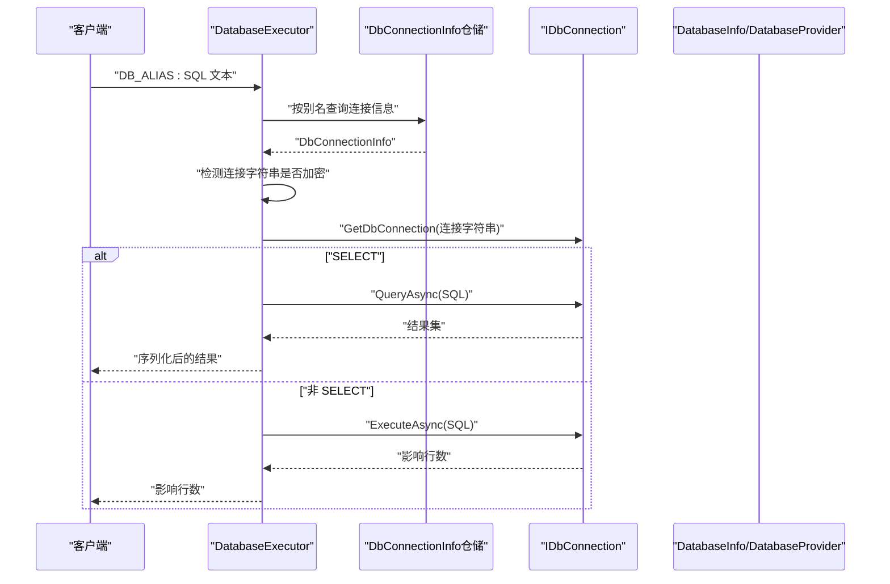
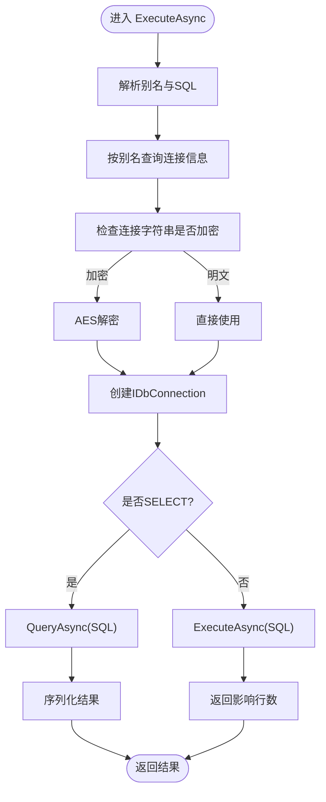
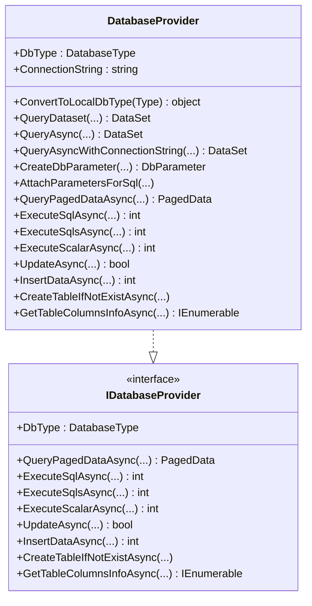
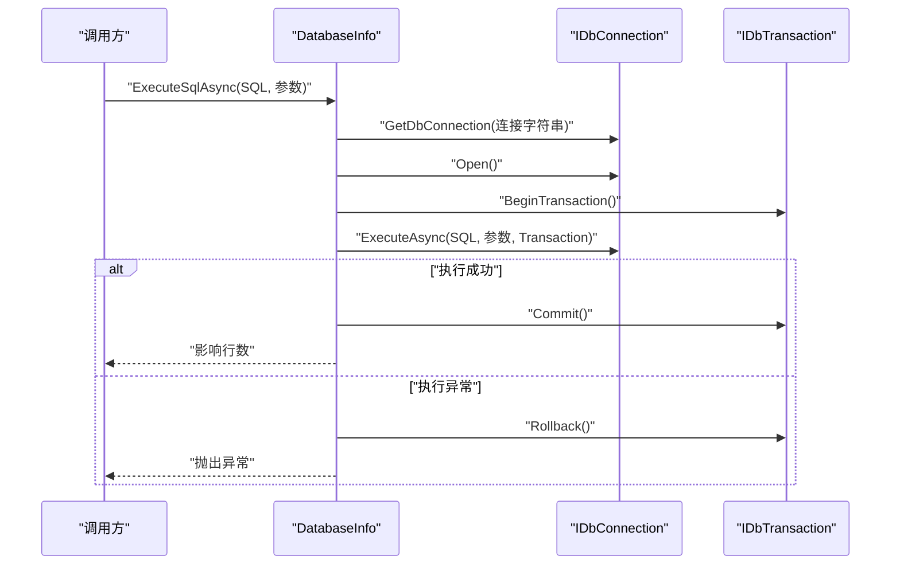
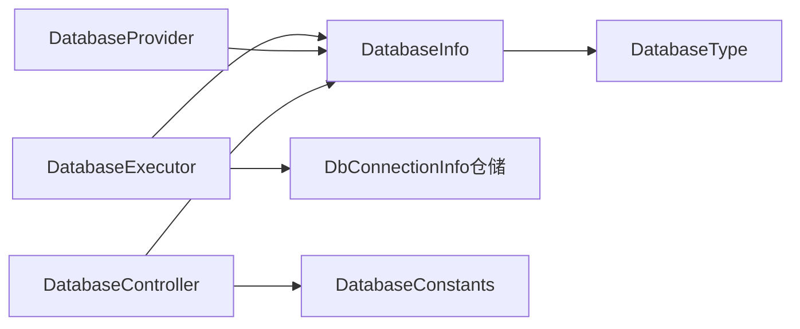

# 数据库执行器

<cite>
**本文档引用的文件**
- [DatabaseExecutor.cs](file://Sylas.RemoteTasks.Utils/CommandExecutor/DatabaseExecutor.cs)
- [DatabaseProvider.cs](file://Sylas.RemoteTasks.Database/DatabaseProvider.cs)
- [DatabaseInfo.cs](file://Sylas.RemoteTasks.Database/SyncBase/DatabaseInfo.cs)
- [IDatabaseProvider.cs](file://Sylas.RemoteTasks.Database/IDatabaseProvider.cs)
- [DatabaseType.cs](file://Sylas.RemoteTasks.Database/SyncBase/DatabaseType.cs)
- [DatabaseConstants.cs](file://Sylas.RemoteTasks.Utils/Constants/DatabaseConstants.cs)
- [ICommandExecutor.cs](file://Sylas.RemoteTasks.Utils/CommandExecutor/ICommandExecutor.cs)
- [ExecutorAttribute.cs](file://Sylas.RemoteTasks.Utils/CommandExecutor/ExecutorAttribute.cs)
- [CommandResult.cs](file://Sylas.RemoteTasks.Utils/CommandExecutor/CommandResult.cs)
- [DatabaseController.cs](file://Sylas.RemoteTasks.App/Controllers/DatabaseController.cs)
- [SecurityTest.cs](file://Sylas.RemoteTasks.Test/Database/SecurityTest.cs)
- [QueryConditionBuilderTest.cs](file://Sylas.RemoteTasks.Test/Database/QueryConditionBuilderTest.cs)
</cite>

## 目录
1. [简介](#简介)
2. [项目结构](#项目结构)
3. [核心组件](#核心组件)
4. [架构总览](#架构总览)
5. [详细组件分析](#详细组件分析)
6. [依赖关系分析](#依赖关系分析)
7. [性能考虑](#性能考虑)
8. [故障排除指南](#故障排除指南)
9. [结论](#结论)
10. [附录](#附录)

## 简介
本文件面向“数据库执行器”的技术文档，系统性阐述 DatabaseExecutor 类的数据库操作能力与实现细节，涵盖连接管理、SQL 执行、事务处理、批量操作、参数化查询、数据类型映射、异常处理、元数据获取、表结构查询、索引管理、备份与恢复、跨库同步等高级功能。文档同时给出连接字符串配置、连接池优化、SQL 注入防护、性能优化建议与错误恢复策略，帮助开发者在不同数据库类型（MySql、SqlServer、Oracle、PostgreSQL、Sqlite、达梦）下安全高效地执行数据库操作。

## 项目结构
数据库执行器位于 Utils 层的 CommandExecutor 命名空间中，配合 Database 层的 DatabaseInfo、DatabaseProvider、IDatabaseProvider 等组件，形成统一的数据库访问与执行框架。应用层控制器负责连接字符串的加解密与持久化，测试层提供多数据库连接字符串的验证与功能测试。

图表来源
- [DatabaseExecutor.cs](file://Sylas.RemoteTasks.Utils/CommandExecutor/DatabaseExecutor.cs#L1-L84)
- [DatabaseProvider.cs](file://Sylas.RemoteTasks.Database/DatabaseProvider.cs#L1-L485)
- [DatabaseInfo.cs](file://Sylas.RemoteTasks.Database/SyncBase/DatabaseInfo.cs#L1-L4195)
- [IDatabaseProvider.cs](file://Sylas.RemoteTasks.Database/IDatabaseProvider.cs#L1-L99)
- [DatabaseType.cs](file://Sylas.RemoteTasks.Database/SyncBase/DatabaseType.cs#L1-L38)
- [DatabaseConstants.cs](file://Sylas.RemoteTasks.Utils/Constants/DatabaseConstants.cs#L1-L14)
- [ICommandExecutor.cs](file://Sylas.RemoteTasks.Utils/CommandExecutor/ICommandExecutor.cs#L1-L73)
- [ExecutorAttribute.cs](file://Sylas.RemoteTasks.Utils/CommandExecutor/ExecutorAttribute.cs#L1-L25)
- [CommandResult.cs](file://Sylas.RemoteTasks.Utils/CommandExecutor/CommandResult.cs#L1-L37)
- [DatabaseController.cs](file://Sylas.RemoteTasks.App/Controllers/DatabaseController.cs#L46-L75)

章节来源
- [DatabaseExecutor.cs](file://Sylas.RemoteTasks.Utils/CommandExecutor/DatabaseExecutor.cs#L1-L84)
- [DatabaseProvider.cs](file://Sylas.RemoteTasks.Database/DatabaseProvider.cs#L1-L485)
- [DatabaseInfo.cs](file://Sylas.RemoteTasks.Database/SyncBase/DatabaseInfo.cs#L1-L4195)
- [IDatabaseProvider.cs](file://Sylas.RemoteTasks.Database/IDatabaseProvider.cs#L1-L99)
- [DatabaseType.cs](file://Sylas.RemoteTasks.Database/SyncBase/DatabaseType.cs#L1-L38)
- [DatabaseConstants.cs](file://Sylas.RemoteTasks.Utils/Constants/DatabaseConstants.cs#L1-L14)
- [ICommandExecutor.cs](file://Sylas.RemoteTasks.Utils/CommandExecutor/ICommandExecutor.cs#L1-L73)
- [ExecutorAttribute.cs](file://Sylas.RemoteTasks.Utils/CommandExecutor/ExecutorAttribute.cs#L1-L25)
- [CommandResult.cs](file://Sylas.RemoteTasks.Utils/CommandExecutor/CommandResult.cs#L1-L37)
- [DatabaseController.cs](file://Sylas.RemoteTasks.App/Controllers/DatabaseController.cs#L46-L75)

## 核心组件
- DatabaseExecutor：命令执行器，支持按别名选择目标数据库，自动识别明文/加密连接字符串，执行 SELECT/INSERT/UPDATE/DELETE 等 SQL 并返回结果。
- DatabaseProvider：基于 SqlClientFactory 的传统 ADO.NET 实现，提供参数化查询、分页查询、动态更新、批量插入、表结构查询等能力。
- DatabaseInfo：数据库工厂与高级功能实现，支持多数据库类型、连接字符串解析、事务执行、备份/恢复、跨库同步、批量导入导出、动态建表等。
- IDatabaseProvider：数据库操作接口契约，统一对外暴露查询、执行、更新、插入、建表、列信息等能力。
- DatabaseType：数据库类型枚举，覆盖 MySql、SqlServer、Oracle、PostgreSQL、Sqlite、达梦、MsSqlLocalDb。
- DatabaseConstants：连接字符串关键字常量，用于判断连接字符串是否已加密。
- ICommandExecutor、ExecutorAttribute、CommandResult：命令执行器接口与特性，以及命令结果封装。

章节来源
- [DatabaseExecutor.cs](file://Sylas.RemoteTasks.Utils/CommandExecutor/DatabaseExecutor.cs#L1-L84)
- [DatabaseProvider.cs](file://Sylas.RemoteTasks.Database/DatabaseProvider.cs#L1-L485)
- [DatabaseInfo.cs](file://Sylas.RemoteTasks.Database/SyncBase/DatabaseInfo.cs#L1-L4195)
- [IDatabaseProvider.cs](file://Sylas.RemoteTasks.Database/IDatabaseProvider.cs#L1-L99)
- [DatabaseType.cs](file://Sylas.RemoteTasks.Database/SyncBase/DatabaseType.cs#L1-L38)
- [DatabaseConstants.cs](file://Sylas.RemoteTasks.Utils/Constants/DatabaseConstants.cs#L1-L14)
- [ICommandExecutor.cs](file://Sylas.RemoteTasks.Utils/CommandExecutor/ICommandExecutor.cs#L1-L73)
- [ExecutorAttribute.cs](file://Sylas.RemoteTasks.Utils/CommandExecutor/ExecutorAttribute.cs#L1-L25)
- [CommandResult.cs](file://Sylas.RemoteTasks.Utils/CommandExecutor/CommandResult.cs#L1-L37)

## 架构总览
数据库执行器采用“命令执行器 + 数据库工厂/提供者”的分层设计：
- 命令执行器层：接收命令文本，解析目标数据库别名，定位连接信息，执行 SQL 并返回结果。
- 数据库工厂层：根据连接字符串创建适配的 IDbConnection，解析数据库类型与参数占位符，提供事务与批量操作。
- 数据库提供者层：封装 ADO.NET 与 Dapper 的混合使用，提供参数化查询、分页、动态建表、备份/恢复、同步等高级功能。

图表来源
- [DatabaseExecutor.cs](file://Sylas.RemoteTasks.Utils/CommandExecutor/DatabaseExecutor.cs#L26-L81)
- [DatabaseInfo.cs](file://Sylas.RemoteTasks.Database/SyncBase/DatabaseInfo.cs#L150-L163)
- [DatabaseController.cs](file://Sylas.RemoteTasks.App/Controllers/DatabaseController.cs#L49-L75)

## 详细组件分析

### DatabaseExecutor 组件分析
- 命令格式：以“DB_ALIAS: SQL”开头，解析别名并查询目标连接信息。
- 连接字符串处理：若连接字符串包含特定关键字，则视为明文；否则进行 AES 解密后再使用。
- SQL 执行：对 SELECT 语句返回序列化结果，对非 SELECT 语句返回影响行数；异常捕获并返回错误消息。
- 适用场景：快速执行单条 SQL、调试与运维场景下的临时查询与变更。

图表来源
- [DatabaseExecutor.cs](file://Sylas.RemoteTasks.Utils/CommandExecutor/DatabaseExecutor.cs#L26-L81)

章节来源
- [DatabaseExecutor.cs](file://Sylas.RemoteTasks.Utils/CommandExecutor/DatabaseExecutor.cs#L1-L84)
- [DatabaseController.cs](file://Sylas.RemoteTasks.App/Controllers/DatabaseController.cs#L49-L75)
- [DatabaseConstants.cs](file://Sylas.RemoteTasks.Utils/Constants/DatabaseConstants.cs#L1-L14)

### DatabaseProvider 组件分析
- 参数化查询：提供 CreateDbParameter 与 AttachParametersForSql，支持字符串与非字符串参数的差异化处理。
- 分页查询：基于 DatabaseInfo 的分页 SQL 生成，返回 PagedData<T> 结果。
- 动态更新：根据表结构推断字段类型，自动转换参数值，生成动态 UPDATE 语句。
- 批量插入：将数据分批生成批量 INSERT 语句，提升写入性能。
- 表结构与列信息：提供 GetTableColumnsInfoAsync 获取列元数据，支持后续动态建表与类型转换。

图表来源
- [DatabaseProvider.cs](file://Sylas.RemoteTasks.Database/DatabaseProvider.cs#L1-L485)
- [IDatabaseProvider.cs](file://Sylas.RemoteTasks.Database/IDatabaseProvider.cs#L1-L99)

章节来源
- [DatabaseProvider.cs](file://Sylas.RemoteTasks.Database/DatabaseProvider.cs#L1-L485)
- [IDatabaseProvider.cs](file://Sylas.RemoteTasks.Database/IDatabaseProvider.cs#L1-L99)

### DatabaseInfo 组件分析
- 连接工厂：根据连接字符串自动识别数据库类型，创建对应 IDbConnection。
- 事务执行：统一在 ExecuteSqlAsync/ExecuteSqlsAsync 中开启事务，异常回滚，成功提交。
- 备份/恢复：支持按表或条件备份数据，按批次读取与写入，支持条件解析与类型转换。
- 同步迁移：支持跨库同步，按主键去重，批量插入，异步并行加速。
- 动态建表：根据列信息生成建表语句，自动判断表是否存在并创建。
- 元数据：提供表列信息、主键、类型映射等，支撑动态更新与类型转换。

图表来源
- [DatabaseInfo.cs](file://Sylas.RemoteTasks.Database/SyncBase/DatabaseInfo.cs#L372-L400)

章节来源
- [DatabaseInfo.cs](file://Sylas.RemoteTasks.Database/SyncBase/DatabaseInfo.cs#L1-L4195)

### 支持的数据库类型与连接字符串配置
- 支持类型：MySql、SqlServer、Oracle、PostgreSQL、Sqlite、达梦、MsSqlLocalDb。
- 连接字符串关键字：通过 DatabaseConstants.ConnectionStringKeywords 判断是否为明文连接字符串。
- 应用层控制器：对新增/更新的连接字符串进行 AES 加密存储，确保敏感信息安全。

章节来源
- [DatabaseType.cs](file://Sylas.RemoteTasks.Database/SyncBase/DatabaseType.cs#L1-L38)
- [DatabaseConstants.cs](file://Sylas.RemoteTasks.Utils/Constants/DatabaseConstants.cs#L1-L14)
- [DatabaseController.cs](file://Sylas.RemoteTasks.App/Controllers/DatabaseController.cs#L49-L75)

### SQL 注入防护与参数化查询
- 参数化查询：DatabaseProvider 使用 DbParameter 与 AttachParametersForSql，避免字符串拼接引发注入风险。
- 占位符适配：DatabaseInfo 根据数据库类型返回参数占位符（如 Oracle/达梦使用冒号），并在执行前替换参数符号。
- 条件解析：备份/恢复模块对查询条件进行解析与参数化，避免危险关键字与直接拼接。

章节来源
- [DatabaseProvider.cs](file://Sylas.RemoteTasks.Database/DatabaseProvider.cs#L266-L327)
- [DatabaseInfo.cs](file://Sylas.RemoteTasks.Database/SyncBase/DatabaseInfo.cs#L374-L377)
- [DatabaseInfo.cs](file://Sylas.RemoteTasks.Database/SyncBase/DatabaseInfo.cs#L950-L990)

### 数据类型映射与动态更新
- 类型映射：DatabaseProvider.ConvertToLocalDbType 将 C# 类型映射到 SQL Server 对应 SqlDbType。
- 动态转换：DatabaseInfo.GetTableFieldsConverterAsync 获取表字段的字符串到目标类型的转换器，用于动态更新与批量插入时的类型转换。
- 时间字段：自动为创建/更新时间字段赋值，保证数据一致性。

章节来源
- [DatabaseProvider.cs](file://Sylas.RemoteTasks.Database/DatabaseProvider.cs#L52-L72)
- [DatabaseInfo.cs](file://Sylas.RemoteTasks.Database/SyncBase/DatabaseInfo.cs#L523-L549)
- [DatabaseInfo.cs](file://Sylas.RemoteTasks.Database/SyncBase/DatabaseInfo.cs#L1600-L1667)

### 事务处理与批量操作
- 事务：DatabaseInfo 在执行增删改时统一开启事务，异常回滚，成功提交，保障一致性。
- 批量：DatabaseInfo 支持批量插入、批量删除、跨库同步的批量 SQL 生成与执行，结合事务确保原子性。
- 并发：同步迁移支持异步并行与队列控制，平衡吞吐与资源占用。

章节来源
- [DatabaseInfo.cs](file://Sylas.RemoteTasks.Database/SyncBase/DatabaseInfo.cs#L386-L400)
- [DatabaseInfo.cs](file://Sylas.RemoteTasks.Database/SyncBase/DatabaseInfo.cs#L417-L432)
- [DatabaseInfo.cs](file://Sylas.RemoteTasks.Database/SyncBase/DatabaseInfo.cs#L2062-L2184)
- [DatabaseInfo.cs](file://Sylas.RemoteTasks.Database/SyncBase/DatabaseInfo.cs#L2195-L2394)

### 元数据获取、表结构查询与索引管理
- 表列信息：GetTableColumnsInfoAsync 获取列元数据，支持后续动态建表与类型转换。
- 主键识别：通过 IsPK 标记识别主键字段，用于动态更新与批量删除。
- 索引管理：当前实现聚焦于列信息与建表，索引管理可通过扩展方法实现（建议在业务层封装）。

章节来源
- [DatabaseInfo.cs](file://Sylas.RemoteTasks.Database/SyncBase/DatabaseInfo.cs#L523-L549)
- [DatabaseInfo.cs](file://Sylas.RemoteTasks.Database/SyncBase/DatabaseInfo.cs#L673-L713)

### 备份与恢复、跨库同步
- 备份：按表或条件备份，逐行读取并写入文件，保留字段定义与数据。
- 恢复：读取备份文件，解析字段与数据，按批次插入目标库。
- 同步：支持跨库同步，按主键去重，批量插入，异步并行加速。

章节来源
- [DatabaseInfo.cs](file://Sylas.RemoteTasks.Database/SyncBase/DatabaseInfo.cs#L863-L941)
- [DatabaseInfo.cs](file://Sylas.RemoteTasks.Database/SyncBase/DatabaseInfo.cs#L1030-L1184)
- [DatabaseInfo.cs](file://Sylas.RemoteTasks.Database/SyncBase/DatabaseInfo.cs#L1247-L1306)

### 实际使用示例（路径指引）
- 执行单条 SQL（命令执行器）：参考 [DatabaseExecutor.cs](file://Sylas.RemoteTasks.Utils/CommandExecutor/DatabaseExecutor.cs#L26-L81)
- 分页查询（DatabaseProvider）：参考 [DatabaseProvider.cs](file://Sylas.RemoteTasks.Database/DatabaseProvider.cs#L337-L370)
- 动态更新（DatabaseInfo）：参考 [DatabaseInfo.cs](file://Sylas.RemoteTasks.Database/SyncBase/DatabaseInfo.cs#L559-L663)
- 批量插入（DatabaseInfo）：参考 [DatabaseInfo.cs](file://Sylas.RemoteTasks.Database/SyncBase/DatabaseInfo.cs#L1531-L1700)
- 备份/恢复（DatabaseInfo）：参考 [DatabaseInfo.cs](file://Sylas.RemoteTasks.Database/SyncBase/DatabaseInfo.cs#L863-L941), [DatabaseInfo.cs](file://Sylas.RemoteTasks.Database/SyncBase/DatabaseInfo.cs#L1030-L1184)
- 跨库同步（DatabaseInfo）：参考 [DatabaseInfo.cs](file://Sylas.RemoteTasks.Database/SyncBase/DatabaseInfo.cs#L1247-L1306)

## 依赖关系分析
- DatabaseExecutor 依赖 DatabaseInfo 与连接信息仓储，通过别名解析连接字符串并执行 SQL。
- DatabaseProvider 依赖 DatabaseInfo 的分页 SQL 生成与参数占位符适配。
- DatabaseInfo 依赖多种数据库驱动（MySql、SqlServer、Oracle、PostgreSQL、Sqlite、达梦），通过反射式工厂创建连接。
- 应用层控制器负责连接字符串的加解密与持久化，确保安全性。

图表来源
- [DatabaseExecutor.cs](file://Sylas.RemoteTasks.Utils/CommandExecutor/DatabaseExecutor.cs#L1-L84)
- [DatabaseProvider.cs](file://Sylas.RemoteTasks.Database/DatabaseProvider.cs#L1-L485)
- [DatabaseInfo.cs](file://Sylas.RemoteTasks.Database/SyncBase/DatabaseInfo.cs#L1-L4195)
- [DatabaseType.cs](file://Sylas.RemoteTasks.Database/SyncBase/DatabaseType.cs#L1-L38)
- [DatabaseConstants.cs](file://Sylas.RemoteTasks.Utils/Constants/DatabaseConstants.cs#L1-L14)
- [DatabaseController.cs](file://Sylas.RemoteTasks.App/Controllers/DatabaseController.cs#L49-L75)

章节来源
- [DatabaseExecutor.cs](file://Sylas.RemoteTasks.Utils/CommandExecutor/DatabaseExecutor.cs#L1-L84)
- [DatabaseProvider.cs](file://Sylas.RemoteTasks.Database/DatabaseProvider.cs#L1-L485)
- [DatabaseInfo.cs](file://Sylas.RemoteTasks.Database/SyncBase/DatabaseInfo.cs#L1-L4195)
- [DatabaseType.cs](file://Sylas.RemoteTasks.Database/SyncBase/DatabaseType.cs#L1-L38)
- [DatabaseConstants.cs](file://Sylas.RemoteTasks.Utils/Constants/DatabaseConstants.cs#L1-L14)
- [DatabaseController.cs](file://Sylas.RemoteTasks.App/Controllers/DatabaseController.cs#L49-L75)

## 性能考虑
- 连接池与连接复用：优先使用连接字符串内置的连接池参数（如 pooling、max pool size），减少连接创建开销。
- 参数化查询：始终使用参数化查询，避免重复编译与注入风险。
- 批量操作：使用 DatabaseInfo 的批量插入与同步功能，合理设置批次大小（默认 1000，针对 SqlServer 可调整为 50），平衡内存与吞吐。
- 异步并行：跨库同步支持异步并行与队列控制，避免阻塞与资源争用。
- 事务边界：将多条相关操作包裹在事务内，减少中间状态，提高一致性与性能。

## 故障排除指南
- 连接字符串错误：检查连接字符串关键字与加密状态，确保明文/加密一致。
- 参数占位符问题：Oracle/达梦需使用冒号占位符，DatabaseInfo 会在执行前自动替换。
- 事务异常：异常时自动回滚，检查 SQL 语法与权限；确认数据库支持事务。
- 备份/恢复失败：检查备份目录权限与磁盘空间，确认表结构与数据格式正确。
- 同步卡顿：监控队列长度与网络延迟，适当调整批次大小与并行度。

章节来源
- [DatabaseInfo.cs](file://Sylas.RemoteTasks.Database/SyncBase/DatabaseInfo.cs#L374-L377)
- [DatabaseInfo.cs](file://Sylas.RemoteTasks.Database/SyncBase/DatabaseInfo.cs#L386-L400)
- [DatabaseInfo.cs](file://Sylas.RemoteTasks.Database/SyncBase/DatabaseInfo.cs#L1065-L1068)
- [DatabaseInfo.cs](file://Sylas.RemoteTasks.Database/SyncBase/DatabaseInfo.cs#L2300-L2318)

## 结论
DatabaseExecutor 与 DatabaseInfo/DatabaseProvider 共同构成了一个功能完备、安全可靠的数据库执行与管理框架。通过参数化查询、事务控制、批量操作与跨库同步等能力，满足从日常运维到复杂数据迁移的多样化需求。配合连接字符串加解密与多数据库类型支持，可在不同环境下稳定运行并具备良好的扩展性。

## 附录
- 测试用例参考：
  - 多数据库连接字符串验证：[QueryConditionBuilderTest.cs](file://Sylas.RemoteTasks.Test/Database/QueryConditionBuilderTest.cs#L21-L29)
  - 连接字符串解密展示：[SecurityTest.cs](file://Sylas.RemoteTasks.Test/Database/SecurityTest.cs#L18-L22)