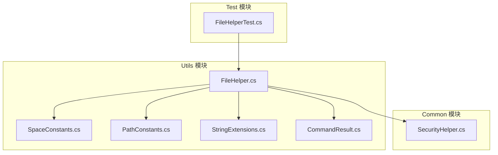
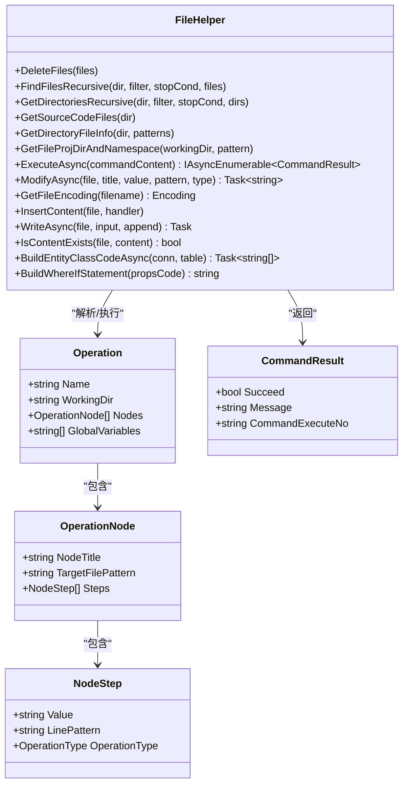
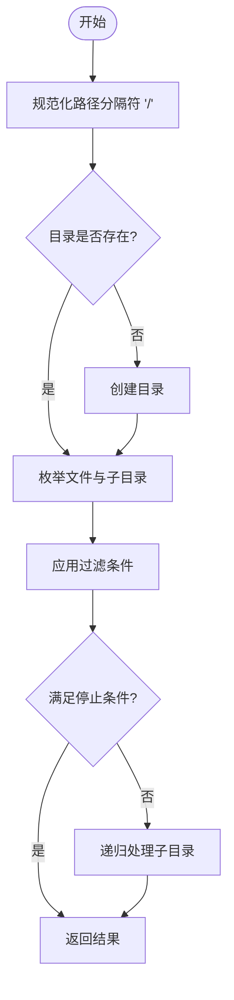
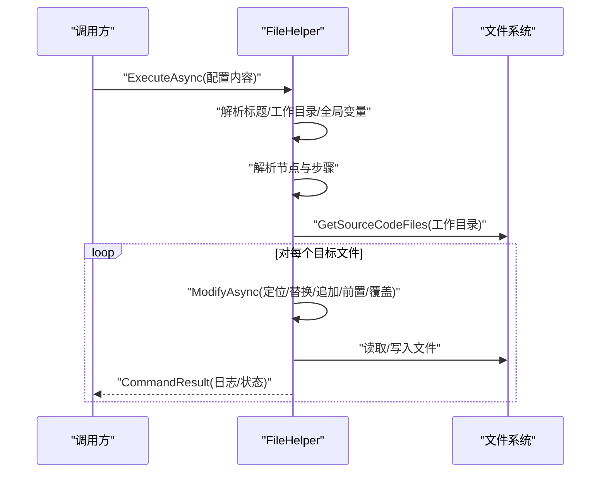
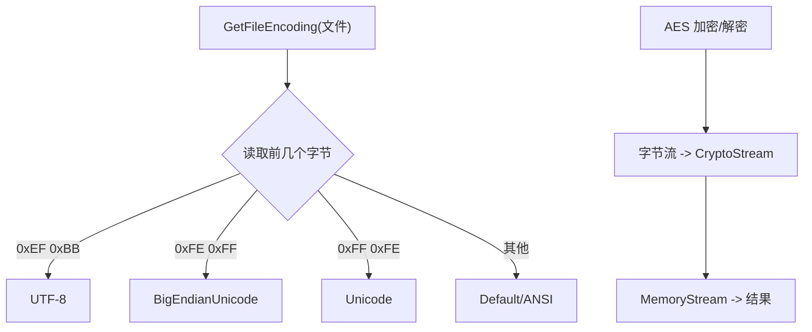
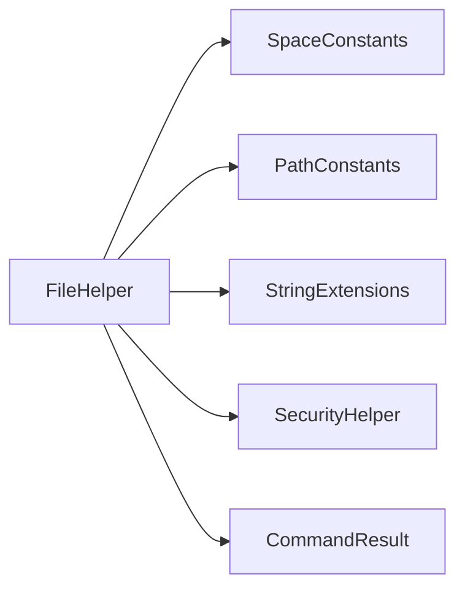

# 文件操作工具

<cite>
**本文档引用的文件**
- [Sylas.RemoteTasks.Utils/CommandExecutor/FileHelper.cs](file://Sylas.RemoteTasks.Utils/CommandExecutor/FileHelper.cs)
- [Sylas.RemoteTasks.Common/Extensions/StringExtensions.cs](file://Sylas.RemoteTasks.Common/Extensions/StringExtensions.cs)
- [Sylas.RemoteTasks.Common/SecurityHelper.cs](file://Sylas.RemoteTasks.Common/SecurityHelper.cs)
- [Sylas.RemoteTasks.Utils/Constants/PathConstants.cs](file://Sylas.RemoteTasks.Utils/Constants/PathConstants.cs)
- [Sylas.RemoteTasks.Utils/Constants/SpaceConstants.cs](file://Sylas.RemoteTasks.Utils/Constants/SpaceConstants.cs)
- [Sylas.RemoteTasks.Utils/CommandExecutor/CommandResult.cs](file://Sylas.RemoteTasks.Utils/CommandExecutor/CommandResult.cs)
- [Sylas.RemoteTasks.Test/FileOp/FileHelperTest.cs](file://Sylas.RemoteTasks.Test/FileOp/FileHelperTest.cs)
</cite>

## 目录
1. [简介](#简介)
2. [项目结构](#项目结构)
3. [核心组件](#核心组件)
4. [架构总览](#架构总览)
5. [详细组件分析](#详细组件分析)
6. [依赖关系分析](#依赖关系分析)
7. [性能考虑](#性能考虑)
8. [故障排查指南](#故障排查指南)
9. [结论](#结论)
10. [附录](#附录)

## 简介
本文件操作工具以 FileHelper 类为核心，提供面向文件系统的高级操作能力，涵盖文件复制、移动、删除、重命名、权限管理、压缩解压、加密解密、MD5 校验、文件监控、跨平台路径处理、字符编码转换、大文件处理优化、文件夹遍历、文件搜索与批量操作等。同时，它内置一套“配置驱动”的自动化文件修改流水线，支持基于模板与变量的批量文件操作，适用于配置文件管理、日志文件处理、备份文件操作等场景。

## 项目结构
- FileHelper 位于 Utils 模块的 CommandExecutor 命名空间下，集中封装文件系统与文本处理能力。
- 与之配套的常量与扩展类分别提供路径、空格、字符串处理等支撑能力。
- 安全模块提供 AES 加密解密能力，可直接用于文件内容保护与敏感信息存储。
- 测试模块包含针对 FileHelper 的测试骨架，便于扩展验证。

**图表来源**
- [Sylas.RemoteTasks.Utils/CommandExecutor/FileHelper.cs](file://Sylas.RemoteTasks.Utils/CommandExecutor/FileHelper.cs#L1-L1657)
- [Sylas.RemoteTasks.Utils/Constants/SpaceConstants.cs](file://Sylas.RemoteTasks.Utils/Constants/SpaceConstants.cs#L1-L50)
- [Sylas.RemoteTasks.Utils/Constants/PathConstants.cs](file://Sylas.RemoteTasks.Utils/Constants/PathConstants.cs#L1-L25)
- [Sylas.RemoteTasks.Common/Extensions/StringExtensions.cs](file://Sylas.RemoteTasks.Common/Extensions/StringExtensions.cs#L1-L374)
- [Sylas.RemoteTasks.Common/SecurityHelper.cs](file://Sylas.RemoteTasks.Common/SecurityHelper.cs#L1-L209)
- [Sylas.RemoteTasks.Utils/CommandExecutor/CommandResult.cs](file://Sylas.RemoteTasks.Utils/CommandExecutor/CommandResult.cs#L1-L38)
- [Sylas.RemoteTasks.Test/FileOp/FileHelperTest.cs](file://Sylas.RemoteTasks.Test/FileOp/FileHelperTest.cs#L1-L21)

**章节来源**
- [Sylas.RemoteTasks.Utils/CommandExecutor/FileHelper.cs](file://Sylas.RemoteTasks.Utils/CommandExecutor/FileHelper.cs#L1-L1657)
- [Sylas.RemoteTasks.Utils/Constants/SpaceConstants.cs](file://Sylas.RemoteTasks.Utils/Constants/SpaceConstants.cs#L1-L50)
- [Sylas.RemoteTasks.Utils/Constants/PathConstants.cs](file://Sylas.RemoteTasks.Utils/Constants/PathConstants.cs#L1-L25)
- [Sylas.RemoteTasks.Common/Extensions/StringExtensions.cs](file://Sylas.RemoteTasks.Common/Extensions/StringExtensions.cs#L1-L374)
- [Sylas.RemoteTasks.Common/SecurityHelper.cs](file://Sylas.RemoteTasks.Common/SecurityHelper.cs#L1-L209)
- [Sylas.RemoteTasks.Utils/CommandExecutor/CommandResult.cs](file://Sylas.RemoteTasks.Utils/CommandExecutor/CommandResult.cs#L1-L38)
- [Sylas.RemoteTasks.Test/FileOp/FileHelperTest.cs](file://Sylas.RemoteTasks.Test/FileOp/FileHelperTest.cs#L1-L21)

## 核心组件
- 文件系统操作：删除、递归查找、目录遍历、路径规范化、跨平台路径处理。
- 文本与配置处理：JSON 读取与紧凑化、正则搜索、模板变量解析、条件分支、批量修改。
- 编码与安全：自动识别文件编码、Base64 编解码、AES 加密解密。
- 大文件与流式处理：异步读写、逐块写入、避免一次性加载。
- 批量与自动化：基于配置的“操作节点”与“步骤”，支持创建、追加、前置、替换、覆盖等操作类型。

**章节来源**
- [Sylas.RemoteTasks.Utils/CommandExecutor/FileHelper.cs](file://Sylas.RemoteTasks.Utils/CommandExecutor/FileHelper.cs#L33-L1506)
- [Sylas.RemoteTasks.Common/SecurityHelper.cs](file://Sylas.RemoteTasks.Common/SecurityHelper.cs#L36-L88)
- [Sylas.RemoteTasks.Common/Extensions/StringExtensions.cs](file://Sylas.RemoteTasks.Common/Extensions/StringExtensions.cs#L298-L308)

## 架构总览
FileHelper 采用“配置驱动 + 模板变量 + 正则定位 + 批量修改”的架构模式，将文件操作抽象为“操作节点（Node）+ 步骤（Step）”的流水线，支持在工作目录内按正则匹配目标文件，再对每条目标文件执行一系列文本级操作。

**图表来源**
- [Sylas.RemoteTasks.Utils/CommandExecutor/FileHelper.cs](file://Sylas.RemoteTasks.Utils/CommandExecutor/FileHelper.cs#L1284-L1490)
- [Sylas.RemoteTasks.Utils/CommandExecutor/CommandResult.cs](file://Sylas.RemoteTasks.Utils/CommandExecutor/CommandResult.cs#L1-L38)

**章节来源**
- [Sylas.RemoteTasks.Utils/CommandExecutor/FileHelper.cs](file://Sylas.RemoteTasks.Utils/CommandExecutor/FileHelper.cs#L1284-L1490)
- [Sylas.RemoteTasks.Utils/CommandExecutor/CommandResult.cs](file://Sylas.RemoteTasks.Utils/CommandExecutor/CommandResult.cs#L1-L38)

## 详细组件分析

### 文件系统与路径处理
- 递归查找与遍历：支持按过滤条件与停止条件控制递归深度；自动忽略常见构建产物目录。
- 跨平台路径：统一将路径分隔符标准化为斜杠，便于正则匹配与跨平台一致性。
- 目录信息与命名空间：根据项目文件推导命名空间，支持批量修改文件命名空间。

**图表来源**
- [Sylas.RemoteTasks.Utils/CommandExecutor/FileHelper.cs](file://Sylas.RemoteTasks.Utils/CommandExecutor/FileHelper.cs#L116-L150)
- [Sylas.RemoteTasks.Utils/CommandExecutor/FileHelper.cs](file://Sylas.RemoteTasks.Utils/CommandExecutor/FileHelper.cs#L159-L198)
- [Sylas.RemoteTasks.Utils/CommandExecutor/FileHelper.cs](file://Sylas.RemoteTasks.Utils/CommandExecutor/FileHelper.cs#L1496-L1506)

**章节来源**
- [Sylas.RemoteTasks.Utils/CommandExecutor/FileHelper.cs](file://Sylas.RemoteTasks.Utils/CommandExecutor/FileHelper.cs#L116-L198)
- [Sylas.RemoteTasks.Utils/CommandExecutor/FileHelper.cs](file://Sylas.RemoteTasks.Utils/CommandExecutor/FileHelper.cs#L1496-L1506)

### 文本与配置处理
- JSON 读取与紧凑化：支持读取 JSON 并去除多余空白，便于比较与存储。
- 正则搜索：支持带命名分组的正则，自动去重并返回字典集合。
- 模板变量与条件：支持全局变量、函数变量、条件分支（IF/ELSE），以及字符串替换链式调用。
- 批量修改：支持在定位行前后追加、前置插入、整段替换、整体覆盖、创建文件等。

**图表来源**
- [Sylas.RemoteTasks.Utils/CommandExecutor/FileHelper.cs](file://Sylas.RemoteTasks.Utils/CommandExecutor/FileHelper.cs#L587-L662)
- [Sylas.RemoteTasks.Utils/CommandExecutor/FileHelper.cs](file://Sylas.RemoteTasks.Utils/CommandExecutor/FileHelper.cs#L1284-L1442)

**章节来源**
- [Sylas.RemoteTasks.Utils/CommandExecutor/FileHelper.cs](file://Sylas.RemoteTasks.Utils/CommandExecutor/FileHelper.cs#L228-L263)
- [Sylas.RemoteTasks.Utils/CommandExecutor/FileHelper.cs](file://Sylas.RemoteTasks.Utils/CommandExecutor/FileHelper.cs#L491-L550)
- [Sylas.RemoteTasks.Utils/CommandExecutor/FileHelper.cs](file://Sylas.RemoteTasks.Utils/CommandExecutor/FileHelper.cs#L587-L662)
- [Sylas.RemoteTasks.Utils/CommandExecutor/FileHelper.cs](file://Sylas.RemoteTasks.Utils/CommandExecutor/FileHelper.cs#L1284-L1442)

### 编码与安全
- 文件编码检测：通过读取文件头部字节判断 UTF-8、大端/小端 Unicode、ASCII 等编码。
- Base64 编解码：提供字符串与字节数组的 Base64 转换。
- AES 加密解密：支持字符串与字节数组的对称加密，密钥与初始化向量可定制。

**图表来源**
- [Sylas.RemoteTasks.Utils/CommandExecutor/FileHelper.cs](file://Sylas.RemoteTasks.Utils/CommandExecutor/FileHelper.cs#L322-L350)
- [Sylas.RemoteTasks.Common/Extensions/StringExtensions.cs](file://Sylas.RemoteTasks.Common/Extensions/StringExtensions.cs#L298-L308)
- [Sylas.RemoteTasks.Common/SecurityHelper.cs](file://Sylas.RemoteTasks.Common/SecurityHelper.cs#L36-L88)

**章节来源**
- [Sylas.RemoteTasks.Utils/CommandExecutor/FileHelper.cs](file://Sylas.RemoteTasks.Utils/CommandExecutor/FileHelper.cs#L322-L350)
- [Sylas.RemoteTasks.Common/Extensions/StringExtensions.cs](file://Sylas.RemoteTasks.Common/Extensions/StringExtensions.cs#L298-L308)
- [Sylas.RemoteTasks.Common/SecurityHelper.cs](file://Sylas.RemoteTasks.Common/SecurityHelper.cs#L36-L88)

### 大文件与流式处理
- 异步读写：使用异步 API 进行文件读取与写入，避免阻塞。
- 逐块写入：在处理网络传输或大文件时，采用分块写入策略，减少内存峰值。
- 长耗时操作记录：在调试模式下输出耗时统计，便于性能分析。

**章节来源**
- [Sylas.RemoteTasks.Utils/CommandExecutor/FileHelper.cs](file://Sylas.RemoteTasks.Utils/CommandExecutor/FileHelper.cs#L294-L300)
- [Sylas.RemoteTasks.Utils/CommandExecutor/FileHelper.cs](file://Sylas.RemoteTasks.Utils/CommandExecutor/FileHelper.cs#L491-L550)

### 文件夹遍历、搜索与批量操作
- 遍历：提供按过滤条件与停止条件的递归遍历，支持目录与文件两套接口。
- 搜索：支持正则表达式匹配与去重，返回结构化结果。
- 批量：通过“操作节点 + 步骤”模型，对多个目标文件执行一致的文本级操作。

**章节来源**
- [Sylas.RemoteTasks.Utils/CommandExecutor/FileHelper.cs](file://Sylas.RemoteTasks.Utils/CommandExecutor/FileHelper.cs#L116-L198)
- [Sylas.RemoteTasks.Utils/CommandExecutor/FileHelper.cs](file://Sylas.RemoteTasks.Utils/CommandExecutor/FileHelper.cs#L491-L550)
- [Sylas.RemoteTasks.Utils/CommandExecutor/FileHelper.cs](file://Sylas.RemoteTasks.Utils/CommandExecutor/FileHelper.cs#L1284-L1442)

### 实际使用示例（场景化）
- 配置文件管理：读取 JSON 配置并紧凑化存储；按正则定位关键字段进行更新。
- 日志文件处理：按模式提取关键信息，去重后输出结构化列表。
- 备份文件操作：在工作目录内批量创建/修改文件，支持覆盖与追加两种模式。

以上示例均可通过“配置驱动”的 ExecuteAsync 流水线完成，具体配置语法与变量解析由 FileHelper 内部解析。

**章节来源**
- [Sylas.RemoteTasks.Utils/CommandExecutor/FileHelper.cs](file://Sylas.RemoteTasks.Utils/CommandExecutor/FileHelper.cs#L228-L263)
- [Sylas.RemoteTasks.Utils/CommandExecutor/FileHelper.cs](file://Sylas.RemoteTasks.Utils/CommandExecutor/FileHelper.cs#L491-L550)
- [Sylas.RemoteTasks.Utils/CommandExecutor/FileHelper.cs](file://Sylas.RemoteTasks.Utils/CommandExecutor/FileHelper.cs#L587-L662)

## 依赖关系分析
- FileHelper 依赖 SpaceConstants 与 PathConstants 提供空格与路径常量，确保跨平台兼容性。
- 字符串扩展提供正则解析、注释移除、Base64 编解码等通用能力。
- 安全模块提供 AES 加密解密，可直接用于文件内容保护。
- CommandResult 作为统一结果载体，便于上层调用方处理执行状态与日志。

**图表来源**
- [Sylas.RemoteTasks.Utils/CommandExecutor/FileHelper.cs](file://Sylas.RemoteTasks.Utils/CommandExecutor/FileHelper.cs#L1-L1657)
- [Sylas.RemoteTasks.Utils/Constants/SpaceConstants.cs](file://Sylas.RemoteTasks.Utils/Constants/SpaceConstants.cs#L1-L50)
- [Sylas.RemoteTasks.Utils/Constants/PathConstants.cs](file://Sylas.RemoteTasks.Utils/Constants/PathConstants.cs#L1-L25)
- [Sylas.RemoteTasks.Common/Extensions/StringExtensions.cs](file://Sylas.RemoteTasks.Common/Extensions/StringExtensions.cs#L1-L374)
- [Sylas.RemoteTasks.Common/SecurityHelper.cs](file://Sylas.RemoteTasks.Common/SecurityHelper.cs#L1-L209)
- [Sylas.RemoteTasks.Utils/CommandExecutor/CommandResult.cs](file://Sylas.RemoteTasks.Utils/CommandExecutor/CommandResult.cs#L1-L38)

**章节来源**
- [Sylas.RemoteTasks.Utils/CommandExecutor/FileHelper.cs](file://Sylas.RemoteTasks.Utils/CommandExecutor/FileHelper.cs#L1-L1657)
- [Sylas.RemoteTasks.Utils/Constants/SpaceConstants.cs](file://Sylas.RemoteTasks.Utils/Constants/SpaceConstants.cs#L1-L50)
- [Sylas.RemoteTasks.Utils/Constants/PathConstants.cs](file://Sylas.RemoteTasks.Utils/Constants/PathConstants.cs#L1-L25)
- [Sylas.RemoteTasks.Common/Extensions/StringExtensions.cs](file://Sylas.RemoteTasks.Common/Extensions/StringExtensions.cs#L1-L374)
- [Sylas.RemoteTasks.Common/SecurityHelper.cs](file://Sylas.RemoteTasks.Common/SecurityHelper.cs#L1-L209)
- [Sylas.RemoteTasks.Utils/CommandExecutor/CommandResult.cs](file://Sylas.RemoteTasks.Utils/CommandExecutor/CommandResult.cs#L1-L38)

## 性能考虑
- 异步 I/O：优先使用异步读写 API，降低阻塞风险，提升吞吐。
- 正则匹配：对大文件搜索时，尽量缩小匹配范围与使用更精确的正则，避免回溯风暴。
- 流式处理：对超大文件采用分块读写，避免一次性加载至内存。
- 递归控制：通过过滤条件与停止条件限制遍历规模，必要时仅在特定子树内搜索。
- 日志与计时：在调试阶段记录耗时，便于定位瓶颈。

[本节为通用指导，不直接分析具体文件]

## 故障排查指南
- 文件编码异常：使用编码检测函数确认文件编码，必要时以相应编码读取。
- 正则未匹配：检查目标文件路径是否已标准化为斜杠；核对正则表达式与大小写敏感设置。
- 模板变量解析失败：确认变量键名拼写正确，函数变量返回值类型受支持。
- 权限问题：在 Linux/macOS 上注意文件权限与目录访问权限；Windows 上注意 UAC 与路径权限。
- 大文件写入异常：检查磁盘空间与写入缓冲区，确保分块写入逻辑完整执行。

**章节来源**
- [Sylas.RemoteTasks.Utils/CommandExecutor/FileHelper.cs](file://Sylas.RemoteTasks.Utils/CommandExecutor/FileHelper.cs#L322-L350)
- [Sylas.RemoteTasks.Utils/CommandExecutor/FileHelper.cs](file://Sylas.RemoteTasks.Utils/CommandExecutor/FileHelper.cs#L1061-L1138)

## 结论
FileHelper 通过“配置驱动 + 模板变量 + 正则定位 + 批量修改”的设计，将复杂的文件系统操作抽象为可维护、可扩展的流水线。结合编码检测、Base64/AES 安全能力与跨平台路径处理，能够高效应对配置管理、日志处理与备份等实际场景。建议在生产环境中配合异步 I/O、流式处理与严格的权限控制，确保稳定性与性能。

[本节为总结，不直接分析具体文件]

## 附录
- 常用操作类型（OperationType）：Append、Prepend、Replace、Override、Create。
- 关键流程：ExecuteAsync → 解析配置 → 解析变量 → 定位文件 → 修改内容 → 写回文件 → 输出日志。
- 测试入口：FileHelperTest 提供测试基座，可用于扩展具体用例。

**章节来源**
- [Sylas.RemoteTasks.Utils/CommandExecutor/FileHelper.cs](file://Sylas.RemoteTasks.Utils/CommandExecutor/FileHelper.cs#L1443-L1450)
- [Sylas.RemoteTasks.Test/FileOp/FileHelperTest.cs](file://Sylas.RemoteTasks.Test/FileOp/FileHelperTest.cs#L1-L21)