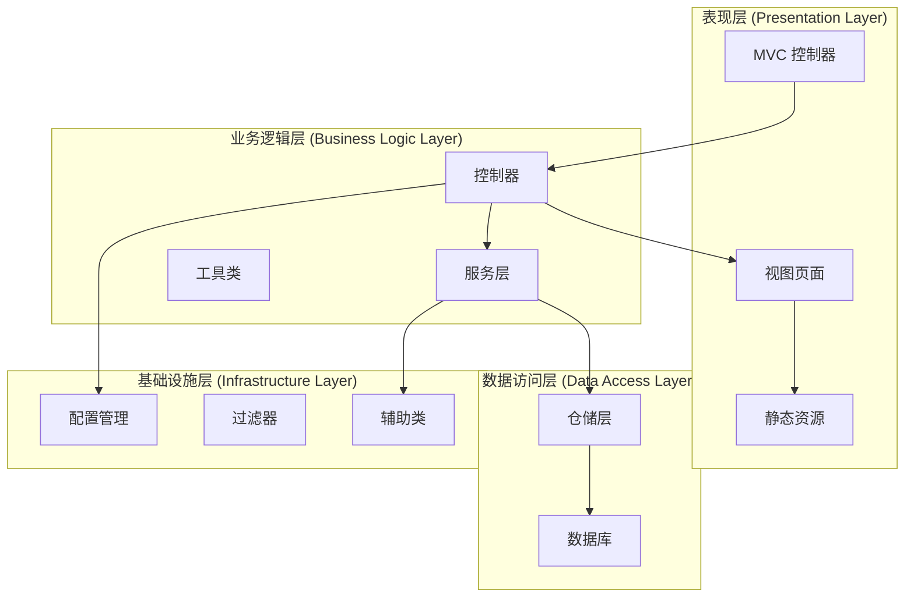
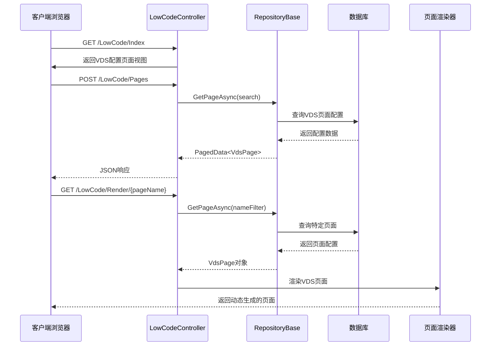
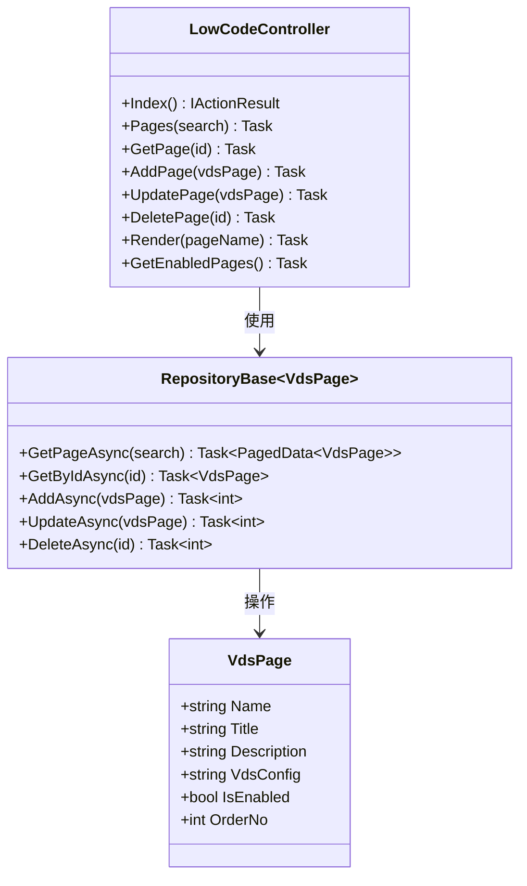
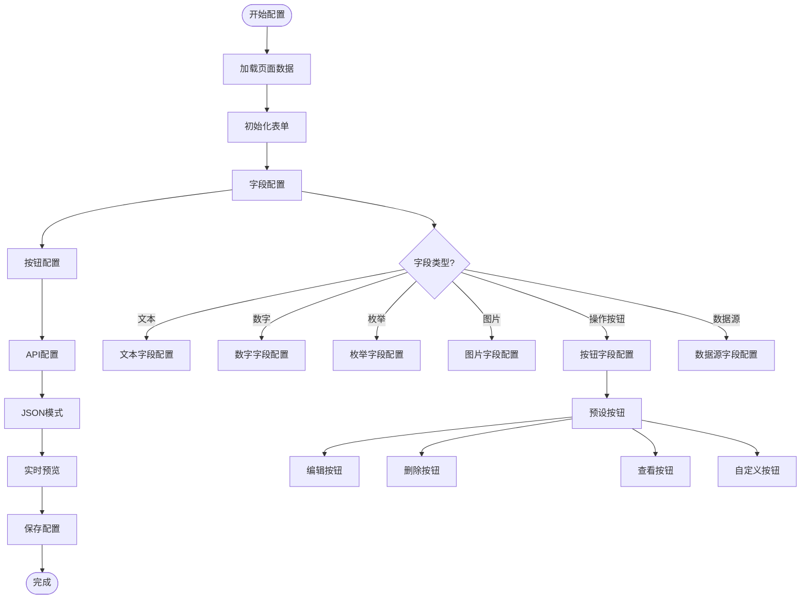
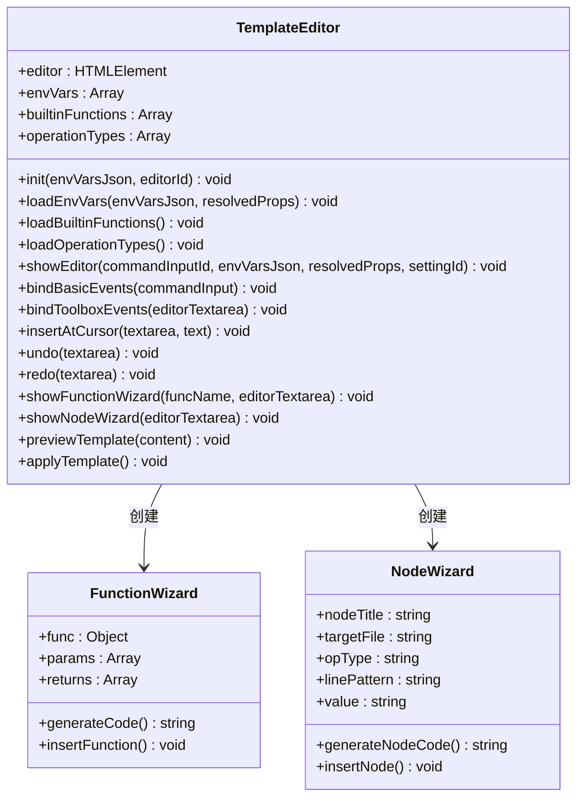
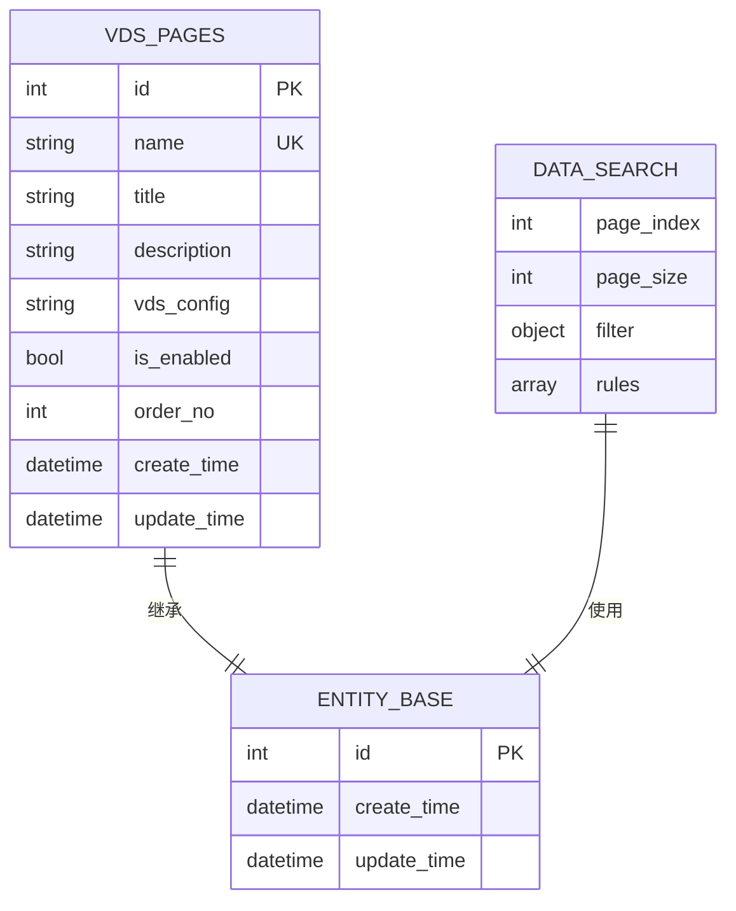
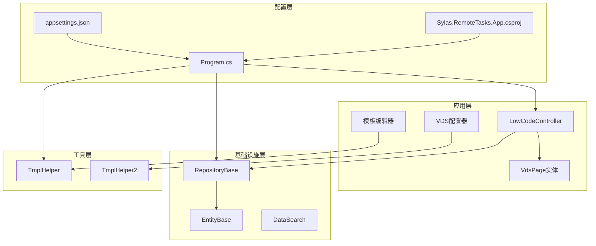

# 可视化模板编辑器系统

<cite>
**本文档引用的文件**
- [LowCodeController.cs](file://Sylas.RemoteTasks.App/Controllers/LowCodeController.cs)
- [VdsPage.cs](file://Sylas.RemoteTasks.App/LowCode/VdsPage.cs)
- [template-editor.js](file://Sylas.RemoteTasks.App/wwwroot/js/template-editor.js)
- [vds-configurator.js](file://Sylas.RemoteTasks.App/wwwroot/js/vds-configurator.js)
- [Index.cshtml](file://Sylas.RemoteTasks.App/Views/LowCode/Index.cshtml)
- [Render.cshtml](file://Sylas.RemoteTasks.App/Views/LowCode/Render.cshtml)
- [RepositoryBase.cs](file://Sylas.RemoteTasks.App/Infrastructure/RepositoryBase.cs)
- [DataSearch.cs](file://Sylas.RemoteTasks.Database/SyncBase/DataSearch.cs)
- [EntityBase.cs](file://Sylas.RemoteTasks.App/Database/EntityBase.cs)
- [Program.cs](file://Sylas.RemoteTasks.App/Program.cs)
- [appsettings.json](file://Sylas.RemoteTasks.App/appsettings.json)
- [Sylas.RemoteTasks.App.csproj](file://Sylas.RemoteTasks.App/Sylas.RemoteTasks.App.csproj)
- [TmplHelper.cs](file://Sylas.RemoteTasks.Utils/Template/TmplHelper.cs)
- [TmplHelper2.cs](file://Sylas.RemoteTasks.Utils/Template/TmplHelper2.cs)
</cite>

## 目录
1. [简介](#简介)
2. [项目结构](#项目结构)
3. [核心组件](#核心组件)
4. [架构概览](#架构概览)
5. [详细组件分析](#详细组件分析)
6. [依赖关系分析](#依赖关系分析)
7. [性能考虑](#性能考虑)
8. [故障排除指南](#故障排除指南)
9. [结论](#结论)

## 简介

可视化模板编辑器系统是一个基于ASP.NET Core开发的低代码平台，专门用于创建和管理可视化数据表格页面。该系统提供了强大的模板编辑功能，允许用户通过可视化的界面设计数据表格的布局、字段配置和交互逻辑。

系统的核心特性包括：
- **可视化VDS配置器**：提供直观的图形界面来配置数据表格的各种属性
- **模板编辑器**：支持复杂的模板语法和变量替换
- **动态页面渲染**：根据配置动态生成可交互的数据表格页面
- **多数据库支持**：通过统一的仓储层支持多种数据库类型
- **实时预览功能**：编辑器提供实时的模板预览和验证

## 项目结构

该项目采用典型的三层架构设计，主要分为以下层次：



**图表来源**
- [Program.cs:1-122](file://Sylas.RemoteTasks.App/Program.cs#L1-L122)
- [Sylas.RemoteTasks.App.csproj:1-61](file://Sylas.RemoteTasks.App/Sylas.RemoteTasks.App.csproj#L1-L61)

**章节来源**
- [Program.cs:1-122](file://Sylas.RemoteTasks.App/Program.cs#L1-L122)
- [Sylas.RemoteTasks.App.csproj:1-61](file://Sylas.RemoteTasks.App/Sylas.RemoteTasks.App.csproj#L1-L61)

## 核心组件

### VDS页面管理系统

VDS（Visual Data Sheet）页面是系统的核心概念，代表一个完整的数据表格页面配置。每个VDS页面包含以下关键属性：

| 属性名 | 类型 | 描述 | 默认值 |
|--------|------|------|--------|
| Name | string | 页面唯一标识符，用于URL路由 | 空字符串 |
| Title | string | 页面显示标题 | 空字符串 |
| Description | string | 页面功能描述 | 空字符串 |
| VdsConfig | string | VDS配置JSON，包含apiUrl、ths、modalSettings等 | "{}" |
| IsEnabled | bool | 页面是否启用 | true |
| OrderNo | int | 页面排序号 | 0 |

### 模板编辑器引擎

系统提供了两个主要的模板编辑器：

1. **可视化模板编辑器** (`TemplateEditor`)
   - 支持环境变量和内置函数的智能提示
   - 提供操作类型（Create、Override、Append、Prepend、Replace）
   - 支持条件语法和循环语法
   - 具备撤销/重做功能

2. **VDS可视化配置器** (`VdsConfigurator`)
   - 专门用于配置VDS页面的字段和行为
   - 支持多种字段类型（文本、数字、枚举、图片、媒体等）
   - 提供按钮配置向导
   - 支持自定义操作配置

**章节来源**
- [VdsPage.cs:1-64](file://Sylas.RemoteTasks.App/LowCode/VdsPage.cs#L1-L64)
- [template-editor.js:1-800](file://Sylas.RemoteTasks.App/wwwroot/js/template-editor.js#L1-L800)
- [vds-configurator.js:1-800](file://Sylas.RemoteTasks.App/wwwroot/js/vds-configurator.js#L1-L800)

## 架构概览

系统采用现代化的ASP.NET Core架构，结合前后端分离的设计理念：



**图表来源**
- [LowCodeController.cs:1-163](file://Sylas.RemoteTasks.App/Controllers/LowCodeController.cs#L1-L163)
- [RepositoryBase.cs:1-233](file://Sylas.RemoteTasks.App/Infrastructure/RepositoryBase.cs#L1-L233)

**章节来源**
- [LowCodeController.cs:1-163](file://Sylas.RemoteTasks.App/Controllers/LowCodeController.cs#L1-L163)
- [RepositoryBase.cs:1-233](file://Sylas.RemoteTasks.App/Infrastructure/RepositoryBase.cs#L1-L233)

## 详细组件分析

### 低代码控制器 (LowCodeController)

LowCodeController是VDS页面管理的核心控制器，提供了完整的CRUD操作：



**图表来源**
- [LowCodeController.cs:13-163](file://Sylas.RemoteTasks.App/Controllers/LowCodeController.cs#L13-L163)
- [RepositoryBase.cs:10-233](file://Sylas.RemoteTasks.App/Infrastructure/RepositoryBase.cs#L10-L233)
- [VdsPage.cs:11-62](file://Sylas.RemoteTasks.App/LowCode/VdsPage.cs#L11-L62)

#### API接口设计

系统提供了RESTful风格的API接口：

| 方法 | 路径 | 功能 | 请求体 | 响应 |
|------|------|------|--------|------|
| GET | `/LowCode/Index` | VDS配置管理页面 | 无 | 视图页面 |
| POST | `/LowCode/Pages` | 分页查询VDS页面 | DataSearch | PagedData<VdsPage> |
| POST | `/LowCode/GetPage` | 获取单个VDS页面 | int | VdsPage |
| POST | `/LowCode/AddPage` | 添加VDS页面 | VdsPage | OperationResult |
| POST | `/LowCode/UpdatePage` | 更新VDS页面 | VdsPage | OperationResult |
| POST | `/LowCode/DeletePage` | 删除VDS页面 | int | OperationResult |
| GET | `/LowCode/Render/{pageName}` | 动态渲染VDS页面 | 无 | 视图页面 |
| GET | `/LowCode/GetEnabledPages` | 获取启用的页面列表 | 无 | RequestResult<object> |

**章节来源**
- [LowCodeController.cs:13-163](file://Sylas.RemoteTasks.App/Controllers/LowCodeController.cs#L13-L163)

### VDS可视化配置器

VDS配置器提供了丰富的配置选项和实时预览功能：



**图表来源**
- [vds-configurator.js:17-87](file://Sylas.RemoteTasks.App/wwwroot/js/vds-configurator.js#L17-L87)
- [vds-configurator.js:256-322](file://Sylas.RemoteTasks.App/wwwroot/js/vds-configurator.js#L256-L322)

#### 字段类型系统

系统支持多种字段类型，每种类型都有特定的配置选项：

| 字段类型 | 描述 | 配置选项 | 用途 |
|----------|------|----------|------|
| 文本 | 基础文本字段 | 标题、显示长度、对齐方式 | 显示简单文本信息 |
| 数字 | 数值字段 | 标题、数值格式、对齐方式 | 显示数字数据 |
| 枚举 | 下拉选择字段 | 标题、选项列表 | 提供有限的选择范围 |
| 图片 | 图片显示字段 | 标题、图片尺寸 | 显示图片内容 |
| 媒体 | 多媒体字段 | 标题、媒体类型 | 显示视频、音频、图片 |
| 数据源 | 动态数据源字段 | API地址、显示字段、默认值 | 从外部API获取数据 |
| 操作按钮 | 交互按钮字段 | 按钮样式、点击事件、确认对话框 | 提供用户交互功能 |

**章节来源**
- [vds-configurator.js:198-207](file://Sylas.RemoteTasks.App/wwwroot/js/vds-configurator.js#L198-L207)
- [vds-configurator.js:327-355](file://Sylas.RemoteTasks.App/wwwroot/js/vds-configurator.js#L327-L355)

### 模板编辑器系统

模板编辑器提供了强大的模板处理能力：



**图表来源**
- [template-editor.js:5-422](file://Sylas.RemoteTasks.App/wwwroot/js/template-editor.js#L5-L422)
- [template-editor.js:646-740](file://Sylas.RemoteTasks.App/wwwroot/js/template-editor.js#L646-L740)

#### 模板语法支持

系统支持多种模板语法：

| 语法类型 | 语法示例 | 用途 | 说明 |
|----------|----------|------|------|
| 环境变量 | `${VariableName}` | 预处理阶段替换 | 在模板编译时替换为实际值 |
| 函数调用 | `{FunctionName()}` | 执行阶段替换 | 在运行时执行函数并替换结果 |
| Razor变量 | `@Model.Property` | Razor模板变量 | 需要在Razor模板中声明 |
| 条件语法 | `#IF:Condition#IFEND` | 条件控制 | 根据条件决定是否包含内容 |
| 循环语法 | `$for item in collection$forend` | 循环遍历 | 遍历集合中的每个元素 |
| 操作类型 | `OperationType: Create` | 文件操作类型 | 指定文件操作的具体类型 |

**章节来源**
- [template-editor.js:430-522](file://Sylas.RemoteTasks.App/wwwroot/js/template-editor.js#L430-L522)
- [template-editor.js:544-572](file://Sylas.RemoteTasks.App/wwwroot/js/template-editor.js#L544-L572)

### 数据模型和仓储层

系统采用了统一的仓储模式来处理数据访问：



**图表来源**
- [VdsPage.cs:10-41](file://Sylas.RemoteTasks.App/LowCode/VdsPage.cs#L10-L41)
- [EntityBase.cs:9-31](file://Sylas.RemoteTasks.App/Database/EntityBase.cs#L9-L31)
- [DataSearch.cs:8-47](file://Sylas.RemoteTasks.Database/SyncBase/DataSearch.cs#L8-L47)

#### 仓储模式实现

RepositoryBase提供了通用的数据访问功能：

| 方法 | 功能 | 数据库支持 |
|------|------|------------|
| GetPageAsync | 分页查询 | 所有支持的数据库 |
| GetByIdAsync | 按ID查询 | 所有支持的数据库 |
| AddAsync | 添加记录 | 所有支持的数据库 |
| UpdateAsync | 更新记录 | 所有支持的数据库 |
| DeleteAsync | 删除记录 | 所有支持的数据库 |

支持的数据库类型包括：PostgreSQL、MySQL、SQLite、SQL Server、Oracle、达梦数据库。

**章节来源**
- [RepositoryBase.cs:20-104](file://Sylas.RemoteTasks.App/Infrastructure/RepositoryBase.cs#L20-L104)
- [RepositoryBase.cs:188-192](file://Sylas.RemoteTasks.App/Infrastructure/RepositoryBase.cs#L188-L192)

## 依赖关系分析

系统采用模块化设计，各组件之间的依赖关系清晰明确：



**图表来源**
- [Program.cs:46-68](file://Sylas.RemoteTasks.App/Program.cs#L46-L68)
- [Sylas.RemoteTasks.App.csproj:36-44](file://Sylas.RemoteTasks.App/Sylas.RemoteTasks.App.csproj#L36-L44)

### 外部依赖

系统的主要外部依赖包括：

| 依赖包 | 版本 | 用途 |
|--------|------|------|
| Microsoft.AspNetCore.Authentication.JwtBearer | 8.0.10 | JWT认证 |
| Microsoft.AspNetCore.Authentication.OpenIdConnect | 8.0.7 | OpenID Connect认证 |
| IdentityModel | 7.0.0 | OIDC令牌处理 |
| IdentityModel.AspNetCore.OAuth2Introspection | 6.2.0 | OAuth2令牌检查 |
| Microsoft.CodeAnalysis.CSharp | 4.8.0 | C#代码分析 |
| RazorEngine.NetCore | 3.1.0 | Razor模板引擎 |

**章节来源**
- [Sylas.RemoteTasks.App.csproj:37-44](file://Sylas.RemoteTasks.App/Sylas.RemoteTasks.App.csproj#L37-L44)

## 性能考虑

系统在设计时充分考虑了性能优化：

### 数据访问优化
- **统一仓储层**：通过RepositoryBase减少重复代码，提高查询效率
- **数据库类型适配**：针对不同数据库类型优化SQL语句生成
- **分页查询**：默认使用分页机制，避免一次性加载大量数据

### 前端性能优化
- **懒加载**：模板编辑器按需加载数据，避免不必要的初始化
- **虚拟滚动**：对于大量数据的表格，使用虚拟滚动提升渲染性能
- **缓存机制**：对常用的数据源进行缓存，减少重复请求

### 模板处理优化
- **增量更新**：模板编辑器支持增量更新，只重新渲染变化的部分
- **语法高亮**：使用高效的语法高亮算法，提升编辑体验
- **实时预览**：预览功能采用防抖机制，避免频繁的模板解析

## 故障排除指南

### 常见问题及解决方案

#### 1. VDS页面无法渲染
**症状**：访问 `/LowCode/Render/{pageName}` 返回404或空白页面

**排查步骤**：
1. 检查页面是否已启用 (`IsEnabled = true`)
2. 验证页面名称是否正确
3. 确认VDS配置JSON格式是否正确

**解决方案**：
```csharp
// 检查页面是否存在且启用
var pages = await repository.GetPageAsync(new DataSearch(1, 1,
    new DataFilter { FilterItems = [new FilterItem("name", "=", pageName)] }));
var vdsPage = pages.Data.FirstOrDefault();
if (vdsPage is null)
{
    return NotFound($"页面 '{pageName}' 不存在");
}

if (!vdsPage.IsEnabled)
{
    return NotFound($"页面 '{pageName}' 已禁用");
}
```

#### 2. 模板编辑器功能异常
**症状**：模板编辑器无法正常加载或功能失效

**排查步骤**：
1. 检查JavaScript控制台是否有错误
2. 验证模板编辑器的依赖文件是否正确加载
3. 确认环境变量配置是否正确

**解决方案**：
```javascript
// 确保模板编辑器正确初始化
TemplateEditor.init(envVarsJson, 'tmplEditorTextarea');

// 检查环境变量加载
TemplateEditor.loadEnvVars(envVarsJson, resolvedProps);

// 验证工具箱数据
console.log('工具箱数据:', TemplateEditor.envVars);
```

#### 3. 数据库连接问题
**症状**：VDS页面数据无法查询或保存

**排查步骤**：
1. 检查连接字符串配置
2. 验证数据库服务是否正常运行
3. 确认表结构是否正确

**解决方案**：
```csharp
// 验证数据库连接
try
{
    var testConnection = await databaseProvider.TestConnectionAsync();
    if (!testConnection)
    {
        throw new Exception("数据库连接失败");
    }
}
catch (Exception ex)
{
    // 记录错误日志
    logger.LogError(ex, "数据库连接异常");
}
```

**章节来源**
- [LowCodeController.cs:125-144](file://Sylas.RemoteTasks.App/Controllers/LowCodeController.cs#L125-L144)
- [template-editor.js:24-422](file://Sylas.RemoteTasks.App/wwwroot/js/template-editor.js#L24-L422)

## 结论

可视化模板编辑器系统是一个功能强大、架构清晰的低代码平台。通过模块化的设计和丰富的功能特性，系统能够满足各种数据表格页面的创建和管理需求。

### 主要优势

1. **高度可视化**：通过图形界面简化了复杂的数据表格配置过程
2. **灵活的模板系统**：支持多种模板语法和变量替换机制
3. **强大的扩展性**：模块化架构便于功能扩展和定制
4. **多数据库支持**：统一的仓储层支持多种数据库类型
5. **实时预览**：编辑器提供实时的预览和验证功能

### 技术特色

- **前后端分离**：采用现代化的前端框架和后端API设计
- **模板引擎**：集成强大的模板处理能力
- **认证授权**：完善的用户认证和权限控制系统
- **配置管理**：灵活的配置管理和环境隔离

### 发展建议

1. **性能优化**：进一步优化大数据量场景下的渲染性能
2. **功能扩展**：增加更多的字段类型和交互组件
3. **用户体验**：持续改进用户界面和交互体验
4. **文档完善**：补充更详细的开发和使用文档

该系统为开发者提供了一个高效、易用的低代码开发平台，能够显著提升数据表格页面的开发效率和质量。