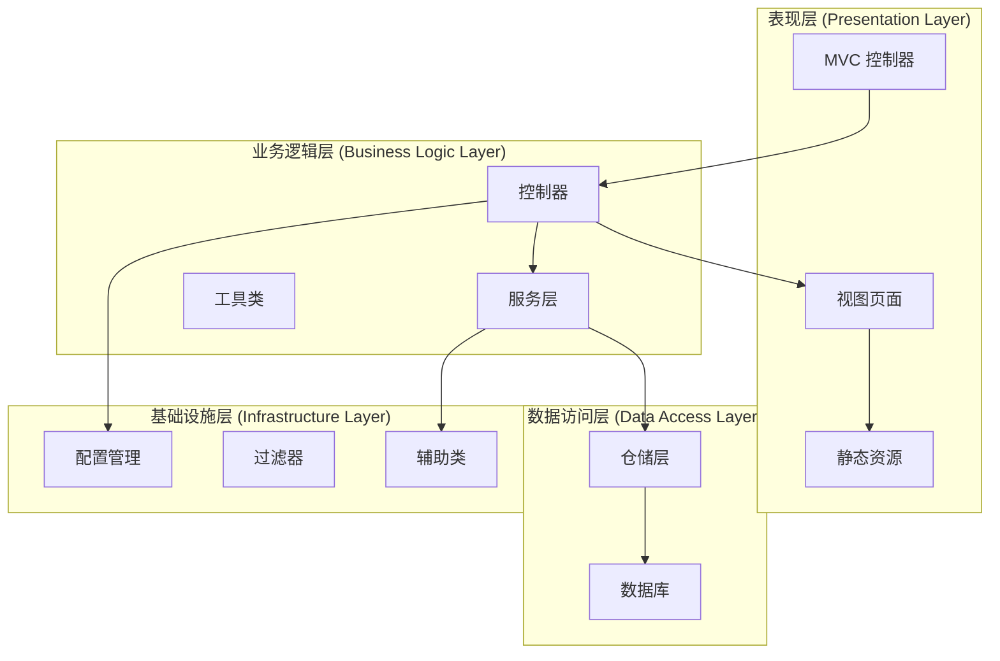
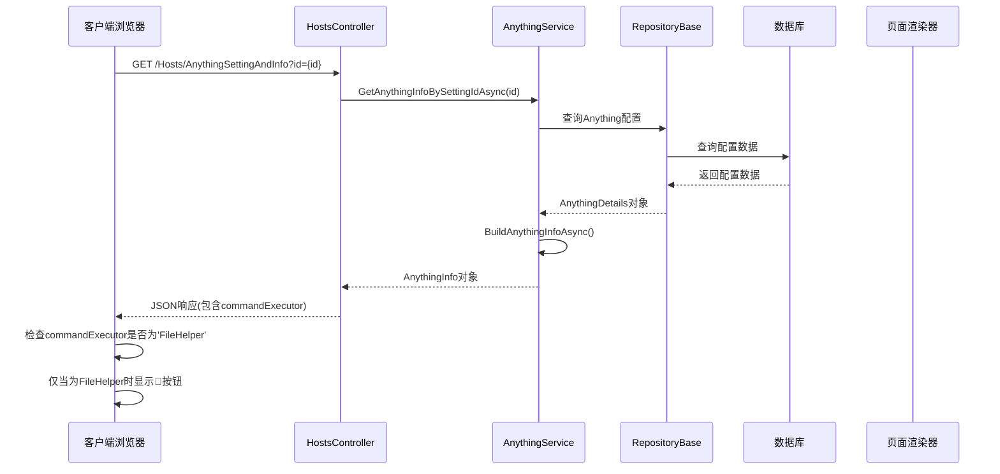
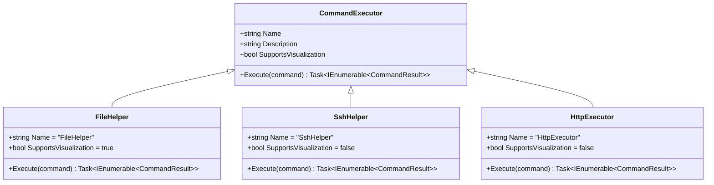
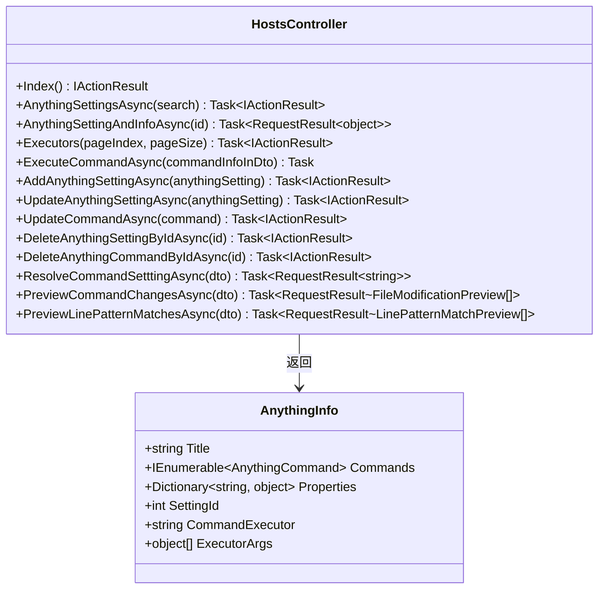
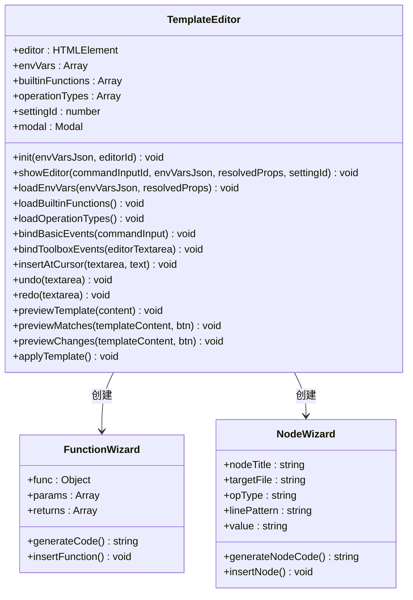
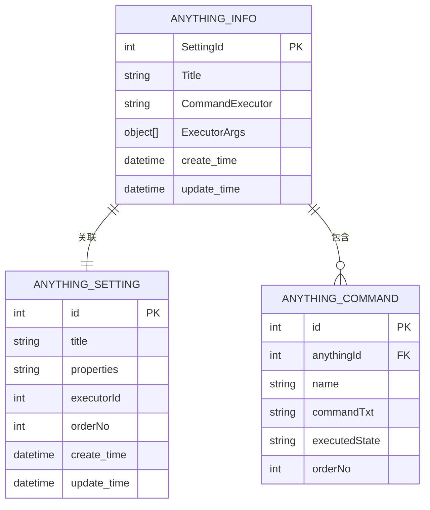
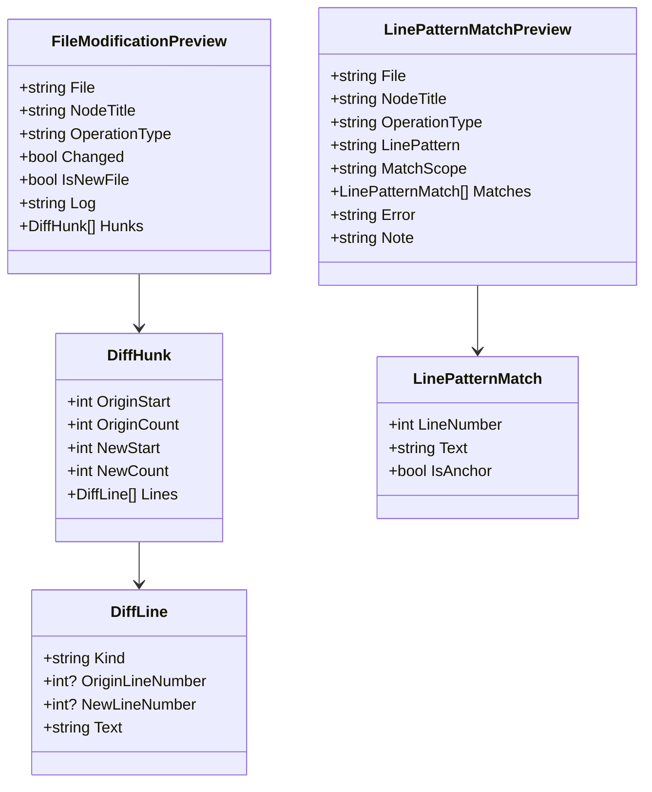
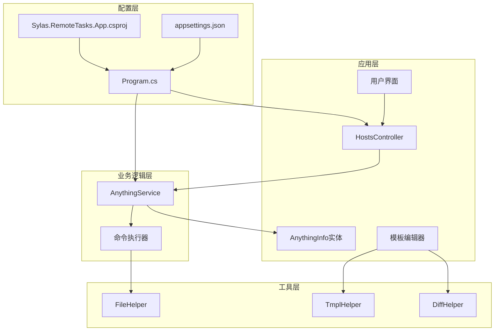

# 可视化模板编辑器系统

<cite>
**本文引用的文件**
- [HostsController.cs](file://Sylas.RemoteTasks.App/Controllers/HostsController.cs)
- [AnythingInfo.cs](file://Sylas.RemoteTasks.App/RemoteHostModule/Anything/AnythingInfo.cs)
- [anything.js](file://Sylas.RemoteTasks.App/wwwroot/js/anything.js)
- [template-editor.js](file://Sylas.RemoteTasks.App/wwwroot/js/template-editor.js)
- [AnythingInfos.cshtml](file://Sylas.RemoteTasks.App/Views/Hosts/AnythingInfos.cshtml)
- [FileHelper.cs](file://Sylas.RemoteTasks.Utils/CommandExecutor/FileHelper.cs)
- [FileModificationPreview.cs](file://Sylas.RemoteTasks.Utils/CommandExecutor/FileModificationPreview.cs)
- [LinePatternMatchPreview.cs](file://Sylas.RemoteTasks.Utils/CommandExecutor/LinePatternMatchPreview.cs)
- [AnythingService.cs](file://Sylas.RemoteTasks.App/RemoteHostModule/Anything/AnythingService.cs)
</cite>

## 更新摘要
**变更内容**   
- 🎨 模板编辑器UI显著增强，新增三个预览按钮：'预览正则匹配'、'预览改动'、更新的'预览模板解析'
- 🔍 添加了复杂的UI组件，使用Bootstrap模态框显示详细的文件更改和正则匹配信息
- 📊 包含统一差异输出，带有颜色编码的添加和删除行
- ✨ 改进了用户体验，提供实时的模板验证和预览功能

## 目录
1. [简介](#简介)
2. [项目结构](#项目结构)
3. [核心组件](#核心组件)
4. [架构概览](#架构概览)
5. [详细组件分析](#详细组件分析)
6. [依赖关系分析](#依赖关系分析)
7. [性能考虑](#性能考虑)
8. [故障排除指南](#故障排除指南)
9. [结论](#结论)

## 简介

可视化模板编辑器系统是一个基于ASP.NET Core开发的低代码平台，专门用于创建和管理可视化数据表格页面。该系统提供了强大的模板编辑功能，允许用户通过可视化的界面设计数据表格的布局、字段配置和交互逻辑。

系统的核心特性包括：
- **可视化VDS配置器**：提供直观的图形界面来配置数据表格的各种属性
- **模板编辑器**：支持复杂的模板语法和变量替换
- **动态页面渲染**：根据配置动态生成可交互的数据表格页面
- **多数据库支持**：通过统一的仓储层支持多种数据库类型
- **实时预览功能**：编辑器提供实时的模板预览和验证
- **智能按钮显示**：📝可视化编辑按钮仅对FileHelper命令类型显示，避免用户在不支持的命令类型上尝试使用可视化编辑功能
- **增强的预览功能**：🔍新增三个预览按钮，提供正则匹配预览、文件改动预览和模板解析预览

## 项目结构

该项目采用典型的三层架构设计，主要分为以下层次：


```mermaid
graph TB
subgraph "表现层 (Presentation Layer)"
MVC[MVC 控制器]
Views[视图页面]
Static[静态资源]
end
subgraph "业务逻辑层 (Business Logic Layer)"
Controllers[控制器]
Services[服务层]
Utils[工具类]
end
subgraph "数据访问层 (Data Access Layer)"
Repository[仓储层]
Database[数据库]
end
subgraph "基础设施层 (Infrastructure Layer)"
Config[配置管理]
Filters[过滤器]
Helpers[辅助类]
end
MVC --> Controllers
Controllers --> Services
Services --> Repository
Repository --> Database
Controllers --> Views
Views --> Static
Controllers --> Config
Services --> Helpers
```

**图表来源**
- [Program.cs:1-122](file://Sylas.RemoteTasks.App/Program.cs#L1-L122)
- [Sylas.RemoteTasks.App.csproj:1-61](file://Sylas.RemoteTasks.App/Sylas.RemoteTasks.App.csproj#L1-L61)

**章节来源**
- [Program.cs:1-122](file://Sylas.RemoteTasks.App/Program.cs#L1-L122)
- [Sylas.RemoteTasks.App.csproj:1-61](file://Sylas.RemoteTasks.App/Sylas.RemoteTasks.App.csproj#L1-L61)

## 核心组件

### VDS页面管理系统

VDS（Visual Data Sheet）页面是系统的核心概念，代表一个完整的数据表格页面配置。每个VDS页面包含以下关键属性：

| 属性名 | 类型 | 描述 | 默认值 |
|--------|------|------|--------|
| Name | string | 页面唯一标识符，用于URL路由 | 空字符串 |
| Title | string | 页面显示标题 | 空字符串 |
| Description | string | 页面功能描述 | 空字符串 |
| VdsConfig | string | VDS配置JSON，包含apiUrl、ths、modalSettings等 | "{}" |
| IsEnabled | bool | 页面是否启用 | true |
| OrderNo | int | 页面排序号 | 0 |

### 模板编辑器引擎

系统提供了两个主要的模板编辑器：

1. **可视化模板编辑器** (`TemplateEditor`)
   - 支持环境变量和内置函数的智能提示
   - 提供操作类型（Create、Override、Append、Prepend、Replace）
   - 支持条件语法和循环语法
   - 具备撤销/重做功能
   - **仅适用于FileHelper命令类型**
   - **新增三个预览按钮**：预览正则匹配、预览改动、预览模板解析

2. **VDS可视化配置器** (`VdsConfigurator`)
   - 专门用于配置VDS页面的字段和行为
   - 支持多种字段类型（文本、数字、枚举、图片、媒体等）
   - 提供按钮配置向导
   - 支持自定义操作配置

**章节来源**
- [VdsPage.cs:1-64](file://Sylas.RemoteTasks.App/LowCode/VdsPage.cs#L1-L64)
- [template-editor.js:1-800](file://Sylas.RemoteTasks.App/wwwroot/js/template-editor.js#L1-L800)
- [vds-configurator.js:1-800](file://Sylas.RemoteTasks.App/wwwroot/js/vds-configurator.js#L1-L800)

## 架构概览

系统采用现代化的ASP.NET Core架构，结合前后端分离的设计理念：


```mermaid
sequenceDiagram
participant Client as 客户端浏览器
participant Controller as HostsController
participant Service as AnythingService
participant Repository as RepositoryBase
participant Database as 数据库
participant Renderer as 页面渲染器
Client->>Controller : GET /Hosts/AnythingSettingAndInfo?id={id}
Controller->>Service : GetAnythingInfoBySettingIdAsync(id)
Service->>Repository : 查询Anything配置
Repository->>Database : 查询配置数据
Database-->>Repository : 返回配置数据
Repository-->>Service : AnythingDetails对象
Service->>Service : BuildAnythingInfoAsync()
Service-->>Controller : AnythingInfo对象
Controller-->>Client : JSON响应(包含commandExecutor)
Client->>Client : 检查commandExecutor是否为'FileHelper'
Client->>Client : 仅当为FileHelper时显示📝按钮
```

**图表来源**
- [HostsController.cs:40-54](file://Sylas.RemoteTasks.App/Controllers/HostsController.cs#L40-L54)
- [anything.js:291-293](file://Sylas.RemoteTasks.App/wwwroot/js/anything.js#L291-L293)

**章节来源**
- [HostsController.cs:40-54](file://Sylas.RemoteTasks.App/Controllers/HostsController.cs#L40-L54)
- [anything.js:291-293](file://Sylas.RemoteTasks.App/wwwroot/js/anything.js#L291-L293)

## 详细组件分析

### 命令执行器管理系统

系统支持多种命令执行器，每种执行器都有特定的功能和适用场景：


```mermaid
classDiagram
class CommandExecutor {
+string Name
+string Description
+bool SupportsVisualization
+Execute(command) Task~IEnumerable~CommandResult~~
}
class FileHelper {
+string Name = "FileHelper"
+bool SupportsVisualization = true
+Execute(command) Task~IEnumerable~CommandResult~~
}
class SshHelper {
+string Name = "SshHelper"
+bool SupportsVisualization = false
+Execute(command) Task~IEnumerable~CommandResult~~
}
class HttpExecutor {
+string Name = "HttpExecutor"
+bool SupportsVisualization = false
+Execute(command) Task~IEnumerable~CommandResult~~
}
CommandExecutor <|-- FileHelper
CommandExecutor <|-- SshHelper
CommandExecutor <|-- HttpExecutor
```

**图表来源**
- [FileHelper.cs:1-100](file://Sylas.RemoteTasks.Utils/CommandExecutor/FileHelper.cs#L1-L100)
- [SshHelper.cs:1-100](file://Sylas.RemoteTasks.Utils/CommandExecutor/SshHelper.cs#L1-L100)
- [HttpExecutor.cs:1-100](file://Sylas.RemoteTasks.Utils/CommandExecutor/HttpExecutor.cs#L1-L100)

#### 可视化编辑按钮的智能显示逻辑

**更新** 修复了可视化模板编辑器按钮的显示逻辑，现在📝可视化编辑按钮仅对FileHelper命令类型显示

系统在前端实现了智能的按钮显示逻辑：

| 命令执行器类型 | 是否显示📝按钮 | 原因 |
|----------------|----------------|------|
| FileHelper | ✅ 显示 | 支持完整的可视化模板编辑功能 |
| SshHelper | ❌ 不显示 | SSH命令不适合可视化编辑 |
| HttpExecutor | ❌ 不显示 | HTTP请求不适合可视化编辑 |
| SystemCmd | ❌ 不显示 | 系统命令不适合可视化编辑 |

**章节来源**
- [anything.js:291-293](file://Sylas.RemoteTasks.App/wwwroot/js/anything.js#L291-L293)
- [anything.js:338](file://Sylas.RemoteTasks.App/wwwroot/js/anything.js#L338)

### 低代码控制器 (HostsController)

HostsController是Anything命令管理的核心控制器，提供了完整的CRUD操作：


```mermaid
classDiagram
class HostsController {
+Index() IActionResult
+AnythingSettingsAsync(search) Task~IActionResult~
+AnythingSettingAndInfoAsync(id) Task~RequestResult~object~~
+Executors(pageIndex, pageSize) Task~IActionResult~
+ExecuteCommandAsync(commandInfoInDto) Task
+AddAnythingSettingAsync(anythingSetting) Task~IActionResult~
+UpdateAnythingSettingAsync(anythingSetting) Task~IActionResult~
+UpdateCommandAsync(command) Task~IActionResult~
+DeleteAnythingSettingByIdAsync(id) Task~IActionResult~
+DeleteAnythingCommandByIdAsync(id) Task~IActionResult~
+ResolveCommandSetttingAsync(dto) Task~RequestResult~string~~
+PreviewCommandChangesAsync(dto) Task~RequestResult~FileModificationPreview[]~
+PreviewLinePatternMatchesAsync(dto) Task~RequestResult~LinePatternMatchPreview[]~
}
class AnythingInfo {
+string Title
+IEnumerable~AnythingCommand~ Commands
+Dictionary~string, object~ Properties
+int SettingId
+string CommandExecutor
+object[] ExecutorArgs
}
HostsController --> AnythingInfo : 返回
```

**图表来源**
- [HostsController.cs:17-200](file://Sylas.RemoteTasks.App/Controllers/HostsController.cs#L17-L200)
- [AnythingInfo.cs:6-38](file://Sylas.RemoteTasks.App/RemoteHostModule/Anything/AnythingInfo.cs#L6-L38)

#### API接口设计

系统提供了RESTful风格的API接口：

| 方法 | 路径 | 功能 | 请求体 | 响应 |
|------|------|------|--------|------|
| GET | `/Hosts/Index` | Anything命令管理页面 | 无 | 视图页面 |
| POST | `/Hosts/AnythingSettings` | 分页查询Anything设置 | DataSearch | PagedData<AnythingSetting> |
| POST | `/Hosts/AnythingSettingAndInfo` | 获取单个Anything配置和解析信息 | int id | RequestResult<object> |
| GET | `/Hosts/AnythingsInfos` | 显示所有命令 | 无 | 视图页面 |
| GET | `/Hosts/Executors` | 查询命令执行器列表 | pageIndex, pageSize | PagedData<AnythingExecutor> |
| POST | `/Hosts/ExecuteCommand` | 执行单个命令 | CommandInfoInDto | SSE流 |
| POST | `/Hosts/AddAnythingSetting` | 添加Anything设置 | AnythingSetting | OperationResult |
| POST | `/Hosts/UpdateAnythingSetting` | 更新Anything设置 | Dictionary<string,string> | OperationResult |
| POST | `/Hosts/UpdateCommand` | 更新命令内容 | Dictionary<string,string> | OperationResult |
| POST | `/Hosts/DeleteAnythingSettingById` | 删除Anything设置 | int id | OperationResult |
| POST | `/Hosts/DeleteAnythingCommandById` | 删除命令 | int id | OperationResult |
| POST | `/Hosts/ResolveCommandSettting` | 解析命令模板 | CommandResolveDto | RequestResult<string> |
| POST | `/Hosts/PreviewCommandChanges` | 预览文件改动 | CommandResolveDto | RequestResult<List<FileModificationPreview>> |
| POST | `/Hosts/PreviewLinePatternMatches` | 预览正则匹配 | CommandResolveDto | RequestResult<List<LinePatternMatchPreview>> |

**章节来源**
- [HostsController.cs:17-200](file://Sylas.RemoteTasks.App/Controllers/HostsController.cs#L17-L200)

### 增强的模板编辑器系统

模板编辑器提供了强大的模板处理能力，但仅适用于FileHelper命令类型：


```mermaid
classDiagram
class TemplateEditor {
+editor : HTMLElement
+envVars : Array
+builtinFunctions : Array
+operationTypes : Array
+settingId : number
+modal : Modal
+init(envVarsJson, editorId) void
+showEditor(commandInputId, envVarsJson, resolvedProps, settingId) void
+loadEnvVars(envVarsJson, resolvedProps) void
+loadBuiltinFunctions() void
+loadOperationTypes() void
+bindBasicEvents(commandInput) void
+bindToolboxEvents(editorTextarea) void
+insertAtCursor(textarea, text) void
+undo(textarea) void
+redo(textarea) void
+previewTemplate(content) void
+previewMatches(templateContent, btn) void
+previewChanges(templateContent, btn) void
+applyTemplate() void
}
class FunctionWizard {
+func : Object
+params : Array
+returns : Array
+generateCode() string
+insertFunction() void
}
class NodeWizard {
+nodeTitle : string
+targetFile : string
+opType : string
+linePattern : string
+value : string
+generateNodeCode() string
+insertNode() void
}
TemplateEditor --> FunctionWizard : 创建
TemplateEditor --> NodeWizard : 创建
```

**图表来源**
- [template-editor.js:5-422](file://Sylas.RemoteTasks.App/wwwroot/js/template-editor.js#L5-L422)
- [template-editor.js:646-740](file://Sylas.RemoteTasks.App/wwwroot/js/template-editor.js#L646-L740)

#### 模板语法支持

系统支持多种模板语法：

| 语法类型 | 语法示例 | 用途 | 说明 |
|----------|----------|------|------|
| 环境变量 | `${VariableName}` | 预处理阶段替换 | 在模板编译时替换为实际值 |
| 函数调用 | `{FunctionName()}` | 执行阶段替换 | 在运行时执行函数并替换结果 |
| Razor变量 | `@Model.Property` | Razor模板变量 | 需要在Razor模板中声明 |
| 条件语法 | `#IF:Condition#IFEND` | 条件控制 | 根据条件决定是否包含内容 |
| 循环语法 | `$for item in collection$forend` | 循环遍历 | 遍历集合中的每个元素 |
| 操作类型 | `OperationType: Create` | 文件操作类型 | 指定文件操作的具体类型 |

**章节来源**
- [template-editor.js:430-522](file://Sylas.RemoteTasks.App/wwwroot/js/template-editor.js#L430-L522)
- [template-editor.js:544-572](file://Sylas.RemoteTasks.App/wwwroot/js/template-editor.js#L544-L572)

### 数据模型和仓储层

系统采用了统一的数据模型来处理Anything命令：


```mermaid
erDiagram
ANYTHING_INFO {
int SettingId PK
string Title
string CommandExecutor
object[] ExecutorArgs
datetime create_time
datetime update_time
}
ANYTHING_COMMAND {
int id PK
int anythingId FK
string name
string commandTxt
string executedState
int orderNo
}
ANYTHING_SETTING {
int id PK
string title
string properties
int executorId
int orderNo
datetime create_time
datetime update_time
}
ANYTHING_INFO ||--|| ANYTHING_SETTING : 关联
ANYTHING_INFO ||--o{ ANYTHING_COMMAND : 包含
```

**图表来源**
- [AnythingInfo.cs:6-38](file://Sylas.RemoteTasks.App/RemoteHostModule/Anything/AnythingInfo.cs#L6-L38)
- [AnythingCommand.cs:1-50](file://Sylas.RemoteTasks.App/RemoteHostModule/Anything/AnythingCommand.cs#L1-L50)
- [AnythingSetting.cs:1-50](file://Sylas.RemoteTasks.App/RemoteHostModule/Anything/AnythingSetting.cs#L1-L50)

#### 命令执行器类型系统

系统支持多种命令执行器类型：

| 执行器类型 | 名称 | 可视化编辑支持 | 主要用途 |
|------------|------|----------------|----------|
| FileHelper | FileHelper | ✅ 完全支持 | 文件操作、代码生成、模板处理 |
| SshHelper | SshHelper | ❌ 不支持 | SSH远程命令执行 |
| HttpExecutor | HttpExecutor | ❌ 不支持 | HTTP API调用 |
| SystemCmd | SystemCmd | ❌ 不支持 | 系统命令执行 |

**章节来源**
- [FileHelper.cs:1-100](file://Sylas.RemoteTasks.Utils/CommandExecutor/FileHelper.cs#L1-L100)
- [SshHelper.cs:1-100](file://Sylas.RemoteTasks.Utils/CommandExecutor/SshHelper.cs#L1-L100)
- [HttpExecutor.cs:1-100](file://Sylas.RemoteTasks.Utils/CommandExecutor/HttpExecutor.cs#L1-L100)

### 增强的预览功能

**更新** 模板编辑器新增了三个强大的预览功能按钮，提供更全面的模板验证和调试能力：

#### 预览正则匹配功能
- **功能描述**：预览LinePattern正则表达式在目标文件中的匹配结果
- **实现方式**：调用`/Hosts/PreviewLinePatternMatches`接口
- **显示内容**：匹配的行号、匹配内容、锚点标记、错误信息
- **使用场景**：验证正则表达式的正确性和匹配范围

#### 预览改动功能  
- **功能描述**：预览模板执行后对文件的改动，不进行实际写入
- **实现方式**：调用`/Hosts/PreviewCommandChanges`接口
- **显示内容**：统一差异输出，颜色编码的添加和删除行
- **使用场景**：在执行前预览最终效果，确保模板逻辑正确

#### 预览模板解析功能
- **功能描述**：预览模板解析后的最终结果
- **实现方式**：调用`/Hosts/ResolveCommandSettting`接口
- **显示内容**：解析后的模板内容，HTML转义防止XSS攻击
- **使用场景**：验证模板变量的替换是否正确

#### 预览功能的数据模型


```mermaid
classDiagram
class FileModificationPreview {
+string File
+string NodeTitle
+string OperationType
+bool Changed
+bool IsNewFile
+string Log
+DiffHunk[] Hunks
}
class DiffHunk {
+int OriginStart
+int OriginCount
+int NewStart
+int NewCount
+DiffLine[] Lines
}
class DiffLine {
+string Kind
+int? OriginLineNumber
+int? NewLineNumber
+string Text
}
class LinePatternMatchPreview {
+string File
+string NodeTitle
+string OperationType
+string LinePattern
+string MatchScope
+LinePatternMatch[] Matches
+string Error
+string Note
}
class LinePatternMatch {
+int LineNumber
+string Text
+bool IsAnchor
}
FileModificationPreview --> DiffHunk
DiffHunk --> DiffLine
LinePatternMatchPreview --> LinePatternMatch
```

**图表来源**
- [FileModificationPreview.cs:8-88](file://Sylas.RemoteTasks.Utils/CommandExecutor/FileModificationPreview.cs#L8-L88)
- [LinePatternMatchPreview.cs:27-80](file://Sylas.RemoteTasks.Utils/CommandExecutor/LinePatternMatchPreview.cs#L27-L80)

#### 预览功能的后端实现

**章节来源**
- [AnythingService.cs:712-783](file://Sylas.RemoteTasks.App/RemoteHostModule/Anything/AnythingService.cs#L712-L783)
- [FileHelper.cs:589-607](file://Sylas.RemoteTasks.Utils/CommandExecutor/FileHelper.cs#L589-L607)

### 前端UI增强

**更新** 模板编辑器的前端界面得到了显著增强：

#### 新的预览按钮
- **预览正则匹配** (`previewMatchesBtn`)：验证LinePattern正则表达式
- **预览改动** (`previewChangesBtn`)：预览文件改动，带统一差异显示
- **预览模板解析** (`previewTemplateBtn`)：预览模板解析结果

#### Bootstrap模态框集成
- 使用Bootstrap 5的模态框组件
- 支持拖拽功能 (`makeModalDraggable`)
- 响应式设计，适配不同屏幕尺寸
- 加载状态指示器

#### 差异显示优化
- 颜色编码：绿色背景表示添加行，红色背景表示删除行
- 行号显示：同时显示原始行号和修改后行号
- 上下文信息：显示差异块周围的上下文行
- 统计信息：显示总步骤数、产生改动的步骤数等

**章节来源**
- [template-editor.js:386-389](file://Sylas.RemoteTasks.App/wwwroot/js/template-editor.js#L386-L389)
- [template-editor.js:967-1014](file://Sylas.RemoteTasks.App/wwwroot/js/template-editor.js#L967-L1014)
- [template-editor.js:1092-1138](file://Sylas.RemoteTasks.App/wwwroot/js/template-editor.js#L1092-L1138)

## 依赖关系分析

系统采用模块化设计，各组件之间的依赖关系清晰明确：


```mermaid
graph TB
subgraph "应用层"
HostsController[HostsController]
AnythingInfo[AnythingInfo实体]
TemplateEditor[模板编辑器]
EndUserInterface[用户界面]
end
subgraph "业务逻辑层"
AnythingService[AnythingService]
CommandExecutor[命令执行器]
end
subgraph "工具层"
FileHelper[FileHelper]
TmplHelper[TmplHelper]
DiffHelper[DiffHelper]
end
subgraph "配置层"
Program[Program.cs]
AppSettings[appsettings.json]
ProjectFile[Sylas.RemoteTasks.App.csproj]
end
HostsController --> AnythingService
AnythingService --> AnythingInfo
AnythingService --> CommandExecutor
CommandExecutor --> FileHelper
TemplateEditor --> TmplHelper
TemplateEditor --> DiffHelper
EndUserInterface --> HostsController
Program --> HostsController
Program --> AnythingService
AppSettings --> Program
ProjectFile --> Program
```

**图表来源**
- [Program.cs:46-68](file://Sylas.RemoteTasks.App/Program.cs#L46-L68)
- [Sylas.RemoteTasks.App.csproj:36-44](file://Sylas.RemoteTasks.App/Sylas.RemoteTasks.App.csproj#L36-L44)

### 外部依赖

系统的主要外部依赖包括：

| 依赖包 | 版本 | 用途 |
|--------|------|------|
| Microsoft.AspNetCore.Authentication.JwtBearer | 8.0.10 | JWT认证 |
| Microsoft.AspNetCore.Authentication.OpenIdConnect | 8.0.7 | OpenID Connect认证 |
| IdentityModel | 7.0.0 | OIDC令牌处理 |
| IdentityModel.AspNetCore.OAuth2Introspection | 6.2.0 | OAuth2令牌检查 |
| Microsoft.CodeAnalysis.CSharp | 4.8.0 | C#代码分析 |
| RazorEngine.NetCore | 3.1.0 | Razor模板引擎 |

**章节来源**
- [Sylas.RemoteTasks.App.csproj:37-44](file://Sylas.RemoteTasks.App/Sylas.RemoteTasks.App.csproj#L37-L44)

## 性能考虑

系统在设计时充分考虑了性能优化：

### 数据访问优化
- **统一仓储层**：通过RepositoryBase减少重复代码，提高查询效率
- **数据库类型适配**：针对不同数据库类型优化SQL语句生成
- **分页查询**：默认使用分页机制，避免一次性加载大量数据

### 前端性能优化
- **懒加载**：模板编辑器按需加载数据，避免不必要的初始化
- **虚拟滚动**：对于大量数据的表格，使用虚拟滚动提升渲染性能
- **缓存机制**：对常用的数据源进行缓存，减少重复请求
- **智能按钮显示**：仅对支持的命令类型显示可视化编辑按钮，减少DOM操作
- **防抖机制**：预览功能采用防抖机制，避免频繁的模板解析

### 模板处理优化
- **增量更新**：模板编辑器支持增量更新，只重新渲染变化的部分
- **语法高亮**：使用高效的语法高亮算法，提升编辑体验
- **实时预览**：预览功能采用防抖机制，避免频繁的模板解析
- **异步处理**：预览功能使用异步请求，避免阻塞用户界面

## 故障排除指南

### 常见问题及解决方案

#### 1. 📝可视化编辑按钮不显示
**症状**：某些命令没有显示可视化编辑按钮

**排查步骤**：
1. 检查命令的执行器类型是否为FileHelper
2. 确认后端返回的commandExecutor字段值
3. 验证前端JavaScript是否正确判断命令类型

**解决方案**：
```javascript
// 检查命令执行器类型
const isFileHelper = anythingInfo.commandExecutor === 'FileHelper';
if (isFileHelper) {
    // 显示可视化编辑按钮
    commandsHtml += `<button class="visual-edit-btn">📝</button>`;
} else {
    // 其他执行器类型不显示按钮
    console.log(`命令执行器 ${anythingInfo.commandExecutor} 不支持可视化编辑`);
}
```

#### 2. 预览功能异常
**症状**：预览按钮点击后无响应或显示错误

**排查步骤**：
1. 检查网络连接是否正常
2. 验证后端API接口是否可用
3. 确认用户权限是否正确
4. 查看浏览器控制台错误信息

**解决方案**：
```javascript
// 检查预览接口调用
try {
    const result = await this.postPreviewAsync('/Hosts/PreviewCommandChanges', templateContent);
    if (!result) {
        console.error('预览请求失败');
        return;
    }
    // 处理预览结果
    const bodyHtml = result.code === 1
        ? this.renderChangesPreview(result.data)
        : `<div class="alert alert-danger mb-0">${this.escapeHtml(result.errMsg || '预览失败')}</div>`;
} catch (e) {
    console.error('预览失败:', e);
    alert('预览失败: ' + e.message);
}
```

#### 3. 模板编辑器功能异常
**症状**：模板编辑器无法正常加载或功能失效

**排查步骤**：
1. 检查JavaScript控制台是否有错误
2. 验证模板编辑器的依赖文件是否正确加载
3. 确认环境变量配置是否正确

**解决方案**：
```javascript
// 确保模板编辑器正确初始化
TemplateEditor.init(envVarsJson, 'tmplEditorTextarea');

// 检查环境变量加载
TemplateEditor.loadEnvVars(envVarsJson, resolvedProps);

// 验证工具箱数据
console.log('工具箱数据:', TemplateEditor.envVars);
```

#### 4. 命令执行失败
**症状**：命令执行后出现错误或状态异常

**排查步骤**：
1. 检查命令语法是否正确
2. 验证环境变量是否已正确设置
3. 确认目标文件或API地址是否存在

**解决方案**：
```csharp
// 验证命令执行器
var handler = ICommandExecutor.GetCommandHandler(executorName, args, serviceProvider);
if (handler.Code != 1)
{
    throw new Exception(handler.ErrMsg);
}
```

**章节来源**
- [HostsController.cs:40-54](file://Sylas.RemoteTasks.App/Controllers/HostsController.cs#L40-L54)
- [anything.js:291-293](file://Sylas.RemoteTasks.App/wwwroot/js/anything.js#L291-L293)
- [template-editor.js:24-422](file://Sylas.RemoteTasks.App/wwwroot/js/template-editor.js#L24-L422)

## 结论

可视化模板编辑器系统是一个功能强大、架构清晰的低代码平台。通过模块化的设计和丰富的功能特性，系统能够满足各种数据表格页面的创建和管理需求。

### 主要优势

1. **高度可视化**：通过图形界面简化了复杂的数据表格配置过程
2. **灵活的模板系统**：支持多种模板语法和变量替换机制
3. **强大的扩展性**：模块化架构便于功能扩展和定制
4. **多数据库支持**：统一的仓储层支持多种数据库类型
5. **实时预览**：编辑器提供实时的预览和验证功能
6. **智能按钮显示**：📝可视化编辑按钮仅对FileHelper命令类型显示，避免用户在不支持的命令类型上尝试使用可视化编辑功能
7. **增强的预览功能**：🔍新增三个预览按钮，提供正则匹配预览、文件改动预览和模板解析预览，大幅提升用户体验

### 技术特色

- **前后端分离**：采用现代化的前端框架和后端API设计
- **模板引擎**：集成强大的模板处理能力
- **认证授权**：完善的用户认证和权限控制系统
- **配置管理**：灵活的配置管理和环境隔离
- **命令执行器模式**：支持多种命令执行器类型，每种类型都有特定的功能和适用场景
- **差异比较**：使用统一差异格式展示文件改动，直观易懂
- **异步处理**：预览功能采用异步请求，提升用户体验

### 发展建议

1. **性能优化**：进一步优化大数据量场景下的渲染性能
2. **功能扩展**：增加更多的字段类型和交互组件
3. **用户体验**：持续改进用户界面和交互体验
4. **文档完善**：补充更详细的开发和使用文档
5. **命令执行器扩展**：为更多类型的命令执行器添加可视化编辑支持
6. **预览功能增强**：考虑添加更多类型的预览功能，如SQL预览、JSON预览等

该系统为开发者提供了一个高效、易用的低代码开发平台，能够显著提升数据表格页面的开发效率和质量。特别是通过智能的按钮显示逻辑和增强的预览功能，确保了用户只能在支持的命令类型上使用可视化编辑功能，提升了系统的易用性和稳定性。新增的三个预览按钮为用户提供了更全面的功能验证能力，大大降低了模板编写过程中的试错成本。