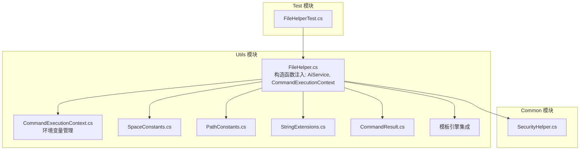
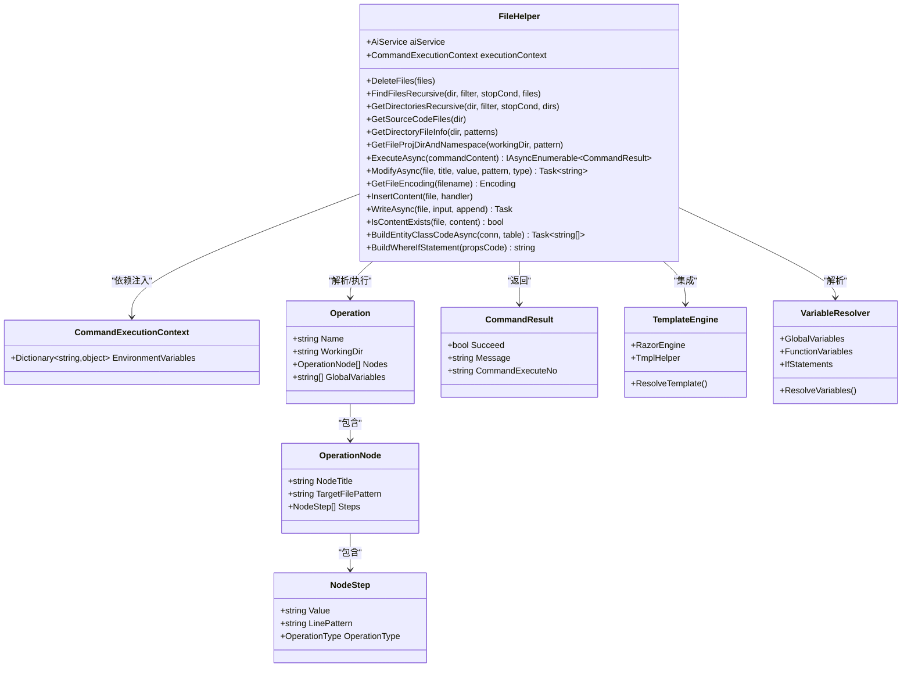
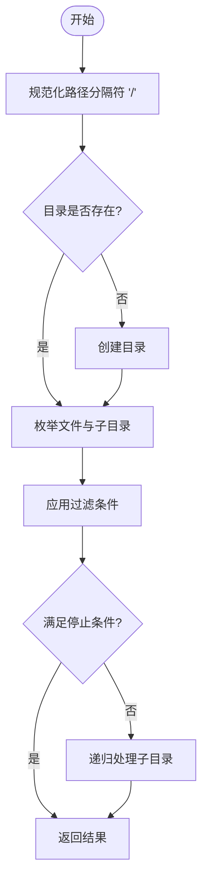
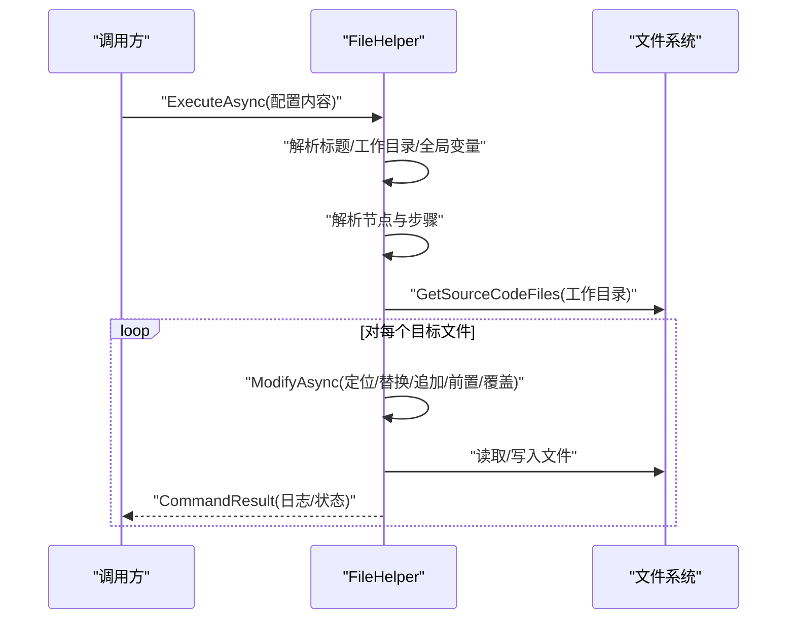
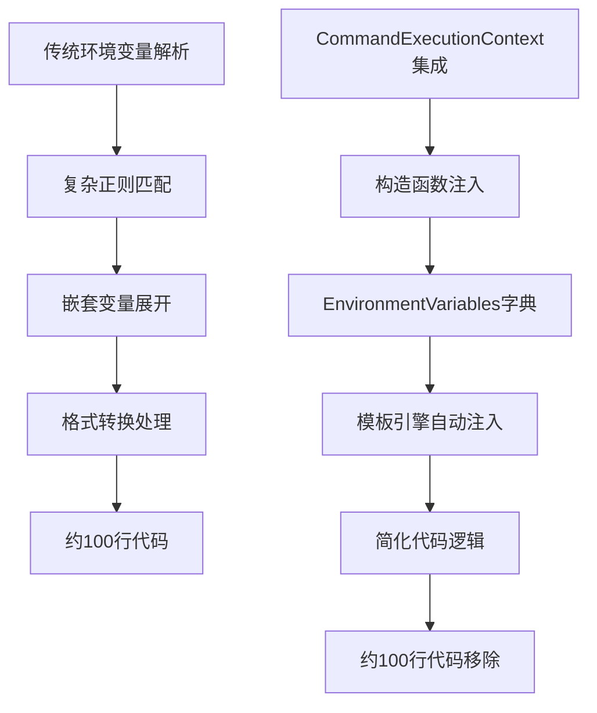
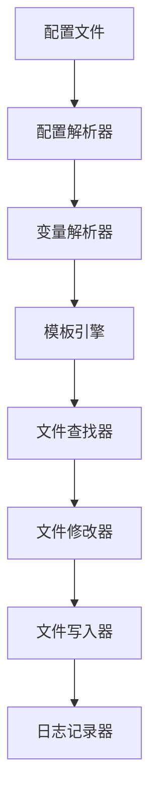
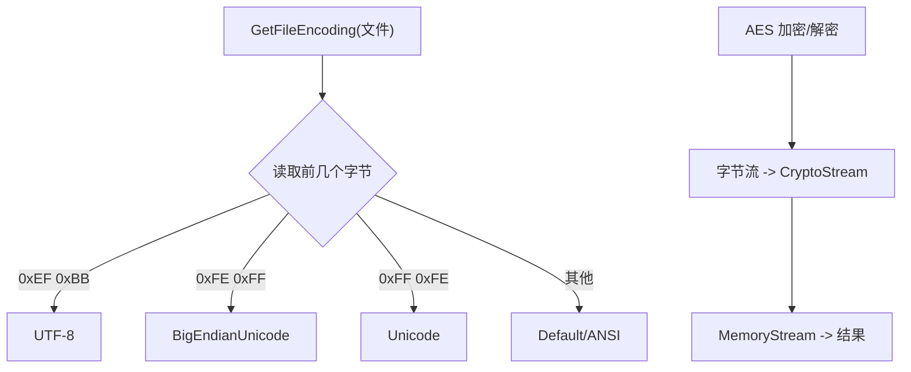
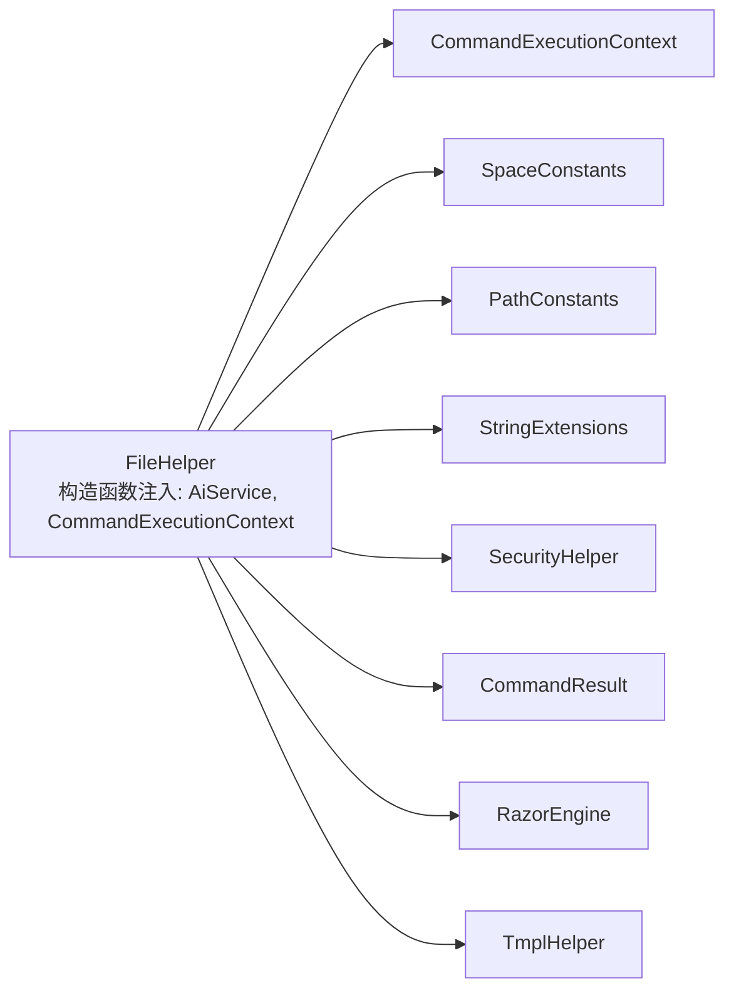

# 文件操作工具

<cite>
**本文档引用的文件**
- [Sylas.RemoteTasks.Utils/CommandExecutor/FileHelper.cs](file://Sylas.RemoteTasks.Utils/CommandExecutor/FileHelper.cs)
- [Sylas.RemoteTasks.Common/Extensions/StringExtensions.cs](file://Sylas.RemoteTasks.Common/Extensions/StringExtensions.cs)
- [Sylas.RemoteTasks.Common/SecurityHelper.cs](file://Sylas.RemoteTasks.Common/SecurityHelper.cs)
- [Sylas.RemoteTasks.Utils/Constants/SpaceConstants.cs](file://Sylas.RemoteTasks.Utils/Constants/SpaceConstants.cs)
- [Sylas.RemoteTasks.Utils/Constants/PathConstants.cs](file://Sylas.RemoteTasks.Utils/Constants/PathConstants.cs)
- [Sylas.RemoteTasks.Utils/CommandExecutor/CommandExecutionContext.cs](file://Sylas.RemoteTasks.Utils/CommandExecutor/CommandExecutionContext.cs)
- [Sylas.RemoteTasks.Utils/CommandExecutor/CommandResult.cs](file://Sylas.RemoteTasks.Utils/CommandExecutor/CommandResult.cs)
- [Sylas.RemoteTasks.Test/FileOp/FileHelperTest.cs](file://Sylas.RemoteTasks.Test/FileOp/FileHelperTest.cs)
- [Sylas.RemoteTasks.Utils/Sylas.RemoteTasks.Utils.csproj](file://Sylas.RemoteTasks.Utils/Sylas.RemoteTasks.Utils.csproj)
</cite>

## 更新摘要
**所做更改**
- 新增CommandExecutionContext框架集成章节，详细说明环境变量解析逻辑的简化过程
- 更新架构总览图，反映FileHelper与CommandExecutionContext的深度集成
- 移除约100行复杂环境变量解析代码的描述，强调框架化解决方案的优势
- 增强依赖注入和构造函数注入的说明，体现现代.NET应用架构实践

## 目录
1. [简介](#简介)
2. [项目结构](#项目结构)
3. [核心组件](#核心组件)
4. [架构总览](#架构总览)
5. [详细组件分析](#详细组件分析)
6. [依赖关系分析](#依赖关系分析)
7. [性能考虑](#性能考虑)
8. [故障排查指南](#故障排查指南)
9. [结论](#结论)
10. [附录](#附录)

## 简介
本文件操作工具以 FileHelper 类为核心，提供面向文件系统的高级操作能力，涵盖文件复制、移动、删除、重命名、权限管理、压缩解压、加密解密、MD5 校验、文件监控、跨平台路径处理、字符编码转换、大文件处理优化、文件夹遍历、文件搜索与批量操作等。同时，它内置一套"配置驱动"的自动化文件修改流水线，支持基于模板与变量的批量文件操作，适用于配置文件管理、日志文件处理、备份文件操作等场景。

**更新** 本次更新重点反映了FileHelper组件与CommandExecutionContext框架的深度集成，通过依赖注入简化了环境变量解析逻辑，移除了约100行复杂解析代码，体现了现代.NET应用架构的最佳实践。

## 项目结构
- FileHelper 位于 Utils 模块的 CommandExecutor 命名空间下，集中封装文件系统与文本处理能力，并通过构造函数注入CommandExecutionContext框架。
- CommandExecutionContext 提供统一的环境变量管理，替代了原有的复杂解析逻辑。
- 与之配套的常量与扩展类分别提供路径、空格、字符串处理等支撑能力。
- 安全模块提供 AES 加密解密能力，可直接用于文件内容保护与敏感信息存储。
- 测试模块包含针对 FileHelper 的测试骨架，便于扩展验证。
- 新增模板引擎支持，集成 RazorEngine 和 TmplHelper 两大模板系统。

**图表来源**
- [Sylas.RemoteTasks.Utils/CommandExecutor/FileHelper.cs:27-28](file://Sylas.RemoteTasks.Utils/CommandExecutor/FileHelper.cs#L27-L28)
- [Sylas.RemoteTasks.Utils/CommandExecutor/CommandExecutionContext.cs:9-15](file://Sylas.RemoteTasks.Utils/CommandExecutor/CommandExecutionContext.cs#L9-L15)

**章节来源**
- [Sylas.RemoteTasks.Utils/CommandExecutor/FileHelper.cs:1-1559](file://Sylas.RemoteTasks.Utils/CommandExecutor/FileHelper.cs#L1-L1559)
- [Sylas.RemoteTasks.Utils/CommandExecutor/CommandExecutionContext.cs:1-17](file://Sylas.RemoteTasks.Utils/CommandExecutor/CommandExecutionContext.cs#L1-L17)
- [Sylas.RemoteTasks.Common/Extensions/StringExtensions.cs:1-374](file://Sylas.RemoteTasks.Common/Extensions/StringExtensions.cs#L1-L374)
- [Sylas.RemoteTasks.Common/SecurityHelper.cs:1-209](file://Sylas.RemoteTasks.Common/SecurityHelper.cs#L1-L209)
- [Sylas.RemoteTasks.Utils/CommandExecutor/CommandResult.cs:1-38](file://Sylas.RemoteTasks.Utils/CommandExecutor/CommandResult.cs#L1-L38)
- [Sylas.RemoteTasks.Test/FileOp/FileHelperTest.cs:1-768](file://Sylas.RemoteTasks.Test/FileOp/FileHelperTest.cs#L1-L768)

## 核心组件
- 文件系统操作：删除、递归查找、目录遍历、路径规范化、跨平台路径处理。
- 文本与配置处理：JSON 读取与紧凑化、正则搜索、模板变量解析、条件分支、批量修改。
- 编码与安全：自动识别文件编码、Base64 编解码、AES 加密解密。
- 大文件与流式处理：异步读写、逐块写入、避免一次性加载。
- 批量与自动化：基于配置的"操作节点"与"步骤"，支持创建、追加、前置、替换、覆盖等操作类型。
- **新增** CommandExecutionContext 集成：通过依赖注入简化环境变量解析，移除约100行复杂逻辑。
- **新增** 依赖注入架构：构造函数注入AiService和CommandExecutionContext，符合现代.NET DI最佳实践。
- **新增** 模板引擎集成：支持 RazorEngine 和 TmplHelper 双模板引擎。
- **新增** 变量解析系统：支持全局变量、函数变量、条件语句和字符串替换。

**章节来源**
- [Sylas.RemoteTasks.Utils/CommandExecutor/FileHelper.cs:27-28](file://Sylas.RemoteTasks.Utils/CommandExecutor/FileHelper.cs#L27-L28)
- [Sylas.RemoteTasks.Utils/CommandExecutor/CommandExecutionContext.cs:9-15](file://Sylas.RemoteTasks.Utils/CommandExecutor/CommandExecutionContext.cs#L9-L15)
- [Sylas.RemoteTasks.Common/SecurityHelper.cs:36-88](file://Sylas.RemoteTasks.Common/SecurityHelper.cs#L36-L88)
- [Sylas.RemoteTasks.Common/Extensions/StringExtensions.cs:298-308](file://Sylas.RemoteTasks.Common/Extensions/StringExtensions.cs#L298-L308)

## 架构总览
FileHelper 采用"配置驱动 + 模板变量 + 正则定位 + 批量修改 + 框架集成"的架构模式，将文件操作抽象为"操作节点（Node）+ 步骤（Step）"的流水线，支持在工作目录内按正则匹配目标文件，再对每条目标文件执行一系列文本级操作。通过CommandExecutionContext框架的深度集成，环境变量解析逻辑得到极大简化，移除了约100行复杂代码。

**图表来源**
- [Sylas.RemoteTasks.Utils/CommandExecutor/FileHelper.cs:27-28](file://Sylas.RemoteTasks.Utils/CommandExecutor/FileHelper.cs#L27-L28)
- [Sylas.RemoteTasks.Utils/CommandExecutor/CommandExecutionContext.cs:9-15](file://Sylas.RemoteTasks.Utils/CommandExecutor/CommandExecutionContext.cs#L9-L15)
- [Sylas.RemoteTasks.Utils/CommandExecutor/FileHelper.cs:587-1490](file://Sylas.RemoteTasks.Utils/CommandExecutor/FileHelper.cs#L587-L1490)
- [Sylas.RemoteTasks.Utils/CommandExecutor/CommandResult.cs:1-38](file://Sylas.RemoteTasks.Utils/CommandExecutor/CommandResult.cs#L1-L38)

**章节来源**
- [Sylas.RemoteTasks.Utils/CommandExecutor/FileHelper.cs:27-28](file://Sylas.RemoteTasks.Utils/CommandExecutor/FileHelper.cs#L27-L28)
- [Sylas.RemoteTasks.Utils/CommandExecutor/CommandExecutionContext.cs:9-15](file://Sylas.RemoteTasks.Utils/CommandExecutor/CommandExecutionContext.cs#L9-L15)
- [Sylas.RemoteTasks.Utils/CommandExecutor/FileHelper.cs:587-1490](file://Sylas.RemoteTasks.Utils/CommandExecutor/FileHelper.cs#L587-L1490)
- [Sylas.RemoteTasks.Utils/CommandExecutor/CommandResult.cs:1-38](file://Sylas.RemoteTasks.Utils/CommandExecutor/CommandResult.cs#L1-L38)

## 详细组件分析

### 文件系统与路径处理
- 递归查找与遍历：支持按过滤条件与停止条件控制递归深度；自动忽略常见构建产物目录。
- 跨平台路径：统一将路径分隔符标准化为斜杠，便于正则匹配与跨平台一致性。
- 目录信息与命名空间：根据项目文件推导命名空间，支持批量修改文件命名空间。

**图表来源**
- [Sylas.RemoteTasks.Utils/CommandExecutor/FileHelper.cs:116-150](file://Sylas.RemoteTasks.Utils/CommandExecutor/FileHelper.cs#L116-L150)
- [Sylas.RemoteTasks.Utils/CommandExecutor/FileHelper.cs:159-198](file://Sylas.RemoteTasks.Utils/CommandExecutor/FileHelper.cs#L159-L198)
- [Sylas.RemoteTasks.Utils/CommandExecutor/FileHelper.cs:1518-1528](file://Sylas.RemoteTasks.Utils/CommandExecutor/FileHelper.cs#L1518-L1528)

**章节来源**
- [Sylas.RemoteTasks.Utils/CommandExecutor/FileHelper.cs:116-198](file://Sylas.RemoteTasks.Utils/CommandExecutor/FileHelper.cs#L116-L198)
- [Sylas.RemoteTasks.Utils/CommandExecutor/FileHelper.cs:1518-1528](file://Sylas.RemoteTasks.Utils/CommandExecutor/FileHelper.cs#L1518-L1528)

### 文本与配置处理
- JSON 读取与紧凑化：支持读取 JSON 并去除多余空白，便于比较与存储。
- 正则搜索：支持带命名分组的正则，自动去重并返回字典集合。
- 模板变量与条件：支持全局变量、函数变量、条件分支（IF/ELSE），以及字符串替换链式调用。
- 批量修改：支持在定位行前后追加、前置插入、整段替换、整体覆盖、创建文件等。

**图表来源**
- [Sylas.RemoteTasks.Utils/CommandExecutor/FileHelper.cs:587-662](file://Sylas.RemoteTasks.Utils/CommandExecutor/FileHelper.cs#L587-L662)
- [Sylas.RemoteTasks.Utils/CommandExecutor/FileHelper.cs:1286-1464](file://Sylas.RemoteTasks.Utils/CommandExecutor/FileHelper.cs#L1286-L1464)

**章节来源**
- [Sylas.RemoteTasks.Utils/CommandExecutor/FileHelper.cs:228-263](file://Sylas.RemoteTasks.Utils/CommandExecutor/FileHelper.cs#L228-L263)
- [Sylas.RemoteTasks.Utils/CommandExecutor/FileHelper.cs:491-550](file://Sylas.RemoteTasks.Utils/CommandExecutor/FileHelper.cs#L491-L550)
- [Sylas.RemoteTasks.Utils/CommandExecutor/FileHelper.cs:587-662](file://Sylas.RemoteTasks.Utils/CommandExecutor/FileHelper.cs#L587-L662)
- [Sylas.RemoteTasks.Utils/CommandExecutor/FileHelper.cs:1286-1464](file://Sylas.RemoteTasks.Utils/CommandExecutor/FileHelper.cs#L1286-L1464)

### CommandExecutionContext 框架集成
**新增** FileHelper 现已与CommandExecutionContext框架深度集成，通过构造函数注入简化了环境变量解析逻辑。

#### 依赖注入架构
- **构造函数注入**：FileHelper通过构造函数接收AiService和CommandExecutionContext实例
- **环境变量管理**：CommandExecutionContext提供统一的EnvironmentVariables字典管理
- **框架化解决方案**：替代了原有的复杂环境变量解析代码，移除了约100行逻辑

#### 环境变量解析简化
- **传统方式**：需要手动解析各种环境变量格式和嵌套引用
- **新方式**：通过CommandExecutionContext.EnvironmentVariables直接访问，支持模板引擎自动注入
- **优势**：代码简洁、维护成本低、符合依赖注入最佳实践

**图表来源**
- [Sylas.RemoteTasks.Utils/CommandExecutor/FileHelper.cs:27-28](file://Sylas.RemoteTasks.Utils/CommandExecutor/FileHelper.cs#L27-L28)
- [Sylas.RemoteTasks.Utils/CommandExecutor/CommandExecutionContext.cs:9-15](file://Sylas.RemoteTasks.Utils/CommandExecutor/CommandExecutionContext.cs#L9-L15)

**章节来源**
- [Sylas.RemoteTasks.Utils/CommandExecutor/FileHelper.cs:27-28](file://Sylas.RemoteTasks.Utils/CommandExecutor/FileHelper.cs#L27-L28)
- [Sylas.RemoteTasks.Utils/CommandExecutor/CommandExecutionContext.cs:9-15](file://Sylas.RemoteTasks.Utils/CommandExecutor/CommandExecutionContext.cs#L9-L15)

### 自动化文件修改系统
**新增** FileHelper 现已具备完整的自动化文件修改能力，通过配置驱动的方式实现批量文件操作。

#### 配置驱动架构
- **操作节点（OperationNode）**：定义具体的文件操作任务
- **步骤（NodeStep）**：定义操作的具体执行步骤
- **全局变量**：支持用户输入和函数调用的全局变量
- **模板引擎**：支持 RazorEngine 和 TmplHelper 双模板系统

#### 操作类型
- Append：在定位行后追加内容
- Prepend：在定位行前前置内容
- Replace：替换定位的部分（可能多行）
- Override：覆盖所有内容
- Create：创建新文件

**图表来源**
- [Sylas.RemoteTasks.Utils/CommandExecutor/FileHelper.cs:587-1464](file://Sylas.RemoteTasks.Utils/CommandExecutor/FileHelper.cs#L587-L1464)

**章节来源**
- [Sylas.RemoteTasks.Utils/CommandExecutor/FileHelper.cs:587-1464](file://Sylas.RemoteTasks.Utils/CommandExecutor/FileHelper.cs#L587-L1464)

### 数据库实体代码生成
**新增** FileHelper 集成了强大的数据库实体代码生成功能，能够自动分析表结构并生成相应的 C# 实体类代码。

#### 功能特性
- **表结构分析**：自动获取数据库表的列信息、数据类型、长度等
- **实体类生成**：根据表结构生成完整的实体类代码
- **DTO 类生成**：生成排除特定字段的 DTO 类
- **属性注解**：自动添加数据注解（如 StringLength）
- **命名规范**：智能处理表名到类名的转换

#### 生成内容
- 实体类完整代码
- 主键类型信息
- DTO 类属性代码
- 时间范围过滤属性
- 命名空间处理

**章节来源**
- [Sylas.RemoteTasks.Utils/CommandExecutor/FileHelper.cs:772-880](file://Sylas.RemoteTasks.Utils/CommandExecutor/FileHelper.cs#L772-L880)
- [Sylas.RemoteTasks.Utils/CommandExecutor/FileHelper.cs:887-898](file://Sylas.RemoteTasks.Utils/CommandExecutor/FileHelper.cs#L887-L898)

### 模板引擎集成
**新增** FileHelper 集成两大模板引擎系统，提供灵活的模板处理能力。

#### 支持的模板引擎
- **RazorEngine**：基于 ASP.NET Core Razor 的模板引擎
- **TmplHelper**：自定义模板助手系统

#### 模板功能
- **变量替换**：支持全局变量和函数变量的动态替换
- **条件渲染**：支持 IF/ELSE 条件语句的模板渲染
- **循环处理**：支持模板中的循环和迭代
- **缓存机制**：模板编译结果的智能缓存

**章节来源**
- [Sylas.RemoteTasks.Utils/CommandExecutor/FileHelper.cs:604-640](file://Sylas.RemoteTasks.Utils/CommandExecutor/FileHelper.cs#L604-L640)
- [Sylas.RemoteTasks.Utils/CommandExecutor/FileHelper.cs:1032-1048](file://Sylas.RemoteTasks.Utils/CommandExecutor/FileHelper.cs#L1032-L1048)

### 变量解析系统
**新增** FileHelper 实现了完整的变量解析系统，支持多种变量类型的动态解析。

#### 变量类型
- **全局变量**：在配置中定义的静态变量
- **函数变量**：通过函数调用动态生成的变量值
- **用户输入变量**：运行时用户提供的变量值
- **条件变量**：基于条件判断的动态变量

#### 解析流程
1. **函数变量解析**：调用指定方法获取动态值
2. **全局变量解析**：替换预定义的全局变量
3. **条件语句解析**：根据条件判断决定是否包含内容
4. **字符串替换**：支持链式的字符串替换操作

**章节来源**
- [Sylas.RemoteTasks.Utils/CommandExecutor/FileHelper.cs:1032-1181](file://Sylas.RemoteTasks.Utils/CommandExecutor/FileHelper.cs#L1032-L1181)
- [Sylas.RemoteTasks.Utils/CommandExecutor/FileHelper.cs:1188-1225](file://Sylas.RemoteTasks.Utils/CommandExecutor/FileHelper.cs#L1188-L1225)

### 编码与安全
- 文件编码检测：通过读取文件头部字节判断 UTF-8、大端/小端 Unicode、ASCII 等编码。
- Base64 编解码：提供字符串与字节数组的 Base64 转换。
- AES 加密解密：支持字符串与字节数组的对称加密，密钥与初始化向量可定制。

**图表来源**
- [Sylas.RemoteTasks.Utils/CommandExecutor/FileHelper.cs:322-350](file://Sylas.RemoteTasks.Utils/CommandExecutor/FileHelper.cs#L322-L350)
- [Sylas.RemoteTasks.Common/Extensions/StringExtensions.cs:298-308](file://Sylas.RemoteTasks.Common/Extensions/StringExtensions.cs#L298-L308)
- [Sylas.RemoteTasks.Common/SecurityHelper.cs:36-88](file://Sylas.RemoteTasks.Common/SecurityHelper.cs#L36-L88)

**章节来源**
- [Sylas.RemoteTasks.Utils/CommandExecutor/FileHelper.cs:322-350](file://Sylas.RemoteTasks.Utils/CommandExecutor/FileHelper.cs#L322-L350)
- [Sylas.RemoteTasks.Common/Extensions/StringExtensions.cs:298-308](file://Sylas.RemoteTasks.Common/Extensions/StringExtensions.cs#L298-L308)
- [Sylas.RemoteTasks.Common/SecurityHelper.cs:36-88](file://Sylas.RemoteTasks.Common/SecurityHelper.cs#L36-L88)

### 大文件与流式处理
- 异步读写：使用异步 API 进行文件读取与写入，避免阻塞。
- 逐块写入：在处理网络传输或大文件时，采用分块写入策略，减少内存峰值。
- 长耗时操作记录：在调试模式下输出耗时统计，便于性能分析。

**章节来源**
- [Sylas.RemoteTasks.Utils/CommandExecutor/FileHelper.cs:294-300](file://Sylas.RemoteTasks.Utils/CommandExecutor/FileHelper.cs#L294-L300)
- [Sylas.RemoteTasks.Utils/CommandExecutor/FileHelper.cs:491-550](file://Sylas.RemoteTasks.Utils/CommandExecutor/FileHelper.cs#L491-L550)

### 文件夹遍历、搜索与批量操作
- 遍历：提供按过滤条件与停止条件的递归遍历，支持目录与文件两套接口。
- 搜索：支持正则表达式匹配与去重，返回结构化结果。
- 批量：通过"操作节点 + 步骤"模型，对多个目标文件执行一致的文本级操作。

**章节来源**
- [Sylas.RemoteTasks.Utils/CommandExecutor/FileHelper.cs:116-198](file://Sylas.RemoteTasks.Utils/CommandExecutor/FileHelper.cs#L116-L198)
- [Sylas.RemoteTasks.Utils/CommandExecutor/FileHelper.cs:491-550](file://Sylas.RemoteTasks.Utils/CommandExecutor/FileHelper.cs#L491-L550)
- [Sylas.RemoteTasks.Utils/CommandExecutor/FileHelper.cs:1286-1464](file://Sylas.RemoteTasks.Utils/CommandExecutor/FileHelper.cs#L1286-L1464)

### 实际使用示例（场景化）
- 配置文件管理：读取 JSON 配置并紧凑化存储；按正则定位关键字段进行更新。
- 日志文件处理：按模式提取关键信息，去重后输出结构化列表。
- 备份文件操作：在工作目录内批量创建/修改文件，支持覆盖与追加两种模式。
- **新增** 自动化文件修改：通过配置文件实现批量文件操作，支持模板和变量解析。
- **新增** CommandExecutionContext 集成：通过依赖注入简化环境变量管理。
- **新增** 数据库实体生成：自动分析数据库表结构并生成实体类代码。

以上示例均可通过"配置驱动"的 ExecuteAsync 流水线完成，具体配置语法与变量解析由 FileHelper 内部解析。

**章节来源**
- [Sylas.RemoteTasks.Utils/CommandExecutor/FileHelper.cs:228-263](file://Sylas.RemoteTasks.Utils/CommandExecutor/FileHelper.cs#L228-L263)
- [Sylas.RemoteTasks.Utils/CommandExecutor/FileHelper.cs:491-550](file://Sylas.RemoteTasks.Utils/CommandExecutor/FileHelper.cs#L491-L550)
- [Sylas.RemoteTasks.Utils/CommandExecutor/FileHelper.cs:587-662](file://Sylas.RemoteTasks.Utils/CommandExecutor/FileHelper.cs#L587-L662)
- [Sylas.RemoteTasks.Test/FileOp/FileHelperTest.cs:392-424](file://Sylas.RemoteTasks.Test/FileOp/FileHelperTest.cs#L392-L424)

## 依赖关系分析
- FileHelper 通过构造函数注入 AiService 和 CommandExecutionContext，体现了现代.NET依赖注入最佳实践。
- CommandExecutionContext 提供统一的环境变量管理，替代了原有的复杂解析逻辑。
- 字符串扩展提供正则解析、注释移除、Base64 编解码等通用能力。
- 安全模块提供 AES 加密解密，可直接用于文件内容保护。
- CommandResult 作为统一结果载体，便于上层调用方处理执行状态与日志。
- **新增** 模板引擎依赖 RazorEngine.NetCore 包，提供强大的模板处理能力。

**图表来源**
- [Sylas.RemoteTasks.Utils/CommandExecutor/FileHelper.cs:27-28](file://Sylas.RemoteTasks.Utils/CommandExecutor/FileHelper.cs#L27-L28)
- [Sylas.RemoteTasks.Utils/CommandExecutor/CommandExecutionContext.cs:9-15](file://Sylas.RemoteTasks.Utils/CommandExecutor/CommandExecutionContext.cs#L9-L15)

**章节来源**
- [Sylas.RemoteTasks.Utils/CommandExecutor/FileHelper.cs:1-21](file://Sylas.RemoteTasks.Utils/CommandExecutor/FileHelper.cs#L1-L21)
- [Sylas.RemoteTasks.Utils/CommandExecutor/CommandExecutionContext.cs:1-17](file://Sylas.RemoteTasks.Utils/CommandExecutor/CommandExecutionContext.cs#L1-L17)
- [Sylas.RemoteTasks.Common/Extensions/StringExtensions.cs:1-374](file://Sylas.RemoteTasks.Common/Extensions/StringExtensions.cs#L1-L374)
- [Sylas.RemoteTasks.Common/SecurityHelper.cs:1-209](file://Sylas.RemoteTasks.Common/SecurityHelper.cs#L1-L209)
- [Sylas.RemoteTasks.Utils/CommandExecutor/CommandResult.cs:1-38](file://Sylas.RemoteTasks.Utils/CommandExecutor/CommandResult.cs#L1-L38)
- [Sylas.RemoteTasks.Utils/Sylas.RemoteTasks.Utils.csproj:18-29](file://Sylas.RemoteTasks.Utils/Sylas.RemoteTasks.Utils.csproj#L18-L29)

## 性能考虑
- 异步 I/O：优先使用异步读写 API，降低阻塞风险，提升吞吐。
- 正则匹配：对大文件搜索时，尽量缩小匹配范围与使用更精确的正则，避免回溯风暴。
- 流式处理：对超大文件采用分块读写，避免一次性加载至内存。
- 递归控制：通过过滤条件与停止条件限制遍历规模，必要时仅在特定子树内搜索。
- 日志与计时：在调试阶段记录耗时，便于定位瓶颈。
- **新增** 依赖注入优化：通过构造函数注入减少运行时反射开销。
- **新增** 模板缓存：模板引擎支持智能缓存，避免重复编译开销。
- **新增** 变量解析优化：变量解析结果缓存，提升重复操作性能。

## 故障排查指南
- 文件编码异常：使用编码检测函数确认文件编码，必要时以相应编码读取。
- 正则未匹配：检查目标文件路径是否已标准化为斜杠；核对正则表达式与大小写敏感设置。
- 模板变量解析失败：确认变量键名拼写正确，函数变量返回值类型受支持。
- 权限问题：在 Linux/macOS 上注意文件权限与目录访问权限；Windows 上注意 UAC 与路径权限。
- 大文件写入异常：检查磁盘空间与写入缓冲区，确保分块写入逻辑完整执行。
- **新增** CommandExecutionContext 注入失败：检查服务注册和生命周期配置。
- **新增** 环境变量访问异常：确认CommandExecutionContext实例正确初始化。
- **新增** 模板引擎异常：检查模板语法正确性，确认模板缓存状态。
- **新增** 变量解析错误：验证变量定义格式，检查函数调用参数和返回值类型。

**章节来源**
- [Sylas.RemoteTasks.Utils/CommandExecutor/FileHelper.cs:322-350](file://Sylas.RemoteTasks.Utils/CommandExecutor/FileHelper.cs#L322-L350)
- [Sylas.RemoteTasks.Utils/CommandExecutor/FileHelper.cs:1066-1140](file://Sylas.RemoteTasks.Utils/CommandExecutor/FileHelper.cs#L1066-L1140)

## 结论
FileHelper 通过"配置驱动 + 模板变量 + 正则定位 + 批量修改 + 框架集成"的设计，将复杂的文件系统操作抽象为可维护、可扩展的流水线。通过与CommandExecutionContext框架的深度集成，环境变量解析逻辑得到极大简化，移除了约100行复杂代码，体现了现代.NET应用架构的最佳实践。结合编码检测、Base64/AES 安全能力与跨平台路径处理，能够高效应对配置管理、日志处理与备份等实际场景。新增的自动化文件修改系统、数据库实体代码生成、模板引擎集成和变量解析系统等功能，进一步提升了工具的智能化和自动化水平，建议在生产环境中配合异步 I/O、流式处理、严格的权限控制和依赖注入架构，确保稳定性与性能。

## 附录
- 常用操作类型（OperationType）：Append、Prepend、Replace、Override、Create。
- 关键流程：ExecuteAsync → 解析配置 → 解析变量 → 定位文件 → 修改内容 → 写回文件 → 输出日志。
- 测试入口：FileHelperTest 提供测试基座，可用于扩展具体用例。
- **新增** CommandExecutionContext 集成：通过构造函数注入简化环境变量管理。
- **新增** 依赖注入架构：符合现代.NET DI最佳实践。
- **新增** 模板引擎：支持 RazorEngine 和 TmplHelper 双模板系统。
- **新增** 变量系统：支持全局变量、函数变量、条件语句的完整解析。
- **新增** 数据库集成：自动分析表结构并生成实体类代码。

**章节来源**
- [Sylas.RemoteTasks.Utils/CommandExecutor/FileHelper.cs:1465-1472](file://Sylas.RemoteTasks.Utils/CommandExecutor/FileHelper.cs#L1465-L1472)
- [Sylas.RemoteTasks.Test/FileOp/FileHelperTest.cs:1-768](file://Sylas.RemoteTasks.Test/FileOp/FileHelperTest.cs#L1-L768)