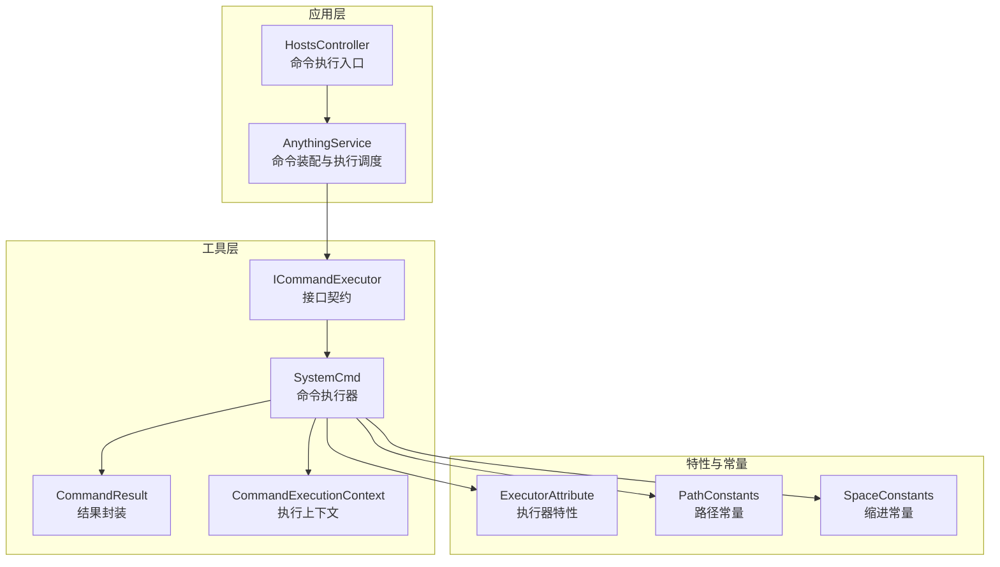
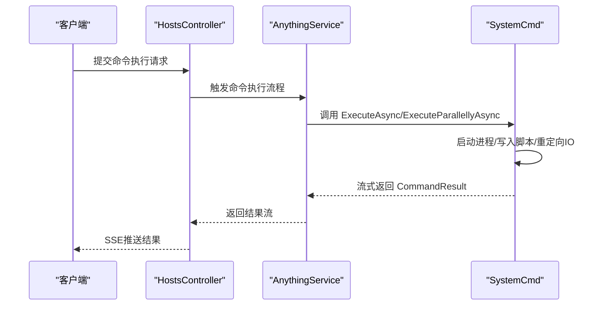
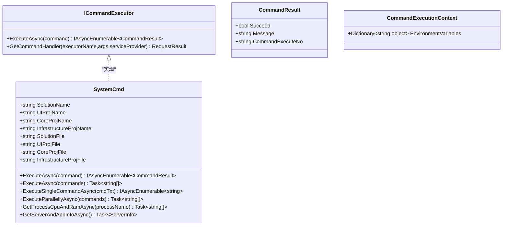
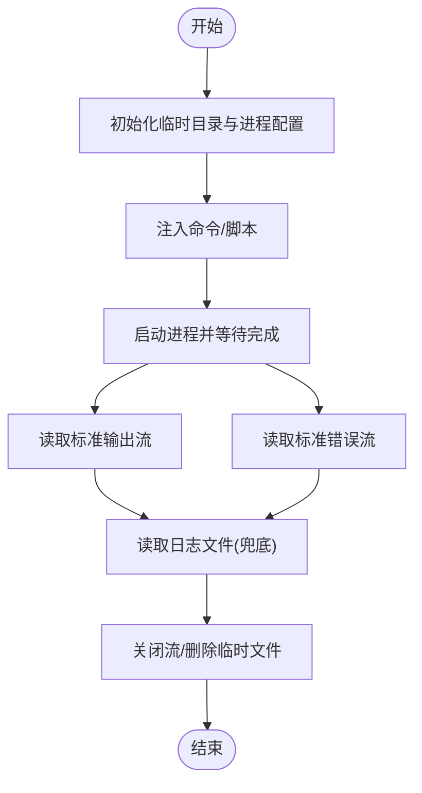
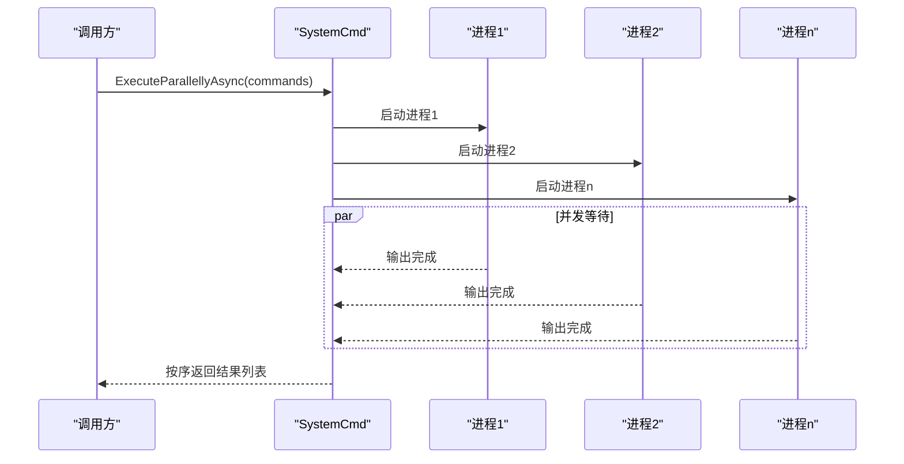
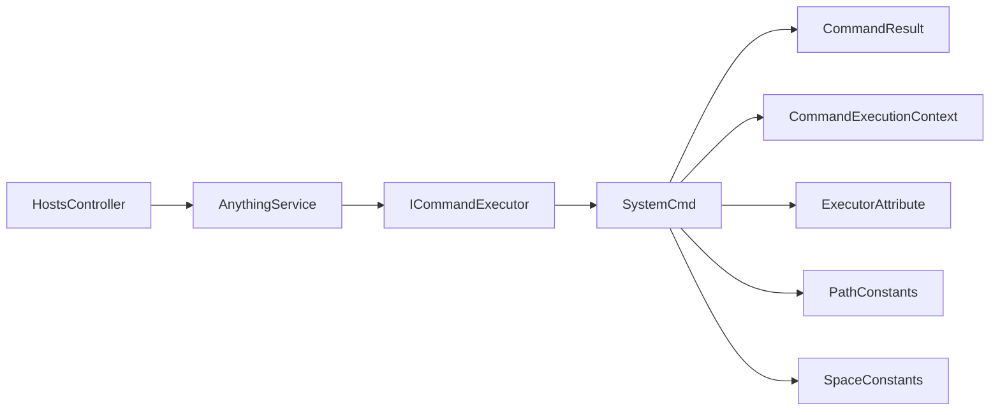

# 系统命令执行器

<cite>
**本文档引用的文件**
- [SystemCmd.cs](file://Sylas.RemoteTasks.Utils/CommandExecutor/SystemCmd.cs)
- [CommandResult.cs](file://Sylas.RemoteTasks.Utils/CommandExecutor/CommandResult.cs)
- [CommandExecutionContext.cs](file://Sylas.RemoteTasks.Utils/CommandExecutor/CommandExecutionContext.cs)
- [ICommandExecutor.cs](file://Sylas.RemoteTasks.Utils/CommandExecutor/ICommandExecutor.cs)
- [ExecutorAttribute.cs](file://Sylas.RemoteTasks.Utils/CommandExecutor/ExecutorAttribute.cs)
- [HostsController.cs](file://Sylas.RemoteTasks.App/Controllers/HostsController.cs)
- [AnythingService.cs](file://Sylas.RemoteTasks.App/RemoteHostModule/Anything/AnythingService.cs)
- [ShellTest.cs](file://Sylas.RemoteTasks.Test/SystemHelperTest/ShellTest.cs)
- [PathConstants.cs](file://Sylas.RemoteTasks.Utils/Constants/PathConstants.cs)
- [SpaceConstants.cs](file://Sylas.RemoteTasks.Utils/Constants/SpaceConstants.cs)
</cite>

## 更新摘要
**所做更改**
- 新增 CommandExecutionContext 类的详细说明，包含环境变量上下文管理
- 更新 CommandResult 类的使用说明，强调命令执行编号的并发匹配功能
- 增强 ICommandExecutor 接口的动态执行器创建机制说明
- 补充 ExecutorAttribute 特性的依赖注入支持
- 更新实际使用示例，展示流式命令执行和并发处理

## 目录
1. [简介](#简介)
2. [项目结构](#项目结构)
3. [核心组件](#核心组件)
4. [架构概览](#架构概览)
5. [详细组件分析](#详细组件分析)
6. [依赖关系分析](#依赖关系分析)
7. [性能考量](#性能考量)
8. [故障排查指南](#故障排查指南)
9. [结论](#结论)
10. [附录](#附录)

## 简介
本文件针对系统命令执行器进行深入技术文档化，重点围绕 SystemCmd 类展开，涵盖以下主题：
- 异步命令执行与流式输出
- 并行执行与并发安全
- 进程监控与资源清理
- 跨平台兼容（Windows PowerShell 与 Linux bash）
- 临时文件管理与内存泄漏防护
- 实际使用示例（单命令、批量、并行）
- 性能优化、超时控制与并发安全建议

**更新** 本次更新增强了 CommandExecutor 组件的功能，新增了 CommandExecutionContext 上下文管理和 CommandResult 的并发匹配能力。

## 项目结构
SystemCmd 位于 Utils 层的 CommandExecutor 命名空间中，作为通用命令执行基础设施，向上层控制器与业务服务提供统一的命令执行能力。

**图表来源**
- [HostsController.cs:83-122](file://Sylas.RemoteTasks.App/Controllers/HostsController.cs#L83-L122)
- [AnythingService.cs:595-620](file://Sylas.RemoteTasks.App/RemoteHostModule/Anything/AnythingService.cs#L595-L620)
- [SystemCmd.cs:23-86](file://Sylas.RemoteTasks.Utils/CommandExecutor/SystemCmd.cs#L23-L86)
- [ICommandExecutor.cs:13-71](file://Sylas.RemoteTasks.Utils/CommandExecutor/ICommandExecutor.cs#L13-L71)
- [CommandResult.cs:6-36](file://Sylas.RemoteTasks.Utils/CommandExecutor/CommandResult.cs#L6-L36)
- [CommandExecutionContext.cs:9-15](file://Sylas.RemoteTasks.Utils/CommandExecutor/CommandExecutionContext.cs#L9-L15)
- [ExecutorAttribute.cs:10-22](file://Sylas.RemoteTasks.Utils/CommandExecutor/ExecutorAttribute.cs#L10-L22)
- [PathConstants.cs:9-24](file://Sylas.RemoteTasks.Utils/Constants/PathConstants.cs#L9-L24)
- [SpaceConstants.cs:6-48](file://Sylas.RemoteTasks.Utils/Constants/SpaceConstants.cs#L6-L48)

**章节来源**
- [SystemCmd.cs:1-788](file://Sylas.RemoteTasks.Utils/CommandExecutor/SystemCmd.cs#L1-L788)
- [HostsController.cs:1-467](file://Sylas.RemoteTasks.App/Controllers/HostsController.cs#L1-L467)
- [AnythingService.cs:1-683](file://Sylas.RemoteTasks.App/RemoteHostModule/Anything/AnythingService.cs#L1-L683)

## 核心组件
- SystemCmd：命令执行器主体，提供异步单命令执行、批量执行、并行执行、进程监控、主机信息采集等能力。
- ICommandExecutor：命令执行器接口，定义 ExecuteAsync 签名及动态创建工厂方法。
- CommandResult：命令执行结果封装，包含成功标志、消息与执行编号，便于客户端并发匹配。
- CommandExecutionContext：命令执行上下文，包含环境变量等执行所需的信息。
- ExecutorAttribute：自定义特性，用于指定类为命令执行器并支持依赖注入。

**更新** 新增了 CommandExecutionContext 和 ExecutorAttribute 组件，增强了命令执行的上下文管理和依赖注入支持。

**章节来源**
- [SystemCmd.cs:23-86](file://Sylas.RemoteTasks.Utils/CommandExecutor/SystemCmd.cs#L23-L86)
- [ICommandExecutor.cs:13-71](file://Sylas.RemoteTasks.Utils/CommandExecutor/ICommandExecutor.cs#L13-L71)
- [CommandResult.cs:6-36](file://Sylas.RemoteTasks.Utils/CommandExecutor/CommandResult.cs#L6-L36)
- [CommandExecutionContext.cs:9-15](file://Sylas.RemoteTasks.Utils/CommandExecutor/CommandExecutionContext.cs#L9-L15)
- [ExecutorAttribute.cs:10-22](file://Sylas.RemoteTasks.Utils/CommandExecutor/ExecutorAttribute.cs#L10-L22)
- [PathConstants.cs:9-24](file://Sylas.RemoteTasks.Utils/Constants/PathConstants.cs#L9-L24)
- [SpaceConstants.cs:6-48](file://Sylas.RemoteTasks.Utils/Constants/SpaceConstants.cs#L6-L48)

## 架构概览
SystemCmd 通过 ProcessStartInfo 启动宿主 shell（Windows 使用 powershell.exe，Linux 使用 /bin/bash），采用标准输入/输出重定向实现命令注入与结果捕获。执行器支持：
- 流式异步输出（IAsyncEnumerable）
- 批量串行执行
- 并行执行（多进程并发）
- 进程级 CPU/内存监控
- 主机信息采集（CPU/内存/磁盘/网络）

**图表来源**
- [HostsController.cs:83-122](file://Sylas.RemoteTasks.App/Controllers/HostsController.cs#L83-L122)
- [AnythingService.cs:595-620](file://Sylas.RemoteTasks.App/RemoteHostModule/Anything/AnythingService.cs#L595-L620)
- [SystemCmd.cs:129-138](file://Sylas.RemoteTasks.Utils/CommandExecutor/SystemCmd.cs#L129-L138)

## 详细组件分析

### SystemCmd 类设计与实现
- 异步单命令执行
  - ExecuteSingleCommandAsync：逐行读取标准输出，过滤掉 shell 自身提示，将日志文件内容作为最终输出。
  - 输出捕获：通过 UTF-8 编码的标准输出流与临时日志文件双通道保证完整性。
- 批量串行执行
  - ExecuteAsync(params string[])：为每条命令生成独立脚本与日志文件，按序写入标准输入，等待进程完成后再读取输出。
- 并行执行
  - ExecuteParallellyAsync：为每个命令创建独立进程，使用 Task.WhenAll 并发等待，通过 ConcurrentBag 有序收集输出。
- 进程监控
  - GetProcessCpuAndRamAsync：对指定名称进程采样两次，计算平均 CPU 使用率与内存占用。
- 主机信息采集
  - GetServerAndAppInfoAsync：聚合 CPU/内存/磁盘/网络等信息，区分 Unix 与 Windows 的采集命令。
- 跨平台兼容
  - 通过 RuntimeInformation 判断平台，选择 powershell.exe 或 /bin/bash；Windows 使用正则匹配路径模式。
- 临时文件管理
  - 为每次执行创建带时间戳的临时目录，执行完成后仅保留最近 10 个临时目录，其余删除。
- 资源清理
  - 使用 using 语句确保 Process 实例释放；关闭 StandardInput AutoFlush 后及时 Close；读取完成后读尽标准输出/错误流。

**更新** 增强了命令执行的上下文管理，通过 CommandExecutionContext 支持环境变量传递。

**图表来源**
- [SystemCmd.cs:23-86](file://Sylas.RemoteTasks.Utils/CommandExecutor/SystemCmd.cs#L23-L86)
- [ICommandExecutor.cs:13-71](file://Sylas.RemoteTasks.Utils/CommandExecutor/ICommandExecutor.cs#L13-L71)
- [CommandResult.cs:6-36](file://Sylas.RemoteTasks.Utils/CommandExecutor/CommandResult.cs#L6-L36)
- [CommandExecutionContext.cs:9-15](file://Sylas.RemoteTasks.Utils/CommandExecutor/CommandExecutionContext.cs#L9-L15)

**章节来源**
- [SystemCmd.cs:129-295](file://Sylas.RemoteTasks.Utils/CommandExecutor/SystemCmd.cs#L129-L295)
- [SystemCmd.cs:301-379](file://Sylas.RemoteTasks.Utils/CommandExecutor/SystemCmd.cs#L301-L379)
- [SystemCmd.cs:386-417](file://Sylas.RemoteTasks.Utils/CommandExecutor/SystemCmd.cs#L386-L417)
- [SystemCmd.cs:630-648](file://Sylas.RemoteTasks.Utils/CommandExecutor/SystemCmd.cs#L630-L648)

### 命令执行生命周期与输出捕获
- 生命周期阶段
  - 初始化：创建临时目录，配置 ProcessStartInfo（重定向 IO、UTF-8 编码、隐藏窗口）。
  - 注入命令：将命令写入标准输入或生成 PowerShell 脚本文件。
  - 执行与监控：等待进程结束，读取标准输出/错误流，必要时读取临时日志文件。
  - 清理：关闭流、删除临时文件与目录。
- 输出捕获策略
  - 标准输出流逐行读取，过滤 shell 自身提示，避免将交互提示混入结果。
  - 日志文件作为兜底，确保即使标准流异常也能获取完整输出。

**图表来源**
- [SystemCmd.cs:144-221](file://Sylas.RemoteTasks.Utils/CommandExecutor/SystemCmd.cs#L144-L221)
- [SystemCmd.cs:227-295](file://Sylas.RemoteTasks.Utils/CommandExecutor/SystemCmd.cs#L227-L295)

**章节来源**
- [SystemCmd.cs:144-221](file://Sylas.RemoteTasks.Utils/CommandExecutor/SystemCmd.cs#L144-L221)
- [SystemCmd.cs:227-295](file://Sylas.RemoteTasks.Utils/CommandExecutor/SystemCmd.cs#L227-L295)

### 并行执行与并发安全
- 并行策略
  - 为每个命令创建独立 Process 实例，使用 Task.WhenAll 并发等待，提升吞吐。
  - 使用 ConcurrentBag 保存输出，按命令索引排序保证结果顺序一致性。
- 并发安全
  - 通过 using 确保进程资源释放，避免句柄泄漏。
  - 通过 UTF-8 编码与独立日志文件避免多进程间输出交错。
- 注意事项
  - 并行执行会显著增加系统负载，应结合 CPU/内存监控合理限制并发度。

**图表来源**
- [SystemCmd.cs:301-379](file://Sylas.RemoteTasks.Utils/CommandExecutor/SystemCmd.cs#L301-L379)

**章节来源**
- [SystemCmd.cs:301-379](file://Sylas.RemoteTasks.Utils/CommandExecutor/SystemCmd.cs#L301-L379)

### 跨平台兼容性
- 平台检测
  - 通过 RuntimeInformation 判断是否 Unix/Linux，选择 powershell.exe 或 /bin/bash。
- Windows 特性
  - 使用正则匹配路径模式，确保命令提示符识别准确。
  - 通过 chcp 65001 设置代码页，保障 UTF-8 输出。
- Linux 特性
  - 使用 df/free/top/wmic 等命令采集磁盘、内存、CPU 使用情况。
- 路径与缩进
  - PathConstants 提供用户家目录与 SSH 私钥路径常量。
  - SpaceConstants 提供 Tab 缩进空格常量，用于脚本格式化。

**章节来源**
- [SystemCmd.cs:123-123](file://Sylas.RemoteTasks.Utils/CommandExecutor/SystemCmd.cs#L123-L123)
- [SystemCmd.cs:154-154](file://Sylas.RemoteTasks.Utils/CommandExecutor/SystemCmd.cs#L154-L154)
- [SystemCmd.cs:509-535](file://Sylas.RemoteTasks.Utils/CommandExecutor/SystemCmd.cs#L509-L535)
- [SystemCmd.cs:569-617](file://Sylas.RemoteTasks.Utils/CommandExecutor/SystemCmd.cs#L569-L617)
- [PathConstants.cs:14-18](file://Sylas.RemoteTasks.Utils/Constants/PathConstants.cs#L14-L18)
- [SpaceConstants.cs:23-23](file://Sylas.RemoteTasks.Utils/Constants/SpaceConstants.cs#L23-L23)

### 进程监控与资源清理
- 进程监控
  - GetProcessCpuAndRamAsync：对指定名称进程采样两次，计算 CPU 使用率与内存占用。
- 资源清理
  - using 语句确保 Process 实例释放。
  - 关闭 StandardInput AutoFlush 后立即 Close，避免阻塞。
  - 读取标准输出/错误流至 EOF，防止死锁。
  - 临时目录清理：仅保留最近 10 个，其余删除。

**章节来源**
- [SystemCmd.cs:386-417](file://Sylas.RemoteTasks.Utils/CommandExecutor/SystemCmd.cs#L386-L417)
- [SystemCmd.cs:211-218](file://Sylas.RemoteTasks.Utils/CommandExecutor/SystemCmd.cs#L211-L218)

### 实际使用示例
- 单命令执行
  - 使用 ExecuteSingleCommandAsync 获取流式输出，适合实时展示命令执行过程。
- 批量命令执行
  - 使用 ExecuteAsync 执行多条命令，按序返回每条命令的输出。
- 并行命令执行
  - 使用 ExecuteParallellyAsync 并发执行多条命令，适合高吞吐场景。
- 控制器集成
  - HostsController 通过 SSE 推送 CommandResult，支持客户端断开与取消。

**更新** 增强了命令执行的上下文管理，支持通过 CommandExecutionContext 传递环境变量。

**章节来源**
- [HostsController.cs:83-122](file://Sylas.RemoteTasks.App/Controllers/HostsController.cs#L83-L122)
- [ShellTest.cs:12-65](file://Sylas.RemoteTasks.Test/SystemHelperTest/ShellTest.cs#L12-L65)
- [SystemCmd.cs:129-138](file://Sylas.RemoteTasks.Utils/CommandExecutor/SystemCmd.cs#L129-L138)
- [SystemCmd.cs:144-221](file://Sylas.RemoteTasks.Utils/CommandExecutor/SystemCmd.cs#L144-L221)
- [SystemCmd.cs:301-379](file://Sylas.RemoteTasks.Utils/CommandExecutor/SystemCmd.cs#L301-L379)

## 依赖关系分析
- SystemCmd 依赖
  - SystemCmd 实现 ICommandExecutor 接口，向上层提供统一的 ExecuteAsync 签名。
  - 通过 AnythingService 动态创建执行器实例，并将命令模板解析后的参数传入。
  - 使用 PathConstants 与 SpaceConstants 提供路径与缩进常量。
- 上层调用链
  - HostsController -> AnythingService -> SystemCmd（ICommandExecutor.GetCommandHandler 动态创建）。

**图表来源**
- [HostsController.cs:83-122](file://Sylas.RemoteTasks.App/Controllers/HostsController.cs#L83-L122)
- [AnythingService.cs:595-620](file://Sylas.RemoteTasks.App/RemoteHostModule/Anything/AnythingService.cs#L595-L620)
- [ICommandExecutor.cs:30-70](file://Sylas.RemoteTasks.Utils/CommandExecutor/ICommandExecutor.cs#L30-L70)
- [SystemCmd.cs:23-86](file://Sylas.RemoteTasks.Utils/CommandExecutor/SystemCmd.cs#L23-L86)
- [CommandResult.cs:6-36](file://Sylas.RemoteTasks.Utils/CommandExecutor/CommandResult.cs#L6-L36)
- [CommandExecutionContext.cs:9-15](file://Sylas.RemoteTasks.Utils/CommandExecutor/CommandExecutionContext.cs#L9-L15)
- [ExecutorAttribute.cs:10-22](file://Sylas.RemoteTasks.Utils/CommandExecutor/ExecutorAttribute.cs#L10-L22)
- [PathConstants.cs:9-24](file://Sylas.RemoteTasks.Utils/Constants/PathConstants.cs#L9-L24)
- [SpaceConstants.cs:6-48](file://Sylas.RemoteTasks.Utils/Constants/SpaceConstants.cs#L6-L48)

**章节来源**
- [ICommandExecutor.cs:30-71](file://Sylas.RemoteTasks.Utils/CommandExecutor/ICommandExecutor.cs#L30-L71)
- [AnythingService.cs:595-620](file://Sylas.RemoteTasks.App/RemoteHostModule/Anything/AnythingService.cs#L595-L620)

## 性能考量
- 并发度控制
  - 并行执行会显著增加 CPU/IO 压力，建议根据机器配置限制并发数。
- I/O 优化
  - 使用 UTF-8 编码减少字符集转换开销；避免在循环中频繁写文件，尽量合并输出。
- 进程复用
  - 当前实现为每条命令创建独立进程，若存在大量短命令，可考虑复用进程以降低启动成本。
- 超时与取消
  - 建议在上层控制器或服务层引入 CancellationToken 与超时控制，避免长时间阻塞。
- 临时文件清理
  - 仅保留最近 10 个临时目录，避免磁盘空间膨胀。

**更新** 增强了并发处理的性能考量，特别是在 CommandResult 的并发匹配方面。

**章节来源**
- [SystemCmd.cs:301-379](file://Sylas.RemoteTasks.Utils/CommandExecutor/SystemCmd.cs#L301-L379)
- [SystemCmd.cs:211-218](file://Sylas.RemoteTasks.Utils/CommandExecutor/SystemCmd.cs#L211-L218)

## 故障排查指南
- 常见问题
  - 输出为空：确认命令执行是否成功，检查日志文件是否存在；核对 UTF-8 编码设置。
  - 并发阻塞：检查是否遗漏读取标准输出/错误流至 EOF；确认 Task.WhenAll 是否正确等待。
  - 跨平台差异：Windows 使用 powershell.exe，Linux 使用 bash；确保命令语法兼容。
  - 并发匹配问题：检查 CommandExecuteNo 是否正确传递，确保客户端能够正确匹配命令和结果。
- 建议排查步骤
  - 在控制器层启用 SSE 并观察实时输出。
  - 在服务层记录命令执行耗时与结果集合长度。
  - 使用进程监控接口验证目标进程是否存在且资源占用正常。

**更新** 新增了 CommandResult 并发匹配问题的排查指导。

**章节来源**
- [HostsController.cs:83-122](file://Sylas.RemoteTasks.App/Controllers/HostsController.cs#L83-L122)
- [AnythingService.cs:595-620](file://Sylas.RemoteTasks.App/RemoteHostModule/Anything/AnythingService.cs#L595-L620)
- [SystemCmd.cs:386-417](file://Sylas.RemoteTasks.Utils/CommandExecutor/SystemCmd.cs#L386-L417)

## 结论
SystemCmd 提供了跨平台、异步、可并行的命令执行能力，配合流式输出与进程监控，满足复杂运维场景需求。通过合理的并发度控制、超时与取消机制以及严格的资源清理策略，可在保证稳定性的同时获得良好性能表现。

**更新** 新增的 CommandExecutionContext 和 CommandResult 增强功能进一步提升了命令执行的灵活性和可靠性，特别是在并发环境下的上下文管理和结果匹配方面。

## 附录
- 命令执行器接口契约
  - ExecuteAsync：统一的异步执行签名，返回 IAsyncEnumerable<CommandResult>。
  - GetCommandHandler：基于执行器名称与参数动态创建执行器实例。
- 结果封装
  - CommandResult：包含执行成功标志、消息与执行编号，便于客户端并发匹配。
  - CommandExecutionContext：包含环境变量等执行上下文信息。
- 执行器特性
  - ExecutorAttribute：支持依赖注入的命令执行器标识特性。

**更新** 新增了 CommandExecutionContext 和 ExecutorAttribute 的详细说明。

**章节来源**
- [ICommandExecutor.cs:13-71](file://Sylas.RemoteTasks.Utils/CommandExecutor/ICommandExecutor.cs#L13-L71)
- [CommandResult.cs:6-36](file://Sylas.RemoteTasks.Utils/CommandExecutor/CommandResult.cs#L6-L36)
- [CommandExecutionContext.cs:9-15](file://Sylas.RemoteTasks.Utils/CommandExecutor/CommandExecutionContext.cs#L9-L15)
- [ExecutorAttribute.cs:10-22](file://Sylas.RemoteTasks.Utils/CommandExecutor/ExecutorAttribute.cs#L10-L22)