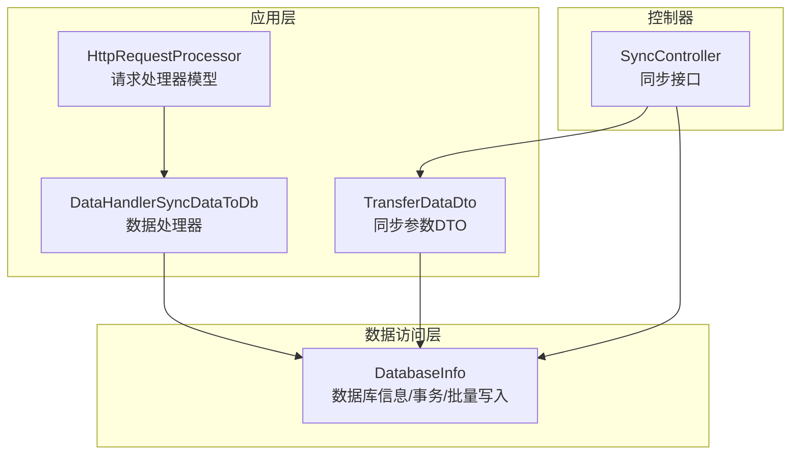
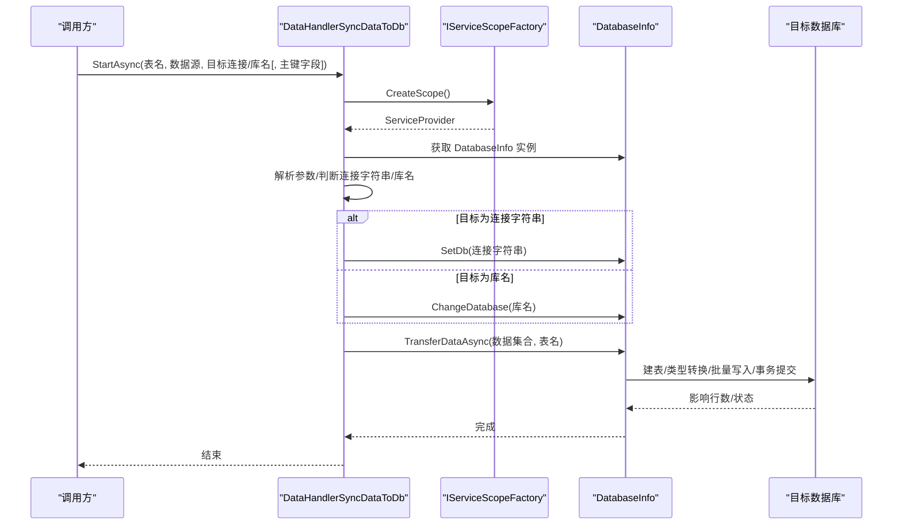
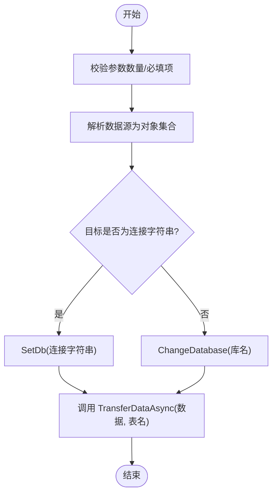
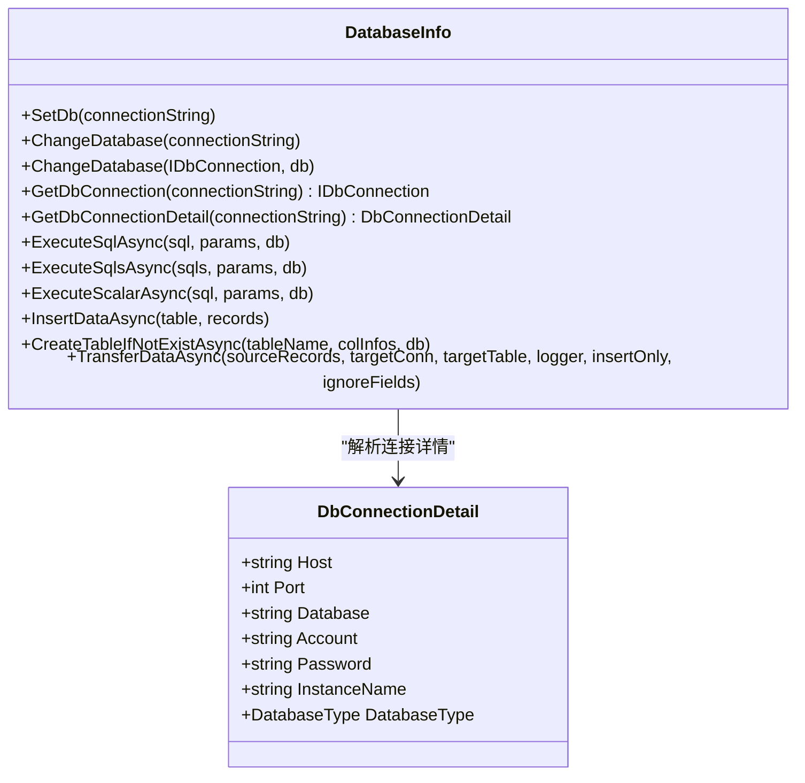
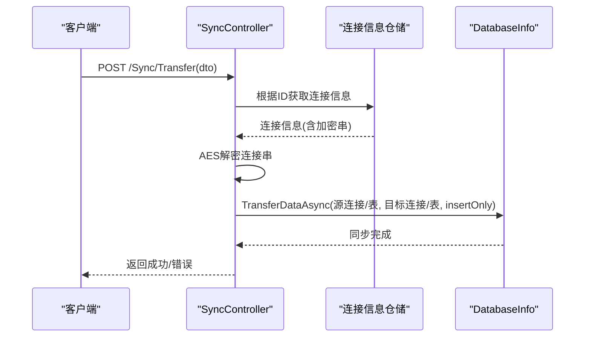
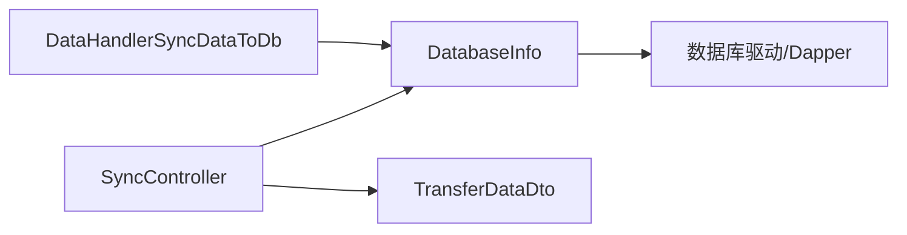

# 数据同步处理器

<cite>
**本文引用的文件**
- [DataHandlerSyncDataToDb.cs](file://Sylas.RemoteTasks.App/DataHandlers/DataHandlerSyncDataToDb.cs)
- [IDataHandler.cs](file://Sylas.RemoteTasks.App/DataHandlers/IDataHandler.cs)
- [DataHandler.cs](file://Sylas.RemoteTasks.App/DataHandlers/DataHandler.cs)
- [DatabaseInfo.cs](file://Sylas.RemoteTasks.Database/SyncBase/DatabaseInfo.cs)
- [TransferDataDto.cs](file://Sylas.RemoteTasks.Database/Dtos/TransferDataDto.cs)
- [DbConnectionDetail.cs](file://Sylas.RemoteTasks.Database/SyncBase/DbConnectionDetail.cs)
- [SyncController.cs](file://Sylas.RemoteTasks.App/Controllers/SyncController.cs)
- [DatabaseHelper.cs](file://Sylas.RemoteTasks.Database/DatabaseHelper.cs)
- [HttpRequestProcessor.cs](file://Sylas.RemoteTasks.App/RequestProcessor/Models/HttpRequestProcessor.cs)
- [BatchesScheme.cs](file://Sylas.RemoteTasks.Common/BatchesScheme.cs)
- [DatabaseConstants.cs](file://Sylas.RemoteTasks.Utils/Constants/DatabaseConstants.cs)
- [SyncFromDbToDbOptions.cs](file://Sylas.RemoteTasks.Test/AppSettingsOptions/SyncFromDbToDbOptions.cs)
</cite>

## 目录
1. [简介](#简介)
2. [项目结构](#项目结构)
3. [核心组件](#核心组件)
4. [架构总览](#架构总览)
5. [详细组件分析](#详细组件分析)
6. [依赖分析](#依赖分析)
7. [性能考虑](#性能考虑)
8. [故障排查指南](#故障排查指南)
9. [结论](#结论)
10. [附录](#附录)

## 简介
本技术文档围绕“数据同步处理器”展开，重点阐述 DataHandlerSyncDataToDb 的数据同步算法与实现原理，覆盖以下主题：
- 流程控制：参数校验、数据源解析、目标数据库选择与切换
- 增量同步策略：基于主键的映射与批量写入
- 冲突解决机制：忽略字段、类型转换、自动补齐主键与时间戳
- 同步配置参数：表名、数据源、目标数据库、主键字段、仅插入模式
- 数据映射规则与转换逻辑：列名匹配、类型转换、日期格式兼容
- 连接管理、事务处理与回滚机制：连接池、事务封装、异常回滚
- 使用示例与最佳实践：控制器接口、模板执行、批量处理
- 性能优化策略：分页批处理、并发分片、参数上限规避
- 错误恢复机制：异常捕获、日志记录、回滚策略
- 与其他处理器的协作关系：请求处理器链路、数据流转

## 项目结构
该功能涉及三层模块：
- 应用层处理器：DataHandlerSyncDataToDb 实现具体同步逻辑入口
- 数据访问层：DatabaseInfo 提供数据库连接、事务、批量写入等能力
- 控制器与DTO：SyncController 接收外部请求，TransferDataDto 描述同步参数

图表来源
- [DataHandlerSyncDataToDb.cs](file://Sylas.RemoteTasks.App/DataHandlers/DataHandlerSyncDataToDb.cs#L1-L65)
- [DatabaseInfo.cs](file://Sylas.RemoteTasks.Database/SyncBase/DatabaseInfo.cs#L1464-L1659)
- [TransferDataDto.cs](file://Sylas.RemoteTasks.Database/Dtos/TransferDataDto.cs#L1-L30)
- [SyncController.cs](file://Sylas.RemoteTasks.App/Controllers/SyncController.cs#L370-L412)
- [HttpRequestProcessor.cs](file://Sylas.RemoteTasks.App/RequestProcessor/Models/HttpRequestProcessor.cs#L1-L22)

章节来源
- [DataHandlerSyncDataToDb.cs](file://Sylas.RemoteTasks.App/DataHandlers/DataHandlerSyncDataToDb.cs#L1-L65)
- [DatabaseInfo.cs](file://Sylas.RemoteTasks.Database/SyncBase/DatabaseInfo.cs#L1464-L1659)
- [TransferDataDto.cs](file://Sylas.RemoteTasks.Database/Dtos/TransferDataDto.cs#L1-L30)
- [SyncController.cs](file://Sylas.RemoteTasks.App/Controllers/SyncController.cs#L370-L412)
- [HttpRequestProcessor.cs](file://Sylas.RemoteTasks.App/RequestProcessor/Models/HttpRequestProcessor.cs#L1-L22)

## 核心组件
- DataHandlerSyncDataToDb：实现 IDataHandler 接口，负责解析参数、选择目标数据库、调用 DatabaseInfo 执行数据同步
- DatabaseInfo：提供数据库连接、事务、批量插入、表结构推断、类型转换、主键/时间戳处理等能力
- TransferDataDto：描述源/目标连接、源/目标表、仅插入模式等同步参数
- SyncController：对外提供同步接口，支持单表或多表同步、AES解密连接串、日志与返回结果
- DatabaseHelper：提供记录对比、插入/更新/删除SQL构建辅助（用于对比同步场景）
- HttpRequestProcessor：请求处理器模型，承载步骤与数据处理器链路

章节来源
- [IDataHandler.cs](file://Sylas.RemoteTasks.App/DataHandlers/IDataHandler.cs#L1-L8)
- [DataHandler.cs](file://Sylas.RemoteTasks.App/DataHandlers/DataHandler.cs#L1-L16)
- [DatabaseInfo.cs](file://Sylas.RemoteTasks.Database/SyncBase/DatabaseInfo.cs#L1464-L1659)
- [TransferDataDto.cs](file://Sylas.RemoteTasks.Database/Dtos/TransferDataDto.cs#L1-L30)
- [SyncController.cs](file://Sylas.RemoteTasks.App/Controllers/SyncController.cs#L370-L412)
- [DatabaseHelper.cs](file://Sylas.RemoteTasks.Database/DatabaseHelper.cs#L69-L164)
- [HttpRequestProcessor.cs](file://Sylas.RemoteTasks.App/RequestProcessor/Models/HttpRequestProcessor.cs#L1-L22)

## 架构总览
DataHandlerSyncDataToDb 通过服务作用域获取 DatabaseInfo，根据传入参数决定目标数据库连接或数据库名切换，并调用 TransferDataAsync 完成数据同步。

图表来源
- [DataHandlerSyncDataToDb.cs](file://Sylas.RemoteTasks.App/DataHandlers/DataHandlerSyncDataToDb.cs#L11-L62)
- [DatabaseInfo.cs](file://Sylas.RemoteTasks.Database/SyncBase/DatabaseInfo.cs#L1464-L1659)

章节来源
- [DataHandlerSyncDataToDb.cs](file://Sylas.RemoteTasks.App/DataHandlers/DataHandlerSyncDataToDb.cs#L11-L62)
- [DatabaseInfo.cs](file://Sylas.RemoteTasks.Database/SyncBase/DatabaseInfo.cs#L1464-L1659)

## 详细组件分析

### DataHandlerSyncDataToDb：数据同步处理器
- 参数要求
  - 必填：表名、数据源（可为单对象或集合）、目标数据库（连接字符串或库名）
  - 可选：主键字段，默认“id”
- 数据源解析
  - 若数据源为集合，则按对象枚举；否则包装为单元素集合
- 目标数据库选择
  - 若包含特定关键字（如“data source=”、“initial catalog=”、“server=”），视为连接字符串，调用 SetDb
  - 否则视为库名，调用 ChangeDatabase
- 调用链
  - 最终调用 DatabaseInfo.TransferDataAsync 执行同步

图表来源
- [DataHandlerSyncDataToDb.cs](file://Sylas.RemoteTasks.App/DataHandlers/DataHandlerSyncDataToDb.cs#L18-L62)

章节来源
- [DataHandlerSyncDataToDb.cs](file://Sylas.RemoteTasks.App/DataHandlers/DataHandlerSyncDataToDb.cs#L18-L62)

### DatabaseInfo：同步核心引擎
- 连接管理
  - 支持多种数据库类型，按连接字符串自动识别类型
  - 提供连接工厂方法与连接详情解析
- 事务与回滚
  - 所有写操作在事务内执行，异常时回滚并抛出
- 批量写入与分页
  - 自动按列数与参数上限（约2000）计算分页大小
  - 将源数据分块，生成批量SQL并执行
- 映射与转换
  - 自动推断目标表列信息，建立目标列与源键的映射
  - 按目标表字段类型进行字符串到目标类型的转换
  - 支持忽略字段、自动补齐主键、自动写入创建/更新时间
- 增量策略
  - 通过主键集合与类型转换器确定主键字段，作为去重与更新依据
  - 未显式指定主键时，退化为主键集合或全部列集合

图表来源
- [DatabaseInfo.cs](file://Sylas.RemoteTasks.Database/SyncBase/DatabaseInfo.cs#L149-L299)
- [DbConnectionDetail.cs](file://Sylas.RemoteTasks.Database/SyncBase/DbConnectionDetail.cs#L1-L55)

章节来源
- [DatabaseInfo.cs](file://Sylas.RemoteTasks.Database/SyncBase/DatabaseInfo.cs#L149-L299)
- [DatabaseInfo.cs](file://Sylas.RemoteTasks.Database/SyncBase/DatabaseInfo.cs#L1464-L1659)
- [DbConnectionDetail.cs](file://Sylas.RemoteTasks.Database/SyncBase/DbConnectionDetail.cs#L1-L55)

### 同步配置参数与数据映射
- 配置参数（TransferDataDto）
  - 源/目标连接字符串、源/目标表名、仅插入模式
- 数据映射规则
  - 目标表列与源键名大小写无关的精确匹配
  - 忽略字段列表生效，避免写入目标表中不需要的列
  - 类型转换：按目标表字段类型进行字符串转换，日期格式兼容处理
- 转换逻辑
  - 字段类型转换器缓存，避免重复反射
  - 自动补齐主键（字符串主键用时间戳拼接），自动写入创建/更新时间

章节来源
- [TransferDataDto.cs](file://Sylas.RemoteTasks.Database/Dtos/TransferDataDto.cs#L1-L30)
- [DatabaseInfo.cs](file://Sylas.RemoteTasks.Database/SyncBase/DatabaseInfo.cs#L1487-L1523)
- [DatabaseInfo.cs](file://Sylas.RemoteTasks.Database/SyncBase/DatabaseInfo.cs#L1554-L1659)

### 增量同步策略与冲突解决
- 增量策略
  - 通过主键集合与类型转换器确定主键字段，作为去重与更新依据
  - 未显式指定主键时，退化为主键集合或全部列集合
- 冲突解决
  - 仅插入模式：跳过更新，避免覆盖
  - 忽略字段：对目标表中指定字段不写入
  - 类型转换：确保写入目标表字段类型一致
  - 自动补齐主键与时间戳：保证主键唯一性与审计字段完整性

章节来源
- [DatabaseInfo.cs](file://Sylas.RemoteTasks.Database/SyncBase/DatabaseInfo.cs#L1498-L1503)
- [DatabaseInfo.cs](file://Sylas.RemoteTasks.Database/SyncBase/DatabaseInfo.cs#L1634-L1659)

### 连接管理、事务处理与回滚机制
- 连接管理
  - 支持多种数据库类型，自动识别连接字符串类型
  - 连接详情解析，便于后续切换数据库或构造连接
- 事务处理
  - 写操作统一在事务内执行，异常回滚
- 回滚机制
  - 执行失败时主动回滚，保证一致性

章节来源
- [DatabaseInfo.cs](file://Sylas.RemoteTasks.Database/SyncBase/DatabaseInfo.cs#L372-L400)
- [DatabaseInfo.cs](file://Sylas.RemoteTasks.Database/SyncBase/DatabaseInfo.cs#L408-L433)
- [DatabaseInfo.cs](file://Sylas.RemoteTasks.Database/SyncBase/DatabaseInfo.cs#L454-L476)

### 与控制器的协作与数据流转
- SyncController 提供同步接口，支持：
  - 单表或多表同步
  - AES解密连接字符串
  - 返回标准化结果
- 数据流转
  - 控制器接收 TransferDataDto，解析并调用 DatabaseInfo.TransferDataAsync
  - 支持从JSON文件批量导入并并行处理

图表来源
- [SyncController.cs](file://Sylas.RemoteTasks.App/Controllers/SyncController.cs#L370-L412)
- [TransferDataDto.cs](file://Sylas.RemoteTasks.Database/Dtos/TransferDataDto.cs#L1-L30)
- [DatabaseInfo.cs](file://Sylas.RemoteTasks.Database/SyncBase/DatabaseInfo.cs#L1464-L1659)

章节来源
- [SyncController.cs](file://Sylas.RemoteTasks.App/Controllers/SyncController.cs#L370-L412)
- [TransferDataDto.cs](file://Sylas.RemoteTasks.Database/Dtos/TransferDataDto.cs#L1-L30)
- [DatabaseInfo.cs](file://Sylas.RemoteTasks.Database/SyncBase/DatabaseInfo.cs#L1464-L1659)

### 与其他处理器的协作关系
- 请求处理器链路
  - HttpRequestProcessor 定义处理器、步骤、数据处理器
  - DataHandlerSyncDataToDb 作为数据处理器之一参与步骤执行
- 模板执行与参数传递
  - 模板中调用 DatabaseInfo.TransferDataAsync 时，需满足参数数量与命名约定

章节来源
- [HttpRequestProcessor.cs](file://Sylas.RemoteTasks.App/RequestProcessor/Models/HttpRequestProcessor.cs#L1-L22)
- [DataHandlerSyncDataToDb.cs](file://Sylas.RemoteTasks.App/DataHandlers/DataHandlerSyncDataToDb.cs#L18-L62)

## 依赖分析
- 组件耦合
  - DataHandlerSyncDataToDb 依赖 DatabaseInfo（通过服务作用域注入）
  - SyncController 依赖 TransferDataDto 与 DatabaseInfo
  - DatabaseInfo 依赖连接字符串解析、类型转换器、批量分页工具
- 外部依赖
  - 多种数据库驱动（SQL Server、MySQL、Oracle、PostgreSQL、SQLite、达梦）
  - Dapper 用于ORM/SQL执行
  - 日志与配置系统

图表来源
- [DataHandlerSyncDataToDb.cs](file://Sylas.RemoteTasks.App/DataHandlers/DataHandlerSyncDataToDb.cs#L11-L15)
- [SyncController.cs](file://Sylas.RemoteTasks.App/Controllers/SyncController.cs#L370-L412)
- [DatabaseInfo.cs](file://Sylas.RemoteTasks.Database/SyncBase/DatabaseInfo.cs#L1-L28)

章节来源
- [DataHandlerSyncDataToDb.cs](file://Sylas.RemoteTasks.App/DataHandlers/DataHandlerSyncDataToDb.cs#L11-L15)
- [SyncController.cs](file://Sylas.RemoteTasks.App/Controllers/SyncController.cs#L370-L412)
- [DatabaseInfo.cs](file://Sylas.RemoteTasks.Database/SyncBase/DatabaseInfo.cs#L1-L28)

## 性能考虑
- 批量处理
  - 按列数与参数上限（约2000）计算分页大小，减少参数数量
  - 将源数据分块，生成批量SQL并顺序执行
- 并发与分片
  - 对CPU密集型任务采用多批次分片并行执行（BatchesScheme）
- 连接与事务
  - 使用连接池与短事务，降低锁竞争
- 类型转换与缓存
  - 字段类型转换器缓存，避免重复反射与字符串转换开销

章节来源
- [DatabaseInfo.cs](file://Sylas.RemoteTasks.Database/SyncBase/DatabaseInfo.cs#L1505-L1512)
- [BatchesScheme.cs](file://Sylas.RemoteTasks.Common/BatchesScheme.cs#L11-L36)

## 故障排查指南
- 常见异常与定位
  - 参数不足：检查 StartAsync 调用时的参数数量与必填项
  - 连接字符串无效：确认连接字符串关键字与数据库类型匹配
  - 表不存在：自动创建表，若失败检查目标库权限与DDL生成
  - 写入失败：查看事务回滚日志，确认异常堆栈
- 建议排查步骤
  - 校验 TransferDataDto 字段与连接信息
  - 检查 AES 解密是否成功
  - 查看日志输出与异常信息
  - 在仅插入模式下验证主键与忽略字段配置

章节来源
- [DataHandlerSyncDataToDb.cs](file://Sylas.RemoteTasks.App/DataHandlers/DataHandlerSyncDataToDb.cs#L20-L23)
- [SyncController.cs](file://Sylas.RemoteTasks.App/Controllers/SyncController.cs#L372-L390)
- [DatabaseInfo.cs](file://Sylas.RemoteTasks.Database/SyncBase/DatabaseInfo.cs#L388-L396)

## 结论
DataHandlerSyncDataToDb 通过简洁的参数模型与 DatabaseInfo 的强大能力，实现了跨数据库、多表、多模式（全量/仅插入）的高效数据同步。其核心优势包括：
- 明确的流程控制与参数校验
- 基于主键的增量策略与类型转换
- 事务保障与异常回滚
- 批量分页与并发分片的性能优化
- 与控制器与请求处理器的良好协作

## 附录

### 使用示例与配置参数说明
- 控制器接口
  - POST /Sync/Transfer
  - 请求体：TransferDataDto（源/目标连接ID、源/目标表、仅插入模式）
  - 返回：标准化结果
- 模板执行
  - 在模板中调用 DatabaseInfo.TransferDataAsync 时，确保参数数量与命名正确
- 配置要点
  - 目标连接字符串支持库名或完整连接串
  - 仅插入模式适用于避免覆盖已有数据的场景
  - 忽略字段用于排除目标表中不需要的列

章节来源
- [SyncController.cs](file://Sylas.RemoteTasks.App/Controllers/SyncController.cs#L370-L412)
- [TransferDataDto.cs](file://Sylas.RemoteTasks.Database/Dtos/TransferDataDto.cs#L1-L30)
- [DatabaseConstants.cs](file://Sylas.RemoteTasks.Utils/Constants/DatabaseConstants.cs#L1-L13)
- [SyncFromDbToDbOptions.cs](file://Sylas.RemoteTasks.Test/AppSettingsOptions/SyncFromDbToDbOptions.cs#L1-L12)