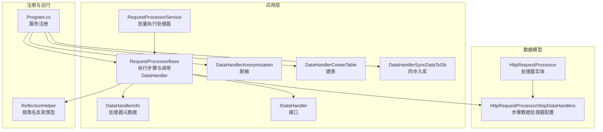
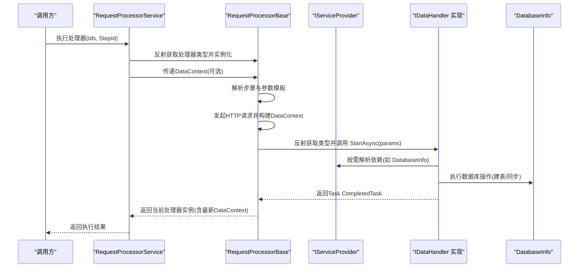
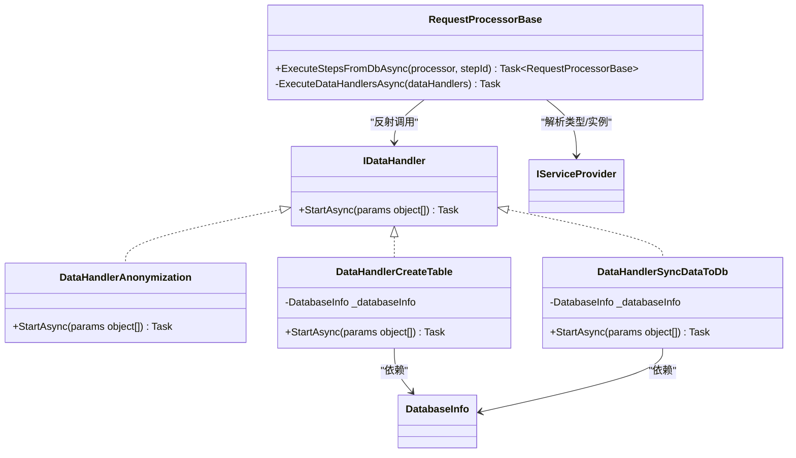
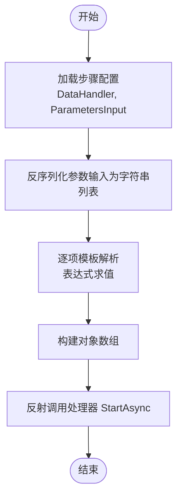
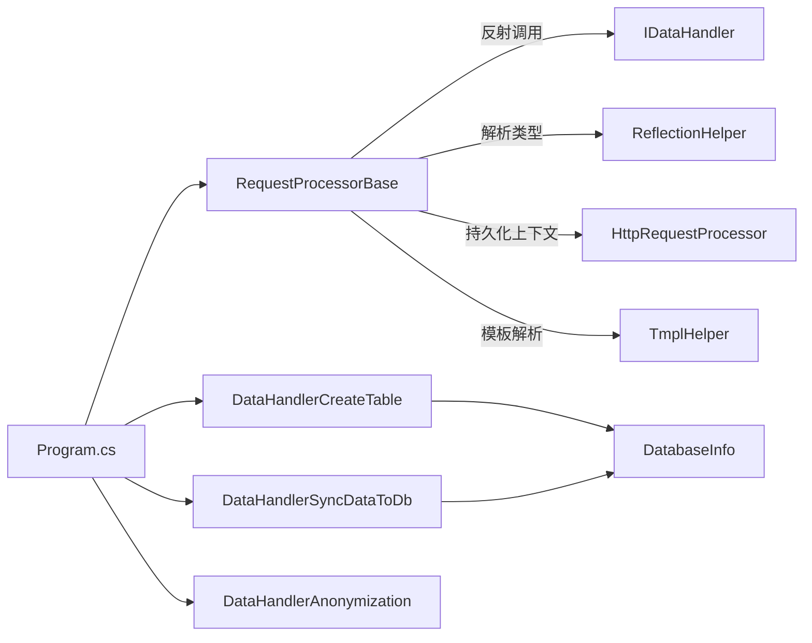

# 数据处理器接口设计

<cite>
**本文档引用的文件**
- [IDataHandler.cs](file://Sylas.RemoteTasks.App/DataHandlers/IDataHandler.cs)
- [DataHandler.cs](file://Sylas.RemoteTasks.App/DataHandlers/DataHandler.cs)
- [DataHandlerAnonymization.cs](file://Sylas.RemoteTasks.App/DataHandlers/DataHandlerAnonymization.cs)
- [DataHandlerCreateTable.cs](file://Sylas.RemoteTasks.App/DataHandlers/DataHandlerCreateTable.cs)
- [DataHandlerSyncDataToDb.cs](file://Sylas.RemoteTasks.App/DataHandlers/DataHandlerSyncDataToDb.cs)
- [Program.cs](file://Sylas.RemoteTasks.App/Program.cs)
- [RequestProcessorBase.cs](file://Sylas.RemoteTasks.App/RequestProcessor/RequestProcessorBase.cs)
- [RequestProcessorService.cs](file://Sylas.RemoteTasks.App/RequestProcessor/RequestProcessorService.cs)
- [HttpRequestProcessorStepDataHandlers.cs](file://Sylas.RemoteTasks.App/RequestProcessor/Models/HttpRequestProcessorStepDataHandlers.cs)
- [HttpRequestProcessor.cs](file://Sylas.RemoteTasks.App/RequestProcessor/Models/HttpRequestProcessor.cs)
- [ReflectionHelper.cs](file://Sylas.RemoteTasks.Utils/ReflectionHelper.cs)
</cite>

## 目录
1. [简介](#简介)
2. [项目结构](#项目结构)
3. [核心组件](#核心组件)
4. [架构总览](#架构总览)
5. [详细组件分析](#详细组件分析)
6. [依赖关系分析](#依赖关系分析)
7. [性能考量](#性能考量)
8. [故障排查指南](#故障排查指南)
9. [结论](#结论)
10. [附录：实现与集成示例](#附录实现与集成示例)

## 简介
本技术文档围绕数据处理器接口设计展开，系统阐述 IDataHandler 接口的设计理念、职责边界、方法签名与参数传递机制，并结合现有实现（脱敏、建表、同步入库）解析其异步处理模式与扩展性。文档进一步说明处理器注册机制、依赖注入配置与生命周期管理，给出最佳实践与设计模式建议，并提供可直接参考的实现路径与集成步骤。

## 项目结构
数据处理器位于应用层的 DataHandlers 命名空间内，配合请求处理器 RequestProcessor 完成“请求-数据处理”的流水线。关键文件包括：
- 接口与基础模型：IDataHandler、DataHandlerInfo
- 具体处理器：DataHandlerAnonymization、DataHandlerCreateTable、DataHandlerSyncDataToDb
- 请求处理器与执行服务：RequestProcessorBase、RequestProcessorService
- 注册入口：Program.cs
- 数据模型：HttpRequestProcessor、HttpRequestProcessorStepDataHandlers
- 反射工具：ReflectionHelper

图表来源
- [RequestProcessorBase.cs](file://Sylas.RemoteTasks.App/RequestProcessor/RequestProcessorBase.cs#L1-L279)
- [RequestProcessorService.cs](file://Sylas.RemoteTasks.App/RequestProcessor/RequestProcessorService.cs#L1-L72)
- [IDataHandler.cs](file://Sylas.RemoteTasks.App/DataHandlers/IDataHandler.cs#L1-L8)
- [DataHandler.cs](file://Sylas.RemoteTasks.App/DataHandlers/DataHandler.cs#L1-L16)
- [DataHandlerAnonymization.cs](file://Sylas.RemoteTasks.App/DataHandlers/DataHandlerAnonymization.cs#L1-L42)
- [DataHandlerCreateTable.cs](file://Sylas.RemoteTasks.App/DataHandlers/DataHandlerCreateTable.cs#L1-L34)
- [DataHandlerSyncDataToDb.cs](file://Sylas.RemoteTasks.App/DataHandlers/DataHandlerSyncDataToDb.cs#L1-L65)
- [Program.cs](file://Sylas.RemoteTasks.App/Program.cs#L1-L122)
- [ReflectionHelper.cs](file://Sylas.RemoteTasks.Utils/ReflectionHelper.cs#L1-L80)
- [HttpRequestProcessor.cs](file://Sylas.RemoteTasks.App/RequestProcessor/Models/HttpRequestProcessor.cs#L1-L22)
- [HttpRequestProcessorStepDataHandlers.cs](file://Sylas.RemoteTasks.App/RequestProcessor/Models/HttpRequestProcessorStepDataHandlers.cs#L1-L15)

章节来源
- [Program.cs](file://Sylas.RemoteTasks.App/Program.cs#L50-L53)
- [RequestProcessorBase.cs](file://Sylas.RemoteTasks.App/RequestProcessor/RequestProcessorBase.cs#L256-L276)
- [IDataHandler.cs](file://Sylas.RemoteTasks.App/DataHandlers/IDataHandler.cs#L1-L8)

## 核心组件
- IDataHandler 接口：定义统一的异步处理入口，方法签名支持可变参数列表，便于传入不同类型的处理参数。
- DataHandlerInfo：用于描述处理器名称、参数列表与执行顺序的元数据结构。
- 具体处理器：
  - DataHandlerAnonymization：基于 JSON 数据的字段脱敏处理。
  - DataHandlerCreateTable：根据列定义在目标数据库创建表。
  - DataHandlerSyncDataToDb：将数据同步写入数据库，支持连接串或目标库切换。
- RequestProcessorBase：负责按步骤执行请求、构建数据上下文，并调用 DataHandlers。
- RequestProcessorService：批量调度多个处理器实例，支持步骤级执行与上下文持久化。
- Program.cs：集中注册 DataHandlers 服务，建立 DI 生命周期。
- 反射工具：通过类名动态解析类型，支撑运行时实例化与调用。

章节来源
- [IDataHandler.cs](file://Sylas.RemoteTasks.App/DataHandlers/IDataHandler.cs#L1-L8)
- [DataHandler.cs](file://Sylas.RemoteTasks.App/DataHandlers/DataHandler.cs#L1-L16)
- [DataHandlerAnonymization.cs](file://Sylas.RemoteTasks.App/DataHandlers/DataHandlerAnonymization.cs#L1-L42)
- [DataHandlerCreateTable.cs](file://Sylas.RemoteTasks.App/DataHandlers/DataHandlerCreateTable.cs#L1-L34)
- [DataHandlerSyncDataToDb.cs](file://Sylas.RemoteTasks.App/DataHandlers/DataHandlerSyncDataToDb.cs#L1-L65)
- [RequestProcessorBase.cs](file://Sylas.RemoteTasks.App/RequestProcessor/RequestProcessorBase.cs#L256-L276)
- [RequestProcessorService.cs](file://Sylas.RemoteTasks.App/RequestProcessor/RequestProcessorService.cs#L1-L72)
- [Program.cs](file://Sylas.RemoteTasks.App/Program.cs#L50-L53)
- [ReflectionHelper.cs](file://Sylas.RemoteTasks.Utils/ReflectionHelper.cs#L46-L56)

## 架构总览
IDataHandler 的设计遵循“接口隔离 + 可变参数 + 异步回调”的模式，配合 RequestProcessorBase 的步骤驱动与 DI 容器完成运行时装配。整体流程如下：

图表来源
- [RequestProcessorService.cs](file://Sylas.RemoteTasks.App/RequestProcessor/RequestProcessorService.cs#L11-L69)
- [RequestProcessorBase.cs](file://Sylas.RemoteTasks.App/RequestProcessor/RequestProcessorBase.cs#L83-L211)
- [RequestProcessorBase.cs](file://Sylas.RemoteTasks.App/RequestProcessor/RequestProcessorBase.cs#L256-L276)
- [DataHandlerSyncDataToDb.cs](file://Sylas.RemoteTasks.App/DataHandlers/DataHandlerSyncDataToDb.cs#L17-L61)
- [DataHandlerCreateTable.cs](file://Sylas.RemoteTasks.App/DataHandlers/DataHandlerCreateTable.cs#L17-L31)

## 详细组件分析

### 接口设计与职责
- 设计理念
  - 单一职责：每个处理器专注一类数据处理任务（脱敏、建表、同步）。
  - 松耦合：通过接口与反射解耦，支持动态注册与扩展。
  - 可测试：异步方法与可变参数便于构造测试场景。
- 方法签名与参数传递
  - StartAsync(params object[])：统一入口，参数由步骤配置的 ParametersInput 模板解析后传入。
  - 参数解析：RequestProcessorBase 在执行阶段对每个参数进行模板解析，再以数组形式传递。
- 异步处理模式
  - 所有处理器均返回 Task，确保非阻塞执行；同步完成时返回已完成的任务。
  - 支持数据库操作的异步实现（如建表、数据迁移）。

图表来源
- [IDataHandler.cs](file://Sylas.RemoteTasks.App/DataHandlers/IDataHandler.cs#L1-L8)
- [DataHandlerAnonymization.cs](file://Sylas.RemoteTasks.App/DataHandlers/DataHandlerAnonymization.cs#L5-L39)
- [DataHandlerCreateTable.cs](file://Sylas.RemoteTasks.App/DataHandlers/DataHandlerCreateTable.cs#L7-L31)
- [DataHandlerSyncDataToDb.cs](file://Sylas.RemoteTasks.App/DataHandlers/DataHandlerSyncDataToDb.cs#L7-L61)
- [RequestProcessorBase.cs](file://Sylas.RemoteTasks.App/RequestProcessor/RequestProcessorBase.cs#L256-L276)

章节来源
- [IDataHandler.cs](file://Sylas.RemoteTasks.App/DataHandlers/IDataHandler.cs#L1-L8)
- [RequestProcessorBase.cs](file://Sylas.RemoteTasks.App/RequestProcessor/RequestProcessorBase.cs#L256-L276)

### 参数传递机制与模板解析
- 步骤配置
  - HttpRequestProcessorStepDataHandlers：包含 DataHandler 类名、参数输入（JSON 字符串）、执行顺序与启用标志。
- 参数解析流程
  - RequestProcessorBase 将 ParametersInput 反序列化为字符串列表，逐个进行模板解析（表达式求值），最终形成对象数组传入处理器。
- 典型参数
  - 脱敏：数据源对象、字段列表（逗号分隔）
  - 建表：数据库标识、表名、列定义、可选初始数据
  - 同步：表名、数据源、目标库/连接串、主键字段（可选）

图表来源
- [RequestProcessorBase.cs](file://Sylas.RemoteTasks.App/RequestProcessor/RequestProcessorBase.cs#L256-L276)
- [HttpRequestProcessorStepDataHandlers.cs](file://Sylas.RemoteTasks.App/RequestProcessor/Models/HttpRequestProcessorStepDataHandlers.cs#L3-L13)

章节来源
- [RequestProcessorBase.cs](file://Sylas.RemoteTasks.App/RequestProcessor/RequestProcessorBase.cs#L256-L276)
- [HttpRequestProcessorStepDataHandlers.cs](file://Sylas.RemoteTasks.App/RequestProcessor/Models/HttpRequestProcessorStepDataHandlers.cs#L1-L15)

### 异步处理与生命周期
- 异步模式
  - 所有处理器方法返回 Task；内部可进行 IO 密集型操作（如数据库访问）。
- 生命周期与依赖注入
  - Program.cs 中以瞬时（Transient）注册处理器，确保每次执行都获得新的实例。
  - 处理器可通过构造函数注入 IServiceScopeFactory 或具体服务（如 DatabaseInfo），在 StartAsync 内部按需创建作用域解析所需依赖。
- 上下文传递
  - RequestProcessorBase 维护 DataContext，作为模板解析的上下文；执行完成后仅持久化必要字段，避免大对象跨步骤传递。

章节来源
- [Program.cs](file://Sylas.RemoteTasks.App/Program.cs#L50-L53)
- [DataHandlerCreateTable.cs](file://Sylas.RemoteTasks.App/DataHandlers/DataHandlerCreateTable.cs#L11-L15)
- [DataHandlerSyncDataToDb.cs](file://Sylas.RemoteTasks.App/DataHandlers/DataHandlerSyncDataToDb.cs#L11-L15)
- [RequestProcessorBase.cs](file://Sylas.RemoteTasks.App/RequestProcessor/RequestProcessorBase.cs#L18-L40)
- [RequestProcessorBase.cs](file://Sylas.RemoteTasks.App/RequestProcessor/RequestProcessorBase.cs#L197-L207)

### 扩展性与插件化架构
- 插件化
  - 通过类名字符串与反射解析类型，无需硬编码类型映射，便于新增处理器。
- 扩展点
  - 新增处理器只需实现 IDataHandler，注册到 DI 容器即可被自动发现与调用。
  - 通过 OrderNo 控制执行顺序，支持多处理器串联。
- 反射与类型发现
  - 使用 ReflectionHelper 按类名查找类型，RequestProcessorBase 在执行阶段动态解析处理器类型并调用。

章节来源
- [ReflectionHelper.cs](file://Sylas.RemoteTasks.Utils/ReflectionHelper.cs#L46-L56)
- [RequestProcessorBase.cs](file://Sylas.RemoteTasks.App/RequestProcessor/RequestProcessorBase.cs#L266-L270)
- [HttpRequestProcessorStepDataHandlers.cs](file://Sylas.RemoteTasks.App/RequestProcessor/Models/HttpRequestProcessorStepDataHandlers.cs#L3-L13)

### 处理器注册机制
- 手动注册
  - Program.cs 中以 Transient 方式注册 DataHandler 实现，确保每次调用独立实例。
- 动态注册（建议）
  - 可通过反射扫描实现 IDataHandler 的类型并批量注册，减少维护成本。
- 依赖注入配置
  - 处理器可直接依赖 IServiceProvider 或通过构造函数注入具体服务（如 DatabaseInfo）。

章节来源
- [Program.cs](file://Sylas.RemoteTasks.App/Program.cs#L50-L53)
- [DataHandlerCreateTable.cs](file://Sylas.RemoteTasks.App/DataHandlers/DataHandlerCreateTable.cs#L11-L15)
- [DataHandlerSyncDataToDb.cs](file://Sylas.RemoteTasks.App/DataHandlers/DataHandlerSyncDataToDb.cs#L11-L15)

### 典型实现与最佳实践
- 脱敏处理器（DataHandlerAnonymization）
  - 输入：数据源（JToken 列表）、字段名列表（逗号分隔）
  - 行为：遍历记录，对匹配字段进行部分掩码
  - 注意：字段大小写不敏感匹配，空值跳过
- 建表处理器（DataHandlerCreateTable）
  - 输入：数据库标识、表名、列定义（JSON）、可选初始数据
  - 行为：序列化列定义为强类型集合，调用 DatabaseInfo 创建表
  - 注意：参数校验与异常抛出，确保关键参数非空
- 同步处理器（DataHandlerSyncDataToDb）
  - 输入：表名、数据源、目标库/连接串、主键字段（默认 id）
  - 行为：识别连接串类型，设置数据库上下文，批量传输数据
  - 注意：单对象与集合对象的统一处理，避免重复封装

章节来源
- [DataHandlerAnonymization.cs](file://Sylas.RemoteTasks.App/DataHandlers/DataHandlerAnonymization.cs#L7-L39)
- [DataHandlerCreateTable.cs](file://Sylas.RemoteTasks.App/DataHandlers/DataHandlerCreateTable.cs#L17-L31)
- [DataHandlerSyncDataToDb.cs](file://Sylas.RemoteTasks.App/DataHandlers/DataHandlerSyncDataToDb.cs#L18-L61)

## 依赖关系分析
- 组件耦合
  - RequestProcessorBase 对 IDataHandler 采用反射调用，降低编译期耦合。
  - 处理器对 DatabaseInfo 的依赖通过 DI 注入，避免全局状态。
- 外部依赖
  - Newtonsoft.Json 用于序列化/反序列化配置与数据。
  - ASP.NET Core DI 容器用于服务解析与生命周期管理。
- 循环依赖风险
  - 当前结构无明显循环依赖；若未来引入跨模块引用，应通过接口与抽象隔离。

图表来源
- [RequestProcessorBase.cs](file://Sylas.RemoteTasks.App/RequestProcessor/RequestProcessorBase.cs#L256-L276)
- [ReflectionHelper.cs](file://Sylas.RemoteTasks.Utils/ReflectionHelper.cs#L46-L56)
- [Program.cs](file://Sylas.RemoteTasks.App/Program.cs#L50-L53)
- [DataHandlerCreateTable.cs](file://Sylas.RemoteTasks.App/DataHandlers/DataHandlerCreateTable.cs#L9-L15)
- [DataHandlerSyncDataToDb.cs](file://Sylas.RemoteTasks.App/DataHandlers/DataHandlerSyncDataToDb.cs#L9-L15)

章节来源
- [RequestProcessorBase.cs](file://Sylas.RemoteTasks.App/RequestProcessor/RequestProcessorBase.cs#L256-L276)
- [Program.cs](file://Sylas.RemoteTasks.App/Program.cs#L50-L53)

## 性能考量
- 异步优先：数据库与网络 IO 均采用异步方法，避免阻塞主线程。
- 参数解析：模板解析发生在执行阶段，建议在步骤配置中尽量简化表达式，减少计算开销。
- 上下文持久化：仅持久化必要字段，避免将大数据对象（如原始数据）跨步骤传递。
- 批量处理：同步处理器对集合数据进行统一处理，减少多次往返。

## 故障排查指南
- 常见错误
  - 参数不足：处理器在 StartAsync 开始处进行参数数量与必填项校验，抛出明确异常。
  - 类型未找到：反射解析处理器类名失败，检查类名拼写与程序集可见性。
  - 返回类型不符：反射调用返回类型必须为 Task 或 Task<T>，否则抛出异常。
- 排查步骤
  - 检查步骤配置的 ParametersInput 是否正确序列化为字符串列表。
  - 确认处理器类名与实现类一致，且已注册到 DI 容器。
  - 观察日志输出，定位执行阶段的异常位置（请求构建、模板解析、处理器执行）。
- 建议
  - 为每个处理器提供最小可复现的单元测试，覆盖参数边界与异常分支。
  - 在 Program.cs 中集中注册与验证处理器清单，避免遗漏。

章节来源
- [DataHandlerCreateTable.cs](file://Sylas.RemoteTasks.App/DataHandlers/DataHandlerCreateTable.cs#L19-L26)
- [DataHandlerSyncDataToDb.cs](file://Sylas.RemoteTasks.App/DataHandlers/DataHandlerSyncDataToDb.cs#L20-L31)
- [RequestProcessorBase.cs](file://Sylas.RemoteTasks.App/RequestProcessor/RequestProcessorBase.cs#L266-L274)

## 结论
IDataHandler 接口以简洁的异步签名与可变参数机制，实现了数据处理的高扩展性与低耦合。配合 RequestProcessorBase 的步骤驱动与模板解析能力，以及 DI 容器的动态注册，形成了清晰的“请求-处理”流水线。通过规范的参数约定、严格的异常处理与生命周期管理，该架构既满足当前业务需求，也为后续扩展提供了稳定基础。

## 附录：实现与集成示例
- 自定义处理器实现步骤
  - 实现 IDataHandler 接口，定义 StartAsync(params object[])。
  - 在构造函数中通过 IServiceScopeFactory 或直接注入所需服务。
  - 在 StartAsync 中进行参数校验、模板解析后的业务处理。
  - 注册到 DI 容器（Program.cs）。
- 与依赖注入容器集成
  - 在 Program.cs 中以 Transient 注册处理器类型。
  - 若需自动扫描注册，可参考 ReflectionHelper 的类型发现方式，批量注册实现 IDataHandler 的类型。
- 与请求处理器集成
  - 在步骤配置中填写 DataHandler 类名与 ParametersInput（JSON 字符串列表），RequestProcessorBase 将自动解析并调用。
  - 通过 OrderNo 控制执行顺序，利用 DataContext 传递中间结果。

章节来源
- [IDataHandler.cs](file://Sylas.RemoteTasks.App/DataHandlers/IDataHandler.cs#L1-L8)
- [Program.cs](file://Sylas.RemoteTasks.App/Program.cs#L50-L53)
- [RequestProcessorBase.cs](file://Sylas.RemoteTasks.App/RequestProcessor/RequestProcessorBase.cs#L256-L276)
- [HttpRequestProcessorStepDataHandlers.cs](file://Sylas.RemoteTasks.App/RequestProcessor/Models/HttpRequestProcessorStepDataHandlers.cs#L3-L13)
- [ReflectionHelper.cs](file://Sylas.RemoteTasks.Utils/ReflectionHelper.cs#L46-L56)