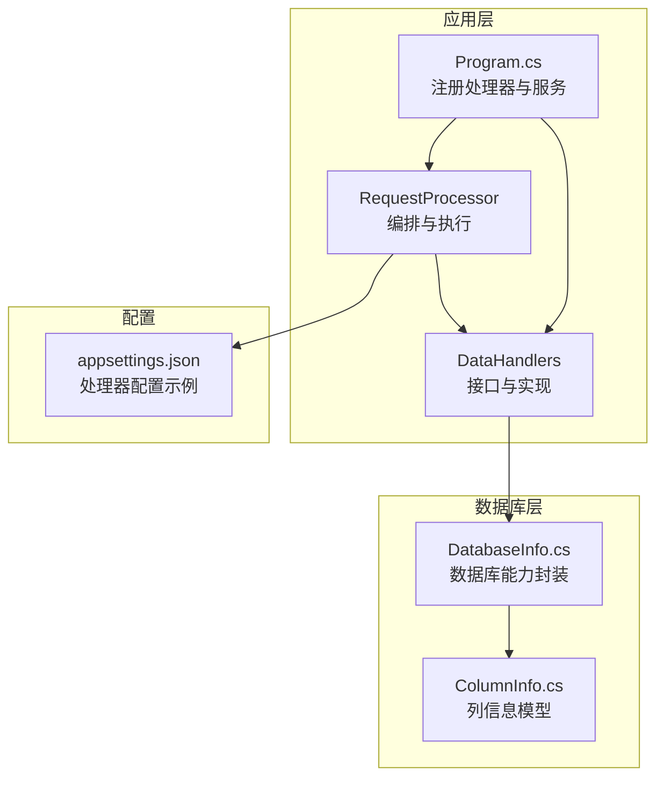
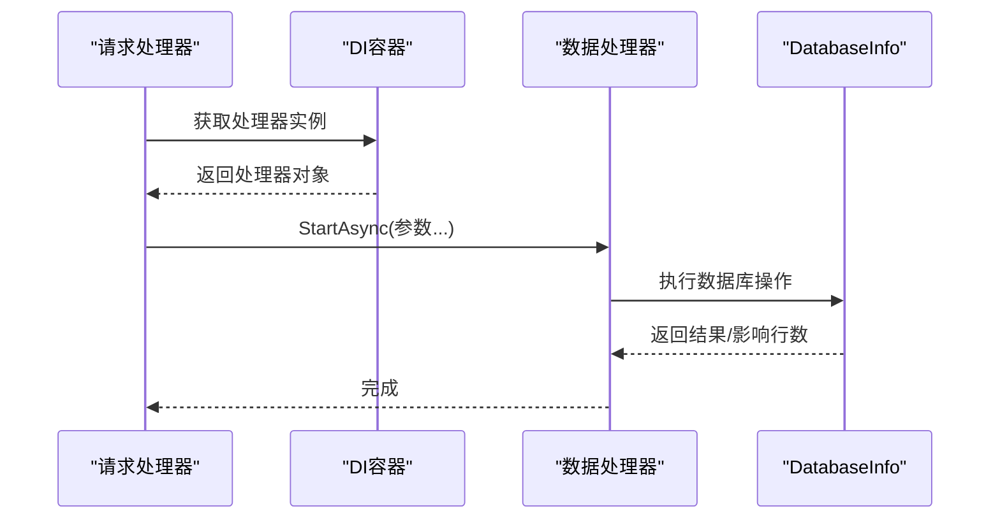
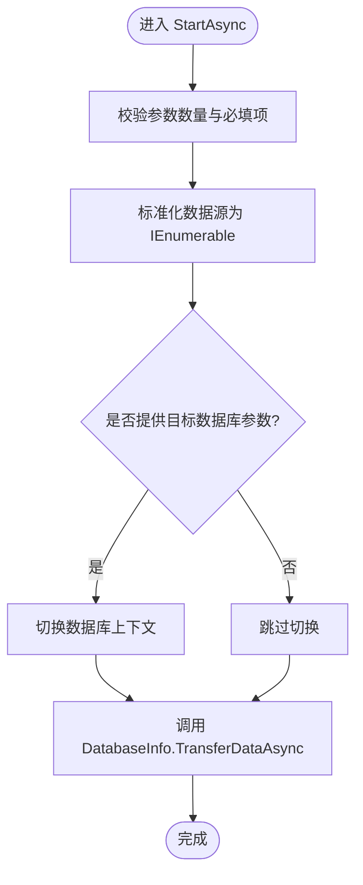
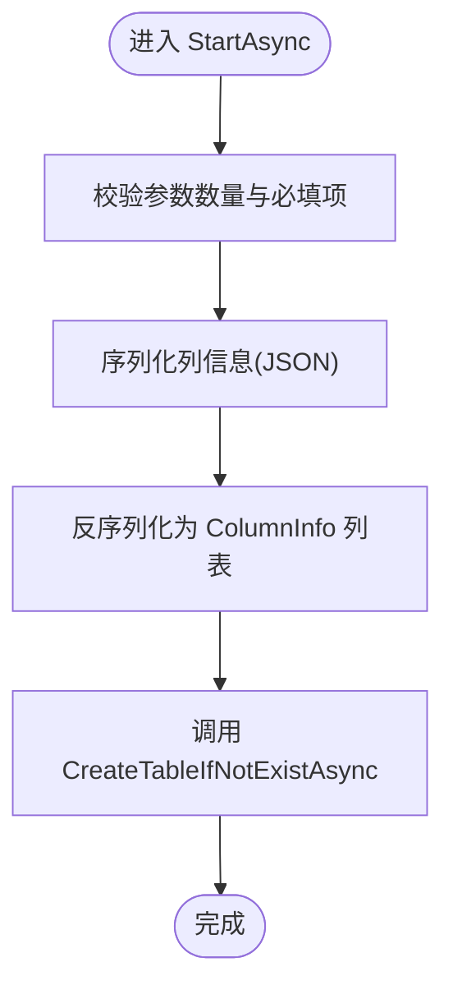
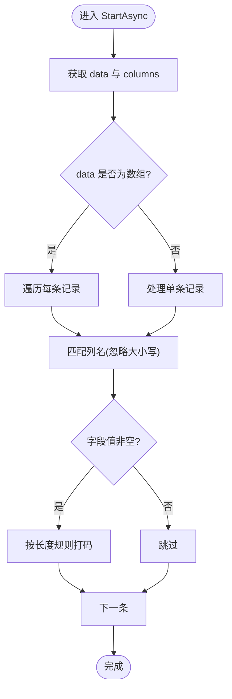
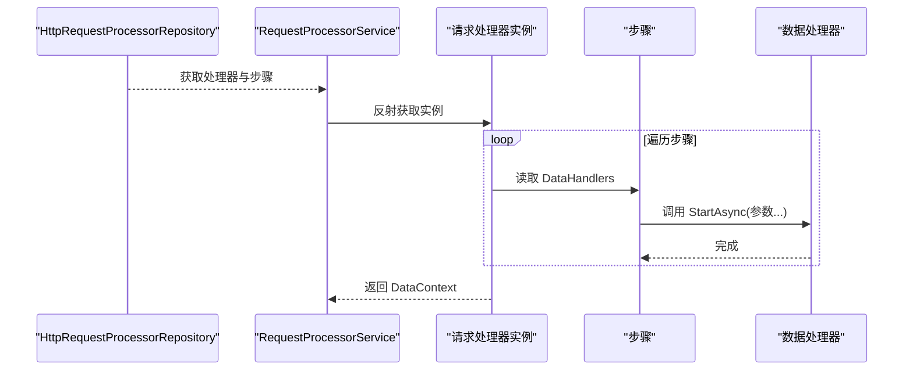
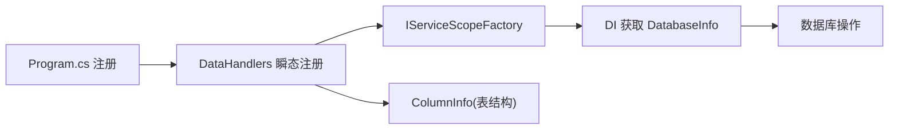

# 数据处理器系统

<cite>
**本文引用的文件**
- [IDataHandler.cs](file://Sylas.RemoteTasks.App/DataHandlers/IDataHandler.cs)
- [DataHandler.cs](file://Sylas.RemoteTasks.App/DataHandlers/DataHandler.cs)
- [DataHandlerSyncDataToDb.cs](file://Sylas.RemoteTasks.App/DataHandlers/DataHandlerSyncDataToDb.cs)
- [DataHandlerCreateTable.cs](file://Sylas.RemoteTasks.App/DataHandlers/DataHandlerCreateTable.cs)
- [DataHandlerAnonymization.cs](file://Sylas.RemoteTasks.App/DataHandlers/DataHandlerAnonymization.cs)
- [Program.cs](file://Sylas.RemoteTasks.App/Program.cs)
- [appsettings.json](file://Sylas.RemoteTasks.App/appsettings.json)
- [DatabaseInfo.cs](file://Sylas.RemoteTasks.Database/SyncBase/DatabaseInfo.cs)
- [ColumnInfo.cs](file://Sylas.RemoteTasks.Database/Dtos/ColumnInfo.cs)
- [RequestProcessorService.cs](file://Sylas.RemoteTasks.App/RequestProcessor/RequestProcessorService.cs)
- [HttpRequestProcessor.cs](file://Sylas.RemoteTasks.App/RequestProcessor/Models/HttpRequestProcessor.cs)
- [HttpRequestProcessorStepDataHandlers.cs](file://Sylas.RemoteTasks.App/RequestProcessor/Models/HttpRequestProcessorStepDataHandlers.cs)
</cite>

## 目录
1. [简介](#简介)
2. [项目结构](#项目结构)
3. [核心组件](#核心组件)
4. [架构总览](#架构总览)
5. [详细组件分析](#详细组件分析)
6. [依赖分析](#依赖分析)
7. [性能考虑](#性能考虑)
8. [故障排查指南](#故障排查指南)
9. [结论](#结论)
10. [附录](#附录)

## 简介
本技术文档围绕“数据处理器系统”展开，重点阐述 IDataHandler 接口的设计理念与扩展机制，以及三种内置处理器的实现原理与协作流程：数据同步处理器、表结构创建处理器、数据脱敏处理器。文档还覆盖处理器注册与依赖注入配置、生命周期管理、使用示例与配置参数说明、处理器间协作关系与数据流转过程，并给出性能优化建议、错误处理策略与自定义处理器开发指南。

## 项目结构
数据处理器系统位于应用层的 DataHandlers 命名空间内，配合数据库层的 DatabaseInfo 提供统一的数据库能力；请求处理器层负责编排步骤与数据处理器的执行顺序与上下文传递。

图表来源
- [Program.cs](file://Sylas.RemoteTasks.App/Program.cs#L50-L53)
- [RequestProcessorService.cs](file://Sylas.RemoteTasks.App/RequestProcessor/RequestProcessorService.cs#L11-L69)
- [DatabaseInfo.cs](file://Sylas.RemoteTasks.Database/SyncBase/DatabaseInfo.cs#L64-L88)

章节来源
- [Program.cs](file://Sylas.RemoteTasks.App/Program.cs#L50-L53)
- [appsettings.json](file://Sylas.RemoteTasks.App/appsettings.json#L65-L106)

## 核心组件
- IDataHandler 接口：定义异步启动入口，作为所有数据处理器的统一契约，便于在请求处理器中按顺序编排执行。
- DataHandlerInfo：承载处理器名称、参数列表与执行顺序，用于在步骤中声明处理器及其参数。
- 内置处理器：
  - DataHandlerSyncDataToDb：将数据源（单对象或集合）同步到目标数据库表，支持切换数据库或直接使用连接串。
  - DataHandlerCreateTable：根据列定义在目标数据库创建表（若不存在）。
  - DataHandlerAnonymization：对 JSON 数据中的指定字段进行脱敏处理。

章节来源
- [IDataHandler.cs](file://Sylas.RemoteTasks.App/DataHandlers/IDataHandler.cs#L3-L6)
- [DataHandler.cs](file://Sylas.RemoteTasks.App/DataHandlers/DataHandler.cs#L3-L14)
- [DataHandlerSyncDataToDb.cs](file://Sylas.RemoteTasks.App/DataHandlers/DataHandlerSyncDataToDb.cs#L7-L15)
- [DataHandlerCreateTable.cs](file://Sylas.RemoteTasks.App/DataHandlers/DataHandlerCreateTable.cs#L7-L15)
- [DataHandlerAnonymization.cs](file://Sylas.RemoteTasks.App/DataHandlers/DataHandlerAnonymization.cs#L5-L10)

## 架构总览
请求处理器通过反射与 DI 容器获取具体处理器实例，按步骤顺序执行 DataHandlers。处理器内部通过 DatabaseInfo 获取数据库能力，完成数据同步、表创建与脱敏等操作。

图表来源
- [RequestProcessorService.cs](file://Sylas.RemoteTasks.App/RequestProcessor/RequestProcessorService.cs#L26-L51)
- [DataHandlerSyncDataToDb.cs](file://Sylas.RemoteTasks.App/DataHandlers/DataHandlerSyncDataToDb.cs#L18-L62)
- [DataHandlerCreateTable.cs](file://Sylas.RemoteTasks.App/DataHandlers/DataHandlerCreateTable.cs#L17-L31)
- [DataHandlerAnonymization.cs](file://Sylas.RemoteTasks.App/DataHandlers/DataHandlerAnonymization.cs#L7-L39)
- [DatabaseInfo.cs](file://Sylas.RemoteTasks.Database/SyncBase/DatabaseInfo.cs#L744-L759)

## 详细组件分析

### IDataHandler 接口与扩展机制
- 设计理念
  - 以最小契约约束处理器行为：统一的异步启动入口，便于在请求处理器中顺序编排。
  - 参数化设计：StartAsync 支持 params object[]，便于灵活传入不同类型的输入（如数据源、连接串、列定义等）。
- 扩展机制
  - 新增处理器只需实现接口并在 Program.cs 中注册为瞬态服务，即可被请求处理器发现与调用。
  - 通过 DataHandlerInfo 或配置文件中的 DataHandlers 数组声明处理器名称与参数顺序。

章节来源
- [IDataHandler.cs](file://Sylas.RemoteTasks.App/DataHandlers/IDataHandler.cs#L3-L6)
- [Program.cs](file://Sylas.RemoteTasks.App/Program.cs#L50-L53)

### DataHandlerSyncDataToDb：数据同步算法
- 输入参数
  - table：目标表名
  - dataSource：数据源（单对象或可枚举集合）
  - targetDb：目标数据库连接串或数据库名
  - idField：主键字段名（可选，默认“id”）
- 核心流程
  - 参数校验与默认值设置
  - 识别数据源类型（单对象或集合），统一为 IEnumerable<object>
  - 根据 targetDb 决定使用 ChangeDatabase 或 SetDb 切换数据库上下文
  - 调用 DatabaseInfo.TransferDataAsync 执行批量写入
- 关键点
  - 支持多种数据库类型，连接串识别通过关键字判断
  - 通过 DI 作用域获取 DatabaseInfo，确保线程安全与生命周期可控

图表来源
- [DataHandlerSyncDataToDb.cs](file://Sylas.RemoteTasks.App/DataHandlers/DataHandlerSyncDataToDb.cs#L18-L62)
- [DatabaseInfo.cs](file://Sylas.RemoteTasks.Database/SyncBase/DatabaseInfo.cs#L744-L759)

章节来源
- [DataHandlerSyncDataToDb.cs](file://Sylas.RemoteTasks.App/DataHandlers/DataHandlerSyncDataToDb.cs#L17-L62)
- [DatabaseInfo.cs](file://Sylas.RemoteTasks.Database/SyncBase/DatabaseInfo.cs#L744-L759)

### DataHandlerCreateTable：表结构创建逻辑
- 输入参数
  - db：目标数据库名或连接串
  - table：表名
  - colInfos：列信息集合（JSON 序列化后反序列化为 ColumnInfo 列表）
  - tableRecords（可选）：可用于后续预填充数据的上下文
- 核心流程
  - 参数校验
  - JSON -> 列信息集合
  - 调用 DatabaseInfo.CreateTableIfNotExistAsync 创建表（若不存在）

图表来源
- [DataHandlerCreateTable.cs](file://Sylas.RemoteTasks.App/DataHandlers/DataHandlerCreateTable.cs#L17-L31)
- [ColumnInfo.cs](file://Sylas.RemoteTasks.Database/Dtos/ColumnInfo.cs#L6-L44)
- [DatabaseInfo.cs](file://Sylas.RemoteTasks.Database/SyncBase/DatabaseInfo.cs#L744-L759)

章节来源
- [DataHandlerCreateTable.cs](file://Sylas.RemoteTasks.App/DataHandlers/DataHandlerCreateTable.cs#L17-L31)
- [ColumnInfo.cs](file://Sylas.RemoteTasks.Database/Dtos/ColumnInfo.cs#L6-L44)
- [DatabaseInfo.cs](file://Sylas.RemoteTasks.Database/SyncBase/DatabaseInfo.cs#L744-L759)

### DataHandlerAnonymization：数据脱敏策略
- 输入参数
  - data：JSON 数据（JArray/JObject）
  - columns：逗号分隔的字段名列表
- 脱敏规则
  - 遍历数据集合中的每条记录
  - 对匹配字段计算保留前半部分长度，其余以“**”替代
  - 仅对非空字符串执行脱敏
- 注意事项
  - 该处理器直接修改传入的 JToken/JObject，属于就地处理

图表来源
- [DataHandlerAnonymization.cs](file://Sylas.RemoteTasks.App/DataHandlers/DataHandlerAnonymization.cs#L7-L39)

章节来源
- [DataHandlerAnonymization.cs](file://Sylas.RemoteTasks.App/DataHandlers/DataHandlerAnonymization.cs#L7-L39)

### 请求处理器与处理器协作
- 请求处理器通过反射与 DI 获取处理器实例，按步骤顺序执行 DataHandlers。
- 步骤中声明的处理器名称与参数通过配置文件或实体映射到处理器的 StartAsync。
- 上下文可在多个处理器之间传递，便于前序处理器输出的数据被后续处理器消费。

图表来源
- [RequestProcessorService.cs](file://Sylas.RemoteTasks.App/RequestProcessor/RequestProcessorService.cs#L11-L69)
- [HttpRequestProcessor.cs](file://Sylas.RemoteTasks.App/RequestProcessor/Models/HttpRequestProcessor.cs#L9-L20)
- [HttpRequestProcessorStepDataHandlers.cs](file://Sylas.RemoteTasks.App/RequestProcessor/Models/HttpRequestProcessorStepDataHandlers.cs#L3-L14)

章节来源
- [RequestProcessorService.cs](file://Sylas.RemoteTasks.App/RequestProcessor/RequestProcessorService.cs#L11-L69)
- [HttpRequestProcessor.cs](file://Sylas.RemoteTasks.App/RequestProcessor/Models/HttpRequestProcessor.cs#L9-L20)
- [HttpRequestProcessorStepDataHandlers.cs](file://Sylas.RemoteTasks.App/RequestProcessor/Models/HttpRequestProcessorStepDataHandlers.cs#L3-L14)

## 依赖分析
- 依赖注入
  - 在 Program.cs 中将三个处理器注册为瞬态服务，便于按需创建与作用域隔离。
  - 处理器内部通过 IServiceScopeFactory 创建作用域，获取 DatabaseInfo 以避免跨请求共享状态。
- 外部依赖
  - DatabaseInfo 提供数据库连接、事务、DDL/DML、表结构查询与创建等能力。
  - ColumnInfo 作为表结构元数据载体，贯穿表创建流程。

图表来源
- [Program.cs](file://Sylas.RemoteTasks.App/Program.cs#L50-L53)
- [DataHandlerSyncDataToDb.cs](file://Sylas.RemoteTasks.App/DataHandlers/DataHandlerSyncDataToDb.cs#L11-L15)
- [DataHandlerCreateTable.cs](file://Sylas.RemoteTasks.App/DataHandlers/DataHandlerCreateTable.cs#L11-L15)
- [DatabaseInfo.cs](file://Sylas.RemoteTasks.Database/SyncBase/DatabaseInfo.cs#L64-L88)
- [ColumnInfo.cs](file://Sylas.RemoteTasks.Database/Dtos/ColumnInfo.cs#L6-L44)

章节来源
- [Program.cs](file://Sylas.RemoteTasks.App/Program.cs#L50-L53)
- [DataHandlerSyncDataToDb.cs](file://Sylas.RemoteTasks.App/DataHandlers/DataHandlerSyncDataToDb.cs#L11-L15)
- [DataHandlerCreateTable.cs](file://Sylas.RemoteTasks.App/DataHandlers/DataHandlerCreateTable.cs#L11-L15)
- [DatabaseInfo.cs](file://Sylas.RemoteTasks.Database/SyncBase/DatabaseInfo.cs#L64-L88)
- [ColumnInfo.cs](file://Sylas.RemoteTasks.Database/Dtos/ColumnInfo.cs#L6-L44)

## 性能考虑
- 批量写入与事务
  - DatabaseInfo 在执行 DML 时使用事务包裹，减少往返与提升一致性；对于大批量写入，建议控制批次大小并结合数据库特性调整。
- 连接与作用域
  - 处理器通过作用域获取 DatabaseInfo，避免跨请求共享连接导致的并发问题；注意在高并发场景下合理复用连接池。
- 字段类型转换
  - DatabaseInfo 在更新时对非字符串字段进行类型转换，建议在上游准备正确的数据类型，减少运行时转换成本。
- 脱敏处理
  - DataHandlerAnonymization 对字符串进行长度计算与截取，建议在数据量较大时考虑流式处理或分批处理。

## 故障排查指南
- 参数不足或为空
  - 同步处理器与表创建处理器均对参数数量进行严格校验，若抛出“参数不足”异常，请检查配置文件或步骤参数。
- 连接串格式
  - 同步处理器根据关键字区分不同数据库的连接串格式；若连接失败，请确认连接串关键字与数据库类型匹配。
- 表不存在
  - 表创建处理器在执行前检查表是否存在，若异常提示表不存在，请确认目标数据库与权限。
- 脱敏字段匹配
  - 脱敏处理器按字段名进行忽略大小写匹配；若未生效，请确认字段名拼写与数据结构一致。

章节来源
- [DataHandlerSyncDataToDb.cs](file://Sylas.RemoteTasks.App/DataHandlers/DataHandlerSyncDataToDb.cs#L20-L22)
- [DataHandlerCreateTable.cs](file://Sylas.RemoteTasks.App/DataHandlers/DataHandlerCreateTable.cs#L19-L21)
- [DataHandlerAnonymization.cs](file://Sylas.RemoteTasks.App/DataHandlers/DataHandlerAnonymization.cs#L10)

## 结论
数据处理器系统通过 IDataHandler 统一契约与 DI 注册机制，实现了可插拔的数据处理能力。内置处理器分别覆盖数据同步、表结构创建与数据脱敏三大场景，配合请求处理器的编排能力，形成清晰的数据流转链路。通过合理的参数设计、作用域隔离与数据库抽象，系统具备良好的扩展性与稳定性。

## 附录

### 使用示例与配置参数说明
- 在 appsettings.json 的 RequestPipeline 中声明处理器与参数，处理器名称与参数数组一一对应。
- 示例要点
  - 同步处理器：参数包括目标表名、数据源占位符、目标数据库连接串或数据库名。
  - 表创建处理器：参数包括数据库名/连接串、表名、列信息 JSON。
  - 脱敏处理器：参数包括数据源占位符与逗号分隔的字段名列表。

章节来源
- [appsettings.json](file://Sylas.RemoteTasks.App/appsettings.json#L65-L106)
- [HttpRequestProcessorStepDataHandlers.cs](file://Sylas.RemoteTasks.App/RequestProcessor/Models/HttpRequestProcessorStepDataHandlers.cs#L3-L14)

### 生命周期管理
- 处理器注册为瞬态服务，每次请求由 DI 容器创建新实例，适合短生命周期任务。
- 处理器内部通过 IServiceScopeFactory 创建作用域，获取 DatabaseInfo，确保线程安全与资源释放。

章节来源
- [Program.cs](file://Sylas.RemoteTasks.App/Program.cs#L50-L53)
- [DataHandlerSyncDataToDb.cs](file://Sylas.RemoteTasks.App/DataHandlers/DataHandlerSyncDataToDb.cs#L11-L15)
- [DataHandlerCreateTable.cs](file://Sylas.RemoteTasks.App/DataHandlers/DataHandlerCreateTable.cs#L11-L15)

### 自定义处理器开发指南
- 实现步骤
  - 实现 IDataHandler 接口，提供 StartAsync 方法。
  - 在 Program.cs 中注册为瞬态服务。
  - 在请求处理器步骤中声明处理器名称与参数顺序。
- 最佳实践
  - 参数校验与异常处理：在 StartAsync 中尽早校验参数并抛出明确异常。
  - 作用域与资源：通过 IServiceScopeFactory 获取所需服务，避免跨请求共享状态。
  - 日志与可观测性：在关键路径记录日志，便于定位问题。
  - 性能优化：结合数据库层的批处理与事务特性，合理控制批次大小与并发度。

章节来源
- [IDataHandler.cs](file://Sylas.RemoteTasks.App/DataHandlers/IDataHandler.cs#L3-L6)
- [Program.cs](file://Sylas.RemoteTasks.App/Program.cs#L50-L53)
- [RequestProcessorService.cs](file://Sylas.RemoteTasks.App/RequestProcessor/RequestProcessorService.cs#L26-L51)