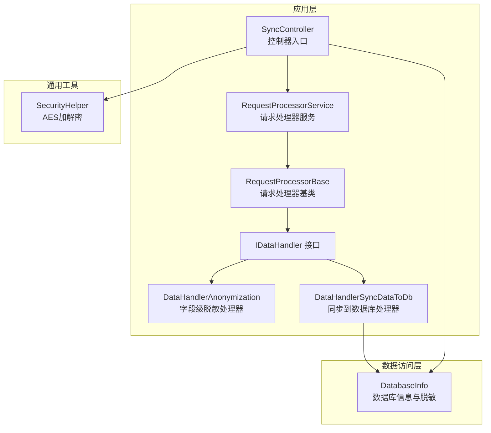
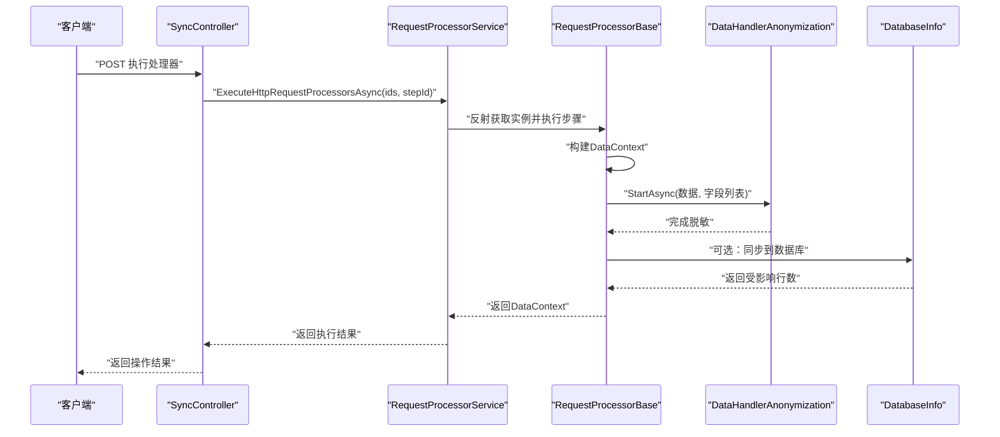
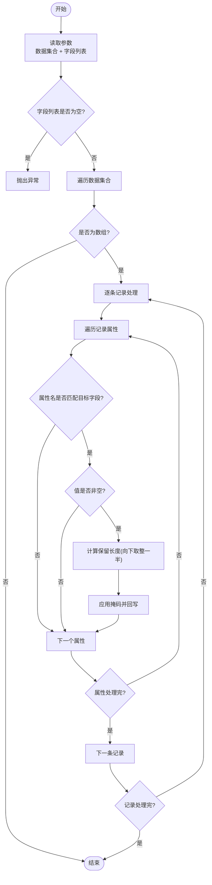
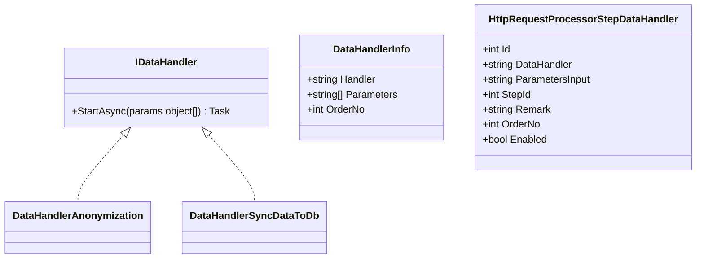
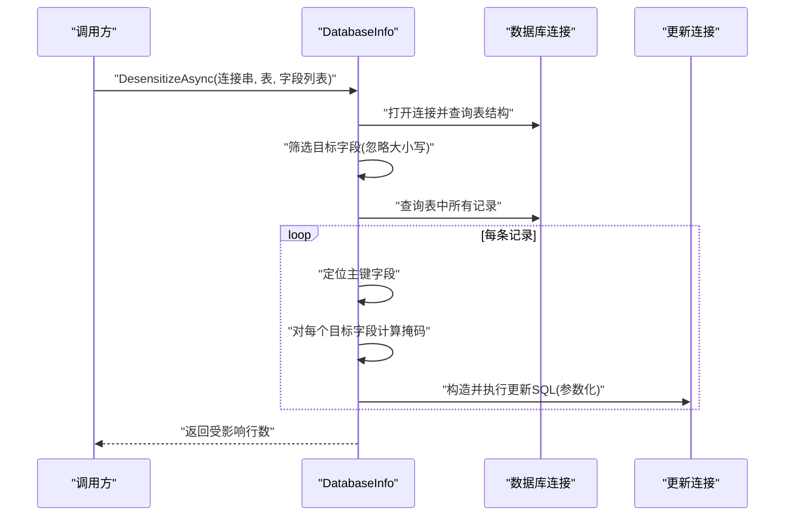
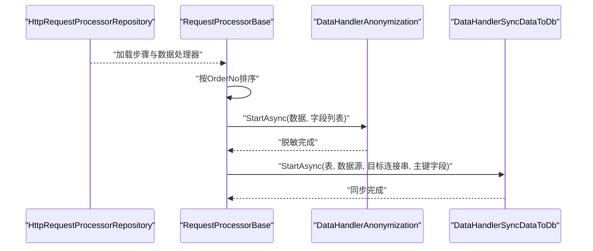
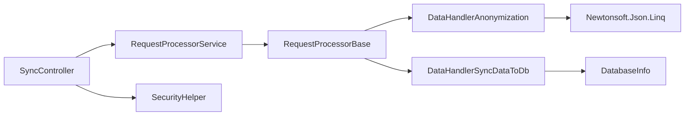

# 数据脱敏处理器

<cite>
**本文引用的文件**
- [DataHandlerAnonymization.cs](file://Sylas.RemoteTasks.App/DataHandlers/DataHandlerAnonymization.cs)
- [IDataHandler.cs](file://Sylas.RemoteTasks.App/DataHandlers/IDataHandler.cs)
- [DataHandler.cs](file://Sylas.RemoteTasks.App/DataHandlers/DataHandler.cs)
- [DataHandlerSyncDataToDb.cs](file://Sylas.RemoteTasks.App/DataHandlers/DataHandlerSyncDataToDb.cs)
- [RequestProcessorService.cs](file://Sylas.RemoteTasks.App/RequestProcessor/RequestProcessorService.cs)
- [RequestProcessorBase.cs](file://Sylas.RemoteTasks.App/RequestProcessor/RequestProcessorBase.cs)
- [HttpRequestProcessor.cs](file://Sylas.RemoteTasks.App/RequestProcessor/Models/HttpRequestProcessor.cs)
- [HttpRequestProcessorStepDataHandlers.cs](file://Sylas.RemoteTasks.App/RequestProcessor/Models/HttpRequestProcessorStepDataHandlers.cs)
- [HttpRequestProcessorRepository.cs](file://Sylas.RemoteTasks.App/RequestProcessor/HttpRequestProcessorRepository.cs)
- [SyncController.cs](file://Sylas.RemoteTasks.App/Controllers/SyncController.cs)
- [DatabaseInfo.cs](file://Sylas.RemoteTasks.Database/SyncBase/DatabaseInfo.cs)
- [SecurityHelper.cs](file://Sylas.RemoteTasks.Common/SecurityHelper.cs)
- [FetchAllDataByApiTest.cs](file://Sylas.RemoteTasks.Test/Remote/FetchAllDataByApiTest.cs)
- [SecurityTest.cs](file://Sylas.RemoteTasks.Test/Database/SecurityTest.cs)
</cite>

## 目录
1. [简介](#简介)
2. [项目结构](#项目结构)
3. [核心组件](#核心组件)
4. [架构总览](#架构总览)
5. [详细组件分析](#详细组件分析)
6. [依赖关系分析](#依赖关系分析)
7. [性能考量](#性能考量)
8. [故障排查指南](#故障排查指南)
9. [结论](#结论)
10. [附录](#附录)

## 简介
本技术文档围绕数据脱敏处理器 DataHandlerAnonymization 展开，系统阐述其脱敏策略、实现原理、数据变换规则与安全保护机制。文档同时覆盖支持的脱敏类型、配置参数、自定义扩展点、敏感数据识别与处理流程、结果验证方法，并给出与数据同步处理器的协作关系、安全最佳实践以及合规性建议。

## 项目结构
本项目采用分层与功能模块结合的组织方式：
- 应用层：控制器、请求处理器、数据处理器接口与实现
- 数据访问层：数据库信息封装、连接与迁移工具
- 工具与通用层：安全辅助、模板解析、扩展方法等

图表来源
- [SyncController.cs](file://Sylas.RemoteTasks.App/Controllers/SyncController.cs#L1-L457)
- [RequestProcessorService.cs](file://Sylas.RemoteTasks.App/RequestProcessor/RequestProcessorService.cs#L1-L72)
- [RequestProcessorBase.cs](file://Sylas.RemoteTasks.App/RequestProcessor/RequestProcessorBase.cs#L132-L268)
- [IDataHandler.cs](file://Sylas.RemoteTasks.App/DataHandlers/IDataHandler.cs#L1-L8)
- [DataHandlerAnonymization.cs](file://Sylas.RemoteTasks.App/DataHandlers/DataHandlerAnonymization.cs#L1-L42)
- [DataHandlerSyncDataToDb.cs](file://Sylas.RemoteTasks.App/DataHandlers/DataHandlerSyncDataToDb.cs#L1-L65)
- [DatabaseInfo.cs](file://Sylas.RemoteTasks.Database/SyncBase/DatabaseInfo.cs#L4076-L4145)
- [SecurityHelper.cs](file://Sylas.RemoteTasks.Common/SecurityHelper.cs#L1-L228)

章节来源
- [SyncController.cs](file://Sylas.RemoteTasks.App/Controllers/SyncController.cs#L1-L457)
- [RequestProcessorService.cs](file://Sylas.RemoteTasks.App/RequestProcessor/RequestProcessorService.cs#L1-L72)
- [RequestProcessorBase.cs](file://Sylas.RemoteTasks.App/RequestProcessor/RequestProcessorBase.cs#L132-L268)
- [IDataHandler.cs](file://Sylas.RemoteTasks.App/DataHandlers/IDataHandler.cs#L1-L8)
- [DataHandlerAnonymization.cs](file://Sylas.RemoteTasks.App/DataHandlers/DataHandlerAnonymization.cs#L1-L42)
- [DataHandlerSyncDataToDb.cs](file://Sylas.RemoteTasks.App/DataHandlers/DataHandlerSyncDataToDb.cs#L1-L65)
- [DatabaseInfo.cs](file://Sylas.RemoteTasks.Database/SyncBase/DatabaseInfo.cs#L4076-L4145)
- [SecurityHelper.cs](file://Sylas.RemoteTasks.Common/SecurityHelper.cs#L1-L228)

## 核心组件
- IDataHandler：数据处理器统一接口，定义 StartAsync(params object[]) 方法作为执行入口。
- DataHandlerAnonymization：字段级脱敏处理器，基于 JSON 对象集合对指定列进行半数隐藏处理。
- DataHandlerSyncDataToDb：将数据同步到数据库的处理器，负责解析参数、选择连接串并调用数据库传输能力。
- DatabaseInfo：数据库操作封装，包含静态脱敏方法 DesensitizeAsync，支持按字段批量更新。
- RequestProcessorService/RequestProcessorBase：请求处理器编排与执行，负责加载步骤、数据处理器、按序执行并维护上下文。
- SyncController：对外提供执行入口，支持通过 HTTP 触发处理器链路执行。
- SecurityHelper：提供 AES 加解密能力，用于连接串等敏感配置的安全存储与运行时解密。

章节来源
- [IDataHandler.cs](file://Sylas.RemoteTasks.App/DataHandlers/IDataHandler.cs#L1-L8)
- [DataHandlerAnonymization.cs](file://Sylas.RemoteTasks.App/DataHandlers/DataHandlerAnonymization.cs#L1-L42)
- [DataHandlerSyncDataToDb.cs](file://Sylas.RemoteTasks.App/DataHandlers/DataHandlerSyncDataToDb.cs#L1-L65)
- [DatabaseInfo.cs](file://Sylas.RemoteTasks.Database/SyncBase/DatabaseInfo.cs#L4076-L4145)
- [RequestProcessorService.cs](file://Sylas.RemoteTasks.App/RequestProcessor/RequestProcessorService.cs#L1-L72)
- [RequestProcessorBase.cs](file://Sylas.RemoteTasks.App/RequestProcessor/RequestProcessorBase.cs#L132-L268)
- [SyncController.cs](file://Sylas.RemoteTasks.App/Controllers/SyncController.cs#L1-L457)
- [SecurityHelper.cs](file://Sylas.RemoteTasks.Common/SecurityHelper.cs#L1-L228)

## 架构总览
数据脱敏在整体数据处理流水线中的位置如下：

图表来源
- [SyncController.cs](file://Sylas.RemoteTasks.App/Controllers/SyncController.cs#L29-L37)
- [RequestProcessorService.cs](file://Sylas.RemoteTasks.App/RequestProcessor/RequestProcessorService.cs#L11-L69)
- [RequestProcessorBase.cs](file://Sylas.RemoteTasks.App/RequestProcessor/RequestProcessorBase.cs#L256-L268)
- [DataHandlerAnonymization.cs](file://Sylas.RemoteTasks.App/DataHandlers/DataHandlerAnonymization.cs#L7-L39)
- [DataHandlerSyncDataToDb.cs](file://Sylas.RemoteTasks.App/DataHandlers/DataHandlerSyncDataToDb.cs#L18-L62)
- [DatabaseInfo.cs](file://Sylas.RemoteTasks.Database/SyncBase/DatabaseInfo.cs#L4084-L4145)

## 详细组件分析

### DataHandlerAnonymization 组件分析
- 功能定位：对传入的 JSON 对象集合进行字段级脱敏，仅对指定列进行处理。
- 输入参数：
  - 参数0：数据集合（IEnumerable<JToken>），通常为 JObject 列表
  - 参数1：字段列表字符串，逗号分隔（如 "name,email,phone"）
- 脱敏策略：
  - 遍历每个记录的属性，若属性名与指定字段匹配，则对值进行半数隐藏处理
  - 若字段长度大于1，保留前半部分并追加固定掩码；长度为1时保留1位
  - 空值或空白值不处理
- 安全与健壮性：
  - 对空字段列表抛出异常，避免误操作
  - 使用大小写不敏感匹配字段名
  - 基于 JSON.NET(JToken/JObject) 进行结构化读写，避免字符串拼接错误

图表来源
- [DataHandlerAnonymization.cs](file://Sylas.RemoteTasks.App/DataHandlers/DataHandlerAnonymization.cs#L7-L39)

章节来源
- [DataHandlerAnonymization.cs](file://Sylas.RemoteTasks.App/DataHandlers/DataHandlerAnonymization.cs#L1-L42)

### DataHandler 接口与配置模型
- IDataHandler：统一的异步处理接口，约定 StartAsync(params object[]) 作为执行入口
- DataHandlerInfo：用于描述处理器的元信息（处理器类名、参数列表、执行顺序）
- HttpRequestProcessorStepDataHandler：步骤内数据处理器的持久化模型，包含处理器类名、参数输入、顺序、启用状态等

图表来源
- [IDataHandler.cs](file://Sylas.RemoteTasks.App/DataHandlers/IDataHandler.cs#L1-L8)
- [DataHandler.cs](file://Sylas.RemoteTasks.App/DataHandlers/DataHandler.cs#L1-L16)
- [HttpRequestProcessorStepDataHandlers.cs](file://Sylas.RemoteTasks.App/RequestProcessor/Models/HttpRequestProcessorStepDataHandlers.cs#L1-L15)

章节来源
- [IDataHandler.cs](file://Sylas.RemoteTasks.App/DataHandlers/IDataHandler.cs#L1-L8)
- [DataHandler.cs](file://Sylas.RemoteTasks.App/DataHandlers/DataHandler.cs#L1-L16)
- [HttpRequestProcessorStepDataHandlers.cs](file://Sylas.RemoteTasks.App/RequestProcessor/Models/HttpRequestProcessorStepDataHandlers.cs#L1-L15)

### 数据库脱敏能力（DatabaseInfo.DesensitizeAsync）
- 支持按表与字段列表进行批量脱敏
- 自动识别主键字段，构造更新语句
- 对每个目标字段进行半数隐藏处理，保留前半部分并追加掩码
- 通过参数化方式生成 SQL，降低注入风险

图表来源
- [DatabaseInfo.cs](file://Sylas.RemoteTasks.Database/SyncBase/DatabaseInfo.cs#L4084-L4145)

章节来源
- [DatabaseInfo.cs](file://Sylas.RemoteTasks.Database/SyncBase/DatabaseInfo.cs#L4076-L4145)

### 与数据同步处理器的协作
- RequestProcessorService 负责根据配置加载处理器链路并执行
- RequestProcessorBase 在执行步骤时，会按 OrderNo 顺序调用各 DataHandler
- DataHandlerSyncDataToDb 可在脱敏后将数据写回数据库，或由上层步骤继续处理

图表来源
- [RequestProcessorService.cs](file://Sylas.RemoteTasks.App/RequestProcessor/RequestProcessorService.cs#L11-L69)
- [RequestProcessorBase.cs](file://Sylas.RemoteTasks.App/RequestProcessor/RequestProcessorBase.cs#L256-L268)
- [DataHandlerAnonymization.cs](file://Sylas.RemoteTasks.App/DataHandlers/DataHandlerAnonymization.cs#L7-L39)
- [DataHandlerSyncDataToDb.cs](file://Sylas.RemoteTasks.App/DataHandlers/DataHandlerSyncDataToDb.cs#L18-L62)

章节来源
- [RequestProcessorService.cs](file://Sylas.RemoteTasks.App/RequestProcessor/RequestProcessorService.cs#L1-L72)
- [RequestProcessorBase.cs](file://Sylas.RemoteTasks.App/RequestProcessor/RequestProcessorBase.cs#L132-L268)
- [DataHandlerSyncDataToDb.cs](file://Sylas.RemoteTasks.App/DataHandlers/DataHandlerSyncDataToDb.cs#L1-L65)

## 依赖关系分析
- DataHandlerAnonymization 依赖 JSON.NET(JToken/JObject) 进行结构化处理
- DataHandlerSyncDataToDb 依赖 DatabaseInfo 进行数据传输
- RequestProcessorService/RequestProcessorBase 通过反射与依赖注入获取处理器实例
- SyncController 提供 HTTP 入口，调用 RequestProcessorService
- SecurityHelper 用于连接串等敏感配置的加解密

图表来源
- [DataHandlerAnonymization.cs](file://Sylas.RemoteTasks.App/DataHandlers/DataHandlerAnonymization.cs#L1-L2)
- [DataHandlerSyncDataToDb.cs](file://Sylas.RemoteTasks.App/DataHandlers/DataHandlerSyncDataToDb.cs#L1-L2)
- [RequestProcessorService.cs](file://Sylas.RemoteTasks.App/RequestProcessor/RequestProcessorService.cs#L1-L72)
- [RequestProcessorBase.cs](file://Sylas.RemoteTasks.App/RequestProcessor/RequestProcessorBase.cs#L132-L268)
- [SyncController.cs](file://Sylas.RemoteTasks.App/Controllers/SyncController.cs#L1-L457)
- [SecurityHelper.cs](file://Sylas.RemoteTasks.Common/SecurityHelper.cs#L1-L228)

章节来源
- [DataHandlerAnonymization.cs](file://Sylas.RemoteTasks.App/DataHandlers/DataHandlerAnonymization.cs#L1-L42)
- [DataHandlerSyncDataToDb.cs](file://Sylas.RemoteTasks.App/DataHandlers/DataHandlerSyncDataToDb.cs#L1-L65)
- [RequestProcessorService.cs](file://Sylas.RemoteTasks.App/RequestProcessor/RequestProcessorService.cs#L1-L72)
- [RequestProcessorBase.cs](file://Sylas.RemoteTasks.App/RequestProcessor/RequestProcessorBase.cs#L132-L268)
- [SyncController.cs](file://Sylas.RemoteTasks.App/Controllers/SyncController.cs#L1-L457)
- [SecurityHelper.cs](file://Sylas.RemoteTasks.Common/SecurityHelper.cs#L1-L228)

## 性能考量
- 字符串处理复杂度：对每条记录的每个目标字段进行长度计算与子串截取，整体复杂度近似 O(N×M)，N 为记录数，M 为目标字段数
- JSON 解析与写回：使用 JToken/JObject 进行结构化读写，避免手动拼接，减少错误并提升可维护性
- 数据库脱敏：采用参数化更新，避免 SQL 注入；按记录逐条更新，适合中小规模数据；大规模场景建议分批或使用批量更新策略
- I/O 与网络：同步处理器在执行远程请求与数据库写入时，应关注超时与重试策略，避免阻塞

## 故障排查指南
- 字段列表为空：当参数1为空时抛出异常，需检查步骤配置中的参数输入
- 字段名不匹配：脱敏按大小写不敏感匹配，若仍不生效，请确认字段名与 JSON 结构一致
- 空值处理：空值或空白值不会被修改，这是预期行为
- 数据库脱敏异常：若找不到主键字段，将抛出异常；请确认表结构与连接串正确
- 连接串安全：连接串在存储时应加密，运行时通过 SecurityHelper 解密后再使用

章节来源
- [DataHandlerAnonymization.cs](file://Sylas.RemoteTasks.App/DataHandlers/DataHandlerAnonymization.cs#L10-L31)
- [DatabaseInfo.cs](file://Sylas.RemoteTasks.Database/SyncBase/DatabaseInfo.cs#L4108-L4145)
- [SecurityHelper.cs](file://Sylas.RemoteTasks.Common/SecurityHelper.cs#L53-L59)

## 结论
DataHandlerAnonymization 提供了简单而有效的字段级脱敏能力，适用于 JSON 数据集的半数隐藏处理。配合 RequestProcessor 与 DatabaseInfo，可在数据处理流水线中实现端到端的脱敏与同步。建议在生产环境中结合参数化 SQL、连接串加密与严格的字段白名单策略，确保安全性与合规性。

## 附录

### 支持的脱敏类型与配置参数
- 支持的脱敏类型：字段级半数隐藏（保留前半部分 + 固定掩码）
- 配置参数：
  - 参数0：数据集合（IEnumerable<JToken>）
  - 参数1：字段列表（逗号分隔字符串）

章节来源
- [DataHandlerAnonymization.cs](file://Sylas.RemoteTasks.App/DataHandlers/DataHandlerAnonymization.cs#L7-L39)

### 使用示例与配置要点
- 示例场景：对用户表中的姓名、邮箱、电话进行脱敏
- 步骤要点：
  - 在步骤中添加 DataHandlerAnonymization，并设置参数输入为字段列表
  - 如需写回数据库，后续添加 DataHandlerSyncDataToDb 并配置目标连接串
  - 通过 SyncController 的执行接口触发处理器链路

章节来源
- [SyncController.cs](file://Sylas.RemoteTasks.App/Controllers/SyncController.cs#L29-L37)
- [RequestProcessorService.cs](file://Sylas.RemoteTasks.App/RequestProcessor/RequestProcessorService.cs#L11-L69)
- [DataHandlerSyncDataToDb.cs](file://Sylas.RemoteTasks.App/DataHandlers/DataHandlerSyncDataToDb.cs#L18-L62)

### 数据完整性保证与质量评估
- 完整性保证：
  - 仅对指定字段进行处理，其余字段保持不变
  - 数据库脱敏通过主键定位记录，避免误更新
- 质量评估：
  - 可通过对比脱敏前后字段长度与掩码位置进行人工抽样核验
  - 单元测试可覆盖不同长度与边界条件（如长度为1、偶数、奇数）

章节来源
- [DataHandlerAnonymization.cs](file://Sylas.RemoteTasks.App/DataHandlers/DataHandlerAnonymization.cs#L20-L31)
- [DatabaseInfo.cs](file://Sylas.RemoteTasks.Database/SyncBase/DatabaseInfo.cs#L4116-L4135)

### 合规性检查与安全最佳实践
- 合规性检查：
  - 明确敏感数据范围（个人身份、财务、健康等）
  - 建立字段清单与处理策略，定期审计
- 安全最佳实践：
  - 连接串与密钥使用 AES 加密存储，运行时解密
  - 严格最小权限原则，限制数据库写入权限
  - 记录脱敏日志，便于审计与追踪

章节来源
- [SecurityHelper.cs](file://Sylas.RemoteTasks.Common/SecurityHelper.cs#L36-L88)
- [SecurityTest.cs](file://Sylas.RemoteTasks.Test/Database/SecurityTest.cs#L18-L38)
- [FetchAllDataByApiTest.cs](file://Sylas.RemoteTasks.Test/Remote/FetchAllDataByApiTest.cs#L28-L33)