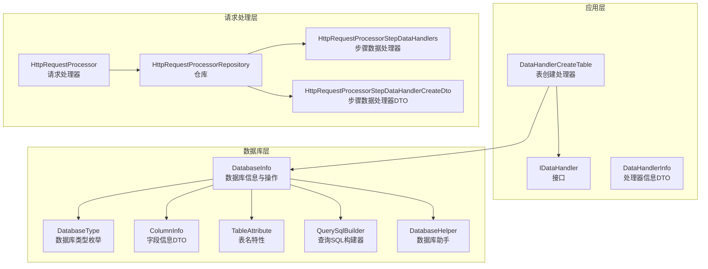
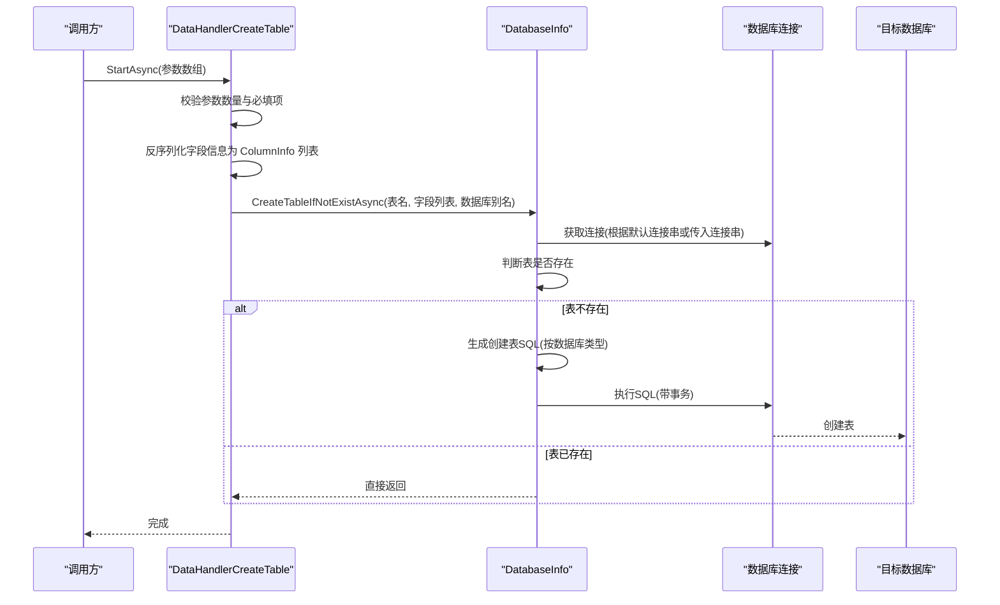
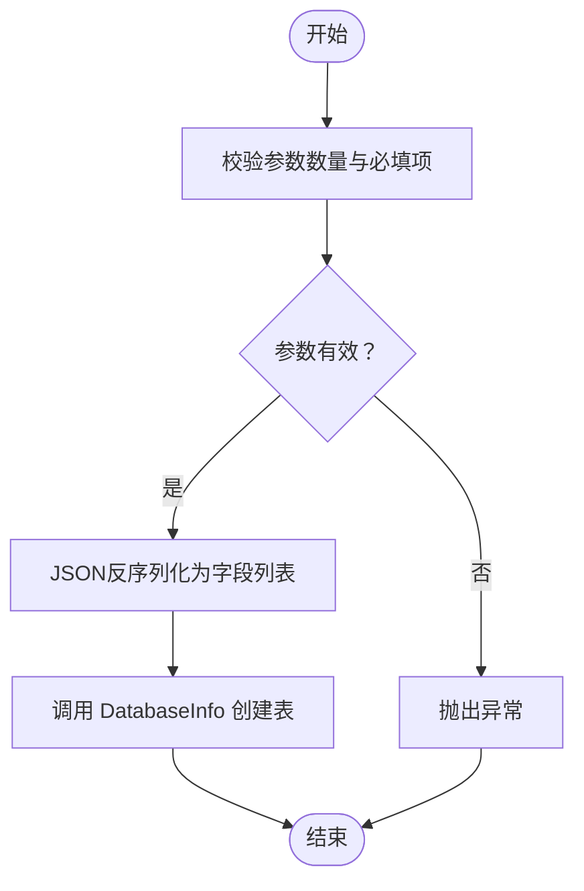
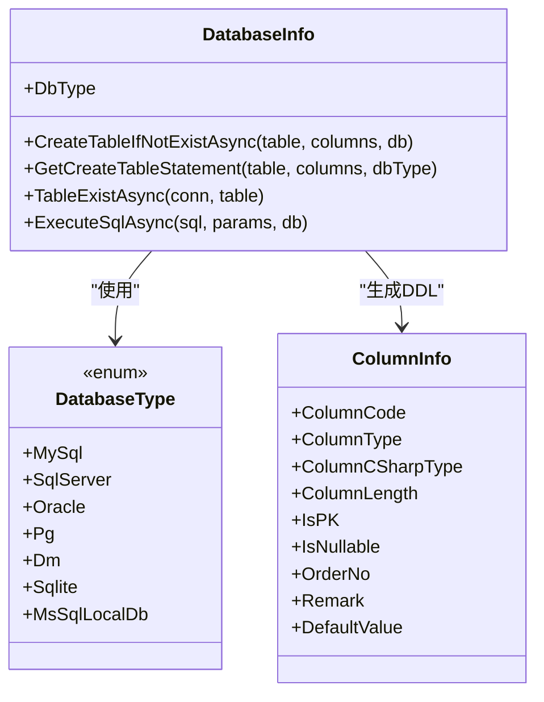
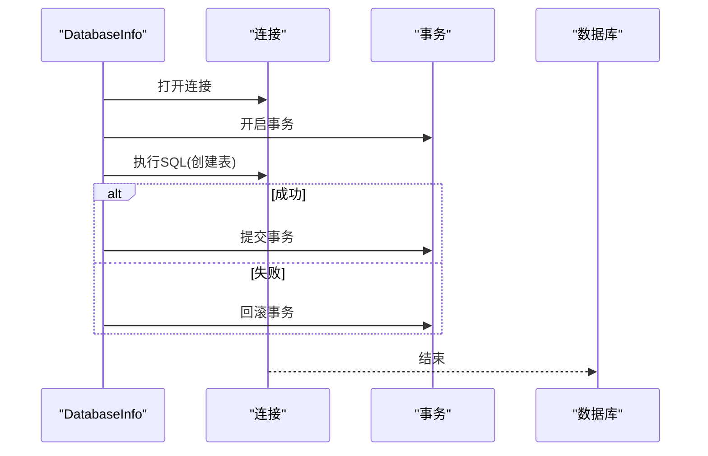
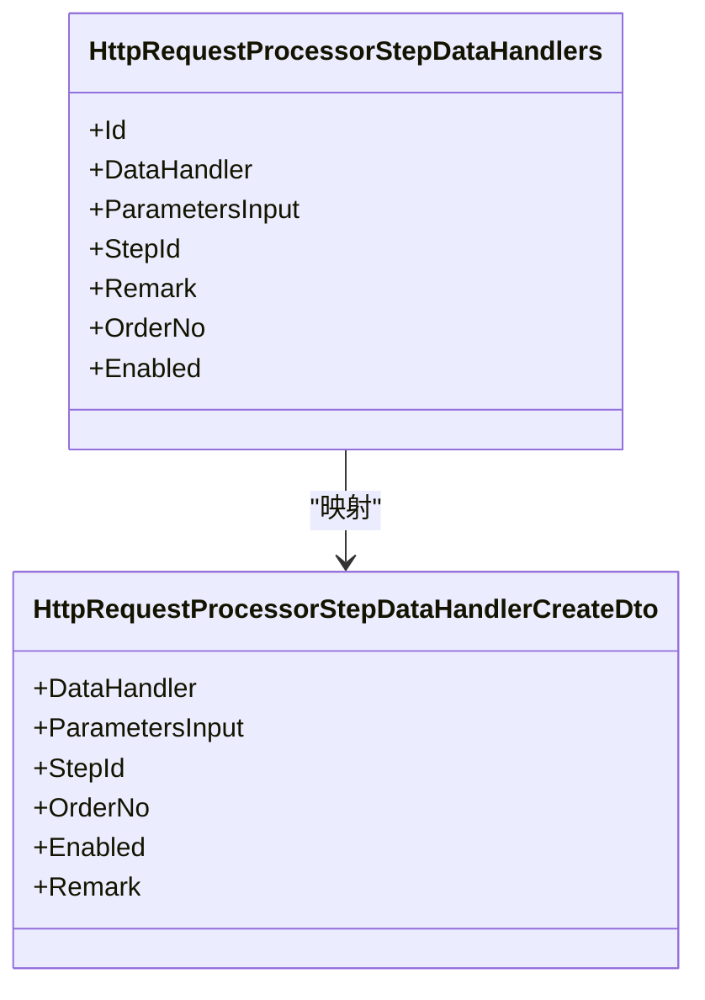
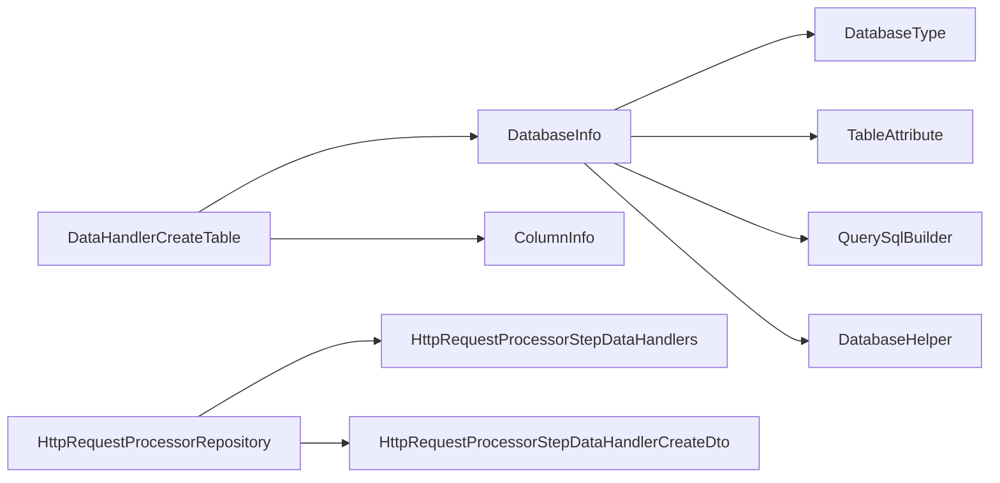

# 表创建处理器

<cite>
**本文档引用的文件**
- [DataHandlerCreateTable.cs](file://Sylas.RemoteTasks.App/DataHandlers/DataHandlerCreateTable.cs)
- [IDataHandler.cs](file://Sylas.RemoteTasks.App/DataHandlers/IDataHandler.cs)
- [DataHandler.cs](file://Sylas.RemoteTasks.App/DataHandlers/DataHandler.cs)
- [DatabaseInfo.cs](file://Sylas.RemoteTasks.Database/SyncBase/DatabaseInfo.cs)
- [DatabaseType.cs](file://Sylas.RemoteTasks.Database/SyncBase/DatabaseType.cs)
- [ColumnInfo.cs](file://Sylas.RemoteTasks.Database/Dtos/ColumnInfo.cs)
- [TableAttribute.cs](file://Sylas.RemoteTasks.Database/Attributes/TableAttribute.cs)
- [DatabaseHelper.cs](file://Sylas.RemoteTasks.Database/DatabaseHelper.cs)
- [QuerySqlBuilder.cs](file://Sylas.RemoteTasks.Database/SyncBase/QuerySqlBuilder.cs)
- [DatabaseController.cs](file://Sylas.RemoteTasks.App/Controllers/DatabaseController.cs)
- [HttpRequestProcessorStepDataHandlerCreateDto.cs](file://Sylas.RemoteTasks.App/RequestProcessor/Models/Dtos/HttpRequestProcessorStepDataHandlerCreateDto.cs)
- [HttpRequestProcessorStepDataHandlers.cs](file://Sylas.RemoteTasks.App/RequestProcessor/Models/HttpRequestProcessorStepDataHandlers.cs)
- [HttpRequestProcessorExtensions.cs](file://Sylas.RemoteTasks.App/RequestProcessor/Models/HttpRequestProcessorExtensions.cs)
- [HttpRequestProcessorRepository.cs](file://Sylas.RemoteTasks.App/RequestProcessor/HttpRequestProcessorRepository.cs)
</cite>

## 目录
1. [简介](#简介)
2. [项目结构](#项目结构)
3. [核心组件](#核心组件)
4. [架构总览](#架构总览)
5. [详细组件分析](#详细组件分析)
6. [依赖关系分析](#依赖关系分析)
7. [性能考虑](#性能考虑)
8. [故障排除指南](#故障排除指南)
9. [结论](#结论)
10. [附录](#附录)

## 简介
本文件面向“表创建处理器”（DataHandlerCreateTable）的技术文档，系统阐述其在远程任务系统中的职责、表结构创建逻辑、字段映射与约束设置、数据库兼容性处理、SQL 语句生成与执行流程、前置检查与依赖关系、版本管理策略、使用示例与配置参数、跨数据库类型支持、动态表结构生成以及与数据同步处理器的协同工作方式。目标读者包括开发工程师、运维工程师与测试工程师。

## 项目结构
DataHandlerCreateTable 位于应用层 DataHandlers 命名空间，通过依赖注入获取 DatabaseInfo 实例，委托其完成表存在性判断与创建逻辑；DatabaseInfo 位于数据库层，封装了多种数据库类型的支持、SQL 生成与执行、表存在性检测等能力。

**图表来源**
- [DataHandlerCreateTable.cs](file://Sylas.RemoteTasks.App/DataHandlers/DataHandlerCreateTable.cs#L1-L34)
- [IDataHandler.cs](file://Sylas.RemoteTasks.App/DataHandlers/IDataHandler.cs#L1-L8)
- [DataHandler.cs](file://Sylas.RemoteTasks.App/DataHandlers/DataHandler.cs#L1-L16)
- [DatabaseInfo.cs](file://Sylas.RemoteTasks.Database/SyncBase/DatabaseInfo.cs#L64-L88)
- [DatabaseType.cs](file://Sylas.RemoteTasks.Database/SyncBase/DatabaseType.cs#L1-L38)
- [ColumnInfo.cs](file://Sylas.RemoteTasks.Database/Dtos/ColumnInfo.cs#L1-L55)
- [TableAttribute.cs](file://Sylas.RemoteTasks.Database/Attributes/TableAttribute.cs#L1-L33)
- [QuerySqlBuilder.cs](file://Sylas.RemoteTasks.Database/SyncBase/QuerySqlBuilder.cs#L1-L389)
- [DatabaseHelper.cs](file://Sylas.RemoteTasks.Database/DatabaseHelper.cs#L1-L245)
- [HttpRequestProcessorStepDataHandlerCreateDto.cs](file://Sylas.RemoteTasks.App/RequestProcessor/Models/Dtos/HttpRequestProcessorStepDataHandlerCreateDto.cs#L1-L12)
- [HttpRequestProcessorStepDataHandlers.cs](file://Sylas.RemoteTasks.App/RequestProcessor/Models/HttpRequestProcessorStepDataHandlers.cs#L1-L14)
- [HttpRequestProcessorExtensions.cs](file://Sylas.RemoteTasks.App/RequestProcessor/Models/HttpRequestProcessorExtensions.cs#L1-L35)
- [HttpRequestProcessorRepository.cs](file://Sylas.RemoteTasks.App/RequestProcessor/HttpRequestProcessorRepository.cs#L205-L391)

**章节来源**
- [DataHandlerCreateTable.cs](file://Sylas.RemoteTasks.App/DataHandlers/DataHandlerCreateTable.cs#L1-L34)
- [DatabaseInfo.cs](file://Sylas.RemoteTasks.Database/SyncBase/DatabaseInfo.cs#L64-L88)

## 核心组件
- DataHandlerCreateTable：实现 IDataHandler 接口，负责接收参数并调用 DatabaseInfo 完成表创建。
- DatabaseInfo：提供数据库连接、类型识别、SQL 生成、表存在性检测、事务执行与表创建等能力。
- DatabaseType：统一的数据库类型枚举，覆盖 MySQL、SQL Server、Oracle、PostgreSQL、达梦、SQLite、本地 SQL Server 等。
- ColumnInfo：描述字段的代码、类型、长度、是否主键、是否可空、排序、备注、默认值等。
- TableAttribute：用于从实体类反射获取表名的特性。
- QuerySqlBuilder：按数据库类型生成查询 SQL 的构建器，辅助理解参数占位符差异。
- DatabaseHelper：提供数据库连接字符串解析、DDL 导出、跨数据库类型 SQL 转换等工具方法。
- 请求处理器相关模型：用于将 DataHandlerCreateTable 作为步骤数据处理器集成到请求处理流程中。

**章节来源**
- [IDataHandler.cs](file://Sylas.RemoteTasks.App/DataHandlers/IDataHandler.cs#L1-L8)
- [DatabaseInfo.cs](file://Sylas.RemoteTasks.Database/SyncBase/DatabaseInfo.cs#L64-L88)
- [DatabaseType.cs](file://Sylas.RemoteTasks.Database/SyncBase/DatabaseType.cs#L1-L38)
- [ColumnInfo.cs](file://Sylas.RemoteTasks.Database/Dtos/ColumnInfo.cs#L1-L55)
- [TableAttribute.cs](file://Sylas.RemoteTasks.Database/Attributes/TableAttribute.cs#L1-L33)
- [QuerySqlBuilder.cs](file://Sylas.RemoteTasks.Database/SyncBase/QuerySqlBuilder.cs#L1-L389)
- [DatabaseHelper.cs](file://Sylas.RemoteTasks.Database/DatabaseHelper.cs#L1-L245)

## 架构总览
DataHandlerCreateTable 作为应用层处理器，通过依赖注入获取 DatabaseInfo，后者负责：
- 识别数据库类型并选择合适的参数占位符（@ 或 :）
- 生成创建表的 DDL（根据 DatabaseType 选择不同语法）
- 检测表是否存在，不存在则执行创建
- 在指定数据库上下文下执行 SQL（支持切换数据库）

**图表来源**
- [DataHandlerCreateTable.cs](file://Sylas.RemoteTasks.App/DataHandlers/DataHandlerCreateTable.cs#L17-L31)
- [DatabaseInfo.cs](file://Sylas.RemoteTasks.Database/SyncBase/DatabaseInfo.cs#L744-L759)

**章节来源**
- [DataHandlerCreateTable.cs](file://Sylas.RemoteTasks.App/DataHandlers/DataHandlerCreateTable.cs#L17-L31)
- [DatabaseInfo.cs](file://Sylas.RemoteTasks.Database/SyncBase/DatabaseInfo.cs#L744-L759)

## 详细组件分析

### DataHandlerCreateTable 组件分析
- 职责：接收参数（数据库别名、表名、字段集合 JSON、可选初始数据），反序列化字段信息，调用 DatabaseInfo 创建表。
- 参数校验：确保至少三个参数，且前两项非空；第四个参数可选。
- JSON 序列化/反序列化：将传入的字段集合转换为强类型列表。
- 依赖注入：通过 IServiceScopeFactory 创建作用域，获取 DatabaseInfo 单例服务。

**图表来源**
- [DataHandlerCreateTable.cs](file://Sylas.RemoteTasks.App/DataHandlers/DataHandlerCreateTable.cs#L17-L31)

**章节来源**
- [DataHandlerCreateTable.cs](file://Sylas.RemoteTasks.App/DataHandlers/DataHandlerCreateTable.cs#L17-L31)

### DatabaseInfo 表创建与兼容性
- 表存在性检测：针对不同数据库类型使用对应的系统表/元数据查询，返回布尔值。
- 创建表 SQL 生成：根据 DatabaseType 输出不同语法的 CREATE TABLE 语句，并处理表名、字段名大小写与引号。
- 字段 DDL 生成：依据 ColumnInfo 的 ColumnCode、ColumnType、ColumnCSharpType、IsPK、IsNullable、DefaultValue 等属性生成字段定义与约束。
- 参数占位符替换：在 Oracle/Dm 中将 @ 替换为 :，保证参数绑定正确。
- 事务执行：创建表在单个事务中执行，失败回滚。

**图表来源**
- [DatabaseInfo.cs](file://Sylas.RemoteTasks.Database/SyncBase/DatabaseInfo.cs#L744-L759)
- [DatabaseInfo.cs](file://Sylas.RemoteTasks.Database/SyncBase/DatabaseInfo.cs#L3221-L3244)
- [DatabaseInfo.cs](file://Sylas.RemoteTasks.Database/SyncBase/DatabaseInfo.cs#L3251-L3311)
- [DatabaseType.cs](file://Sylas.RemoteTasks.Database/SyncBase/DatabaseType.cs#L1-L38)
- [ColumnInfo.cs](file://Sylas.RemoteTasks.Database/Dtos/ColumnInfo.cs#L1-L55)

**章节来源**
- [DatabaseInfo.cs](file://Sylas.RemoteTasks.Database/SyncBase/DatabaseInfo.cs#L744-L759)
- [DatabaseInfo.cs](file://Sylas.RemoteTasks.Database/SyncBase/DatabaseInfo.cs#L3221-L3244)
- [DatabaseInfo.cs](file://Sylas.RemoteTasks.Database/SyncBase/DatabaseInfo.cs#L3251-L3311)
- [DatabaseType.cs](file://Sylas.RemoteTasks.Database/SyncBase/DatabaseType.cs#L1-L38)
- [ColumnInfo.cs](file://Sylas.RemoteTasks.Database/Dtos/ColumnInfo.cs#L1-L55)

### 字段映射与约束设置
- 字段名与类型：根据 ColumnInfo.ColumnCode 与 ColumnType 生成字段定义；对于 Oracle/Dm 统一大写，PostgreSQL 统一小写。
- 主键：当 IsPK=1 且 CSharpType 为 int 且仅有一个主键时，生成自增主键声明；否则在末尾追加 PRIMARY KEY 声明。
- 非空：当 IsNullable=0 或 IsPK=1 时输出 NOT NULL。
- 默认值：若 DefaultValue 非空，则附加 DEFAULT 子句。
- 引号与命名：不同数据库采用不同的标识符引号与大小写策略，确保跨库一致性。

**章节来源**
- [DatabaseInfo.cs](file://Sylas.RemoteTasks.Database/SyncBase/DatabaseInfo.cs#L3251-L3311)
- [ColumnInfo.cs](file://Sylas.RemoteTasks.Database/Dtos/ColumnInfo.cs#L1-L55)

### 数据库兼容性处理
- 支持数据库类型：MySQL、SQL Server、Oracle、PostgreSQL、达梦、SQLite、本地 SQL Server。
- 参数占位符：Oracle/Dm 使用冒号前缀，其他数据库使用 @ 前缀；执行前自动替换。
- 表名与字段名：根据数据库类型进行大小写与引号处理，避免关键字冲突与大小写问题。
- 连接字符串解析：提供多种数据库连接字符串格式的解析与验证。

**章节来源**
- [DatabaseType.cs](file://Sylas.RemoteTasks.Database/SyncBase/DatabaseType.cs#L1-L38)
- [DatabaseInfo.cs](file://Sylas.RemoteTasks.Database/SyncBase/DatabaseInfo.cs#L374-L377)
- [DatabaseInfo.cs](file://Sylas.RemoteTasks.Database/SyncBase/DatabaseInfo.cs#L3009-L3021)
- [DatabaseHelper.cs](file://Sylas.RemoteTasks.Database/DatabaseHelper.cs#L211-L224)

### SQL 语句生成与执行流程
- 生成阶段：根据表名、字段集合与数据库类型生成完整 DDL。
- 执行阶段：打开连接、开启事务、执行 SQL、提交；异常时回滚。
- 切换数据库：支持在执行前切换到目标数据库上下文。

**图表来源**
- [DatabaseInfo.cs](file://Sylas.RemoteTasks.Database/SyncBase/DatabaseInfo.cs#L372-L400)

**章节来源**
- [DatabaseInfo.cs](file://Sylas.RemoteTasks.Database/SyncBase/DatabaseInfo.cs#L372-L400)

### 前置检查、依赖关系与版本管理
- 前置检查：参数数量与必填项校验；字段集合 JSON 反序列化校验。
- 依赖关系：依赖 DatabaseInfo 的连接、类型识别、SQL 生成与执行能力；依赖 ColumnInfo 描述字段。
- 版本管理：通过 DatabaseType 与字段属性组合，确保不同数据库的 DDL 一致性；通过事务保证幂等性（重复执行不会产生副作用）。

**章节来源**
- [DataHandlerCreateTable.cs](file://Sylas.RemoteTasks.App/DataHandlers/DataHandlerCreateTable.cs#L17-L31)
- [DatabaseInfo.cs](file://Sylas.RemoteTasks.Database/SyncBase/DatabaseInfo.cs#L744-L759)

### 动态表结构生成与权限设置
- 动态表结构：基于 ColumnInfo 列表动态生成 DDL，支持主键、非空、默认值等约束。
- 权限设置：通过 DatabaseInfo 的连接上下文与数据库用户权限控制，确保具备创建表的权限。

**章节来源**
- [DatabaseInfo.cs](file://Sylas.RemoteTasks.Database/SyncBase/DatabaseInfo.cs#L3221-L3244)
- [DatabaseInfo.cs](file://Sylas.RemoteTasks.Database/SyncBase/DatabaseInfo.cs#L744-L759)

### 与数据同步处理器的配合使用
- 步骤化集成：通过 HttpRequestProcessorStepDataHandlers 与 DTO 将 DataHandlerCreateTable 作为步骤数据处理器注册。
- 参数输入：ParametersInput 字段可承载表结构定义与初始数据的 JSON 输入。
- 流程编排：请求处理器仓库负责步骤与数据处理器的持久化与查询，形成可复用的处理流水线。

**图表来源**
- [HttpRequestProcessorStepDataHandlers.cs](file://Sylas.RemoteTasks.App/RequestProcessor/Models/HttpRequestProcessorStepDataHandlers.cs#L1-L14)
- [HttpRequestProcessorStepDataHandlerCreateDto.cs](file://Sylas.RemoteTasks.App/RequestProcessor/Models/Dtos/HttpRequestProcessorStepDataHandlerCreateDto.cs#L1-L12)

**章节来源**
- [HttpRequestProcessorStepDataHandlers.cs](file://Sylas.RemoteTasks.App/RequestProcessor/Models/HttpRequestProcessorStepDataHandlers.cs#L1-L14)
- [HttpRequestProcessorStepDataHandlerCreateDto.cs](file://Sylas.RemoteTasks.App/RequestProcessor/Models/Dtos/HttpRequestProcessorStepDataHandlerCreateDto.cs#L1-L12)
- [HttpRequestProcessorExtensions.cs](file://Sylas.RemoteTasks.App/RequestProcessor/Models/HttpRequestProcessorExtensions.cs#L22-L33)
- [HttpRequestProcessorRepository.cs](file://Sylas.RemoteTasks.App/RequestProcessor/HttpRequestProcessorRepository.cs#L205-L391)

## 依赖关系分析
- DataHandlerCreateTable 依赖 DatabaseInfo 与 ColumnInfo。
- DatabaseInfo 依赖 DatabaseType、ColumnInfo、TableAttribute、QuerySqlBuilder、DatabaseHelper。
- 请求处理器相关模型与仓库负责将 DataHandlerCreateTable 作为步骤数据处理器进行持久化与查询。

**图表来源**
- [DataHandlerCreateTable.cs](file://Sylas.RemoteTasks.App/DataHandlers/DataHandlerCreateTable.cs#L1-L34)
- [DatabaseInfo.cs](file://Sylas.RemoteTasks.Database/SyncBase/DatabaseInfo.cs#L64-L88)
- [DatabaseType.cs](file://Sylas.RemoteTasks.Database/SyncBase/DatabaseType.cs#L1-L38)
- [ColumnInfo.cs](file://Sylas.RemoteTasks.Database/Dtos/ColumnInfo.cs#L1-L55)
- [TableAttribute.cs](file://Sylas.RemoteTasks.Database/Attributes/TableAttribute.cs#L1-L33)
- [QuerySqlBuilder.cs](file://Sylas.RemoteTasks.Database/SyncBase/QuerySqlBuilder.cs#L1-L389)
- [DatabaseHelper.cs](file://Sylas.RemoteTasks.Database/DatabaseHelper.cs#L1-L245)
- [HttpRequestProcessorRepository.cs](file://Sylas.RemoteTasks.App/RequestProcessor/HttpRequestProcessorRepository.cs#L205-L391)

**章节来源**
- [DataHandlerCreateTable.cs](file://Sylas.RemoteTasks.App/DataHandlers/DataHandlerCreateTable.cs#L1-L34)
- [DatabaseInfo.cs](file://Sylas.RemoteTasks.Database/SyncBase/DatabaseInfo.cs#L64-L88)

## 性能考虑
- 连接池与事务：DatabaseInfo 使用连接池与事务，减少连接开销并保证原子性。
- 参数占位符替换：在 Oracle/Dm 中进行一次字符替换，避免运行时错误与额外开销。
- 幂等性：重复执行不会重复创建表，降低重复调用风险。
- 跨库迁移：DatabaseHelper 提供跨数据库类型 SQL 转换，便于迁移场景下的 DDL 生成。

[本节为通用指导，无需特定文件来源]

## 故障排除指南
- 参数不足或为空：检查调用方传参顺序与必填项。
- 字段集合反序列化失败：确认 JSON 格式与字段属性匹配。
- 表已存在：重复调用不会导致错误，但应避免不必要的重复创建。
- 数据库类型不支持：确认连接字符串与 DatabaseType 匹配。
- 权限不足：确保数据库用户具备创建表的权限。
- Oracle/Dm 参数绑定错误：确认参数占位符已自动替换为冒号。

**章节来源**
- [DataHandlerCreateTable.cs](file://Sylas.RemoteTasks.App/DataHandlers/DataHandlerCreateTable.cs#L17-L31)
- [DatabaseInfo.cs](file://Sylas.RemoteTasks.Database/SyncBase/DatabaseInfo.cs#L374-L377)

## 结论
DataHandlerCreateTable 通过简洁的参数约定与 DatabaseInfo 的强大支撑，实现了跨数据库的表结构动态创建。其设计强调参数校验、字段映射、约束生成与事务执行，确保在多数据库环境下的一致性与可靠性。结合请求处理器的步骤化编排，可将表创建作为数据同步流水线中的关键一步，提升自动化与可维护性。

[本节为总结，无需特定文件来源]

## 附录

### 使用示例与配置参数说明
- 参数说明
  - 参数0：数据库别名（可选，用于切换数据库上下文）
  - 参数1：表名
  - 参数2：字段集合 JSON（反序列化为 ColumnInfo 列表）
  - 参数3：可选，初始数据集合（用于后续数据插入）
- 示例流程
  - 调用 DataHandlerCreateTable.StartAsync
  - 校验参数并反序列化字段集合
  - 调用 DatabaseInfo.CreateTableIfNotExistAsync
  - 若表不存在，生成 DDL 并在事务中执行
- 最佳实践
  - 在请求处理器中以步骤数据处理器形式注册
  - 将表结构定义与初始数据以 JSON 形式传入
  - 确保数据库用户具备创建表权限
  - 使用事务保证幂等性与一致性

**章节来源**
- [DataHandlerCreateTable.cs](file://Sylas.RemoteTasks.App/DataHandlers/DataHandlerCreateTable.cs#L17-L31)
- [DatabaseInfo.cs](file://Sylas.RemoteTasks.Database/SyncBase/DatabaseInfo.cs#L744-L759)
- [HttpRequestProcessorStepDataHandlerCreateDto.cs](file://Sylas.RemoteTasks.App/RequestProcessor/Models/Dtos/HttpRequestProcessorStepDataHandlerCreateDto.cs#L1-L12)