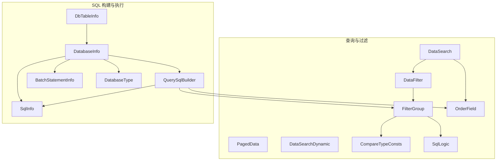
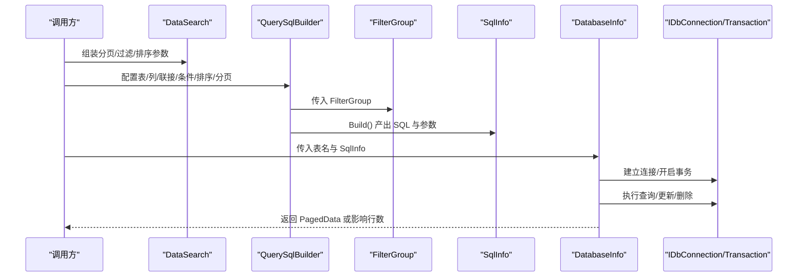
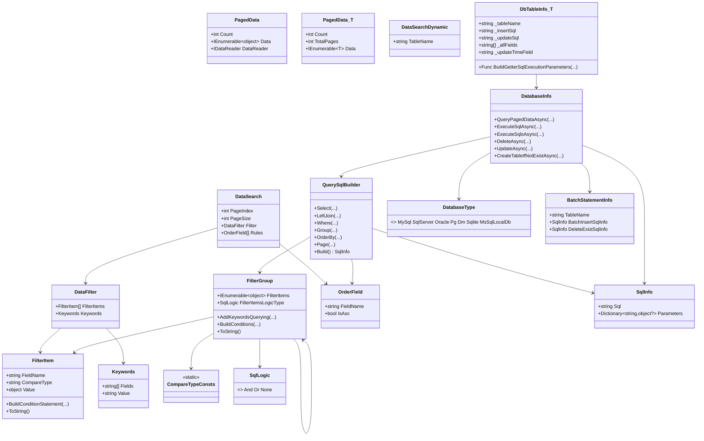

# 数据同步基础

<cite>
**本文引用的文件**
- [DataSearch.cs](file://Sylas.RemoteTasks.Database/SyncBase/DataSearch.cs)
- [PagedData.cs](file://Sylas.RemoteTasks.Database/SyncBase/PagedData.cs)
- [DatabaseType.cs](file://Sylas.RemoteTasks.Database/SyncBase/DatabaseType.cs)
- [DataFilter.cs](file://Sylas.RemoteTasks.Database/SyncBase/DataFilter.cs)
- [OrderField.cs](file://Sylas.RemoteTasks.Database/SyncBase/OrderField.cs)
- [CompareTypeConsts.cs](file://Sylas.RemoteTasks.Database/SyncBase/CompareTypeConsts.cs)
- [FilterGroup.cs](file://Sylas.RemoteTasks.Database/SyncBase/FilterGroup.cs)
- [QuerySqlBuilder.cs](file://Sylas.RemoteTasks.Database/SyncBase/QuerySqlBuilder.cs)
- [SqlInfo.cs](file://Sylas.RemoteTasks.Database/SyncBase/SqlInfo.cs)
- [SqlLogic.cs](file://Sylas.RemoteTasks.Database/SyncBase/SqlLogic.cs)
- [DataSearchDynamic.cs](file://Sylas.RemoteTasks.Database/SyncBase/DataSearchDynamic.cs)
- [BatchStatementInfo.cs](file://Sylas.RemoteTasks.Database/SyncBase/BatchStatementInfo.cs)
- [DatabaseInfo.cs](file://Sylas.RemoteTasks.Database/SyncBase/DatabaseInfo.cs)
- [DbTableInfo.cs](file://Sylas.RemoteTasks.Database/SyncBase/DbTableInfo.cs)
</cite>

## 目录
1. [简介](#简介)
2. [项目结构](#项目结构)
3. [核心组件](#核心组件)
4. [架构总览](#架构总览)
5. [组件详解](#组件详解)
6. [依赖关系分析](#依赖关系分析)
7. [性能与并发](#性能与并发)
8. [故障排查指南](#故障排查指南)
9. [结论](#结论)
10. [附录：使用示例与最佳实践](#附录使用示例与最佳实践)

## 简介
本文件面向“数据同步基础组件”，系统性梳理并解释以下核心类与机制：
- 数据搜索与分页：DataSearch、PagedData、DataSearchDynamic
- 数据过滤与排序：DataFilter、FilterGroup、OrderField、CompareTypeConsts、SqlLogic
- SQL 构建与执行：QuerySqlBuilder、SqlInfo
- 数据库类型与连接：DatabaseType、DatabaseInfo（含连接、事务、批量）
- 实体表元信息：DbTableInfo
- 批量操作与表级 SQL：BatchStatementInfo

文档同时给出数据比较、过滤规则、排序字段的配置方式，以及批量操作、事务处理、并发控制的实现策略；并提供性能优化、错误处理、日志与监控的实践建议。

## 项目结构
该组件位于 Sylas.RemoteTasks.Database/SyncBase 下，围绕“查询参数、过滤器、SQL 构建、执行与事务”形成清晰的分层设计，便于在不同数据库类型间复用。

图示来源
- [DataSearch.cs](file://Sylas.RemoteTasks.Database/SyncBase/DataSearch.cs#L8-L47)
- [PagedData.cs](file://Sylas.RemoteTasks.Database/SyncBase/PagedData.cs#L10-L44)
- [DataSearchDynamic.cs](file://Sylas.RemoteTasks.Database/SyncBase/DataSearchDynamic.cs#L6-L12)
- [DataFilter.cs](file://Sylas.RemoteTasks.Database/SyncBase/DataFilter.cs#L360-L370)
- [FilterGroup.cs](file://Sylas.RemoteTasks.Database/SyncBase/FilterGroup.cs#L13-L36)
- [OrderField.cs](file://Sylas.RemoteTasks.Database/SyncBase/OrderField.cs#L6-L32)
- [CompareTypeConsts.cs](file://Sylas.RemoteTasks.Database/SyncBase/CompareTypeConsts.cs#L8-L53)
- [SqlLogic.cs](file://Sylas.RemoteTasks.Database/SyncBase/SqlLogic.cs#L6-L20)
- [QuerySqlBuilder.cs](file://Sylas.RemoteTasks.Database/SyncBase/QuerySqlBuilder.cs#L11-L387)
- [SqlInfo.cs](file://Sylas.RemoteTasks.Database/SyncBase/SqlInfo.cs#L8-L36)
- [DatabaseInfo.cs](file://Sylas.RemoteTasks.Database/SyncBase/DatabaseInfo.cs#L64-L88)
- [DbTableInfo.cs](file://Sylas.RemoteTasks.Database/SyncBase/DbTableInfo.cs#L18-L109)
- [BatchStatementInfo.cs](file://Sylas.RemoteTasks.Database/SyncBase/BatchStatementInfo.cs#L8-L22)
- [DatabaseType.cs](file://Sylas.RemoteTasks.Database/SyncBase/DatabaseType.cs#L6-L36)

章节来源
- [DataSearch.cs](file://Sylas.RemoteTasks.Database/SyncBase/DataSearch.cs#L1-L49)
- [PagedData.cs](file://Sylas.RemoteTasks.Database/SyncBase/PagedData.cs#L1-L46)
- [DatabaseType.cs](file://Sylas.RemoteTasks.Database/SyncBase/DatabaseType.cs#L1-L38)

## 核心组件
- DataSearch：封装分页、过滤、排序的查询参数，支持默认值与构造初始化。
- PagedData：承载分页结果（计数、数据、可选数据读取器）。
- DataSearchDynamic：扩展 DataSearch，增加目标表名，便于动态查询。
- DataFilter：组合 FilterItem 与关键字查询，统一管理过滤条件。
- FilterGroup：递归构建 SQL 条件，支持 And/Or 嵌套与括号合并。
- OrderField：排序字段与方向，默认按更新时间倒序。
- CompareTypeConsts：比较类型常量集合（>, <, =, >=, <=, !=, in, include）。
- SqlLogic：条件组内/组间的逻辑关系（And/Or/None）。
- QuerySqlBuilder：链式构建 SELECT/JOIN/WHERE/GROUP/ORDER/PAGE，输出 SqlInfo。
- SqlInfo：SQL 与参数的载体。
- DatabaseInfo：数据库连接、事务、分页查询、批量删除、动态更新、表存在性与创建等能力。
- DbTableInfo：基于实体反射生成表名、插入/更新 SQL 与参数提取器。
- BatchStatementInfo：表级批量操作的 SQL 信息容器。

章节来源
- [DataSearch.cs](file://Sylas.RemoteTasks.Database/SyncBase/DataSearch.cs#L8-L47)
- [PagedData.cs](file://Sylas.RemoteTasks.Database/SyncBase/PagedData.cs#L10-L44)
- [DataSearchDynamic.cs](file://Sylas.RemoteTasks.Database/SyncBase/DataSearchDynamic.cs#L6-L12)
- [DataFilter.cs](file://Sylas.RemoteTasks.Database/SyncBase/DataFilter.cs#L360-L370)
- [FilterGroup.cs](file://Sylas.RemoteTasks.Database/SyncBase/FilterGroup.cs#L13-L36)
- [OrderField.cs](file://Sylas.RemoteTasks.Database/SyncBase/OrderField.cs#L6-L32)
- [CompareTypeConsts.cs](file://Sylas.RemoteTasks.Database/SyncBase/CompareTypeConsts.cs#L8-L53)
- [SqlLogic.cs](file://Sylas.RemoteTasks.Database/SyncBase/SqlLogic.cs#L6-L20)
- [QuerySqlBuilder.cs](file://Sylas.RemoteTasks.Database/SyncBase/QuerySqlBuilder.cs#L11-L387)
- [SqlInfo.cs](file://Sylas.RemoteTasks.Database/SyncBase/SqlInfo.cs#L8-L36)
- [DatabaseInfo.cs](file://Sylas.RemoteTasks.Database/SyncBase/DatabaseInfo.cs#L64-L88)
- [DbTableInfo.cs](file://Sylas.RemoteTasks.Database/SyncBase/DbTableInfo.cs#L18-L109)
- [BatchStatementInfo.cs](file://Sylas.RemoteTasks.Database/SyncBase/BatchStatementInfo.cs#L8-L22)

## 架构总览
下图展示从“查询参数”到“SQL 构建与执行”的端到端流程，以及与数据库类型、事务、批量操作的关系。

图示来源
- [DataSearch.cs](file://Sylas.RemoteTasks.Database/SyncBase/DataSearch.cs#L24-L30)
- [QuerySqlBuilder.cs](file://Sylas.RemoteTasks.Database/SyncBase/QuerySqlBuilder.cs#L277-L386)
- [FilterGroup.cs](file://Sylas.RemoteTasks.Database/SyncBase/FilterGroup.cs#L67-L144)
- [SqlInfo.cs](file://Sylas.RemoteTasks.Database/SyncBase/SqlInfo.cs#L23-L35)
- [DatabaseInfo.cs](file://Sylas.RemoteTasks.Database/SyncBase/DatabaseInfo.cs#L309-L351)

## 组件详解

### DataSearch：数据查询参数
- 设计目的：统一承载分页、过滤、排序参数，简化上层调用。
- 关键点：
  - 默认 PageIndex=1、PageSize=20，避免空值。
  - Filter 默认实例化，Rules 默认单元素排序项。
  - 支持带参构造，便于外部 DTO 映射。
- 使用场景：分页查询、动态查询、导出、报表等。

章节来源
- [DataSearch.cs](file://Sylas.RemoteTasks.Database/SyncBase/DataSearch.cs#L13-L30)

### PagedData：分页结果容器
- 设计目的：标准化分页返回结构，支持泛型与非泛型两种形态。
- 关键点：
  - 非泛型：Count、Data、DataReader。
  - 泛型：Count、TotalPages、Data<T>。
- 使用场景：前端分页控件、服务端分页接口。

章节来源
- [PagedData.cs](file://Sylas.RemoteTasks.Database/SyncBase/PagedData.cs#L10-L44)

### DataSearchDynamic：动态查询参数
- 设计目的：在 DataSearch 基础上增加目标表名，便于动态表查询。
- 使用场景：跨表查询、动态表名场景。

章节来源
- [DataSearchDynamic.cs](file://Sylas.RemoteTasks.Database/SyncBase/DataSearchDynamic.cs#L6-L12)

### DataFilter：过滤器与关键字
- 设计目的：将过滤条件抽象为 FilterItem 与关键字查询，统一构建 SQL。
- 关键点：
  - FilterItems：一组 FilterItem。
  - Keywords：关键字字段集合与值，支持模糊匹配。
- 使用场景：高级筛选、全文检索。

章节来源
- [DataFilter.cs](file://Sylas.RemoteTasks.Database/SyncBase/DataFilter.cs#L360-L370)

### FilterItem：单条过滤项
- 设计目的：描述字段、比较类型、值，并生成 SQL 条件与参数。
- 关键点：
  - 比较类型：通过 CompareTypeConsts 定义。
  - 动态参数占位符：支持形如 {name} 的动态参数，自动注入参数名与占位符。
  - In/Include 特殊处理：数组值拆分、LIKE 拼接。
  - 值类型推断：JsonElement 数组、数字、布尔、日期等自动转换。
- 使用场景：复杂条件拼装、安全参数化。

章节来源
- [DataFilter.cs](file://Sylas.RemoteTasks.Database/SyncBase/DataFilter.cs#L14-L111)
- [CompareTypeConsts.cs](file://Sylas.RemoteTasks.Database/SyncBase/CompareTypeConsts.cs#L8-L53)

### FilterGroup：条件组与递归构建
- 设计目的：支持 And/Or 嵌套、括号合并、JSON 反序列化。
- 关键点：
  - BuildConditions：根据数据库类型选择参数前缀（Oracle/Dm 用冒号，其他用 @），递归构建条件。
  - AddKeywordsQuerying：快速叠加关键字 OR 条件。
  - ToString：用于 LEFT JOIN ON 条件串。
- 使用场景：复杂业务条件、联表查询条件。

章节来源
- [FilterGroup.cs](file://Sylas.RemoteTasks.Database/SyncBase/FilterGroup.cs#L13-L144)

### OrderField：排序字段
- 设计目的：统一排序字段与方向，默认按更新时间倒序。
- 关键点：支持构造函数快速赋值。
- 使用场景：列表排序、导出排序。

章节来源
- [OrderField.cs](file://Sylas.RemoteTasks.Database/SyncBase/OrderField.cs#L6-L32)

### QuerySqlBuilder：SQL 构建器
- 设计目的：链式 API 构建 SELECT/JOIN/WHERE/GROUP/ORDER/PAGE，适配多数据库方言。
- 关键点：
  - Select/LeftJoin/LeftJoins：支持多表与列选择。
  - Where/Group/OrderBy/Page：条件组、分组与排序、分页。
  - Build：输出 SqlInfo，自动处理分页方言（Oracle、Dm、MySql、Pg、SqlServer、Sqlite）。
- 使用场景：动态 SQL 构造、报表查询、联表统计。

章节来源
- [QuerySqlBuilder.cs](file://Sylas.RemoteTasks.Database/SyncBase/QuerySqlBuilder.cs#L11-L387)

### SqlInfo：SQL 与参数
- 设计目的：统一 SQL 文本与参数字典，便于执行与调试。
- 关键点：构造函数与默认构造，便于链式构建与直接使用。

章节来源
- [SqlInfo.cs](file://Sylas.RemoteTasks.Database/SyncBase/SqlInfo.cs#L8-L36)

### DatabaseType：数据库类型枚举
- 设计目的：统一数据库类型识别，驱动参数前缀与分页方言。
- 支持：MySql、SqlServer、Oracle、Pg、Dm、Sqlite、MsSqlLocalDb。
- 使用场景：连接字符串解析、参数占位符选择、分页语法适配。

章节来源
- [DatabaseType.cs](file://Sylas.RemoteTasks.Database/SyncBase/DatabaseType.cs#L6-L36)

### DatabaseInfo：数据库操作入口
- 设计目的：封装连接、事务、分页查询、批量删除、动态更新、表创建等。
- 关键点：
  - 连接与类型：根据连接字符串识别数据库类型，设置参数前缀。
  - 事务：ExecuteSql/ExecuteSqls/ExecuteScalar 均在事务中执行，异常回滚。
  - 分页查询：QueryPagedDataAsync，先 COUNT 再查询，返回 PagedData<T>。
  - 批量删除：DeleteAsync，按批拆分 IN 列表，避免超长 SQL。
  - 动态更新：UpdateAsync，自动识别主键、类型转换、可选更新时间字段。
  - 表存在性：CreateTableIfNotExistAsync，不存在则创建。
- 使用场景：数据同步、批量导入/导出、动态表维护。

章节来源
- [DatabaseInfo.cs](file://Sylas.RemoteTasks.Database/SyncBase/DatabaseInfo.cs#L64-L88)
- [DatabaseInfo.cs](file://Sylas.RemoteTasks.Database/SyncBase/DatabaseInfo.cs#L309-L351)
- [DatabaseInfo.cs](file://Sylas.RemoteTasks.Database/SyncBase/DatabaseInfo.cs#L408-L433)
- [DatabaseInfo.cs](file://Sylas.RemoteTasks.Database/SyncBase/DatabaseInfo.cs#L497-L514)
- [DatabaseInfo.cs](file://Sylas.RemoteTasks.Database/SyncBase/DatabaseInfo.cs#L559-L570)
- [DatabaseInfo.cs](file://Sylas.RemoteTasks.Database/SyncBase/DatabaseInfo.cs#L673-L713)
- [DatabaseInfo.cs](file://Sylas.RemoteTasks.Database/SyncBase/DatabaseInfo.cs#L744-L759)

### DbTableInfo：实体表元信息
- 设计目的：基于实体反射生成表名、插入/更新 SQL 与参数提取器，减少手写样板。
- 关键点：
  - 静态构造：缓存表名、字段集、更新时间字段、参数转换器。
  - BuildGetterSqlExecutionParameters：生成将实体转为 DynamicParameters 的表达式树，支持 bool/bit 类型特殊处理。
- 使用场景：ORM/半 ORM 场景、批量插入/更新。

章节来源
- [DbTableInfo.cs](file://Sylas.RemoteTasks.Database/SyncBase/DbTableInfo.cs#L18-L109)
- [DbTableInfo.cs](file://Sylas.RemoteTasks.Database/SyncBase/DbTableInfo.cs#L117-L222)

### BatchStatementInfo：表级批量 SQL
- 设计目的：承载批量插入与删除已存在数据的 SQL 信息，便于批量同步。
- 关键点：包含表名与两条 SqlInfo。
- 使用场景：全量/增量同步、数据清洗。

章节来源
- [BatchStatementInfo.cs](file://Sylas.RemoteTasks.Database/SyncBase/BatchStatementInfo.cs#L8-L22)

## 依赖关系分析

图示来源
- [DataSearch.cs](file://Sylas.RemoteTasks.Database/SyncBase/DataSearch.cs#L8-L47)
- [PagedData.cs](file://Sylas.RemoteTasks.Database/SyncBase/PagedData.cs#L10-L44)
- [DataSearchDynamic.cs](file://Sylas.RemoteTasks.Database/SyncBase/DataSearchDynamic.cs#L6-L12)
- [DataFilter.cs](file://Sylas.RemoteTasks.Database/SyncBase/DataFilter.cs#L360-L370)
- [FilterGroup.cs](file://Sylas.RemoteTasks.Database/SyncBase/FilterGroup.cs#L13-L36)
- [OrderField.cs](file://Sylas.RemoteTasks.Database/SyncBase/OrderField.cs#L6-L32)
- [CompareTypeConsts.cs](file://Sylas.RemoteTasks.Database/SyncBase/CompareTypeConsts.cs#L8-L53)
- [SqlLogic.cs](file://Sylas.RemoteTasks.Database/SyncBase/SqlLogic.cs#L6-L20)
- [QuerySqlBuilder.cs](file://Sylas.RemoteTasks.Database/SyncBase/QuerySqlBuilder.cs#L11-L387)
- [SqlInfo.cs](file://Sylas.RemoteTasks.Database/SyncBase/SqlInfo.cs#L8-L36)
- [DatabaseInfo.cs](file://Sylas.RemoteTasks.Database/SyncBase/DatabaseInfo.cs#L64-L88)
- [DbTableInfo.cs](file://Sylas.RemoteTasks.Database/SyncBase/DbTableInfo.cs#L18-L109)
- [BatchStatementInfo.cs](file://Sylas.RemoteTasks.Database/SyncBase/BatchStatementInfo.cs#L8-L22)

## 性能与并发
- 分页查询
  - 先 COUNT 再查询，避免一次性加载大结果集；合理设置 PageSize。
  - 不同数据库分页语法差异已在 QuerySqlBuilder 中适配，注意避免在大数据量上使用过小的分页大小。
- 事务与批量
  - DatabaseInfo 的执行方法均在事务中执行，异常自动回滚，保证一致性。
  - 批量删除按 500 个一批拆分 IN 列表，避免 SQL 过长与超时。
- 参数化与类型转换
  - FilterItem 对 JsonElement、布尔、数值、日期等进行类型推断与转换，减少字符串拼接与解析开销。
  - DbTableInfo 的参数提取器使用表达式树生成，避免反射调用成本。
- 并发控制
  - 连接池由各数据库驱动管理；建议在应用层控制并发度，避免同时大量大事务。
  - 对于高并发写入，建议结合数据库层面的锁与重试策略。

章节来源
- [QuerySqlBuilder.cs](file://Sylas.RemoteTasks.Database/SyncBase/QuerySqlBuilder.cs#L365-L382)
- [DatabaseInfo.cs](file://Sylas.RemoteTasks.Database/SyncBase/DatabaseInfo.cs#L408-L433)
- [DatabaseInfo.cs](file://Sylas.RemoteTasks.Database/SyncBase/DatabaseInfo.cs#L673-L713)
- [DbTableInfo.cs](file://Sylas.RemoteTasks.Database/SyncBase/DbTableInfo.cs#L117-L222)

## 故障排查指南
- SQL 注入与危险语句
  - DatabaseInfo 在执行前对连接字符串进行清理，避免混淆字符；同时内置危险关键字检测，建议配合白名单校验。
- 连接字符串解析
  - DatabaseInfo.GetDbConnectionDetail 支持多种数据库连接字符串格式，解析失败会抛出异常，需检查连接串格式。
- 表不存在
  - IsTableNotExistException 用于识别表不存在异常；CreateTableIfNotExistAsync 可自动创建表。
- 事务异常
  - ExecuteSql/ExecuteSqls/ExecuteScalar 均在事务中执行，异常会回滚；检查异常堆栈定位具体 SQL。
- 参数前缀不匹配
  - Oracle/Dm 使用冒号作为参数前缀，其他数据库使用 @；QuerySqlBuilder 会自动选择，确保传入正确的 DatabaseType。

章节来源
- [DatabaseInfo.cs](file://Sylas.RemoteTasks.Database/SyncBase/DatabaseInfo.cs#L68-L88)
- [DatabaseInfo.cs](file://Sylas.RemoteTasks.Database/SyncBase/DatabaseInfo.cs#L210-L299)
- [DatabaseInfo.cs](file://Sylas.RemoteTasks.Database/SyncBase/DatabaseInfo.cs#L733-L735)
- [DatabaseInfo.cs](file://Sylas.RemoteTasks.Database/SyncBase/DatabaseInfo.cs#L372-L400)
- [QuerySqlBuilder.cs](file://Sylas.RemoteTasks.Database/SyncBase/QuerySqlBuilder.cs#L17-L26)

## 结论
该数据同步基础组件以“查询参数—过滤器—SQL 构建—执行与事务—批量与表元信息”为主线，覆盖了数据同步场景中的关键环节。通过统一的枚举与工具类，实现了跨数据库的兼容与可扩展；通过事务与批量策略保障了数据一致性与性能。建议在实际项目中结合业务场景，合理配置分页、排序与过滤，充分利用表达式树与参数化能力，确保安全与高效。

## 附录：使用示例与最佳实践

### 示例一：分页查询（含过滤与排序）
- 步骤
  - 构造 DataSearch，设置 PageIndex/PageSize/Filter/Rules。
  - 使用 QuerySqlBuilder 配置表、列、联接、条件、排序、分页。
  - 调用 DatabaseInfo.QueryPagedDataAsync 获取 PagedData<T>。
- 注意
  - FilterGroup.BuildConditions 会根据 DatabaseType 选择参数前缀。
  - 分页大小建议控制在 100~1000 之间，避免过大导致内存压力。

章节来源
- [DataSearch.cs](file://Sylas.RemoteTasks.Database/SyncBase/DataSearch.cs#L24-L30)
- [QuerySqlBuilder.cs](file://Sylas.RemoteTasks.Database/SyncBase/QuerySqlBuilder.cs#L277-L386)
- [DatabaseInfo.cs](file://Sylas.RemoteTasks.Database/SyncBase/DatabaseInfo.cs#L309-L351)

### 示例二：动态更新（带类型转换）
- 步骤
  - 准备 Dictionary<string, object>，包含主键与待更新字段。
  - 调用 DatabaseInfo.UpdateAsync，内部自动识别主键、类型转换、可选更新时间字段。
- 注意
  - 非字符串字段会通过 DbTableInfo 的转换器进行类型转换，避免手动解析。

章节来源
- [DatabaseInfo.cs](file://Sylas.RemoteTasks.Database/SyncBase/DatabaseInfo.cs#L559-L570)
- [DbTableInfo.cs](file://Sylas.RemoteTasks.Database/SyncBase/DbTableInfo.cs#L56-L109)

### 示例三：批量删除（IN 拆分）
- 步骤
  - 调用 DatabaseInfo.DeleteAsync，内部按 500 个一批拆分 IN 列表，循环执行。
- 注意
  - 主键必须唯一，否则抛出异常；确保传入的 ids 类型与主键一致。

章节来源
- [DatabaseInfo.cs](file://Sylas.RemoteTasks.Database/SyncBase/DatabaseInfo.cs#L673-L713)

### 示例四：动态创建表
- 步骤
  - 调用 DatabaseInfo.CreateTableIfNotExistAsync，传入列信息与数据库类型，自动判断并创建。
- 注意
  - 创建日志会输出 SQL，便于审计与排错。

章节来源
- [DatabaseInfo.cs](file://Sylas.RemoteTasks.Database/SyncBase/DatabaseInfo.cs#L744-L759)

### 最佳实践
- 过滤与排序
  - 使用 FilterGroup 的 AddKeywordsQuerying 快速叠加关键字 OR 条件。
  - 排序优先使用索引字段，避免对大字段进行 ORDER BY。
- SQL 构建
  - 优先使用 QuerySqlBuilder 的链式 API，减少手写 SQL 错误。
  - 对于复杂条件，建议先在测试环境验证 FilterGroup.BuildConditions 输出。
- 事务与批量
  - 写操作统一走 DatabaseInfo 的执行方法，确保事务一致性。
  - 批量导入建议分批（如 1000 条/批），并设置合理的超时与重试。
- 日志与监控
  - DatabaseInfo 使用 ILogger 记录 SQL；建议在生产环境配置合适的日志级别与采样率。
  - 对高频查询与大事务，建议埋点统计耗时与异常率。