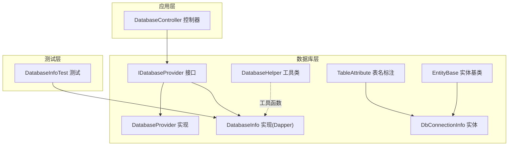
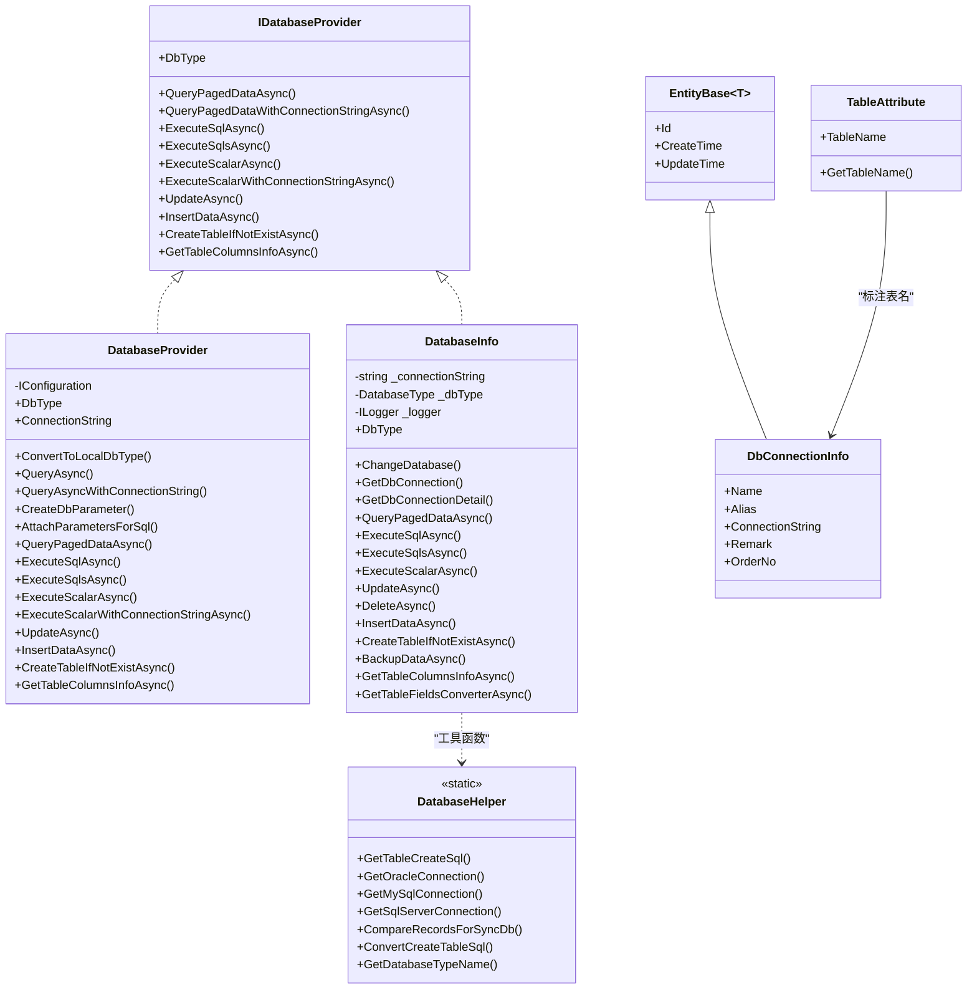
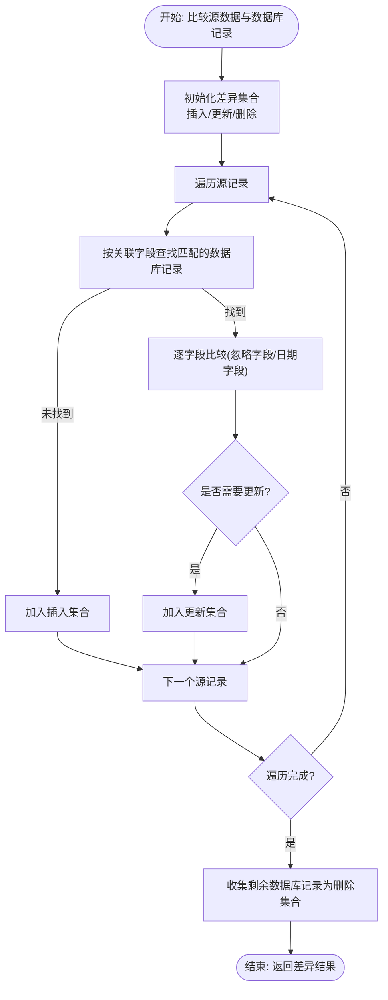
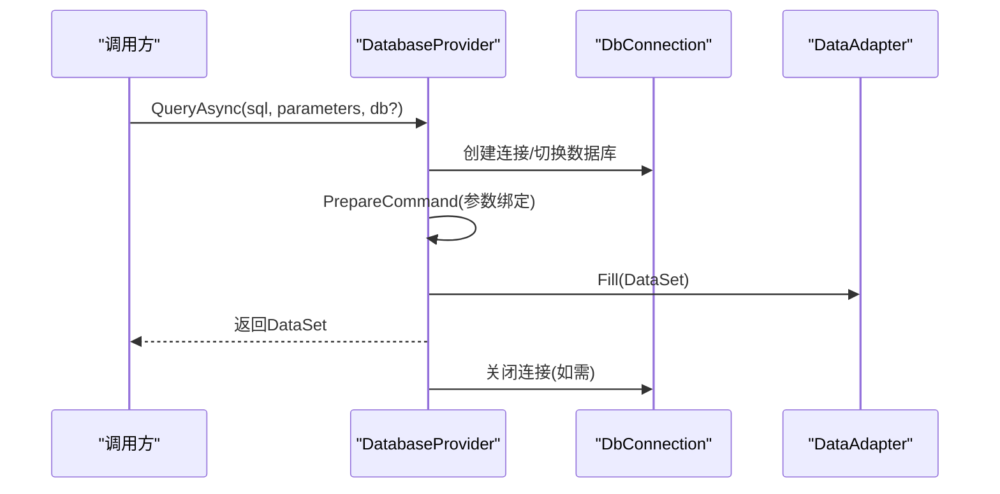
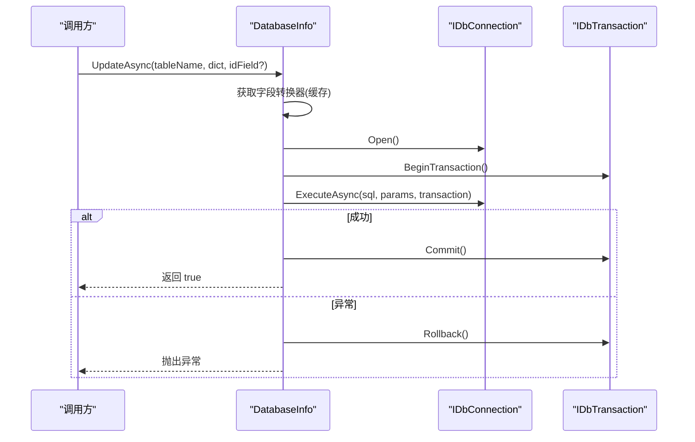
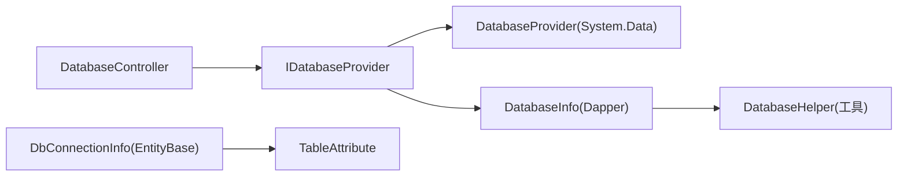

# 数据库助手工具

<cite>
**本文引用的文件**
- [DatabaseHelper.cs](file://Sylas.RemoteTasks.Database/DatabaseHelper.cs)
- [EntityBase.cs](file://Sylas.RemoteTasks.Database/EntityBase.cs)
- [IDatabaseProvider.cs](file://Sylas.RemoteTasks.Database/IDatabaseProvider.cs)
- [DatabaseProvider.cs](file://Sylas.RemoteTasks.Database/DatabaseProvider.cs)
- [DatabaseInfo.cs](file://Sylas.RemoteTasks.Database/SyncBase/DatabaseInfo.cs)
- [DataSearch.cs](file://Sylas.RemoteTasks.Database/SyncBase/DataSearch.cs)
- [DbConnectionInfo.cs](file://Sylas.RemoteTasks.Database/Dtos/DbConnectionInfo.cs)
- [TableAttribute.cs](file://Sylas.RemoteTasks.Database/Attributes/TableAttribute.cs)
- [DatabaseController.cs](file://Sylas.RemoteTasks.App/Controllers/DatabaseController.cs)
- [DatabaseInfoTest.cs](file://Sylas.RemoteTasks.Test/Database/DatabaseInfoTest.cs)
</cite>

## 目录
1. [简介](#简介)
2. [项目结构](#项目结构)
3. [核心组件](#核心组件)
4. [架构总览](#架构总览)
5. [组件详解](#组件详解)
6. [依赖关系分析](#依赖关系分析)
7. [性能考量](#性能考量)
8. [故障排查指南](#故障排查指南)
9. [结论](#结论)
10. [附录](#附录)

## 简介
本指南面向数据库助手工具的使用者与维护者，系统性讲解以下主题：
- DatabaseHelper 类提供的数据库操作辅助方法与工具函数
- EntityBase 基类的设计模式与实体映射机制
- 数据类型转换、连接管理、事务处理的实现细节
- 常用数据库操作的便捷方法与最佳实践
- 与 Dapper ORM 的集成方式与性能优化技巧
- 数据验证、空值处理与异常管理的实现方案
- 实际使用场景与调试技巧

## 项目结构
数据库助手工具位于 Sylas.RemoteTasks.Database 子项目，围绕“接口 + 实现 + 辅助类”的分层设计组织，同时在应用层控制器中提供端到端的使用示例。

图表来源
- [IDatabaseProvider.cs](file://Sylas.RemoteTasks.Database/IDatabaseProvider.cs#L12-L97)
- [DatabaseProvider.cs](file://Sylas.RemoteTasks.Database/DatabaseProvider.cs#L19-L484)
- [DatabaseInfo.cs](file://Sylas.RemoteTasks.Database/SyncBase/DatabaseInfo.cs#L64-L800)
- [DatabaseHelper.cs](file://Sylas.RemoteTasks.Database/DatabaseHelper.cs#L20-L245)
- [TableAttribute.cs](file://Sylas.RemoteTasks.Database/Attributes/TableAttribute.cs#L14-L31)
- [EntityBase.cs](file://Sylas.RemoteTasks.Database/EntityBase.cs#L9-L31)
- [DbConnectionInfo.cs](file://Sylas.RemoteTasks.Database/Dtos/DbConnectionInfo.cs#L10-L33)
- [DatabaseController.cs](file://Sylas.RemoteTasks.App/Controllers/DatabaseController.cs#L18-L200)
- [DatabaseInfoTest.cs](file://Sylas.RemoteTasks.Test/Database/DatabaseInfoTest.cs#L10-L174)

章节来源
- [IDatabaseProvider.cs](file://Sylas.RemoteTasks.Database/IDatabaseProvider.cs#L12-L97)
- [DatabaseProvider.cs](file://Sylas.RemoteTasks.Database/DatabaseProvider.cs#L19-L484)
- [DatabaseInfo.cs](file://Sylas.RemoteTasks.Database/SyncBase/DatabaseInfo.cs#L64-L800)
- [DatabaseHelper.cs](file://Sylas.RemoteTasks.Database/DatabaseHelper.cs#L20-L245)
- [TableAttribute.cs](file://Sylas.RemoteTasks.Database/Attributes/TableAttribute.cs#L14-L31)
- [EntityBase.cs](file://Sylas.RemoteTasks.Database/EntityBase.cs#L9-L31)
- [DbConnectionInfo.cs](file://Sylas.RemoteTasks.Database/Dtos/DbConnectionInfo.cs#L10-L33)
- [DatabaseController.cs](file://Sylas.RemoteTasks.App/Controllers/DatabaseController.cs#L18-L200)
- [DatabaseInfoTest.cs](file://Sylas.RemoteTasks.Test/Database/DatabaseInfoTest.cs#L10-L174)

## 核心组件
- DatabaseHelper：静态工具类，提供连接字符串构造、跨库对比与同步辅助、SQL 转换等能力
- IDatabaseProvider：统一的数据库操作接口，定义分页查询、执行 SQL、动态更新、建表、列信息等契约
- DatabaseProvider：基于 System.Data 的实现，负责连接准备、参数绑定、事务封装与基础 CRUD
- DatabaseInfo：基于 Dapper 的实现，提供高性能查询、动态更新、建表、备份、类型转换缓存等
- EntityBase：泛型实体基类，统一 Id、CreateTime、UpdateTime 字段
- TableAttribute：实体表名标注，支持自定义表名或回退类名
- DbConnectionInfo：数据库连接信息实体，继承 EntityBase<int>

章节来源
- [DatabaseHelper.cs](file://Sylas.RemoteTasks.Database/DatabaseHelper.cs#L20-L245)
- [IDatabaseProvider.cs](file://Sylas.RemoteTasks.Database/IDatabaseProvider.cs#L12-L97)
- [DatabaseProvider.cs](file://Sylas.RemoteTasks.Database/DatabaseProvider.cs#L19-L484)
- [DatabaseInfo.cs](file://Sylas.RemoteTasks.Database/SyncBase/DatabaseInfo.cs#L64-L800)
- [EntityBase.cs](file://Sylas.RemoteTasks.Database/EntityBase.cs#L9-L31)
- [TableAttribute.cs](file://Sylas.RemoteTasks.Database/Attributes/TableAttribute.cs#L14-L31)
- [DbConnectionInfo.cs](file://Sylas.RemoteTasks.Database/Dtos/DbConnectionInfo.cs#L10-L33)

## 架构总览
数据库助手工具采用“接口抽象 + 多实现 + 工具辅助”的架构：
- 接口层：IDatabaseProvider 统一对外能力
- 实现层：DatabaseProvider（System.Data）与 DatabaseInfo（Dapper）分别覆盖不同场景
- 工具层：DatabaseHelper 提供连接构造、对比同步、SQL 转换等辅助
- 应用层：DatabaseController 通过仓储与接口协作完成业务闭环
- 测试层：DatabaseInfoTest 展示多数据库类型、跨库迁移、动态更新等典型用法

图表来源
- [IDatabaseProvider.cs](file://Sylas.RemoteTasks.Database/IDatabaseProvider.cs#L12-L97)
- [DatabaseProvider.cs](file://Sylas.RemoteTasks.Database/DatabaseProvider.cs#L19-L484)
- [DatabaseInfo.cs](file://Sylas.RemoteTasks.Database/SyncBase/DatabaseInfo.cs#L64-L800)
- [DatabaseHelper.cs](file://Sylas.RemoteTasks.Database/DatabaseHelper.cs#L20-L245)
- [EntityBase.cs](file://Sylas.RemoteTasks.Database/EntityBase.cs#L9-L31)
- [TableAttribute.cs](file://Sylas.RemoteTasks.Database/Attributes/TableAttribute.cs#L14-L31)
- [DbConnectionInfo.cs](file://Sylas.RemoteTasks.Database/Dtos/DbConnectionInfo.cs#L10-L33)

## 组件详解

### DatabaseHelper：数据库操作辅助工具
- 连接字符串构造
  - 提供 Oracle、MySql、SqlServer 的连接字符串构建方法，便于快速建立连接
- 表结构与 SQL 转换
  - 提供获取建表 SQL 的方法，以及 Oracle 到 MySQL 的建表语句转换逻辑
- 数据对比与同步辅助
  - 对比源数据与数据库记录，输出插入、更新、删除三类差异集，支持忽略字段与日期字段特殊比较
- 数据库类型识别
  - 依据连接字符串特征识别数据库类型（Oracle/MySql/SqlServer）

图表来源
- [DatabaseHelper.cs](file://Sylas.RemoteTasks.Database/DatabaseHelper.cs#L69-L164)

章节来源
- [DatabaseHelper.cs](file://Sylas.RemoteTasks.Database/DatabaseHelper.cs#L20-L245)

### IDatabaseProvider：统一数据库操作接口
- 定义了分页查询、执行 SQL、动态更新、建表、列信息等通用能力
- 支持通过数据库名或连接字符串切换目标数据库
- 为不同实现提供一致的调用契约

章节来源
- [IDatabaseProvider.cs](file://Sylas.RemoteTasks.Database/IDatabaseProvider.cs#L12-L97)

### DatabaseProvider：基于 System.Data 的实现
- 连接管理与准备
  - 在执行前自动打开连接，必要时关闭；支持事务封装
- 参数绑定
  - 提供 CreateDbParameter 与 AttachParametersForSql，支持字符串参数长度设定以复用执行计划
- 事务处理
  - 所有写操作在事务中执行，异常时回滚
- 分页查询
  - 结合 DatabaseInfo 的分页 SQL 生成，返回 PagedData<T>

图表来源
- [DatabaseProvider.cs](file://Sylas.RemoteTasks.Database/DatabaseProvider.cs#L177-L258)

章节来源
- [DatabaseProvider.cs](file://Sylas.RemoteTasks.Database/DatabaseProvider.cs#L19-L484)

### DatabaseInfo：基于 Dapper 的高性能实现
- 连接与类型识别
  - 支持多种数据库连接对象，解析连接字符串并识别数据库类型
- 动态更新
  - 基于表字段类型转换器，将字符串值转换为目标类型；自动追加更新时间字段；支持多参数批量删除
- 备份与迁移
  - 支持按表备份数据到文件，使用 DataReader 流式读取避免内存压力
- 类型转换缓存
  - 使用并发字典缓存表字段转换器，减少重复反射成本
- 事务与异常
  - 写操作统一在事务中执行，异常回滚

图表来源
- [DatabaseInfo.cs](file://Sylas.RemoteTasks.Database/SyncBase/DatabaseInfo.cs#L497-L663)

章节来源
- [DatabaseInfo.cs](file://Sylas.RemoteTasks.Database/SyncBase/DatabaseInfo.cs#L64-L800)

### EntityBase 与 TableAttribute：实体映射机制
- EntityBase
  - 泛型基类，统一提供 Id、CreateTime、UpdateTime 字段，便于实体生命周期管理
- TableAttribute
  - 通过特性标注实体对应的表名，若未标注则回退为类名
- DbConnectionInfo
  - 继承 EntityBase<int>，结合 TableAttribute 标注表名为 DbConnectionInfos

章节来源
- [EntityBase.cs](file://Sylas.RemoteTasks.Database/EntityBase.cs#L9-L31)
- [TableAttribute.cs](file://Sylas.RemoteTasks.Database/Attributes/TableAttribute.cs#L14-L31)
- [DbConnectionInfo.cs](file://Sylas.RemoteTasks.Database/Dtos/DbConnectionInfo.cs#L10-L33)

### 应用层集成：DatabaseController
- 提供数据库连接信息的增删改查、备份与历史记录分页查询
- 在备份流程中解密连接字符串，调用 DatabaseInfo.BackupDataAsync 完成备份

章节来源
- [DatabaseController.cs](file://Sylas.RemoteTasks.App/Controllers/DatabaseController.cs#L18-L200)

### 测试用例：DatabaseInfoTest
- 展示多数据库类型连接字符串识别
- 跨库迁移与动态更新
- 备份流程与表结构复制

章节来源
- [DatabaseInfoTest.cs](file://Sylas.RemoteTasks.Test/Database/DatabaseInfoTest.cs#L10-L174)

## 依赖关系分析
- DatabaseProvider 与 DatabaseInfo 均实现 IDatabaseProvider，分别面向 System.Data 与 Dapper
- DatabaseHelper 作为工具类被 DatabaseInfo 等实现间接使用
- 应用层通过仓储与接口协作，控制器依赖接口而非具体实现
- 实体层通过 TableAttribute 与 EntityBase 统一映射与生命周期

图表来源
- [IDatabaseProvider.cs](file://Sylas.RemoteTasks.Database/IDatabaseProvider.cs#L12-L97)
- [DatabaseProvider.cs](file://Sylas.RemoteTasks.Database/DatabaseProvider.cs#L19-L484)
- [DatabaseInfo.cs](file://Sylas.RemoteTasks.Database/SyncBase/DatabaseInfo.cs#L64-L800)
- [DatabaseHelper.cs](file://Sylas.RemoteTasks.Database/DatabaseHelper.cs#L20-L245)
- [DbConnectionInfo.cs](file://Sylas.RemoteTasks.Database/Dtos/DbConnectionInfo.cs#L10-L33)
- [TableAttribute.cs](file://Sylas.RemoteTasks.Database/Attributes/TableAttribute.cs#L14-L31)
- [DatabaseController.cs](file://Sylas.RemoteTasks.App/Controllers/DatabaseController.cs#L18-L200)

章节来源
- [IDatabaseProvider.cs](file://Sylas.RemoteTasks.Database/IDatabaseProvider.cs#L12-L97)
- [DatabaseProvider.cs](file://Sylas.RemoteTasks.Database/DatabaseProvider.cs#L19-L484)
- [DatabaseInfo.cs](file://Sylas.RemoteTasks.Database/SyncBase/DatabaseInfo.cs#L64-L800)
- [DatabaseHelper.cs](file://Sylas.RemoteTasks.Database/DatabaseHelper.cs#L20-L245)
- [DbConnectionInfo.cs](file://Sylas.RemoteTasks.Database/Dtos/DbConnectionInfo.cs#L10-L33)
- [TableAttribute.cs](file://Sylas.RemoteTasks.Database/Attributes/TableAttribute.cs#L14-L31)
- [DatabaseController.cs](file://Sylas.RemoteTasks.App/Controllers/DatabaseController.cs#L18-L200)

## 性能考量
- Dapper 集成与批量操作
  - 使用 Dapper 的 Query/Execute 可显著降低 ORM 开销；批量删除采用分批参数化，避免长参数列表
- 类型转换缓存
  - DatabaseInfo 对表字段转换器进行缓存，减少反射与表达式构建成本
- 参数绑定优化
  - 字符串参数显式指定 Size，有助于数据库重用执行计划
- 备份流式读取
  - 使用 DataReader 逐行读取，避免一次性加载大量数据
- 事务边界
  - 写操作统一在事务中执行，减少往返与锁竞争

章节来源
- [DatabaseInfo.cs](file://Sylas.RemoteTasks.Database/SyncBase/DatabaseInfo.cs#L515-L549)
- [DatabaseInfo.cs](file://Sylas.RemoteTasks.Database/SyncBase/DatabaseInfo.cs#L665-L713)
- [DatabaseProvider.cs](file://Sylas.RemoteTasks.Database/DatabaseProvider.cs#L292-L311)
- [DatabaseInfo.cs](file://Sylas.RemoteTasks.Database/SyncBase/DatabaseInfo.cs#L855-L941)

## 故障排查指南
- 连接字符串问题
  - 确认连接字符串格式正确，必要时使用 DatabaseInfo.GetDbConnectionDetail 解析
- 事务异常
  - 写操作抛出异常时会自动回滚；检查参数与表结构是否匹配
- 动态更新失败
  - 确保包含主键字段或显式指定 idFieldName；检查字段类型转换器是否正确
- 备份失败
  - 检查备份目录权限与磁盘空间；确认表存在且查询条件合法
- 参数为空
  - 空输入参数会被转换为 DBNull.Value，避免因 null 导致的异常

章节来源
- [DatabaseInfo.cs](file://Sylas.RemoteTasks.Database/SyncBase/DatabaseInfo.cs#L109-L134)
- [DatabaseInfo.cs](file://Sylas.RemoteTasks.Database/SyncBase/DatabaseInfo.cs#L372-L400)
- [DatabaseInfo.cs](file://Sylas.RemoteTasks.Database/SyncBase/DatabaseInfo.cs#L497-L504)
- [DatabaseInfo.cs](file://Sylas.RemoteTasks.Database/SyncBase/DatabaseInfo.cs#L950-L990)
- [DatabaseProvider.cs](file://Sylas.RemoteTasks.Database/DatabaseProvider.cs#L145-L165)

## 结论
数据库助手工具通过接口抽象与多实现策略，兼顾了灵活性与性能：
- DatabaseHelper 提供实用的辅助能力，简化连接与同步流程
- DatabaseProvider 与 DatabaseInfo 分别覆盖传统 ADO.NET 与 Dapper 场景
- EntityBase 与 TableAttribute 使实体映射简洁统一
- 在应用层与测试层提供了完整的使用范式与验证路径

## 附录

### 常用操作清单
- 分页查询
  - 使用 IDatabaseProvider 的 QueryPagedDataAsync 或 QueryPagedDataWithConnectionStringAsync
- 动态更新
  - 使用 UpdateAsync，确保提供主键字段或指定 idFieldName
- 批量删除
  - 使用 DeleteAsync，内部按批处理参数化
- 建表
  - 使用 CreateTableIfNotExistAsync，支持从源表或列信息创建
- 备份
  - 使用 BackupDataAsync，按表导出为文本文件，便于归档与迁移

章节来源
- [IDatabaseProvider.cs](file://Sylas.RemoteTasks.Database/IDatabaseProvider.cs#L25-L96)
- [DatabaseInfo.cs](file://Sylas.RemoteTasks.Database/SyncBase/DatabaseInfo.cs#L497-L514)
- [DatabaseInfo.cs](file://Sylas.RemoteTasks.Database/SyncBase/DatabaseInfo.cs#L665-L713)
- [DatabaseInfo.cs](file://Sylas.RemoteTasks.Database/SyncBase/DatabaseInfo.cs#L737-L797)
- [DatabaseInfo.cs](file://Sylas.RemoteTasks.Database/SyncBase/DatabaseInfo.cs#L855-L941)

### 最佳实践
- 显式指定字符串参数长度，提升执行计划复用率
- 在写操作中尽量合并为单事务，减少锁竞争
- 使用 EntityBase 统一时间戳字段，便于审计与排序
- 通过 TableAttribute 明确实体与表的映射关系
- 备份时使用 DataReader 流式读取，控制内存占用

章节来源
- [DatabaseProvider.cs](file://Sylas.RemoteTasks.Database/DatabaseProvider.cs#L292-L311)
- [EntityBase.cs](file://Sylas.RemoteTasks.Database/EntityBase.cs#L9-L31)
- [TableAttribute.cs](file://Sylas.RemoteTasks.Database/Attributes/TableAttribute.cs#L14-L31)
- [DatabaseInfo.cs](file://Sylas.RemoteTasks.Database/SyncBase/DatabaseInfo.cs#L855-L941)