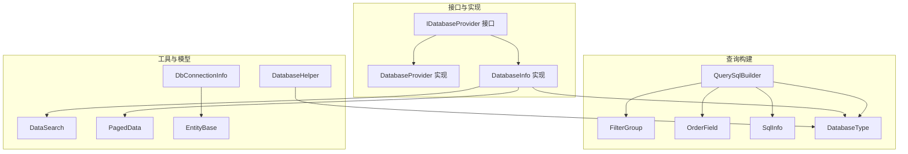
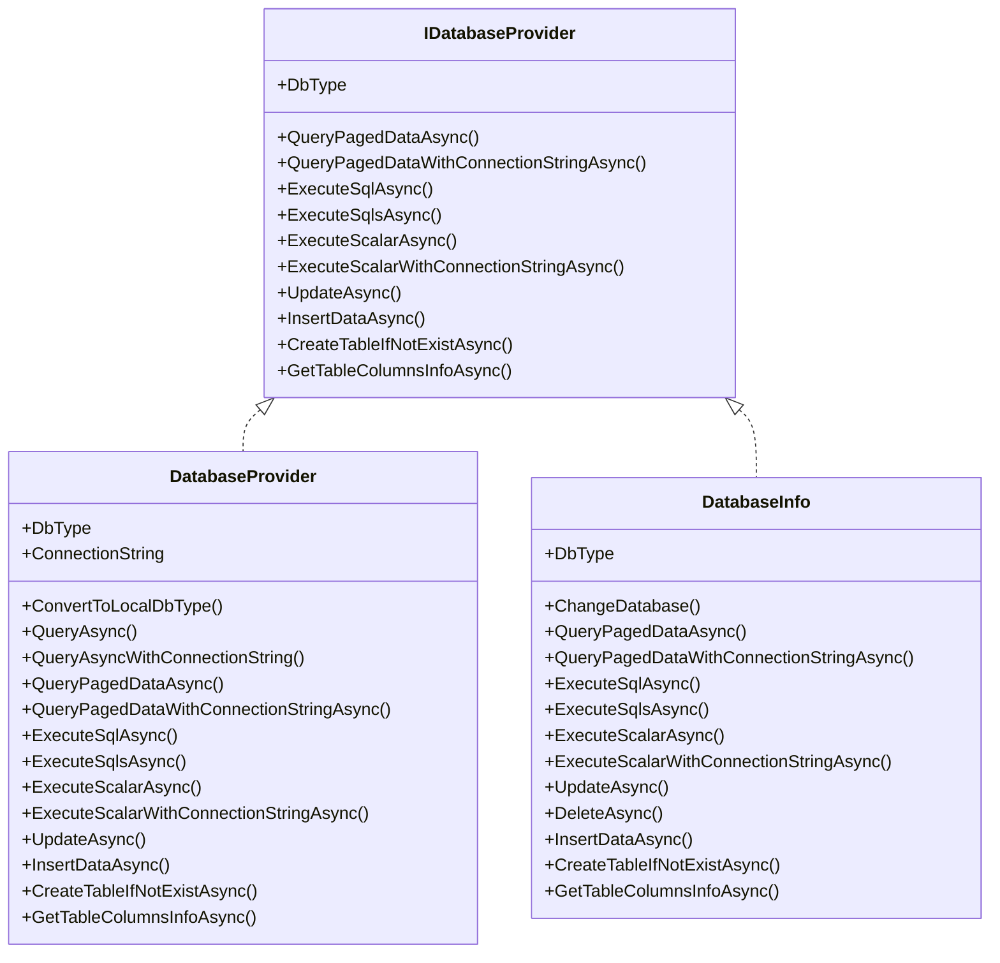
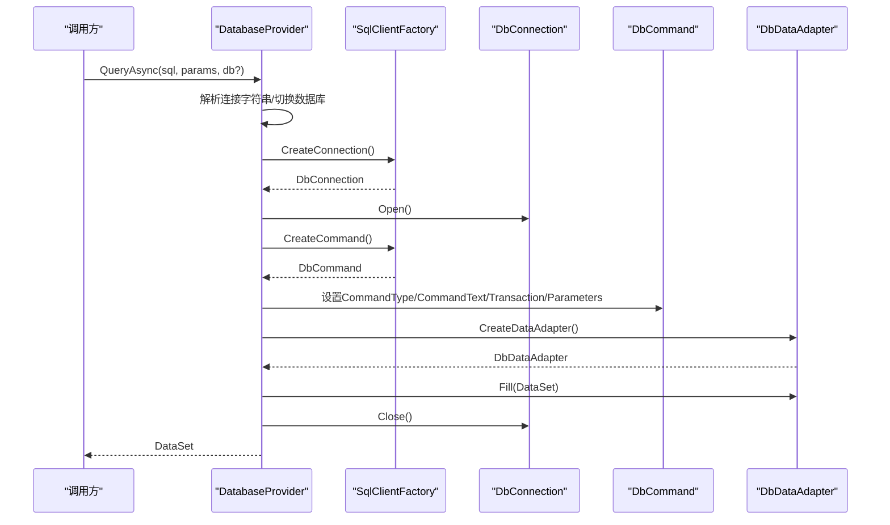
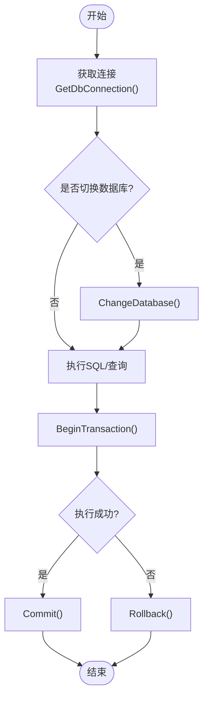
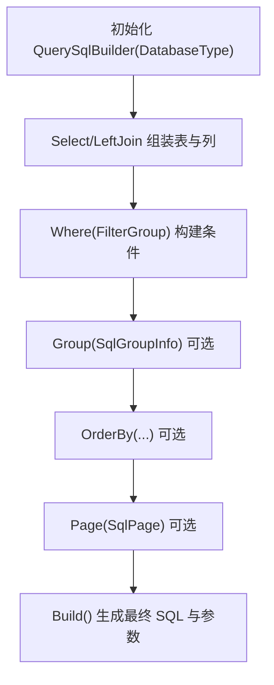
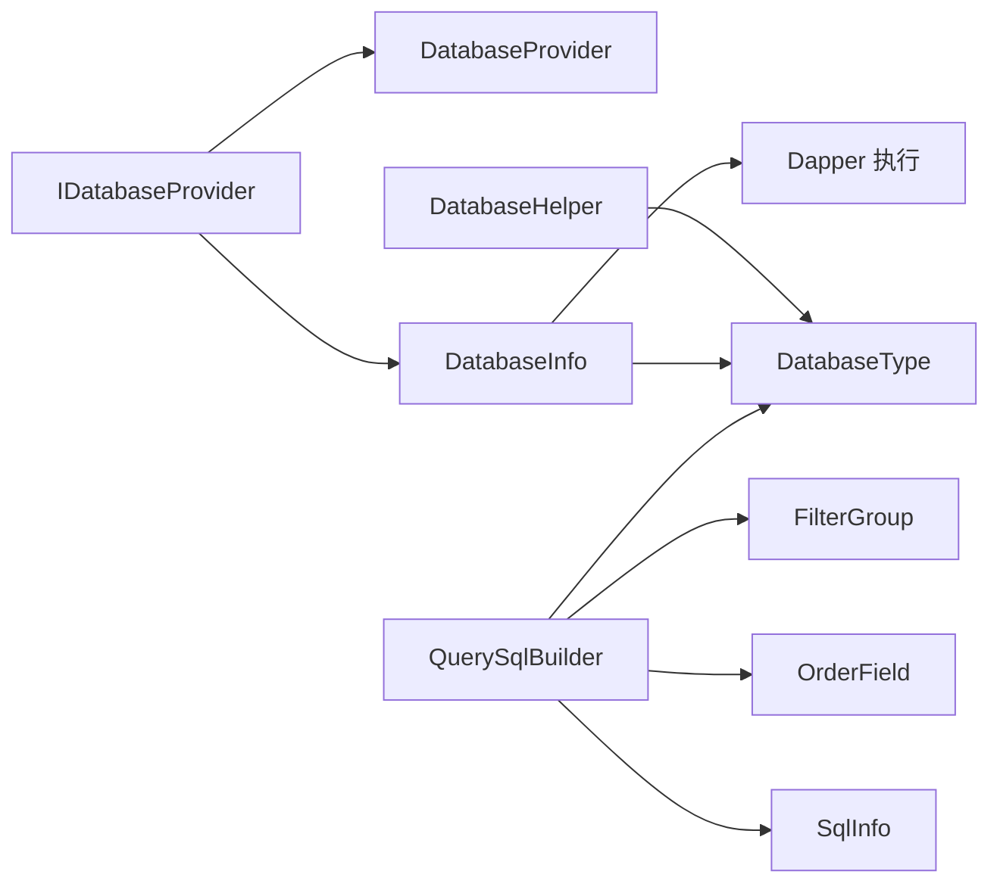

# 数据库抽象层

<cite>
**本文引用的文件**
- [DatabaseProvider.cs](file://Sylas.RemoteTasks.Database/DatabaseProvider.cs)
- [IDatabaseProvider.cs](file://Sylas.RemoteTasks.Database/IDatabaseProvider.cs)
- [DatabaseHelper.cs](file://Sylas.RemoteTasks.Database/DatabaseHelper.cs)
- [QuerySqlBuilder.cs](file://Sylas.RemoteTasks.Database/SyncBase/QuerySqlBuilder.cs)
- [DatabaseType.cs](file://Sylas.RemoteTasks.Database/SyncBase/DatabaseType.cs)
- [DatabaseInfo.cs](file://Sylas.RemoteTasks.Database/SyncBase/DatabaseInfo.cs)
- [DataSearch.cs](file://Sylas.RemoteTasks.Database/SyncBase/DataSearch.cs)
- [PagedData.cs](file://Sylas.RemoteTasks.Database/SyncBase/PagedData.cs)
- [FilterGroup.cs](file://Sylas.RemoteTasks.Database/SyncBase/FilterGroup.cs)
- [OrderField.cs](file://Sylas.RemoteTasks.Database/SyncBase/OrderField.cs)
- [SqlInfo.cs](file://Sylas.RemoteTasks.Database/SyncBase/SqlInfo.cs)
- [DbConnectionInfo.cs](file://Sylas.RemoteTasks.Database/Dtos/DbConnectionInfo.cs)
- [EntityBase.cs](file://Sylas.RemoteTasks.App/Database/EntityBase.cs)
</cite>

## 目录
1. [引言](#引言)
2. [项目结构](#项目结构)
3. [核心组件](#核心组件)
4. [架构总览](#架构总览)
5. [组件详解](#组件详解)
6. [依赖关系分析](#依赖关系分析)
7. [性能考量](#性能考量)
8. [故障排查指南](#故障排查指南)
9. [结论](#结论)
10. [附录：数据库类型与配置示例](#附录数据库类型与配置示例)

## 引言
本文件系统性地梳理并文档化了数据库抽象层的设计与实现，重点覆盖以下方面：
- DatabaseProvider 的接口契约与实现模式，以及其与多数据库类型的支持机制
- IDatabaseProvider 接口的契约定义与实现要求
- DatabaseHelper 的工具方法与数据库操作封装
- QuerySqlBuilder 的 SQL 构建策略与跨数据库分页优化
- 支持的数据库类型与配置要点
- 连接池管理、事务处理与批量操作最佳实践
- 与上层应用的集成方式与性能优化建议

## 项目结构
数据库抽象层位于 Sylas.RemoteTasks.Database 命名空间下，采用“接口 + 工厂/工具 + 查询构建器”的分层设计：
- 接口层：IDatabaseProvider 定义统一能力边界
- 实现层：DatabaseProvider 与 DatabaseInfo 提供具体实现（前者面向旧式 Db* 类型，后者基于 Dapper）
- 查询构建层：QuerySqlBuilder 提供跨数据库的 SQL 组装与分页策略
- 工具层：DatabaseHelper 提供连接字符串解析、对比同步等辅助能力
- 数据模型：DatabaseType、DataSearch、PagedData、FilterGroup、OrderField、SqlInfo 等支撑查询与分页

图表来源
- [IDatabaseProvider.cs](file://Sylas.RemoteTasks.Database/IDatabaseProvider.cs#L12-L97)
- [DatabaseProvider.cs](file://Sylas.RemoteTasks.Database/DatabaseProvider.cs#L19-L484)
- [DatabaseInfo.cs](file://Sylas.RemoteTasks.Database/SyncBase/DatabaseInfo.cs#L64-L88)
- [QuerySqlBuilder.cs](file://Sylas.RemoteTasks.Database/SyncBase/QuerySqlBuilder.cs#L11-L387)
- [FilterGroup.cs](file://Sylas.RemoteTasks.Database/SyncBase/FilterGroup.cs#L13-L144)
- [OrderField.cs](file://Sylas.RemoteTasks.Database/SyncBase/OrderField.cs#L6-L32)
- [SqlInfo.cs](file://Sylas.RemoteTasks.Database/SyncBase/SqlInfo.cs#L8-L36)
- [DatabaseType.cs](file://Sylas.RemoteTasks.Database/SyncBase/DatabaseType.cs#L6-L36)
- [DatabaseHelper.cs](file://Sylas.RemoteTasks.Database/DatabaseHelper.cs#L20-L244)
- [DataSearch.cs](file://Sylas.RemoteTasks.Database/SyncBase/DataSearch.cs#L8-L47)
- [PagedData.cs](file://Sylas.RemoteTasks.Database/SyncBase/PagedData.cs#L10-L44)
- [DbConnectionInfo.cs](file://Sylas.RemoteTasks.Database/Dtos/DbConnectionInfo.cs#L10-L32)
- [EntityBase.cs](file://Sylas.RemoteTasks.App/Database/EntityBase.cs#L9-L31)

章节来源
- [IDatabaseProvider.cs](file://Sylas.RemoteTasks.Database/IDatabaseProvider.cs#L12-L97)
- [DatabaseProvider.cs](file://Sylas.RemoteTasks.Database/DatabaseProvider.cs#L19-L484)
- [DatabaseInfo.cs](file://Sylas.RemoteTasks.Database/SyncBase/DatabaseInfo.cs#L64-L88)
- [QuerySqlBuilder.cs](file://Sylas.RemoteTasks.Database/SyncBase/QuerySqlBuilder.cs#L11-L387)
- [DatabaseHelper.cs](file://Sylas.RemoteTasks.Database/DatabaseHelper.cs#L20-L244)

## 核心组件
- IDatabaseProvider：定义统一的数据库操作契约，包括分页查询、执行 SQL、动态更新/插入/创建表、获取列信息等
- DatabaseProvider：基于 DbConnection/DbCommand 的传统实现，支持参数化、事务包装、分页与批量执行
- DatabaseInfo：基于 Dapper 的现代实现，具备更强的连接管理、类型转换缓存、批量删除与动态更新等能力
- QuerySqlBuilder：链式 API 构建 SELECT/LJOIN/WHERE/GROUP/ORDER/PAGE，自动适配不同数据库的参数标记与分页语法
- DatabaseHelper：连接字符串解析、数据库类型识别、数据对比与同步辅助
- 数据模型：DatabaseType、DataSearch、PagedData、FilterGroup、OrderField、SqlInfo

章节来源
- [IDatabaseProvider.cs](file://Sylas.RemoteTasks.Database/IDatabaseProvider.cs#L12-L97)
- [DatabaseProvider.cs](file://Sylas.RemoteTasks.Database/DatabaseProvider.cs#L19-L484)
- [DatabaseInfo.cs](file://Sylas.RemoteTasks.Database/SyncBase/DatabaseInfo.cs#L64-L88)
- [QuerySqlBuilder.cs](file://Sylas.RemoteTasks.Database/SyncBase/QuerySqlBuilder.cs#L11-L387)
- [DatabaseHelper.cs](file://Sylas.RemoteTasks.Database/DatabaseHelper.cs#L20-L244)

## 架构总览
数据库抽象层采用“接口 + 多实现 + 查询构建器 + 工具”的组合模式：
- 上层通过 IDatabaseProvider 抽象调用，屏蔽底层差异
- DatabaseProvider 与 DatabaseInfo 分别面向传统 ADO.NET 与 Dapper，满足不同场景需求
- QuerySqlBuilder 作为查询组装器，统一跨数据库的 SQL 生成与分页策略
- DatabaseHelper 提供连接字符串解析与数据对比等通用能力

图表来源
- [IDatabaseProvider.cs](file://Sylas.RemoteTasks.Database/IDatabaseProvider.cs#L12-L97)
- [DatabaseProvider.cs](file://Sylas.RemoteTasks.Database/DatabaseProvider.cs#L19-L484)
- [DatabaseInfo.cs](file://Sylas.RemoteTasks.Database/SyncBase/DatabaseInfo.cs#L64-L88)

## 组件详解

### IDatabaseProvider 接口契约与实现要求
- 契约范围：分页查询、执行 SQL、动态更新/插入/创建表、获取列信息等
- 实现要求：
  - 正确识别并暴露 DbType
  - 支持可选的数据库切换（db 或 connectionString）
  - 参数化查询，避免拼接 SQL
  - 事务包装（建议），保证执行一致性
  - 返回类型安全，泛型分页结果 PagedData<T>

章节来源
- [IDatabaseProvider.cs](file://Sylas.RemoteTasks.Database/IDatabaseProvider.cs#L12-L97)

### DatabaseProvider 设计模式与多数据库支持
- 设计模式：面向接口编程，通过 IConfiguration 注入默认连接字符串；内部使用 SqlClientFactory 创建连接与命令，便于扩展其他提供程序
- 多数据库支持：
  - 通过 ConnectionString 自动识别数据库类型
  - 支持字符串参数与非字符串参数的参数创建策略
  - 支持分页查询与批量执行
  - 支持 AES 解密存储的连接字符串
- 关键实现点：
  - PrepareCommand/AttachParameters：连接状态检查、事务绑定、参数附加
  - ExecuteQuerySqlAsync：连接创建、参数附加、DataSet 填充
  - QueryPagedDataAsync：基于 DatabaseInfo.GetPagedSql 生成分页 SQL，并返回 PagedData<T>

图表来源
- [DatabaseProvider.cs](file://Sylas.RemoteTasks.Database/DatabaseProvider.cs#L177-L258)

章节来源
- [DatabaseProvider.cs](file://Sylas.RemoteTasks.Database/DatabaseProvider.cs#L19-L484)

### DatabaseInfo：现代化实现与最佳实践
- 连接管理：基于 Dapper 的 IDbConnection，支持 MySQL、Oracle、SqlServer、Pg、Sqlite、达梦等
- 事务处理：每个操作在 BeginTransaction/Commit/Rollback 包裹内执行，确保原子性
- 类型转换缓存：针对表字段的字符串转目标类型进行缓存，减少重复表达式编译开销
- 批量删除：按 500 个一组拆分 IN 列表，降低参数膨胀与执行计划抖动
- 动态更新：自动识别主键字段，自动生成 SET 与 WHERE 子句，并可自动更新时间戳字段

图表来源
- [DatabaseInfo.cs](file://Sylas.RemoteTasks.Database/SyncBase/DatabaseInfo.cs#L372-L400)
- [DatabaseInfo.cs](file://Sylas.RemoteTasks.Database/SyncBase/DatabaseInfo.cs#L408-L433)
- [DatabaseInfo.cs](file://Sylas.RemoteTasks.Database/SyncBase/DatabaseInfo.cs#L454-L476)

章节来源
- [DatabaseInfo.cs](file://Sylas.RemoteTasks.Database/SyncBase/DatabaseInfo.cs#L64-L88)
- [DatabaseInfo.cs](file://Sylas.RemoteTasks.Database/SyncBase/DatabaseInfo.cs#L309-L351)
- [DatabaseInfo.cs](file://Sylas.RemoteTasks.Database/SyncBase/DatabaseInfo.cs#L497-L504)
- [DatabaseInfo.cs](file://Sylas.RemoteTasks.Database/SyncBase/DatabaseInfo.cs#L515-L549)
- [DatabaseInfo.cs](file://Sylas.RemoteTasks.Database/SyncBase/DatabaseInfo.cs#L664-L713)

### DatabaseHelper：工具方法与数据库操作封装
- 连接字符串解析与类型识别：根据连接串特征判断数据库类型
- 连接对象工厂：提供 Oracle/MySql/SqlServer/Sqlite/Pg/达梦 的连接对象创建
- 数据对比与同步：对比源数据与目标库记录，输出插入/更新/删除三类集合
- SQL 转换：提供 Oracle 到 MySql 的建表语句转换辅助

章节来源
- [DatabaseHelper.cs](file://Sylas.RemoteTasks.Database/DatabaseHelper.cs#L20-L244)

### QuerySqlBuilder：SQL 构建策略与查询优化
- 参数标记适配：Oracle/达梦使用冒号前缀，其他使用 @ 前缀
- 链式 API：Select/LeftJoin/Where/Group/OrderBy/Page 组合
- 分页策略：根据 DatabaseType 选择 OFFSET/FETCH、ROWNUM、LIMIT、Pg 的 LIMIT/OFFSET、Sqlite 的 LIMIT/OFFSET
- 条件构建：FilterGroup 支持递归 AND/OR 组合，自动处理括号与参数去重

图表来源
- [QuerySqlBuilder.cs](file://Sylas.RemoteTasks.Database/SyncBase/QuerySqlBuilder.cs#L17-L387)
- [FilterGroup.cs](file://Sylas.RemoteTasks.Database/SyncBase/FilterGroup.cs#L67-L144)
- [OrderField.cs](file://Sylas.RemoteTasks.Database/SyncBase/OrderField.cs#L6-L32)
- [SqlInfo.cs](file://Sylas.RemoteTasks.Database/SyncBase/SqlInfo.cs#L8-L36)
- [DatabaseType.cs](file://Sylas.RemoteTasks.Database/SyncBase/DatabaseType.cs#L6-L36)

章节来源
- [QuerySqlBuilder.cs](file://Sylas.RemoteTasks.Database/SyncBase/QuerySqlBuilder.cs#L11-L387)
- [FilterGroup.cs](file://Sylas.RemoteTasks.Database/SyncBase/FilterGroup.cs#L13-L144)
- [OrderField.cs](file://Sylas.RemoteTasks.Database/SyncBase/OrderField.cs#L6-L32)
- [SqlInfo.cs](file://Sylas.RemoteTasks.Database/SyncBase/SqlInfo.cs#L8-L36)

### 数据模型与查询参数
- DatabaseType：枚举定义支持的数据库类型
- DataSearch：分页参数、过滤条件、排序规则
- PagedData：分页结果容器，支持泛型与非泛型版本
- FilterGroup：条件组，支持 JSON 反序列化与递归构建
- OrderField：单字段排序规则
- SqlInfo：SQL 与参数的载体

章节来源
- [DatabaseType.cs](file://Sylas.RemoteTasks.Database/SyncBase/DatabaseType.cs#L6-L36)
- [DataSearch.cs](file://Sylas.RemoteTasks.Database/SyncBase/DataSearch.cs#L8-L47)
- [PagedData.cs](file://Sylas.RemoteTasks.Database/SyncBase/PagedData.cs#L10-L44)
- [FilterGroup.cs](file://Sylas.RemoteTasks.Database/SyncBase/FilterGroup.cs#L13-L144)
- [OrderField.cs](file://Sylas.RemoteTasks.Database/SyncBase/OrderField.cs#L6-L32)
- [SqlInfo.cs](file://Sylas.RemoteTasks.Database/SyncBase/SqlInfo.cs#L8-L36)

## 依赖关系分析
- DatabaseProvider 与 DatabaseInfo 均实现 IDatabaseProvider，分别面向传统 ADO.NET 与 Dapper
- QuerySqlBuilder 依赖 DatabaseType 与 FilterGroup/OrderField/SqlInfo
- DatabaseInfo 内部使用 Dapper 执行 SQL，具备更强的连接管理与类型转换能力
- DatabaseHelper 提供连接字符串解析与数据库类型识别，贯穿于 DatabaseInfo 的连接创建流程

图表来源
- [IDatabaseProvider.cs](file://Sylas.RemoteTasks.Database/IDatabaseProvider.cs#L12-L97)
- [DatabaseProvider.cs](file://Sylas.RemoteTasks.Database/DatabaseProvider.cs#L19-L484)
- [DatabaseInfo.cs](file://Sylas.RemoteTasks.Database/SyncBase/DatabaseInfo.cs#L64-L88)
- [QuerySqlBuilder.cs](file://Sylas.RemoteTasks.Database/SyncBase/QuerySqlBuilder.cs#L11-L387)
- [DatabaseHelper.cs](file://Sylas.RemoteTasks.Database/DatabaseHelper.cs#L20-L244)

章节来源
- [IDatabaseProvider.cs](file://Sylas.RemoteTasks.Database/IDatabaseProvider.cs#L12-L97)
- [DatabaseInfo.cs](file://Sylas.RemoteTasks.Database/SyncBase/DatabaseInfo.cs#L150-L163)
- [DatabaseHelper.cs](file://Sylas.RemoteTasks.Database/DatabaseHelper.cs#L211-L224)

## 性能考量
- 连接池管理
  - 使用 Dapper 的连接对象复用与连接池特性，减少连接创建开销
  - 建议在生产环境配置合适的连接池大小与超时参数
- 事务处理
  - DatabaseInfo 在每个操作中使用事务包裹，确保原子性；批量操作建议合并为单事务，减少提交次数
- 参数化与类型转换
  - QuerySqlBuilder 与 DatabaseInfo 均使用参数化查询，避免 SQL 注入与计划缓存污染
  - DatabaseInfo 对表字段类型转换进行缓存，显著降低重复转换成本
- 分页与批量
  - QuerySqlBuilder 针对不同数据库采用最优分页语法，避免全表扫描
  - DatabaseInfo 批量删除按 500 个一组拆分 IN 列表，平衡参数数量与执行效率
- 字符串参数长度
  - DatabaseProvider 提供带长度的字符串参数创建方法，有助于数据库重用执行计划，提升性能

章节来源
- [DatabaseInfo.cs](file://Sylas.RemoteTasks.Database/SyncBase/DatabaseInfo.cs#L515-L549)
- [DatabaseInfo.cs](file://Sylas.RemoteTasks.Database/SyncBase/DatabaseInfo.cs#L664-L713)
- [QuerySqlBuilder.cs](file://Sylas.RemoteTasks.Database/SyncBase/QuerySqlBuilder.cs#L368-L382)
- [DatabaseProvider.cs](file://Sylas.RemoteTasks.Database/DatabaseProvider.cs#L292-L311)

## 故障排查指南
- 连接字符串问题
  - 确认连接字符串格式正确，必要时使用 DatabaseHelper.GetDbConnectionDetail 解析
  - 若连接字符串被加密，确保解密流程正常
- 参数化错误
  - 检查参数名称与类型匹配，避免空值导致的 DBNull 映射问题
- 事务回滚
  - DatabaseInfo 在执行异常时会回滚事务，检查日志定位具体失败 SQL
- 表不存在
  - 使用 CreateTableIfNotExistAsync 自动创建表，注意目标数据库权限
- 分页异常
  - 确认 DataSearch 的 PageIndex/PageSize 合法，QuerySqlBuilder 的分页语法与数据库类型匹配

章节来源
- [DatabaseInfo.cs](file://Sylas.RemoteTasks.Database/SyncBase/DatabaseInfo.cs#L210-L299)
- [DatabaseInfo.cs](file://Sylas.RemoteTasks.Database/SyncBase/DatabaseInfo.cs#L372-L400)
- [DatabaseInfo.cs](file://Sylas.RemoteTasks.Database/SyncBase/DatabaseInfo.cs#L744-L759)
- [QuerySqlBuilder.cs](file://Sylas.RemoteTasks.Database/SyncBase/QuerySqlBuilder.cs#L277-L387)

## 结论
该数据库抽象层通过清晰的接口划分与多实现策略，实现了对多种数据库的一致访问；QuerySqlBuilder 提供强大的跨数据库 SQL 组装能力；DatabaseInfo 在连接管理、事务处理与类型转换方面提供了更优的工程实践。结合 DatabaseHelper 的工具方法，能够快速完成连接字符串解析、数据对比与同步等常见任务。

## 附录：数据库类型与配置示例
- 支持的数据库类型：MySql、SqlServer、Oracle、Pg、Dm、Sqlite、MsSqlLocalDb
- 连接字符串解析：DatabaseInfo.GetDbConnectionDetail 可解析 Oracle/MySql/SqlServer/Dm/Pg/Sqlite 等连接串
- 连接对象工厂：DatabaseInfo.GetDbConnection 根据类型返回对应连接对象
- 实体与 DTO：DbConnectionInfo 继承 EntityBase，统一主键与时间戳字段

章节来源
- [DatabaseType.cs](file://Sylas.RemoteTasks.Database/SyncBase/DatabaseType.cs#L6-L36)
- [DatabaseInfo.cs](file://Sylas.RemoteTasks.Database/SyncBase/DatabaseInfo.cs#L210-L299)
- [DatabaseInfo.cs](file://Sylas.RemoteTasks.Database/SyncBase/DatabaseInfo.cs#L150-L163)
- [DbConnectionInfo.cs](file://Sylas.RemoteTasks.Database/Dtos/DbConnectionInfo.cs#L10-L32)
- [EntityBase.cs](file://Sylas.RemoteTasks.App/Database/EntityBase.cs#L9-L31)