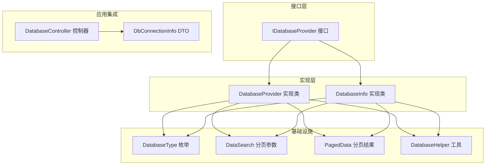
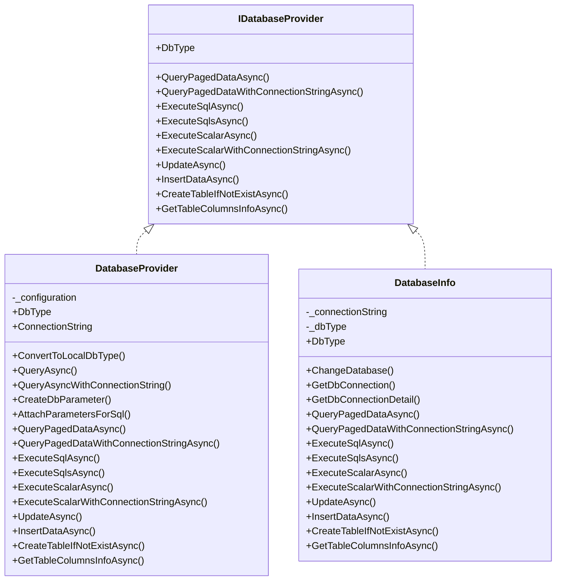
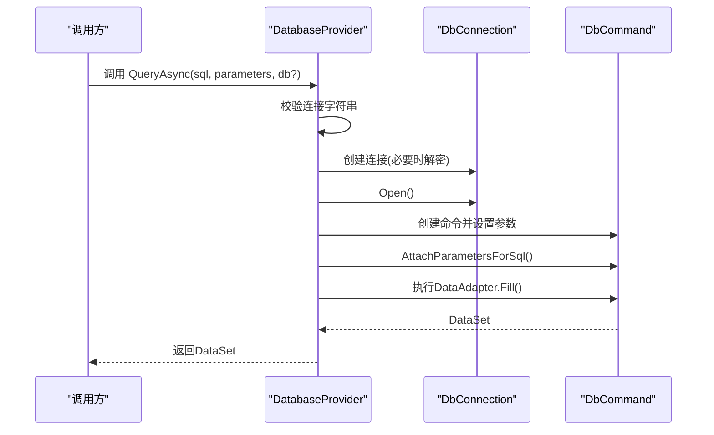
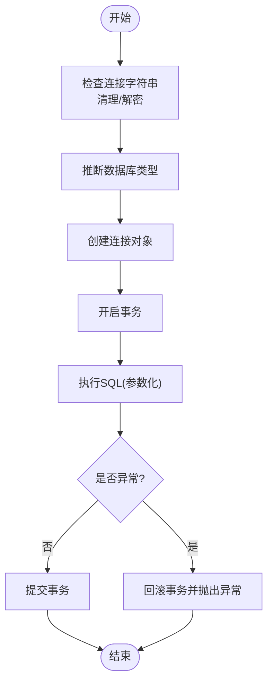
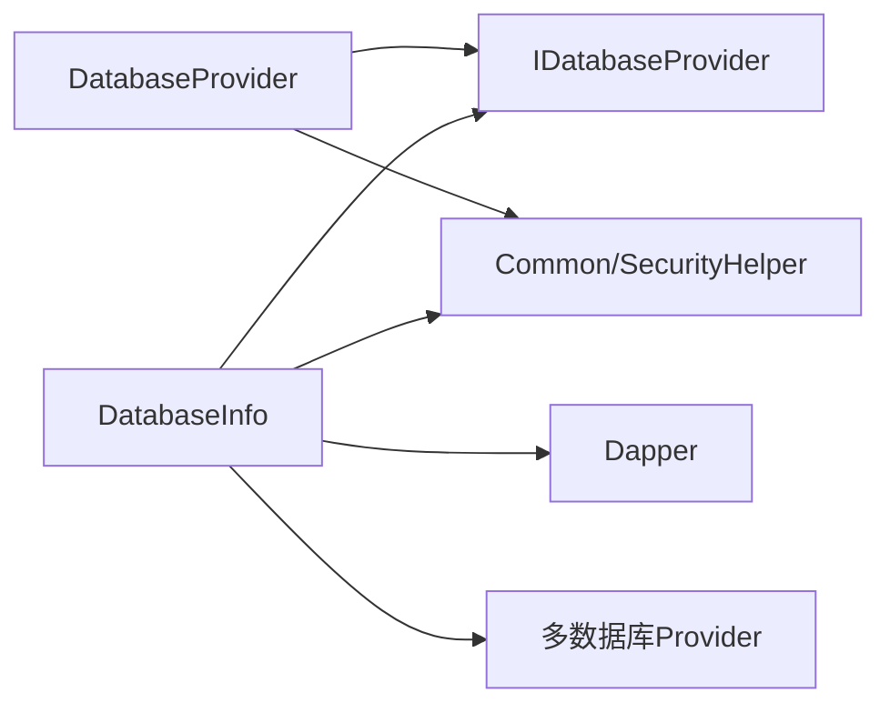

# 数据库提供者核心

<cite>
**本文引用的文件**
- [IDatabaseProvider.cs](file://Sylas.RemoteTasks.Database/IDatabaseProvider.cs)
- [DatabaseProvider.cs](file://Sylas.RemoteTasks.Database/DatabaseProvider.cs)
- [DatabaseInfo.cs](file://Sylas.RemoteTasks.Database/SyncBase/DatabaseInfo.cs)
- [DatabaseType.cs](file://Sylas.RemoteTasks.Database/SyncBase/DatabaseType.cs)
- [DataSearch.cs](file://Sylas.RemoteTasks.Database/SyncBase/DataSearch.cs)
- [PagedData.cs](file://Sylas.RemoteTasks.Database/SyncBase/PagedData.cs)
- [DatabaseHelper.cs](file://Sylas.RemoteTasks.Database/DatabaseHelper.cs)
- [DbConnectionInfo.cs](file://Sylas.RemoteTasks.Database/Dtos/DbConnectionInfo.cs)
- [SecurityTest.cs](file://Sylas.RemoteTasks.Test/Database/SecurityTest.cs)
- [DatabaseController.cs](file://Sylas.RemoteTasks.App/Controllers/DatabaseController.cs)
</cite>

## 目录
1. [简介](#简介)
2. [项目结构](#项目结构)
3. [核心组件](#核心组件)
4. [架构总览](#架构总览)
5. [详细组件分析](#详细组件分析)
6. [依赖关系分析](#依赖关系分析)
7. [性能考量](#性能考量)
8. [故障排查指南](#故障排查指南)
9. [结论](#结论)
10. [附录](#附录)

## 简介
本文件聚焦于数据库提供者核心组件，系统性阐述接口契约、实现类设计、构造函数注入、连接字符串管理、数据库类型检测、参数化查询与安全防护、典型操作方法（分页查询、执行SQL、动态更新、批量插入等）的使用方式与参数配置，并给出错误处理策略与最佳实践。目标读者既包括需要快速上手的开发者，也包括希望深入理解实现细节的架构师。

## 项目结构
围绕数据库提供者的核心代码主要位于以下模块：
- 接口层：定义统一能力边界
- 实现层：提供具体实现
- 基础设施：数据库类型、分页模型、查询构建工具
- 控制器与测试：展示连接字符串加解密与典型调用场景

图表来源
- [IDatabaseProvider.cs](file://Sylas.RemoteTasks.Database/IDatabaseProvider.cs#L12-L97)
- [DatabaseProvider.cs](file://Sylas.RemoteTasks.Database/DatabaseProvider.cs#L19-L484)
- [DatabaseInfo.cs](file://Sylas.RemoteTasks.Database/SyncBase/DatabaseInfo.cs#L64-L88)
- [DatabaseType.cs](file://Sylas.RemoteTasks.Database/SyncBase/DatabaseType.cs#L6-L36)
- [DataSearch.cs](file://Sylas.RemoteTasks.Database/SyncBase/DataSearch.cs#L8-L47)
- [PagedData.cs](file://Sylas.RemoteTasks.Database/SyncBase/PagedData.cs#L10-L44)
- [DatabaseHelper.cs](file://Sylas.RemoteTasks.Database/DatabaseHelper.cs#L20-L225)
- [DbConnectionInfo.cs](file://Sylas.RemoteTasks.Database/Dtos/DbConnectionInfo.cs#L10-L33)
- [DatabaseController.cs](file://Sylas.RemoteTasks.App/Controllers/DatabaseController.cs#L49-L75)

章节来源
- [IDatabaseProvider.cs](file://Sylas.RemoteTasks.Database/IDatabaseProvider.cs#L12-L97)
- [DatabaseProvider.cs](file://Sylas.RemoteTasks.Database/DatabaseProvider.cs#L19-L484)
- [DatabaseInfo.cs](file://Sylas.RemoteTasks.Database/SyncBase/DatabaseInfo.cs#L64-L88)
- [DatabaseType.cs](file://Sylas.RemoteTasks.Database/SyncBase/DatabaseType.cs#L6-L36)
- [DataSearch.cs](file://Sylas.RemoteTasks.Database/SyncBase/DataSearch.cs#L8-L47)
- [PagedData.cs](file://Sylas.RemoteTasks.Database/SyncBase/PagedData.cs#L10-L44)
- [DatabaseHelper.cs](file://Sylas.RemoteTasks.Database/DatabaseHelper.cs#L20-L225)
- [DbConnectionInfo.cs](file://Sylas.RemoteTasks.Database/Dtos/DbConnectionInfo.cs#L10-L33)
- [DatabaseController.cs](file://Sylas.RemoteTasks.App/Controllers/DatabaseController.cs#L49-L75)

## 核心组件
- 接口 IDatabaseProvider：定义数据库基本操作契约，包括分页查询、执行SQL、动态更新、批量插入、建表、列信息查询等。
- 实现类 DatabaseProvider：基于 System.Data.Common 的通用实现，负责连接字符串管理、参数化、类型映射、事务封装与安全处理。
- 实现类 DatabaseInfo：基于 Dapper 的高性能实现，支持多数据库类型、参数化、事务、批量迁移、备份/恢复等高级功能。
- 基础设施：
  - DatabaseType：枚举数据库类型（MySql、SqlServer、Oracle、Pg、Dm、Sqlite、MsSqlLocalDb）。
  - DataSearch：分页查询参数模型。
  - PagedData：分页结果模型。
  - DatabaseHelper：数据库连接字符串生成、类型识别等辅助方法。

章节来源
- [IDatabaseProvider.cs](file://Sylas.RemoteTasks.Database/IDatabaseProvider.cs#L12-L97)
- [DatabaseProvider.cs](file://Sylas.RemoteTasks.Database/DatabaseProvider.cs#L19-L484)
- [DatabaseInfo.cs](file://Sylas.RemoteTasks.Database/SyncBase/DatabaseInfo.cs#L64-L88)
- [DatabaseType.cs](file://Sylas.RemoteTasks.Database/SyncBase/DatabaseType.cs#L6-L36)
- [DataSearch.cs](file://Sylas.RemoteTasks.Database/SyncBase/DataSearch.cs#L8-L47)
- [PagedData.cs](file://Sylas.RemoteTasks.Database/SyncBase/PagedData.cs#L10-L44)
- [DatabaseHelper.cs](file://Sylas.RemoteTasks.Database/DatabaseHelper.cs#L20-L225)

## 架构总览
数据库提供者采用“接口 + 多实现”的架构，既提供轻量通用实现（DatabaseProvider），也提供高性能企业级实现（DatabaseInfo）。两者均遵循 IDatabaseProvider 契约，便于在不同场景灵活切换。

图表来源
- [IDatabaseProvider.cs](file://Sylas.RemoteTasks.Database/IDatabaseProvider.cs#L12-L97)
- [DatabaseProvider.cs](file://Sylas.RemoteTasks.Database/DatabaseProvider.cs#L19-L484)
- [DatabaseInfo.cs](file://Sylas.RemoteTasks.Database/SyncBase/DatabaseInfo.cs#L64-L88)

## 详细组件分析

### 接口 IDatabaseProvider 契约
- 数据库类型属性：DbType，用于标识当前连接的数据库类型。
- 分页查询：
  - QueryPagedDataAsync<T>：按 DataSearch 条件分页查询，支持切换数据库（db 参数）。
  - QueryPagedDataWithConnectionStringAsync<T>：通过传入连接字符串直接切换数据库。
- 执行类操作：
  - ExecuteSqlAsync：执行单条增删改，返回受影响行数。
  - ExecuteSqlsAsync：执行多条增删改，累计返回受影响行数。
  - ExecuteScalarAsync：执行查询并返回单一数值。
  - ExecuteScalarWithConnectionStringAsync：通过连接字符串执行查询并返回单一数值。
- 动态更新与写入：
  - UpdateAsync：根据字典动态更新指定表的一条记录。
  - InsertDataAsync：向指定表批量插入字典集合。
- 建表与元数据：
  - CreateTableIfNotExistAsync：若表不存在则按列信息创建。
  - GetTableColumnsInfoAsync：获取表列信息。

章节来源
- [IDatabaseProvider.cs](file://Sylas.RemoteTasks.Database/IDatabaseProvider.cs#L12-L97)

### 实现类 DatabaseProvider 设计与实现
- 构造函数注入：通过 IConfiguration 注入配置，读取默认连接字符串 Default 并进行安全解密。
- 连接字符串管理：
  - DbType 属性通过 DatabaseInfo.GetDbType 基于连接字符串推断数据库类型。
  - 支持 db 参数切换数据库与 connectionString 参数直接覆盖连接。
- 参数化与类型映射：
  - ConvertToLocalDbType：将 C# 类型映射为 SQL Server 对应 SqlDbType。
  - CreateDbParameter：创建参数，自动设置类型与空值处理。
  - AttachParametersForSql：将参数附加到命令。
- 查询与执行流程：
  - QueryAsync/QueryAsyncWithConnectionString：参数化查询，返回 DataSet。
  - ExecuteSqlAsync/ExecuteSqlsAsync/ExecuteScalarAsync：封装事务，参数化执行。
- 安全机制：
  - 连接字符串在执行前进行 AES 解密（当包含空格时判定为加密格式）。
  - 避免拼接 SQL，全部使用参数化。

图表来源
- [DatabaseProvider.cs](file://Sylas.RemoteTasks.Database/DatabaseProvider.cs#L177-L258)

章节来源
- [DatabaseProvider.cs](file://Sylas.RemoteTasks.Database/DatabaseProvider.cs#L19-L484)

### 实现类 DatabaseInfo 设计与实现
- 构造函数注入：读取默认连接字符串，进行清理与解密，推断数据库类型并设置参数占位符。
- 多数据库支持：GetDbConnection 基于连接字符串自动选择对应连接类型（MySql、Oracle、SqlServer、Pg、Sqlite、Dm）。
- 事务封装：ExecuteSqlAsync/ExecuteSqlsAsync/ExecuteScalarAsync 在执行前开启事务，异常回滚，成功提交。
- 高级功能：
  - 备份/恢复：BackupDataAsync/RestoreTablesAsync，支持按表与条件导出导入。
  - 数据迁移：TransferDataAsync，支持跨库/跨表批量迁移。
  - 动态更新：UpdateAsync，自动识别主键、类型转换、更新时间字段。
  - 批量插入：InsertDataAsync，自动类型转换与分批处理。

图表来源
- [DatabaseInfo.cs](file://Sylas.RemoteTasks.Database/SyncBase/DatabaseInfo.cs#L372-L400)
- [DatabaseInfo.cs](file://Sylas.RemoteTasks.Database/SyncBase/DatabaseInfo.cs#L408-L433)
- [DatabaseInfo.cs](file://Sylas.RemoteTasks.Database/SyncBase/DatabaseInfo.cs#L454-L476)

章节来源
- [DatabaseInfo.cs](file://Sylas.RemoteTasks.Database/SyncBase/DatabaseInfo.cs#L64-L88)
- [DatabaseInfo.cs](file://Sylas.RemoteTasks.Database/SyncBase/DatabaseInfo.cs#L150-L163)
- [DatabaseInfo.cs](file://Sylas.RemoteTasks.Database/SyncBase/DatabaseInfo.cs#L372-L400)
- [DatabaseInfo.cs](file://Sylas.RemoteTasks.Database/SyncBase/DatabaseInfo.cs#L408-L433)
- [DatabaseInfo.cs](file://Sylas.RemoteTasks.Database/SyncBase/DatabaseInfo.cs#L454-L476)

### 数据库类型检测与连接字符串管理
- DatabaseType 枚举：统一抽象多数据库类型，便于在不同实现间切换。
- DatabaseHelper：提供连接字符串生成与类型识别辅助方法。
- DatabaseInfo：通过连接字符串解析与正则匹配识别数据库类型，确保后续参数占位符与语法适配正确。

章节来源
- [DatabaseType.cs](file://Sylas.RemoteTasks.Database/SyncBase/DatabaseType.cs#L6-L36)
- [DatabaseHelper.cs](file://Sylas.RemoteTasks.Database/DatabaseHelper.cs#L20-L225)
- [DatabaseInfo.cs](file://Sylas.RemoteTasks.Database/SyncBase/DatabaseInfo.cs#L210-L299)

### 分页查询与参数化安全
- QueryPagedDataAsync<T>：基于 DataSearch 构建分页 SQL 与条件参数，返回 PagedData<T>。
- 参数化安全：
  - 所有输入参数通过字典或对象映射为 DbParameter，避免 SQL 注入。
  - 特定数据库（如 Oracle/Dm）对命名参数符号进行替换，保证兼容性。
  - 连接字符串在执行前进行解密，防止明文泄露。

章节来源
- [DatabaseProvider.cs](file://Sylas.RemoteTasks.Database/DatabaseProvider.cs#L337-L370)
- [DatabaseInfo.cs](file://Sylas.RemoteTasks.Database/SyncBase/DatabaseInfo.cs#L309-L351)
- [DatabaseInfo.cs](file://Sylas.RemoteTasks.Database/SyncBase/DatabaseInfo.cs#L374-L377)

### 动态更新与批量插入
- UpdateAsync：自动识别主键字段、类型转换、更新时间字段，参数化执行。
- InsertDataAsync：自动类型转换、分批处理，避免参数数量超限。

章节来源
- [DatabaseInfo.cs](file://Sylas.RemoteTasks.Database/SyncBase/DatabaseInfo.cs#L497-L504)
- [DatabaseInfo.cs](file://Sylas.RemoteTasks.Database/SyncBase/DatabaseInfo.cs#L559-L570)
- [DatabaseInfo.cs](file://Sylas.RemoteTasks.Database/SyncBase/DatabaseInfo.cs#L612-L663)
- [DatabaseInfo.cs](file://Sylas.RemoteTasks.Database/SyncBase/DatabaseInfo.cs#L720-L725)
- [DatabaseInfo.cs](file://Sylas.RemoteTasks.Database/SyncBase/DatabaseInfo.cs#L1531-L1535)
- [DatabaseInfo.cs](file://Sylas.RemoteTasks.Database/SyncBase/DatabaseInfo.cs#L1543-L1544)

### 连接字符串加解密与应用集成
- 控制器层：对新增/更新的连接字符串进行 AES 加密后入库。
- 测试层：验证连接字符串解密输出，确保安全链路可用。

章节来源
- [DatabaseController.cs](file://Sylas.RemoteTasks.App/Controllers/DatabaseController.cs#L49-L75)
- [SecurityTest.cs](file://Sylas.RemoteTasks.Test/Database/SecurityTest.cs#L19-L25)

## 依赖关系分析
- 耦合与内聚：
  - DatabaseProvider 与 DatabaseInfo 均实现 IDatabaseProvider，保持接口一致性。
  - DatabaseInfo 内部依赖 Dapper、多种 Provider（MySql、Oracle、SqlServer、Pg、Sqlite、Dm）。
- 外部依赖：
  - System.Data.Common、Dapper、Newtonsoft.Json、Microsoft.Extensions.*。
- 潜在循环依赖：
  - 通过接口隔离，避免实现间的直接循环依赖。

图表来源
- [DatabaseProvider.cs](file://Sylas.RemoteTasks.Database/DatabaseProvider.cs#L1-L12)
- [DatabaseInfo.cs](file://Sylas.RemoteTasks.Database/SyncBase/DatabaseInfo.cs#L1-L27)

章节来源
- [DatabaseProvider.cs](file://Sylas.RemoteTasks.Database/DatabaseProvider.cs#L1-L12)
- [DatabaseInfo.cs](file://Sylas.RemoteTasks.Database/SyncBase/DatabaseInfo.cs#L1-L27)

## 性能考量
- 参数化与连接池：统一使用参数化与连接池，减少 SQL 注入风险并提升吞吐。
- 事务批处理：批量插入与迁移采用事务，减少往返次数；注意控制批次大小，避免参数过多。
- 类型转换缓存：DatabaseInfo 对表字段类型转换器进行缓存，降低重复解析成本。
- 大数据处理：备份/恢复与迁移采用流式读取与分批写入，避免内存峰值。

## 故障排查指南
- 连接字符串为空或格式错误
  - 现象：抛出“未指定需要连接的数据库”等异常。
  - 处理：确认 appsettings 中 Default 连接字符串存在且格式正确；必要时使用 WithConnectionString 方法传入临时连接。
- 连接字符串被加密但未解密
  - 现象：连接失败或提示不可识别的连接字符串。
  - 处理：确保连接字符串包含空格或符合加密格式，执行前会自动解密。
- 参数占位符不匹配
  - 现象：Oracle/Dm 等数据库报参数名不匹配。
  - 处理：DatabaseInfo 会自动将 @ 符号替换为 :，保持参数占位符一致。
- 事务异常导致回滚
  - 现象：执行失败时事务回滚。
  - 处理：捕获异常后查看日志，修正 SQL 或参数后再试。
- 表不存在
  - 现象：插入或迁移时报“表不存在”。
  - 处理：使用 CreateTableIfNotExistAsync 自动创建表结构。

章节来源
- [DatabaseProvider.cs](file://Sylas.RemoteTasks.Database/DatabaseProvider.cs#L179-L182)
- [DatabaseInfo.cs](file://Sylas.RemoteTasks.Database/SyncBase/DatabaseInfo.cs#L374-L377)
- [DatabaseInfo.cs](file://Sylas.RemoteTasks.Database/SyncBase/DatabaseInfo.cs#L388-L396)
- [DatabaseInfo.cs](file://Sylas.RemoteTasks.Database/SyncBase/DatabaseInfo.cs#L744-L759)

## 结论
数据库提供者核心通过清晰的接口契约与双实现策略，在通用性与高性能之间取得平衡。DatabaseProvider 提供简洁易用的参数化查询与执行能力；DatabaseInfo 提供企业级的多数据库支持、事务封装、批量迁移与备份恢复能力。配合连接字符串加解密与严格的参数化策略，整体具备良好的安全性与可维护性。

## 附录
- 最佳实践清单
  - 优先使用参数化查询，避免字符串拼接。
  - 使用事务封装批量操作，确保一致性。
  - 对连接字符串进行加密存储，运行时解密使用。
  - 合理设置分页大小与批处理大小，兼顾性能与稳定性。
  - 明确主键与类型转换，避免隐式转换带来的性能损耗。
- 常用方法速查
  - 分页查询：QueryPagedDataAsync<T>/WithConnectionStringAsync
  - 执行SQL：ExecuteSqlAsync/ExecuteSqlsAsync/ExecuteScalarAsync/WithConnectionStringAsync
  - 动态更新：UpdateAsync
  - 批量插入：InsertDataAsync
  - 建表：CreateTableIfNotExistAsync
  - 元数据：GetTableColumnsInfoAsync